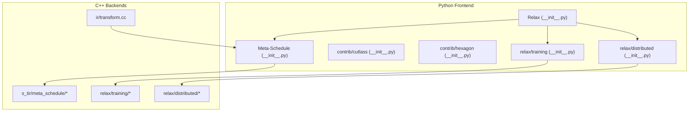
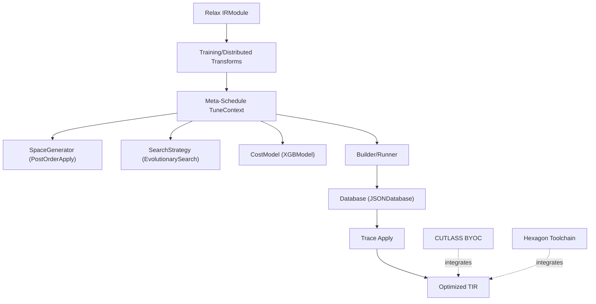
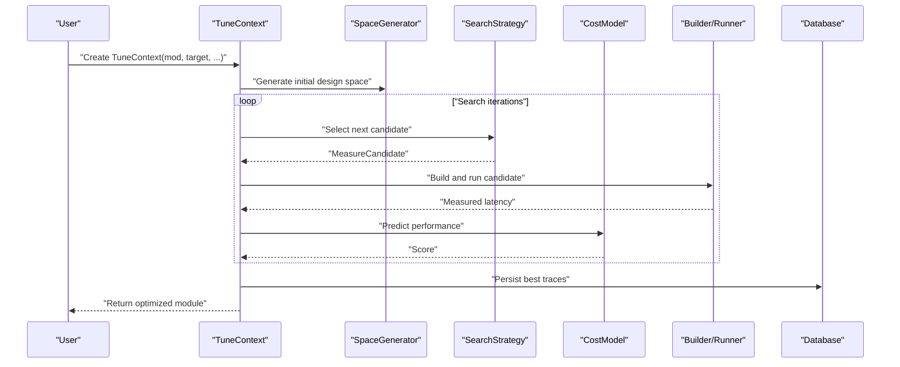
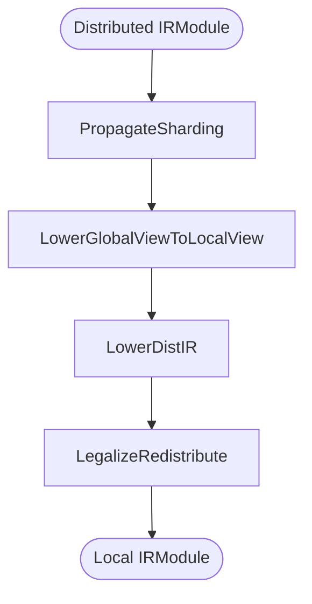
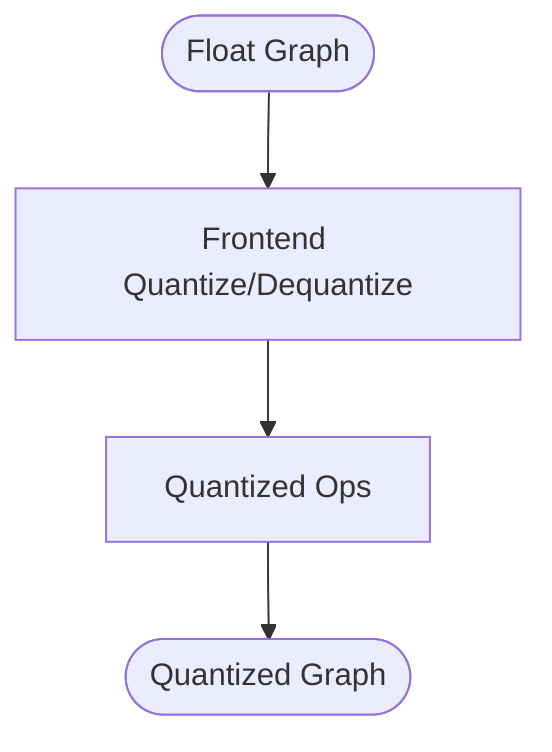
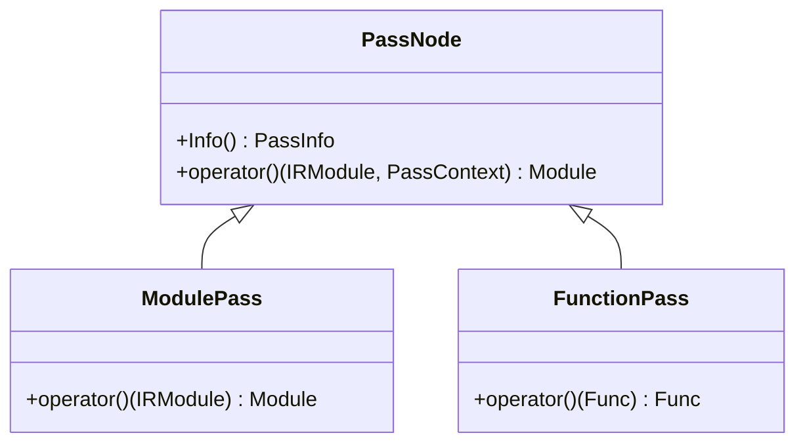
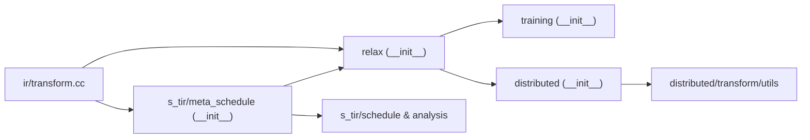

# Advanced Features

<cite>
**Referenced Files in This Document**
- [python/tvm/relax/__init__.py](file://python/tvm/relax/__init__.py)
- [python/tvm/s_tir/meta_schedule/__init__.py](file://python/tvm/s_tir/meta_schedule/__init__.py)
- [python/tvm/contrib/cutlass/__init__.py](file://python/tvm/contrib/cutlass/__init__.py)
- [python/tvm/contrib/hexagon/__init__.py](file://python/tvm/contrib/hexagon/__init__.py)
- [python/tvm/relax/training/__init__.py](file://python/tvm/relax/training/__init__.py)
- [python/tvm/relax/distributed/__init__.py](file://python/tvm/relax/distributed/__init__.py)
- [src/relax/training/utils.cc](file://src/relax/training/utils.cc)
- [src/relax/distributed/axis_group_graph.cc](file://src/relax/distributed/axis_group_graph.cc)
- [src/relax/distributed/global_info.cc](file://src/relax/distributed/global_info.cc)
- [src/relax/distributed/struct_info.cc](file://src/relax/distributed/struct_info.cc)
- [src/relax/distributed/transform/lower_distir.cc](file://src/relax/distributed/transform/lower_distir.cc)
- [src/relax/distributed/transform/lower_global_view_to_local_view.cc](file://src/relax/distributed/transform/lower_global_view_to_local_view.cc)
- [src/relax/distributed/transform/propagate_sharding.cc](file://src/relax/distributed/transform/propagate_sharding.cc)
- [src/relax/distributed/transform/legalize_redistribute.cc](file://src/relax/distributed/transform/legalize_redistribute.cc)
- [src/relax/distributed/transform/utils.cc](file://src/relax/distributed/transform/utils.cc)
- [src/relax/distributed/transform/utils.h](file://src/relax/distributed/transform/utils.h)
- [src/s_tir/meta_schedule/tune_context.cc](file://src/s_tir/meta_schedule/tune_context.cc)
- [src/s_tir/meta_schedule/tune_context.h](file://src/s_tir/meta_schedule/tune_context.h)
- [src/s_tir/meta_schedule/builder/builder.cc](file://src/s_tir/meta_schedule/builder/builder.cc)
- [src/s_tir/meta_schedule/runner/runner.cc](file://src/s_tir/meta_schedule/runner/runner.cc)
- [src/s_tir/meta_schedule/database/json_database.cc](file://src/s_tir/meta_schedule/database/json_database.cc)
- [src/s_tir/meta_schedule/search_strategy/evolutionary_search.cc](file://src/s_tir/meta_schedule/search_strategy/evolutionary_search.cc)
- [src/s_tir/meta_schedule/space_generator/post_order_apply.cc](file://src/s_tir/meta_schedule/space_generator/post_order_apply.cc)
- [src/s_tir/meta_schedule/cost_model/xgb_model.cc](file://src/s_tir/meta_schedule/cost_model/xgb_model.cc)
- [src/s_tir/meta_schedule/task_scheduler/gradient_based_scheduler.cc](file://src/s_tir/meta_schedule/task_scheduler/gradient_based_scheduler.cc)
- [src/s_tir/meta_schedule/trace_apply/trace_apply.cc](file://src/s_tir/meta_schedule/trace_apply/trace_apply.cc)
- [src/s_tir/meta_schedule/post_optimization/post_opt.cc](file://src/s_tir/meta_schedule/post_optimization/post_opt.cc)
- [src/s_tir/schedule/schedule.h](file://src/s_tir/schedule/schedule.h)
- [src/s_tir/analysis.h](file://src/s_tir/analysis.h)
- [src/s_tir/transform.h](file://src/s_tir/transform.h)
- [src/ir/transform.cc](file://src/ir/transform.cc)
- [docs/deep_dive/tensor_ir/tutorials/meta_schedule.py](file://docs/deep_dive/tensor_ir/tutorials/meta_schedule.py)
- [docs/deep_dive/tensor_ir/tutorials/dlight_gpu_scheduling.py](file://docs/deep_dive/tensor_ir/tutorials/dlight_gpu_scheduling.py)
- [tests/python/relax/test_transform_meta_schedule_tuning.py](file://tests/python/relax/test_transform_meta_schedule_tuning.py)
- [tests/python/relax/distributed/test_distributed_transform_lower_distir.py](file://tests/python/relax/distributed/test_distributed_transform_lower_distir.py)
- [tests/python/relax/distributed/test_distributed_transform_lower_global_to_local_view.py](file://tests/python/relax/distributed/test_distributed_transform_lower_global_to_local_view.py)
- [tests/python/relax/distributed/test_distributed_transform_propagate_sharding.py](file://tests/python/relax/distributed/test_distributed_transform_propagate_sharding.py)
- [tests/python/relax/test_frontend_onnx.py](file://tests/python/relax/test_frontend_onnx.py)
- [tests/python/relax/frontend/tflite/tflite_frontend.py](file://tests/python/relax/frontend/tflite/tflite_frontend.py)
- [tests/python/relax/test_optimize_layout_transform.py](file://tests/python/relax/test_optimize_layout_transform.py)
- [tests/python/relax/test_transform_alter_op_impl.py](file://tests/python/relax/test_transform_alter_op_impl.py)
- [tests/python/relax/test_transform_rewrite_cuda_graph.py](file://tests/python/relax/test_transform_rewrite_cuda_graph.py)
- [tests/python/runtime/test_runtime_rpc.py](file://tests/python/runtime/test_runtime_rpc.py)
- [python/tvm/rpc/client.py](file://python/tvm/rpc/client.py)
- [python/tvm/rpc/tracker.py](file://python/tvm/rpc/tracker.py)
- [python/tvm/contrib/hexagon/build.py](file://python/tvm/contrib/hexagon/build.py)
- [python/tvm/contrib/hexagon/tools.py](file://python/tvm/contrib/hexagon/tools.py)
- [docs/arch/pass_infra.rst](file://docs/arch/pass_infra.rst)
- [tests/python/relax/conftest.py](file://tests/python/relax/conftest.py)
</cite>

## Table of Contents
1. [Introduction](#introduction)
2. [Project Structure](#project-structure)
3. [Core Components](#core-components)
4. [Architecture Overview](#architecture-overview)
5. [Detailed Component Analysis](#detailed-component-analysis)
6. [Dependency Analysis](#dependency-analysis)
7. [Performance Considerations](#performance-considerations)
8. [Troubleshooting Guide](#troubleshooting-guide)
9. [Conclusion](#conclusion)
10. [Appendices](#appendices)

## Introduction
This document presents TVM’s advanced features for researchers and advanced users focusing on:
- Automatic kernel optimization via the meta-scheduling system
- Distributed training and inference patterns
- Quantization and model compression techniques
- The Relax frontend for graph-level operations and training utilities
- Specialized acceleration library integrations (CUTLASS, Hexagon)
- Advanced optimization passes and custom transformations
- Practical examples: automated tuning, distributed model training, mixed precision optimization, and hardware-specific optimizations
- Extension mechanisms for custom passes, operators, and optimization strategies
- Performance analysis, benchmarking methodologies, and advanced debugging techniques

## Project Structure
TVM organizes advanced capabilities across Python APIs, C++ backends, and documentation. Key areas include:
- Relax frontend and training/distributed modules exposed via Python namespaces
- Meta-scheduling infrastructure for automatic TIR kernel tuning
- BYOC integrations for CUTLASS and Hexagon toolchains
- Pass infrastructure enabling extensible optimization pipelines
- Comprehensive tests and tutorials validating advanced workflows

**Diagram sources**
- [python/tvm/relax/__init__.py:1-123](file://python/tvm/relax/__init__.py#L1-L123)
- [python/tvm/s_tir/meta_schedule/__init__.py:1-58](file://python/tvm/s_tir/meta_schedule/__init__.py#L1-L58)
- [python/tvm/contrib/cutlass/__init__.py:1-21](file://python/tvm/contrib/cutlass/__init__.py#L1-L21)
- [python/tvm/contrib/hexagon/__init__.py:1-20](file://python/tvm/contrib/hexagon/__init__.py#L1-L20)
- [python/tvm/relax/training/__init__.py:1-28](file://python/tvm/relax/training/__init__.py#L1-L28)
- [python/tvm/relax/distributed/__init__.py:1-25](file://python/tvm/relax/distributed/__init__.py#L1-L25)
- [src/ir/transform.cc:166-196](file://src/ir/transform.cc#L166-L196)

**Section sources**
- [python/tvm/relax/__init__.py:1-123](file://python/tvm/relax/__init__.py#L1-L123)
- [python/tvm/s_tir/meta_schedule/__init__.py:1-58](file://python/tvm/s_tir/meta_schedule/__init__.py#L1-L58)
- [python/tvm/contrib/cutlass/__init__.py:1-21](file://python/tvm/contrib/cutlass/__init__.py#L1-L21)
- [python/tvm/contrib/hexagon/__init__.py:1-20](file://python/tvm/contrib/hexagon/__init__.py#L1-L20)
- [python/tvm/relax/training/__init__.py:1-28](file://python/tvm/relax/training/__init__.py#L1-L28)
- [python/tvm/relax/distributed/__init__.py:1-25](file://python/tvm/relax/distributed/__init__.py#L1-L25)
- [src/ir/transform.cc:166-196](file://src/ir/transform.cc#L166-L196)

## Core Components
- Meta-Scheduling: Automated TIR kernel tuning with design space generation, search strategies, cost modeling, and persistent databases.
- Relax Training: Training utilities including optimizers, loss functions, and trainer setup.
- Relax Distributed: Graph-level distributed computation abstractions and transforms for sharding propagation, lowering, and redistribution.
- Quantization and Compression: Frontend support for quantized ops and conversions across formats (ONNX, TFLite).
- Specialized Libraries: CUTLASS BYOC and Hexagon toolchain integrations.
- Pass Infrastructure: Hierarchical pass manager enabling custom passes and debugging.

**Section sources**
- [python/tvm/s_tir/meta_schedule/__init__.py:19-58](file://python/tvm/s_tir/meta_schedule/__init__.py#L19-L58)
- [python/tvm/relax/training/__init__.py:18-28](file://python/tvm/relax/training/__init__.py#L18-L28)
- [python/tvm/relax/distributed/__init__.py:19-25](file://python/tvm/relax/distributed/__init__.py#L19-L25)
- [python/tvm/contrib/cutlass/__init__.py:18-21](file://python/tvm/contrib/cutlass/__init__.py#L18-L21)
- [python/tvm/contrib/hexagon/__init__.py:17-20](file://python/tvm/contrib/hexagon/__init__.py#L17-L20)
- [docs/arch/pass_infra.rst:54-196](file://docs/arch/pass_infra.rst#L54-L196)

## Architecture Overview
The advanced feature stack integrates:
- Meta-scheduling orchestrating design space exploration and measurement
- Relax IR serving as the high-level graph for training and distributed computation
- Specialized backends for hardware-specific kernels and toolchains
- Pass infrastructure enabling composability and extensibility

**Diagram sources**
- [docs/deep_dive/tensor_ir/tutorials/meta_schedule.py:38-307](file://docs/deep_dive/tensor_ir/tutorials/meta_schedule.py#L38-L307)
- [src/s_tir/meta_schedule/tune_context.cc:29-59](file://src/s_tir/meta_schedule/tune_context.cc#L29-L59)
- [src/s_tir/meta_schedule/space_generator/post_order_apply.cc:1-200](file://src/s_tir/meta_schedule/space_generator/post_order_apply.cc#L1-L200)
- [src/s_tir/meta_schedule/search_strategy/evolutionary_search.cc:1-200](file://src/s_tir/meta_schedule/search_strategy/evolutionary_search.cc#L1-L200)
- [src/s_tir/meta_schedule/cost_model/xgb_model.cc:1-200](file://src/s_tir/meta_schedule/cost_model/xgb_model.cc#L1-L200)
- [src/s_tir/meta_schedule/builder/builder.cc:1-200](file://src/s_tir/meta_schedule/builder/builder.cc#L1-L200)
- [src/s_tir/meta_schedule/runner/runner.cc:1-200](file://src/s_tir/meta_schedule/runner/runner.cc#L1-L200)
- [src/s_tir/meta_schedule/database/json_database.cc:1-200](file://src/s_tir/meta_schedule/database/json_database.cc#L1-L200)
- [src/s_tir/meta_schedule/trace_apply/trace_apply.cc:1-200](file://src/s_tir/meta_schedule/trace_apply/trace_apply.cc#L1-L200)
- [python/tvm/contrib/cutlass/__init__.py:18-21](file://python/tvm/contrib/cutlass/__init__.py#L18-L21)
- [python/tvm/contrib/hexagon/__init__.py:17-20](file://python/tvm/contrib/hexagon/__init__.py#L17-L20)

## Detailed Component Analysis

### Meta-Scheduling System for Automatic Kernel Optimization
- Purpose: Automatically discover high-quality TIR schedules by exploring a design space and measuring on real hardware.
- Key elements:
  - TuneContext: Holds module, target, space generator, search strategy, and randomness.
  - SpaceGenerator: Applies schedule rules to blocks (default: PostOrderApply).
  - SearchStrategy: Evolutionary search guided by a cost model (default: XGBModel).
  - Builder/Runner: Compile and execute candidates on target devices.
  - Database: Persists tuning records for reuse.
  - TaskScheduler: Allocates tasks (e.g., GradientBasedScheduler).
  - TraceApply: Applies discovered schedules to TIR.
  - PostOptimization: Optional post-hoc optimizations.

**Diagram sources**
- [src/s_tir/meta_schedule/tune_context.cc:29-59](file://src/s_tir/meta_schedule/tune_context.cc#L29-L59)
- [src/s_tir/meta_schedule/space_generator/post_order_apply.cc:1-200](file://src/s_tir/meta_schedule/space_generator/post_order_apply.cc#L1-L200)
- [src/s_tir/meta_schedule/search_strategy/evolutionary_search.cc:1-200](file://src/s_tir/meta_schedule/search_strategy/evolutionary_search.cc#L1-L200)
- [src/s_tir/meta_schedule/cost_model/xgb_model.cc:1-200](file://src/s_tir/meta_schedule/cost_model/xgb_model.cc#L1-L200)
- [src/s_tir/meta_schedule/builder/builder.cc:1-200](file://src/s_tir/meta_schedule/builder/builder.cc#L1-L200)
- [src/s_tir/meta_schedule/runner/runner.cc:1-200](file://src/s_tir/meta_schedule/runner/runner.cc#L1-L200)
- [src/s_tir/meta_schedule/database/json_database.cc:1-200](file://src/s_tir/meta_schedule/database/json_database.cc#L1-L200)
- [src/s_tir/meta_schedule/trace_apply/trace_apply.cc:1-200](file://src/s_tir/meta_schedule/trace_apply/trace_apply.cc#L1-L200)

Practical example references:
- Automated tuning with selective operator targeting and persistence of tuning records.
- Complementary workflow with DLight for default schedules, then MetaSchedule for hot-spot kernels.

**Section sources**
- [src/s_tir/meta_schedule/tune_context.cc:29-59](file://src/s_tir/meta_schedule/tune_context.cc#L29-L59)
- [docs/deep_dive/tensor_ir/tutorials/meta_schedule.py:38-307](file://docs/deep_dive/tensor_ir/tutorials/meta_schedule.py#L38-L307)
- [tests/python/relax/test_transform_meta_schedule_tuning.py:146-164](file://tests/python/relax/test_transform_meta_schedule_tuning.py#L146-L164)
- [docs/deep_dive/tensor_ir/tutorials/dlight_gpu_scheduling.py:217-252](file://docs/deep_dive/tensor_ir/tutorials/dlight_gpu_scheduling.py#L217-L252)

### Distributed Training Support
- Graph-level distributed computation:
  - DeviceMesh and Placement abstractions
  - Sharding propagation and lowering to local views
  - Redistribution legalization and global-to-local lowering
- Transform pipeline:
  - PropagateSharding: Infer and propagate shardings across the graph
  - LowerGlobalViewToLocalView: Convert global DTensor views to local tensors
  - LowerDistIR: Lower distributed IR constructs
  - LegalizeRedistribute: Normalize redistribute operations

**Diagram sources**
- [src/relax/distributed/transform/propagate_sharding.cc:1-200](file://src/relax/distributed/transform/propagate_sharding.cc#L1-L200)
- [src/relax/distributed/transform/lower_global_view_to_local_view.cc:1-200](file://src/relax/distributed/transform/lower_global_view_to_local_view.cc#L1-L200)
- [src/relax/distributed/transform/lower_distir.cc:1-200](file://src/relax/distributed/transform/lower_distir.cc#L1-L200)
- [src/relax/distributed/transform/legalize_redistribute.cc:1-200](file://src/relax/distributed/transform/legalize_redistribute.cc#L1-L200)

Validation references:
- Tests demonstrate lowering correctness and sharding propagation across modules and constants.

**Section sources**
- [python/tvm/relax/distributed/__init__.py:19-25](file://python/tvm/relax/distributed/__init__.py#L19-L25)
- [src/relax/distributed/struct_info.cc:1-200](file://src/relax/distributed/struct_info.cc#L1-L200)
- [src/relax/distributed/global_info.cc:1-200](file://src/relax/distributed/global_info.cc#L1-L200)
- [src/relax/distributed/axis_group_graph.cc:1-200](file://src/relax/distributed/axis_group_graph.cc#L1-L200)
- [tests/python/relax/distributed/test_distributed_transform_lower_distir.py:179-194](file://tests/python/relax/distributed/test_distributed_transform_lower_distir.py#L179-L194)
- [tests/python/relax/distributed/test_distributed_transform_lower_global_to_local_view.py:96-124](file://tests/python/relax/distributed/test_distributed_transform_lower_global_to_local_view.py#L96-L124)
- [tests/python/relax/distributed/test_distributed_transform_propagate_sharding.py:189-224](file://tests/python/relax/distributed/test_distributed_transform_propagate_sharding.py#L189-L224)

### Quantization Techniques and Model Compression
- Frontends:
  - ONNX: QuantizeLinear handling singleton qparams and correctness checks
  - TFLite: Quantize/dequantize helpers, requantize, and fake quantization conversion
- Training utilities:
  - Loss functions and optimizers for training-aware quantization workflows
- Compression:
  - Layout transformations and operator replacements to reduce memory bandwidth and improve throughput

**Diagram sources**
- [tests/python/relax/test_frontend_onnx.py:5602-5618](file://tests/python/relax/test_frontend_onnx.py#L5602-L5618)
- [tests/python/relax/frontend/tflite/tflite_frontend.py:547-578](file://tests/python/relax/frontend/tflite/tflite_frontend.py#L547-L578)
- [tests/python/relax/frontend/tflite/tflite_frontend.py:3189-3210](file://tests/python/relax/frontend/tflite/tflite_frontend.py#L3189-L3210)
- [tests/python/relax/test_optimize_layout_transform.py:214-229](file://tests/python/relax/test_optimize_layout_transform.py#L214-L229)
- [tests/python/relax/test_transform_alter_op_impl.py:265-276](file://tests/python/relax/test_transform_alter_op_impl.py#L265-L276)
- [tests/python/relax/test_transform_rewrite_cuda_graph.py:52-70](file://tests/python/relax/test_transform_rewrite_cuda_graph.py#L52-L70)

**Section sources**
- [tests/python/relax/test_frontend_onnx.py:5602-5618](file://tests/python/relax/test_frontend_onnx.py#L5602-L5618)
- [tests/python/relax/frontend/tflite/tflite_frontend.py:547-578](file://tests/python/relax/frontend/tflite/tflite_frontend.py#L547-L578)
- [tests/python/relax/frontend/tflite/tflite_frontend.py:3189-3210](file://tests/python/relax/frontend/tflite/tflite_frontend.py#L3189-L3210)
- [tests/python/relax/test_optimize_layout_transform.py:214-229](file://tests/python/relax/test_optimize_layout_transform.py#L214-L229)
- [tests/python/relax/test_transform_alter_op_impl.py:265-276](file://tests/python/relax/test_transform_alter_op_impl.py#L265-L276)
- [tests/python/relax/test_transform_rewrite_cuda_graph.py:52-70](file://tests/python/relax/test_transform_rewrite_cuda_graph.py#L52-L70)

### Relax Frontend for Graph-Level Operations and Training Utilities
- Exposes IR types, expressions, struct info, VM build utilities, and training/distributed submodules.
- Provides pipelines and utilities for composing Relax-based workflows.

**Section sources**
- [python/tvm/relax/__init__.py:24-123](file://python/tvm/relax/__init__.py#L24-L123)
- [python/tvm/relax/training/__init__.py:18-28](file://python/tvm/relax/training/__init__.py#L18-L28)
- [python/tvm/relax/distributed/__init__.py:19-25](file://python/tvm/relax/distributed/__init__.py#L19-L25)

### Specialized Acceleration Libraries Integration
- CUTLASS BYOC:
  - Build-time detection and module finalization for CUTLASS partitions
- Hexagon:
  - Toolchain integration, shared library linking, and simulator/remote deployment helpers

**Section sources**
- [python/tvm/contrib/cutlass/__init__.py:18-21](file://python/tvm/contrib/cutlass/__init__.py#L18-L21)
- [python/tvm/contrib/hexagon/__init__.py:17-20](file://python/tvm/contrib/hexagon/__init__.py#L17-L20)
- [python/tvm/contrib/hexagon/build.py:660-690](file://python/tvm/contrib/hexagon/build.py#L660-L690)
- [python/tvm/contrib/hexagon/tools.py:167-215](file://python/tvm/contrib/hexagon/tools.py#L167-L215)

### Advanced Optimization Passes and Custom Transformation Development
- Pass Infrastructure:
  - Hierarchical pass manager with module/function-level pass constructs
  - Debugging via instrumentation and pass context
- Scheduling and Analysis:
  - Schedule primitives and analysis utilities for TIR
- Distributed and Training Utilities:
  - Distributed struct info and training utilities implemented in C++

**Diagram sources**
- [src/ir/transform.cc:175-186](file://src/ir/transform.cc#L175-L186)
- [docs/arch/pass_infra.rst:54-196](file://docs/arch/pass_infra.rst#L54-L196)

**Section sources**
- [docs/arch/pass_infra.rst:54-196](file://docs/arch/pass_infra.rst#L54-L196)
- [src/s_tir/schedule/schedule.h:1-200](file://src/s_tir/schedule/schedule.h#L1-L200)
- [src/s_tir/analysis.h:1-200](file://src/s_tir/analysis.h#L1-L200)
- [src/s_tir/transform.h:1-200](file://src/s_tir/transform.h#L1-L200)
- [src/relax/training/utils.cc:1-200](file://src/relax/training/utils.cc#L1-L200)
- [src/relax/distributed/transform/utils.cc:1-200](file://src/relax/distributed/transform/utils.cc#L1-L200)
- [src/relax/distributed/transform/utils.h:1-200](file://src/relax/distributed/transform/utils.h#L1-L200)

### Distributed Computation Patterns and RPC
- Tracker and RPC client enable resource pooling and session management across devices.
- Tests validate registration, queuing, proxy forwarding, and timeouts.

**Section sources**
- [python/tvm/rpc/client.py:540-569](file://python/tvm/rpc/client.py#L540-L569)
- [python/tvm/rpc/tracker.py:17-29](file://python/tvm/rpc/tracker.py#L17-L29)
- [tests/python/runtime/test_runtime_rpc.py:469-644](file://tests/python/runtime/test_runtime_rpc.py#L469-L644)

## Dependency Analysis
- Module-level dependencies:
  - Relax depends on training and distributed submodules
  - Meta-scheduling depends on TIR schedule primitives and analysis
  - Distributed relies on struct info and transform utilities
  - Pass infrastructure underpins all of the above
- External integrations:
  - CUTLASS BYOC and Hexagon toolchain integrate via contrib modules

**Diagram sources**
- [python/tvm/relax/__init__.py:104-117](file://python/tvm/relax/__init__.py#L104-L117)
- [python/tvm/s_tir/meta_schedule/__init__.py:19-58](file://python/tvm/s_tir/meta_schedule/__init__.py#L19-L58)
- [src/ir/transform.cc:166-196](file://src/ir/transform.cc#L166-L196)

**Section sources**
- [python/tvm/relax/__init__.py:104-117](file://python/tvm/relax/__init__.py#L104-L117)
- [python/tvm/s_tir/meta_schedule/__init__.py:19-58](file://python/tvm/s_tir/meta_schedule/__init__.py#L19-L58)
- [src/ir/transform.cc:166-196](file://src/ir/transform.cc#L166-L196)

## Performance Considerations
- MetaSchedule tuning cost trade-offs:
  - DLight for fast defaults; MetaSchedule for hot-spot refinement
  - Use selective tuning with operator names to reduce compile time
- Mixed precision:
  - Quantization frontends and training utilities enable low-precision training and inference
- Hardware-specific optimizations:
  - CUTLASS BYOC and Hexagon toolchain integration for targeted accelerators
- Pass instrumentation:
  - Use pass context instruments to validate IR well-formedness and debug transformations

**Section sources**
- [docs/deep_dive/tensor_ir/tutorials/dlight_gpu_scheduling.py:217-252](file://docs/deep_dive/tensor_ir/tutorials/dlight_gpu_scheduling.py#L217-L252)
- [tests/python/relax/test_transform_meta_schedule_tuning.py:146-164](file://tests/python/relax/test_transform_meta_schedule_tuning.py#L146-L164)
- [tests/python/relax/test_frontend_onnx.py:5602-5618](file://tests/python/relax/test_frontend_onnx.py#L5602-L5618)
- [tests/python/relax/frontend/tflite/tflite_frontend.py:547-578](file://tests/python/relax/frontend/tflite/tflite_frontend.py#L547-L578)
- [tests/python/relax/conftest.py:67-85](file://tests/python/relax/conftest.py#L67-L85)

## Troubleshooting Guide
- RPC and Tracker:
  - Validate tracker registration and queue states; confirm proxy forwarding and session timeouts
- MetaSchedule:
  - Inspect tuning records persisted in the database; ensure design space and search strategy configurations align with targets
- Distributed:
  - Verify sharding propagation and lowering steps; confirm device meshes and placements
- Pass Debugging:
  - Enable pass context instruments to enforce well-formedness checks before and after transforms

**Section sources**
- [tests/python/runtime/test_runtime_rpc.py:469-644](file://tests/python/runtime/test_runtime_rpc.py#L469-L644)
- [src/s_tir/meta_schedule/database/json_database.cc:1-200](file://src/s_tir/meta_schedule/database/json_database.cc#L1-L200)
- [tests/python/relax/distributed/test_distributed_transform_propagate_sharding.py:189-224](file://tests/python/relax/distributed/test_distributed_transform_propagate_sharding.py#L189-L224)
- [tests/python/relax/conftest.py:67-85](file://tests/python/relax/conftest.py#L67-L85)

## Conclusion
TVM’s advanced features provide a comprehensive toolkit for automatic kernel optimization, distributed training, quantization, and hardware-specific acceleration. The meta-scheduling system complements deterministic scheduling strategies, while Relax enables expressive graph-level training and distributed computation. Specialized integrations and a flexible pass infrastructure allow researchers and advanced users to push the boundaries of compiler optimizations with robust debugging and benchmarking support.

## Appendices
- Practical examples:
  - Automated tuning with selective operator targeting and database persistence
  - Distributed lowering and sharding propagation across modules
  - Quantization frontends for ONNX and TFLite with layout and operator transformations
- Extension mechanisms:
  - Add custom passes via the pass infrastructure
  - Integrate new operators through Relax and TIR
  - Develop custom optimization strategies within MetaSchedule

[No sources needed since this section summarizes without analyzing specific files]