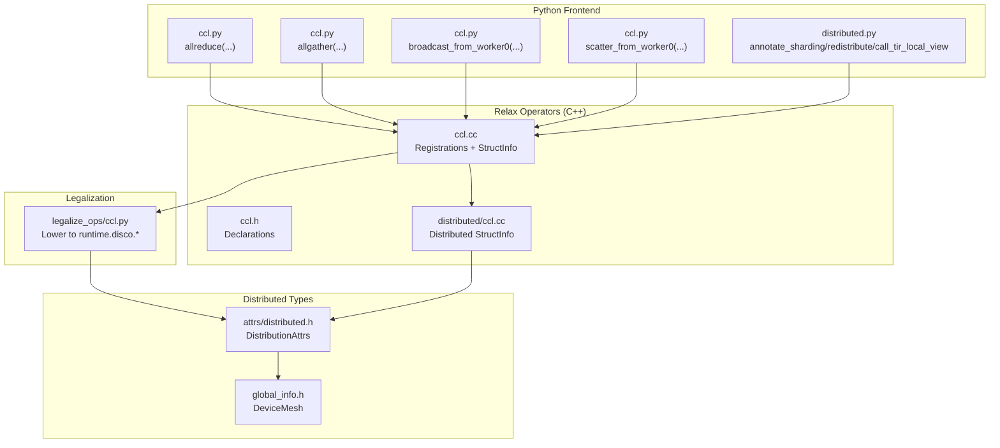
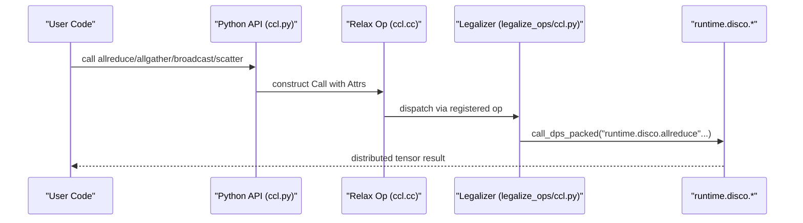
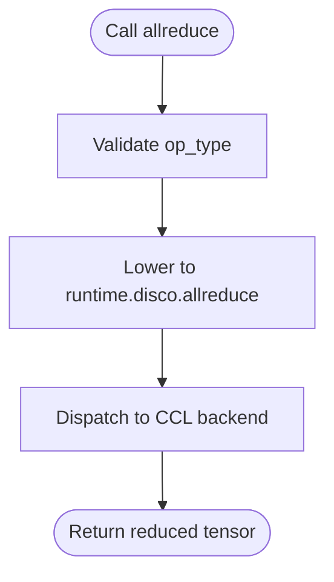
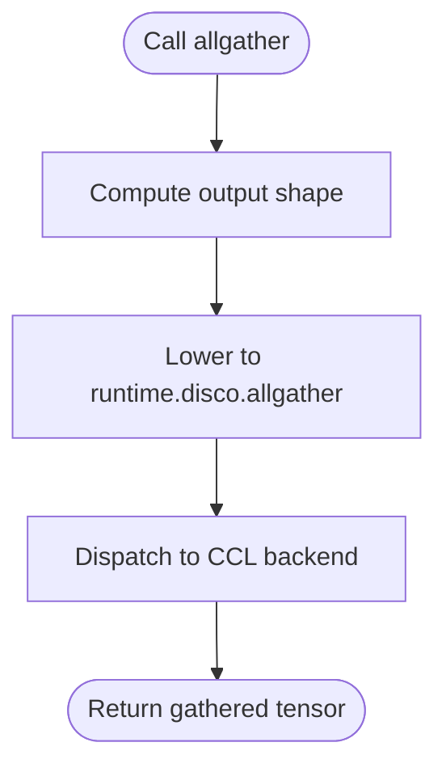
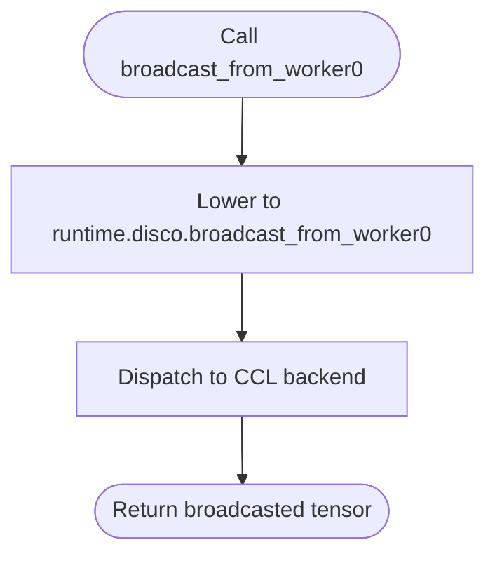
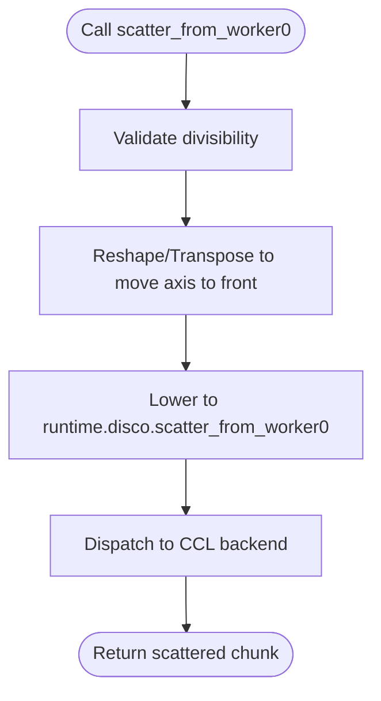
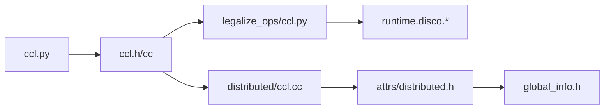

# Collective Communication Operations

<cite>
**Referenced Files in This Document**
- [ccl.h](file://include/tvm/relax/attrs/ccl.h)
- [ccl.h](file://src/relax/op/ccl/ccl.h)
- [ccl.cc](file://src/relax/op/ccl/ccl.cc)
- [ccl.py](file://python/tvm/relax/op/ccl/ccl.py)
- [distributed/ccl.cc](file://src/relax/op/distributed/ccl.cc)
- [legalize_ops/ccl.py](file://python/tvm/relax/transform/legalize_ops/ccl.py)
- [distributed.py](file://python/tvm/relax/op/distributed/distributed.py)
- [distributed.h](file://include/tvm/relax/attrs/distributed.h)
- [global_info.h](file://include/tvm/relax/distributed/global_info.h)
- [test_op_ccl.py](file://tests/python/relax/test_op_ccl.py)
- [test_ccl.py](file://tests/python/disco/test_ccl.py)
</cite>

## Table of Contents
1. [Introduction](#introduction)
2. [Project Structure](#project-structure)
3. [Core Components](#core-components)
4. [Architecture Overview](#architecture-overview)
5. [Detailed Component Analysis](#detailed-component-analysis)
6. [Dependency Analysis](#dependency-analysis)
7. [Performance Considerations](#performance-considerations)
8. [Troubleshooting Guide](#troubleshooting-guide)
9. [Conclusion](#conclusion)
10. [Appendices](#appendices)

## Introduction
This document describes TVM’s collective communication operations in the Relax frontend. It covers supported operators (allreduce, allgather, broadcast, scatter-from-worker0), operator attributes, data type support, reduction functions, and integration with distributed training. It also explains how these operators are legalized to runtime collectives, how they fit into distributed training workflows (gradient synchronization, parameter server patterns), automatic differentiation support, pipeline parallelism coordination, memory optimization, operator fusion, communication-computation overlap, and performance tuning across cluster configurations.

## Project Structure
The collective communication library in Relax is organized around:
- Python front-end operators that expose high-level APIs
- C++ operator definitions and structural inference
- Legalization transforms that lower Relax CCL ops to runtime-dispatched collectives
- Distributed attributes and device mesh abstractions
- Tests validating correctness and runtime behavior

**Diagram sources**
- [ccl.py:23-109](file://python/tvm/relax/op/ccl/ccl.py#L23-L109)
- [ccl.h:35-46](file://src/relax/op/ccl/ccl.h#L35-L46)
- [ccl.cc:37-177](file://src/relax/op/ccl/ccl.cc#L37-L177)
- [distributed/ccl.cc:27-39](file://src/relax/op/distributed/ccl.cc#L27-L39)
- [legalize_ops/ccl.py:30-129](file://python/tvm/relax/transform/legalize_ops/ccl.py#L30-L129)
- [distributed.h:35-49](file://include/tvm/relax/attrs/distributed.h#L35-L49)
- [global_info.h:37-67](file://include/tvm/relax/distributed/global_info.h#L37-L67)

**Section sources**
- [ccl.py:1-109](file://python/tvm/relax/op/ccl/ccl.py#L1-L109)
- [ccl.h:1-51](file://src/relax/op/ccl/ccl.h#L1-L51)
- [ccl.cc:1-177](file://src/relax/op/ccl/ccl.cc#L1-L177)
- [distributed/ccl.cc:1-44](file://src/relax/op/distributed/ccl.cc#L1-L44)
- [legalize_ops/ccl.py:1-129](file://python/tvm/relax/transform/legalize_ops/ccl.py#L1-L129)
- [distributed.h:1-55](file://include/tvm/relax/attrs/distributed.h#L1-L55)
- [global_info.h:1-74](file://include/tvm/relax/distributed/global_info.h#L1-L74)

## Core Components
- AllReduce: Performs a reduction across workers. Supported reduction functions include sum, prod, min, max, avg. Attributes include op_type and in_group.
- AllGather: Gathers tensors from all workers along a specified axis (default leading axis). Attributes include num_workers and in_group.
- Broadcast from Worker-0: Broadcasts a tensor from worker-0 to all other workers.
- Scatter from Worker-0: Splits a tensor into equal chunks along a given axis and sends each chunk to a distinct worker. Requires divisibility along the chosen axis.

Operator attributes and supported reductions are defined in the Relax attributes header and enforced in Python front-end checks. Structural inference ensures shape propagation and dtype preservation.

**Section sources**
- [ccl.h:33-86](file://include/tvm/relax/attrs/ccl.h#L33-L86)
- [ccl.cc:37-177](file://src/relax/op/ccl/ccl.cc#L37-L177)
- [ccl.py:23-109](file://python/tvm/relax/op/ccl/ccl.py#L23-L109)
- [test_op_ccl.py:27-278](file://tests/python/relax/test_op_ccl.py#L27-L278)

## Architecture Overview
The end-to-end flow from Relax CCL operators to runtime collectives:

**Diagram sources**
- [ccl.py:23-109](file://python/tvm/relax/op/ccl/ccl.py#L23-L109)
- [ccl.cc:56-177](file://src/relax/op/ccl/ccl.cc#L56-L177)
- [legalize_ops/ccl.py:30-129](file://python/tvm/relax/transform/legalize_ops/ccl.py#L30-L129)

## Detailed Component Analysis

### AllReduce
- Purpose: Reduce tensors across workers using a specified operation.
- Attributes:
  - op_type: One of sum, prod, min, max, avg.
  - in_group: Whether to perform within a group or globally.
- Legalization: Lowered to runtime.disco.allreduce with mapped operation index.
- Structural inference: Preserves input tensor struct info.

**Diagram sources**
- [ccl.cc:56-62](file://src/relax/op/ccl/ccl.cc#L56-L62)
- [legalize_ops/ccl.py:30-49](file://python/tvm/relax/transform/legalize_ops/ccl.py#L30-L49)

**Section sources**
- [ccl.h:33-48](file://include/tvm/relax/attrs/ccl.h#L33-L48)
- [ccl.cc:51-62](file://src/relax/op/ccl/ccl.cc#L51-L62)
- [legalize_ops/ccl.py:30-49](file://python/tvm/relax/transform/legalize_ops/ccl.py#L30-L49)
- [test_op_ccl.py:39-89](file://tests/python/relax/test_op_ccl.py#L39-L89)

### AllGather
- Purpose: Gather tensors from all workers along the leading dimension.
- Attributes:
  - num_workers: Number of participating workers.
  - in_group: Group-aware operation.
- Legalization: Computes output shape and lowers to runtime.disco.allgather.
- Structural inference: Multiplies the leading dimension by num_workers.

**Diagram sources**
- [ccl.cc:96-101](file://src/relax/op/ccl/ccl.cc#L96-L101)
- [legalize_ops/ccl.py:52-74](file://python/tvm/relax/transform/legalize_ops/ccl.py#L52-L74)

**Section sources**
- [ccl.h:51-67](file://include/tvm/relax/attrs/ccl.h#L51-L67)
- [ccl.cc:80-101](file://src/relax/op/ccl/ccl.cc#L80-L101)
- [legalize_ops/ccl.py:52-74](file://python/tvm/relax/transform/legalize_ops/ccl.py#L52-L74)
- [test_op_ccl.py:91-143](file://tests/python/relax/test_op_ccl.py#L91-L143)

### Broadcast from Worker-0
- Purpose: Replicate a tensor from worker-0 to all other workers.
- Legalization: Lowered to runtime.disco.broadcast_from_worker0.
- Structural inference: Preserves input struct info.

**Diagram sources**
- [ccl.cc:119-125](file://src/relax/op/ccl/ccl.cc#L119-L125)
- [legalize_ops/ccl.py:77-83](file://python/tvm/relax/transform/legalize_ops/ccl.py#L77-L83)

**Section sources**
- [ccl.cc:103-125](file://src/relax/op/ccl/ccl.cc#L103-L125)
- [legalize_ops/ccl.py:77-83](file://python/tvm/relax/transform/legalize_ops/ccl.py#L77-L83)
- [test_op_ccl.py:145-217](file://tests/python/relax/test_op_ccl.py#L145-L217)

### Scatter from Worker-0
- Purpose: Split input tensor into equal chunks along a given axis and send each chunk to a distinct worker.
- Attributes:
  - num_workers: Number of workers to split across.
  - axis: Axis along which to chunk.
- Legalization: Reshapes/transposes input to align the chunking axis to the leading dimension, then lowers to runtime.disco.scatter_from_worker0.
- Structural inference: Validates divisibility and reduces the chunked axis by num_workers.

**Diagram sources**
- [ccl.cc:126-177](file://src/relax/op/ccl/ccl.cc#L126-L177)
- [legalize_ops/ccl.py:115-129](file://python/tvm/relax/transform/legalize_ops/ccl.py#L115-L129)

**Section sources**
- [ccl.h:69-86](file://include/tvm/relax/attrs/ccl.h#L69-L86)
- [ccl.cc:126-177](file://src/relax/op/ccl/ccl.cc#L126-L177)
- [legalize_ops/ccl.py:86-129](file://python/tvm/relax/transform/legalize_ops/ccl.py#L86-L129)
- [test_op_ccl.py:219-274](file://tests/python/relax/test_op_ccl.py#L219-L274)

### Distributed Training Integration
- Gradient synchronization: Use allreduce with sum to synchronize gradients across workers.
- Parameter server patterns: Use broadcast to distribute model parameters from a central worker to others; use allreduce to aggregate gradients before updating parameters.
- Pipeline parallelism: Coordinate stages with broadcast and allreduce to synchronize intermediate activations and gradients across pipeline stages.
- Automatic differentiation: Collectives operate on tensor outputs; ensure autodiff respects distributed layouts and sharding boundaries.
- Memory optimization: Use scatter/gather to shard large tensors; leverage redistribute and annotate_sharding to minimize peak memory and maximize bandwidth utilization.

**Section sources**
- [distributed.py:30-139](file://python/tvm/relax/op/distributed/distributed.py#L30-L139)
- [distributed.h:35-49](file://include/tvm/relax/attrs/distributed.h#L35-L49)
- [global_info.h:37-67](file://include/tvm/relax/distributed/global_info.h#L37-L67)

## Dependency Analysis
- Python API depends on C++ operator declarations and registrations.
- Legalizer depends on runtime-dispatched collective functions.
- Distributed attributes and device mesh define the sharding plan and placement.

**Diagram sources**
- [ccl.py:23-109](file://python/tvm/relax/op/ccl/ccl.py#L23-L109)
- [ccl.h:35-46](file://src/relax/op/ccl/ccl.h#L35-L46)
- [ccl.cc:56-177](file://src/relax/op/ccl/ccl.cc#L56-L177)
- [legalize_ops/ccl.py:30-129](file://python/tvm/relax/transform/legalize_ops/ccl.py#L30-L129)
- [distributed/ccl.cc:27-39](file://src/relax/op/distributed/ccl.cc#L27-L39)
- [distributed.h:35-49](file://include/tvm/relax/attrs/distributed.h#L35-L49)
- [global_info.h:37-67](file://include/tvm/relax/distributed/global_info.h#L37-L67)

**Section sources**
- [ccl.cc:29-35](file://src/relax/op/ccl/ccl.cc#L29-L35)
- [legalize_ops/ccl.py:30-129](file://python/tvm/relax/transform/legalize_ops/ccl.py#L30-L129)
- [distributed/ccl.cc:27-39](file://src/relax/op/distributed/ccl.cc#L27-L39)

## Performance Considerations
- Operator fusion: Fuse local computation with collectives to reduce synchronization overhead.
- Communication-computation overlap: Interleave compute with collectives using asynchronous dispatch where supported.
- Bandwidth utilization: Prefer allreduce over repeated broadcasts for gradient aggregation; use appropriate axis alignment to avoid extra reshapes.
- Cluster tuning: Match sharding axes to network topology; use in_group to isolate subclusters for multi-tenant or multi-job scenarios.
- Data types: Use appropriate precision to balance accuracy and throughput; mixed precision often benefits from allreduce with sum and optional averaging semantics.

[No sources needed since this section provides general guidance]

## Troubleshooting Guide
- Shape mismatch during scatter: Ensure the chunking axis is divisible by num_workers; otherwise, structural inference or runtime will raise an error.
- Unsupported reduction operation: Only sum, prod, min, max, avg are supported; passing other values will trigger a validation error.
- Undefined shapes: Scatter requires defined input shapes; symbolic or variable shapes must resolve to known divisibility at compile-time.
- Runtime correctness: Tests demonstrate expected behavior for allreduce, allgather, broadcast, scatter, and group variants.

**Section sources**
- [ccl.cc:142-165](file://src/relax/op/ccl/ccl.cc#L142-L165)
- [ccl.py:43-48](file://python/tvm/relax/op/ccl/ccl.py#L43-L48)
- [test_op_ccl.py:219-274](file://tests/python/relax/test_op_ccl.py#L219-L274)
- [test_ccl.py:57-292](file://tests/python/disco/test_ccl.py#L57-L292)

## Conclusion
TVM’s Relax CCL library provides a comprehensive set of collective communication primitives integrated with structural inference, legalization to runtime collectives, and distributed sharding attributes. By combining these operators with redistribute and annotate_sharding, practitioners can implement efficient distributed training loops, gradient synchronization, parameter server patterns, and pipeline parallelism while optimizing memory and bandwidth.

[No sources needed since this section summarizes without analyzing specific files]

## Appendices

### Practical Examples and Patterns
- Distributed training loop:
  - Broadcast inputs from worker-0 to all workers.
  - Perform local computation (e.g., matmul, activation).
  - Allreduce gradients across workers.
  - Update parameters using optimizer state.
- Parameter server:
  - Broadcast parameters from worker-0 to all workers.
  - Compute local gradients.
  - Allreduce gradients and apply updates.
- Pipeline parallelism:
  - Broadcast activation from previous stage.
  - Compute current stage.
  - Allreduce residuals or gradients across pipeline stages.

[No sources needed since this section provides general guidance]