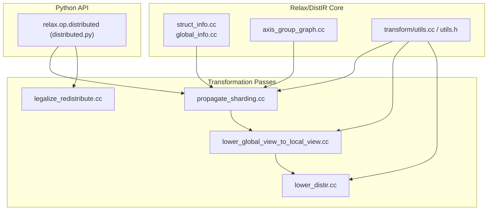
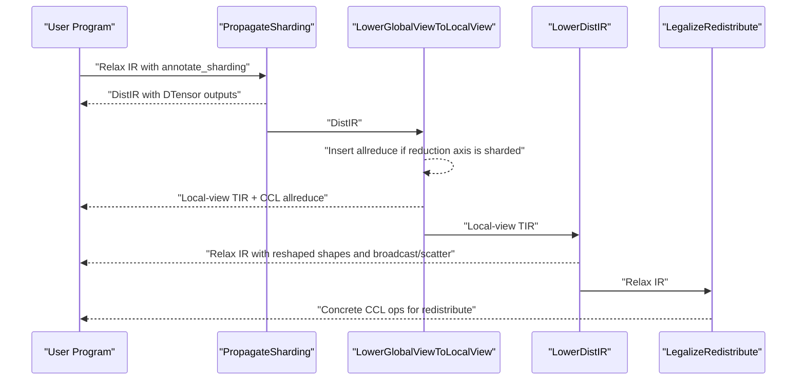
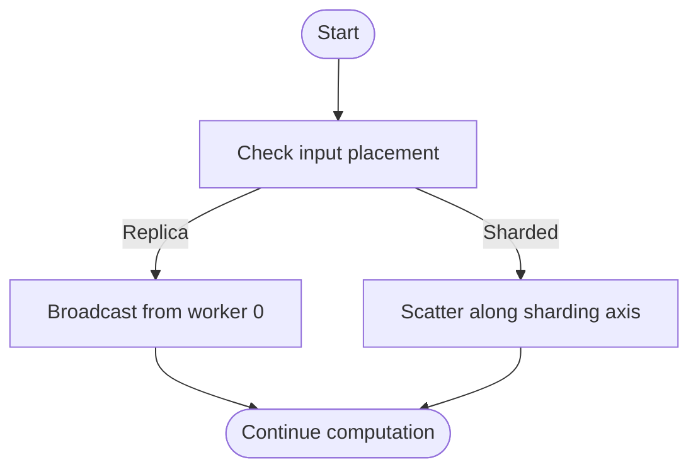
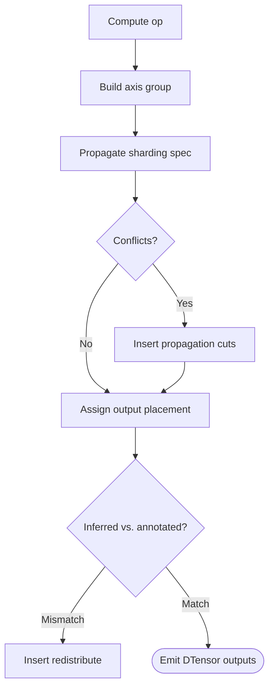
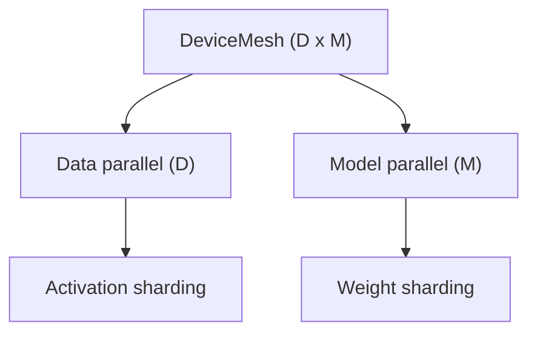
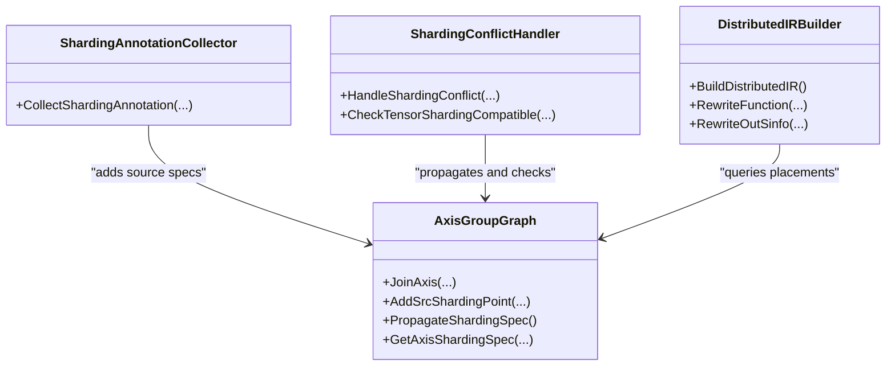
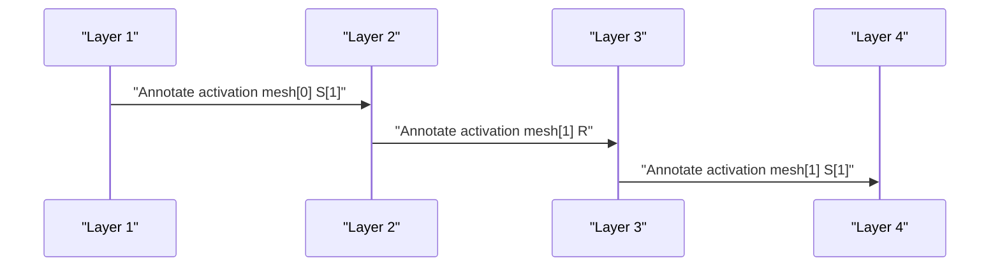
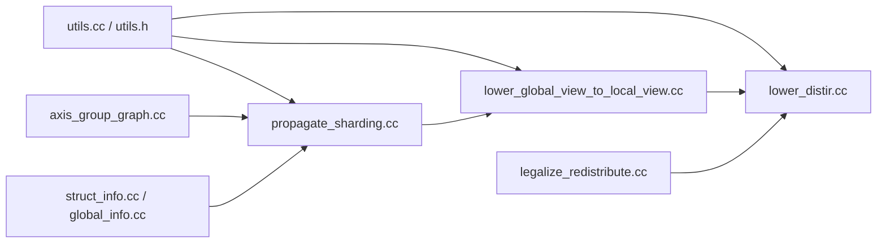

# Data and Model Parallelism

<cite>
**Referenced Files in This Document**
- [axis_group_graph.cc](file://src/relax/distributed/axis_group_graph.cc)
- [global_info.cc](file://src/relax/distributed/global_info.cc)
- [struct_info.cc](file://src/relax/distributed/struct_info.cc)
- [utils.cc](file://src/relax/distributed/transform/utils.cc)
- [utils.h](file://src/relax/distributed/transform/utils.h)
- [legalize_redistribute.cc](file://src/relax/distributed/transform/legalize_redistribute.cc)
- [lower_distir.cc](file://src/relax/distributed/transform/lower_distir.cc)
- [lower_global_view_to_local_view.cc](file://src/relax/distributed/transform/lower_global_view_to_local_view.cc)
- [propagate_sharding.cc](file://src/relax/distributed/transform/propagate_sharding.cc)
- [distributed.py](file://python/tvm/relax/op/distributed/distributed.py)
- [test_distributed_transform_propagate_sharding.py](file://tests/python/relax/distributed/test_distributed_transform_propagate_sharding.py)
</cite>

## Table of Contents
1. [Introduction](#introduction)
2. [Project Structure](#project-structure)
3. [Core Components](#core-components)
4. [Architecture Overview](#architecture-overview)
5. [Detailed Component Analysis](#detailed-component-analysis)
6. [Dependency Analysis](#dependency-analysis)
7. [Performance Considerations](#performance-considerations)
8. [Troubleshooting Guide](#troubleshooting-guide)
9. [Conclusion](#conclusion)
10. [Appendices](#appendices)

## Introduction
This document explains TVM’s support for data parallelism and model parallelism strategies in the Relax/DistIR stack. It covers distributed transformation passes that automatically partition computation graphs across multiple devices and workers, including:
- Data parallelism patterns for batch-wise parallel processing
- Model parallelism for layer-wise distribution
- Hybrid parallelism combining both
- Automatic sharding algorithms, gradient accumulation strategies, and pipeline parallelism scheduling
- Integration touchpoints with distributed training frameworks
- Practical configuration guidance, memory optimization, load balancing, automatic heuristics, manual intervention points, and debugging techniques

## Project Structure
The distributed parallelism implementation centers around:
- Distributed IR (DistIR) modeling with device meshes and placements
- Transformation passes that propagate sharding, lower views, and legalize redistributes
- Python operators for user-facing sharding annotations and redistributions
- Tests demonstrating pipeline parallelism and propagation behavior

**Diagram sources**
- [propagate_sharding.cc:1-631](file://src/relax/distributed/transform/propagate_sharding.cc#L1-L631)
- [lower_global_view_to_local_view.cc:1-449](file://src/relax/distributed/transform/lower_global_view_to_local_view.cc#L1-L449)
- [lower_distir.cc:1-278](file://src/relax/distributed/transform/lower_distir.cc#L1-L278)
- [legalize_redistribute.cc:1-128](file://src/relax/distributed/transform/legalize_redistribute.cc#L1-L128)
- [struct_info.cc:1-150](file://src/relax/distributed/struct_info.cc#L1-L150)
- [global_info.cc:1-77](file://src/relax/distributed/global_info.cc#L1-L77)
- [axis_group_graph.cc:1-397](file://src/relax/distributed/axis_group_graph.cc#L1-L397)
- [utils.cc:1-82](file://src/relax/distributed/transform/utils.cc#L1-L82)
- [utils.h:1-68](file://src/relax/distributed/transform/utils.h#L1-L68)
- [distributed.py:1-139](file://python/tvm/relax/op/distributed/distributed.py#L1-L139)

**Section sources**
- [propagate_sharding.cc:1-631](file://src/relax/distributed/transform/propagate_sharding.cc#L1-L631)
- [lower_global_view_to_local_view.cc:1-449](file://src/relax/distributed/transform/lower_global_view_to_local_view.cc#L1-L449)
- [lower_distir.cc:1-278](file://src/relax/distributed/transform/lower_distir.cc#L1-L278)
- [legalize_redistribute.cc:1-128](file://src/relax/distributed/transform/legalize_redistribute.cc#L1-L128)
- [struct_info.cc:1-150](file://src/relax/distributed/struct_info.cc#L1-L150)
- [global_info.cc:1-77](file://src/relax/distributed/global_info.cc#L1-L77)
- [axis_group_graph.cc:1-397](file://src/relax/distributed/axis_group_graph.cc#L1-L397)
- [utils.cc:1-82](file://src/relax/distributed/transform/utils.cc#L1-L82)
- [utils.h:1-68](file://src/relax/distributed/transform/utils.h#L1-L68)
- [distributed.py:1-139](file://python/tvm/relax/op/distributed/distributed.py#L1-L139)

## Core Components
- DeviceMesh and Placement: Define multi-dimensional device topology and per-axis sharding/replica specs.
- DTensorStructInfo: Augments regular tensors with device mesh and placement to form DistIR.
- Axis Group Graph: Encodes axis-wise data dependencies to drive sharding propagation.
- Transformation Passes:
  - PropagateSharding: Builds axis groups, collects sharding annotations, resolves conflicts, and rewrites to DistIR with DTensor outputs.
  - LowerGlobalViewToLocalView: Lowers global-view TIR into local-view PrimFuncs and inserts allreduce blocks when reductions are sharded.
  - LowerDistIR: Rewrites DistIR into Relax by adjusting shapes, emitting broadcasts/scatters, and handling special ops.
  - LegalizeRedistribute: Converts redistribute ops into concrete CCL ops (placeholder for future multi-dim support).
- Python Operators: annotate_sharding, redistribute, call_tir_local_view, and specialized redistribute helpers.

**Section sources**
- [struct_info.cc:31-145](file://src/relax/distributed/struct_info.cc#L31-L145)
- [global_info.cc:29-72](file://src/relax/distributed/global_info.cc#L29-L72)
- [axis_group_graph.cc:66-397](file://src/relax/distributed/axis_group_graph.cc#L66-L397)
- [propagate_sharding.cc:43-631](file://src/relax/distributed/transform/propagate_sharding.cc#L43-L631)
- [lower_global_view_to_local_view.cc:359-449](file://src/relax/distributed/transform/lower_global_view_to_local_view.cc#L359-L449)
- [lower_distir.cc:44-278](file://src/relax/distributed/transform/lower_distir.cc#L44-L278)
- [legalize_redistribute.cc:41-128](file://src/relax/distributed/transform/legalize_redistribute.cc#L41-L128)
- [distributed.py:30-139](file://python/tvm/relax/op/distributed/distributed.py#L30-L139)

## Architecture Overview
The distributed compilation pipeline transforms a user-annotated Relax program into a device-partitioned execution plan:
- Users annotate sharding via Python ops.
- PropagateSharding constructs axis-group graphs, enforces compatibility, infers output placements, and rewrites to DistIR.
- LowerGlobalViewToLocalView shards buffers and inserts allreduce when reduction axes are sharded.
- LowerDistIR adjusts shapes and emits broadcast/scatter for inputs and special-case ops.
- LegalizeRedistribute lowers redistribute ops to concrete CCL ops.

**Diagram sources**
- [propagate_sharding.cc:416-631](file://src/relax/distributed/transform/propagate_sharding.cc#L416-L631)
- [lower_global_view_to_local_view.cc:359-449](file://src/relax/distributed/transform/lower_global_view_to_local_view.cc#L359-L449)
- [lower_distir.cc:44-278](file://src/relax/distributed/transform/lower_distir.cc#L44-L278)
- [legalize_redistribute.cc:41-128](file://src/relax/distributed/transform/legalize_redistribute.cc#L41-L128)

## Detailed Component Analysis

### Data Parallelism (Batch-wise)
- Mechanism: Replica placement across the device mesh replicates tensors on all workers; broadcasting/scattering handle input distribution.
- Implementation highlights:
  - Input preprocessing scatters or broadcasts inputs depending on placement.
  - Special-case handling for reshape and KV-cache view adjusts shapes locally.
- Practical guidance:
  - Use replica placement for batch dimension to split workload across workers.
  - Ensure batch divisibility by number of workers for equal partitioning.

**Diagram sources**
- [lower_distir.cc:132-154](file://src/relax/distributed/transform/lower_distir.cc#L132-L154)

**Section sources**
- [lower_distir.cc:113-171](file://src/relax/distributed/transform/lower_distir.cc#L113-L171)
- [lower_distir.cc:213-249](file://src/relax/distributed/transform/lower_distir.cc#L213-L249)

### Model Parallelism (Layer-wise)
- Mechanism: Sharding placement partitions tensors along logical axes (e.g., hidden dims) across device mesh dimensions.
- Implementation highlights:
  - Axis group graph encodes axis-wise dependencies for binary ops, matmul, permute, reshape, and reductions.
  - Propagation infers compatible placements and inserts redistributes when needed.
- Practical guidance:
  - Annotate sharding for large weight matrices along the appropriate axis.
  - Use pipeline parallelism by annotating intermediate activations across different mesh slices.

**Diagram sources**
- [axis_group_graph.cc:79-281](file://src/relax/distributed/axis_group_graph.cc#L79-L281)
- [propagate_sharding.cc:416-631](file://src/relax/distributed/transform/propagate_sharding.cc#L416-L631)

**Section sources**
- [axis_group_graph.cc:79-281](file://src/relax/distributed/axis_group_graph.cc#L79-L281)
- [propagate_sharding.cc:416-631](file://src/relax/distributed/transform/propagate_sharding.cc#L416-L631)

### Hybrid Parallelism (Data + Model)
- Mechanism: Combine batch-wise replica placement with intra-tensor sharding to distribute both samples and features.
- Implementation highlights:
  - Device mesh supports multi-dimensional layouts; axis group propagation respects mesh dimensions.
  - Lowering preserves logical partitioning while adjusting shapes and inserting collectives.
- Practical guidance:
  - Use separate mesh dimensions for data and model axes.
  - Ensure consistent sharding across pipeline stages.

[No sources needed since this diagram shows conceptual workflow, not actual code structure]

**Section sources**
- [global_info.cc:29-72](file://src/relax/distributed/global_info.cc#L29-L72)
- [struct_info.cc:120-145](file://src/relax/distributed/struct_info.cc#L120-L145)

### Automatic Sharding and Propagation
- Axis group graph construction:
  - Binary ops, matmul, permute_dims, reshape, and reductions are handled with axis-wise rules.
  - TIR-backed call_tir integrates via buffer axis graph extraction.
- Conflict resolution:
  - Enforces device mesh consistency and prevents conflicting sharding on the same mesh axis.
  - Inserts propagation cuts when tensor sizes are smaller than mesh extent along sharded axes.
- Output placement inference:
  - Infers DTensor outputs and inserts redistributes when inferred and annotated placements differ.

**Diagram sources**
- [axis_group_graph.cc:66-397](file://src/relax/distributed/axis_group_graph.cc#L66-L397)
- [propagate_sharding.cc:216-631](file://src/relax/distributed/transform/propagate_sharding.cc#L216-L631)

**Section sources**
- [axis_group_graph.cc:66-397](file://src/relax/distributed/axis_group_graph.cc#L66-L397)
- [propagate_sharding.cc:216-631](file://src/relax/distributed/transform/propagate_sharding.cc#L216-L631)

### Gradient Accumulation Strategies
- Mechanism: Not directly implemented in the referenced passes; however, the lowering pipeline can insert allreduce blocks when reduction axes are sharded.
- Practical guidance:
  - Accumulate gradients locally per worker; insert allreduce after backward to synchronize.
  - Use replica placement for gradient tensors to enable sum-reduction across workers.

[No sources needed since this section provides general guidance]

### Pipeline Parallelism Scheduling
- Mechanism: Intermediate activations are annotated to reside on specific device mesh slices; propagation ensures consistent placements across layers.
- Evidence in tests:
  - Multi-stage MLP with explicit annotate_sharding across different meshes demonstrates pipeline stages.
- Practical guidance:
  - Alternate annotate_sharding across mesh slices for consecutive layers.
  - Ensure stage boundaries align with communication-friendly tensor shapes.

**Diagram sources**
- [test_distributed_transform_propagate_sharding.py:303-374](file://tests/python/relax/distributed/test_distributed_transform_propagate_sharding.py#L303-L374)

**Section sources**
- [test_distributed_transform_propagate_sharding.py:303-374](file://tests/python/relax/distributed/test_distributed_transform_propagate_sharding.py#L303-L374)

### Integration Touchpoints with Distributed Training Frameworks
- PyTorch Distributed:
  - Use annotate_sharding to mark tensors for partitioning; rely on LowerDistIR to emit broadcast/scatter for inputs.
  - For KV-cache operations, leverage specialized VM builtins that are remapped during lowering.
- DeepSpeed:
  - Align device meshes with pipeline stages; insert redistributes to match framework expectations.
  - Use call_tir_local_view for worker-local kernels; allreduce insertion ensures correctness for sharded reductions.

[No sources needed since this section provides general guidance]

### Practical Configuration Examples
- Batch-wise parallelism:
  - Mark batch dimension as replica across the data-parallel mesh dimension.
- Layer-wise parallelism:
  - Annotate large weight matrices for sharding along the feature dimension.
- Hybrid:
  - Use a 2D mesh: one axis for data, another for model; combine replica and sharding placements accordingly.
- Pipeline:
  - Annotate intermediate activations across alternating mesh slices.

[No sources needed since this section provides general guidance]

### Memory Optimization Across Workers
- Equal partitioning: Ensure sharded dimensions divide evenly by the number of workers.
- Local-view lowering: Reduce buffer sizes per worker by shrinking shapes according to placement.
- Allreduce fusion: Coalesce multiple reductions into a single allreduce when possible.

**Section sources**
- [lower_global_view_to_local_view.cc:291-312](file://src/relax/distributed/transform/lower_global_view_to_local_view.cc#L291-L312)
- [lower_distir.cc:64-85](file://src/relax/distributed/transform/lower_distir.cc#L64-L85)

### Load Balancing
- Evenly distribute compute across mesh dimensions.
- Prefer sharding on larger tensor axes to minimize skew.
- Avoid excessive fragmentation; coalesce small sharded dimensions when feasible.

[No sources needed since this section provides general guidance]

### Automatic Parallelization Heuristics and Manual Intervention
- Heuristics:
  - Axis group propagation prefers replica placement by default; sharding is inferred only when explicitly annotated or required by ops.
  - Conflict handler enforces device mesh consistency and inserts propagation cuts.
- Manual intervention:
  - Use annotate_sharding to override defaults.
  - Insert redistribute to reconcile inferred vs. intended placements.
  - Adjust device mesh shape and order to reflect hardware topology.

**Section sources**
- [propagate_sharding.cc:416-631](file://src/relax/distributed/transform/propagate_sharding.cc#L416-L631)
- [distributed.py:30-66](file://python/tvm/relax/op/distributed/distributed.py#L30-L66)

### Debugging Techniques
- Verify DistIR compatibility:
  - Ensure functions are exclusively in DistIR (no mixing DTensor and Tensor struct info).
- Inspect placements:
  - Confirm device mesh and placement specs align with expectations.
- Trace propagation:
  - Use axis group graph queries to inspect propagated specs and cuts.
- Lowering checks:
  - Validate that shapes are shrunk appropriately and that broadcast/scatter are emitted for inputs.

**Section sources**
- [utils.cc:25-63](file://src/relax/distributed/transform/utils.cc#L25-L63)
- [propagate_sharding.cc:416-631](file://src/relax/distributed/transform/propagate_sharding.cc#L416-L631)
- [lower_distir.cc:113-171](file://src/relax/distributed/transform/lower_distir.cc#L113-L171)

## Dependency Analysis
Key internal dependencies among distributed passes and utilities:

**Diagram sources**
- [utils.cc:25-82](file://src/relax/distributed/transform/utils.cc#L25-L82)
- [utils.h:36-61](file://src/relax/distributed/transform/utils.h#L36-L61)
- [propagate_sharding.cc:1-631](file://src/relax/distributed/transform/propagate_sharding.cc#L1-L631)
- [lower_global_view_to_local_view.cc:1-449](file://src/relax/distributed/transform/lower_global_view_to_local_view.cc#L1-L449)
- [lower_distir.cc:1-278](file://src/relax/distributed/transform/lower_distir.cc#L1-L278)
- [legalize_redistribute.cc:1-128](file://src/relax/distributed/transform/legalize_redistribute.cc#L1-L128)
- [axis_group_graph.cc:1-397](file://src/relax/distributed/axis_group_graph.cc#L1-L397)
- [struct_info.cc:1-150](file://src/relax/distributed/struct_info.cc#L1-L150)
- [global_info.cc:1-77](file://src/relax/distributed/global_info.cc#L1-L77)

**Section sources**
- [utils.cc:25-82](file://src/relax/distributed/transform/utils.cc#L25-L82)
- [utils.h:36-61](file://src/relax/distributed/transform/utils.h#L36-L61)
- [propagate_sharding.cc:1-631](file://src/relax/distributed/transform/propagate_sharding.cc#L1-L631)
- [lower_global_view_to_local_view.cc:1-449](file://src/relax/distributed/transform/lower_global_view_to_local_view.cc#L1-L449)
- [lower_distir.cc:1-278](file://src/relax/distributed/transform/lower_distir.cc#L1-L278)
- [legalize_redistribute.cc:1-128](file://src/relax/distributed/transform/legalize_redistribute.cc#L1-L128)
- [axis_group_graph.cc:1-397](file://src/relax/distributed/axis_group_graph.cc#L1-L397)
- [struct_info.cc:1-150](file://src/relax/distributed/struct_info.cc#L1-L150)
- [global_info.cc:1-77](file://src/relax/distributed/global_info.cc#L1-L77)

## Performance Considerations
- Communication overhead:
  - Minimize Allreduce frequency by coalescing reductions and avoiding frequent resharding.
- Memory footprint:
  - Use local-view lowering to shrink buffers per worker.
- Load balance:
  - Prefer sharding on larger axes; avoid tiny shards that underutilize workers.
- Throughput:
  - Overlap communication with computation using pipeline parallelism and asynchronous collectives.

[No sources needed since this section provides general guidance]

## Troubleshooting Guide
- Mixed struct info in DistIR:
  - Ensure functions are either fully DistIR or fully Relax; do not mix DTensor and Tensor struct info.
- Sharding conflicts:
  - Resolve device mesh mismatches and prevent multiple sharding specs on the same mesh axis.
- Unsupported redistribute:
  - LegalizeRedistribute currently supports limited cases; extend or adjust placement to avoid unsupported conversions.
- Shape mismatches:
  - Verify that sharded dimensions divide evenly by mesh extent; otherwise insert propagation cuts or adjust mesh.

**Section sources**
- [utils.cc:25-63](file://src/relax/distributed/transform/utils.cc#L25-L63)
- [propagate_sharding.cc:249-339](file://src/relax/distributed/transform/propagate_sharding.cc#L249-L339)
- [legalize_redistribute.cc:73-108](file://src/relax/distributed/transform/legalize_redistribute.cc#L73-L108)

## Conclusion
TVM’s Relax/DistIR stack provides a robust foundation for data and model parallelism, enabling automatic sharding propagation, pipeline scheduling, and lowering to efficient local-view kernels with minimal user intervention. By leveraging annotate_sharding, axis group propagation, and lowering passes, users can compose hybrid strategies tailored to their hardware and workload characteristics.

## Appendices
- Operator reference:
  - annotate_sharding, redistribute, call_tir_local_view, and redistribute_replica_to_shard are exposed via Python APIs and backed by FFI.

**Section sources**
- [distributed.py:30-139](file://python/tvm/relax/op/distributed/distributed.py#L30-L139)