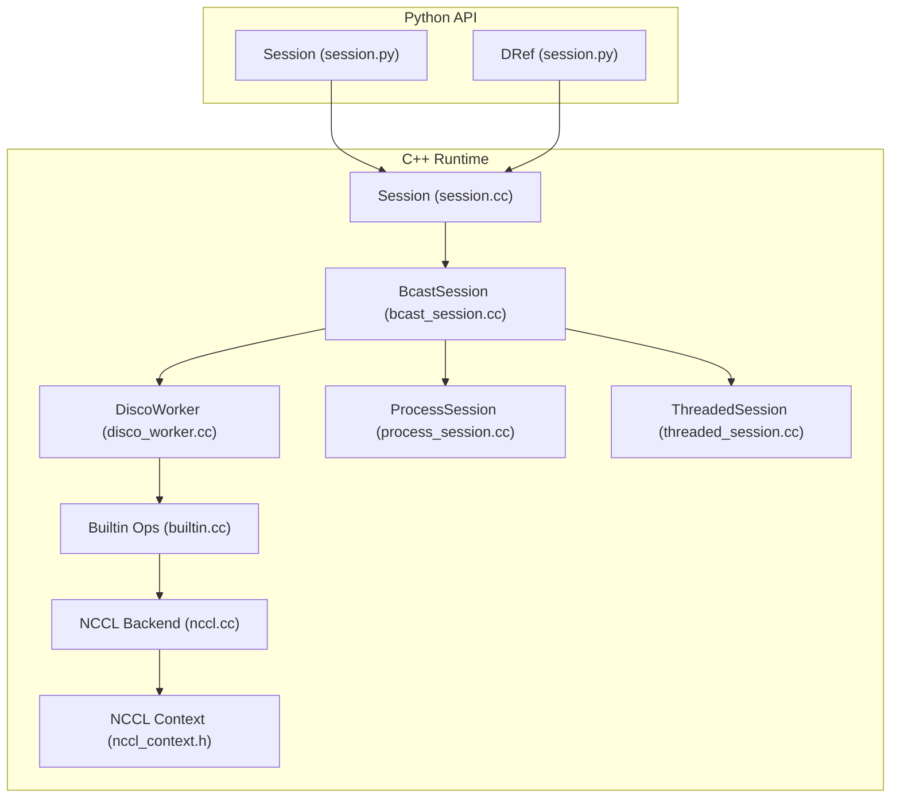
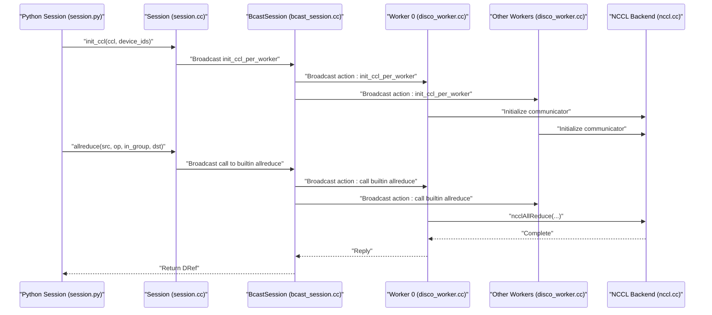
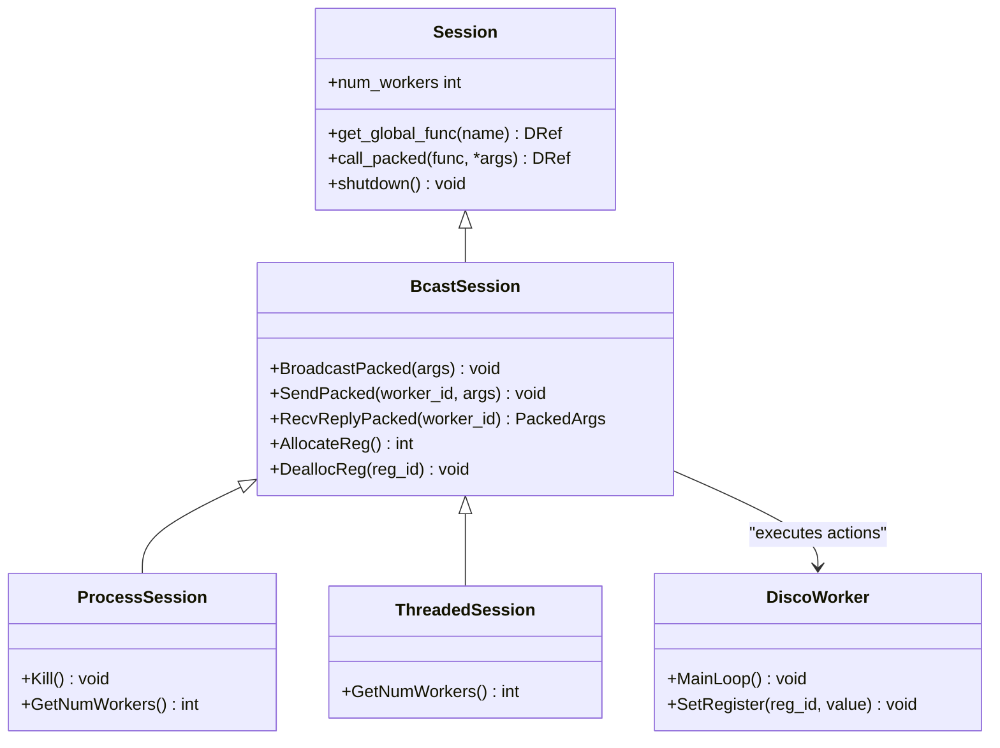
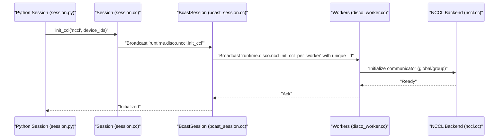
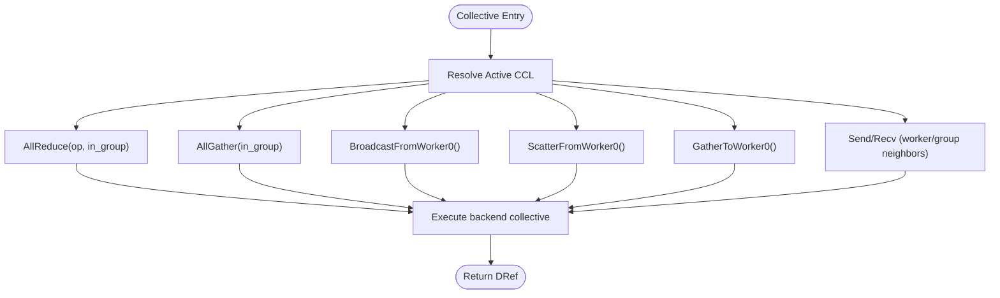
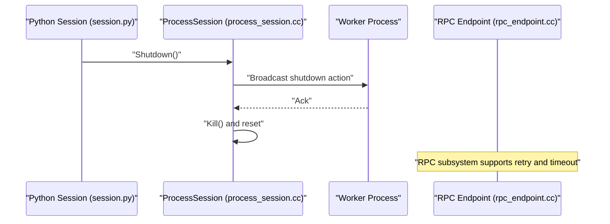
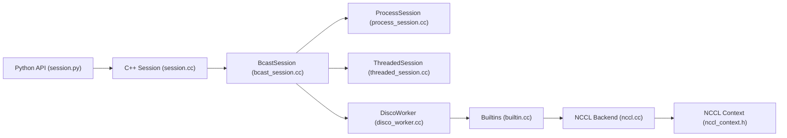

# Distributed Communication Protocols

<cite>
**Referenced Files in This Document**
- [session.cc](file://src/runtime/disco/session.cc)
- [disco_worker.cc](file://src/runtime/disco/disco_worker.cc)
- [builtin.cc](file://src/runtime/disco/builtin.cc)
- [nccl.cc](file://src/runtime/disco/nccl/nccl.cc)
- [nccl_context.h](file://src/runtime/disco/nccl/nccl_context.h)
- [bcast_session.cc](file://src/runtime/disco/bcast_session.cc)
- [process_session.cc](file://src/runtime/disco/process_session.cc)
- [threaded_session.cc](file://src/runtime/disco/threaded_session.cc)
- [session.py](file://python/tvm/runtime/disco/session.py)
- [CMakeLists.txt](file://CMakeLists.txt)
- [rpc_session.h](file://src/runtime/rpc/rpc_session.h)
- [rpc_endpoint.h](file://src/runtime/rpc/rpc_endpoint.h)
- [rpc_endpoint.cc](file://src/runtime/rpc/rpc_endpoint.cc)
- [threading_backend.cc](file://src/runtime/threading_backend.cc)
</cite>

## Table of Contents
1. [Introduction](#introduction)
2. [Project Structure](#project-structure)
3. [Core Components](#core-components)
4. [Architecture Overview](#architecture-overview)
5. [Detailed Component Analysis](#detailed-component-analysis)
6. [Dependency Analysis](#dependency-analysis)
7. [Performance Considerations](#performance-considerations)
8. [Troubleshooting Guide](#troubleshooting-guide)
9. [Conclusion](#conclusion)
10. [Appendices](#appendices)

## Introduction
This document explains TVM’s distributed runtime “Disco” and its communication protocols. It covers the Disco runtime architecture for coordinating multiple workers, including session management, worker registration, and inter-process communication. It documents the implementation of communication backends (NCCL, RCCL, and MPI), collective communication primitives (allreduce, allgather, broadcast, scatter/gather variants), fault tolerance and recovery mechanisms, and network topology awareness. Practical examples demonstrate setting up distributed training clusters, configuring communication protocols, and optimizing network performance. Finally, it documents the Python API for distributed computation, worker lifecycle management, and debugging distributed operations.

## Project Structure
Disco spans C++ runtime components and a Python API surface:
- C++ runtime core: session orchestration, worker execution loop, backend dispatch, and channel abstractions
- Backend implementations: NCCL/RCCL collective operations and context management
- Python API: Session classes, DRef handles, and convenience wrappers for collectives and lifecycle

**Diagram sources**
- [session.py:104-663](file://python/tvm/runtime/disco/session.py#L104-L663)
- [session.cc:27-57](file://src/runtime/disco/session.cc#L27-L57)
- [disco_worker.cc:49-192](file://src/runtime/disco/disco_worker.cc#L49-L192)
- [builtin.cc:78-127](file://src/runtime/disco/builtin.cc#L78-L127)
- [nccl.cc:57-117](file://src/runtime/disco/nccl/nccl.cc#L57-L117)
- [nccl_context.h:1-200](file://src/runtime/disco/nccl/nccl_context.h#L1-L200)
- [bcast_session.cc:29-121](file://src/runtime/disco/bcast_session.cc#L29-L121)
- [process_session.cc:62-174](file://src/runtime/disco/process_session.cc#L62-L174)
- [threaded_session.cc:145-187](file://src/runtime/disco/threaded_session.cc#L145-L187)

**Section sources**
- [session.py:104-663](file://python/tvm/runtime/disco/session.py#L104-L663)
- [session.cc:27-57](file://src/runtime/disco/session.cc#L27-L57)
- [disco_worker.cc:49-192](file://src/runtime/disco/disco_worker.cc#L49-L192)
- [builtin.cc:78-127](file://src/runtime/disco/builtin.cc#L78-L127)
- [nccl.cc:57-117](file://src/runtime/disco/nccl/nccl.cc#L57-L117)
- [nccl_context.h:1-200](file://src/runtime/disco/nccl/nccl_context.h#L1-L200)
- [bcast_session.cc:29-121](file://src/runtime/disco/bcast_session.cc#L29-L121)
- [process_session.cc:62-174](file://src/runtime/disco/process_session.cc#L62-L174)
- [threaded_session.cc:145-187](file://src/runtime/disco/threaded_session.cc#L145-L187)

## Core Components
- Session: Orchestrates worker groups, registers global functions, and exposes collective operations and lifecycle controls. Python Session wraps C++ Session and provides typed helpers for arrays and collectives.
- DiscoWorker: Per-worker execution loop that interprets commands, manages a register file, and executes remote calls.
- BcastSession: Broadcast-based session that coordinates actions across workers and maintains per-session register IDs.
- ProcessSession: Multi-process session using pipes to connect a controller process to worker processes.
- ThreadedSession: Multi-threaded session within a single process.
- NCCL/RCCL Backend: Collective operations and context management for GPU collectives.
- Builtins: Dispatch to backend-specific functions and expose runtime utilities (device, worker ID, synchronization).

Key responsibilities:
- Session management: creation, shutdown, and function discovery
- Worker registration: per-session register allocation and lifetime
- Inter-process communication: broadcast, replies, and control channels
- Backend dispatch: dynamic selection of CCL backend and operation routing

**Section sources**
- [session.py:104-663](file://python/tvm/runtime/disco/session.py#L104-L663)
- [session.cc:27-57](file://src/runtime/disco/session.cc#L27-L57)
- [disco_worker.cc:49-192](file://src/runtime/disco/disco_worker.cc#L49-L192)
- [bcast_session.cc:29-121](file://src/runtime/disco/bcast_session.cc#L29-L121)
- [process_session.cc:62-174](file://src/runtime/disco/process_session.cc#L62-L174)
- [threaded_session.cc:145-187](file://src/runtime/disco/threaded_session.cc#L145-L187)
- [builtin.cc:78-127](file://src/runtime/disco/builtin.cc#L78-L127)
- [nccl.cc:57-117](file://src/runtime/disco/nccl/nccl.cc#L57-L117)

## Architecture Overview
Disco’s runtime architecture centers on a controller session that broadcasts commands to worker processes or threads. Workers maintain a register file and execute remote function calls. Collectives are dispatched to a selected backend (NCCL/RCCL/MPI) depending on configuration.

**Diagram sources**
- [session.py:314-503](file://python/tvm/runtime/disco/session.py#L314-L503)
- [session.cc:27-57](file://src/runtime/disco/session.cc#L27-L57)
- [bcast_session.cc:88-102](file://src/runtime/disco/bcast_session.cc#L88-L102)
- [disco_worker.cc:49-192](file://src/runtime/disco/disco_worker.cc#L49-L192)
- [builtin.cc:87-89](file://src/runtime/disco/builtin.cc#L87-L89)
- [nccl.cc:119-133](file://src/runtime/disco/nccl/nccl.cc#L119-L133)

## Detailed Component Analysis

### Session and Worker Lifecycle
- Session creation and destruction: Python constructs C++ sessions (Threaded/Process/Sockets). Sessions expose lifecycle methods and function discovery.
- Worker registration: BcastSession allocates per-session register IDs and tracks free registers. Calls are broadcast to all workers.
- Worker execution loop: DiscoWorker interprets actions (call packed, copy, sync, debug), executes remotely, and replies.

**Diagram sources**
- [session.py:104-663](file://python/tvm/runtime/disco/session.py#L104-L663)
- [session.cc:27-57](file://src/runtime/disco/session.cc#L27-L57)
- [bcast_session.cc:29-121](file://src/runtime/disco/bcast_session.cc#L29-L121)
- [process_session.cc:62-174](file://src/runtime/disco/process_session.cc#L62-L174)
- [threaded_session.cc:145-187](file://src/runtime/disco/threaded_session.cc#L145-L187)
- [disco_worker.cc:49-192](file://src/runtime/disco/disco_worker.cc#L49-L192)

**Section sources**
- [session.py:104-663](file://python/tvm/runtime/disco/session.py#L104-L663)
- [session.cc:27-57](file://src/runtime/disco/session.cc#L27-L57)
- [bcast_session.cc:29-121](file://src/runtime/disco/bcast_session.cc#L29-L121)
- [process_session.cc:62-174](file://src/runtime/disco/process_session.cc#L62-L174)
- [threaded_session.cc:145-187](file://src/runtime/disco/threaded_session.cc#L145-L187)
- [disco_worker.cc:49-192](file://src/runtime/disco/disco_worker.cc#L49-L192)

### Communication Backends and Initialization
- Backend selection: Python Session.init_ccl chooses a backend (e.g., nccl/rccl) and invokes a per-worker initialization routine.
- NCCL/RCCL initialization: Unique ID is generated and broadcast; communicators are initialized per worker with global and group scopes.
- Backend dispatch: Builtins resolve the active CCL and forward operations to backend-specific implementations.

**Diagram sources**
- [session.py:314-331](file://python/tvm/runtime/disco/session.py#L314-L331)
- [session.cc:46-52](file://src/runtime/disco/session.cc#L46-L52)
- [bcast_session.cc:70-76](file://src/runtime/disco/bcast_session.cc#L70-L76)
- [nccl.cc:57-117](file://src/runtime/disco/nccl/nccl.cc#L57-L117)

**Section sources**
- [session.py:314-331](file://python/tvm/runtime/disco/session.py#L314-L331)
- [session.cc:46-52](file://src/runtime/disco/session.cc#L46-L52)
- [bcast_session.cc:70-76](file://src/runtime/disco/bcast_session.cc#L70-L76)
- [nccl.cc:57-117](file://src/runtime/disco/nccl/nccl.cc#L57-L117)

### Collective Communication Primitives
Disco exposes the following primitives via builtins and backend implementations:
- AllReduce: Sum, Prod, Min, Max, Avg
- AllGather: Gather tensors from all workers
- Broadcast: From worker 0 to all others
- Scatter/Gather variants: Split buffers across workers or collect to worker 0
- Point-to-point: Send/Recv between arbitrary workers and group neighbors

**Diagram sources**
- [builtin.cc:87-119](file://src/runtime/disco/builtin.cc#L87-L119)
- [nccl.cc:119-326](file://src/runtime/disco/nccl/nccl.cc#L119-L326)

**Section sources**
- [builtin.cc:87-119](file://src/runtime/disco/builtin.cc#L87-L119)
- [nccl.cc:119-326](file://src/runtime/disco/nccl/nccl.cc#L119-L326)

### Fault Tolerance and Recovery
- Worker lifecycle: Sessions support shutdown and cleanup. ProcessSession kills worker processes and resets channels.
- Synchronization: Worker synchronization ensures progress and ordering; builtins expose sync operations for the active CCL.
- RPC resilience: While separate from Disco, TVM’s RPC subsystem supports request-and-run with retries and session timeouts to mitigate transient server failures.

**Diagram sources**
- [process_session.cc:85-94](file://src/runtime/disco/process_session.cc#L85-L94)
- [rpc_endpoint.cc:817-823](file://src/runtime/rpc/rpc_endpoint.cc#L817-L823)
- [rpc_session.h:255-255](file://src/runtime/rpc/rpc_session.h#L255-L255)

**Section sources**
- [process_session.cc:85-94](file://src/runtime/disco/process_session.cc#L85-L94)
- [rpc_endpoint.cc:817-823](file://src/runtime/rpc/rpc_endpoint.cc#L817-L823)
- [rpc_session.h:255-255](file://src/runtime/rpc/rpc_session.h#L255-L255)

### Network Topology Awareness
- Grouping: Sessions can define groups; collectives can operate globally or within a group, enabling hierarchical topologies (e.g., per-NIC or per-Socket).
- Group neighbors: Send/Recv between next/previous groups enables ring or tree topologies.
- Device placement: Backend initialization binds communicators to specific devices; default device consistency is enforced.

**Section sources**
- [nccl.cc:88-116](file://src/runtime/disco/nccl/nccl.cc#L88-L116)
- [builtin.cc:113-119](file://src/runtime/disco/builtin.cc#113-L119)

## Dependency Analysis
- Python API depends on C++ FFI bindings for Session, DRef, and builtins.
- BcastSession composes ProcessSession and ThreadedSession to support different transport modes.
- Builtins dynamically dispatch to backend-specific functions based on the active CCL.
- NCCL backend depends on NCCL/RCCL libraries and thread-local contexts.

**Diagram sources**
- [session.py:104-663](file://python/tvm/runtime/disco/session.py#L104-L663)
- [session.cc:27-57](file://src/runtime/disco/session.cc#L27-L57)
- [bcast_session.cc:29-121](file://src/runtime/disco/bcast_session.cc#L29-L121)
- [process_session.cc:62-174](file://src/runtime/disco/process_session.cc#L62-L174)
- [threaded_session.cc:145-187](file://src/runtime/disco/threaded_session.cc#L145-L187)
- [disco_worker.cc:49-192](file://src/runtime/disco/disco_worker.cc#L49-L192)
- [builtin.cc:78-127](file://src/runtime/disco/builtin.cc#L78-L127)
- [nccl.cc:57-117](file://src/runtime/disco/nccl/nccl.cc#L57-L117)
- [nccl_context.h:1-200](file://src/runtime/disco/nccl/nccl_context.h#L1-L200)

**Section sources**
- [session.py:104-663](file://python/tvm/runtime/disco/session.py#L104-L663)
- [session.cc:27-57](file://src/runtime/disco/session.cc#L27-L57)
- [bcast_session.cc:29-121](file://src/runtime/disco/bcast_session.cc#L29-L121)
- [process_session.cc:62-174](file://src/runtime/disco/process_session.cc#L62-L174)
- [threaded_session.cc:145-187](file://src/runtime/disco/threaded_session.cc#L145-L187)
- [disco_worker.cc:49-192](file://src/runtime/disco/disco_worker.cc#L49-L192)
- [builtin.cc:78-127](file://src/runtime/disco/builtin.cc#L78-L127)
- [nccl.cc:57-117](file://src/runtime/disco/nccl/nccl.cc#L57-L117)
- [nccl_context.h:1-200](file://src/runtime/disco/nccl/nccl_context.h#L1-L200)

## Performance Considerations
- Backend selection: Prefer NCCL/RCCL for NVIDIA/AMD GPUs; configure device IDs and group sizes to match topology.
- Intra-/inter-group collectives: Use in_group mode to reduce contention and leverage intra-node bandwidth.
- Data types: Certain float8 types are not supported by NCCL; ensure dtype compatibility.
- Synchronization: Excessive synchronization can stall progress; use grouped operations where possible.
- Memory: Backend-specific memory pools and IPC allocations can improve throughput; clear pools after backend changes.

[No sources needed since this section provides general guidance]

## Troubleshooting Guide
Common issues and remedies:
- Backend initialization failure: Verify unique ID generation and device ID alignment; ensure the chosen backend is enabled at build-time.
- Mismatched shapes or sizes: Scatter/Gather require evenly divisible element counts; AllReduce expects matching shapes.
- Unsupported data types: Float8 is not supported by NCCL; convert to supported dtypes.
- Worker synchronization: Use sync_worker to ensure deterministic progress; avoid syncing non-collocated workers for performance.
- Process session cleanup: On failure, call shutdown and kill to reset worker processes.

**Section sources**
- [nccl.cc:125-128](file://src/runtime/disco/nccl/nccl.cc#L125-L128)
- [nccl.cc:178-194](file://src/runtime/disco/nccl/nccl.cc#L178-L194)
- [nccl.cc:227-243](file://src/runtime/disco/nccl/nccl.cc#L227-L243)
- [process_session.cc:85-94](file://src/runtime/disco/process_session.cc#L85-L94)

## Conclusion
Disco provides a flexible, extensible distributed runtime for TVM with robust session management, worker coordination, and backend-agnostic collective operations. By leveraging grouping, backend-specific optimizations, and careful lifecycle management, users can deploy efficient multi-GPU and multi-node training. The Python API simplifies common workflows while exposing low-level controls for advanced configurations.

[No sources needed since this section summarizes without analyzing specific files]

## Appendices

### Practical Setup and Configuration Examples
- Single-node multi-GPU:
  - Create a ThreadedSession with the desired number of workers and groups.
  - Initialize NCCL with device IDs matching GPU order.
  - Perform collectives (allreduce, allgather) on DRef tensors.
- Multi-node:
  - Use ProcessSession or SocketSession to spawn workers across nodes.
  - Ensure network connectivity and consistent device IDs per node.
  - Configure groups to reflect topology (e.g., per-socket or per-NIC).
- Backend selection:
  - Build with NCCL/RCCL enabled; select backend via Session.init_ccl.
  - For MPI, enable MPI backend and initialize accordingly.

**Section sources**
- [session.py:533-614](file://python/tvm/runtime/disco/session.py#L533-L614)
- [process_session.cc:176-186](file://src/runtime/disco/process_session.cc#L176-L186)
- [CMakeLists.txt:356-375](file://CMakeLists.txt#L356-L375)

### Python API Reference Highlights
- Session: lifecycle, function discovery, and collective helpers
- DRef: distributed references to tensors across workers
- Built-in collectives: allreduce, allgather, broadcast/scatter/gather variants
- Worker utilities: worker_id, device, bind_worker_to_cpu_core

**Section sources**
- [session.py:104-663](file://python/tvm/runtime/disco/session.py#L104-L663)
- [builtin.cc:129-173](file://src/runtime/disco/builtin.cc#L129-L173)