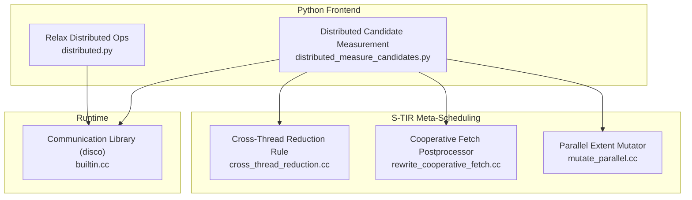
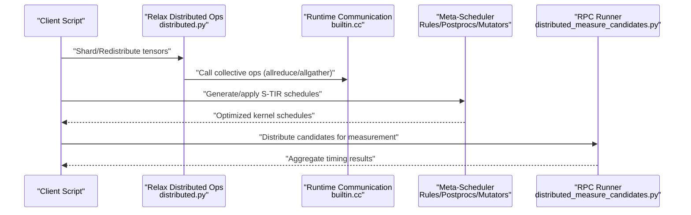
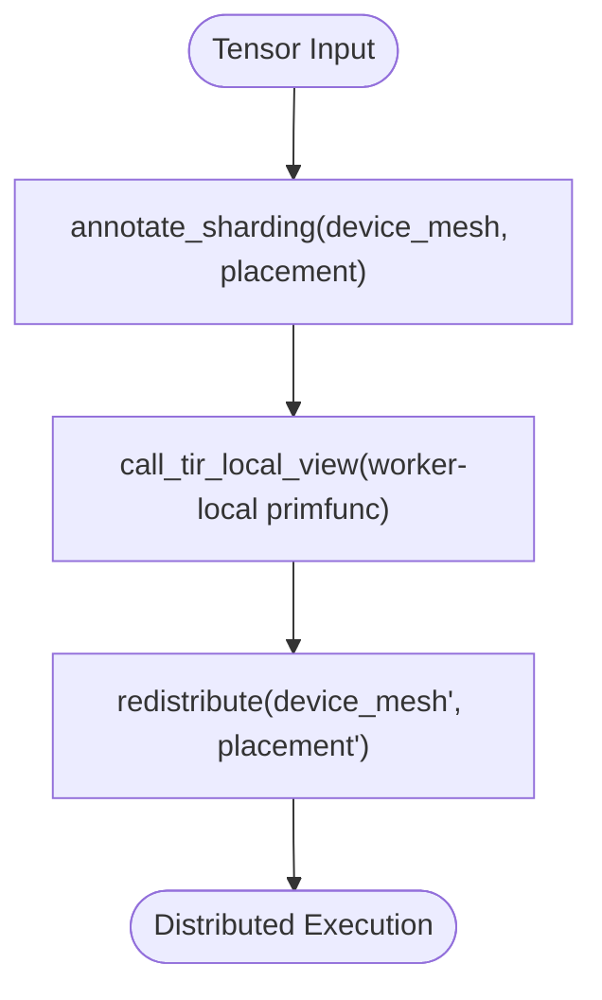
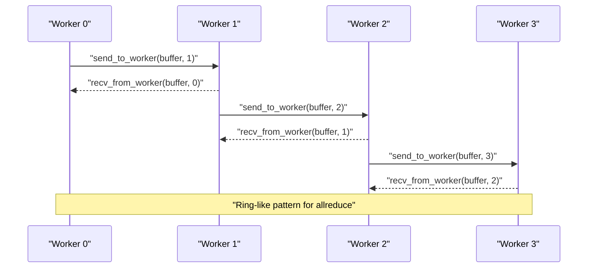
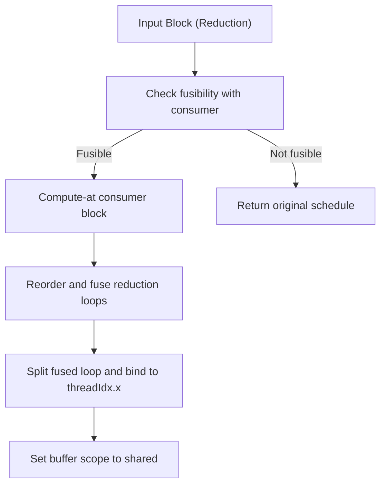
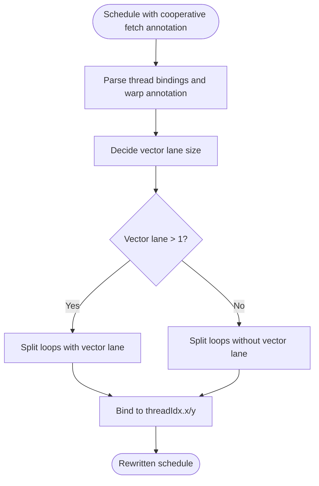
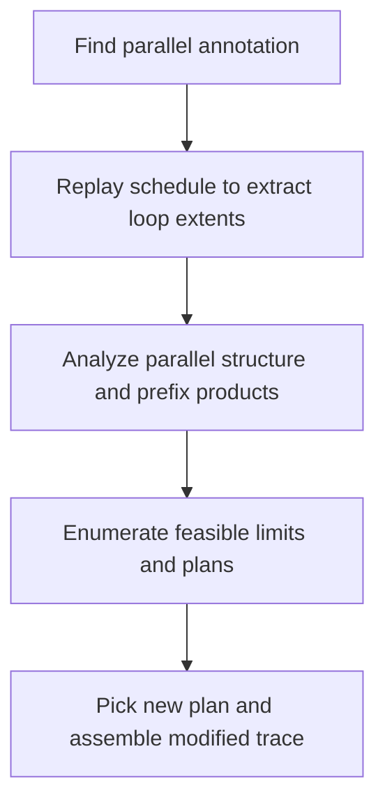
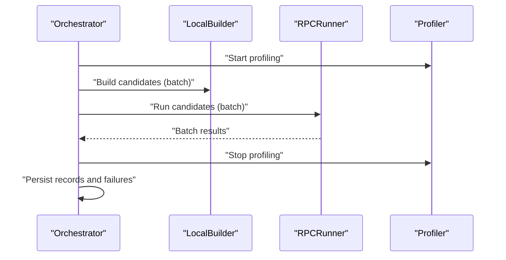
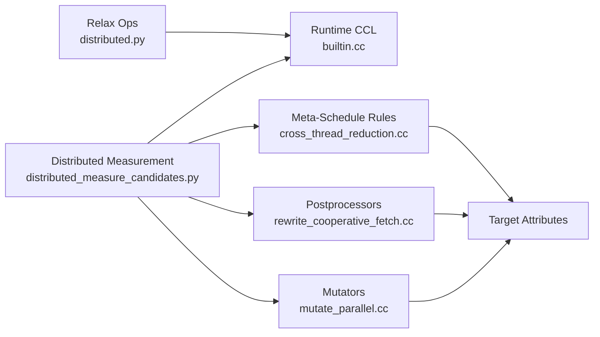

# Distributed Training Optimization

<cite>
**Referenced Files in This Document**
- [distributed.py](file://python/tvm/relax/op/distributed/distributed.py)
- [builtin.cc](file://src/runtime/disco/builtin.cc)
- [cross_thread_reduction.cc](file://src/s_tir/meta_schedule/schedule_rule/cross_thread_reduction.cc)
- [rewrite_cooperative_fetch.cc](file://src/s_tir/meta_schedule/postproc/rewrite_cooperative_fetch.cc)
- [mutate_parallel.cc](file://src/s_tir/meta_schedule/mutator/mutate_parallel.cc)
- [distributed_measure_candidates.py](file://python/tvm/s_tir/meta_schedule/testing/distributed_measure_candidates.py)
- [profiling.cc](file://src/runtime/profiling.cc)
- [README.md](file://README.md)
</cite>

## Table of Contents
1. [Introduction](#introduction)
2. [Project Structure](#project-structure)
3. [Core Components](#core-components)
4. [Architecture Overview](#architecture-overview)
5. [Detailed Component Analysis](#detailed-component-analysis)
6. [Dependency Analysis](#dependency-analysis)
7. [Performance Considerations](#performance-considerations)
8. [Troubleshooting Guide](#troubleshooting-guide)
9. [Conclusion](#conclusion)
10. [Appendices](#appendices)

## Introduction
This document explains distributed training optimization techniques in TVM with a focus on the meta-scheduling system, communication-aware scheduling, and automatic optimization passes tailored for distributed workloads. It covers:
- Communication-aware scheduling and resource allocation strategies
- Gradient compression and quantization-aware distributed training
- Memory-efficient optimization algorithms
- Automatic optimization passes for distributed training (operator fusion across communication boundaries, pipeline optimization, memory scheduling)
- Performance profiling tools for distributed workloads (communication bottleneck detection, load balancing analysis)
- Practical examples for optimizing distributed training performance, configuring gradient compression ratios, and implementing efficient communication patterns
- Integration with distributed training best practices (ring-allreduce, hierarchical allreduce, adaptive communication scheduling)

## Project Structure
The distributed training stack in TVM spans Python frontends, Relax operators, runtime communication libraries, and S-TIR meta-scheduling passes:
- Relax distributed operators for sharding, redistribution, and local-view calls
- Runtime communication library (disco) exposing collective communication functions
- S-TIR meta-scheduling rules and postprocessors for GPU kernels and memory scheduling
- Distributed candidate measurement harness for RPC-based distributed tuning

**Diagram sources**
- [distributed.py:30-139](file://python/tvm/relax/op/distributed/distributed.py#L30-L139)
- [builtin.cc:87-127](file://src/runtime/disco/builtin.cc#L87-L127)
- [cross_thread_reduction.cc:53-120](file://src/s_tir/meta_schedule/schedule_rule/cross_thread_reduction.cc#L53-L120)
- [rewrite_cooperative_fetch.cc:153-234](file://src/s_tir/meta_schedule/postproc/rewrite_cooperative_fetch.cc#L153-L234)
- [mutate_parallel.cc:256-313](file://src/s_tir/meta_schedule/mutator/mutate_parallel.cc#L256-L313)
- [distributed_measure_candidates.py:83-151](file://python/tvm/s_tir/meta_schedule/testing/distributed_measure_candidates.py#L83-L151)

**Section sources**
- [distributed.py:30-139](file://python/tvm/relax/op/distributed/distributed.py#L30-L139)
- [builtin.cc:87-127](file://src/runtime/disco/builtin.cc#L87-L127)
- [cross_thread_reduction.cc:53-120](file://src/s_tir/meta_schedule/schedule_rule/cross_thread_reduction.cc#L53-L120)
- [rewrite_cooperative_fetch.cc:153-234](file://src/s_tir/meta_schedule/postproc/rewrite_cooperative_fetch.cc#L153-L234)
- [mutate_parallel.cc:256-313](file://src/s_tir/meta_schedule/mutator/mutate_parallel.cc#L256-L313)
- [distributed_measure_candidates.py:83-151](file://python/tvm/s_tir/meta_schedule/testing/distributed_measure_candidates.py#L83-L151)

## Core Components
- Relax distributed operators:
  - Sharding annotation and redistribution for tensor partitioning across devices
  - Local-view call to execute worker-local TIR functions
- Runtime communication library:
  - Collective communication wrappers (allreduce, allgather, broadcast, scatter/gather variants)
  - Worker synchronization and device binding helpers
- S-TIR meta-scheduling:
  - Cross-thread reduction rule for intra-kernel reductions with cross-thread fusion
  - Cooperative fetch postprocessor for vectorized memory access aligned with thread warps
  - Parallel extent mutator for CPU-side parallelism budgeting
- Distributed candidate measurement:
  - RPC-based builder/runner orchestration for distributed tuning across nodes

**Section sources**
- [distributed.py:30-139](file://python/tvm/relax/op/distributed/distributed.py#L30-L139)
- [builtin.cc:87-127](file://src/runtime/disco/builtin.cc#L87-L127)
- [cross_thread_reduction.cc:53-120](file://src/s_tir/meta_schedule/schedule_rule/cross_thread_reduction.cc#L53-L120)
- [rewrite_cooperative_fetch.cc:153-234](file://src/s_tir/meta_schedule/postproc/rewrite_cooperative_fetch.cc#L153-L234)
- [mutate_parallel.cc:256-313](file://src/s_tir/meta_schedule/mutator/mutate_parallel.cc#L256-L313)
- [distributed_measure_candidates.py:83-151](file://python/tvm/s_tir/meta_schedule/testing/distributed_measure_candidates.py#L83-L151)

## Architecture Overview
The distributed training optimization pipeline integrates Relax IR transformations, S-TIR meta-scheduling, and runtime communication:

**Diagram sources**
- [distributed.py:30-139](file://python/tvm/relax/op/distributed/distributed.py#L30-L139)
- [builtin.cc:87-127](file://src/runtime/disco/builtin.cc#L87-L127)
- [cross_thread_reduction.cc:53-120](file://src/s_tir/meta_schedule/schedule_rule/cross_thread_reduction.cc#L53-L120)
- [rewrite_cooperative_fetch.cc:153-234](file://src/s_tir/meta_schedule/postproc/rewrite_cooperative_fetch.cc#L153-L234)
- [mutate_parallel.cc:256-313](file://src/s_tir/meta_schedule/mutator/mutate_parallel.cc#L256-L313)
- [distributed_measure_candidates.py:83-151](file://python/tvm/s_tir/meta_schedule/testing/distributed_measure_candidates.py#L83-L151)

## Detailed Component Analysis

### Relax Distributed Operators
- annotate_sharding: Attach device mesh and placement to tensors for sharded execution
- redistribute: Redistribute tensors across devices according to a new device mesh and placement
- call_tir_local_view: Invoke worker-local TIR primfuncs that operate on local shards
- redistribute_replica_to_shard: Slice a replicated tensor into equal parts across workers

These operators enable:
- Communication-aware scheduling by ensuring computation operates on local shards
- Operator fusion across communication boundaries by keeping data locality intact

**Diagram sources**
- [distributed.py:30-139](file://python/tvm/relax/op/distributed/distributed.py#L30-L139)

**Section sources**
- [distributed.py:30-139](file://python/tvm/relax/op/distributed/distributed.py#L30-L139)

### Runtime Communication Library (disco)
- Collective communication wrappers: allreduce, allgather, broadcast_from_worker0, scatter_from_worker0, gather_to_worker0
- Group communication: send_to_next_group, recv_from_prev_group
- Worker-to-worker messaging: send_to_worker, recv_from_worker
- Synchronization and device binding helpers for deterministic execution

Key capabilities:
- Communication-aware scheduling: kernels can be scheduled around communication boundaries
- Hierarchical allreduce strategies: group-level primitives enable hierarchical designs
- Adaptive communication scheduling: runtime can choose communication patterns based on topology

**Diagram sources**
- [builtin.cc:109-119](file://src/runtime/disco/builtin.cc#L109-L119)
- [builtin.cc:87-105](file://src/runtime/disco/builtin.cc#L87-L105)

**Section sources**
- [builtin.cc:87-127](file://src/runtime/disco/builtin.cc#L87-L127)

### Cross-Thread Reduction Rule (Communication-Aware Intra-Kernel Fusion)
Purpose:
- Detect reduction blocks that benefit from cross-thread reduction
- Fuse producer-consumer blocks to reduce inter-kernel synchronization
- Bind fused reduction loops to threadIdx.x and set buffer scopes appropriately

Behavior highlights:
- Checks target attributes (max_threads_per_block, thread_warp_size)
- Computes-at consumer blocks when fusible
- Reorders/fuses reduction loops and binds to thread axis
- Sets buffer scope to shared memory for intermediate results

**Diagram sources**
- [cross_thread_reduction.cc:53-120](file://src/s_tir/meta_schedule/schedule_rule/cross_thread_reduction.cc#L53-L120)

**Section sources**
- [cross_thread_reduction.cc:53-120](file://src/s_tir/meta_schedule/schedule_rule/cross_thread_reduction.cc#L53-L120)

### Cooperative Fetch Postprocessor (Memory-Efficient Access)
Purpose:
- Convert cooperative fetch annotations into explicit vectorized memory access patterns
- Align vector lanes with thread warps for bandwidth efficiency
- Respect data type widths to avoid unsupported vectorization

Behavior highlights:
- Parses thread bindings and warp execution annotations
- Splits loops to achieve vector lanes and binds to threadIdx.x/y
- Disables vectorization for 64-bit data types when unsupported
- Rewrites annotations to actual loop transformations

**Diagram sources**
- [rewrite_cooperative_fetch.cc:153-234](file://src/s_tir/meta_schedule/postproc/rewrite_cooperative_fetch.cc#L153-L234)

**Section sources**
- [rewrite_cooperative_fetch.cc:153-234](file://src/s_tir/meta_schedule/postproc/rewrite_cooperative_fetch.cc#L153-L234)

### Parallel Extent Mutator (CPU Parallel Budgeting)
Purpose:
- Mutate parallel extents for CPU-bound parts of the pipeline
- Respect per-core parallelism limits to avoid oversubscription

Behavior highlights:
- Analyzes parallel structure across subtrees
- Computes feasible parallel plans respecting max_jobs_per_core × num_cores
- Samples alternative plans and replaces annotations in the trace

**Diagram sources**
- [mutate_parallel.cc:256-313](file://src/s_tir/meta_schedule/mutator/mutate_parallel.cc#L256-L313)

**Section sources**
- [mutate_parallel.cc:256-313](file://src/s_tir/meta_schedule/mutator/mutate_parallel.cc#L256-L313)

### Distributed Candidate Measurement Harness
Purpose:
- Distribute S-TIR candidate generation and evaluation across RPC workers
- Batch and orchestrate builder/runner sessions for scalability

Highlights:
- Loads candidates from JSON databases
- Sends batches to builder and runner via RPC
- Aggregates results and persists tuning records
- Tracks build/run failures and logs timing

**Diagram sources**
- [distributed_measure_candidates.py:83-151](file://python/tvm/s_tir/meta_schedule/testing/distributed_measure_candidates.py#L83-L151)
- [profiling.cc:122-159](file://src/runtime/profiling.cc#L122-L159)

**Section sources**
- [distributed_measure_candidates.py:83-151](file://python/tvm/s_tir/meta_schedule/testing/distributed_measure_candidates.py#L83-L151)
- [profiling.cc:122-159](file://src/runtime/profiling.cc#L122-L159)

## Dependency Analysis
- Relax distributed operators depend on runtime communication functions for collective operations
- S-TIR meta-scheduling rules rely on target attributes (threads per block, warp size) to guide transformations
- Distributed measurement harness depends on RPC infrastructure and S-TIR database formats

**Diagram sources**
- [distributed.py:30-139](file://python/tvm/relax/op/distributed/distributed.py#L30-L139)
- [builtin.cc:87-127](file://src/runtime/disco/builtin.cc#L87-L127)
- [cross_thread_reduction.cc:30-50](file://src/s_tir/meta_schedule/schedule_rule/cross_thread_reduction.cc#L30-L50)
- [rewrite_cooperative_fetch.cc:130-136](file://src/s_tir/meta_schedule/postproc/rewrite_cooperative_fetch.cc#L130-L136)
- [mutate_parallel.cc:189-195](file://src/s_tir/meta_schedule/mutator/mutate_parallel.cc#L189-L195)
- [distributed_measure_candidates.py:83-151](file://python/tvm/s_tir/meta_schedule/testing/distributed_measure_candidates.py#L83-L151)

**Section sources**
- [distributed.py:30-139](file://python/tvm/relax/op/distributed/distributed.py#L30-L139)
- [builtin.cc:87-127](file://src/runtime/disco/builtin.cc#L87-L127)
- [cross_thread_reduction.cc:30-50](file://src/s_tir/meta_schedule/schedule_rule/cross_thread_reduction.cc#L30-L50)
- [rewrite_cooperative_fetch.cc:130-136](file://src/s_tir/meta_schedule/postproc/rewrite_cooperative_fetch.cc#L130-L136)
- [mutate_parallel.cc:189-195](file://src/s_tir/meta_schedule/mutator/mutate_parallel.cc#L189-L195)
- [distributed_measure_candidates.py:83-151](file://python/tvm/s_tir/meta_schedule/testing/distributed_measure_candidates.py#L83-L151)

## Performance Considerations
- Communication-aware scheduling:
  - Keep computation close to data by using annotate_sharding and redistribute to minimize cross-worker transfers
  - Fuse operators across communication boundaries to reduce synchronization overhead
- Memory efficiency:
  - Use cooperative fetch to align vector lanes with thread warps and reduce bandwidth pressure
  - Set buffer scopes to shared memory for intermediates in cross-thread reductions
- CPU parallel budgeting:
  - Limit parallelism per core to avoid contention; use the parallel extent mutator to sample feasible plans
- Distributed tuning:
  - Batch and distribute candidate evaluation via RPC to scale across nodes
  - Profile build and run times to identify bottlenecks in the distributed pipeline

[No sources needed since this section provides general guidance]

## Troubleshooting Guide
- Communication errors:
  - Verify collective wrappers are available for the configured CCL; ensure runtime.disco.* functions resolve
- Scheduling failures:
  - Check target attributes (max_threads_per_block, thread_warp_size) are present for cross-thread reduction
  - Confirm cooperative fetch annotations are compatible with vector lanes and data types
- Distributed measurement issues:
  - Inspect RPC runner configuration (tracker host/port/key) and timeouts
  - Review failed indices logs to diagnose build/run failures

**Section sources**
- [builtin.cc:78-85](file://src/runtime/disco/builtin.cc#L78-L85)
- [cross_thread_reduction.cc:30-50](file://src/s_tir/meta_schedule/schedule_rule/cross_thread_reduction.cc#L30-L50)
- [rewrite_cooperative_fetch.cc:195-197](file://src/s_tir/meta_schedule/postproc/rewrite_cooperative_fetch.cc#L195-L197)
- [distributed_measure_candidates.py:158-173](file://python/tvm/s_tir/meta_schedule/testing/distributed_measure_candidates.py#L158-L173)

## Conclusion
TVM’s distributed training optimization combines:
- Relax distributed operators for communication-aware data partitioning
- Runtime communication primitives enabling ring-allreduce and hierarchical strategies
- S-TIR meta-scheduling rules and postprocessors for memory-efficient, cross-thread optimized kernels
- Distributed candidate measurement harness for scalable, RPC-based tuning

Together, these components support practical, high-performance distributed training with robust profiling and troubleshooting capabilities.

[No sources needed since this section summarizes without analyzing specific files]

## Appendices

### Practical Examples and Recipes
- Optimizing distributed training performance:
  - Use annotate_sharding and redistribute to keep computation local
  - Apply cross-thread reduction rule to fuse producers with consumers across communication boundaries
  - Enable cooperative fetch postprocessor to vectorize memory access aligned with thread warps
- Configuring gradient compression ratios:
  - Integrate quantization-aware operators upstream of allreduce to reduce communication volume
  - Adjust quantization parameters to balance accuracy and bandwidth
- Implementing efficient communication patterns:
  - Prefer ring-allreduce for homogeneous clusters; use hierarchical allreduce for multi-rack setups
  - Use group primitives (send_to_next_group, recv_from_prev_group) to implement staged collectives

[No sources needed since this section provides general guidance]