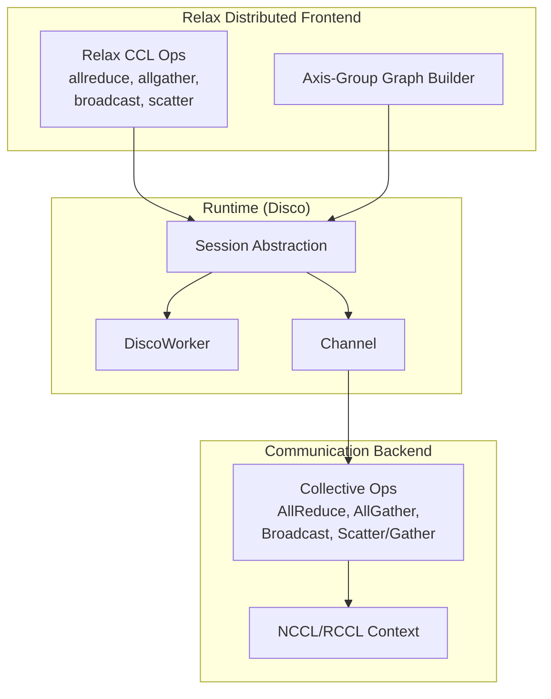
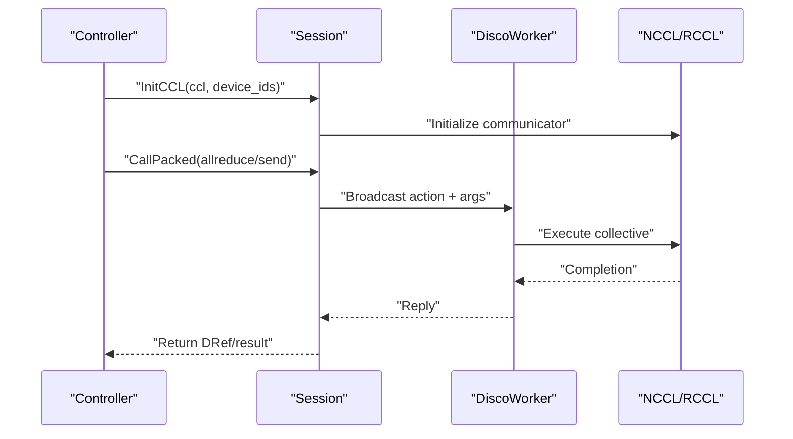
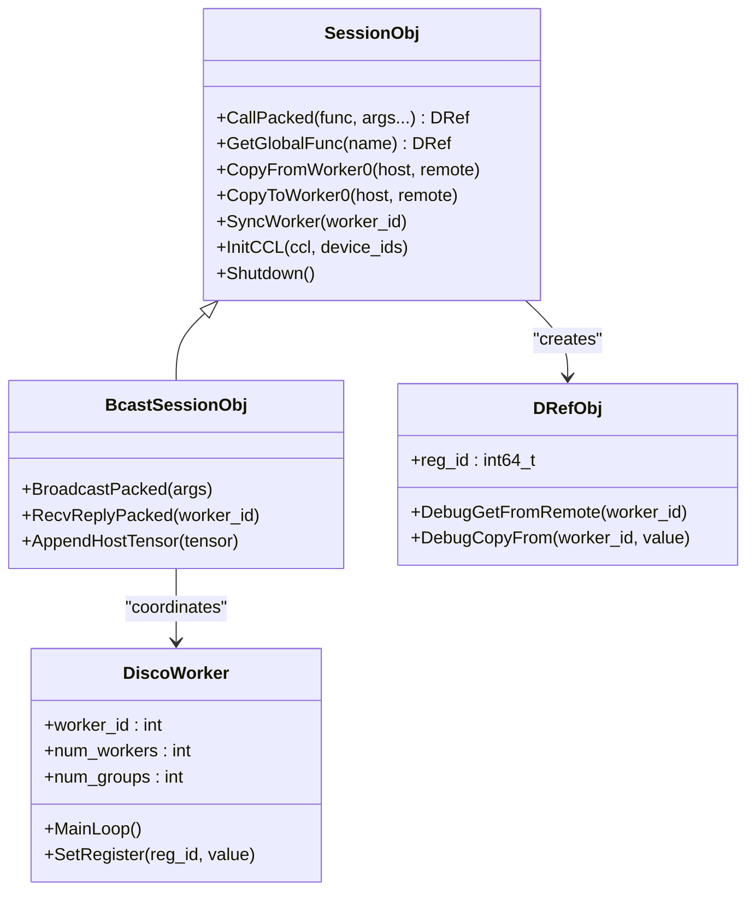
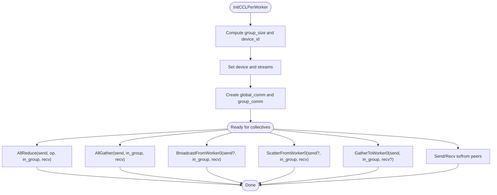
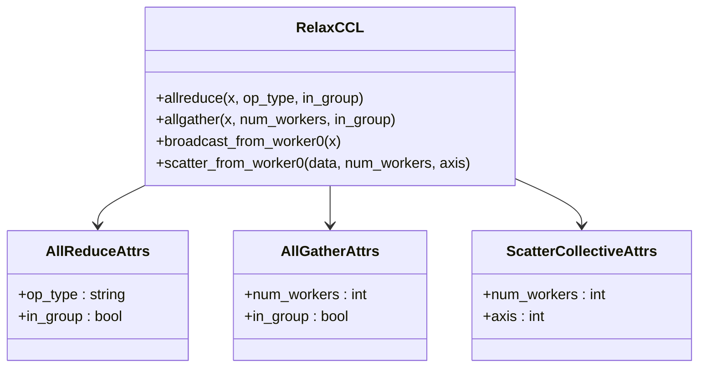
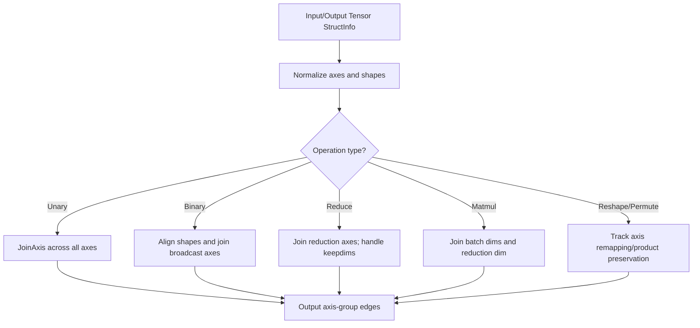
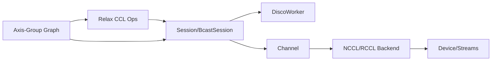

# Distributed Training Support

<cite>
**Referenced Files in This Document**
- [disco_worker.h](file://include/tvm/runtime/disco/disco_worker.h)
- [disco_worker.cc](file://src/runtime/disco/disco_worker.cc)
- [session.h](file://include/tvm/runtime/disco/session.h)
- [session.cc](file://src/runtime/disco/session.cc)
- [bcast_session.cc](file://src/runtime/disco/bcast_session.cc)
- [nccl.cc](file://src/runtime/disco/nccl/nccl.cc)
- [ccl.h](file://include/tvm/relax/attrs/ccl.h)
- [ccl.cc](file://src/relax/op/ccl/ccl.cc)
- [ccl_dist.cc](file://src/relax/op/distributed/ccl.cc)
- [axis_group_graph.cc](file://src/relax/distributed/axis_group_graph.cc)
</cite>

## Table of Contents
1. [Introduction](#introduction)
2. [Project Structure](#project-structure)
3. [Core Components](#core-components)
4. [Architecture Overview](#architecture-overview)
5. [Detailed Component Analysis](#detailed-component-analysis)
6. [Dependency Analysis](#dependency-analysis)
7. [Performance Considerations](#performance-considerations)
8. [Troubleshooting Guide](#troubleshooting-guide)
9. [Conclusion](#conclusion)
10. [Appendices](#appendices)

## Introduction
This document explains TVM’s distributed training capabilities centered around the Disco runtime and Relax distributed frontend. It covers:
- Collective communication operations (allreduce, allgather, broadcast, scatter/gather)
- Data parallelism patterns and model parallelism strategies
- Graph-level distributed operations via Relax
- Runtime coordination across multiple workers
- Communication backends (NCCL/RCCL, with extensibility for others)
- Pipeline parallelism and gradient compression techniques
- Practical setup, configuration, optimization, integration, fault tolerance, and monitoring
- Common challenges, debugging, and scaling guidance

## Project Structure
The distributed stack spans three layers:
- Runtime (Disco): Control plane orchestration, worker lifecycle, and channel abstractions
- Communication Backend (NCCL/RCCL): Data plane for efficient multi-GPU/allreduce
- Relax Distributed Frontend: Graph-level operators and axis-group analysis for parallelism

**Diagram sources**
- [session.h:183-297](file://include/tvm/runtime/disco/session.h#L183-L297)
- [disco_worker.h:41-99](file://include/tvm/runtime/disco/disco_worker.h#L41-L99)
- [nccl.cc:57-117](file://src/runtime/disco/nccl/nccl.cc#L57-L117)
- [ccl.cc:37-174](file://src/relax/op/ccl/ccl.cc#L37-L174)
- [axis_group_graph.cc:66-393](file://src/relax/distributed/axis_group_graph.cc#L66-L393)

**Section sources**
- [session.h:19-72](file://include/tvm/runtime/disco/session.h#L19-L72)
- [disco_worker.h:21-40](file://include/tvm/runtime/disco/disco_worker.h#L21-L40)
- [nccl.cc:57-117](file://src/runtime/disco/nccl/nccl.cc#L57-L117)
- [ccl.cc:37-174](file://src/relax/op/ccl/ccl.cc#L37-L174)
- [axis_group_graph.cc:66-393](file://src/relax/distributed/axis_group_graph.cc#L66-L393)

## Core Components
- Session: Manages workers, control-plane RPC, and initialization of communication backends
- DiscoWorker: Per-worker execution loop handling control actions and data-plane ops
- Channel: Bi-directional control channel between controller and workers
- NCCL/RCCL Backend: Implements collective operations and per-worker context
- Relax CCL Ops: Graph-level operators for distributed computation
- Axis-Group Graph: Tracks tensor axes across operations to infer parallelism

Key responsibilities:
- Control plane: Broadcast commands, manage registers, sync workers
- Data plane: Perform allreduce/allgather/broadcast/scatter/gather efficiently
- Graph-level: Express data/model parallelism and derive sharding plans

**Section sources**
- [session.h:183-297](file://include/tvm/runtime/disco/session.h#L183-L297)
- [disco_worker.cc:49-192](file://src/runtime/disco/disco_worker.cc#L49-L192)
- [nccl.cc:119-333](file://src/runtime/disco/nccl/nccl.cc#L119-L333)
- [ccl.h:34-86](file://include/tvm/relax/attrs/ccl.h#L34-L86)
- [ccl.cc:37-174](file://src/relax/op/ccl/ccl.cc#L37-L174)
- [axis_group_graph.cc:66-393](file://src/relax/distributed/axis_group_graph.cc#L66-L393)

## Architecture Overview
Disco is a single-program-multiple-data (SPMD) runtime:
- One controller orchestrates N workers
- Workers execute identical instructions with different data partitions
- Worker-0 is co-located with the controller and can share tensors directly
- Control plane uses RPC-like channels; data plane uses optimized backends

**Diagram sources**
- [session.h:237-241](file://include/tvm/runtime/disco/session.h#L237-L241)
- [session.cc:33-53](file://src/runtime/disco/session.cc#L33-L53)
- [bcast_session.cc:70-76](file://src/runtime/disco/bcast_session.cc#L70-L76)
- [disco_worker.cc:49-103](file://src/runtime/disco/disco_worker.cc#L49-L103)
- [nccl.cc:119-133](file://src/runtime/disco/nccl/nccl.cc#L119-L133)

## Detailed Component Analysis

### Runtime Session and Worker
- Session encapsulates control-plane operations: registering functions, calling packed functions, copying tensors to/from worker-0, syncing workers, initializing CCL, and shutting down.
- BcastSession implements broadcast semantics and register allocation for remote references.
- DiscoWorker runs a main loop receiving control actions, invoking registered functions, and performing data-plane operations.

**Diagram sources**
- [session.h:183-297](file://include/tvm/runtime/disco/session.h#L183-L297)
- [bcast_session.cc:29-121](file://src/runtime/disco/bcast_session.cc#L29-L121)
- [disco_worker.h:41-99](file://include/tvm/runtime/disco/disco_worker.h#L41-L99)

**Section sources**
- [session.h:183-297](file://include/tvm/runtime/disco/session.h#L183-L297)
- [session.cc:27-53](file://src/runtime/disco/session.cc#L27-L53)
- [bcast_session.cc:48-121](file://src/runtime/disco/bcast_session.cc#L48-L121)
- [disco_worker.cc:49-192](file://src/runtime/disco/disco_worker.cc#L49-L192)

### Communication Backend (NCCL/RCCL)
- Initializes communicators per worker, splits global into groups, and exposes typed wrappers for collectives.
- Supports allreduce, allgather, broadcast, scatter/gather, and point-to-point send/recv across groups.
- Provides synchronization primitives and tests for cross-group messaging.

**Diagram sources**
- [nccl.cc:57-117](file://src/runtime/disco/nccl/nccl.cc#L57-L117)
- [nccl.cc:119-333](file://src/runtime/disco/nccl/nccl.cc#L119-L333)

**Section sources**
- [nccl.cc:57-117](file://src/runtime/disco/nccl/nccl.cc#L57-L117)
- [nccl.cc:119-333](file://src/runtime/disco/nccl/nccl.cc#L119-L333)

### Relax Distributed Frontend
- Graph-level CCL ops: allreduce, allgather, broadcast_from_worker0, scatter_from_worker0.
- Attribute definitions specify operation semantics (e.g., reduction type, grouping).
- Distributed inference adds structural info for DTensor sharding propagation.

**Diagram sources**
- [ccl.h:34-86](file://include/tvm/relax/attrs/ccl.h#L34-L86)
- [ccl.cc:37-174](file://src/relax/op/ccl/ccl.cc#L37-L174)
- [ccl_dist.cc:27-39](file://src/relax/op/distributed/ccl.cc#L27-L39)

**Section sources**
- [ccl.h:34-86](file://include/tvm/relax/attrs/ccl.h#L34-L86)
- [ccl.cc:37-174](file://src/relax/op/ccl/ccl.cc#L37-L174)
- [ccl_dist.cc:27-39](file://src/relax/op/distributed/ccl.cc#L27-L39)

### Axis-Group Graph for Parallelism
- Builds a graph of tensor axes across operations to infer how dimensions are partitioned and aligned.
- Supports unary/binary ops, reductions, matmul, reshape, permutations, and TIR-backed calls.
- Enables downstream transformations to propagate sharding and insert collectives.

**Diagram sources**
- [axis_group_graph.cc:66-393](file://src/relax/distributed/axis_group_graph.cc#L66-L393)

**Section sources**
- [axis_group_graph.cc:66-393](file://src/relax/distributed/axis_group_graph.cc#L66-L393)

## Dependency Analysis
- Relax CCL ops depend on runtime registration and backend dispatch
- Session and BcastSession depend on channel implementations and worker lifecycle
- NCCL/RCCL backend depends on thread-local contexts and device/stream management
- Axis-Group Graph integrates with Relax analysis and TIR buffers

**Diagram sources**
- [ccl.cc:37-174](file://src/relax/op/ccl/ccl.cc#L37-L174)
- [session.h:183-297](file://include/tvm/runtime/disco/session.h#L183-L297)
- [bcast_session.cc:48-121](file://src/runtime/disco/bcast_session.cc#L48-L121)
- [disco_worker.cc:49-192](file://src/runtime/disco/disco_worker.cc#L49-L192)
- [nccl.cc:57-117](file://src/runtime/disco/nccl/nccl.cc#L57-L117)
- [axis_group_graph.cc:66-393](file://src/relax/distributed/axis_group_graph.cc#L66-L393)

**Section sources**
- [ccl.cc:37-174](file://src/relax/op/ccl/ccl.cc#L37-L174)
- [session.h:183-297](file://include/tvm/runtime/disco/session.h#L183-L297)
- [bcast_session.cc:48-121](file://src/runtime/disco/bcast_session.cc#L48-L121)
- [disco_worker.cc:49-192](file://src/runtime/disco/disco_worker.cc#L49-L192)
- [nccl.cc:57-117](file://src/runtime/disco/nccl/nccl.cc#L57-L117)
- [axis_group_graph.cc:66-393](file://src/relax/distributed/axis_group_graph.cc#L66-L393)

## Performance Considerations
- Use grouped communicators to minimize contention and overlap comms with compute
- Prefer inplace or fused operations to reduce memory traffic
- Align tensor shapes to backend alignment requirements (e.g., scatter axis divisibility)
- Choose appropriate data types; avoid unsupported types in allreduce
- Utilize stream synchronization judiciously to balance throughput and latency
- For pipeline parallelism, interleave compute and communication to hide latency

[No sources needed since this section provides general guidance]

## Troubleshooting Guide
Common issues and remedies:
- Initialization failures: Verify unique IDs and device counts match worker topology
- Shape mismatches: Ensure scatter/gather axes divide evenly; check gather/scatter sizes
- Unsupported data types: Avoid float8 in allreduce; use supported dtypes
- Deadlocks: Ensure balanced send/receives across groups; pair sends with receives
- Debugging: Use debug getters/setters to inspect remote registers; leverage worker-0 for shared data

**Section sources**
- [nccl.cc:119-133](file://src/runtime/disco/nccl/nccl.cc#L119-L133)
- [nccl.cc:168-215](file://src/runtime/disco/nccl/nccl.cc#L168-L215)
- [nccl.cc:217-264](file://src/runtime/disco/nccl/nccl.cc#L217-L264)
- [disco_worker.cc:147-167](file://src/runtime/disco/disco_worker.cc#L147-L167)

## Conclusion
TVM’s distributed training stack combines a flexible runtime (Disco), efficient communication backends (NCCL/RCCL), and expressive graph-level operators (Relax CCL) to support data and model parallelism. Together with axis-group analysis, it enables automatic derivation of sharding and collectives, while the runtime provides robust control-plane orchestration and debugging hooks.

[No sources needed since this section summarizes without analyzing specific files]

## Appendices

### Practical Setup and Configuration
- Cluster setup: Launch a controller and N workers; ensure network connectivity and device visibility
- Backend selection: Initialize CCL with the desired backend (e.g., nccl, rccl) and device IDs
- Data plane configuration: Use grouped communicators for multi-rank/multi-GPU jobs
- Graph-level distribution: Insert Relax CCL ops and rely on axis-group analysis for sharding propagation

**Section sources**
- [session.h:237-241](file://include/tvm/runtime/disco/session.h#L237-L241)
- [bcast_session.cc:70-76](file://src/runtime/disco/bcast_session.cc#L70-L76)
- [nccl.cc:57-117](file://src/runtime/disco/nccl/nccl.cc#L57-L117)
- [ccl.cc:37-174](file://src/relax/op/ccl/ccl.cc#L37-L174)
- [axis_group_graph.cc:66-393](file://src/relax/distributed/axis_group_graph.cc#L66-L393)

### Pipeline Parallelism and Gradient Compression
- Pipeline parallelism: Interleave stages across devices; coordinate micro-batches with barriers and grouped collectives
- Gradient compression: Apply quantization/decompression before/allreduce; ensure numerical stability and convergence

[No sources needed since this section provides general guidance]

### Integration and Monitoring
- Integration: Expose training loops via Relax graphs; integrate with popular frameworks by converting models to Relax IR
- Monitoring: Track collective durations, bandwidth utilization, and queue depths; use backend-specific profilers

[No sources needed since this section provides general guidance]