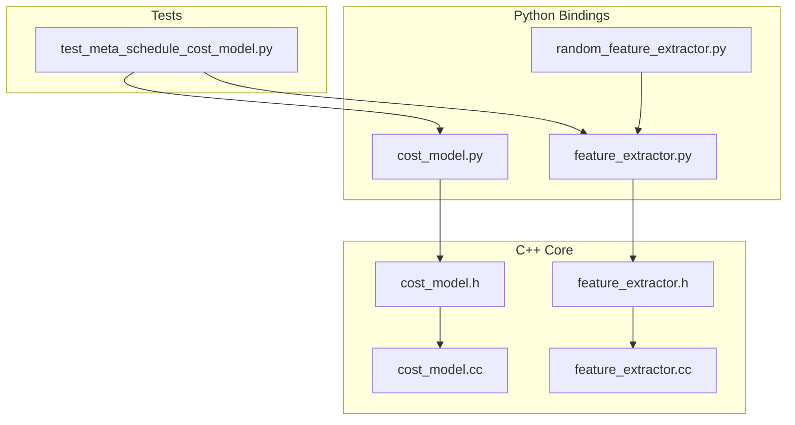
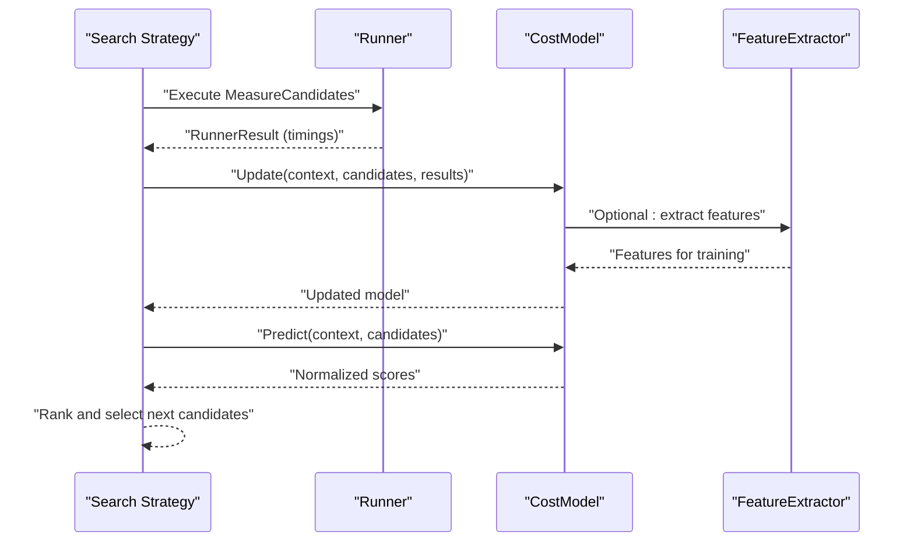
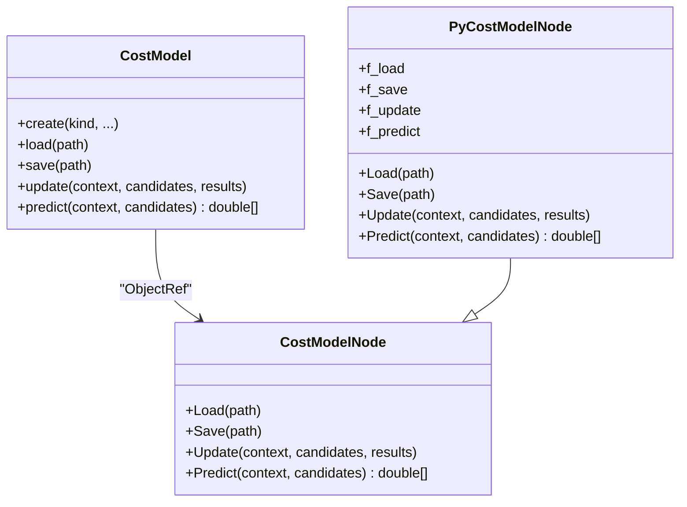
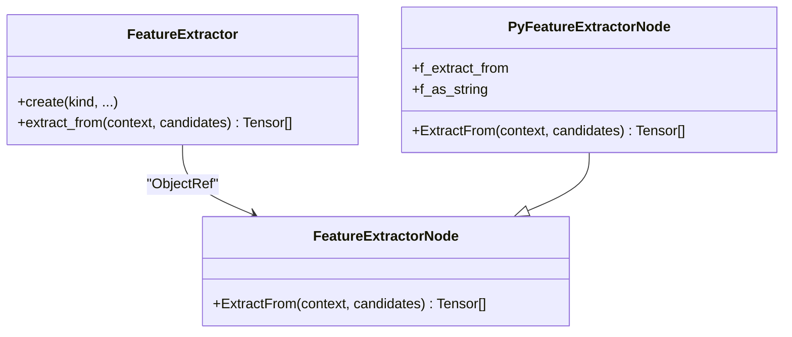
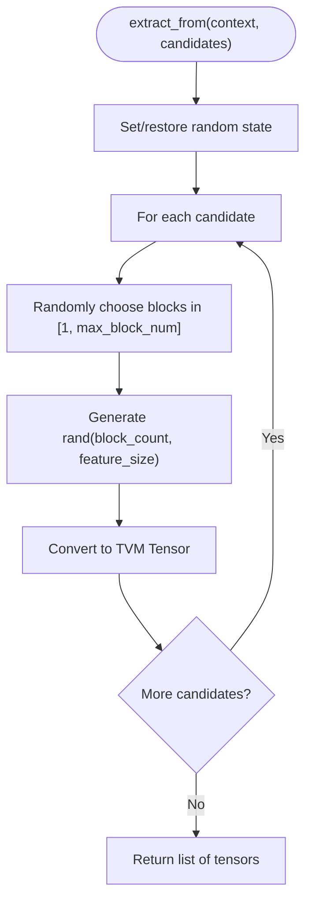
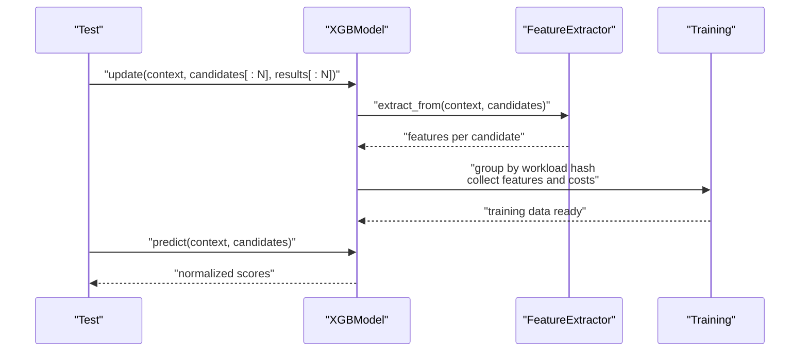
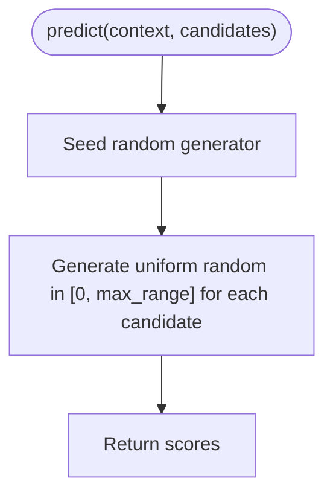
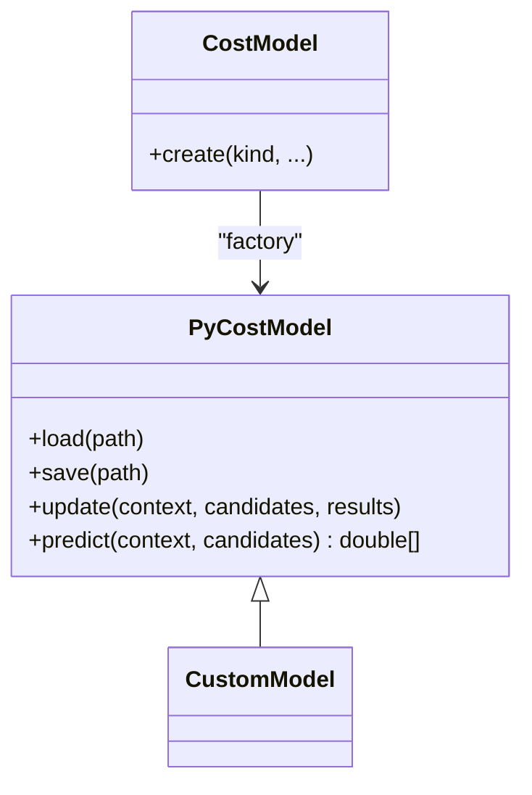
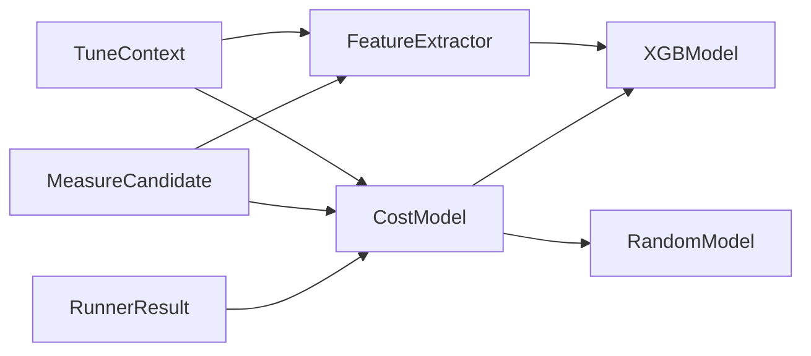

# Cost Models and Prediction

<cite>
**Referenced Files in This Document**
- [cost_model.h](file://include/tvm/s_tir/meta_schedule/cost_model.h)
- [cost_model.cc](file://src/s_tir/meta_schedule/cost_model/cost_model.cc)
- [cost_model.py](file://python/tvm/s_tir/meta_schedule/cost_model/cost_model.py)
- [feature_extractor.h](file://include/tvm/s_tir/meta_schedule/feature_extractor.h)
- [feature_extractor.cc](file://src/s_tir/meta_schedule/feature_extractor/feature_extractor.cc)
- [feature_extractor.py](file://python/tvm/s_tir/meta_schedule/feature_extractor/feature_extractor.py)
- [random_feature_extractor.py](file://python/tvm/s_tir/meta_schedule/feature_extractor/random_feature_extractor.py)
- [test_meta_schedule_cost_model.py](file://tests/python/s_tir/meta_schedule/test_meta_schedule_cost_model.py)
</cite>

## Table of Contents
1. [Introduction](#introduction)
2. [Project Structure](#project-structure)
3. [Core Components](#core-components)
4. [Architecture Overview](#architecture-overview)
5. [Detailed Component Analysis](#detailed-component-analysis)
6. [Dependency Analysis](#dependency-analysis)
7. [Performance Considerations](#performance-considerations)
8. [Troubleshooting Guide](#troubleshooting-guide)
9. [Conclusion](#conclusion)
10. [Appendices](#appendices)

## Introduction
This document explains cost models and performance prediction in meta-scheduling. It covers the CostModel base class and Python-side extensibility, the FeatureExtractor system for generating predictive features, and the built-in implementations: XGBoost and random baselines. It also documents feature extraction mechanisms, model training procedures, evaluation and metrics, integration with search strategies, accuracy assessment, training data requirements, and adaptation to different hardware targets.

## Project Structure
The cost model and feature extraction subsystems are organized across C++ headers, C++ runtime bindings, and Python wrappers and implementations. The key areas are:
- CostModel interface and Python extensibility
- FeatureExtractor interface and per-store feature extraction
- Built-in models: XGBoost and Random baseline
- Tests validating behavior and integration

**Diagram sources**
- [cost_model.h:41-79](file://include/tvm/s_tir/meta_schedule/cost_model.h#L41-L79)
- [cost_model.cc:27-95](file://src/s_tir/meta_schedule/cost_model/cost_model.cc#L27-L95)
- [feature_extractor.h:37-92](file://include/tvm/s_tir/meta_schedule/feature_extractor.h#L37-L92)
- [feature_extractor.cc:27-70](file://src/s_tir/meta_schedule/feature_extractor/feature_extractor.cc#L27-L70)
- [cost_model.py:41-154](file://python/tvm/s_tir/meta_schedule/cost_model/cost_model.py#L41-L154)
- [feature_extractor.py:39-80](file://python/tvm/s_tir/meta_schedule/feature_extractor/feature_extractor.py#L39-L80)
- [random_feature_extractor.py:29-65](file://python/tvm/s_tir/meta_schedule/feature_extractor/random_feature_extractor.py#L29-L65)
- [test_meta_schedule_cost_model.py:74-102](file://tests/python/s_tir/meta_schedule/test_meta_schedule_cost_model.py#L74-L102)

**Section sources**
- [cost_model.h:41-79](file://include/tvm/s_tir/meta_schedule/cost_model.h#L41-L79)
- [feature_extractor.h:37-92](file://include/tvm/s_tir/meta_schedule/feature_extractor.h#L37-L92)
- [cost_model.py:41-154](file://python/tvm/s_tir/meta_schedule/cost_model/cost_model.py#L41-L154)
- [feature_extractor.py:39-80](file://python/tvm/s_tir/meta_schedule/feature_extractor/feature_extractor.py#L39-L80)
- [random_feature_extractor.py:29-65](file://python/tvm/s_tir/meta_schedule/feature_extractor/random_feature_extractor.py#L29-L65)
- [test_meta_schedule_cost_model.py:74-102](file://tests/python/s_tir/meta_schedule/test_meta_schedule_cost_model.py#L74-L102)

## Core Components
- CostModel: Defines the contract for loading, saving, updating, and predicting normalized scores for schedules. Python-side extensibility via PyCostModel enables custom implementations.
- FeatureExtractor: Defines extracting per-candidate features used by cost models. Includes a per-store feature extractor and a Python-side extensibility wrapper.
- Built-in models: XGBoost-based model and a random baseline model for evaluation and fallback.

Key responsibilities:
- CostModel: Persist/load models, update with measured results, predict normalized scores for ranking.
- FeatureExtractor: Convert schedules/measurement candidates into feature tensors suitable for ML models.
- Integration: CostModel.update uses RunnerResult timings; FeatureExtractor feeds model training data.

**Section sources**
- [cost_model.h:41-79](file://include/tvm/s_tir/meta_schedule/cost_model.h#L41-L79)
- [cost_model.cc:27-95](file://src/s_tir/meta_schedule/cost_model/cost_model.cc#L27-L95)
- [cost_model.py:41-154](file://python/tvm/s_tir/meta_schedule/cost_model/cost_model.py#L41-L154)
- [feature_extractor.h:37-92](file://include/tvm/s_tir/meta_schedule/feature_extractor.h#L37-L92)
- [feature_extractor.cc:27-70](file://src/s_tir/meta_schedule/feature_extractor/feature_extractor.cc#L27-L70)
- [feature_extractor.py:39-80](file://python/tvm/s_tir/meta_schedule/feature_extractor/feature_extractor.py#L39-L80)

## Architecture Overview
The meta-scheduling pipeline integrates measurement, feature extraction, and cost modeling to rank candidates during search.

**Diagram sources**
- [cost_model.h:65-75](file://include/tvm/s_tir/meta_schedule/cost_model.h#L65-L75)
- [feature_extractor.h:54-55](file://include/tvm/s_tir/meta_schedule/feature_extractor.h#L54-L55)
- [test_meta_schedule_cost_model.py:169-193](file://tests/python/s_tir/meta_schedule/test_meta_schedule_cost_model.py#L169-L193)

## Detailed Component Analysis

### CostModel Base and Python Extensibility
- Contract: Load, Save, Update, Predict. Predict returns normalized scores (larger is better).
- Python extensibility: PyCostModel allows overriding load/save/update/predict; a factory constructs a managed object backed by packed functions.
- Registration: Global FFI methods expose Load/Save/Update/Predict and PyCostModel construction.

**Diagram sources**
- [cost_model.h:41-79](file://include/tvm/s_tir/meta_schedule/cost_model.h#L41-L79)
- [cost_model.cc:27-95](file://src/s_tir/meta_schedule/cost_model/cost_model.cc#L27-L95)
- [cost_model.py:41-154](file://python/tvm/s_tir/meta_schedule/cost_model/cost_model.py#L41-L154)

**Section sources**
- [cost_model.h:41-79](file://include/tvm/s_tir/meta_schedule/cost_model.h#L41-L79)
- [cost_model.cc:27-95](file://src/s_tir/meta_schedule/cost_model/cost_model.cc#L27-L95)
- [cost_model.py:41-154](file://python/tvm/s_tir/meta_schedule/cost_model/cost_model.py#L41-L154)

### FeatureExtractor System
- Contract: ExtractFrom produces a list of feature tensors per candidate.
- Python extensibility: PyFeatureExtractor allows custom extraction; a factory constructs a managed object.
- Built-in: PerStoreFeature is exposed via FeatureExtractor.create("per-store-feature").

**Diagram sources**
- [feature_extractor.h:37-92](file://include/tvm/s_tir/meta_schedule/feature_extractor.h#L37-L92)
- [feature_extractor.cc:27-70](file://src/s_tir/meta_schedule/feature_extractor/feature_extractor.cc#L27-L70)
- [feature_extractor.py:39-80](file://python/tvm/s_tir/meta_schedule/feature_extractor/feature_extractor.py#L39-L80)

**Section sources**
- [feature_extractor.h:37-92](file://include/tvm/s_tir/meta_schedule/feature_extractor.h#L37-L92)
- [feature_extractor.cc:27-70](file://src/s_tir/meta_schedule/feature_extractor/feature_extractor.cc#L27-L70)
- [feature_extractor.py:39-80](file://python/tvm/s_tir/meta_schedule/feature_extractor/feature_extractor.py#L39-L80)

### RandomFeatureExtractor
- Purpose: Generates synthetic per-store features for testing and baselines.
- Behavior: Produces a random number of blocks per schedule, each with a fixed feature dimension; seeds ensure reproducibility.

**Diagram sources**
- [random_feature_extractor.py:55-65](file://python/tvm/s_tir/meta_schedule/feature_extractor/random_feature_extractor.py#L55-L65)

**Section sources**
- [random_feature_extractor.py:29-65](file://python/tvm/s_tir/meta_schedule/feature_extractor/random_feature_extractor.py#L29-L65)

### XGBoost Cost Model (Integration and Training)
- Construction: Accepts a FeatureExtractor and warmup parameters; supports reloading saved state.
- Update: Gathers per-candidate features and RunnerResult timings; groups by workload hash and stores features and costs.
- Predict: Uses the trained booster to score candidates; supports callback compatibility for training APIs.
- Warmup: Requires a minimum number of samples before training; otherwise predicts randomly.

**Diagram sources**
- [test_meta_schedule_cost_model.py:169-193](file://tests/python/s_tir/meta_schedule/test_meta_schedule_cost_model.py#L169-L193)
- [test_meta_schedule_cost_model.py:195-236](file://tests/python/s_tir/meta_schedule/test_meta_schedule_cost_model.py#L195-L236)

**Section sources**
- [test_meta_schedule_cost_model.py:169-193](file://tests/python/s_tir/meta_schedule/test_meta_schedule_cost_model.py#L169-L193)
- [test_meta_schedule_cost_model.py:195-236](file://tests/python/s_tir/meta_schedule/test_meta_schedule_cost_model.py#L195-L236)

### Random Baseline Cost Model
- Behavior: Predicts uniformly random scores within a configurable range; supports deterministic seeding and reloading.
- Use cases: Baseline for comparison, warmup before learning models, or fallback when no features are available.

**Diagram sources**
- [test_meta_schedule_cost_model.py:129-144](file://tests/python/s_tir/meta_schedule/test_meta_schedule_cost_model.py#L129-L144)

**Section sources**
- [test_meta_schedule_cost_model.py:129-144](file://tests/python/s_tir/meta_schedule/test_meta_schedule_cost_model.py#L129-L144)

### Custom Cost Model Development
- Derive from PyCostModel and override load/save/update/predict.
- Use CostModel.create(...) to instantiate built-ins ("xgb", "mlp", "random", "none").
- For Python-only models, construct via PyCostModel and register with the framework.

**Diagram sources**
- [cost_model.py:196-274](file://python/tvm/s_tir/meta_schedule/cost_model/cost_model.py#L196-L274)
- [cost_model.py:112-151](file://python/tvm/s_tir/meta_schedule/cost_model/cost_model.py#L112-L151)

**Section sources**
- [cost_model.py:112-151](file://python/tvm/s_tir/meta_schedule/cost_model/cost_model.py#L112-L151)
- [cost_model.py:196-274](file://python/tvm/s_tir/meta_schedule/cost_model/cost_model.py#L196-L274)

## Dependency Analysis
- CostModel depends on TuneContext, MeasureCandidate, and RunnerResult for update and predict.
- FeatureExtractor depends on TuneContext and MeasureCandidate to produce feature tensors.
- XGBModel depends on FeatureExtractor and uses external libraries for training and inference.
- Tests validate end-to-end behavior across models and extractors.

**Diagram sources**
- [cost_model.h:65-75](file://include/tvm/s_tir/meta_schedule/cost_model.h#L65-L75)
- [feature_extractor.h:54-55](file://include/tvm/s_tir/meta_schedule/feature_extractor.h#L54-L55)
- [test_meta_schedule_cost_model.py:169-193](file://tests/python/s_tir/meta_schedule/test_meta_schedule_cost_model.py#L169-L193)

**Section sources**
- [cost_model.h:65-75](file://include/tvm/s_tir/meta_schedule/cost_model.h#L65-L75)
- [feature_extractor.h:54-55](file://include/tvm/s_tir/meta_schedule/feature_extractor.h#L54-L55)
- [test_meta_schedule_cost_model.py:169-193](file://tests/python/s_tir/meta_schedule/test_meta_schedule_cost_model.py#L169-L193)

## Performance Considerations
- Feature extraction cost: Per-store feature extraction scales with the number of blocks; tune buffers_per_store and arith_intensity_curve_num_samples to balance fidelity and speed.
- Model training overhead: XGBoost training benefits from sufficient warmup samples; early updates may degrade performance.
- Predict latency: Predictions are vectorized; ensure batch sizes align with search iteration throughput.
- Hardware adaptation: Adjust feature dimensions and model hyperparameters per target characteristics (memory hierarchy, compute capacity).

## Troubleshooting Guide
Common issues and checks:
- Missing or unimplemented methods in custom models: Ensure load/save/update/predict are implemented when using PyCostModel.
- Feature extractor randomness: RandomFeatureExtractor requires consistent seeding for reproducible predictions.
- XGBoost training stability: Provide adequate warmup samples; verify feature shapes and costs alignment.
- Reload consistency: When reloading models, preserve and restore feature extractor random state to keep predictions aligned.

**Section sources**
- [cost_model.cc:27-50](file://src/s_tir/meta_schedule/cost_model/cost_model.cc#L27-L50)
- [random_feature_extractor.py:47-53](file://python/tvm/s_tir/meta_schedule/feature_extractor/random_feature_extractor.py#L47-L53)
- [test_meta_schedule_cost_model.py:147-158](file://tests/python/s_tir/meta_schedule/test_meta_schedule_cost_model.py#L147-L158)
- [test_meta_schedule_cost_model.py:195-236](file://tests/python/s_tir/meta_schedule/test_meta_schedule_cost_model.py#L195-L236)

## Conclusion
The meta-scheduling cost model system provides a flexible, extensible framework for performance prediction. The CostModel and FeatureExtractor abstractions enable rapid prototyping and deployment of custom predictors. Built-in models like XGBoost and Random offer practical starting points, while the Python extensibility layer supports advanced research and integration with diverse ML stacks.

## Appendices

### Model Evaluation Metrics and Accuracy Assessment
- Metrics: Use mean squared error (MSE), mean absolute error (MAE), and ranking correlation against measured latencies for regression and ranking quality.
- Cross-validation: Employ grouped cross-validation by workload hash to avoid leakage.
- Calibration: Normalize scores so larger is better; consider percentile-based normalization for robustness.

### Training Data Requirements
- Minimum samples: Ensure num_warmup_samples before enabling model training.
- Diversity: Include varied schedules and block counts to generalize across workloads.
- Stability: Monitor training loss and early stopping criteria to prevent overfitting.

### Integration with Search Strategies
- Ranking: Use predicted normalized scores to rank candidates; integrate with evolutionary or gradient-based strategies.
- Feedback loop: Continuously update models with new RunnerResult measurements to improve rankings.