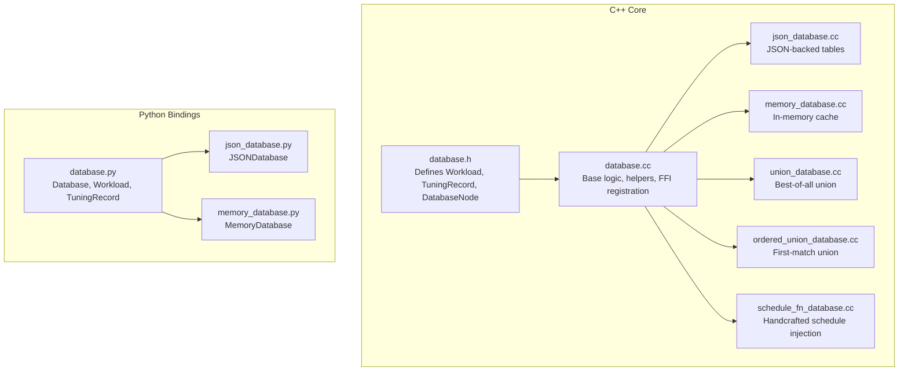
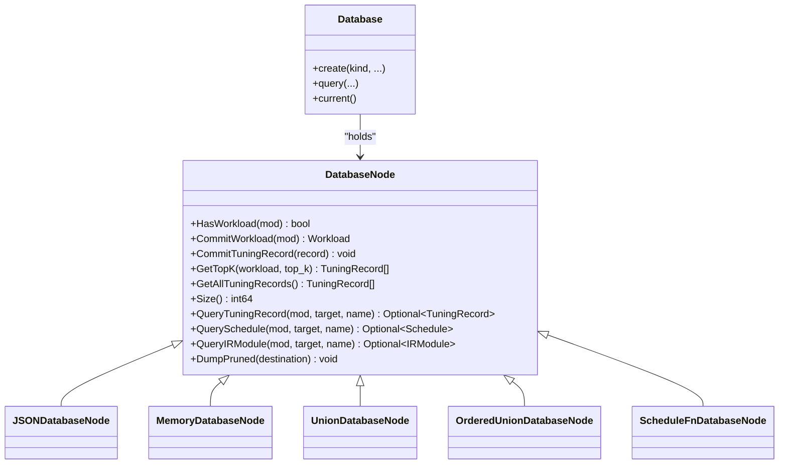
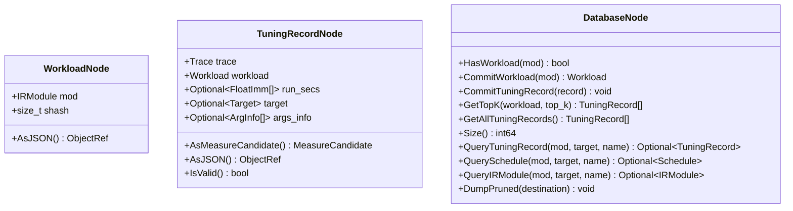
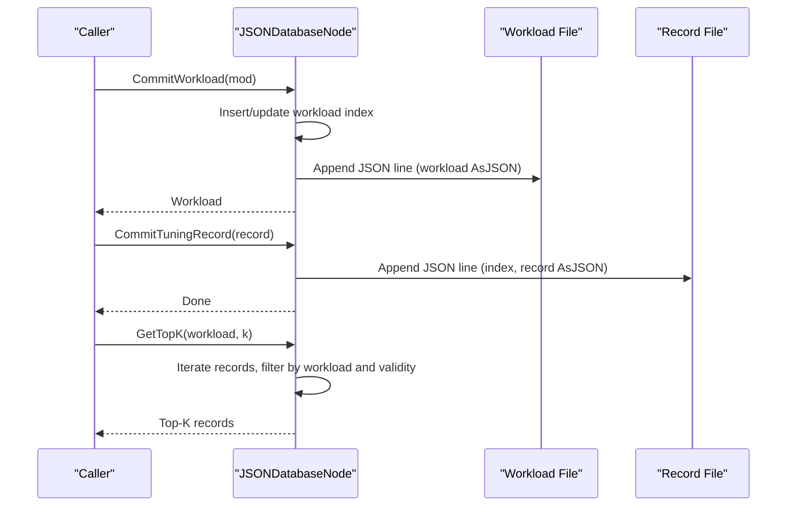
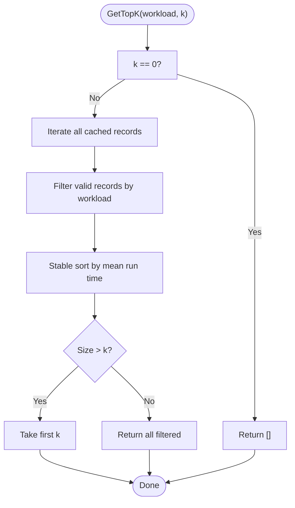
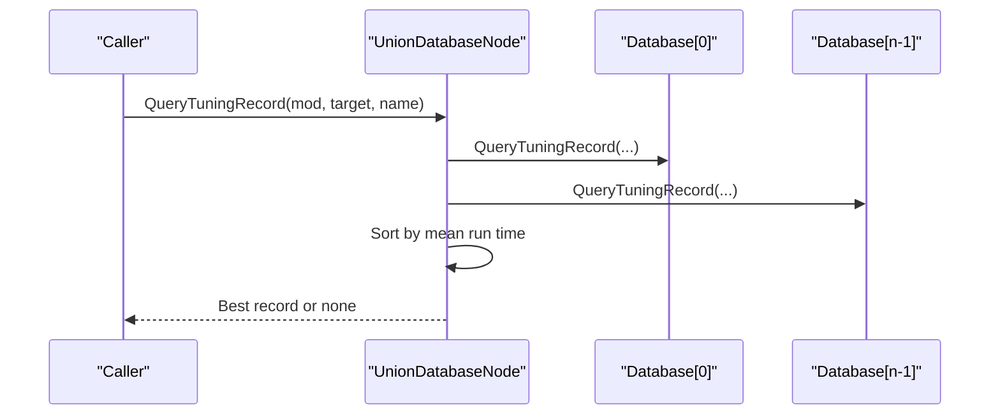
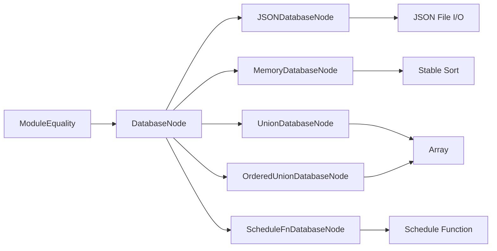

# Database System

<cite>
**Referenced Files in This Document**
- [database.h](file://include/tvm/s_tir/meta_schedule/database.h)
- [database.cc](file://src/s_tir/meta_schedule/database/database.cc)
- [json_database.cc](file://src/s_tir/meta_schedule/database/json_database.cc)
- [memory_database.cc](file://src/s_tir/meta_schedule/database/memory_database.cc)
- [union_database.cc](file://src/s_tir/meta_schedule/database/union_database.cc)
- [ordered_union_database.cc](file://src/s_tir/meta_schedule/database/ordered_union_database.cc)
- [schedule_fn_database.cc](file://src/s_tir/meta_schedule/database/schedule_fn_database.cc)
- [database.py](file://python/tvm/s_tir/meta_schedule/database/database.py)
- [json_database.py](file://python/tvm/s_tir/meta_schedule/database/json_database.py)
- [memory_database.py](file://python/tvm/s_tir/meta_schedule/database/memory_database.py)
</cite>

## Table of Contents
1. [Introduction](#introduction)
2. [Project Structure](#project-structure)
3. [Core Components](#core-components)
4. [Architecture Overview](#architecture-overview)
5. [Detailed Component Analysis](#detailed-component-analysis)
6. [Dependency Analysis](#dependency-analysis)
7. [Performance Considerations](#performance-considerations)
8. [Troubleshooting Guide](#troubleshooting-guide)
9. [Conclusion](#conclusion)
10. [Appendices](#appendices)

## Introduction
This document describes the meta-scheduling database system used by TVM’s S-TIR meta-scheduler. It covers the Database base class and its implementations for storing optimization outcomes and learned patterns. The system supports:
- Persistent storage via JSON files
- In-memory caching
- Composition of multiple backends via union databases
- Injection of handcrafted schedules via a schedule-function database
- Querying best schedules, tuning records, and transformed modules
- Pruning and dumping of validated results

It also documents data structures for schedules, performance measurements, and search traces, along with configuration, optimization, migration, performance, storage, backup, and integration guidance.

## Project Structure
The database system is implemented in C++ with Python bindings:
- C++ core: header defines data models and the abstract Database interface; implementations provide JSON, memory, union, ordered-union, and schedule-function backends.
- Python bindings: user-facing classes mirror the C++ objects and expose convenient constructors and APIs.

**Diagram sources**
- [database.h:186-554](file://include/tvm/s_tir/meta_schedule/database.h#L186-L554)
- [database.cc:179-334](file://src/s_tir/meta_schedule/database/database.cc#L179-L334)
- [json_database.cc:71-229](file://src/s_tir/meta_schedule/database/json_database.cc#L71-L229)
- [memory_database.cc:28-113](file://src/s_tir/meta_schedule/database/memory_database.cc#L28-L113)
- [union_database.cc:27-99](file://src/s_tir/meta_schedule/database/union_database.cc#L27-L99)
- [ordered_union_database.cc:27-98](file://src/s_tir/meta_schedule/database/ordered_union_database.cc#L27-L98)
- [schedule_fn_database.cc:27-117](file://src/s_tir/meta_schedule/database/schedule_fn_database.cc#L27-L117)
- [database.py:167-645](file://python/tvm/s_tir/meta_schedule/database/database.py#L167-L645)
- [json_database.py:27-93](file://python/tvm/s_tir/meta_schedule/database/json_database.py#L27-L93)
- [memory_database.py:25-51](file://python/tvm/s_tir/meta_schedule/database/memory_database.py#L25-L51)

**Section sources**
- [database.h:186-554](file://include/tvm/s_tir/meta_schedule/database.h#L186-L554)
- [database.cc:179-334](file://src/s_tir/meta_schedule/database/database.cc#L179-L334)
- [database.py:167-645](file://python/tvm/s_tir/meta_schedule/database/database.py#L167-L645)

## Core Components
- Workload: encapsulates an IRModule and its structural hash; supports JSON serialization/deserialization.
- TuningRecord: encapsulates a Trace, Workload, optional run times, Target, and ArgInfo; supports conversion to/from JSON and validity checks.
- DatabaseNode: abstract interface with methods for workload existence, committing workloads, committing tuning records, retrieving top-K records, enumerating all records, querying best record/schedule/module, pruning, and size.
- Python Database: user-facing wrapper around the C++ DatabaseNode with convenience constructors and query helpers.

Key responsibilities:
- Store and retrieve optimization outcomes (schedules/traces/modules) keyed by Workload.
- Persist validated results for reuse and transfer.
- Combine multiple databases to leverage diverse knowledge sources.

**Section sources**
- [database.h:43-182](file://include/tvm/s_tir/meta_schedule/database.h#L43-L182)
- [database.cc:28-178](file://src/s_tir/meta_schedule/database/database.cc#L28-L178)
- [database.py:40-165](file://python/tvm/s_tir/meta_schedule/database/database.py#L40-L165)

## Architecture Overview
The system centers on a polymorphic DatabaseNode hierarchy. Concrete implementations provide different persistence and composition strategies. Python wrappers delegate to FFI-bound C++ implementations.

**Diagram sources**
- [database.h:186-554](file://include/tvm/s_tir/meta_schedule/database.h#L186-L554)
- [json_database.cc:71-157](file://src/s_tir/meta_schedule/database/json_database.cc#L71-L157)
- [memory_database.cc:28-94](file://src/s_tir/meta_schedule/database/memory_database.cc#L28-L94)
- [union_database.cc:27-81](file://src/s_tir/meta_schedule/database/union_database.cc#L27-L81)
- [ordered_union_database.cc:27-79](file://src/s_tir/meta_schedule/database/ordered_union_database.cc#L27-L79)
- [schedule_fn_database.cc:27-97](file://src/s_tir/meta_schedule/database/schedule_fn_database.cc#L27-L97)
- [database.py:167-421](file://python/tvm/s_tir/meta_schedule/database/database.py#L167-L421)

## Detailed Component Analysis

### Database Base Class and Data Models
- Workload: holds IRModule and structural hash; supports JSON export/import.
- TuningRecord: holds Trace, Workload, optional run_secs, optional Target, optional ArgInfo; supports JSON export/import and validity checks based on trace instructions and measured run times.
- DatabaseNode: abstract interface with query, commit, and enumeration methods; includes default implementations for query-by-module using top-K retrieval and module equality integration.

**Diagram sources**
- [database.h:43-182](file://include/tvm/s_tir/meta_schedule/database.h#L43-L182)
- [database.cc:28-178](file://src/s_tir/meta_schedule/database/database.cc#L28-L178)

**Section sources**
- [database.h:43-182](file://include/tvm/s_tir/meta_schedule/database.h#L43-L182)
- [database.cc:28-178](file://src/s_tir/meta_schedule/database/database.cc#L28-L178)

### JSON Database
- Purpose: persistent storage using two JSON files:
  - Workload table: one JSON object per workload (structural hash + base64-encoded IRModule graph).
  - Tuning record table: one JSON object per record (workload index + serialized record).
- Behavior:
  - On construction, loads existing entries and rebuilds in-memory indices.
  - CommitWorkload writes new workloads to the workload file and updates an index mapping.
  - CommitTuningRecord appends a record line referencing the workload index.
  - GetTopK filters valid records by workload and returns top-K sorted by mean run time.
  - GetAllTuningRecords enumerates all records.
  - Size returns total number of records.
- Concurrency: uses dynamic parallel parsing for large files.

**Diagram sources**
- [json_database.cc:71-157](file://src/s_tir/meta_schedule/database/json_database.cc#L71-L157)

**Section sources**
- [json_database.cc:71-229](file://src/s_tir/meta_schedule/database/json_database.cc#L71-L229)
- [json_database.py:27-93](file://python/tvm/s_tir/meta_schedule/database/json_database.py#L27-L93)

### Memory Database
- Purpose: in-memory caching of workloads and tuning records.
- Behavior:
  - HasWorkload checks module equality against cached workloads.
  - CommitWorkload deduplicates by module equality and caches workload.
  - CommitTuningRecord appends to in-memory vector.
  - GetTopK filters valid records, sorts stably by mean run time, and returns top-K.
  - GetAllTuningRecords returns all records.
  - Size returns count.

**Diagram sources**
- [memory_database.cc:67-94](file://src/s_tir/meta_schedule/database/memory_database.cc#L67-L94)

**Section sources**
- [memory_database.cc:28-113](file://src/s_tir/meta_schedule/database/memory_database.cc#L28-L113)
- [memory_database.py:25-51](file://python/tvm/s_tir/meta_schedule/database/memory_database.py#L25-L51)

### Union Database
- Purpose: combine multiple databases to select the best record across all.
- Behavior:
  - QueryTuningRecord aggregates results from all constituent databases, sorts by mean run time, and returns the best.
  - Other mutation and enumeration methods are not supported (throw).

**Diagram sources**
- [union_database.cc:39-50](file://src/s_tir/meta_schedule/database/union_database.cc#L39-L50)

**Section sources**
- [union_database.cc:27-99](file://src/s_tir/meta_schedule/database/union_database.cc#L27-L99)

### Ordered Union Database
- Purpose: short-circuit queries to the first database that yields a result.
- Behavior:
  - QueryTuningRecord iterates databases in order and returns the first hit.
  - Mutation and enumeration methods are not supported (throw).

**Section sources**
- [ordered_union_database.cc:27-98](file://src/s_tir/meta_schedule/database/ordered_union_database.cc#L27-L98)

### Schedule Function Database
- Purpose: inject handcrafted schedules via a user-provided function that transforms a traced Schedule.
- Behavior:
  - QuerySchedule constructs a traced Schedule from the module (with task_name attribute), invokes the schedule function, and returns the schedule if successful.
  - QueryTuningRecord returns a synthetic record using the Trace from the schedule.
  - Mutation and enumeration methods are not supported (throw).

**Section sources**
- [schedule_fn_database.cc:27-117](file://src/s_tir/meta_schedule/database/schedule_fn_database.cc#L27-L117)

### Python Bindings and Usage
- Workload and TuningRecord: exposed as TVM objects with JSON serialization helpers.
- Database: exposes convenience constructors for JSON, memory, union, ordered union, and schedule-function databases; also supports a generic PyDatabase for Python-side overrides.
- Query helpers: query_schedule, query_tuning_record, query_ir_module, and a unified query(kind) method.

Examples of usage patterns (conceptual):
- Create a JSON-backed database with a work directory and allow missing files.
- Create an in-memory database for fast iteration.
- Compose multiple databases to leverage prior knowledge.
- Inject a custom schedule function for known kernels.

**Section sources**
- [database.py:40-165](file://python/tvm/s_tir/meta_schedule/database/database.py#L40-L165)
- [database.py:167-421](file://python/tvm/s_tir/meta_schedule/database/database.py#L167-L421)
- [json_database.py:27-93](file://python/tvm/s_tir/meta_schedule/database/json_database.py#L27-L93)
- [memory_database.py:25-51](file://python/tvm/s_tir/meta_schedule/database/memory_database.py#L25-L51)

## Dependency Analysis
- DatabaseNode depends on ModuleEquality for workload identity and hashing.
- JSONDatabaseNode depends on JSON file I/O and parallel parsing utilities.
- MemoryDatabaseNode depends on stable sorting for top-K selection.
- Union/OrderedUnionDatabaseNodes depend on the ordering of provided databases.
- ScheduleFnDatabaseNode depends on the provided schedule function to produce valid schedules.

**Diagram sources**
- [database.cc:180-183](file://src/s_tir/meta_schedule/database/database.cc#L180-L183)
- [json_database.cc:71-157](file://src/s_tir/meta_schedule/database/json_database.cc#L71-L157)
- [memory_database.cc:67-94](file://src/s_tir/meta_schedule/database/memory_database.cc#L67-L94)
- [union_database.cc:27-81](file://src/s_tir/meta_schedule/database/union_database.cc#L27-L81)
- [ordered_union_database.cc:27-79](file://src/s_tir/meta_schedule/database/ordered_union_database.cc#L27-L79)
- [schedule_fn_database.cc:27-97](file://src/s_tir/meta_schedule/database/schedule_fn_database.cc#L27-L97)

**Section sources**
- [database.cc:180-183](file://src/s_tir/meta_schedule/database/database.cc#L180-L183)
- [json_database.cc:71-157](file://src/s_tir/meta_schedule/database/json_database.cc#L71-L157)
- [memory_database.cc:67-94](file://src/s_tir/meta_schedule/database/memory_database.cc#L67-L94)
- [union_database.cc:27-81](file://src/s_tir/meta_schedule/database/union_database.cc#L27-L81)
- [ordered_union_database.cc:27-79](file://src/s_tir/meta_schedule/database/ordered_union_database.cc#L27-L79)
- [schedule_fn_database.cc:27-97](file://src/s_tir/meta_schedule/database/schedule_fn_database.cc#L27-L97)

## Performance Considerations
- JSONDatabase:
  - Parallel parsing of large record files improves startup time.
  - Workload lookup uses a hash map keyed by structural hash and module equality.
  - Appending lines is I/O bound; consider batching writes if needed.
- MemoryDatabase:
  - Stable sort for top-K ensures deterministic ordering; complexity proportional to number of valid records.
  - Equality checks rely on ModuleEquality; choose appropriate module equality mode for accuracy vs. speed trade-offs.
- Union/OrderedUnionDatabase:
  - Query cost scales with number of constituent databases; order databases by likely hit rate and latency.
- ScheduleFnDatabase:
  - Cost dominated by the schedule function; keep it efficient and avoid heavy computation per query.

[No sources needed since this section provides general guidance]

## Troubleshooting Guide
Common issues and resolutions:
- JSON parsing errors:
  - Symptoms: exceptions when loading workload or record files.
  - Causes: malformed JSON lines, mismatched workload index, or corrupted files.
  - Resolution: validate JSON structure, ensure workload index is within bounds, and recreate missing files if allowed.
- Empty or invalid records:
  - Symptoms: GetTopK returns fewer results than expected.
  - Causes: records marked invalid due to empty run times or invalid trace instructions.
  - Resolution: filter out invalid records or re-run measurements with valid configurations.
- Module equality mismatches:
  - Symptoms: repeated workloads or inability to match existing entries.
  - Causes: structural hash mismatch or differing module equality modes.
  - Resolution: align module equality mode across databases and ensure consistent hashing.
- Unsupported operations:
  - Symptoms: exceptions when calling mutation or enumeration methods on union databases.
  - Resolution: use union databases only for querying; persist results to a concrete backend if mutation is required.

**Section sources**
- [json_database.cc:184-213](file://src/s_tir/meta_schedule/database/json_database.cc#L184-L213)
- [memory_database.cc:67-94](file://src/s_tir/meta_schedule/database/memory_database.cc#L67-L94)
- [union_database.cc:52-81](file://src/s_tir/meta_schedule/database/union_database.cc#L52-L81)
- [ordered_union_database.cc:50-79](file://src/s_tir/meta_schedule/database/ordered_union_database.cc#L50-L79)

## Conclusion
The meta-scheduling database system provides a flexible, extensible foundation for storing and retrieving optimization outcomes. By combining persistent JSON storage, in-memory caching, and compositional database strategies, it enables robust tuning workflows. Proper configuration of module equality, careful handling of JSON files, and thoughtful composition of databases are key to achieving reliable and performant tuning.

[No sources needed since this section summarizes without analyzing specific files]

## Appendices

### Data Structures and Complexity
- Workload:
  - Hash map lookup: average O(1), equality check depends on ModuleEquality.
- TuningRecord:
  - Sorting for top-K: O(n log n) where n is number of valid records.
- JSONDatabase:
  - Loading records: O(m) parallel parsing plus insertion into multiset.
  - Querying top-K: O(n) scan plus O(k log n) sort for k results.
- MemoryDatabase:
  - Commit: amortized O(1) for vectors; deduplication O(n) per workload.
  - Query: O(n) scan plus O(k log n) sort.

**Section sources**
- [json_database.cc:184-213](file://src/s_tir/meta_schedule/database/json_database.cc#L184-L213)
- [memory_database.cc:67-94](file://src/s_tir/meta_schedule/database/memory_database.cc#L67-L94)

### Configuration Examples
- JSON database creation with work directory and allow-missing behavior.
- Memory database creation with module equality mode selection.
- Union/ordered-union database creation by passing arrays of databases.
- Schedule-function database creation by passing a callable that accepts a traced Schedule.

**Section sources**
- [json_database.py:52-93](file://python/tvm/s_tir/meta_schedule/database/json_database.py#L52-L93)
- [memory_database.py:43-51](file://python/tvm/s_tir/meta_schedule/database/memory_database.py#L43-L51)
- [database.py:380-421](file://python/tvm/s_tir/meta_schedule/database/database.py#L380-L421)

### Query Optimization Strategies
- Prefer MemoryDatabase for iterative tuning sessions to reduce I/O overhead.
- Use UnionDatabase to combine prior knowledge databases; place most reliable sources earlier for ordered union.
- Use ScheduleFnDatabase for known-good patterns to bootstrap search quickly.
- Regularly prune and dump validated records to JSON for long-term persistence.

[No sources needed since this section provides general guidance]

### Data Migration Strategies
- Use DumpPruned to export validated records to another database (commonly JSONDatabase).
- Validate workload and record JSON files before migration; ensure module equality modes match.
- Back up original files before migration; restore if validation fails.

**Section sources**
- [database.cc:224-245](file://src/s_tir/meta_schedule/database/database.cc#L224-L245)

### Storage Management and Backup
- JSONDatabase maintains separate workload and record files; monitor file sizes and rotate logs as needed.
- Use allow_missing to initialize new databases; ensure write permissions.
- Periodically back up JSON files; consider compressing or archiving old records.

[No sources needed since this section provides general guidance]

### Integration with Tuning Workflow
- Use Database.current() and context managers to set a thread-local database during tuning.
- Commit tuning records after each measurement; query best results before applying postprocessing or cost modeling.
- Combine multiple databases to leverage historical results, curated patterns, and custom heuristics.

**Section sources**
- [database.cc:247-263](file://src/s_tir/meta_schedule/database/database.cc#L247-L263)
- [database.py:375-379](file://python/tvm/s_tir/meta_schedule/database/database.py#L375-L379)