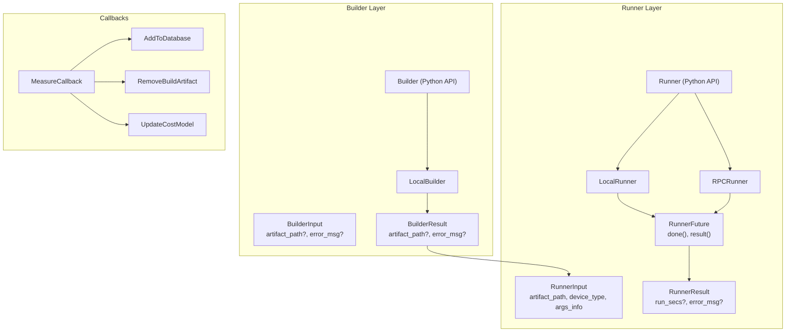
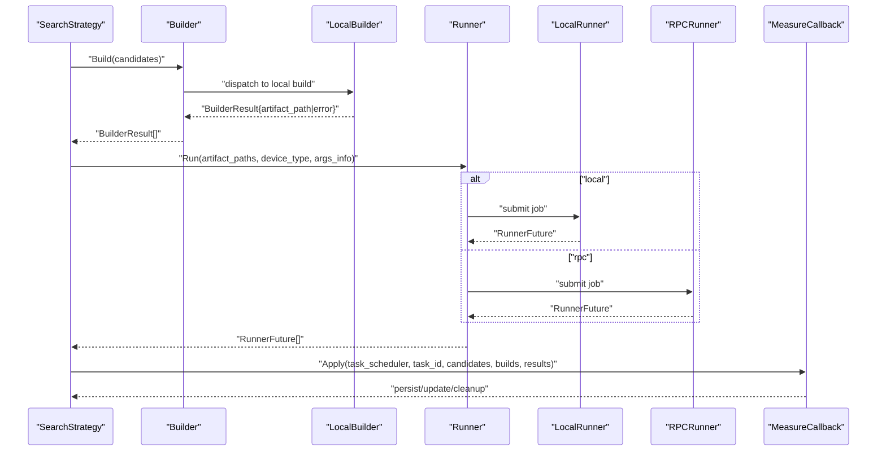
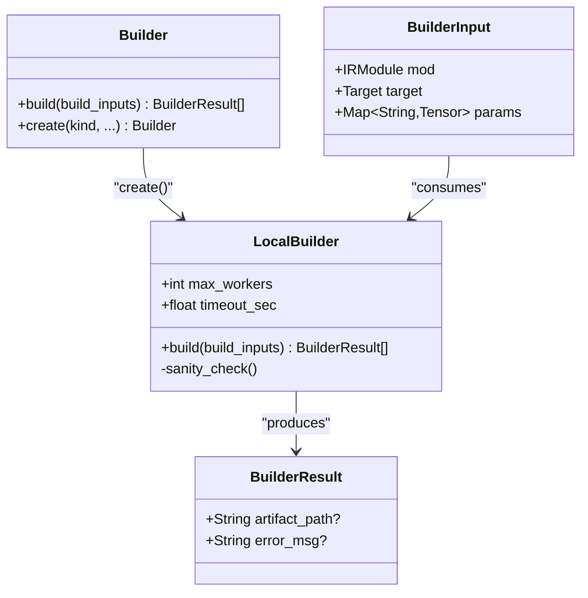
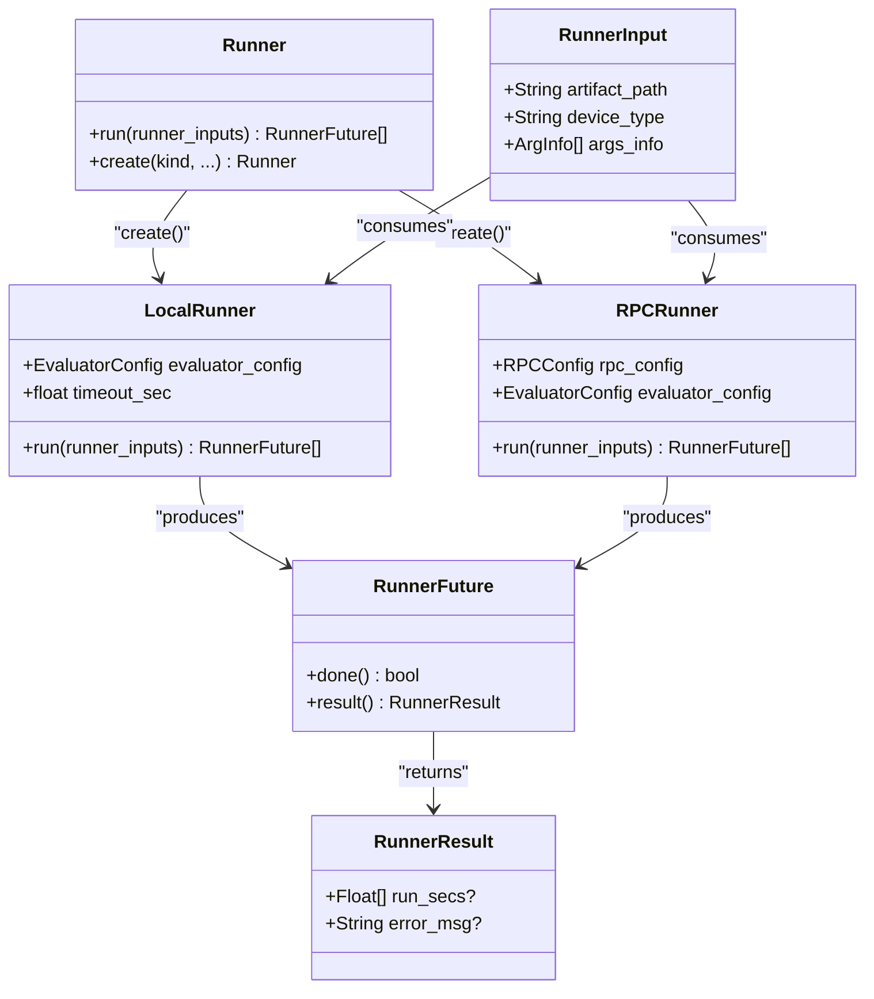
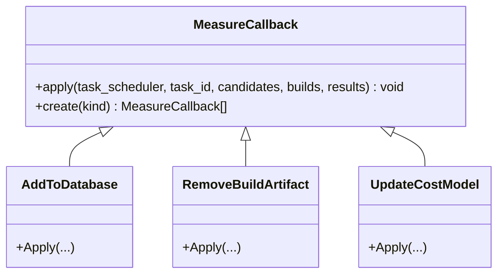
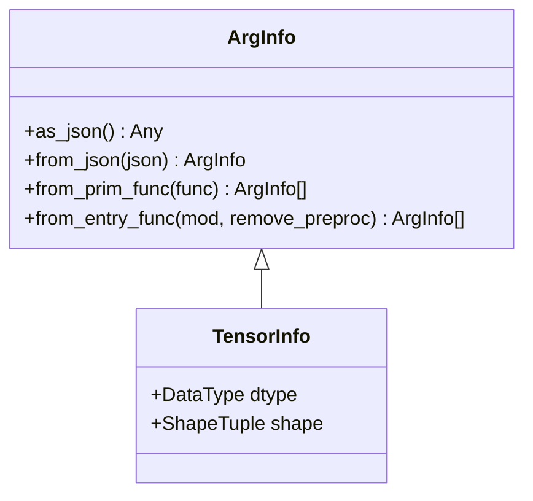
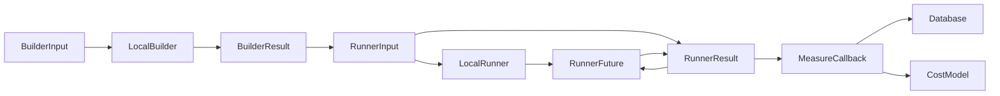

# Measurement Pipeline

<cite>
**Referenced Files in This Document**
- [builder.h](file://include/tvm/s_tir/meta_schedule/builder.h)
- [runner.h](file://include/tvm/s_tir/meta_schedule/runner.h)
- [measure_callback.h](file://include/tvm/s_tir/meta_schedule/measure_callback.h)
- [builder.py](file://python/tvm/s_tir/meta_schedule/builder/builder.py)
- [local_builder.py](file://python/tvm/s_tir/meta_schedule/builder/local_builder.py)
- [runner.py](file://python/tvm/s_tir/meta_schedule/runner/runner.py)
- [local_runner.py](file://python/tvm/s_tir/meta_schedule/runner/local_runner.py)
- [rpc_runner.py](file://python/tvm/s_tir/meta_schedule/runner/rpc_runner.py)
- [measure_callback.py](file://python/tvm/s_tir/meta_schedule/measure_callback/measure_callback.py)
- [add_to_database.cc](file://src/s_tir/meta_schedule/measure_callback/add_to_database.cc)
- [remove_build_artifact.cc](file://src/s_tir/meta_schedule/measure_callback/remove_build_artifact.cc)
- [update_cost_model.cc](file://src/s_tir/meta_schedule/measure_callback/update_cost_model.cc)
- [arg_info.py](file://python/tvm/s_tir/meta_schedule/arg_info.py)
</cite>

## Table of Contents
1. [Introduction](#introduction)
2. [Project Structure](#project-structure)
3. [Core Components](#core-components)
4. [Architecture Overview](#architecture-overview)
5. [Detailed Component Analysis](#detailed-component-analysis)
6. [Dependency Analysis](#dependency-analysis)
7. [Performance Considerations](#performance-considerations)
8. [Troubleshooting Guide](#troubleshooting-guide)
9. [Conclusion](#conclusion)
10. [Appendices](#appendices)

## Introduction
This document explains the measurement pipeline used in meta-scheduling. It covers the Builder system for compiling candidate schedules, the Runner system for executing and timing candidates, and MeasureCallback mechanisms for processing results. It also describes local and RPC-based execution modes, artifact management, performance measurement strategies, integration between compilation and execution phases, result validation, error handling, and practical guidance for configuring measurement environments, optimizing throughput, debugging failures, distributed measurement setups, resource management, and benchmarking workflows.

## Project Structure
The measurement pipeline is organized around three primary interfaces:
- Builder: transforms an IRModule into a runtime Module and exports an artifact.
- Runner: loads an artifact on a device and measures execution time using an evaluator.
- MeasureCallback: applies post-measurement rules such as persisting results, removing artifacts, and updating a cost model.

**Diagram sources**
- [builder.h:37-109](file://include/tvm/s_tir/meta_schedule/builder.h#L37-L109)
- [runner.h:35-105](file://include/tvm/s_tir/meta_schedule/runner.h#L35-L105)
- [runner.h:108-173](file://include/tvm/s_tir/meta_schedule/runner.h#L108-L173)
- [measure_callback.h:40-66](file://include/tvm/s_tir/meta_schedule/measure_callback.h#L40-L66)
- [builder.py:115-158](file://python/tvm/s_tir/meta_schedule/builder/builder.py#L115-L158)
- [local_builder.py:57-153](file://python/tvm/s_tir/meta_schedule/builder/local_builder.py#L57-L153)
- [runner.py:170-209](file://python/tvm/s_tir/meta_schedule/runner/runner.py#L170-L209)
- [local_runner.py:167-288](file://python/tvm/s_tir/meta_schedule/runner/local_runner.py#L167-L288)
- [rpc_runner.py:135-295](file://python/tvm/s_tir/meta_schedule/runner/rpc_runner.py#L135-L295)
- [measure_callback.py:42-86](file://python/tvm/s_tir/meta_schedule/measure_callback/measure_callback.py#L42-L86)
- [add_to_database.cc:27-73](file://src/s_tir/meta_schedule/measure_callback/add_to_database.cc#L27-L73)
- [remove_build_artifact.cc:27-55](file://src/s_tir/meta_schedule/measure_callback/remove_build_artifact.cc#L27-L55)
- [update_cost_model.cc:27-72](file://src/s_tir/meta_schedule/measure_callback/update_cost_model.cc#L27-L72)

**Section sources**
- [builder.h:37-109](file://include/tvm/s_tir/meta_schedule/builder.h#L37-L109)
- [runner.h:35-105](file://include/tvm/s_tir/meta_schedule/runner.h#L35-L105)
- [measure_callback.h:40-66](file://include/tvm/s_tir/meta_schedule/measure_callback.h#L40-L66)
- [builder.py:115-158](file://python/tvm/s_tir/meta_schedule/builder/builder.py#L115-L158)
- [runner.py:170-209](file://python/tvm/s_tir/meta_schedule/runner/runner.py#L170-L209)
- [measure_callback.py:42-86](file://python/tvm/s_tir/meta_schedule/measure_callback/measure_callback.py#L42-L86)

## Core Components
- BuilderInput and BuilderResult define the inputs and outputs for compilation. The Builder API exposes a Python-facing interface and a local implementation that compiles and exports artifacts.
- RunnerInput and RunnerResult define the inputs and outputs for execution. The Runner API supports local and RPC-based execution, returning RunnerFuture for asynchronous retrieval of results.
- MeasureCallback defines post-measurement hooks. Prebuilt implementations include adding results to a database, removing build artifacts, and updating a cost model.

Key responsibilities:
- Builder: compile IRModule to runtime.Module and export artifact.
- Runner: load artifact, allocate arguments, evaluate performance, and return timings or errors.
- MeasureCallback: integrate results into the tuning loop via persistence, cleanup, and model updates.

**Section sources**
- [builder.h:37-109](file://include/tvm/s_tir/meta_schedule/builder.h#L37-L109)
- [runner.h:35-105](file://include/tvm/s_tir/meta_schedule/runner.h#L35-L105)
- [runner.h:108-173](file://include/tvm/s_tir/meta_schedule/runner.h#L108-L173)
- [measure_callback.h:40-66](file://include/tvm/s_tir/meta_schedule/measure_callback.h#L40-L66)
- [builder.py:115-158](file://python/tvm/s_tir/meta_schedule/builder/builder.py#L115-L158)
- [runner.py:170-209](file://python/tvm/s_tir/meta_schedule/runner/runner.py#L170-L209)
- [measure_callback.py:42-86](file://python/tvm/s_tir/meta_schedule/measure_callback/measure_callback.py#L42-L86)

## Architecture Overview
The measurement pipeline orchestrates three stages:
1. Compilation: Builder compiles IRModules and exports artifacts.
2. Execution: Runner loads artifacts and runs evaluations to produce timings.
3. Post-processing: MeasureCallback applies rules to persist results, manage artifacts, and update models.

**Diagram sources**
- [builder.py:115-158](file://python/tvm/s_tir/meta_schedule/builder/builder.py#L115-L158)
- [local_builder.py:154-200](file://python/tvm/s_tir/meta_schedule/builder/local_builder.py#L154-L200)
- [runner.py:170-209](file://python/tvm/s_tir/meta_schedule/runner/runner.py#L170-L209)
- [local_runner.py:289-314](file://python/tvm/s_tir/meta_schedule/runner/local_runner.py#L289-L314)
- [rpc_runner.py:296-317](file://python/tvm/s_tir/meta_schedule/runner/rpc_runner.py#L296-L317)
- [measure_callback.py:42-86](file://python/tvm/s_tir/meta_schedule/measure_callback/measure_callback.py#L42-L86)

## Detailed Component Analysis

### Builder System
The Builder converts an IRModule into a runtime.Module and exports an artifact. The Python API exposes a Builder class with a factory method to create a LocalBuilder. Internally, LocalBuilder uses a process pool to compile and export artifacts, capturing timeouts and exceptions.

**Diagram sources**
- [builder.h:37-109](file://include/tvm/s_tir/meta_schedule/builder.h#L37-L109)
- [builder.py:115-158](file://python/tvm/s_tir/meta_schedule/builder/builder.py#L115-L158)
- [local_builder.py:57-153](file://python/tvm/s_tir/meta_schedule/builder/local_builder.py#L57-L153)

Key behaviors:
- Artifact export uses a default tar-based exporter.
- Timeout and exception handling are captured and reported via BuilderResult.error_msg.
- Sanity checks ensure required global functions are available in worker processes.

**Section sources**
- [local_builder.py:154-200](file://python/tvm/s_tir/meta_schedule/builder/local_builder.py#L154-L200)
- [local_builder.py:218-238](file://python/tvm/s_tir/meta_schedule/builder/local_builder.py#L218-L238)
- [local_builder.py:241-287](file://python/tvm/s_tir/meta_schedule/builder/local_builder.py#L241-L287)

### Runner System
The Runner loads artifacts and evaluates performance. It supports:
- LocalRunner: executes locally with a single worker process, allocating arguments and running a time evaluator.
- RPCRunner: connects to a remote RPC server, uploads the artifact, and performs evaluation remotely.

**Diagram sources**
- [runner.h:35-105](file://include/tvm/s_tir/meta_schedule/runner.h#L35-L105)
- [runner.h:108-173](file://include/tvm/s_tir/meta_schedule/runner.h#L108-L173)
- [runner.py:170-209](file://python/tvm/s_tir/meta_schedule/runner/runner.py#L170-L209)
- [local_runner.py:167-288](file://python/tvm/s_tir/meta_schedule/runner/local_runner.py#L167-L288)
- [rpc_runner.py:135-295](file://python/tvm/s_tir/meta_schedule/runner/rpc_runner.py#L135-L295)

Execution flow highlights:
- LocalRunner uses a single-worker pool and a default evaluator configuration.
- RPCRunner manages session creation, artifact upload, argument allocation, and evaluator execution.
- Both handle timeouts and exceptions, returning RunnerResult with error messages.

**Section sources**
- [local_runner.py:289-314](file://python/tvm/s_tir/meta_schedule/runner/local_runner.py#L289-L314)
- [rpc_runner.py:296-317](file://python/tvm/s_tir/meta_schedule/runner/rpc_runner.py#L296-L317)
- [local_runner.py:335-386](file://python/tvm/s_tir/meta_schedule/runner/local_runner.py#L335-L386)
- [rpc_runner.py:344-411](file://python/tvm/s_tir/meta_schedule/runner/rpc_runner.py#L344-L411)

### MeasureCallback Mechanisms
MeasureCallback applies rules after measurements are collected. Three built-in implementations:
- AddToDatabase: persists successful timings into a database with workload and target metadata.
- RemoveBuildArtifact: deletes temporary build artifacts.
- UpdateCostModel: updates a cost model using valid candidates and results.

**Diagram sources**
- [measure_callback.h:40-66](file://include/tvm/s_tir/meta_schedule/measure_callback.h#L40-L66)
- [measure_callback.py:42-86](file://python/tvm/s_tir/meta_schedule/measure_callback/measure_callback.py#L42-L86)
- [add_to_database.cc:27-73](file://src/s_tir/meta_schedule/measure_callback/add_to_database.cc#L27-L73)
- [remove_build_artifact.cc:27-55](file://src/s_tir/meta_schedule/measure_callback/remove_build_artifact.cc#L27-L55)
- [update_cost_model.cc:27-72](file://src/s_tir/meta_schedule/measure_callback/update_cost_model.cc#L27-L72)

Validation and error handling:
- AddToDatabase treats missing run times as very large penalties to prevent selection of invalid candidates.
- UpdateCostModel prunes invalid entries before updating the model.

**Section sources**
- [add_to_database.cc:27-73](file://src/s_tir/meta_schedule/measure_callback/add_to_database.cc#L27-L73)
- [remove_build_artifact.cc:27-55](file://src/s_tir/meta_schedule/measure_callback/remove_build_artifact.cc#L27-L55)
- [update_cost_model.cc:27-72](file://src/s_tir/meta_schedule/measure_callback/update_cost_model.cc#L27-L72)

### Argument Information Model
Runner inputs require argument metadata to allocate tensors consistently. ArgInfo provides conversion to/from JSON and extraction from PrimFunc or IRModule entry functions.

**Diagram sources**
- [arg_info.py:31-87](file://python/tvm/s_tir/meta_schedule/arg_info.py#L31-L87)
- [arg_info.py:90-128](file://python/tvm/s_tir/meta_schedule/arg_info.py#L90-L128)

**Section sources**
- [arg_info.py:31-87](file://python/tvm/s_tir/meta_schedule/arg_info.py#L31-L87)
- [arg_info.py:90-128](file://python/tvm/s_tir/meta_schedule/arg_info.py#L90-L128)

## Dependency Analysis
- Builder depends on TVM’s build and export infrastructure and uses a process pool for parallelism.
- Runner depends on runtime devices and evaluator configuration; LocalRunner uses a single worker while RPCRunner uses a connection pool.
- MeasureCallback integrates with the task scheduler, database, and cost model.

**Diagram sources**
- [builder.h:37-109](file://include/tvm/s_tir/meta_schedule/builder.h#L37-L109)
- [runner.h:35-105](file://include/tvm/s_tir/meta_schedule/runner.h#L35-L105)
- [measure_callback.h:40-66](file://include/tvm/s_tir/meta_schedule/measure_callback.h#L40-L66)
- [add_to_database.cc:27-73](file://src/s_tir/meta_schedule/measure_callback/add_to_database.cc#L27-L73)
- [update_cost_model.cc:27-72](file://src/s_tir/meta_schedule/measure_callback/update_cost_model.cc#L27-L72)

**Section sources**
- [local_builder.py:154-200](file://python/tvm/s_tir/meta_schedule/builder/local_builder.py#L154-L200)
- [local_runner.py:289-314](file://python/tvm/s_tir/meta_schedule/runner/local_runner.py#L289-L314)
- [rpc_runner.py:296-317](file://python/tvm/s_tir/meta_schedule/runner/rpc_runner.py#L296-L317)
- [add_to_database.cc:27-73](file://src/s_tir/meta_schedule/measure_callback/add_to_database.cc#L27-L73)
- [update_cost_model.cc:27-72](file://src/s_tir/meta_schedule/measure_callback/update_cost_model.cc#L27-L72)

## Performance Considerations
- Throughput optimization:
  - Builder: adjust max_workers to CPU count; reuse process pools carefully due to known memory leaks; set appropriate timeout_sec.
  - Runner: LocalRunner uses a single worker; RPCRunner allows configurable max_workers for connection concurrency.
- Evaluator configuration:
  - Tune EvaluatorConfig (number of repeats, number of trials) to balance accuracy and speed.
- Resource management:
  - LocalRunner and RPCRunner perform cleanup after execution; ensure cleanup functions are registered when using custom steps.
- Artifact lifecycle:
  - Use RemoveBuildArtifact to reclaim disk space after measurements.
  - Persist results via AddToDatabase for iterative tuning.

[No sources needed since this section provides general guidance]

## Troubleshooting Guide
Common issues and resolutions:
- Builder timeout or exception:
  - Inspect BuilderResult.error_msg for timeout or exception details; increase timeout_sec or fix build function registration.
- Runner timeout or exception:
  - Inspect RunnerResult.error_msg; verify device availability and evaluator configuration; confirm artifact path correctness.
- RPC connectivity:
  - Ensure RPC server is reachable and configured; verify upload and cleanup steps; check session timeout settings.
- Invalid results:
  - AddToDatabase treats missing run times as large penalties; UpdateCostModel prunes invalid entries; validate evaluator configuration.

**Section sources**
- [local_builder.py:182-198](file://python/tvm/s_tir/meta_schedule/builder/local_builder.py#L182-L198)
- [local_runner.py:304-313](file://python/tvm/s_tir/meta_schedule/runner/local_runner.py#L304-L313)
- [rpc_runner.py:119-132](file://python/tvm/s_tir/meta_schedule/runner/rpc_runner.py#L119-L132)

## Conclusion
The measurement pipeline in meta-scheduling cleanly separates compilation, execution, and post-processing. Builders compile and export artifacts; Runners execute and time them locally or remotely; MeasureCallbacks persist, prune, and update models. Proper configuration of workers, evaluator settings, and artifact lifecycle ensures robust and efficient tuning workflows.

[No sources needed since this section summarizes without analyzing specific files]

## Appendices

### Configuring Measurement Environments
- Local mode:
  - Use Builder.create("local") and Runner.create("local").
  - Adjust max_workers and timeout_sec according to machine capacity.
- RPC mode:
  - Use Runner.create("rpc") with RPCConfig specifying server address and credentials.
  - Ensure the RPC server has required functions registered and random fill enabled if needed.

**Section sources**
- [builder.py:135-157](file://python/tvm/s_tir/meta_schedule/builder/builder.py#L135-L157)
- [runner.py:191-206](file://python/tvm/s_tir/meta_schedule/runner/runner.py#L191-L206)
- [rpc_runner.py:414-427](file://python/tvm/s_tir/meta_schedule/runner/rpc_runner.py#L414-L427)

### Optimizing Measurement Throughput
- Parallelize builds and runs using process pools; monitor memory usage and restart pools periodically for stability.
- Reduce evaluator overhead by minimizing repeats and trials where acceptable.
- Clean up artifacts promptly to avoid disk pressure.

[No sources needed since this section provides general guidance]

### Debugging Compilation/Execution Failures
- Capture and inspect error messages from BuilderResult and RunnerResult.
- Verify that required global functions are registered in worker processes and RPC sessions.
- Validate ArgInfo generation from entry functions and PrimFunc signatures.

**Section sources**
- [local_builder.py:202-215](file://python/tvm/s_tir/meta_schedule/builder/local_builder.py#L202-L215)
- [rpc_runner.py:319-341](file://python/tvm/s_tir/meta_schedule/runner/rpc_runner.py#L319-L341)
- [arg_info.py:56-87](file://python/tvm/s_tir/meta_schedule/arg_info.py#L56-L87)

### Distributed Measurement Setups
- Use RPCRunner to distribute execution across heterogeneous devices.
- Manage multiple RPC connections with appropriate max_workers and session timeouts.
- Centralize artifact cleanup on the RPC server side.

**Section sources**
- [rpc_runner.py:135-295](file://python/tvm/s_tir/meta_schedule/runner/rpc_runner.py#L135-L295)
- [rpc_runner.py:414-453](file://python/tvm/s_tir/meta_schedule/runner/rpc_runner.py#L414-L453)

### Resource Management and Benchmarking Workflows
- Use RemoveBuildArtifact to keep storage usage low.
- Persist timings via AddToDatabase for historical analysis.
- Update cost models incrementally with UpdateCostModel to guide future search.

**Section sources**
- [remove_build_artifact.cc:27-55](file://src/s_tir/meta_schedule/measure_callback/remove_build_artifact.cc#L27-L55)
- [add_to_database.cc:27-73](file://src/s_tir/meta_schedule/measure_callback/add_to_database.cc#L27-L73)
- [update_cost_model.cc:27-72](file://src/s_tir/meta_schedule/measure_callback/update_cost_model.cc#L27-L72)