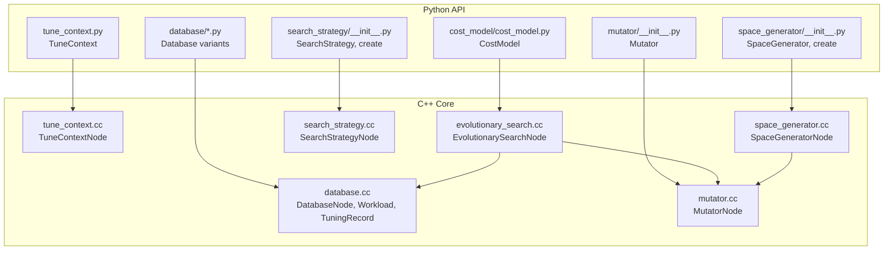
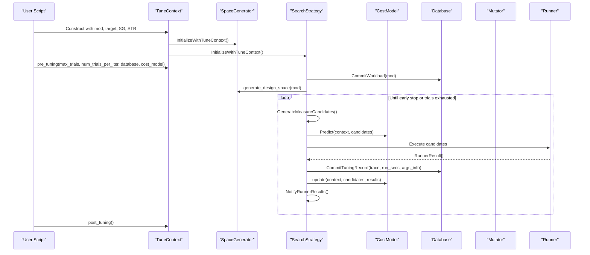
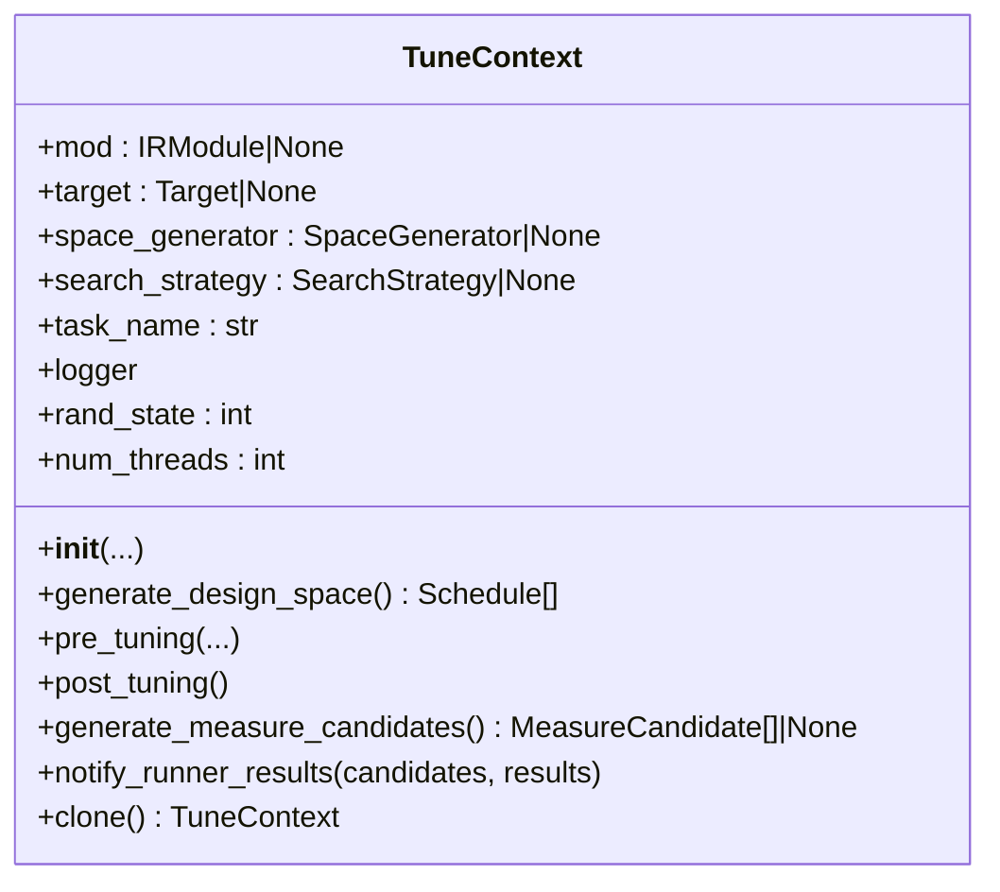
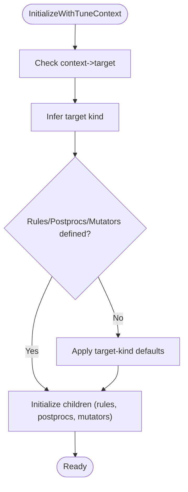
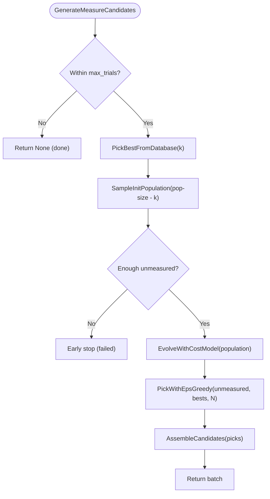
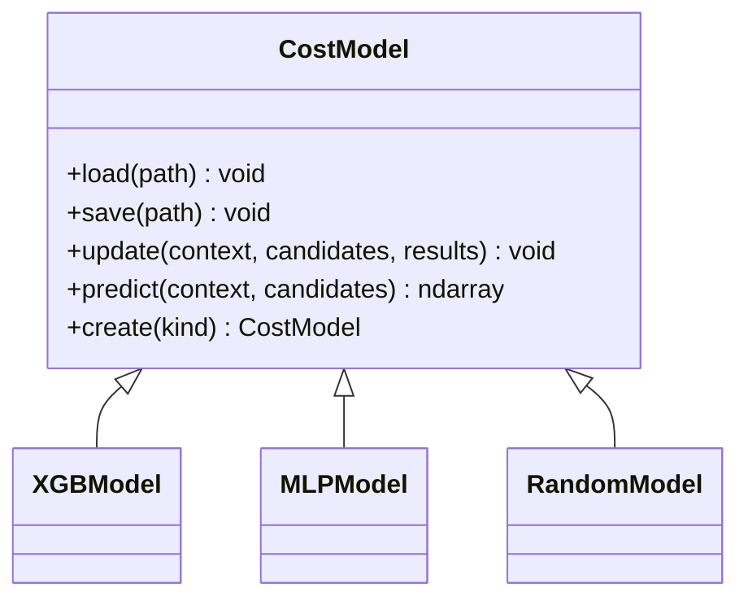
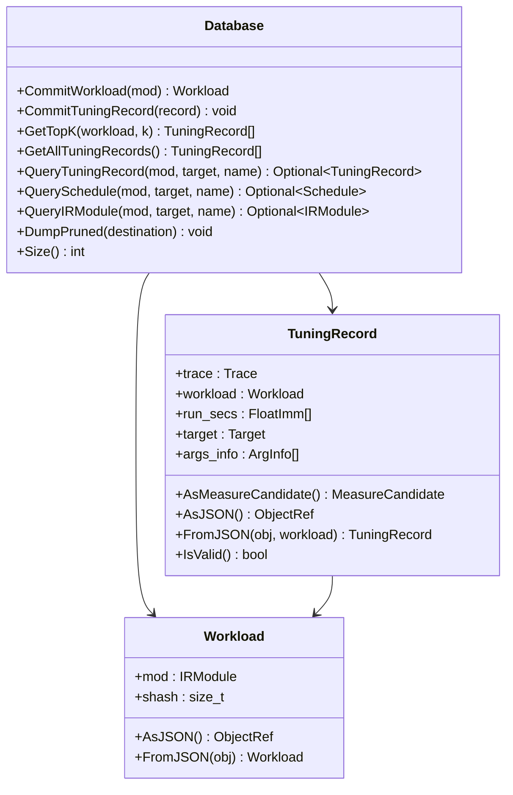
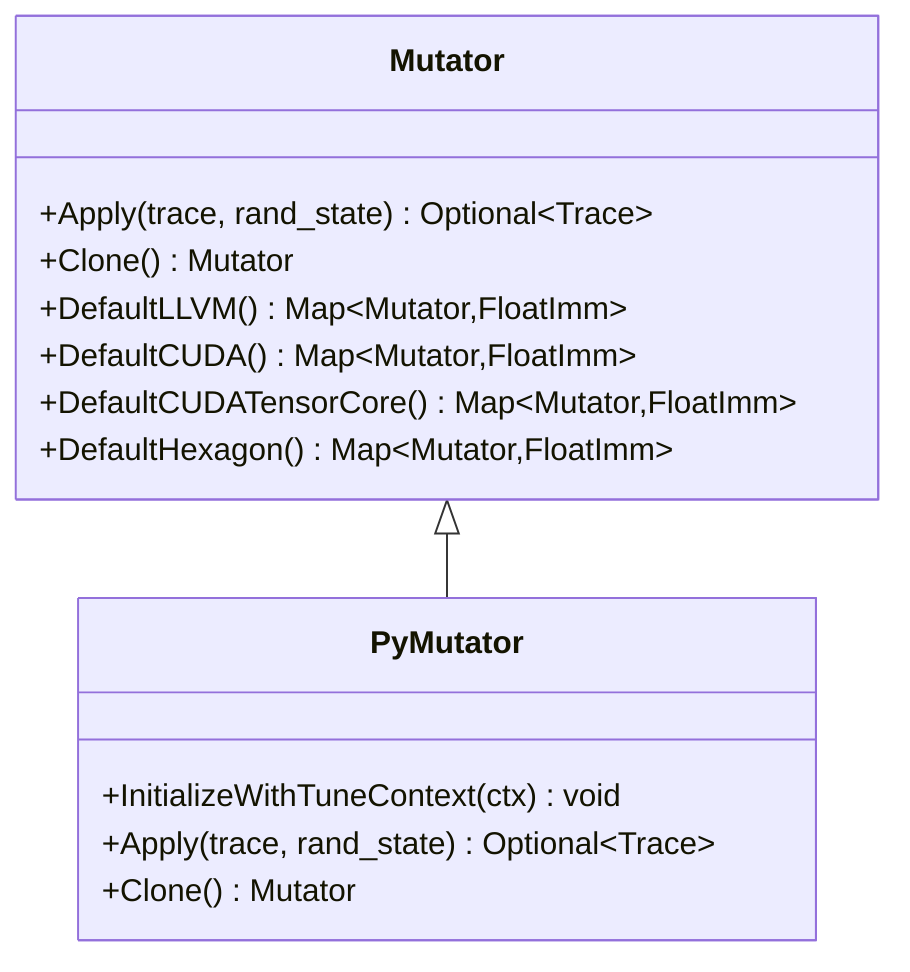
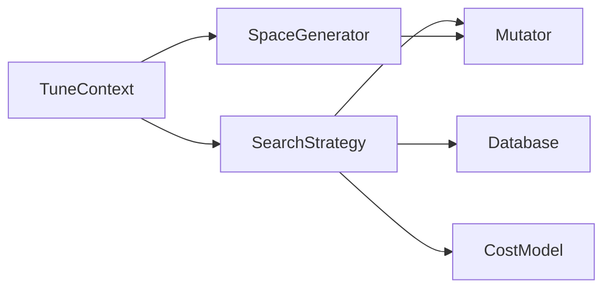

# Meta-Scheduling System

<cite>
**Referenced Files in This Document**
- [meta_schedule.py](file://docs/deep_dive/tensor_ir/tutorials/meta_schedule.py)
- [tune_context.cc](file://src/s_tir/meta_schedule/tune_context.cc)
- [tune_context.py](file://python/tvm/s_tir/meta_schedule/tune_context.py)
- [search_strategy.cc](file://src/s_tir/meta_schedule/search_strategy/search_strategy.cc)
- [evolutionary_search.cc](file://src/s_tir/meta_schedule/search_strategy/evolutionary_search.cc)
- [space_generator.cc](file://src/s_tir/meta_schedule/space_generator/space_generator.cc)
- [database.cc](file://src/s_tir/meta_schedule/database/database.cc)
- [cost_model.py](file://python/tvm/s_tir/meta_schedule/cost_model/cost_model.py)
- [mutator.cc](file://src/s_tir/meta_schedule/mutator/mutator.cc)
- [__init__.py (search_strategy)](file://python/tvm/s_tir/meta_schedule/search_strategy/__init__.py)
- [__init__.py (space_generator)](file://python/tvm/s_tir/meta_schedule/space_generator/__init__.py)
- [__init__.py (mutator)](file://python/tvm/s_tir/meta_schedule/mutator/__init__.py)
</cite>

## Table of Contents
1. [Introduction](#introduction)
2. [Project Structure](#project-structure)
3. [Core Components](#core-components)
4. [Architecture Overview](#architecture-overview)
5. [Detailed Component Analysis](#detailed-component-analysis)
6. [Dependency Analysis](#dependency-analysis)
7. [Performance Considerations](#performance-considerations)
8. [Troubleshooting Guide](#troubleshooting-guide)
9. [Conclusion](#conclusion)
10. [Appendices](#appendices)

## Introduction
This document explains TVM’s meta-scheduling system: an automated kernel optimization framework that explores the design space of TensorIR schedules, predicts performance via cost models, evaluates candidates on real hardware, and persists results for reuse. It covers the tuning loop, search strategies (evolutionary and replay-based), schedule rules, mutation operators, and the database for storing optimization outcomes. Practical guidance is included for configuring meta-schedulers across hardware targets, customizing search spaces, and extending the system with custom components.

## Project Structure
The meta-scheduling system spans C++ core implementations and Python APIs:
- C++ core: TuneContext, SpaceGenerator, SearchStrategy, EvolutionarySearch, Database, Mutator, and related utilities.
- Python bindings: High-level APIs for constructing TuneContext, selecting strategies, cost models, and databases; and convenience wrappers.

**Diagram sources**
- [tune_context.py](file://python/tvm/s_tir/meta_schedule/tune_context.py)
- [search_strategy.cc](file://src/s_tir/meta_schedule/search_strategy/search_strategy.cc)
- [evolutionary_search.cc](file://src/s_tir/meta_schedule/search_strategy/evolutionary_search.cc)
- [space_generator.cc](file://src/s_tir/meta_schedule/space_generator/space_generator.cc)
- [database.cc](file://src/s_tir/meta_schedule/database/database.cc)
- [mutator.cc](file://src/s_tir/meta_schedule/mutator/mutator.cc)

**Section sources**
- [meta_schedule.py](file://docs/deep_dive/tensor_ir/tutorials/meta_schedule.py)
- [tune_context.cc](file://src/s_tir/meta_schedule/tune_context.cc)
- [tune_context.py](file://python/tvm/s_tir/meta_schedule/tune_context.py)

## Core Components
- TuneContext: Central container for a tuning task, holding the module, target, design space generator, search strategy, and runtime configuration. It delegates lifecycle and orchestration to the strategy and generator.
- SpaceGenerator: Produces design spaces (sets of schedules) by applying schedule rules and mutations, and prepares postprocessing steps and mutation probabilities per target.
- SearchStrategy: Controls how candidates are selected for measurement. The default EvolutionarySearch uses a cost model to predict performance and evolves schedules via mutation.
- CostModel: Predicts normalized performance scores for candidates to guide exploration. Built-in models include XGBoost, MLP, and Random baselines.
- Database: Stores workloads and tuning records persistently, enabling replay-based strategies and pruning invalid entries.
- Mutator: Applies small, structured changes to traces to explore nearby designs; probabilities are target-aware.

**Section sources**
- [tune_context.py](file://python/tvm/s_tir/meta_schedule/tune_context.py)
- [space_generator.cc](file://src/s_tir/meta_schedule/space_generator/space_generator.cc)
- [search_strategy.cc](file://src/s_tir/meta_schedule/search_strategy/search_strategy.cc)
- [evolutionary_search.cc](file://src/s_tir/meta_schedule/search_strategy/evolutionary_search.cc)
- [cost_model.py](file://python/tvm/s_tir/meta_schedule/cost_model/cost_model.py)
- [database.cc](file://src/s_tir/meta_schedule/database/database.cc)
- [mutator.cc](file://src/s_tir/meta_schedule/mutator/mutator.cc)

## Architecture Overview
The meta-scheduling pipeline integrates TensorIR scheduling with machine-learned cost models and hardware measurement.

**Diagram sources**
- [tune_context.py](file://python/tvm/s_tir/meta_schedule/tune_context.py)
- [search_strategy.cc](file://src/s_tir/meta_schedule/search_strategy/search_strategy.cc)
- [evolutionary_search.cc](file://src/s_tir/meta_schedule/search_strategy/evolutionary_search.cc)
- [database.cc](file://src/s_tir/meta_schedule/database/database.cc)
- [cost_model.py](file://python/tvm/s_tir/meta_schedule/cost_model/cost_model.py)

## Detailed Component Analysis

### TuneContext
- Purpose: Encapsulates a tuning task, initializes dependent components, and exposes lifecycle hooks for pre/post tuning and candidate generation.
- Responsibilities:
  - Normalizes input module to IRModule.
  - Initializes SpaceGenerator and SearchStrategy.
  - Provides helpers to generate design spaces, run pre/post phases, and delegate candidate generation and feedback.
- Key behaviors:
  - Validates required components and arguments.
  - Clones itself with independent random state for parallel workers.

**Diagram sources**
- [tune_context.cc](file://src/s_tir/meta_schedule/tune_context.cc)
- [tune_context.py](file://python/tvm/s_tir/meta_schedule/tune_context.py)

**Section sources**
- [tune_context.cc](file://src/s_tir/meta_schedule/tune_context.cc)
- [tune_context.py](file://python/tvm/s_tir/meta_schedule/tune_context.py)

### SpaceGenerator
- Purpose: Builds the design space from a module by applying schedule rules, postprocessing, and mutation probabilities tailored to the target.
- Target-aware defaults:
  - CPU (LLVM) rules and mutators.
  - CUDA and CUDA-TensorCore rules and mutators.
  - Hexagon-specific rules.
  - CPU vector extensions (e.g., AVX512, VNNI, RVV, NEON, dotprod).
- Initialization:
  - Infers target kind and sets default schedule rules, postprocessors, and mutator probabilities if not provided.

**Diagram sources**
- [space_generator.cc](file://src/s_tir/meta_schedule/space_generator/space_generator.cc)

**Section sources**
- [space_generator.cc](file://src/s_tir/meta_schedule/space_generator/space_generator.cc)
- [__init__.py (space_generator)](file://python/tvm/s_tir/meta_schedule/space_generator/__init__.py)

### SearchStrategy and EvolutionarySearch
- Purpose: Selects candidates for measurement and updates internal state based on observed performance.
- EvolutionarySearch highlights:
  - Maintains a state with design spaces, database, cost model, and per-thread data.
  - Picks best candidates from database, samples an initial population, evolves via mutators weighted by predicted scores, and greedily selects candidates for measurement.
  - Uses a sized heap to keep top candidates and deduplicates by module equality.
  - Supports early stopping when no new candidates are produced for several iterations.
- Candidate assembly:
  - Converts selected schedules into MeasureCandidate objects with argument info derived from the entry function.

**Diagram sources**
- [evolutionary_search.cc](file://src/s_tir/meta_schedule/search_strategy/evolutionary_search.cc)
- [search_strategy.cc](file://src/s_tir/meta_schedule/search_strategy/search_strategy.cc)

**Section sources**
- [search_strategy.cc](file://src/s_tir/meta_schedule/search_strategy/search_strategy.cc)
- [evolutionary_search.cc](file://src/s_tir/meta_schedule/search_strategy/evolutionary_search.cc)
- [__init__.py (search_strategy)](file://python/tvm/s_tir/meta_schedule/search_strategy/__init__.py)

### Cost Model
- Purpose: Predicts normalized performance scores for candidates to guide selection.
- Provided models:
  - XGBModel (gradient boosting).
  - MLPModel (neural network).
  - RandomModel (baseline).
- API:
  - load(path), save(path), update(context, candidates, results), predict(context, candidates).
- Python-side factory:
  - CostModel.create(kind) returns the requested model type.

**Diagram sources**
- [cost_model.py](file://python/tvm/s_tir/meta_schedule/cost_model/cost_model.py)

**Section sources**
- [cost_model.py](file://python/tvm/s_tir/meta_schedule/cost_model/cost_model.py)

### Database
- Purpose: Persists workloads and tuning records, supports queries, and prunes invalid entries.
- Core types:
  - Workload: Holds IRModule and structural hash.
  - TuningRecord: Holds trace, workload, run times, optional target and argument info.
  - Database: CRUD for workloads and records, top-K retrieval, current thread-local scoping.
- Utilities:
  - DumpPruned: Keep only the best record per workload.
  - Query helpers: Retrieve schedule or IRModule by workload.

**Diagram sources**
- [database.cc](file://src/s_tir/meta_schedule/database/database.cc)

**Section sources**
- [database.cc](file://src/s_tir/meta_schedule/database/database.cc)

### Mutator
- Purpose: Applies small, structured transformations to traces to explore nearby designs.
- Default distributions:
  - LLVM: tile size, compute location, unroll, parallel.
  - CUDA: tile size, unroll, thread binding.
  - Hexagon: similar to LLVM with slight differences.
- Python extension:
  - Mutator.PyMutator enables custom mutation logic with initialization, apply, clone, and string representation.

**Diagram sources**
- [mutator.cc](file://src/s_tir/meta_schedule/mutator/mutator.cc)
- [__init__.py (mutator)](file://python/tvm/s_tir/meta_schedule/mutator/__init__.py)

**Section sources**
- [mutator.cc](file://src/s_tir/meta_schedule/mutator/mutator.cc)
- [__init__.py (mutator)](file://python/tvm/s_tir/meta_schedule/mutator/__init__.py)

## Dependency Analysis
- TuneContext depends on SpaceGenerator and SearchStrategy; it initializes and delegates lifecycle to them.
- EvolutionarySearch depends on Database and CostModel to select and evolve candidates.
- SpaceGenerator composes ScheduleRule, Postproc, and Mutator; it sets target-aware defaults.
- Mutator is used by EvolutionarySearch to evolve the population.
- Database is used by EvolutionarySearch to seed from prior results and by Replay-based strategies to retrieve prior schedules.

**Diagram sources**
- [tune_context.py](file://python/tvm/s_tir/meta_schedule/tune_context.py)
- [space_generator.cc](file://src/s_tir/meta_schedule/space_generator/space_generator.cc)
- [search_strategy.cc](file://src/s_tir/meta_schedule/search_strategy/search_strategy.cc)
- [evolutionary_search.cc](file://src/s_tir/meta_schedule/search_strategy/evolutionary_search.cc)
- [database.cc](file://src/s_tir/meta_schedule/database/database.cc)
- [mutator.cc](file://src/s_tir/meta_schedule/mutator/mutator.cc)

**Section sources**
- [tune_context.py](file://python/tvm/s_tir/meta_schedule/tune_context.py)
- [space_generator.cc](file://src/s_tir/meta_schedule/space_generator/space_generator.cc)
- [search_strategy.cc](file://src/s_tir/meta_schedule/search_strategy/search_strategy.cc)
- [evolutionary_search.cc](file://src/s_tir/meta_schedule/search_strategy/evolutionary_search.cc)
- [database.cc](file://src/s_tir/meta_schedule/database/database.cc)
- [mutator.cc](file://src/s_tir/meta_schedule/mutator/mutator.cc)

## Performance Considerations
- Use appropriate SearchStrategy for the workload:
  - EvolutionarySearch reduces measurement overhead via a cost model and replay from database.
  - Replay-based strategies can accelerate convergence by reusing prior results.
- Tune hyperparameters:
  - Population size, mutation probability, and epsilon-greedy balance exploration vs. exploitation.
  - num_trials_per_iter controls batching to balance throughput and responsiveness.
- Target-aware defaults:
  - Choose SpaceGenerator defaults aligned with the target to reduce invalid candidates.
- Database pruning:
  - Use DumpPruned to keep only the best-performing records per workload, reducing noise.

[No sources needed since this section provides general guidance]

## Troubleshooting Guide
Common issues and remedies:
- Missing components in TuneContext:
  - Ensure mod and target are provided; space_generator and search_strategy must be defined or created via factories.
- EvolutionarySearch fails to sample initial population:
  - Verify postprocessors and mutators are configured; EvolutionarySearch requires a database and cost model.
- Invalid or empty candidate batches:
  - Early stopping may occur if no new candidates are produced for several iterations; adjust parameters or inspect postprocessors.
- Measurement failures:
  - Validate RunnerResult correctness and ensure run_secs are populated; invalid entries are filtered by IsValid.
- Cost model not updating:
  - Confirm update() is called with the correct candidates/results and that the model supports incremental learning.

**Section sources**
- [tune_context.py](file://python/tvm/s_tir/meta_schedule/tune_context.py)
- [evolutionary_search.cc](file://src/s_tir/meta_schedule/search_strategy/evolutionary_search.cc)
- [database.cc](file://src/s_tir/meta_schedule/database/database.cc)

## Conclusion
TVM’s meta-scheduling system automates kernel optimization by combining TensorIR scheduling, target-aware design-space generation, evolutionary search guided by cost models, and persistent storage of tuning outcomes. By configuring TuneContext with appropriate SpaceGenerator defaults, SearchStrategy, CostModel, and Database, users can achieve portable, high-performance kernels across diverse hardware targets. Extensibility points allow adding custom mutators, cost models, and strategies to tailor the system to specialized workloads.

[No sources needed since this section summarizes without analyzing specific files]

## Appendices

### Practical Configuration Examples
- Configure TuneContext with a module and target:
  - Provide mod and target; optionally specify space_generator and search_strategy.
- Select a SearchStrategy:
  - Use SearchStrategy.create('evolutionary') for guided exploration; 'replay-trace' or 'replay-func' for replay-based tuning.
- Choose a CostModel:
  - CostModel.create('xgb'), 'mlp', or 'random' depending on desired speed/accuracy trade-offs.
- Select a Database:
  - MemoryDatabase for in-memory caching; JSONDatabase for persistence across sessions.

**Section sources**
- [tune_context.py](file://python/tvm/s_tir/meta_schedule/tune_context.py)
- [__init__.py (search_strategy)](file://python/tvm/s_tir/meta_schedule/search_strategy/__init__.py)
- [cost_model.py](file://python/tvm/s_tir/meta_schedule/cost_model/cost_model.py)
- [database.cc](file://src/s_tir/meta_schedule/database/database.cc)

### Extension Mechanisms
- Custom CostModel:
  - Implement PyCostModel with load/save/update/predict; register via CostModel.PyCostModel.
- Custom Mutator:
  - Implement PyMutator with InitializeWithTuneContext, Apply, Clone; register via Mutator.PyMutator.
- Custom SearchStrategy:
  - Implement PySearchStrategy with InitializeWithTuneContext, PreTuning, PostTuning, GenerateMeasureCandidates, NotifyRunnerResults; register via SearchStrategy.PySearchStrategy.

**Section sources**
- [cost_model.py](file://python/tvm/s_tir/meta_schedule/cost_model/cost_model.py)
- [mutator.cc](file://src/s_tir/meta_schedule/mutator/mutator.cc)
- [search_strategy.cc](file://src/s_tir/meta_schedule/search_strategy/search_strategy.cc)