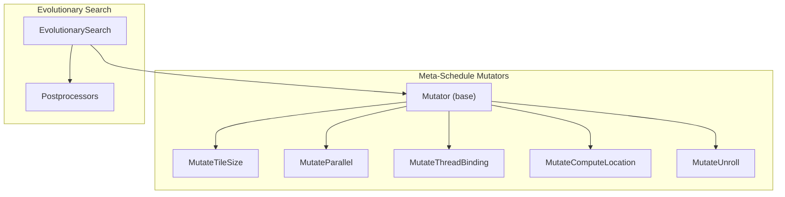
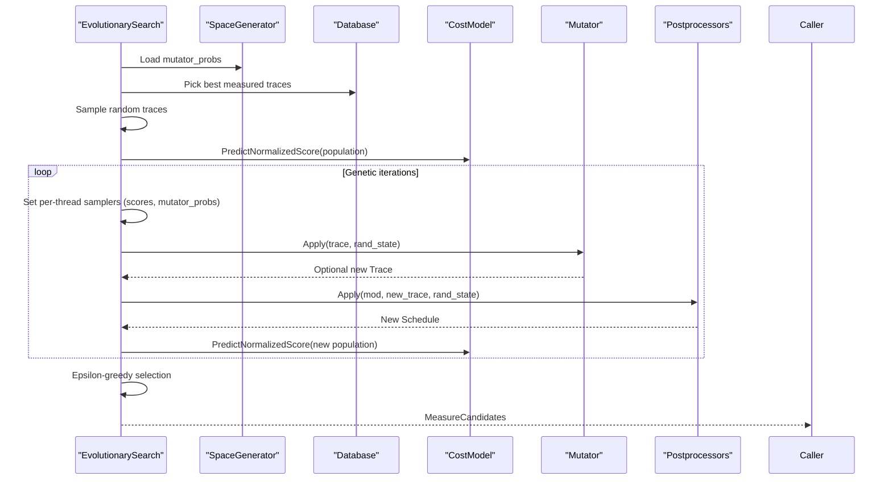
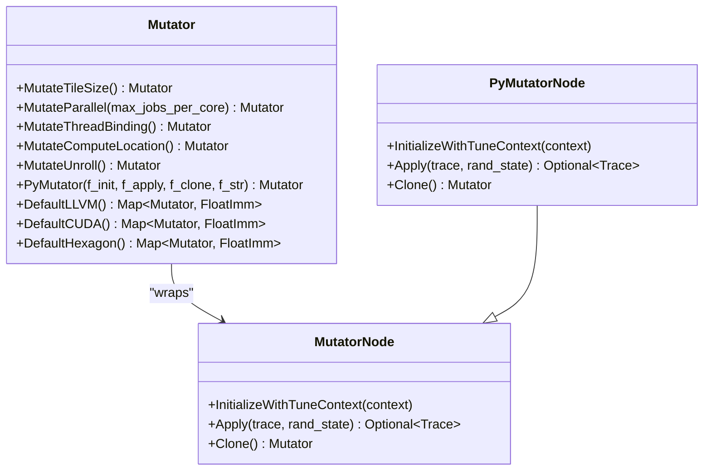
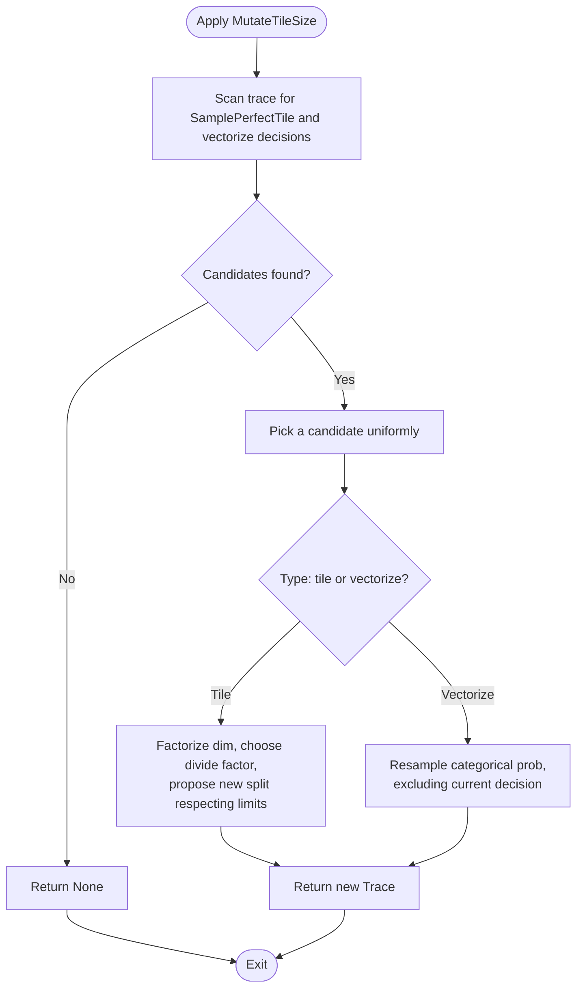
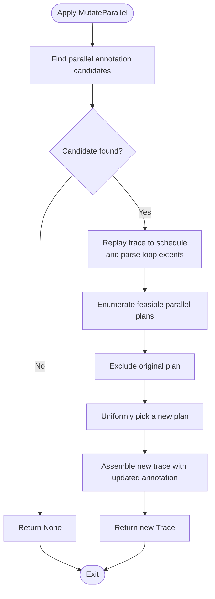
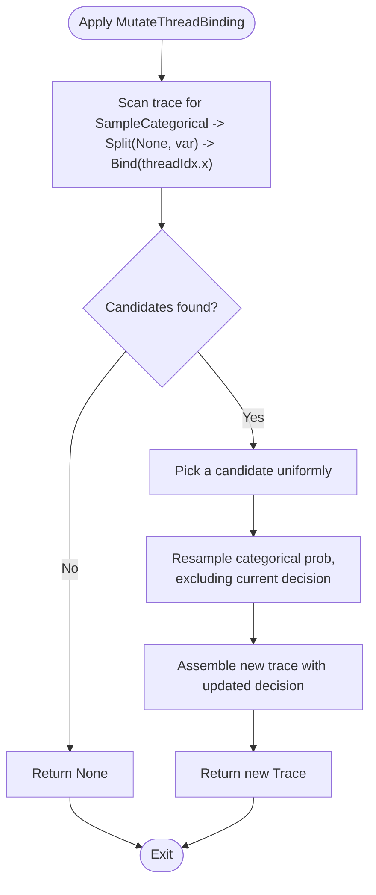
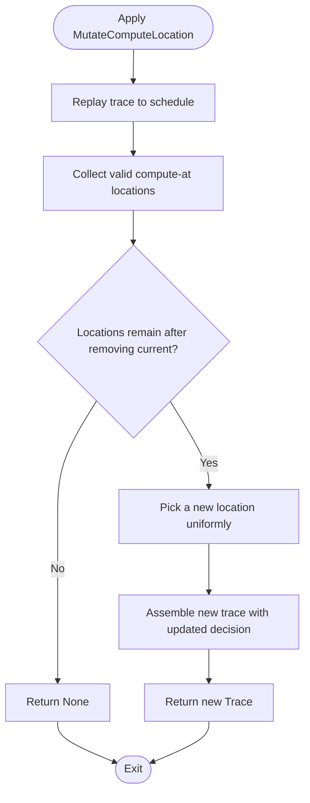
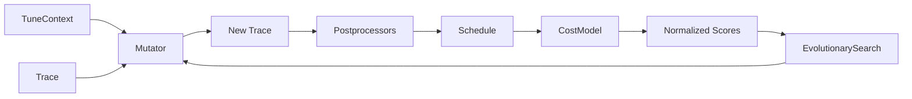

# Mutation Operators

<cite>
**Referenced Files in This Document**
- [mutator.h](file://include/tvm/s_tir/meta_schedule/mutator.h)
- [mutator.cc](file://src/s_tir/meta_schedule/mutator/mutator.cc)
- [mutate_tile_size.cc](file://src/s_tir/meta_schedule/mutator/mutate_tile_size.cc)
- [mutate_parallel.cc](file://src/s_tir/meta_schedule/mutator/mutate_parallel.cc)
- [mutate_thread_binding.cc](file://src/s_tir/meta_schedule/mutator/mutate_thread_binding.cc)
- [mutate_compute_location.cc](file://src/s_tir/meta_schedule/mutator/mutate_compute_location.cc)
- [mutate_unroll.cc](file://src/s_tir/meta_schedule/mutator/mutate_unroll.cc)
- [evolutionary_search.cc](file://src/s_tir/meta_schedule/search_strategy/evolutionary_search.cc)
- [utils.h](file://src/s_tir/meta_schedule/utils.h)
</cite>

## Table of Contents
1. [Introduction](#introduction)
2. [Project Structure](#project-structure)
3. [Core Components](#core-components)
4. [Architecture Overview](#architecture-overview)
5. [Detailed Component Analysis](#detailed-component-analysis)
6. [Dependency Analysis](#dependency-analysis)
7. [Performance Considerations](#performance-considerations)
8. [Troubleshooting Guide](#troubleshooting-guide)
9. [Conclusion](#conclusion)

## Introduction
This document explains the mutation operators used in meta-scheduling evolution for TIR-based scheduling. It covers the Mutator base class, the specific implementations for modifying schedule structures, and how these mutations integrate into evolutionary search. It also documents mutation application, validity checks, impact assessment, and practical guidance for custom mutator development, probability tuning, and convergence optimization.

## Project Structure
The mutation framework lives under the meta-scheduling subsystem and is composed of:
- A base Mutator interface and Python-side reflection helpers
- Concrete mutators for tile size, parallel extent, thread binding, compute location, and unroll
- An evolutionary search strategy that applies mutators to evolve candidate schedules

**Diagram sources**
- [mutator.h:39-73](file://include/tvm/s_tir/meta_schedule/mutator.h#L39-L73)
- [mutator.cc:57-80](file://src/s_tir/meta_schedule/mutator/mutator.cc#L57-L80)
- [mutate_tile_size.cc:58-78](file://src/s_tir/meta_schedule/mutator/mutate_tile_size.cc#L58-L78)
- [mutate_parallel.cc:164-203](file://src/s_tir/meta_schedule/mutator/mutate_parallel.cc#L164-L203)
- [mutate_thread_binding.cc:31-58](file://src/s_tir/meta_schedule/mutator/mutate_thread_binding.cc#L31-L58)
- [mutate_compute_location.cc:31-58](file://src/s_tir/meta_schedule/mutator/mutate_compute_location.cc#L31-L58)
- [mutate_unroll.cc:55-76](file://src/s_tir/meta_schedule/mutator/mutate_unroll.cc#L55-L76)
- [evolutionary_search.cc:406-478](file://src/s_tir/meta_schedule/search_strategy/evolutionary_search.cc#L406-L478)

**Section sources**
- [mutator.h:39-146](file://include/tvm/s_tir/meta_schedule/mutator.h#L39-L146)
- [mutator.cc:57-113](file://src/s_tir/meta_schedule/mutator/mutator.cc#L57-L113)

## Core Components
- Mutator base class defines the contract for mutation: initialization with TuneContext, applying mutations to a Trace, cloning, and optional Python-side wrapping.
- Default mutator sets for targets (LLVM, CUDA, Hexagon) define probabilities for each mutator type.
- Concrete mutators encapsulate specific mutation strategies:
  - Tile size mutations adjust tiling decisions and vectorization choices
  - Parallel extent mutations adjust the fused parallel loop limits
  - Thread binding mutations resample thread binding factors
  - Compute location mutations resample compute-at positions
  - Unroll mutations resample unrolling decisions

**Section sources**
- [mutator.h:39-146](file://include/tvm/s_tir/meta_schedule/mutator.h#L39-L146)
- [mutator.cc:57-80](file://src/s_tir/meta_schedule/mutator/mutator.cc#L57-L80)

## Architecture Overview
The evolutionary search integrates mutators as follows:
- Initializes with TuneContext and loads mutator probabilities from the space generator
- Samples an initial population from measured traces and random traces
- Iteratively evolves the population by sampling a parent, optionally mutating with a chosen mutator, postprocessing, and keeping the best candidates
- Uses a cost model to predict normalized scores and an epsilon-greedy policy to balance exploration and exploitation

**Diagram sources**
- [evolutionary_search.cc:451-460](file://src/s_tir/meta_schedule/search_strategy/evolutionary_search.cc#L451-L460)
- [evolutionary_search.cc:545-660](file://src/s_tir/meta_schedule/search_strategy/evolutionary_search.cc#L545-L660)
- [evolutionary_search.cc:706-747](file://src/s_tir/meta_schedule/search_strategy/evolutionary_search.cc#L706-L747)
- [mutator.cc:57-80](file://src/s_tir/meta_schedule/mutator/mutator.cc#L57-L80)

## Detailed Component Analysis

### Mutator Base Class and Python Integration
- The MutatorNode interface defines InitializeWithTuneContext, Apply, and Clone.
- Mutator provides factory methods for built-in mutators and default probability maps per target.
- PyMutatorNode enables Python-defined mutators by wrapping packed functions.

**Diagram sources**
- [mutator.h:39-146](file://include/tvm/s_tir/meta_schedule/mutator.h#L39-L146)
- [mutator.cc:27-55](file://src/s_tir/meta_schedule/mutator/mutator.cc#L27-L55)

**Section sources**
- [mutator.h:39-146](file://include/tvm/s_tir/meta_schedule/mutator.h#L39-L146)
- [mutator.cc:44-55](file://src/s_tir/meta_schedule/mutator/mutator.cc#L44-L55)

### Tile Size Mutations
Purpose: Resample tile sizes and vectorization decisions to explore different tiling shapes and vectorization factors.

Key behaviors:
- Scans the trace for SamplePerfectTile and SampleCategorical decisions related to cooperative fetch
- Filters valid decisions (product >= 2, single-prob categorical candidates)
- Performs factorization of selected dimension and proposes a new split respecting limits
- Optionally mutates vectorization choice by resampling categorical probabilities

**Diagram sources**
- [mutate_tile_size.cc:88-150](file://src/s_tir/meta_schedule/mutator/mutate_tile_size.cc#L88-L150)
- [mutate_tile_size.cc:195-250](file://src/s_tir/meta_schedule/mutator/mutate_tile_size.cc#L195-L250)
- [mutate_tile_size.cc:252-273](file://src/s_tir/meta_schedule/mutator/mutate_tile_size.cc#L252-L273)

**Section sources**
- [mutate_tile_size.cc:58-78](file://src/s_tir/meta_schedule/mutator/mutate_tile_size.cc#L58-L78)
- [mutate_tile_size.cc:88-150](file://src/s_tir/meta_schedule/mutator/mutate_tile_size.cc#L88-L150)
- [mutate_tile_size.cc:195-273](file://src/s_tir/meta_schedule/mutator/mutate_tile_size.cc#L195-L273)

### Parallel Extent Mutations
Purpose: Adjust the fused parallel loop extent to explore different degrees of parallelism.

Key behaviors:
- Finds annotations indicating parallel extents and associated blocks/functions
- Replays the trace to a traced schedule to analyze loop extents and compute feasible parallel plans
- Enumerates achievable parallel limits up to a core-limited bound
- Excludes the original plan and resamples a new plan uniformly

**Diagram sources**
- [mutate_parallel.cc:224-254](file://src/s_tir/meta_schedule/mutator/mutate_parallel.cc#L224-L254)
- [mutate_parallel.cc:256-313](file://src/s_tir/meta_schedule/mutator/mutate_parallel.cc#L256-L313)

**Section sources**
- [mutate_parallel.cc:164-203](file://src/s_tir/meta_schedule/mutator/mutate_parallel.cc#L164-L203)
- [mutate_parallel.cc:224-313](file://src/s_tir/meta_schedule/mutator/mutate_parallel.cc#L224-L313)

### Thread Binding Mutations
Purpose: Resample thread binding factors for loops bound to thread axes.

Key behaviors:
- Identifies patterns where a SampleCategorical feeds a Split with a None outer factor, which is then bound to a thread axis
- Collects candidates and resamples the categorical decision excluding the current one
- Returns a new trace with the updated decision

**Diagram sources**
- [mutate_thread_binding.cc:86-156](file://src/s_tir/meta_schedule/mutator/mutate_thread_binding.cc#L86-L156)
- [mutate_thread_binding.cc:158-171](file://src/s_tir/meta_schedule/mutator/mutate_thread_binding.cc#L158-L171)

**Section sources**
- [mutate_thread_binding.cc:31-73](file://src/s_tir/meta_schedule/mutator/mutate_thread_binding.cc#L31-L73)
- [mutate_thread_binding.cc:86-171](file://src/s_tir/meta_schedule/mutator/mutate_thread_binding.cc#L86-L171)

### Compute Location Mutations
Purpose: Resample compute-at locations for blocks to explore placement alternatives.

Key behaviors:
- Replays the trace to a schedule and enumerates valid compute-at locations for a block
- Removes the current location from the list and resamples uniformly among remaining locations
- Returns a new trace with the updated decision

**Diagram sources**
- [mutate_compute_location.cc:79-121](file://src/s_tir/meta_schedule/mutator/mutate_compute_location.cc#L79-L121)
- [mutate_compute_location.cc:123-131](file://src/s_tir/meta_schedule/mutator/mutate_compute_location.cc#L123-L131)

**Section sources**
- [mutate_compute_location.cc:31-71](file://src/s_tir/meta_schedule/mutator/mutate_compute_location.cc#L31-L71)
- [mutate_compute_location.cc:123-131](file://src/s_tir/meta_schedule/mutator/mutate_compute_location.cc#L123-L131)

### Unroll Mutations
Purpose: Resample unroll decisions to explore different unrolling strategies.

Key behaviors:
- Identifies annotations for explicit/implicit unroll and the associated SampleCategorical decision
- Resamples the categorical decision excluding the current one
- Returns a new trace with the updated decision

**Section sources**
- [mutate_unroll.cc:55-76](file://src/s_tir/meta_schedule/mutator/mutate_unroll.cc#L55-L76)
- [mutate_unroll.cc:95-145](file://src/s_tir/meta_schedule/mutator/mutate_unroll.cc#L95-L145)

## Dependency Analysis
- Mutators depend on:
  - TuneContext for target and workload metadata
  - Trace replay to reconstruct schedule state for analysis
  - Postprocessors to validate and finalize mutated traces
- Evolutionary search composes:
  - Population initialization from measured and random traces
  - Score prediction via cost model
  - Mutator sampling weighted by configured probabilities
  - Epsilon-greedy selection of final candidates

**Diagram sources**
- [evolutionary_search.cc:545-660](file://src/s_tir/meta_schedule/search_strategy/evolutionary_search.cc#L545-L660)
- [mutator.cc:57-80](file://src/s_tir/meta_schedule/mutator/mutator.cc#L57-L80)

**Section sources**
- [evolutionary_search.cc:406-478](file://src/s_tir/meta_schedule/search_strategy/evolutionary_search.cc#L406-L478)
- [evolutionary_search.cc:545-660](file://src/s_tir/meta_schedule/search_strategy/evolutionary_search.cc#L545-L660)
- [utils.h:508-540](file://src/s_tir/meta_schedule/utils.h#L508-L540)

## Performance Considerations
- Factorization caching: Tile-size mutator caches factor lists to reduce repeated computation.
- Replay overhead: Some mutators rebuild a traced schedule to analyze feasibility; this is amortized by shared replay logic and targeted analysis.
- Probability normalization: Mutator sampler normalizes weights to ensure valid distributions.
- Early stopping: Evolutionary search stops when no candidates are produced for several iterations.

[No sources needed since this section provides general guidance]

## Troubleshooting Guide
Common issues and remedies:
- No candidates found: Mutators return None when no applicable decisions are present. Verify that the trace contains the expected sampling or annotation instructions.
- Postprocessor failures: If postprocessing fails, the search logs summarization and may abort initialization. Ensure postprocessors are compatible with mutated traces.
- Imbalanced probabilities: If mutation probability is zero for a mutator, it will never be selected. Confirm mutator_probs configuration.
- Convergence stagnation: Increase mutation probability or diversify mutators; consider adjusting population size and genetic iterations.

**Section sources**
- [mutate_tile_size.cc:261-263](file://src/s_tir/meta_schedule/mutator/mutate_tile_size.cc#L261-L263)
- [mutate_parallel.cc:259-261](file://src/s_tir/meta_schedule/mutator/mutate_parallel.cc#L259-L261)
- [mutate_thread_binding.cc:160-162](file://src/s_tir/meta_schedule/mutator/mutate_thread_binding.cc#L160-L162)
- [mutate_compute_location.cc:125-127](file://src/s_tir/meta_schedule/mutator/mutate_compute_location.cc#L125-L127)
- [mutate_unroll.cc:134-135](file://src/s_tir/meta_schedule/mutator/mutate_unroll.cc#L134-L135)
- [evolutionary_search.cc:509-543](file://src/s_tir/meta_schedule/search_strategy/evolutionary_search.cc#L509-L543)
- [evolutionary_search.cc:706-747](file://src/s_tir/meta_schedule/search_strategy/evolutionary_search.cc#L706-L747)

## Conclusion
Mutation operators are central to exploring the design space in meta-scheduling. They enable targeted perturbations to tiling, parallelism, thread binding, compute location, and unrolling. Their integration with evolutionary search leverages score predictions and probabilistic selection to drive convergence toward high-performance schedules while maintaining diversity. Proper configuration of mutator probabilities and search parameters is essential for effective exploration and robust convergence.