# Post-Processing and Verification

<cite>
**Referenced Files in This Document**
- [postproc.h](file://include/tvm/s_tir/meta_schedule/postproc.h)
- [postproc.cc](file://src/s_tir/meta_schedule/postproc/postproc.cc)
- [postproc.py](file://python/tvm/s_tir/meta_schedule/postproc/postproc.py)
- [rewrite_cooperative_fetch.cc](file://src/s_tir/meta_schedule/postproc/rewrite_cooperative_fetch.cc)
- [rewrite_layout.cc](file://src/s_tir/meta_schedule/postproc/rewrite_layout.cc)
- [rewrite_parallel_vectorize_unroll.cc](file://src/s_tir/meta_schedule/postproc/rewrite_parallel_vectorize_unroll.cc)
- [rewrite_reduction_block.cc](file://src/s_tir/meta_schedule/postproc/rewrite_reduction_block.cc)
- [rewrite_tensorize.cc](file://src/s_tir/meta_schedule/postproc/rewrite_tensorize.cc)
- [rewrite_unbound_block.cc](file://src/s_tir/meta_schedule/postproc/rewrite_unbound_block.cc)
- [verify_gpu_code.cc](file://src/s_tir/meta_schedule/postproc/verify_gpu_code.cc)
- [verify_vtcm_limit.cc](file://src/s_tir/meta_schedule/postproc/verify_vtcm_limit.cc)
- [disallow_async_strided_mem_copy.cc](file://src/s_tir/meta_schedule/postproc/disallow_async_strided_mem_copy.cc)
- [disallow_dynamic_loop.cc](file://src/s_tir/meta_schedule/postproc/disallow_dynamic_loop.cc)
- [utils.h](file://src/s_tir/meta_schedule/utils.h)
</cite>

## Table of Contents
1. [Introduction](#introduction)
2. [Project Structure](#project-structure)
3. [Core Components](#core-components)
4. [Architecture Overview](#architecture-overview)
5. [Detailed Component Analysis](#detailed-component-analysis)
6. [Dependency Analysis](#dependency-analysis)
7. [Performance Considerations](#performance-considerations)
8. [Troubleshooting Guide](#troubleshooting-guide)
9. [Conclusion](#conclusion)
10. [Appendices](#appendices)

## Introduction
This document explains the post-processing and verification systems in meta-scheduling. It covers how final optimizations and validations are applied to generated schedules, including layout rewrites, cooperative fetch optimizations, tensorization transformations, and GPU code verification. It also documents the Droplet-style post-processing framework, space optimization techniques, correctness verification mechanisms, and practical guidance on integrating custom post-processing rules into the optimization pipeline. Finally, it addresses performance impact, validation overhead, and debugging transformed schedules.

## Project Structure
The post-processing subsystem is organized around a unified Postproc interface and a set of built-in postprocessors. Each postprocessor encapsulates a specific rewrite or verification pass and can be composed into default pipelines per target.

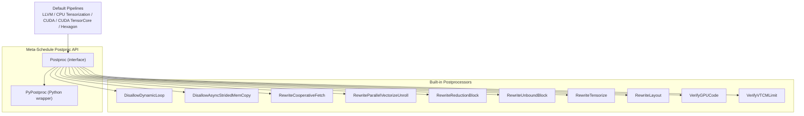

**Diagram sources**
- [postproc.h:38-181](file://include/tvm/s_tir/meta_schedule/postproc.h#L38-L181)
- [postproc.cc:56-112](file://src/s_tir/meta_schedule/postproc/postproc.cc#L56-L112)
- [postproc.py:40-109](file://python/tvm/s_tir/meta_schedule/postproc/postproc.py#L40-L109)

**Section sources**
- [postproc.h:38-181](file://include/tvm/s_tir/meta_schedule/postproc.h#L38-L181)
- [postproc.cc:56-112](file://src/s_tir/meta_schedule/postproc/postproc.cc#L56-L112)
- [postproc.py:40-109](file://python/tvm/s_tir/meta_schedule/postproc/postproc.py#L40-L109)

## Core Components
- Postproc interface: Defines the contract for postprocessors, including initialization with a tuning context, application to a schedule, cloning, and reflection registration.
- Built-in postprocessors: Implementations for dynamic loop enforcement, async strided memory copy prohibition, cooperative fetch rewriting, parallel/vectorize/unroll rewriting, reduction block decomposition, unbound block thread binding, tensorization, layout rewriting, GPU correctness verification, VTCM verification, and default pipeline composition.
- Python wrapper: Exposes Postproc and default pipelines to Python and supports custom postprocessors via a Python subclass.

Key responsibilities:
- Enforce correctness and platform constraints.
- Optimize locality, parallelism, and vectorization.
- Prepare schedules for lowering and runtime execution.

**Section sources**
- [postproc.h:38-181](file://include/tvm/s_tir/meta_schedule/postproc.h#L38-L181)
- [postproc.cc:43-140](file://src/s_tir/meta_schedule/postproc/postproc.cc#L43-L140)
- [postproc.py:40-196](file://python/tvm/s_tir/meta_schedule/postproc/postproc.py#L40-L196)

## Architecture Overview
The post-processing pipeline runs after trace application and before lowering. Each postprocessor receives the schedule, inspects or transforms it, and returns a boolean success indicator. Failures short-circuit further application and can be tracked centrally.

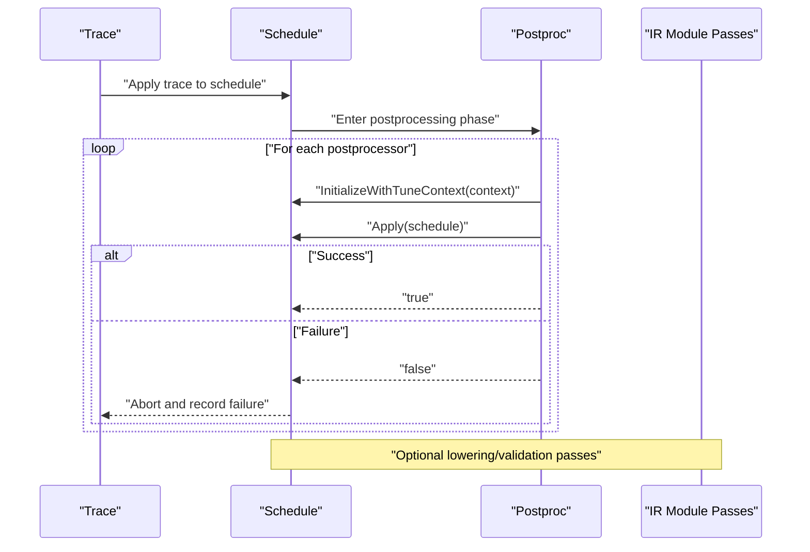

**Diagram sources**
- [utils.h:311-391](file://src/s_tir/meta_schedule/utils.h#L311-L391)
- [postproc.cc:123-140](file://src/s_tir/meta_schedule/postproc/postproc.cc#L123-L140)

**Section sources**
- [utils.h:311-391](file://src/s_tir/meta_schedule/utils.h#L311-L391)
- [postproc.cc:123-140](file://src/s_tir/meta_schedule/postproc/postproc.cc#L123-L140)

## Detailed Component Analysis

### Postproc Interface and Default Pipelines
- Interface: Provides InitializeWithTuneContext, Apply, Clone, and reflection hooks. Includes Python-side managed reference and a Python subclass for custom implementations.
- Default pipelines: Predefined arrays of postprocessors tailored to LLVM, CPU tensorization, RISC-V, CUDA, CUDA TensorCore, and Hexagon targets.

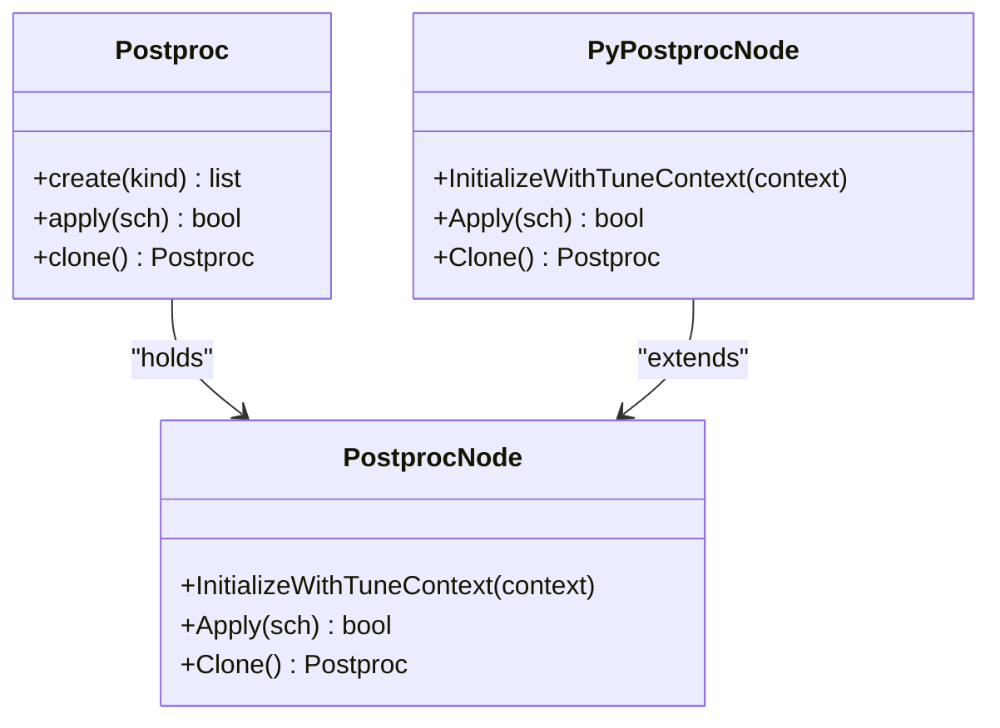

**Diagram sources**
- [postproc.h:38-181](file://include/tvm/s_tir/meta_schedule/postproc.h#L38-L181)
- [postproc.cc:27-54](file://src/s_tir/meta_schedule/postproc/postproc.cc#L27-L54)
- [postproc.py:40-196](file://python/tvm/s_tir/meta_schedule/postproc/postproc.py#L40-L196)

**Section sources**
- [postproc.h:38-181](file://include/tvm/s_tir/meta_schedule/postproc.h#L38-L181)
- [postproc.cc:56-112](file://src/s_tir/meta_schedule/postproc/postproc.cc#L56-L112)
- [postproc.py:40-109](file://python/tvm/s_tir/meta_schedule/postproc/postproc.py#L40-L109)

### Disallow Dynamic Loops
- Purpose: Ensures all loop extents are compile-time constants.
- Mechanism: Traverses IR to detect non-integral loop extents; rejects the schedule if any are found.

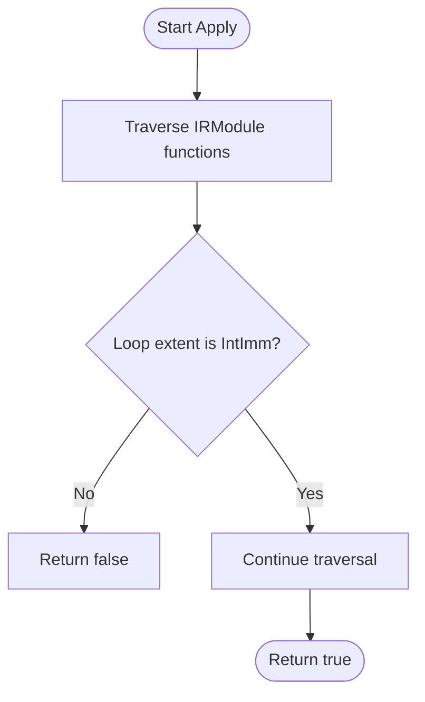

**Diagram sources**
- [disallow_dynamic_loop.cc:28-61](file://src/s_tir/meta_schedule/postproc/disallow_dynamic_loop.cc#L28-L61)

**Section sources**
- [disallow_dynamic_loop.cc:68-94](file://src/s_tir/meta_schedule/postproc/disallow_dynamic_loop.cc#L68-L94)

### Disallow Async Strided Mem Copy
- Purpose: Prohibits asynchronous strided memory copies by detecting non-contiguous indices in async commit queues.
- Mechanism: Lower and analyze IR to detect strided loads/stores within async scopes; rejects if detected.

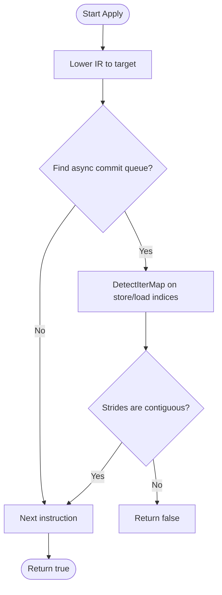

**Diagram sources**
- [disallow_async_strided_mem_copy.cc:29-117](file://src/s_tir/meta_schedule/postproc/disallow_async_strided_mem_copy.cc#L29-L117)

**Section sources**
- [disallow_async_strided_mem_copy.cc:124-197](file://src/s_tir/meta_schedule/postproc/disallow_async_strided_mem_copy.cc#L124-L197)

### Cooperative Fetch Rewriting
- Purpose: Transform cooperative fetch annotations into actual vectorized loop bindings aligned with thread warp size.
- Mechanism: Parses bind instructions, cooperative fetch annotations, and warp execution annotations; splits and binds loops accordingly; vectorizes innermost loop if feasible.

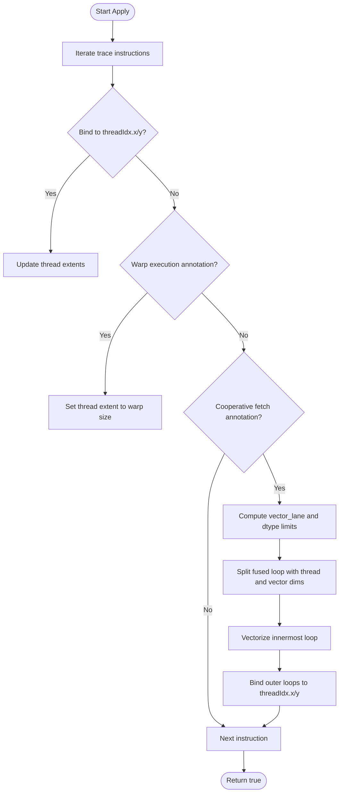

**Diagram sources**
- [rewrite_cooperative_fetch.cc:118-234](file://src/s_tir/meta_schedule/postproc/rewrite_cooperative_fetch.cc#L118-L234)

**Section sources**
- [rewrite_cooperative_fetch.cc:118-234](file://src/s_tir/meta_schedule/postproc/rewrite_cooperative_fetch.cc#L118-L234)

### Parallel, Vectorize, Unroll Rewriting
- Purpose: Apply parallelization, vectorization, and unrolling based on block annotations.
- Mechanism: Parses annotations for max parallel extent, max vectorize extent, explicit/implicit unroll hints; computes fusible axes; performs fuse-split-vectorize-parallelize; injects unroll pragmas.

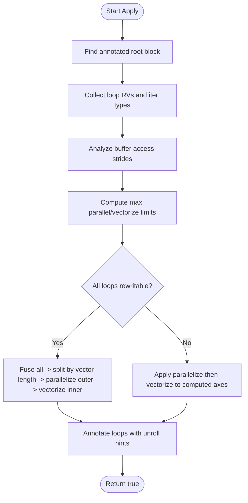

**Diagram sources**
- [rewrite_parallel_vectorize_unroll.cc:107-177](file://src/s_tir/meta_schedule/postproc/rewrite_parallel_vectorize_unroll.cc#L107-L177)
- [rewrite_parallel_vectorize_unroll.cc:179-476](file://src/s_tir/meta_schedule/postproc/rewrite_parallel_vectorize_unroll.cc#L179-L476)

**Section sources**
- [rewrite_parallel_vectorize_unroll.cc:107-177](file://src/s_tir/meta_schedule/postproc/rewrite_parallel_vectorize_unroll.cc#L107-L177)
- [rewrite_parallel_vectorize_unroll.cc:179-476](file://src/s_tir/meta_schedule/postproc/rewrite_parallel_vectorize_unroll.cc#L179-L476)

### Reduction Block Decomposition
- Purpose: Move reduction initialization out of the main reduction block to enable better scheduling and tensorization.
- Mechanism: Finds reduction blocks with unbound reduction iterators; decomposes init block at the innermost suitable loop; propagates tensorization annotations.

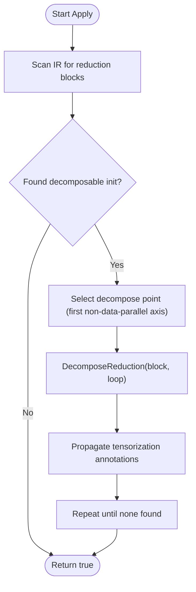

**Diagram sources**
- [rewrite_reduction_block.cc:136-176](file://src/s_tir/meta_schedule/postproc/rewrite_reduction_block.cc#L136-L176)

**Section sources**
- [rewrite_reduction_block.cc:114-176](file://src/s_tir/meta_schedule/postproc/rewrite_reduction_block.cc#L114-L176)

### Unbound Block Thread Binding (CUDA)
- Purpose: Ensure all SBlocks are bound to threads when missing, respecting device limits.
- Mechanism: Scans for unbound blocks; computes factors respecting max_threads_per_block; injects thread bindings.

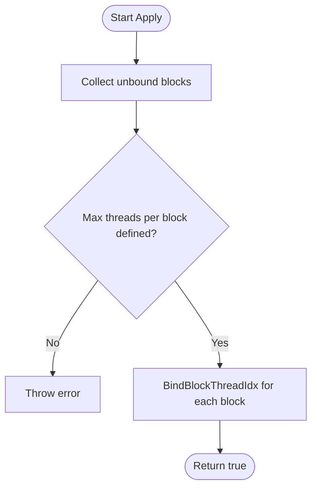

**Diagram sources**
- [rewrite_unbound_block.cc:123-141](file://src/s_tir/meta_schedule/postproc/rewrite_unbound_block.cc#L123-L141)

**Section sources**
- [rewrite_unbound_block.cc:88-148](file://src/s_tir/meta_schedule/postproc/rewrite_unbound_block.cc#L88-L148)

### Tensorization Rewriting
- Purpose: Apply tensor intrinsics to annotated blocks or vectorize init loops when requested.
- Mechanism: Walks IR to find blocks annotated with auto-tensorize; invokes Tensorize or vectorizes init child loops; cleans up annotations.

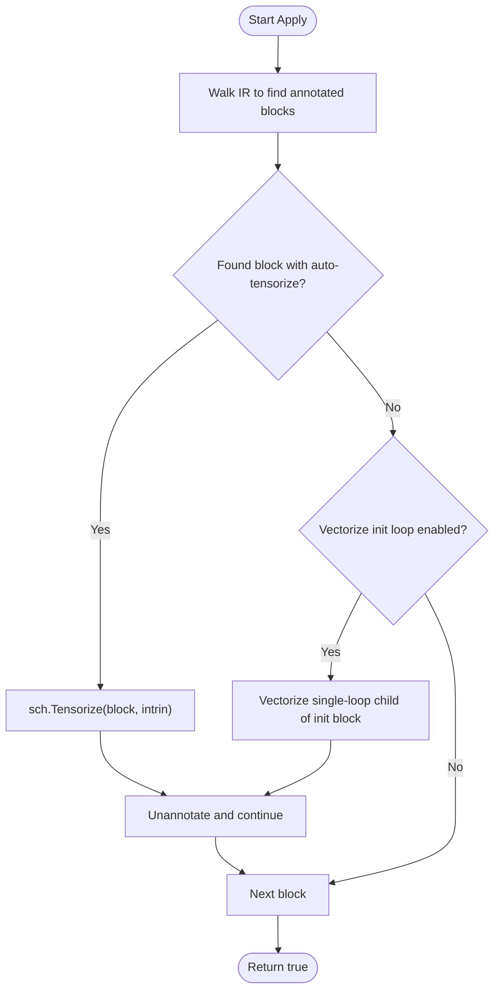

**Diagram sources**
- [rewrite_tensorize.cc:88-107](file://src/s_tir/meta_schedule/postproc/rewrite_tensorize.cc#L88-L107)

**Section sources**
- [rewrite_tensorize.cc:66-107](file://src/s_tir/meta_schedule/postproc/rewrite_tensorize.cc#L66-L107)

### Layout Rewriting
- Purpose: Transform layouts of layout-free buffers to improve memory access patterns.
- Mechanism: Identifies layout-free buffers and their consumption sites; suggests and applies IndexMaps; handles cache-read chains; inserts layout-rewrite blocks when needed.

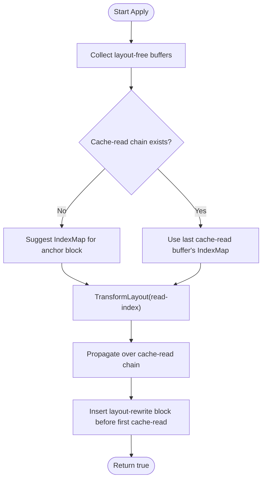

**Diagram sources**
- [rewrite_layout.cc:186-245](file://src/s_tir/meta_schedule/postproc/rewrite_layout.cc#L186-L245)

**Section sources**
- [rewrite_layout.cc:251-283](file://src/s_tir/meta_schedule/postproc/rewrite_layout.cc#L251-L283)

### GPU Code Verification
- Purpose: Ensure generated GPU kernels satisfy platform constraints and pass lowering correctness checks.
- Mechanism: Validates thread extent constraints, runs lowering passes, and checks target-specific limits (shared memory, vector width, etc.).

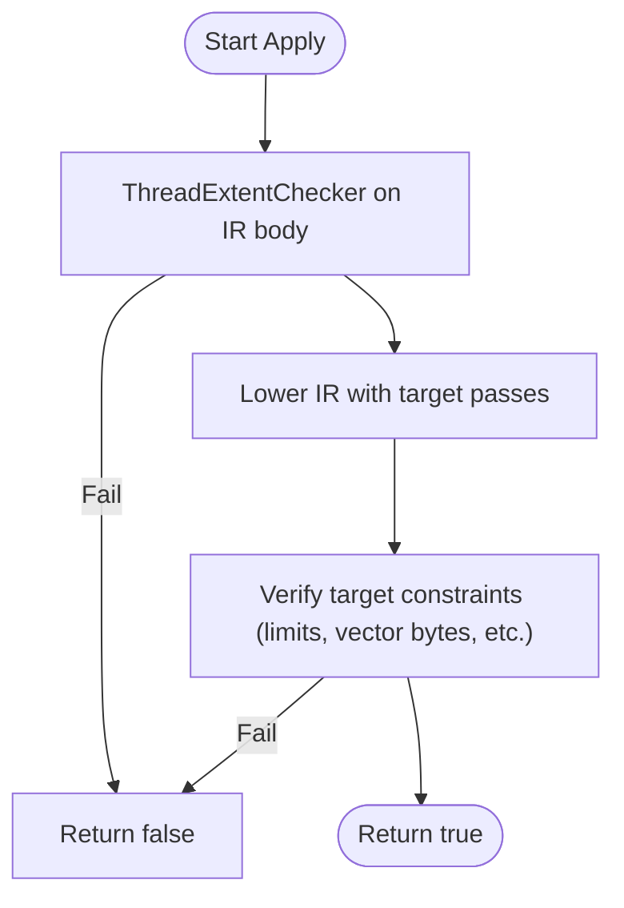

**Diagram sources**
- [verify_gpu_code.cc:148-206](file://src/s_tir/meta_schedule/postproc/verify_gpu_code.cc#L148-L206)

**Section sources**
- [verify_gpu_code.cc:118-206](file://src/s_tir/meta_schedule/postproc/verify_gpu_code.cc#L118-L206)

### VTCM Limit Verification (Hexagon)
- Purpose: Ensure VTCM usage stays within configured capacity for Hexagon targets.
- Mechanism: Applies VTCM compaction passes and validates capacity.

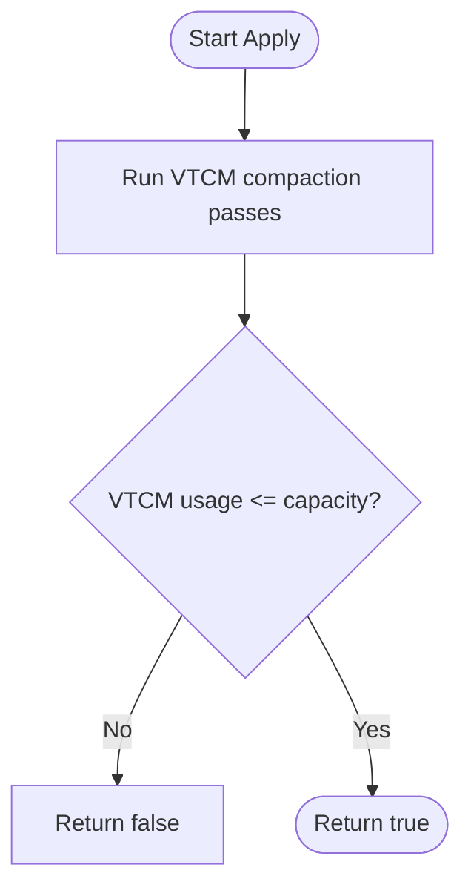

**Diagram sources**
- [verify_vtcm_limit.cc:47-57](file://src/s_tir/meta_schedule/postproc/verify_vtcm_limit.cc#L47-L57)

**Section sources**
- [verify_vtcm_limit.cc:28-57](file://src/s_tir/meta_schedule/postproc/verify_vtcm_limit.cc#L28-L57)

## Dependency Analysis
Postprocessors depend on:
- s_tir::Schedule APIs for IR manipulation.
- Target attributes for device constraints.
- Lowering passes for verification.
- Utility helpers for traversal and analysis.

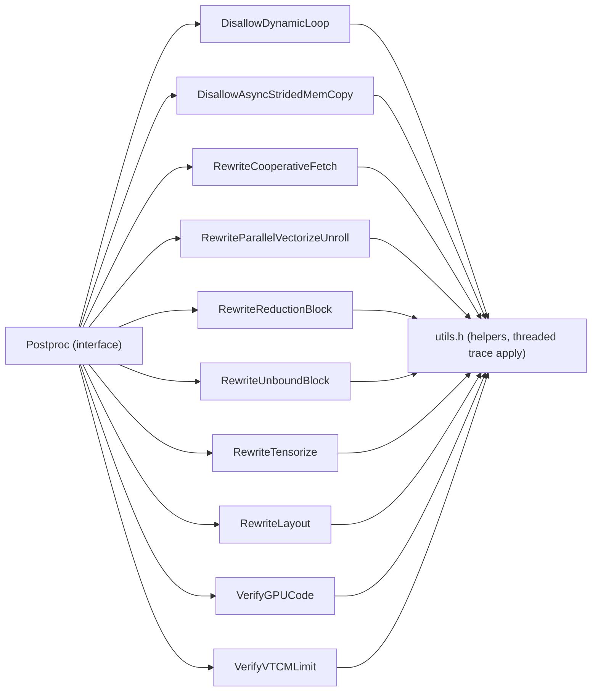

**Diagram sources**
- [postproc.h:38-181](file://include/tvm/s_tir/meta_schedule/postproc.h#L38-L181)
- [utils.h:311-391](file://src/s_tir/meta_schedule/utils.h#L311-L391)

**Section sources**
- [postproc.h:38-181](file://include/tvm/s_tir/meta_schedule/postproc.h#L38-L181)
- [utils.h:311-391](file://src/s_tir/meta_schedule/utils.h#L311-L391)

## Performance Considerations
- Overhead of post-processing:
  - Most postprocessors operate locally on blocks and loops; typical cost scales with block count and loop nesting depth.
  - GPU verification triggers lowering and multiple passes; expect higher overhead but strong correctness guarantees.
- Validation overhead:
  - Thread extent checks and VTCM compaction are linear in IR size.
  - Async strided detection uses index map analysis; cost depends on memory access complexity.
- Optimization opportunities:
  - Batch operations (e.g., vectorization of multiple loops) reduce repeated schedule mutations.
  - Early exits on failure prevent unnecessary work downstream.
  - Target-aware defaults minimize redundant transformations.

[No sources needed since this section provides general guidance]

## Troubleshooting Guide
Common issues and remedies:
- Postprocessor failures:
  - Symptom: Schedule rejected during postprocessing.
  - Action: Inspect logs emitted via the Python logger hook; review specific postprocessor messages and exceptions.
  - Reference: Failure tracking and logging utilities.
- Dynamic loops:
  - Symptom: Kernel fails to launch due to dynamic extents.
  - Action: Ensure all loops have compile-time constant extents; use DisallowDynamicLoop to catch early.
- Async strided memcopy:
  - Symptom: Incorrect or unsupported async transfers.
  - Action: Remove or restructure async regions; DisallowAsyncStridedMemCopy will reject problematic IR.
- Cooperative fetch:
  - Symptom: Poor memory coalescing.
  - Action: Annotate cooperative fetch and ensure vector lanes align with warp size; verify thread extents.
- Tensorization:
  - Symptom: Intrinsics mismatch or vectorization failure.
  - Action: Confirm annotations and availability of intrinsics; enable vectorization of init loops when appropriate.
- GPU verification:
  - Symptom: Runtime errors or illegal memory accesses.
  - Action: Review shared memory and vector byte limits; ensure lowering passes succeed.
- VTCM verification (Hexagon):
  - Symptom: Out-of-memory on Hexagon.
  - Action: Reduce VTCM usage or adjust capacity; rerun VTCM compaction passes.

**Section sources**
- [utils.h:311-391](file://src/s_tir/meta_schedule/utils.h#L311-L391)
- [disallow_dynamic_loop.cc:68-94](file://src/s_tir/meta_schedule/postproc/disallow_dynamic_loop.cc#L68-L94)
- [disallow_async_strided_mem_copy.cc:124-197](file://src/s_tir/meta_schedule/postproc/disallow_async_strided_mem_copy.cc#L124-L197)
- [rewrite_cooperative_fetch.cc:118-234](file://src/s_tir/meta_schedule/postproc/rewrite_cooperative_fetch.cc#L118-L234)
- [rewrite_tensorize.cc:66-107](file://src/s_tir/meta_schedule/postproc/rewrite_tensorize.cc#L66-L107)
- [verify_gpu_code.cc:148-206](file://src/s_tir/meta_schedule/postproc/verify_gpu_code.cc#L148-L206)
- [verify_vtcm_limit.cc:47-57](file://src/s_tir/meta_schedule/postproc/verify_vtcm_limit.cc#L47-L57)

## Conclusion
The meta-scheduling post-processing system provides a robust, extensible framework for final schedule optimizations and correctness checks. By composing targeted postprocessors—covering dynamic loop enforcement, cooperative fetch rewriting, parallel/vectorize/unroll application, reduction decomposition, tensorization, layout transformations, and GPU/VTCM verification—the system ensures generated kernels are both efficient and valid for their target platforms. Integrating custom postprocessors is straightforward via the Python wrapper, enabling experimentation and domain-specific enhancements.

[No sources needed since this section summarizes without analyzing specific files]

## Appendices

### Integration with Optimization Pipeline
- Default pipelines: Use Postproc.create(kind) to obtain target-appropriate postprocessors.
- Custom postprocessors: Subclass PyPostproc in Python and implement InitializeWithTuneContext, Apply, and Clone; register via Postproc.PyPostproc.

**Section sources**
- [postproc.py:82-109](file://python/tvm/s_tir/meta_schedule/postproc/postproc.py#L82-L109)
- [postproc.py:139-196](file://python/tvm/s_tir/meta_schedule/postproc/postproc.py#L139-L196)

### Example Workflows
- CUDA pipeline: DisallowDynamicLoop → RewriteCooperativeFetch → RewriteUnboundBlock → RewriteParallelVectorizeUnroll → RewriteReductionBlock → VerifyGPUCode → RewriteTensorize (optional).
- Hexagon pipeline: DisallowDynamicLoop → RewriteParallelVectorizeUnroll → RewriteReductionBlock → RewriteLayout → VerifyVTCMLimit.

**Section sources**
- [postproc.cc:81-112](file://src/s_tir/meta_schedule/postproc/postproc.cc#L81-L112)