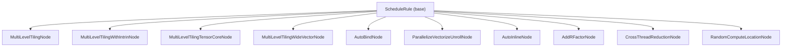
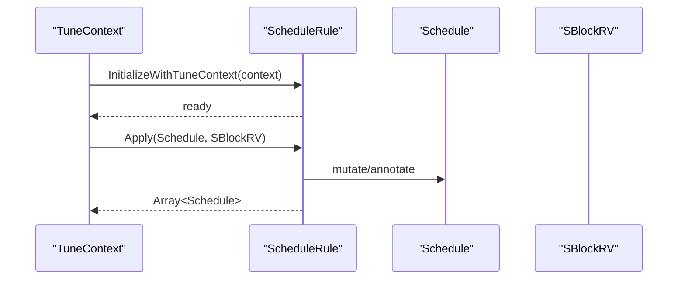
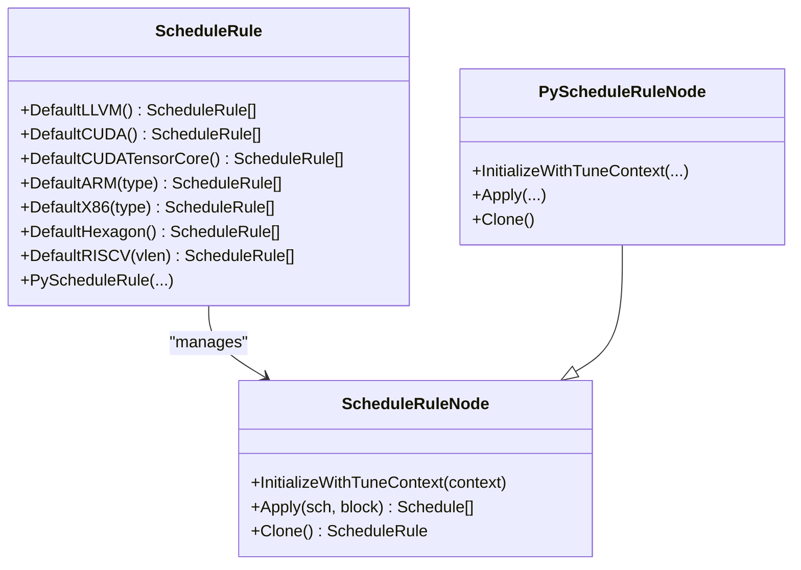
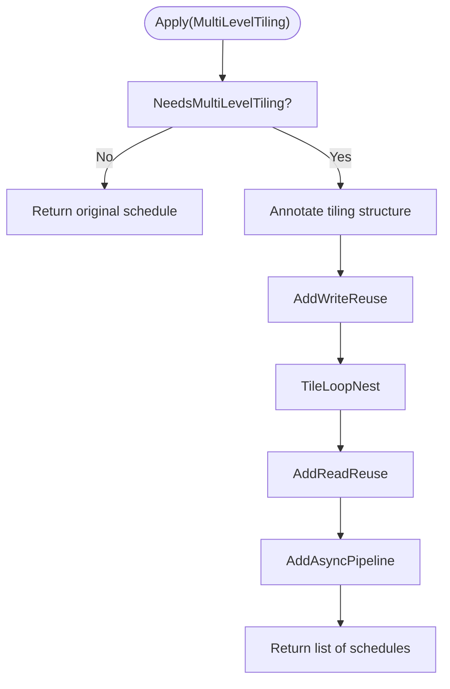
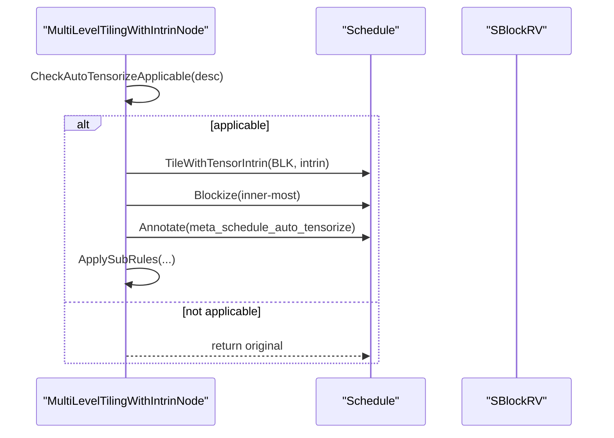
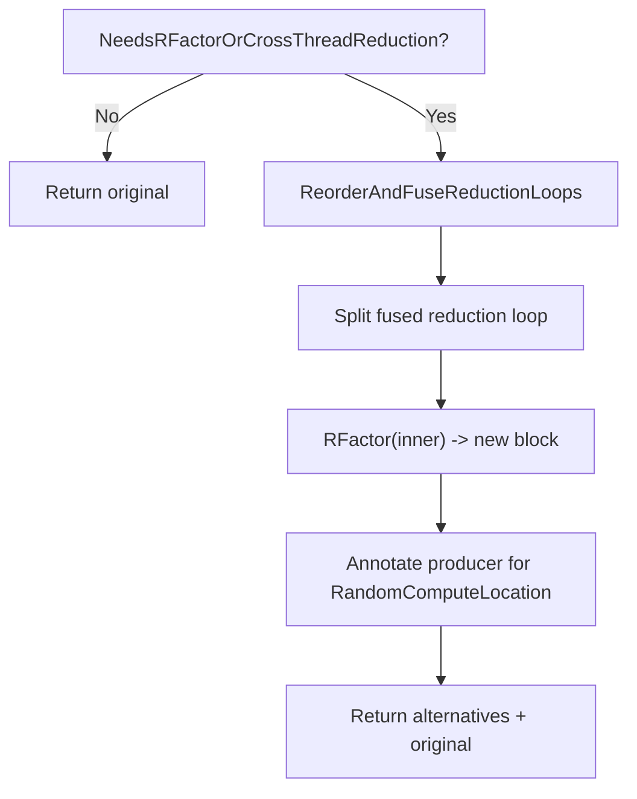
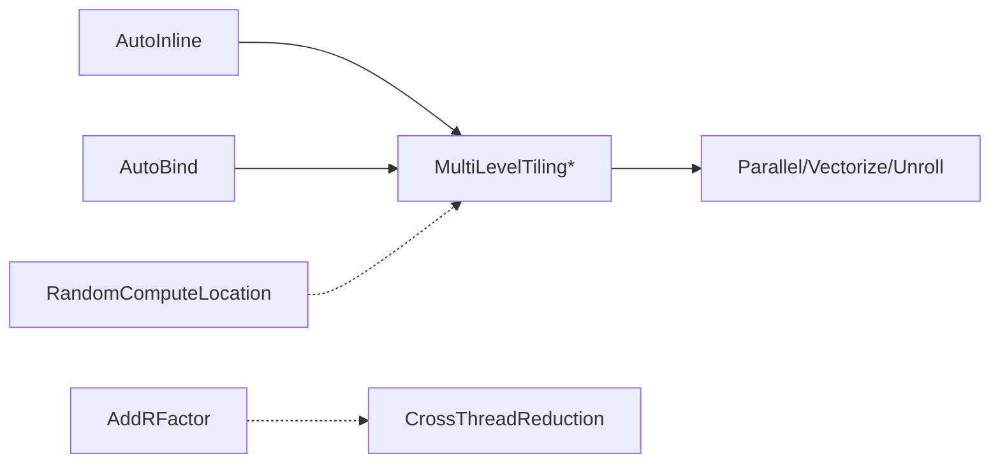

# Schedule Rules

<cite>
**Referenced Files in This Document**
- [schedule_rule.h](file://include/tvm/s_tir/meta_schedule/schedule_rule.h)
- [schedule_rule.cc](file://src/s_tir/meta_schedule/schedule_rule/schedule_rule.cc)
- [multi_level_tiling.h](file://src/s_tir/meta_schedule/schedule_rule/multi_level_tiling.h)
- [multi_level_tiling.cc](file://src/s_tir/meta_schedule/schedule_rule/multi_level_tiling.cc)
- [multi_level_tiling_with_intrin.cc](file://src/s_tir/meta_schedule/schedule_rule/multi_level_tiling_with_intrin.cc)
- [multi_level_tiling_tensor_core.cc](file://src/s_tir/meta_schedule/schedule_rule/multi_level_tiling_tensor_core.cc)
- [multi_level_tiling_wide_vector.cc](file://src/s_tir/meta_schedule/schedule_rule/multi_level_tiling_wide_vector.cc)
- [auto_bind.cc](file://src/s_tir/meta_schedule/schedule_rule/auto_bind.cc)
- [parallel_vectorize_unroll.cc](file://src/s_tir/meta_schedule/schedule_rule/parallel_vectorize_unroll.cc)
- [auto_inline.cc](file://src/s_tir/meta_schedule/schedule_rule/auto_inline.cc)
- [add_rfactor.cc](file://src/s_tir/meta_schedule/schedule_rule/add_rfactor.cc)
- [cross_thread_reduction.cc](file://src/s_tir/meta_schedule/schedule_rule/cross_thread_reduction.cc)
- [random_compute_location.cc](file://src/s_tir/meta_schedule/schedule_rule/random_compute_location.cc)
</cite>

## Table of Contents
1. [Introduction](#introduction)
2. [Project Structure](#project-structure)
3. [Core Components](#core-components)
4. [Architecture Overview](#architecture-overview)
5. [Detailed Component Analysis](#detailed-component-analysis)
6. [Dependency Analysis](#dependency-analysis)
7. [Performance Considerations](#performance-considerations)
8. [Troubleshooting Guide](#troubleshooting-guide)
9. [Conclusion](#conclusion)

## Introduction
This document explains the schedule rule system used in meta-scheduling. It focuses on the ScheduleRule base class and its concrete implementations that drive automatic code transformations. Covered topics include:
- Tiling strategies (multi-level tiling, tensor-core variants, wide-vector variant, intrinsic-driven tiling)
- Auto-binding mechanisms for GPU thread axes
- Parallelization, vectorization, and unrolling rules
- Unrolling optimizations
- Rule application process, dependency resolution, and conflict handling
- Practical examples of custom rule development, rule composition patterns, and performance impact analysis
- Rule ordering, applicability conditions, and integration with the broader meta-scheduling framework

## Project Structure
The schedule rule system is organized around a base class and a set of rule implementations. Each rule encapsulates a specific transformation strategy and is designed to be composable within a default rule chain per target.

**Diagram sources**
- [schedule_rule.h:41-75](file://include/tvm/s_tir/meta_schedule/schedule_rule.h#L41-L75)
- [multi_level_tiling.h:162-235](file://src/s_tir/meta_schedule/schedule_rule/multi_level_tiling.h#L162-L235)
- [multi_level_tiling_with_intrin.cc:51-101](file://src/s_tir/meta_schedule/schedule_rule/multi_level_tiling_with_intrin.cc#L51-L101)
- [multi_level_tiling_tensor_core.cc:141-213](file://src/s_tir/meta_schedule/schedule_rule/multi_level_tiling_tensor_core.cc#L141-L213)
- [multi_level_tiling_wide_vector.cc:40-63](file://src/s_tir/meta_schedule/schedule_rule/multi_level_tiling_wide_vector.cc#L40-L63)
- [auto_bind.cc:31-66](file://src/s_tir/meta_schedule/schedule_rule/auto_bind.cc#L31-L66)
- [parallel_vectorize_unroll.cc:45-126](file://src/s_tir/meta_schedule/schedule_rule/parallel_vectorize_unroll.cc#L45-L126)
- [auto_inline.cc:61-116](file://src/s_tir/meta_schedule/schedule_rule/auto_inline.cc#L61-L116)
- [add_rfactor.cc:28-71](file://src/s_tir/meta_schedule/schedule_rule/add_rfactor.cc#L28-L71)
- [cross_thread_reduction.cc:27-51](file://src/s_tir/meta_schedule/schedule_rule/cross_thread_reduction.cc#L27-L51)
- [random_compute_location.cc:28-70](file://src/s_tir/meta_schedule/schedule_rule/random_compute_location.cc#L28-L70)

**Section sources**
- [schedule_rule.h:41-75](file://include/tvm/s_tir/meta_schedule/schedule_rule.h#L41-L75)
- [schedule_rule.cc:58-487](file://src/s_tir/meta_schedule/schedule_rule/schedule_rule.cc#L58-L487)

## Core Components
- ScheduleRuleNode: Abstract base class defining the interface for all schedule rules. It exposes InitializeWithTuneContext, Apply, and Clone methods, plus a managed reference wrapper ScheduleRule.
- Default rule factories: Per-target convenience constructors that assemble a sensible default rule chain (e.g., DefaultLLVM, DefaultCUDA, DefaultCUDATensorCore, DefaultARM, DefaultX86, DefaultHexagon, DefaultRISCV).
- Rule implementations: Concrete classes implementing specific transformations (tiling, binding, parallel/vectorize/unroll, inline, rfactor, cross-thread reduction, random compute location).

Key responsibilities:
- Initialization: Rules may read target attributes (e.g., max_threads_per_block, thread_warp_size) to inform decisions.
- Application: Rules transform a schedule for a given block and return zero or more derived schedules.
- Composition: Rules are chained in a default order tailored to the target architecture.

**Section sources**
- [schedule_rule.h:41-75](file://include/tvm/s_tir/meta_schedule/schedule_rule.h#L41-L75)
- [schedule_rule.cc:58-487](file://src/s_tir/meta_schedule/schedule_rule/schedule_rule.cc#L58-L487)

## Architecture Overview
The meta-scheduling framework applies a sequence of ScheduleRule instances to explore a design space of schedules. Each rule decides whether to transform the schedule for a selected block and how to annotate or mutate the schedule to guide downstream passes.

**Diagram sources**
- [schedule_rule.h:56-65](file://include/tvm/s_tir/meta_schedule/schedule_rule.h#L56-L65)
- [schedule_rule.cc:463-482](file://src/s_tir/meta_schedule/schedule_rule/schedule_rule.cc#L463-L482)

## Detailed Component Analysis

### Base Class: ScheduleRule and PyScheduleRule
- ScheduleRuleNode defines the contract for all rules.
- PyScheduleRuleNode enables Python-defined rules to plug into the C++ infrastructure by exposing typed function wrappers for InitializeWithTuneContext, Apply, Clone, and AsString.

**Diagram sources**
- [schedule_rule.h:41-75](file://include/tvm/s_tir/meta_schedule/schedule_rule.h#L41-L75)
- [schedule_rule.h:321-352](file://include/tvm/s_tir/meta_schedule/schedule_rule.h#L321-L352)
- [schedule_rule.cc:45-56](file://src/s_tir/meta_schedule/schedule_rule/schedule_rule.cc#L45-L56)

**Section sources**
- [schedule_rule.h:41-75](file://include/tvm/s_tir/meta_schedule/schedule_rule.h#L41-L75)
- [schedule_rule.h:321-352](file://include/tvm/s_tir/meta_schedule/schedule_rule.h#L321-L352)
- [schedule_rule.cc:45-56](file://src/s_tir/meta_schedule/schedule_rule/schedule_rule.cc#L45-L56)

### Multi-Level Tiling (Mega Rule)
MultiLevelTilingNode orchestrates a composite transformation:
- AddWriteReuse: introduce write cache(s) and optionally reverse-compute-at them to chosen tiling levels
- TileLoopNest: split and reorder loops according to a tiling structure (e.g., "SSRSRS", "SSSRRSRS")
- AddReadReuse: cache-read blocks for read buffers and insert compute-at/annotations
- AddAsyncPipeline: optional software pipelining annotations for compatible architectures

**Diagram sources**
- [multi_level_tiling.cc:112-124](file://src/s_tir/meta_schedule/schedule_rule/multi_level_tiling.cc#L112-L124)
- [multi_level_tiling.cc:132-139](file://src/s_tir/meta_schedule/schedule_rule/multi_level_tiling.cc#L132-L139)
- [multi_level_tiling.h:162-186](file://src/s_tir/meta_schedule/schedule_rule/multi_level_tiling.h#L162-L186)

Key configuration:
- structure: tiling template (e.g., "SSRSRS", "SSSRRSRS")
- tile_binds: binds tiles to thread axes (e.g., ["blockIdx.x","vthread.x","threadIdx.x"])
- max_innermost_factor: caps innermost tile sizes
- vector_load_lens: vector fetch lengths per dtype
- reuse_read_/reuse_write_: reuse policy with levels and scopes
- filter_fn: predicate to override default applicability

**Section sources**
- [multi_level_tiling.h:107-139](file://src/s_tir/meta_schedule/schedule_rule/multi_level_tiling.h#L107-L139)
- [multi_level_tiling.h:162-235](file://src/s_tir/meta_schedule/schedule_rule/multi_level_tiling.h#L162-L235)
- [multi_level_tiling.cc:112-124](file://src/s_tir/meta_schedule/schedule_rule/multi_level_tiling.cc#L112-L124)
- [multi_level_tiling.cc:132-139](file://src/s_tir/meta_schedule/schedule_rule/multi_level_tiling.cc#L132-L139)
- [multi_level_tiling.cc:141-188](file://src/s_tir/meta_schedule/schedule_rule/multi_level_tiling.cc#L141-L188)
- [multi_level_tiling.cc:201-291](file://src/s_tir/meta_schedule/schedule_rule/multi_level_tiling.cc#L201-L291)
- [multi_level_tiling.cc:293-327](file://src/s_tir/meta_schedule/schedule_rule/multi_level_tiling.cc#L293-L327)
- [multi_level_tiling.cc:329-364](file://src/s_tir/meta_schedule/schedule_rule/multi_level_tiling.cc#L329-L364)
- [multi_level_tiling.cc:366-399](file://src/s_tir/meta_schedule/schedule_rule/multi_level_tiling.cc#L366-L399)

### Intrinsic-Driven Tiling
- MultiLevelTilingWithIntrinNode: checks applicability of a named tensor intrinsic and, if applicable, tiles inner loops to match the intrinsic’s structure, then continues with standard subrules.
- MultiLevelTilingTensorCoreNode: specialized for tensor core intrinsics, including reindexing, read/write cache transforms, optional software pipelining, and MMA/WMMAs differences.

**Diagram sources**
- [multi_level_tiling_with_intrin.cc:53-69](file://src/s_tir/meta_schedule/schedule_rule/multi_level_tiling_with_intrin.cc#L53-L69)
- [multi_level_tiling_tensor_core.cc:216-262](file://src/s_tir/meta_schedule/schedule_rule/multi_level_tiling_tensor_core.cc#L216-L262)

**Section sources**
- [multi_level_tiling_with_intrin.cc:51-101](file://src/s_tir/meta_schedule/schedule_rule/multi_level_tiling_with_intrin.cc#L51-L101)
- [multi_level_tiling_tensor_core.cc:141-213](file://src/s_tir/meta_schedule/schedule_rule/multi_level_tiling_tensor_core.cc#L141-L213)
- [multi_level_tiling_tensor_core.cc:264-290](file://src/s_tir/meta_schedule/schedule_rule/multi_level_tiling_tensor_core.cc#L264-L290)
- [multi_level_tiling_tensor_core.cc:304-336](file://src/s_tir/meta_schedule/schedule_rule/multi_level_tiling_tensor_core.cc#L304-L336)
- [multi_level_tiling_tensor_core.cc:352-432](file://src/s_tir/meta_schedule/schedule_rule/multi_level_tiling_tensor_core.cc#L352-L432)
- [multi_level_tiling_tensor_core.cc:434-526](file://src/s_tir/meta_schedule/schedule_rule/multi_level_tiling_tensor_core.cc#L434-L526)
- [multi_level_tiling_tensor_core.cc:528-599](file://src/s_tir/meta_schedule/schedule_rule/multi_level_tiling_tensor_core.cc#L528-L599)
- [multi_level_tiling_tensor_core.cc:601-639](file://src/s_tir/meta_schedule/schedule_rule/multi_level_tiling_tensor_core.cc#L601-L639)
- [multi_level_tiling_tensor_core.cc:641-768](file://src/s_tir/meta_schedule/schedule_rule/multi_level_tiling_tensor_core.cc#L641-L768)

### Wide Vector Tiling
MultiLevelTilingWideVectorNode specializes tiling for backends with wide vector registers. It ensures the innermost spatial axis of the output buffer is split with the maximum vector length, while preserving other tiling behavior.

**Section sources**
- [multi_level_tiling_wide_vector.cc:40-63](file://src/s_tir/meta_schedule/schedule_rule/multi_level_tiling_wide_vector.cc#L40-L63)
- [multi_level_tiling_wide_vector.cc:65-125](file://src/s_tir/meta_schedule/schedule_rule/multi_level_tiling_wide_vector.cc#L65-L125)

### Auto-Binding (GPU Thread Binding)
AutoBindNode selects and binds thread extents to tiles, respecting target limits (max_threads_per_block, max_threadblocks). It samples thread extents and binds fused tiles to thread axes.

**Section sources**
- [auto_bind.cc:31-66](file://src/s_tir/meta_schedule/schedule_rule/auto_bind.cc#L31-L66)
- [auto_bind.cc:68-74](file://src/s_tir/meta_schedule/schedule_rule/auto_bind.cc#L68-L74)
- [auto_bind.cc:76-83](file://src/s_tir/meta_schedule/schedule_rule/auto_bind.cc#L76-L83)

### Parallelization, Vectorization, and Unrolling
ParallelizeVectorizeUnrollNode annotates the root block with:
- meta_schedule_parallel: maximum parallel jobs
- meta_schedule_vectorize: maximum vector extent
- meta_schedule_unroll_explicit or meta_schedule_unroll_implicit: categorical selection of unroll bounds

It applies only to the root block and respects spatial prim func constraints for unroll.

**Section sources**
- [parallel_vectorize_unroll.cc:45-92](file://src/s_tir/meta_schedule/schedule_rule/parallel_vectorize_unroll.cc#L45-L92)
- [parallel_vectorize_unroll.cc:57-84](file://src/s_tir/meta_schedule/schedule_rule/parallel_vectorize_unroll.cc#L57-L84)
- [parallel_vectorize_unroll.cc:128-139](file://src/s_tir/meta_schedule/schedule_rule/parallel_vectorize_unroll.cc#L128-L139)

### Auto-Inline
AutoInlineNode decides whether to inline a block into its consumer or producer based on:
- Shape constraints (single write buffer)
- Operator restrictions (disallow_if_then_else, disallow_op)
- Read-write mapping properties (injective, ordered)
- Annotation overrides (meta_schedule_inline_rule)
- Tensor intrinsic conflicts (avoid inline into blocks marked auto-tensorize)

InlineConstantScalarsNode handles constant scalar blocks specifically.

**Section sources**
- [auto_inline.cc:61-116](file://src/s_tir/meta_schedule/schedule_rule/auto_inline.cc#L61-L116)
- [auto_inline.cc:118-196](file://src/s_tir/meta_schedule/schedule_rule/auto_inline.cc#L118-L196)
- [auto_inline.cc:231-283](file://src/s_tir/meta_schedule/schedule_rule/auto_inline.cc#L231-L283)

### R-Factor and Cross-Thread Reduction
- AddRFactorNode: detects when parallelism or cross-thread reduction is beneficial, reorders/fuses reduction loops, splits, and applies R-factors to produce alternative schedules.
- CrossThreadReductionNode: attempts block fusion to enable shared-memory reduction, splits fused reduction loop, and binds inner loop to threadIdx.x. It samples thread extents and can fuse with a consumer when possible.

**Diagram sources**
- [add_rfactor.cc:83-126](file://src/s_tir/meta_schedule/schedule_rule/add_rfactor.cc#L83-L126)
- [cross_thread_reduction.cc:53-120](file://src/s_tir/meta_schedule/schedule_rule/cross_thread_reduction.cc#L53-L120)

**Section sources**
- [add_rfactor.cc:83-126](file://src/s_tir/meta_schedule/schedule_rule/add_rfactor.cc#L83-L126)
- [cross_thread_reduction.cc:53-120](file://src/s_tir/meta_schedule/schedule_rule/cross_thread_reduction.cc#L53-L120)

### Random Compute Location
RandomComputeLocationNode performs randomized compute-at sampling subject to several conditions (not root, direct child of root, single-child outer loop, not already tiled, has consumers). It can also handle a producer-triggered compute-at via annotations.

**Section sources**
- [random_compute_location.cc:28-70](file://src/s_tir/meta_schedule/schedule_rule/random_compute_location.cc#L28-L70)
- [random_compute_location.cc:72-104](file://src/s_tir/meta_schedule/schedule_rule/random_compute_location.cc#L72-L104)
- [random_compute_location.cc:112-116](file://src/s_tir/meta_schedule/schedule_rule/random_compute_location.cc#L112-L116)

## Dependency Analysis
- Rule instantiation and registration:
  - Default factories construct arrays of ScheduleRule instances per target.
  - Reflection and global registry entries expose constructors and default builders to the FFI layer.
- Rule interplay:
  - MultiLevelTiling variants rely on cooperative fetching annotations and may conflict with unrolling if not carefully configured.
  - AutoBind interacts with tiling structures; tile_binds must align with thread extents.
  - AutoInline and InlineConstantScalars often precede tiling to simplify the block graph.
  - AddRFactor and CrossThreadReduction both target reduction loops; they can be complementary or mutually exclusive depending on the workload.
  - RandomComputeLocation depends on blocks not being pre-tiled and benefits from prior inlining to reduce branching.

**Diagram sources**
- [schedule_rule.cc:58-487](file://src/s_tir/meta_schedule/schedule_rule/schedule_rule.cc#L58-L487)
- [auto_inline.cc:61-116](file://src/s_tir/meta_schedule/schedule_rule/auto_inline.cc#L61-L116)
- [add_rfactor.cc:83-126](file://src/s_tir/meta_schedule/schedule_rule/add_rfactor.cc#L83-L126)
- [cross_thread_reduction.cc:53-120](file://src/s_tir/meta_schedule/schedule_rule/cross_thread_reduction.cc#L53-L120)
- [parallel_vectorize_unroll.cc:57-84](file://src/s_tir/meta_schedule/schedule_rule/parallel_vectorize_unroll.cc#L57-L84)
- [auto_bind.cc:68-74](file://src/s_tir/meta_schedule/schedule_rule/auto_bind.cc#L68-L74)
- [random_compute_location.cc:34-63](file://src/s_tir/meta_schedule/schedule_rule/random_compute_location.cc#L34-L63)

**Section sources**
- [schedule_rule.cc:58-487](file://src/s_tir/meta_schedule/schedule_rule/schedule_rule.cc#L58-L487)

## Performance Considerations
- Tiling structure selection:
  - "SSRSRS" favors CPU vectorization and locality.
  - "SSSRRSRS" targets GPU occupancy and shared/local reuse.
- Cooperative fetching:
  - Vector load lens are filtered by dtype and sampled probabilistically; ensure vector_load_lens matches hardware capabilities.
- Unrolling:
  - Explicit unrolling can increase register pressure; implicit unroll may be preferable for dynamic extents.
- Parallelization:
  - max_jobs_per_core scales with target cores; avoid oversubscription.
- Tensorization:
  - Intrinsics must match shapes and layouts; mismatches lead to fallback to regular tiling.
- Cross-thread reduction:
  - Fusion reduces synchronization overhead; ensure shared memory scope and appropriate thread extents.

[No sources needed since this section provides general guidance]

## Troubleshooting Guide
- Rule not applied:
  - Verify target attributes (e.g., max_threads_per_block, thread_warp_size) are present for GPU rules.
  - Check applicability predicates (e.g., NeedsMultiLevelTiling, NeedsRFactorOrCrossThreadReduction).
- Conflicts between rules:
  - AutoInline vs. tensorization: avoid inlining blocks marked for auto-tensorize.
  - Pre/post-processing: ensure postprocessors respect annotations (e.g., meta_schedule_cooperative_fetch).
- Poor performance:
  - Excessive unrolling or insufficient vectorization; adjust unroll_max_steps and vector_load_lens.
  - Misaligned tile_binds with thread extents; verify AutoBind configuration.
- Debugging:
  - Use logging hooks exposed by rules (e.g., logger in MultiLevelTilingNode).
  - Inspect annotations (parallel, vectorize, unroll, auto_tensorize) on blocks.

**Section sources**
- [multi_level_tiling.cc:81-109](file://src/s_tir/meta_schedule/schedule_rule/multi_level_tiling.cc#L81-L109)
- [cross_thread_reduction.cc:30-50](file://src/s_tir/meta_schedule/schedule_rule/cross_thread_reduction.cc#L30-L50)
- [auto_inline.cc:162-165](file://src/s_tir/meta_schedule/schedule_rule/auto_inline.cc#L162-L165)

## Conclusion
The schedule rule system provides a modular, composable foundation for automatic code transformations in meta-scheduling. By combining tiling strategies, binding, parallel/vectorization/unrolling, inlining, rfactor/cross-thread reduction, and randomized compute-at, it explores diverse designs efficiently. Proper rule ordering, careful applicability checks, and alignment with target characteristics are essential for achieving strong performance.