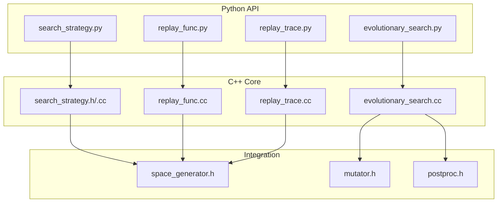
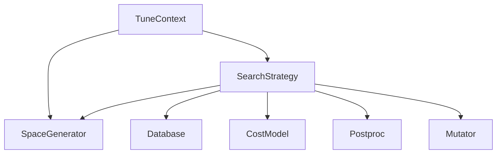
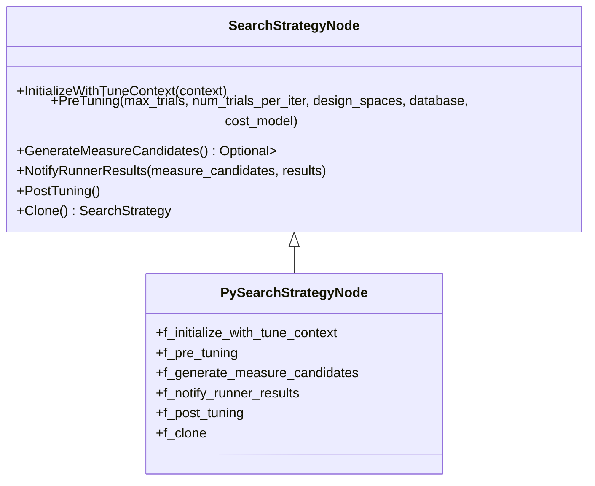
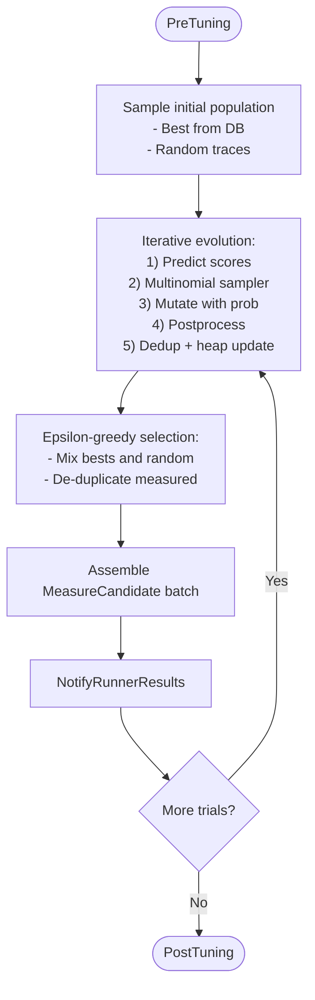
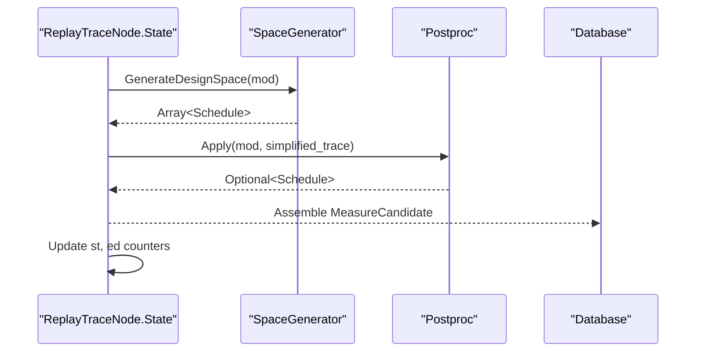
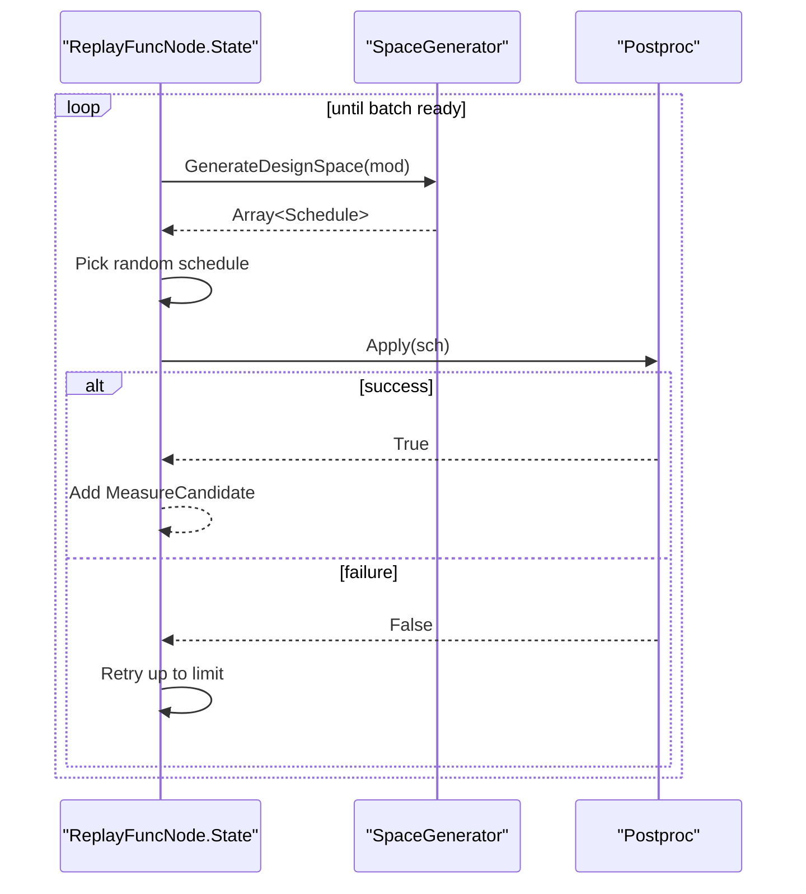
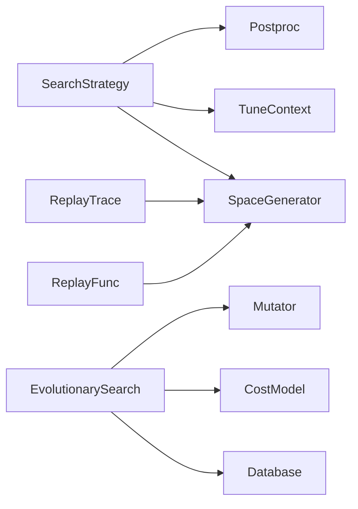

# Search Strategies

<cite>
**Referenced Files in This Document**
- [search_strategy.h](file://include/tvm/s_tir/meta_schedule/search_strategy.h)
- [search_strategy.cc](file://src/s_tir/meta_schedule/search_strategy/search_strategy.cc)
- [search_strategy.py](file://python/tvm/s_tir/meta_schedule/search_strategy/search_strategy.py)
- [evolutionary_search.py](file://python/tvm/s_tir/meta_schedule/search_strategy/evolutionary_search.py)
- [replay_func.py](file://python/tvm/s_tir/meta_schedule/search_strategy/replay_func.py)
- [replay_trace.py](file://python/tvm/s_tir/meta_schedule/search_strategy/replay_trace.py)
- [evolutionary_search.cc](file://src/s_tir/meta_schedule/search_strategy/evolutionary_search.cc)
- [replay_func.cc](file://src/s_tir/meta_schedule/search_strategy/replay_func.cc)
- [replay_trace.cc](file://src/s_tir/meta_schedule/search_strategy/replay_trace.cc)
- [space_generator.h](file://include/tvm/s_tir/meta_schedule/space_generator.h)
- [mutator.h](file://include/tvm/s_tir/meta_schedule/mutator.h)
- [postproc.h](file://include/tvm/s_tir/meta_schedule/postproc.h)
- [test_meta_schedule_search_strategy.py](file://tests/python/s_tir/meta_schedule/test_meta_schedule_search_strategy.py)
- [meta_schedule.py](file://docs/deep_dive/tensor_ir/tutorials/meta_schedule.py)
</cite>

## Table of Contents
1. [Introduction](#introduction)
2. [Project Structure](#project-structure)
3. [Core Components](#core-components)
4. [Architecture Overview](#architecture-overview)
5. [Detailed Component Analysis](#detailed-component-analysis)
6. [Dependency Analysis](#dependency-analysis)
7. [Performance Considerations](#performance-considerations)
8. [Troubleshooting Guide](#troubleshooting-guide)
9. [Conclusion](#conclusion)
10. [Appendices](#appendices)

## Introduction
This document explains the meta-scheduling search strategies in TVM’s S-TIR meta-scheduler. It covers the SearchStrategy base class, three concrete strategies—evolutionary search, replay-based trace replay, and replay-based function invocation—and how they integrate with design space generation, mutators, postprocessors, databases, and cost models. It also provides guidance on configuring strategies for different hardware targets, interpreting convergence behavior, optimizing performance, and debugging failed searches.

## Project Structure
The search strategy subsystem is organized around a shared C++ base class and Python wrappers, with concrete implementations in C++ and optional Python customization hooks.

**Diagram sources**
- [search_strategy.h:42-76](file://include/tvm/s_tir/meta_schedule/search_strategy.h#L42-L76)
- [search_strategy.cc:90-111](file://src/s_tir/meta_schedule/search_strategy/search_strategy.cc#L90-L111)
- [search_strategy.py:81-107](file://python/tvm/s_tir/meta_schedule/search_strategy/search_strategy.py#L81-L107)
- [evolutionary_search.cc:251-478](file://src/s_tir/meta_schedule/search_strategy/evolutionary_search.cc#L251-L478)
- [replay_func.cc:28-124](file://src/s_tir/meta_schedule/search_strategy/replay_func.cc#L28-L124)
- [replay_trace.cc:28-144](file://src/s_tir/meta_schedule/search_strategy/replay_trace.cc#L28-L144)
- [space_generator.h:41-76](file://include/tvm/s_tir/meta_schedule/space_generator.h#L41-L76)
- [mutator.h:38-73](file://include/tvm/s_tir/meta_schedule/mutator.h#L38-L73)
- [postproc.h:35-70](file://include/tvm/s_tir/meta_schedule/postproc.h#L35-L70)

**Section sources**
- [search_strategy.h:42-76](file://include/tvm/s_tir/meta_schedule/search_strategy.h#L42-L76)
- [search_strategy.cc:90-111](file://src/s_tir/meta_schedule/search_strategy/search_strategy.cc#L90-L111)
- [search_strategy.py:81-107](file://python/tvm/s_tir/meta_schedule/search_strategy/search_strategy.py#L81-L107)

## Core Components
- SearchStrategy base class: Defines the lifecycle and extension points for generating measure candidates, receiving results, and cloning strategies.
- Concrete strategies:
  - EvolutionarySearch: Population-based exploration guided by a cost model and mutators.
  - ReplayTrace: Replays simplified traces with randomized decisions.
  - ReplayFunc: Uses a SpaceGenerator to generate design spaces and post-process them.
- Supporting infrastructure:
  - SpaceGenerator: Produces design spaces (schedules) from a module.
  - Mutator: Applies mutations to traces to explore nearby designs.
  - Postproc: Applies post-processing rules to schedules.

Key responsibilities:
- Candidate generation: GenerateMeasureCandidates returns batches of MeasureCandidate until completion.
- Feedback loop: NotifyRunnerResults updates internal state with measured results.
- Lifecycle: InitializeWithTuneContext, PreTuning, PostTuning manage setup and teardown.

**Section sources**
- [search_strategy.h:78-135](file://include/tvm/s_tir/meta_schedule/search_strategy.h#L78-L135)
- [search_strategy.cc:34-88](file://src/s_tir/meta_schedule/search_strategy/search_strategy.cc#L34-L88)
- [search_strategy.py:109-196](file://python/tvm/s_tir/meta_schedule/search_strategy/search_strategy.py#L109-L196)

## Architecture Overview
The search strategies participate in the broader meta-scheduling pipeline alongside SpaceGenerator, Mutator, Postproc, Database, and CostModel.

**Diagram sources**
- [search_strategy.h:42-76](file://include/tvm/s_tir/meta_schedule/search_strategy.h#L42-L76)
- [space_generator.h:41-76](file://include/tvm/s_tir/meta_schedule/space_generator.h#L41-L76)
- [mutator.h:38-73](file://include/tvm/s_tir/meta_schedule/mutator.h#L38-L73)
- [postproc.h:35-70](file://include/tvm/s_tir/meta_schedule/postproc.h#L35-L70)

## Detailed Component Analysis

### SearchStrategy Base Class
- Lifecycle methods:
  - InitializeWithTuneContext: Validates and prepares the strategy with TuneContext.
  - PreTuning: Validates prerequisites (e.g., database and cost model for evolutionary search).
  - GenerateMeasureCandidates: Returns a batch of MeasureCandidate or None to signal completion.
  - NotifyRunnerResults: Updates strategy state with runner results.
  - PostTuning: Cleans up state.
- Reflection and Python binding:
  - PySearchStrategyNode exposes Python-callable hooks for each lifecycle method.
  - Global FFI registration wires Python SearchStrategy to C++ SearchStrategyNode.

**Diagram sources**
- [search_strategy.h:78-135](file://include/tvm/s_tir/meta_schedule/search_strategy.h#L78-L135)
- [search_strategy.cc:34-88](file://src/s_tir/meta_schedule/search_strategy/search_strategy.cc#L34-L88)

**Section sources**
- [search_strategy.h:78-135](file://include/tvm/s_tir/meta_schedule/search_strategy.h#L78-L135)
- [search_strategy.cc:34-88](file://src/s_tir/meta_schedule/search_strategy/search_strategy.cc#L34-L88)

### EvolutionarySearch
- Purpose: Explore the design space using a population of schedules, evolve via mutators, and greedily select top candidates using a cost model.
- Key internals:
  - State holds design spaces, per-thread data, measured workloads, database, cost model, and token.
  - Initial population sampling: Picks best from database and augments with random traces.
  - Evolution loop: Predict normalized scores, set multinomial samplers weighted by predicted throughput, mutate traces with configured probabilities, apply postprocessors, deduplicate via ModuleHash, and maintain a sized heap of best candidates.
  - Selection: Epsilon-greedy mixing of bests and random unmeasured candidates, with de-duplication against measured workloads.
  - Early stopping: If multiple consecutive iterations produce no candidates, stops early.
- Parameters:
  - population_size, init_measured_ratio, init_min_unmeasured, max_fail_count, genetic_num_iters, genetic_mutate_prob, genetic_max_fail_count, eps_greedy.

**Diagram sources**
- [evolutionary_search.cc:510-747](file://src/s_tir/meta_schedule/search_strategy/evolutionary_search.cc#L510-L747)

**Section sources**
- [evolutionary_search.cc:251-478](file://src/s_tir/meta_schedule/search_strategy/evolutionary_search.cc#L251-L478)
- [evolutionary_search.cc:510-747](file://src/s_tir/meta_schedule/search_strategy/evolutionary_search.cc#L510-L747)
- [evolutionary_search.py:25-83](file://python/tvm/s_tir/meta_schedule/search_strategy/evolutionary_search.py#L25-L83)

### ReplayTrace
- Purpose: Generate candidates by replaying simplified traces with randomized decisions.
- Behavior:
  - PreTuning converts design spaces to simplified traces.
  - GenerateMeasureCandidates selects a random design space, creates a fresh trace, applies postprocessors, and assembles MeasureCandidate.
  - Tracks per-thread modules and random states for thread safety.
  - Early termination when max_fail_count reached.

**Diagram sources**
- [replay_trace.cc:146-181](file://src/s_tir/meta_schedule/search_strategy/replay_trace.cc#L146-L181)
- [space_generator.h:104-109](file://include/tvm/s_tir/meta_schedule/space_generator.h#L104-L109)

**Section sources**
- [replay_trace.cc:28-144](file://src/s_tir/meta_schedule/search_strategy/replay_trace.cc#L28-L144)
- [replay_trace.py:25-45](file://python/tvm/s_tir/meta_schedule/search_strategy/replay_trace.py#L25-L45)

### ReplayFunc
- Purpose: Generate candidates by invoking SpaceGenerator.GenerateDesignSpace and applying postprocessors.
- Behavior:
  - GenerateMeasureCandidates repeatedly calls SpaceGenerator.GenerateDesignSpace, selects a random schedule, applies postprocessors, and assembles MeasureCandidate until max_trials.
  - Retries up to a fixed limit if postprocessing fails.

**Diagram sources**
- [replay_func.cc:126-156](file://src/s_tir/meta_schedule/search_strategy/replay_func.cc#L126-L156)
- [space_generator.h:104-109](file://include/tvm/s_tir/meta_schedule/space_generator.h#L104-L109)

**Section sources**
- [replay_func.cc:28-124](file://src/s_tir/meta_schedule/search_strategy/replay_func.cc#L28-L124)
- [replay_func.py:25-44](file://python/tvm/s_tir/meta_schedule/search_strategy/replay_func.py#L25-L44)

### Candidate Generation, Population Management, and Selection
- Candidate generation:
  - All strategies return Optional<Array<MeasureCandidate>>. Returning None signals completion.
  - NotifyRunnerResults increments trial counters to maintain progress.
- Population management (EvolutionarySearch):
  - Maintains measured workloads via ModuleHash to avoid re-measuring identical modules.
  - Uses a sized min-heap to track best candidates across evolution iterations.
  - Deduplicates candidates across iterations and selection stages.
- Selection mechanisms:
  - Epsilon-greedy mixing of best candidates (from evolution) and random candidates (from initial population), with de-duplication against measured workloads.

**Section sources**
- [evolutionary_search.cc:545-704](file://src/s_tir/meta_schedule/search_strategy/evolutionary_search.cc#L545-L704)
- [search_strategy.h:113-125](file://include/tvm/s_tir/meta_schedule/search_strategy.h#L113-L125)

### Trace Replay Mechanisms
- ReplayTrace removes decisions from design-space traces and re-applies postprocessors to generate new schedules.
- ReplayFunc delegates to SpaceGenerator to produce design spaces and then post-processes them.
- Both strategies rely on TuneContext-provided postprocessors and mutators indirectly via SpaceGenerator.

**Section sources**
- [replay_trace.cc:146-181](file://src/s_tir/meta_schedule/search_strategy/replay_trace.cc#L146-L181)
- [replay_func.cc:126-156](file://src/s_tir/meta_schedule/search_strategy/replay_func.cc#L126-L156)
- [space_generator.h:77-119](file://include/tvm/s_tir/meta_schedule/space_generator.h#L77-L119)

### Configuration Examples by Hardware Target
- LLVM (CPU):
  - Use EvolutionarySearch with moderate population_size and genetic_num_iters.
  - Configure DefaultLLVM postprocessors and DefaultLLVM mutators.
- CUDA:
  - Use EvolutionarySearch with DefaultCUDA postprocessors and DefaultCUDA mutators.
  - Consider DefaultCUDATensorCore mutators for tensor core targets.
- CPU vectorization:
  - Use DefaultCPUTensorization postprocessors for AVX512/VNNI.
- Hexagon:
  - Use DefaultHexagon postprocessors and DefaultHexagon mutators.

These defaults are exposed via static constructors in postproc.h and mutator.h.

**Section sources**
- [postproc.h:167-178](file://include/tvm/s_tir/meta_schedule/postproc.h#L167-L178)
- [mutator.h:136-143](file://include/tvm/s_tir/meta_schedule/mutator.h#L136-L143)

### Convergence Behavior and Early Stopping
- EvolutionarySearch tracks empty iterations and stops early if no candidates are produced for several consecutive iterations.
- Tests demonstrate early stopping behavior and failure to initialize a valid population.

**Section sources**
- [evolutionary_search.cc:706-747](file://src/s_tir/meta_schedule/search_strategy/evolutionary_search.cc#L706-L747)
- [test_meta_schedule_search_strategy.py:193-255](file://tests/python/s_tir/meta_schedule/test_meta_schedule_search_strategy.py#L193-L255)

### Strategy Selection Criteria
- Use EvolutionarySearch when:
  - You have a database and cost model to guide exploration.
  - You want adaptive, model-driven selection with mutation-based exploration.
- Use ReplayTrace when:
  - You want to replay and re-randomize existing traces.
  - You need deterministic trace-based exploration.
- Use ReplayFunc when:
  - You want to leverage a custom SpaceGenerator to produce diverse design spaces.

**Section sources**
- [search_strategy.h:191-219](file://include/tvm/s_tir/meta_schedule/search_strategy.h#L191-L219)
- [meta_schedule.py:39-59](file://docs/deep_dive/tensor_ir/tutorials/meta_schedule.py#L39-L59)

### Parameter Tuning Guidelines
- EvolutionarySearch:
  - population_size: Larger populations improve diversity but increase compute.
  - init_measured_ratio: Higher ratios leverage prior knowledge; ensure database has sufficient records.
  - init_min_unmeasured: Ensures minimum random exploration; adjust to balance prior and novel samples.
  - genetic_num_iters: More iterations refine predictions; consider cost model latency.
  - genetic_mutate_prob: Controls exploration vs exploitation; tune based on mutator effectiveness.
  - genetic_max_fail_count: Allows retries for mutation attempts.
  - eps_greedy: Controls mixing of bests and randomness; higher values exploit known good areas.
- ReplayTrace and ReplayFunc:
  - max_fail_count (ReplayTrace): Limits retries for postprocessing failures.
  - num_trials_per_iter: Balances throughput and feedback cadence.

**Section sources**
- [evolutionary_search.py:25-83](file://python/tvm/s_tir/meta_schedule/search_strategy/evolutionary_search.py#L25-L83)
- [replay_trace.py:25-45](file://python/tvm/s_tir/meta_schedule/search_strategy/replay_trace.py#L25-L45)
- [replay_func.py:25-44](file://python/tvm/s_tir/meta_schedule/search_strategy/replay_func.py#L25-L44)

## Dependency Analysis
- SearchStrategy depends on TuneContext for initialization and on SpaceGenerator for design spaces.
- EvolutionarySearch additionally depends on Database and CostModel for prior knowledge and predictions.
- EvolutionarySearch depends on Mutator and Postproc via SpaceGenerator configuration.
- ReplayTrace and ReplayFunc depend on SpaceGenerator and Postproc.

**Diagram sources**
- [search_strategy.h:42-76](file://include/tvm/s_tir/meta_schedule/search_strategy.h#L42-L76)
- [space_generator.h:41-76](file://include/tvm/s_tir/meta_schedule/space_generator.h#L41-L76)
- [mutator.h:38-73](file://include/tvm/s_tir/meta_schedule/mutator.h#L38-L73)
- [postproc.h:35-70](file://include/tvm/s_tir/meta_schedule/postproc.h#L35-L70)

**Section sources**
- [search_strategy.h:42-76](file://include/tvm/s_tir/meta_schedule/search_strategy.h#L42-L76)
- [space_generator.h:41-76](file://include/tvm/s_tir/meta_schedule/space_generator.h#L41-L76)

## Performance Considerations
- Parallelism:
  - EvolutionarySearch uses per-thread data and dynamic parallel loops for sampling, mutation, and postprocessing.
  - ReplayTrace and ReplayFunc use per-thread modules and seeded random states for thread-safe candidate generation.
- Cost model overhead:
  - Prediction costs scale with population size and number of iterations; tune genetic_num_iters accordingly.
- Database utilization:
  - Leveraging Database.GetTopK reduces redundant measurements; ensure database is warmed up for the workload.
- Postprocessor failure rate:
  - High failure rates reduce effective batch sizes; configure postprocessors appropriate to the target.

[No sources needed since this section provides general guidance]

## Troubleshooting Guide
Common issues and remedies:
- Instantiating abstract SearchStrategy:
  - Direct instantiation raises a TypeError; use SearchStrategy.create or a concrete subclass.
- Missing database or cost model:
  - EvolutionarySearch requires both; ensure they are passed to PreTuning.
- Postprocessor failures:
  - Always-failing postprocessors prevent candidate generation; verify postprocessors for the target.
- Early stopping:
  - If many iterations return zero candidates, consider relaxing postprocessors or increasing init_min_unmeasured.
- Debugging:
  - Inspect logs emitted during sampling and evolution steps.
  - Validate that design spaces are non-empty and postprocessors are defined.

**Section sources**
- [test_meta_schedule_search_strategy.py:311-337](file://tests/python/s_tir/meta_schedule/test_meta_schedule_search_strategy.py#L311-L337)
- [evolutionary_search.cc:421-442](file://src/s_tir/meta_schedule/search_strategy/evolutionary_search.cc#L421-L442)
- [replay_func.cc:73-86](file://src/s_tir/meta_schedule/search_strategy/replay_func.cc#L73-L86)
- [replay_trace.cc:88-102](file://src/s_tir/meta_schedule/search_strategy/replay_trace.cc#L88-L102)

## Conclusion
The meta-scheduling search strategies provide flexible, extensible mechanisms to explore scheduling design spaces. EvolutionarySearch leverages historical knowledge and a cost model for adaptive exploration, while ReplayTrace and ReplayFunc offer deterministic and function-based replay strategies. Proper configuration of SpaceGenerator defaults, Database, and CostModel, along with careful parameter tuning, leads to robust convergence and strong performance across hardware targets.

## Appendices

### API Reference Highlights
- SearchStrategy lifecycle:
  - InitializeWithTuneContext, PreTuning, GenerateMeasureCandidates, NotifyRunnerResults, PostTuning, Clone.
- Factory helpers:
  - SearchStrategy.EvolutionarySearch, SearchStrategy.ReplayTrace, SearchStrategy.ReplayFunc.
- Python wrappers:
  - EvolutionarySearch, ReplayTrace, ReplayFunc classes expose parameters and construction.

**Section sources**
- [search_strategy.h:191-221](file://include/tvm/s_tir/meta_schedule/search_strategy.h#L191-L221)
- [search_strategy.py:197-221](file://python/tvm/s_tir/meta_schedule/search_strategy/search_strategy.py#L197-L221)
- [evolutionary_search.py:25-83](file://python/tvm/s_tir/meta_schedule/search_strategy/evolutionary_search.py#L25-L83)
- [replay_trace.py:25-45](file://python/tvm/s_tir/meta_schedule/search_strategy/replay_trace.py#L25-L45)
- [replay_func.py:25-44](file://python/tvm/s_tir/meta_schedule/search_strategy/replay_func.py#L25-L44)