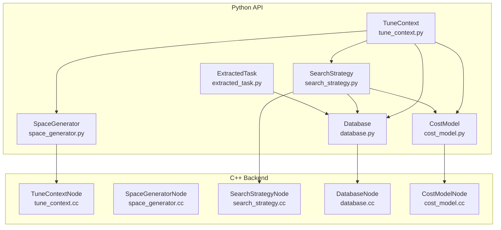
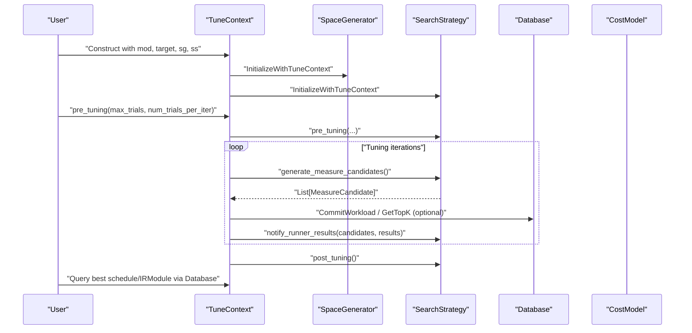
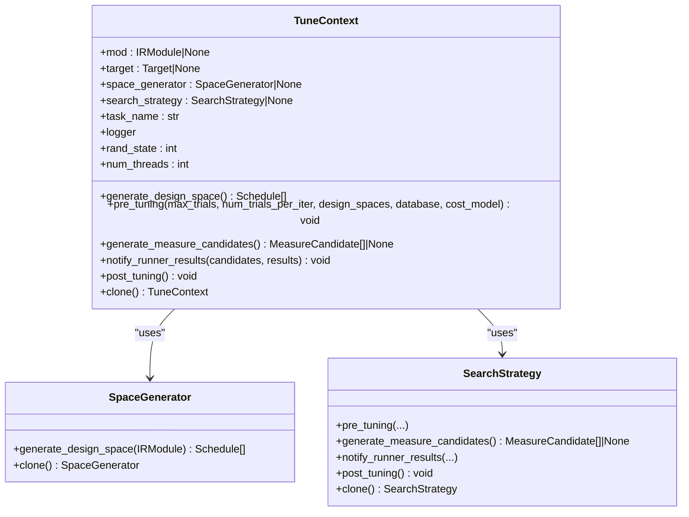
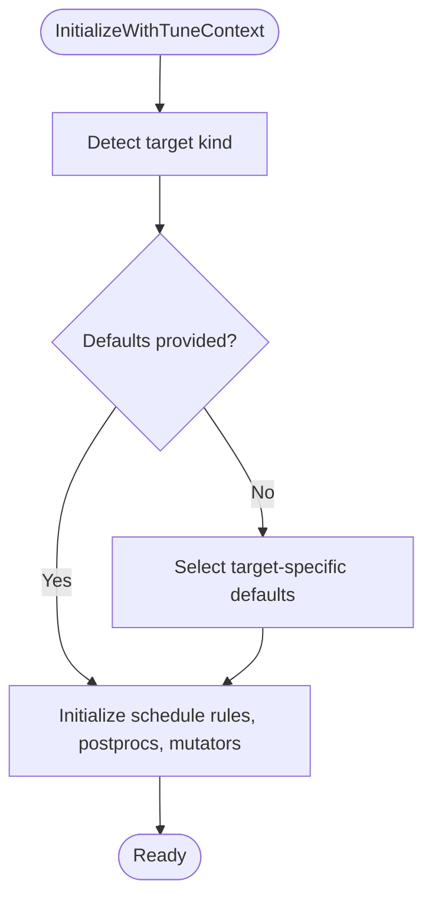
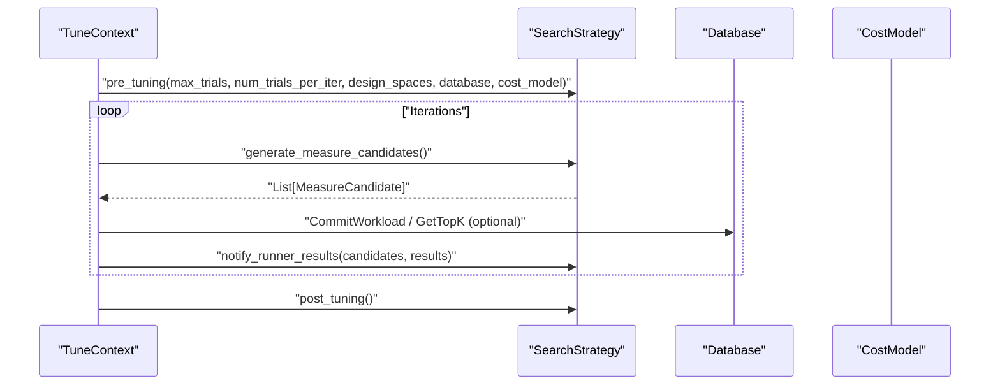
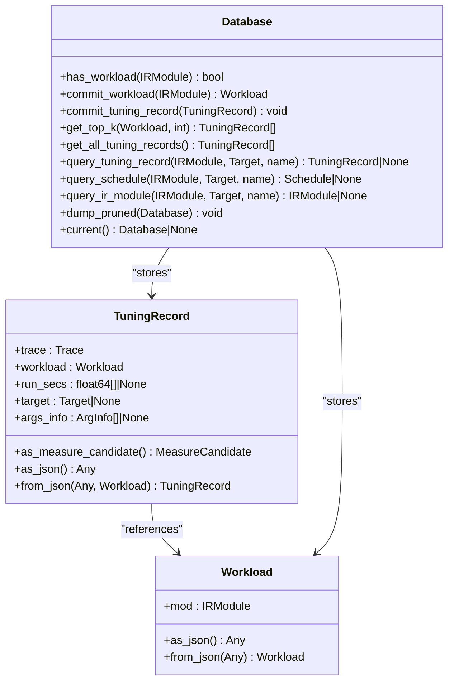
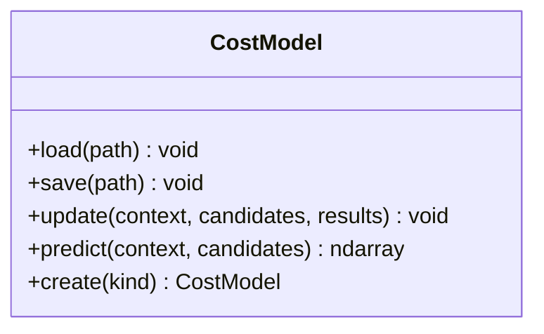
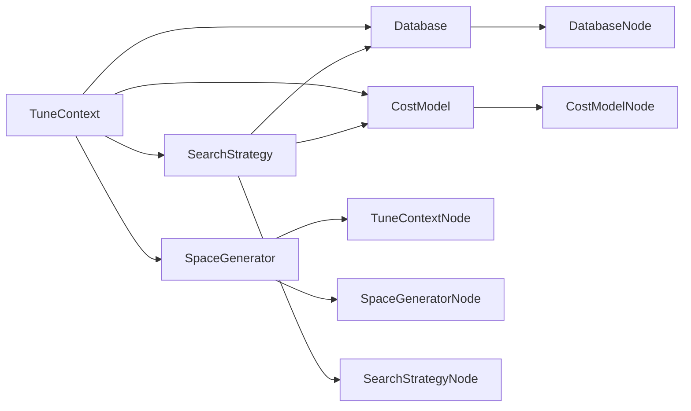

# Tuning Process and Workflow

<cite>
**Referenced Files in This Document**
- [tune_context.py](file://python/tvm/s_tir/meta_schedule/tune_context.py)
- [tune_context.cc](file://src/s_tir/meta_schedule/tune_context.cc)
- [extracted_task.py](file://python/tvm/s_tir/meta_schedule/extracted_task.py)
- [space_generator.py](file://python/tvm/s_tir/meta_schedule/space_generator/space_generator.py)
- [space_generator.cc](file://src/s_tir/meta_schedule/space_generator/space_generator.cc)
- [search_strategy.py](file://python/tvm/s_tir/meta_schedule/search_strategy/search_strategy.py)
- [search_strategy.cc](file://src/s_tir/meta_schedule/search_strategy/search_strategy.cc)
- [database.py](file://python/tvm/s_tir/meta_schedule/database/database.py)
- [database.cc](file://src/s_tir/meta_schedule/database/database.cc)
- [cost_model.py](file://python/tvm/s_tir/meta_schedule/cost_model/cost_model.py)
- [cost_model.cc](file://src/s_tir/meta_schedule/cost_model/cost_model.cc)
</cite>

## Table of Contents
1. [Introduction](#introduction)
2. [Project Structure](#project-structure)
3. [Core Components](#core-components)
4. [Architecture Overview](#architecture-overview)
5. [Detailed Component Analysis](#detailed-component-analysis)
6. [Dependency Analysis](#dependency-analysis)
7. [Performance Considerations](#performance-considerations)
8. [Troubleshooting Guide](#troubleshooting-guide)
9. [Conclusion](#conclusion)

## Introduction
This document explains the end-to-end meta-scheduling tuning pipeline in TVM’s S-TIR meta-scheduler. It covers how workloads are extracted and represented, how design spaces are generated, how search strategies produce measure candidates, how measurement results are ingested, and how the final optimized kernel is produced. It also documents the TuneContext class for managing optimization state, the tuning loop mechanics, candidate generation strategies, integration with TensorIR workloads, and the coordination among meta-scheduling components. Practical guidance is included for configuring tuning parameters, monitoring progress, handling failures, and optimizing performance and memory usage.

## Project Structure
The meta-scheduling subsystem is organized around several core Python modules backed by C++ implementations. The key areas include:
- TuneContext: orchestration and state for a tuning task
- SpaceGenerator: design space generation from IRModules
- SearchStrategy: candidate generation and feedback integration
- Database: persistence and retrieval of tuning records
- CostModel: optional predictive modeling of candidate quality
- ExtractedTask: structured representation of extracted tuning tasks

**Diagram sources**
- [tune_context.py:64-159](file://python/tvm/s_tir/meta_schedule/tune_context.py#L64-L159)
- [space_generator.py:46-100](file://python/tvm/s_tir/meta_schedule/space_generator/space_generator.py#L46-L100)
- [search_strategy.py:82-195](file://python/tvm/s_tir/meta_schedule/search_strategy/search_strategy.py#L82-L195)
- [database.py:168-248](file://python/tvm/s_tir/meta_schedule/database/database.py#L168-L248)
- [cost_model.py:42-109](file://python/tvm/s_tir/meta_schedule/cost_model/cost_model.py#L42-L109)
- [extracted_task.py:29-66](file://python/tvm/s_tir/meta_schedule/extracted_task.py#L29-L66)
- [tune_context.cc:29-86](file://src/s_tir/meta_schedule/tune_context.cc#L29-L86)
- [space_generator.cc:91-170](file://src/s_tir/meta_schedule/space_generator/space_generator.cc#L91-L170)
- [search_strategy.cc:34-110](file://src/s_tir/meta_schedule/search_strategy/search_strategy.cc#L34-L110)
- [database.cc:179-263](file://src/s_tir/meta_schedule/database/database.cc#L179-L263)
- [cost_model.cc:27-64](file://src/s_tir/meta_schedule/cost_model/cost_model.cc#L27-L64)

**Section sources**
- [tune_context.py:64-159](file://python/tvm/s_tir/meta_schedule/tune_context.py#L64-L159)
- [space_generator.py:46-100](file://python/tvm/s_tir/meta_schedule/space_generator/space_generator.py#L46-L100)
- [search_strategy.py:82-195](file://python/tvm/s_tir/meta_schedule/search_strategy/search_strategy.py#L82-L195)
- [database.py:168-248](file://python/tvm/s_tir/meta_schedule/database/database.py#L168-L248)
- [cost_model.py:42-109](file://python/tvm/s_tir/meta_schedule/cost_model/cost_model.py#L42-L109)
- [extracted_task.py:29-66](file://python/tvm/s_tir/meta_schedule/extracted_task.py#L29-L66)
- [tune_context.cc:29-86](file://src/s_tir/meta_schedule/tune_context.cc#L29-L86)
- [space_generator.cc:91-170](file://src/s_tir/meta_schedule/space_generator/space_generator.cc#L91-L170)
- [search_strategy.cc:34-110](file://src/s_tir/meta_schedule/search_strategy/search_strategy.cc#L34-L110)
- [database.cc:179-263](file://src/s_tir/meta_schedule/database/database.cc#L179-L263)
- [cost_model.cc:27-64](file://src/s_tir/meta_schedule/cost_model/cost_model.cc#L27-L64)

## Core Components
- TuneContext: encapsulates the workload IRModule, target, design space generator, search strategy, logging, and thread configuration. It exposes lifecycle hooks for generating design spaces, preparing for tuning, producing measure candidates, and receiving measurement results.
- SpaceGenerator: transforms an IRModule into a set of candidate Schedules according to configured schedule rules, postprocessors, and mutators. It can be created from built-in strategies or custom Python implementations.
- SearchStrategy: drives the search loop by generating batches of MeasureCandidate objects and updating internal state with RunnerResult feedback. It supports strategies such as evolutionary search, replay trace, and replay function.
- Database: persists Workload and TuningRecord entries, enabling retrieval of best schedules and IRModules, and supporting pruning and union databases.
- CostModel: optional model to predict candidate quality; supports loading, saving, updating with results, and prediction.
- ExtractedTask: a structured representation of a tunable task extracted from high-level IR, including dispatched variants and weights.

**Section sources**
- [tune_context.py:64-159](file://python/tvm/s_tir/meta_schedule/tune_context.py#L64-L159)
- [space_generator.py:46-100](file://python/tvm/s_tir/meta_schedule/space_generator/space_generator.py#L46-L100)
- [search_strategy.py:82-195](file://python/tvm/s_tir/meta_schedule/search_strategy/search_strategy.py#L82-L195)
- [database.py:168-248](file://python/tvm/s_tir/meta_schedule/database/database.py#L168-L248)
- [cost_model.py:42-109](file://python/tvm/s_tir/meta_schedule/cost_model/cost_model.py#L42-L109)
- [extracted_task.py:29-66](file://python/tvm/s_tir/meta_schedule/extracted_task.py#L29-L66)

## Architecture Overview
The tuning pipeline proceeds as follows:
1. Workload extraction: IRModule is normalized and optionally represented via ExtractedTask.
2. Design space generation: SpaceGenerator produces candidate Schedules from the IRModule.
3. Search strategy preparation: SearchStrategy initializes with design spaces, optional database and cost model.
4. Candidate generation: SearchStrategy emits MeasureCandidate batches for measurement.
5. Measurement and feedback: Runner executes candidates; SearchStrategy updates with RunnerResult.
6. Persistence and retrieval: Database stores TuningRecord entries; best outcomes retrieved via Workload queries.

**Diagram sources**
- [tune_context.py:180-284](file://python/tvm/s_tir/meta_schedule/tune_context.py#L180-L284)
- [space_generator.py:65-90](file://python/tvm/s_tir/meta_schedule/space_generator/space_generator.py#L65-L90)
- [search_strategy.py:109-195](file://python/tvm/s_tir/meta_schedule/search_strategy/search_strategy.py#L109-L195)
- [database.py:173-320](file://python/tvm/s_tir/meta_schedule/database/database.py#L173-L320)

## Detailed Component Analysis

### TuneContext: Managing Optimization State
TuneContext is the central coordinator for a tuning task. It:
- Normalizes input IRModule (accepts PrimFunc or IRModule)
- Initializes SpaceGenerator and SearchStrategy with target-specific defaults when not explicitly provided
- Provides lifecycle methods:
  - generate_design_space: delegates to SpaceGenerator
  - pre_tuning: prepares SearchStrategy with design spaces, optional database and cost model
  - generate_measure_candidates: delegates to SearchStrategy
  - notify_runner_results: feeds RunnerResult back to SearchStrategy
  - post_tuning: finalizes SearchStrategy
  - clone: creates a new TuneContext with cloned subcomponents

Key behaviors:
- Target-aware default selection for schedule rules, postprocessors, and mutators
- Random seed handling and thread count configuration
- Logging integration

**Diagram sources**
- [tune_context.py:64-159](file://python/tvm/s_tir/meta_schedule/tune_context.py#L64-L159)
- [space_generator.py:77-100](file://python/tvm/s_tir/meta_schedule/space_generator/space_generator.py#L77-L100)
- [search_strategy.py:121-195](file://python/tvm/s_tir/meta_schedule/search_strategy/search_strategy.py#L121-L195)

**Section sources**
- [tune_context.py:64-159](file://python/tvm/s_tir/meta_schedule/tune_context.py#L64-L159)
- [tune_context.cc:29-86](file://src/s_tir/meta_schedule/tune_context.cc#L29-L86)

### SpaceGenerator: Design Space Generation
SpaceGenerator transforms an IRModule into a collection of Schedules representing different scheduling decisions. It:
- Initializes with TuneContext to select target-specific defaults for schedule rules, postprocessors, and mutators
- Supports creation from:
  - Built-in strategies ("post-order-apply", "union")
  - Callable schedule functions
  - Python-customizable PySpaceGenerator

Target-specific defaults:
- CPU (LLVM): selects appropriate schedule rules and postprocessors
- CUDA: selects CUDA rules and tensor core rules when applicable
- Hexagon and others: target-specific defaults

**Diagram sources**
- [space_generator.cc:91-170](file://src/s_tir/meta_schedule/space_generator/space_generator.cc#L91-L170)
- [space_generator.py:103-132](file://python/tvm/s_tir/meta_schedule/space_generator/space_generator.py#L103-L132)

**Section sources**
- [space_generator.py:46-133](file://python/tvm/s_tir/meta_schedule/space_generator/space_generator.py#L46-L133)
- [space_generator.cc:91-170](file://src/s_tir/meta_schedule/space_generator/space_generator.cc#L91-L170)

### SearchStrategy: Candidate Generation and Feedback Loop
SearchStrategy manages the search loop:
- pre_tuning: sets up internal state, design spaces, and optional database/cost model
- generate_measure_candidates: produces a batch of MeasureCandidate objects
- notify_runner_results: updates internal state with RunnerResult
- post_tuning: final cleanup

Supported strategies:
- EvolutionarySearch: maintains population and evolves candidates
- ReplayTrace: replays previously recorded traces
- ReplayFunc: replays recorded functions

**Diagram sources**
- [search_strategy.py:121-195](file://python/tvm/s_tir/meta_schedule/search_strategy/search_strategy.py#L121-L195)
- [search_strategy.cc:40-66](file://src/s_tir/meta_schedule/search_strategy/search_strategy.cc#L40-L66)

**Section sources**
- [search_strategy.py:82-195](file://python/tvm/s_tir/meta_schedule/search_strategy/search_strategy.py#L82-L195)
- [search_strategy.cc:34-110](file://src/s_tir/meta_schedule/search_strategy/search_strategy.cc#L34-L110)

### Database: Workload and Tuning Record Management
Database persists and retrieves tuning outcomes:
- Workload: wraps an IRModule with structural hash
- TuningRecord: captures a trace, workload, run times, target, and argument info
- Methods:
  - CommitWorkload, CommitTuningRecord
  - GetTopK, GetAllTuningRecords
  - QuerySchedule, QueryIRModule, QueryTuningRecord
  - DumpPruned
  - Context manager helpers for thread-local scoping

**Diagram sources**
- [database.py:41-164](file://python/tvm/s_tir/meta_schedule/database/database.py#L41-L164)
- [database.py:168-364](file://python/tvm/s_tir/meta_schedule/database/database.py#L168-L364)
- [database.cc:30-177](file://src/s_tir/meta_schedule/database/database.cc#L30-L177)

**Section sources**
- [database.py:168-364](file://python/tvm/s_tir/meta_schedule/database/database.py#L168-L364)
- [database.cc:179-263](file://src/s_tir/meta_schedule/database/database.cc#L179-L263)

### CostModel: Predictive Quality Estimation
CostModel optionally predicts normalized scores for candidates:
- load/save: persist model
- update: incorporate RunnerResult feedback
- predict: return normalized scores

Supported kinds:
- "xgb", "mlp", "random", "none"

**Diagram sources**
- [cost_model.py:42-154](file://python/tvm/s_tir/meta_schedule/cost_model/cost_model.py#L42-L154)
- [cost_model.cc:27-64](file://src/s_tir/meta_schedule/cost_model/cost_model.cc#L27-L64)

**Section sources**
- [cost_model.py:42-154](file://python/tvm/s_tir/meta_schedule/cost_model/cost_model.py#L42-L154)
- [cost_model.cc:27-64](file://src/s_tir/meta_schedule/cost_model/cost_model.cc#L27-L64)

### ExtractedTask: Structured Task Representation
ExtractedTask represents a tunable task extracted from high-level IR:
- task_name: identifier
- mod: high-level IR
- target: target information
- dispatched: potential low-level IR dispatches
- weight: importance factor

It integrates with Database for persistence and retrieval of best kernels.

**Section sources**
- [extracted_task.py:29-66](file://python/tvm/s_tir/meta_schedule/extracted_task.py#L29-L66)

## Dependency Analysis
The meta-scheduler components are loosely coupled via FFI bridges and share common abstractions:
- TuneContext depends on SpaceGenerator and SearchStrategy
- SearchStrategy interacts with Database and optionally CostModel
- SpaceGenerator initializes with TuneContext to select target-specific defaults
- Database persists Workload and TuningRecord; TuningRecord can be converted to MeasureCandidate

**Diagram sources**
- [tune_context.py:64-159](file://python/tvm/s_tir/meta_schedule/tune_context.py#L64-L159)
- [space_generator.py:46-100](file://python/tvm/s_tir/meta_schedule/space_generator/space_generator.py#L46-L100)
- [search_strategy.py:82-195](file://python/tvm/s_tir/meta_schedule/search_strategy/search_strategy.py#L82-L195)
- [database.py:168-248](file://python/tvm/s_tir/meta_schedule/database/database.py#L168-L248)
- [cost_model.py:42-109](file://python/tvm/s_tir/meta_schedule/cost_model/cost_model.py#L42-L109)
- [tune_context.cc:29-86](file://src/s_tir/meta_schedule/tune_context.cc#L29-L86)
- [space_generator.cc:91-170](file://src/s_tir/meta_schedule/space_generator/space_generator.cc#L91-L170)
- [search_strategy.cc:34-110](file://src/s_tir/meta_schedule/search_strategy/search_strategy.cc#L34-L110)
- [database.cc:179-263](file://src/s_tir/meta_schedule/database/database.cc#L179-L263)
- [cost_model.cc:27-64](file://src/s_tir/meta_schedule/cost_model/cost_model.cc#L27-L64)

**Section sources**
- [tune_context.py:64-159](file://python/tvm/s_tir/meta_schedule/tune_context.py#L64-L159)
- [space_generator.py:46-100](file://python/tvm/s_tir/meta_schedule/space_generator/space_generator.py#L46-L100)
- [search_strategy.py:82-195](file://python/tvm/s_tir/meta_schedule/search_strategy/search_strategy.py#L82-L195)
- [database.py:168-248](file://python/tvm/s_tir/meta_schedule/database/database.py#L168-L248)
- [cost_model.py:42-109](file://python/tvm/s_tir/meta_schedule/cost_model/cost_model.py#L42-L109)
- [tune_context.cc:29-86](file://src/s_tir/meta_schedule/tune_context.cc#L29-L86)
- [space_generator.cc:91-170](file://src/s_tir/meta_schedule/space_generator/space_generator.cc#L91-L170)
- [search_strategy.cc:34-110](file://src/s_tir/meta_schedule/search_strategy/search_strategy.cc#L34-L110)
- [database.cc:179-263](file://src/s_tir/meta_schedule/database/database.cc#L179-L263)
- [cost_model.cc:27-64](file://src/s_tir/meta_schedule/cost_model/cost_model.cc#L27-L64)

## Performance Considerations
- Design space size: Larger design spaces increase candidate generation and measurement cost. Prefer targeted schedule rules and postprocessors for the specific target.
- Batch sizing: num_trials_per_iter controls measurement throughput; larger batches reduce overhead but increase memory footprint.
- Database pruning: Use DumpPruned to keep only the best records per workload, reducing storage and lookup costs.
- Cost model: Enabling a predictive model can reduce the number of measurements needed by prioritizing promising candidates.
- Threading: Configure num_threads appropriately; TuneContext supports physical/logical CPU counts and explicit integers.
- Memory usage: Persist intermediate artifacts and avoid retaining unnecessary copies of IRModules; leverage Database context managers to control scope.

[No sources needed since this section provides general guidance]

## Troubleshooting Guide
Common issues and remedies:
- Missing mod or target: TuneContext requires a valid IRModule and target; ensure both are provided during construction.
- Abstract strategy misuse: SearchStrategy cannot be instantiated directly; use SearchStrategy.create with a valid kind or a concrete subclass.
- Missing design spaces: SpaceGenerator must be provided; if omitted, TuneContext will fail when generating design spaces.
- Search finished: generate_measure_candidates may return None when the search completes; handle gracefully in the loop.
- Database contention: Use Database.current() context manager to ensure thread-local scoping and avoid race conditions.
- Cost model errors: Ensure the selected cost model kind matches available implementations and that update/predict signatures are correct.

**Section sources**
- [tune_context.py:180-284](file://python/tvm/s_tir/meta_schedule/tune_context.py#L180-L284)
- [search_strategy.py:94-107](file://python/tvm/s_tir/meta_schedule/search_strategy/search_strategy.py#L94-L107)
- [database.py:376-378](file://python/tvm/s_tir/meta_schedule/database/database.py#L376-L378)

## Conclusion
The meta-scheduling pipeline in TVM coordinates TuneContext, SpaceGenerator, SearchStrategy, Database, and CostModel to extract, explore, and optimize Schedules for TensorIR workloads. By leveraging target-aware defaults, structured candidate generation, and persistent tuning records, it enables efficient kernel optimization across diverse hardware targets. Proper configuration of tuning parameters, careful monitoring of progress, and robust error handling ensure reliable and performant tuning workflows.