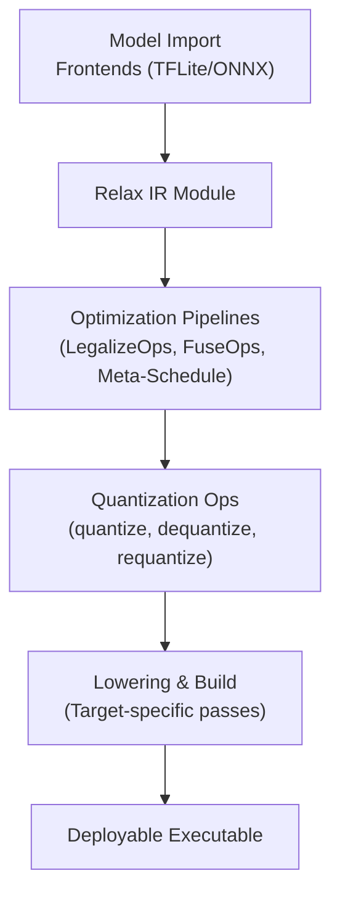
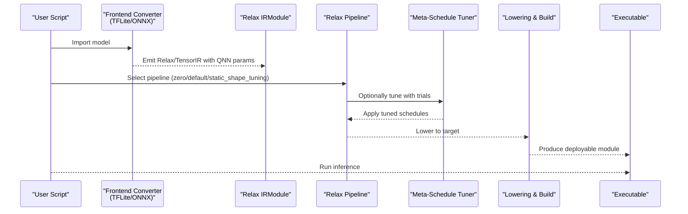
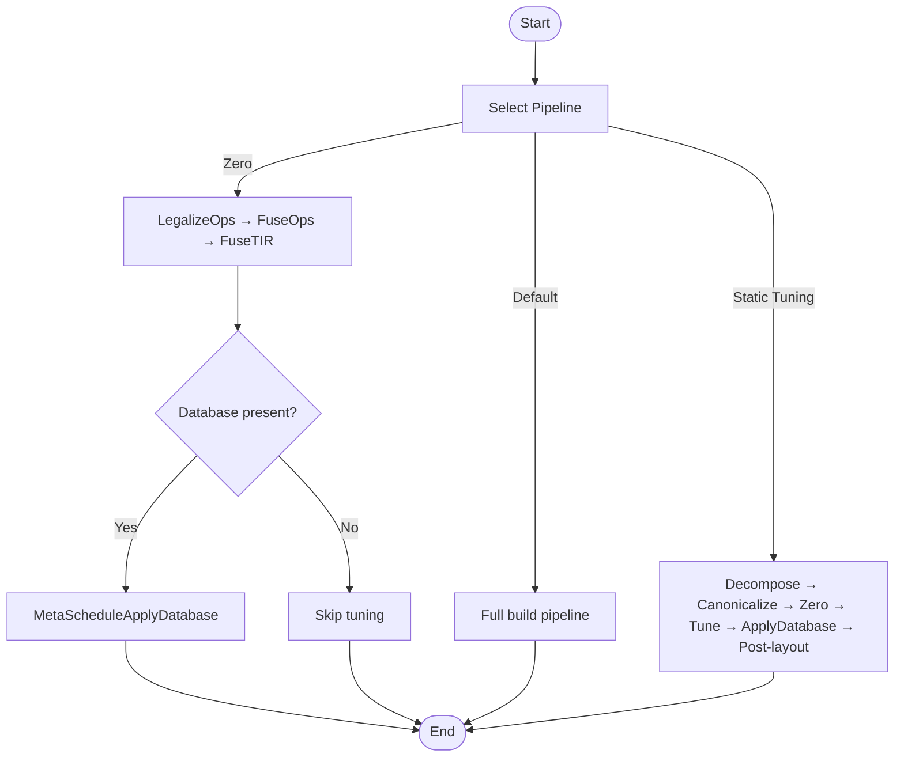
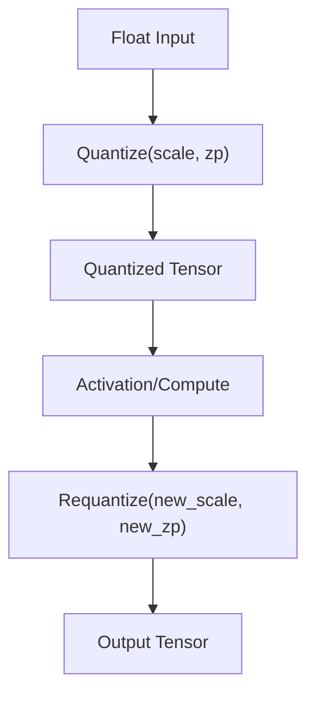
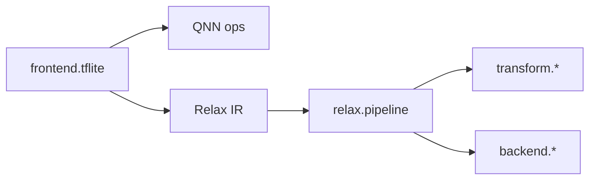

# Compression Workflows and Calibration

<cite>
**Referenced Files in This Document**
- [pipeline.py](file://python/tvm/relax/pipeline.py)
- [__init__.py](file://python/tvm/relax/__init__.py)
- [tflite_frontend.py](file://python/tvm/relax/frontend/tflite/tflite_frontend.py)
- [test_frontend_onnx.py](file://tests/python/relax/test_frontend_onnx.py)
- [hexagon_unary_ops.py](file://python/tvm/contrib/hexagon/hexagon_unary_ops.py)
- [optimize_llm.py](file://docs/how_to/tutorials/optimize_llm.py)
- [abstraction.rst](file://docs/deep_dive/relax/abstraction.rst)
</cite>

## Table of Contents
1. [Introduction](#introduction)
2. [Project Structure](#project-structure)
3. [Core Components](#core-components)
4. [Architecture Overview](#architecture-overview)
5. [Detailed Component Analysis](#detailed-component-analysis)
6. [Dependency Analysis](#dependency-analysis)
7. [Performance Considerations](#performance-considerations)
8. [Troubleshooting Guide](#troubleshooting-guide)
9. [Conclusion](#conclusion)
10. [Appendices](#appendices)

## Introduction
This document explains end-to-end model compression workflows and calibration procedures in TVM with a focus on quantization-aware modeling, calibration dataset handling, representative input preparation, and evaluation. It covers how TVM’s Relax IR and pipelines orchestrate compression, how quantization parameters are derived and propagated, and how to validate compression effectiveness. Practical guidance is provided for setting up compression pipelines, configuring calibration parameters, integrating with external calibration frameworks, batching for large-scale calibration, and ensuring reproducibility. Production deployment considerations for compressed models are also addressed.

## Project Structure
TVM organizes compression and calibration logic primarily within the Relax IR and frontend conversion layers:
- Relax pipelines define the optimization and lowering stages used during compression and deployment.
- Frontend converters handle quantized operator semantics and parameter propagation for frameworks such as TFLite and ONNX.
- Contrib utilities demonstrate quantization-related computations (e.g., lookup table generation for quantized unary ops).
- Documentation provides conceptual overviews of the overall compilation flow and composable transformations.

**Diagram sources**
- [pipeline.py:80-107](file://python/tvm/relax/pipeline.py#L80-L107)
- [tflite_frontend.py:559-578](file://python/tvm/relax/frontend/tflite/tflite_frontend.py#L559-L578)
- [optimize_llm.py:30-47](file://docs/how_to/tutorials/optimize_llm.py#L30-L47)

**Section sources**
- [__init__.py:94-96](file://python/tvm/relax/__init__.py#L94-L96)
- [pipeline.py:80-107](file://python/tvm/relax/pipeline.py#L80-L107)
- [optimize_llm.py:30-47](file://docs/how_to/tutorials/optimize_llm.py#L30-L47)

## Core Components
- Relax pipelines: Predefined and configurable pipelines that apply legalizations, constant folding, operator fusion, and optional meta-schedule tuning for inference-time performance.
- Quantization operators: Quantize, dequantize, and requantize operators propagate scale and zero-point parameters through the graph.
- Frontend converters: Convert quantized nodes from TFLite and ONNX, preserving QNN parameter semantics and handling axis-aware scales.
- Contrib utilities: Demonstrate quantized computation patterns (e.g., generating lookup tables for quantized unary ops).

Key pipeline entry points:
- Zero pipeline: Basic optimization and optional meta-schedule application.
- Default build pipeline: Full compilation pipeline for deployment.
- Static shape tuning pipeline: Optional meta-schedule tuning with controlled trial budgets.

**Section sources**
- [pipeline.py:33-77](file://python/tvm/relax/pipeline.py#L33-L77)
- [pipeline.py:80-107](file://python/tvm/relax/pipeline.py#L80-L107)
- [pipeline.py:110-209](file://python/tvm/relax/pipeline.py#L110-L209)
- [tflite_frontend.py:559-578](file://python/tvm/relax/frontend/tflite/tflite_frontend.py#L559-L578)
- [tflite_frontend.py:3220-3240](file://python/tvm/relax/frontend/tflite/tflite_frontend.py#L3220-L3240)

## Architecture Overview
The compression and calibration pipeline integrates model import, quantization-aware transformations, and deployment-ready lowering. The Relax IR captures both high-level Relax functions and low-level TensorIR programs, enabling composable optimizations and library dispatching.

**Diagram sources**
- [pipeline.py:110-209](file://python/tvm/relax/pipeline.py#L110-L209)
- [optimize_llm.py:30-47](file://docs/how_to/tutorials/optimize_llm.py#L30-L47)

## Detailed Component Analysis

### Relax Compression Pipelines
- Zero pipeline: Applies LegalizeOps, pattern annotation, constant folding, operator fusion, and optional meta-schedule application if a database is present.
- Default build pipeline: Adds backend dispatch, dataflow rewrites, static memory planning, CUDA graph rewrite, runtime builtin lowering, and VM shape lowering.
- Static shape tuning pipeline: Enables optional pre/post layout rewrites, runs meta-schedule tuning with a global trial budget, and applies tuned schedules.

**Diagram sources**
- [pipeline.py:33-77](file://python/tvm/relax/pipeline.py#L33-L77)
- [pipeline.py:80-107](file://python/tvm/relax/pipeline.py#L80-L107)
- [pipeline.py:110-209](file://python/tvm/relax/pipeline.py#L110-L209)

**Section sources**
- [pipeline.py:33-77](file://python/tvm/relax/pipeline.py#L33-L77)
- [pipeline.py:80-107](file://python/tvm/relax/pipeline.py#L80-L107)
- [pipeline.py:110-209](file://python/tvm/relax/pipeline.py#L110-L209)

### Quantization Operators and Parameter Propagation
- Quantize: Converts float inputs to quantized types using output scale and zero point.
- Dequantize: Recovers float values from quantized tensors using input scale and zero point.
- Requantize: Adjusts scale/zero point when composing quantized ops, ensuring consistent downstream quantization.

Frontend conversions:
- TFLite quantize/dequantize/requantize handling preserves QNN parameters and supports per-tensor and per-channel scales.
- ONNX QuantizeLinear behavior is validated across opsets, including singleton shapes and default axes.

**Diagram sources**
- [tflite_frontend.py:559-578](file://python/tvm/relax/frontend/tflite/tflite_frontend.py#L559-L578)
- [tflite_frontend.py:3220-3240](file://python/tvm/relax/frontend/tflite/tflite_frontend.py#L3220-L3240)
- [test_frontend_onnx.py:5602-5690](file://tests/python/relax/test_frontend_onnx.py#L5602-L5690)

**Section sources**
- [tflite_frontend.py:559-578](file://python/tvm/relax/frontend/tflite/tflite_frontend.py#L559-L578)
- [tflite_frontend.py:3220-3240](file://python/tvm/relax/frontend/tflite/tflite_frontend.py#L3220-L3240)
- [test_frontend_onnx.py:5602-5690](file://tests/python/relax/test_frontend_onnx.py#L5602-L5690)

### Calibration Procedures and Representative Inputs
Calibration in TVM is primarily parameter-driven via QNN scale and zero-point values supplied by frontends and maintained in Relax IR. To perform calibration:
- Prepare a representative dataset that covers the distribution of inputs the model sees in production.
- Feed batches through the model to collect statistics (e.g., activation ranges) used to compute scales and zero points.
- Configure quantization parameters in the frontend or upstream toolchain so that Relax IR carries accurate QNN parameters.
- Validate by comparing outputs against floating-point baselines on the same representative inputs.

Batching for large-scale calibration:
- Process inputs in mini-batches to reduce memory pressure while maintaining statistical accuracy.
- Aggregate per-channel statistics across batches to derive scales and zero points.

Integration with external calibration frameworks:
- Use external tools to compute scales/zeros and inject them into the model prior to importing into TVM.
- Ensure that singleton shapes and default axes are handled consistently with ONNX/TFLite semantics.

**Section sources**
- [test_frontend_onnx.py:5602-5690](file://tests/python/relax/test_frontend_onnx.py#L5602-L5690)
- [tflite_frontend.py:547-578](file://python/tvm/relax/frontend/tflite/tflite_frontend.py#L547-L578)

### Quality Assessment and Evaluation Metrics
- Functional parity: Compare quantized outputs with float baselines on representative inputs; use tolerance thresholds appropriate to the model/task.
- Accuracy drop: Track top-1/top-5 accuracy for classification, mAP for detection, or task-specific metrics.
- Latency and footprint: Measure inference latency and memory usage to assess compression benefits.

Validation workflow:
- Run the quantized model on a held-out calibration dataset.
- Compute metrics and report differences from float baseline.

[No sources needed since this section provides general guidance]

### Outlier Detection and Robust Parameter Selection
- Outlier detection: Monitor activation distributions for extreme tails; adjust clipping bounds or use narrower ranges to avoid saturation.
- Parameter selection: Prefer per-channel quantization for layers with wide dynamic ranges; tune zero points to minimize representational error.
- Iterative refinement: Re-calibrate with trimmed datasets to mitigate outliers’ impact.

[No sources needed since this section provides general guidance]

### Automated Optimization Strategies
- Meta-schedule tuning: Use the static shape tuning pipeline to automatically discover efficient schedules for quantized models.
- Layout transformations: Enable CPU weight prepacking when beneficial for CPU targets, noting the deployment interface change it implies.
- Pass orchestration: Combine LegalizeOps, FuseOps, and FuseTIR to simplify quantized graphs before lowering.

**Section sources**
- [pipeline.py:110-209](file://python/tvm/relax/pipeline.py#L110-L209)

### Production Deployment Considerations
- Target-specific lowering: Ensure backend dispatch and finalization passes match the target device.
- Parameter layout: If using CPU weight prepacking, transform parameters post-tuning and update deployment interfaces accordingly.
- Reproducibility: Pin pipeline choices, tuning budgets, and target configurations to guarantee repeatable builds.

**Section sources**
- [pipeline.py:110-209](file://python/tvm/relax/pipeline.py#L110-L209)

## Dependency Analysis
Relax pipelines depend on transform and backend modules to legalize, fuse, and lower IR. Quantization operators are provided by QNN frontends and propagated by converters.

**Diagram sources**
- [pipeline.py:29-31](file://python/tvm/relax/pipeline.py#L29-L31)
- [tflite_frontend.py:559-578](file://python/tvm/relax/frontend/tflite/tflite_frontend.py#L559-L578)

**Section sources**
- [pipeline.py:29-31](file://python/tvm/relax/pipeline.py#L29-L31)
- [tflite_frontend.py:559-578](file://python/tvm/relax/frontend/tflite/tflite_frontend.py#L559-L578)

## Performance Considerations
- Prefer per-channel quantization for layers with heterogeneous activation distributions.
- Use meta-schedule tuning to discover efficient layouts and kernels for quantized models.
- On CPU, consider enabling weight prepacking for improved performance, understanding the deployment interface implications.

[No sources needed since this section provides general guidance]

## Troubleshooting Guide
Common issues and remedies:
- Scale/zero-point mismatches: Verify that QNN parameters are consistent across adjacent quantized ops; use helper checks to compare scales/zeros.
- Singleton vs. broadcast scales: Ensure single-element scales are treated as scalar in opsets that require it.
- Default axis behavior: Confirm default axis semantics for per-channel quantization align with expectations.

**Section sources**
- [tflite_frontend.py:547-578](file://python/tvm/relax/frontend/tflite/tflite_frontend.py#L547-L578)
- [test_frontend_onnx.py:5602-5690](file://tests/python/relax/test_frontend_onnx.py#L5602-L5690)

## Conclusion
TVM’s Relax IR and pipelines provide a robust foundation for end-to-end model compression and calibration. By leveraging quantization operators, frontend converters, and configurable pipelines, practitioners can construct reproducible, optimized workflows that integrate with external calibration systems and scale to production deployments. Proper parameter selection, quality assessment, and automated optimization strategies ensure high fidelity and performance for compressed models.

[No sources needed since this section summarizes without analyzing specific files]

## Appendices

### Practical Setup Examples
- Select a pipeline: Use the zero or default build pipeline for basic compression, or the static shape tuning pipeline for performance optimization.
- Configure calibration: Supply QNN scales and zero points via the frontend or upstream toolchain; validate with representative inputs.
- Evaluate compression: Compare quantized outputs to float baselines and track task-specific metrics.

**Section sources**
- [pipeline.py:221-241](file://python/tvm/relax/pipeline.py#L221-L241)
- [optimize_llm.py:30-47](file://docs/how_to/tutorials/optimize_llm.py#L30-L47)

### Conceptual Overview
The Relax abstraction emphasizes composable transformations, enabling selective optimization and partial lowering for quantized models.

**Section sources**
- [abstraction.rst:67-73](file://docs/deep_dive/relax/abstraction.rst#L67-L73)