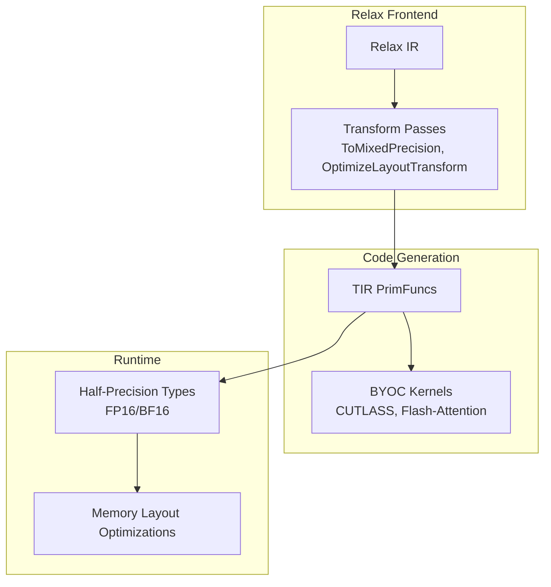
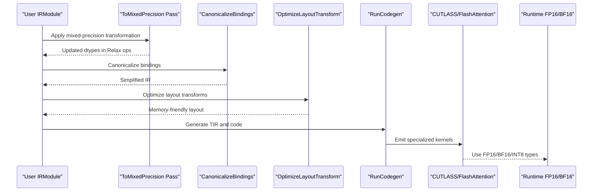
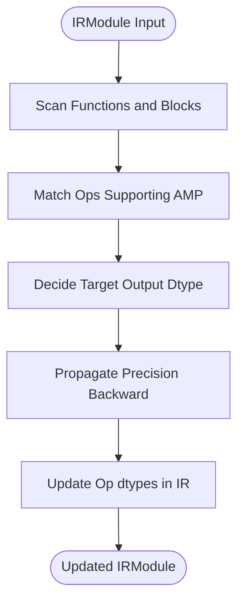
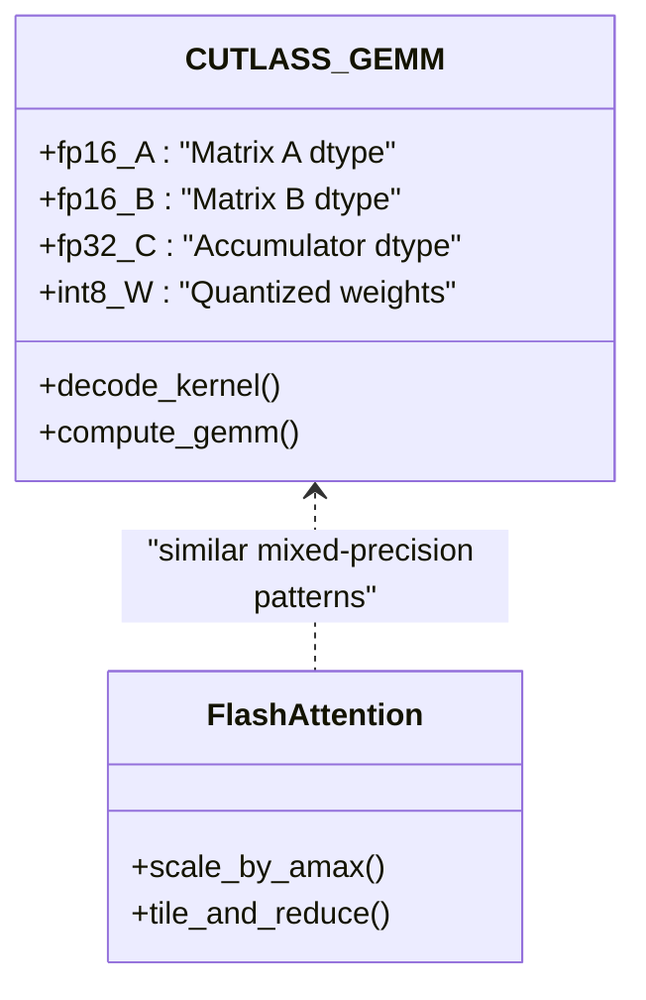
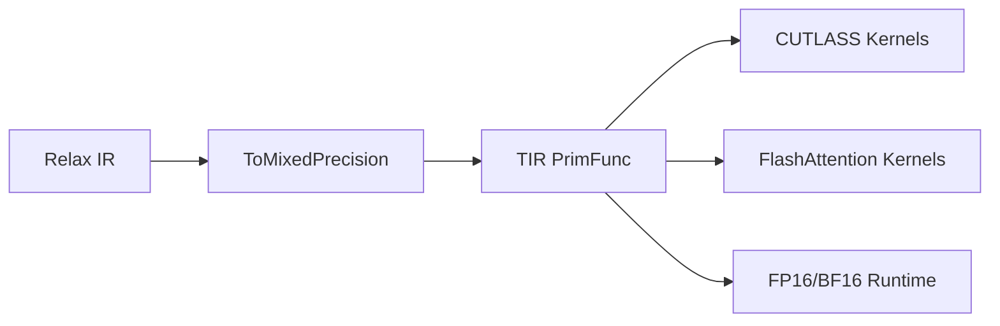

# Mixed-Precision Computation

<cite>
**Referenced Files in This Document**
- [to_mixed_precision.cc](file://src/relax/transform/to_mixed_precision.cc)
- [test_transform_to_mixed_precision.py](file://tests/python/relax/test_transform_to_mixed_precision.py)
- [codegen_cutlass.py](file://tests/python/relax/test_codegen_cutlass.py)
- [gemm.cu](file://3rdparty/cutlass_fpA_intB_gemm/cutlass/tools/library/src/reference/gemm.cu)
- [static_switch.h](file://3rdparty/libflash_attn/src/static_switch.h)
- [tflite_frontend.py](file://python/tvm/relax/frontend/tflite/tflite_frontend.py)
- [transform.py](file://python/tvm/relax/transform/transform.py)
- [builtin_fp16.h](file://include/tvm/runtime/builtin_fp16.h)
- [builtin_fp16.cc](file://src/runtime/builtin_fp16.cc)
- [fp8_amax.py](file://tests/python/relax/test_group_gemm_flashinfer.py)
</cite>

## Table of Contents
1. [Introduction](#introduction)
2. [Project Structure](#project-structure)
3. [Core Components](#core-components)
4. [Architecture Overview](#architecture-overview)
5. [Detailed Component Analysis](#detailed-component-analysis)
6. [Dependency Analysis](#dependency-analysis)
7. [Performance Considerations](#performance-considerations)
8. [Troubleshooting Guide](#troubleshooting-guide)
9. [Conclusion](#conclusion)
10. [Appendices](#appendices)

## Introduction
This document explains TVM’s mixed-precision computation capabilities with a focus on automatic mixed precision (AMP) detection, precision selection strategies, dynamic precision switching during inference, and the end-to-end pipeline from Relax IR to optimized code generation. It covers supported precisions (FP32, FP16, BF16, INT8), transformation passes, precision assignment heuristics, memory layout optimizations, and deployment considerations. Practical guidance is included for configuring schedules, implementing custom precision policies, and preserving numerical accuracy while reducing compute and memory costs.

## Project Structure
TVM’s mixed-precision stack spans the Relax frontend, transformation passes, TIR code generation, and third-party libraries for specialized kernels. The most relevant areas for mixed precision are:
- Relax transformations for AMP and precision promotion
- CUTLASS and CUTLASS-compatible kernels for FP16/BF16/INT8 GEMMs
- Runtime support for half-precision types
- Frontend integrations for quantized operators

[No sources needed since this diagram shows conceptual workflow, not actual code structure]

## Core Components
- Automatic Mixed Precision (AMP) detection and transformation: The ToMixedPrecision pass transforms Relax IR to use reduced-precision computations where safe, guided by operator semantics and numerical stability heuristics.
- Precision selection strategies: The pass selects output dtypes for key ops (e.g., matmul, conv) and propagates precision backward to inputs, with configurable output dtype.
- Dynamic precision switching: Through Relax’s structural typing and match-casts, precision can be adjusted per branch or per invocation.
- Mixed-precision transformation passes: The pass integrates with layout transforms and memory planning to minimize overhead.
- Hardware-specific kernels: CUTLASS-based kernels support FP16/BF16/INT8 GEMMs and interleaved layouts; FlashAttention supports FP8-style scaling.
- Runtime support: Built-in FP16/BF16 types and conversions are available in the runtime.

**Section sources**
- [to_mixed_precision.cc](file://src/relax/transform/to_mixed_precision.cc)
- [test_transform_to_mixed_precision.py](file://tests/python/relax/test_transform_to_mixed_precision.py)
- [transform.py](file://python/tvm/relax/transform/transform.py)

## Architecture Overview
The mixed-precision pipeline begins with a Relax IR module. The ToMixedPrecision pass annotates ops with target dtypes, followed by canonicalization and layout/memory optimizations. Code generation lowers to TIR and invokes BYOC kernels (e.g., CUTLASS) for high-performance mixed-precision GEMMs. Runtime types and conversions ensure correctness across precision boundaries.

**Diagram sources**
- [to_mixed_precision.cc](file://src/relax/transform/to_mixed_precision.cc)
- [transform.py](file://python/tvm/relax/transform/transform.py)
- [codegen_cutlass.py](file://tests/python/relax/test_codegen_cutlass.py)

## Detailed Component Analysis

### ToMixedPrecision Transformation Pass
The pass analyzes Relax IR to determine safe precision reductions. It targets ops that can tolerate lower precision without significant accuracy loss and adjusts output dtypes accordingly. The pass supports a configurable output dtype for global control.

Key behaviors:
- Operator-aware dtype propagation: MatMul, Convolution, and activation ops are considered for precision reduction.
- Numerical stability heuristics: Accumulation dtypes are preserved or elevated where necessary (e.g., FP32 accumulation for FP16 inputs).
- Structural equality tests: The pass is validated against expected IR shapes and dtypes.

**Diagram sources**
- [to_mixed_precision.cc](file://src/relax/transform/to_mixed_precision.cc)
- [test_transform_to_mixed_precision.py](file://tests/python/relax/test_transform_to_mixed_precision.py)

**Section sources**
- [to_mixed_precision.cc](file://src/relax/transform/to_mixed_precision.cc)
- [test_transform_to_mixed_precision.py](file://tests/python/relax/test_transform_to_mixed_precision.py)

### Relax Frontend Support for Mixed-Precision Annotations
Relax IR supports explicit dtype annotations on ops and structural typing. This enables:
- Out-dtype specification for ops like matmul to force accumulation or output precision.
- Shape and dtype inference that respects mixed-precision choices.
- Frontend quantization ops (e.g., FakeQuant) that map to Relax constructs with proper scaling and rounding.

Examples of frontend constructs:
- Quantized operator conversion with scale/zero-point handling.
- Dtype-preserving transformations for activations and nonlinearities.

**Section sources**
- [tflite_frontend.py](file://python/tvm/relax/frontend/tflite/tflite_frontend.py)

### Arithmetic Analysis and Numerical Stability
Mixed-precision introduces risks around overflow, underflow, and loss of precision. TVM mitigates these via:
- Accumulation dtype selection: Prefer higher precision for intermediate sums.
- Activation and normalization ops: Often kept at FP32 to preserve stability.
- Validation via structural equality tests ensuring dtype correctness after transformations.

Practical guidance:
- Keep normalization and softmax in higher precision.
- Use FP32 accumulation for FP16 inputs in GEMMs.
- Validate with representative inputs to catch regressions.

**Section sources**
- [test_transform_to_mixed_precision.py](file://tests/python/relax/test_transform_to_mixed_precision.py)

### Code Generation for Precision-Optimized Kernels
TVM lowers Relax/TIR to platform-specific kernels. For mixed precision:
- CUTLASS-based kernels support FP16/BF16/INT8 GEMMs with interleaved layouts and fast epilogues.
- Specialized decoding logic for quantized weights (e.g., per-channel scales).
- FlashAttention-style scaling for FP8-like amax-based scaling.

**Diagram sources**
- [codegen_cutlass.py](file://tests/python/relax/test_codegen_cutlass.py)
- [gemm.cu](file://3rdparty/cutlass_fpA_intB_gemm/cutlass/tools/library/src/reference/gemm.cu)
- [fp8_amax.py](file://tests/python/relax/test_group_gemm_flashinfer.py)

**Section sources**
- [codegen_cutlass.py](file://tests/python/relax/test_codegen_cutlass.py)
- [gemm.cu](file://3rdparty/cutlass_fpA_intB_gemm/cutlass/tools/library/src/reference/gemm.cu)
- [static_switch.h](file://3rdparty/libflash_attn/src/static_switch.h)
- [fp8_amax.py](file://tests/python/relax/test_group_gemm_flashinfer.py)

### Memory Layout Optimizations
Mixed precision reduces memory bandwidth and storage. TVM integrates:
- Layout transforms to align tensors for vectorized loads/stores.
- Static memory planning to reuse buffers and reduce peak memory.
- Quantization-aware decoding to avoid storing unpacked full-precision weights.

Best practices:
- Prefer NHWC layouts for convolutions on accelerators where supported.
- Use interleaved quantized layouts to improve cache locality.
- Plan memory with upper bounds on symbolic shapes to stabilize planning.

**Section sources**
- [transform.py](file://python/tvm/relax/transform/transform.py)

### Runtime Half-Precision Support
TVM provides built-in support for FP16/BF16 types and conversions:
- Header and implementation define FP16/BF16 runtime primitives.
- These are used by generated kernels and Relax lowering.

**Section sources**
- [builtin_fp16.h](file://include/tvm/runtime/builtin_fp16.h)
- [builtin_fp16.cc](file://src/runtime/builtin_fp16.cc)

## Dependency Analysis
The mixed-precision pipeline depends on:
- Relax transformation infrastructure for IR rewriting.
- TIR code generation and BYOC backends for kernel emission.
- Third-party libraries for specialized kernels (CUTLASS, FlashAttention).
- Runtime type system for half-precision arithmetic.

**Diagram sources**
- [to_mixed_precision.cc](file://src/relax/transform/to_mixed_precision.cc)
- [transform.py](file://python/tvm/relax/transform/transform.py)
- [codegen_cutlass.py](file://tests/python/relax/test_codegen_cutlass.py)

**Section sources**
- [to_mixed_precision.cc](file://src/relax/transform/to_mixed_precision.cc)
- [transform.py](file://python/tvm/relax/transform/transform.py)

## Performance Considerations
- Choose FP16/BF16 for compute-bound layers (GEMMs, convolutions) with FP32 accumulation.
- Keep normalization ops at FP32 to avoid numerical drift.
- Use quantized INT8 GEMMs with per-channel scales for static quantization.
- Leverage interleaved layouts and vectorized loads to maximize throughput.
- Profile on target hardware to balance precision reduction with accuracy.

[No sources needed since this section provides general guidance]

## Troubleshooting Guide
Common issues and remedies:
- Accuracy drops after AMP: Re-check accumulation dtypes and normalize ops; increase precision selectively.
- Kernel mismatches: Verify CUTLASS/FlashAttention configurations and dtype combinations.
- Memory spikes: Enable static memory planning and layout transforms; reduce dynamic shapes.
- Quantization artifacts: Confirm scale/zero-point calculations and rounding modes in frontends.

Validation tips:
- Use structural equality assertions to compare transformed IR with expected outputs.
- Test with representative datasets and batch sizes.

**Section sources**
- [test_transform_to_mixed_precision.py](file://tests/python/relax/test_transform_to_mixed_precision.py)
- [tflite_frontend.py](file://python/tvm/relax/frontend/tflite/tflite_frontend.py)

## Conclusion
TVM’s mixed-precision stack combines IR transformations, numerical stability heuristics, and high-performance code generation to deliver efficient inference with reduced memory and compute costs. By leveraging AMP detection, precision selection strategies, and hardware-specific kernels, developers can achieve significant speedups while maintaining accuracy. Proper configuration, validation, and deployment practices ensure robust results across diverse hardware platforms.

[No sources needed since this section summarizes without analyzing specific files]

## Appendices

### Supported Precision Combinations and Optimal Use Cases
- FP32: Recommended for numerically sensitive ops (normalization, softmax), accumulation in GEMMs.
- FP16/BF16: Suitable for most compute-bound layers (matmul, conv) with FP32 accumulation.
- INT8: Ideal for static quantization of activations/weights with per-channel scales.
- FP8-like scaling: Useful for KV-cache and attention scaling with amax-based normalization.

**Section sources**
- [gemm.cu](file://3rdparty/cutlass_fpA_intB_gemm/cutlass/tools/library/src/reference/gemm.cu)
- [fp8_amax.py](file://tests/python/relax/test_group_gemm_flashinfer.py)

### Practical Configuration Examples
- Configure ToMixedPrecision with a global output dtype for broad precision reduction.
- Combine with layout transforms and static memory planning for memory efficiency.
- Validate transformations using structural equality tests.

**Section sources**
- [test_transform_to_mixed_precision.py](file://tests/python/relax/test_transform_to_mixed_precision.py)
- [transform.py](file://python/tvm/relax/transform/transform.py)