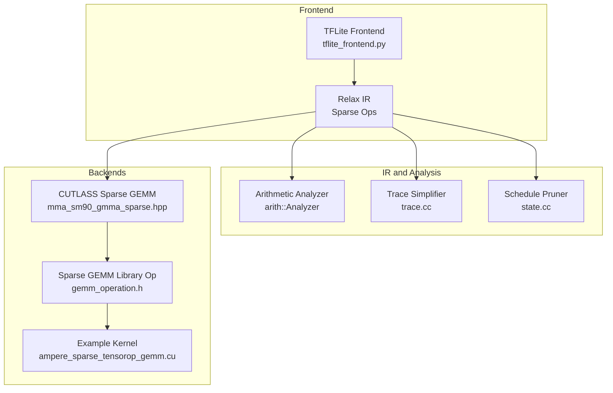
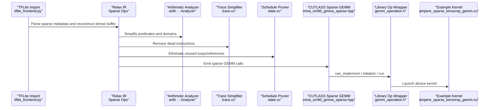
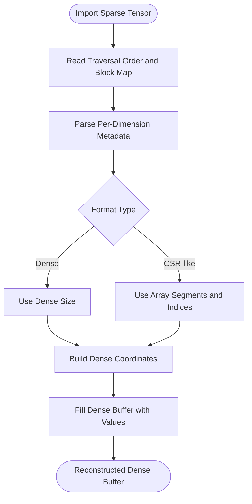
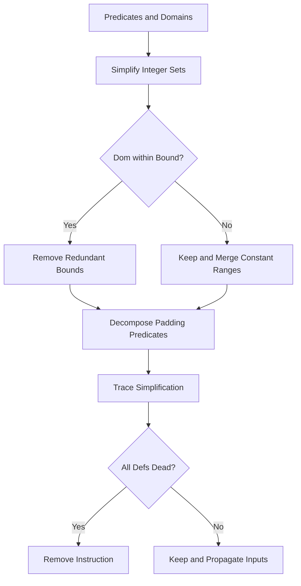
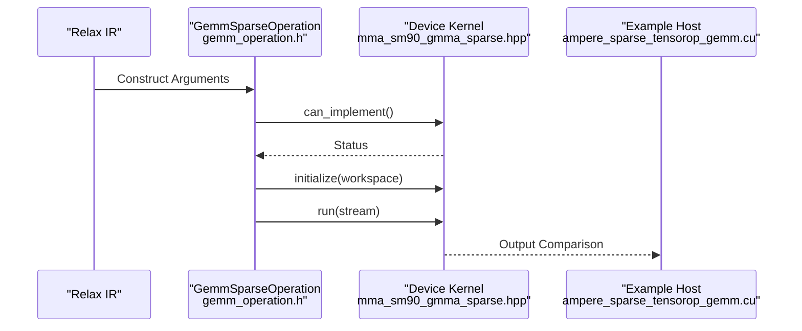
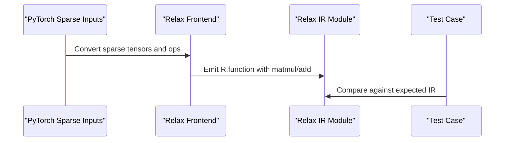
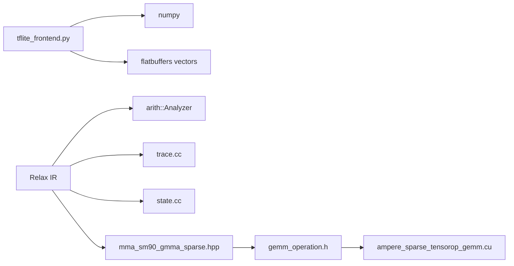

# Model Pruning and Sparsity

<cite>
**Referenced Files in This Document**
- [tflite_frontend.py](file://python/tvm/relax/frontend/tflite/tflite_frontend.py)
- [test_frontend_from_exported_program.py](file://tests/python/relax/test_frontend_from_exported_program.py)
- [mma_sm90_gmma_sparse.hpp](file://3rdparty/cutlass/include/cute/arch/mma_sm90_gmma_sparse.hpp)
- [gemm_operation.h](file://3rdparty/cutlass_fpA_intB_gemm/cutlass/tools/library/src/gemm_operation.h)
- [ampere_sparse_tensorop_gemm.cu](file://3rdparty/cutlass/examples/15_ampere_sparse_tensorop_gemm/ampere_sparse_tensorop_gemm.cu)
- [state.cc](file://src/s_tir/schedule/state.cc)
- [trace.cc](file://src/s_tir/schedule/trace.cc)
- [decompose_padding.cc](file://src/s_tir/schedule/primitive/decompose_padding.cc)
</cite>

## Table of Contents
1. [Introduction](#introduction)
2. [Project Structure](#project-structure)
3. [Core Components](#core-components)
4. [Architecture Overview](#architecture-overview)
5. [Detailed Component Analysis](#detailed-component-analysis)
6. [Dependency Analysis](#dependency-analysis)
7. [Performance Considerations](#performance-considerations)
8. [Troubleshooting Guide](#troubleshooting-guide)
9. [Conclusion](#conclusion)
10. [Appendices](#appendices)

## Introduction
This document explains TVM’s model pruning and sparsity optimization capabilities across the stack. It covers structured and unstructured pruning concepts, sparsity pattern detection and representation, magnitude-based pruning, integration with sparse tensor representations and sparse matrix operations, and specialized sparse kernels. It also documents pruning workflow automation, sensitivity analysis for threshold selection, iterative pruning strategies, and end-to-end deployment considerations. Practical examples show how to configure sparsity patterns and optimize sparse models for inference, including Relax frontend support for sparse operations, arithmetic analysis for sparsity correctness, and code generation for sparse compute kernels.

## Project Structure
TVM’s sparsity-related functionality spans:
- Frontend support for importing sparse tensors and operations (Relax TFLite frontend)
- Sparse tensor IR and arithmetic analysis for correctness
- Schedule primitives for dead-code elimination and predicate simplification
- Backend integration via CUTLASS sparse GEMM kernels for hardware acceleration

**Diagram sources**
- [tflite_frontend.py:3866-3974](file://python/tvm/relax/frontend/tflite/tflite_frontend.py#L3866-L3974)
- [mma_sm90_gmma_sparse.hpp:41-800](file://3rdparty/cutlass/include/cute/arch/mma_sm90_gmma_sparse.hpp#L41-L800)
- [gemm_operation.h:337-517](file://3rdparty/cutlass_fpA_intB_gemm/cutlass/tools/library/src/gemm_operation.h#L337-L517)
- [ampere_sparse_tensorop_gemm.cu:131-281](file://3rdparty/cutlass/examples/15_ampere_sparse_tensorop_gemm/ampere_sparse_tensorop_gemm.cu#L131-L281)
- [trace.cc:473-523](file://src/s_tir/schedule/trace.cc#L473-L523)
- [state.cc:540-565](file://src/s_tir/schedule/state.cc#L540-L565)

**Section sources**
- [tflite_frontend.py:3866-3974](file://python/tvm/relax/frontend/tflite/tflite_frontend.py#L3866-L3974)
- [mma_sm90_gmma_sparse.hpp:41-800](file://3rdparty/cutlass/include/cute/arch/mma_sm90_gmma_sparse.hpp#L41-L800)
- [gemm_operation.h:337-517](file://3rdparty/cutlass_fpA_intB_gemm/cutlass/tools/library/src/gemm_operation.h#L337-L517)
- [ampere_sparse_tensorop_gemm.cu:131-281](file://3rdparty/cutlass/examples/15_ampere_sparse_tensorop_gemm/ampere_sparse_tensorop_gemm.cu#L131-L281)
- [trace.cc:473-523](file://src/s_tir/schedule/trace.cc#L473-L523)
- [state.cc:540-565](file://src/s_tir/schedule/state.cc#L540-L565)

## Core Components
- Structured sparsity import and reconstruction:
  - TFLite sparse tensor metadata (dense sizes, CSR-like segments, indices) are parsed and reconstructed into dense buffers for compatibility with downstream passes.
  - Traversal order and block maps are used to map compressed indices to dense coordinates.

- Sparse arithmetic and correctness:
  - Arithmetic analyzer and integer set utilities simplify predicates and domains, enabling safe dead-code elimination and padding decomposition.
  - Trace simplification removes dead instructions and decisions, reducing overhead in sparse schedules.

- Sparse kernel integration:
  - CUTLASS provides structured sparse GEMM PTX templates and device APIs for SM90+ architectures.
  - A library wrapper exposes can_implement, workspace sizing, initialization, and kernel launch for sparse GEMMs.

- Relax frontend support:
  - Sparse-aware ops and patterns are represented in Relax IR and tested via frontend conversion tests.

**Section sources**
- [tflite_frontend.py:3866-3974](file://python/tvm/relax/frontend/tflite/tflite_frontend.py#L3866-L3974)
- [trace.cc:473-523](file://src/s_tir/schedule/trace.cc#L473-L523)
- [state.cc:540-565](file://src/s_tir/schedule/state.cc#L540-L565)
- [mma_sm90_gmma_sparse.hpp:41-800](file://3rdparty/cutlass/include/cute/arch/mma_sm90_gmma_sparse.hpp#L41-L800)
- [gemm_operation.h:337-517](file://3rdparty/cutlass_fpA_intB_gemm/cutlass/tools/library/src/gemm_operation.h#L337-L517)
- [test_frontend_from_exported_program.py:2100-2120](file://tests/python/relax/test_frontend_from_exported_program.py#L2100-L2120)

## Architecture Overview
The pruning and sparsity pipeline integrates import, IR-level analysis, scheduling, and backend kernel execution:

**Diagram sources**
- [tflite_frontend.py:3866-3974](file://python/tvm/relax/frontend/tflite/tflite_frontend.py#L3866-L3974)
- [trace.cc:473-523](file://src/s_tir/schedule/trace.cc#L473-L523)
- [state.cc:540-565](file://src/s_tir/schedule/state.cc#L540-L565)
- [mma_sm90_gmma_sparse.hpp:41-800](file://3rdparty/cutlass/include/cute/arch/mma_sm90_gmma_sparse.hpp#L41-L800)
- [gemm_operation.h:337-517](file://3rdparty/cutlass_fpA_intB_gemm/cutlass/tools/library/src/gemm_operation.h#L337-L517)
- [ampere_sparse_tensorop_gemm.cu:131-281](file://3rdparty/cutlass/examples/15_ampere_sparse_tensorop_gemm/ampere_sparse_tensorop_gemm.cu#L131-L281)

## Detailed Component Analysis

### Structured Sparsity Import and Reconstruction
Structured sparsity encodes non-zero locations via metadata per dimension. The importer:
- Reads traversal order and block maps
- Interprets dimension metadata as dense sizes or CSR-like segments and indices
- Recovers dense coordinates and fills the dense buffer accordingly

**Diagram sources**
- [tflite_frontend.py:3866-3974](file://python/tvm/relax/frontend/tflite/tflite_frontend.py#L3866-L3974)

**Section sources**
- [tflite_frontend.py:3866-3974](file://python/tvm/relax/frontend/tflite/tflite_frontend.py#L3866-L3974)

### Sparse Arithmetic Analysis and Dead Code Elimination
Sparse schedules often rely on predicates and padding. The analyzer:
- Simplifies integer sets and predicates
- Removes redundant bounds and merges constant ranges
- Decomposes padding predicates into simpler forms

Dead-code elimination and trace simplification:
- Identifies dead definitions and removes pure instructions
- Tracks variable usage to prune unused statements

**Diagram sources**
- [decompose_padding.cc:139-164](file://src/s_tir/schedule/primitive/decompose_padding.cc#L139-L164)
- [trace.cc:473-523](file://src/s_tir/schedule/trace.cc#L473-L523)
- [state.cc:540-565](file://src/s_tir/schedule/state.cc#L540-L565)

**Section sources**
- [decompose_padding.cc:139-164](file://src/s_tir/schedule/primitive/decompose_padding.cc#L139-L164)
- [trace.cc:473-523](file://src/s_tir/schedule/trace.cc#L473-L523)
- [state.cc:540-565](file://src/s_tir/schedule/state.cc#L540-L565)

### CUTLASS Sparse GEMM Integration
Structured sparse GEMM is exposed via CUTLASS templates and device APIs:
- Templates define register layouts and PTX assembly for SM90+ architectures
- Device APIs expose can_implement, workspace sizing, initialization, and kernel launch
- Example demonstrates meta-data preprocessing and reference uncompression

**Diagram sources**
- [gemm_operation.h:337-517](file://3rdparty/cutlass_fpA_intB_gemm/cutlass/tools/library/src/gemm_operation.h#L337-L517)
- [mma_sm90_gmma_sparse.hpp:41-800](file://3rdparty/cutlass/include/cute/arch/mma_sm90_gmma_sparse.hpp#L41-L800)
- [ampere_sparse_tensorop_gemm.cu:131-281](file://3rdparty/cutlass/examples/15_ampere_sparse_tensorop_gemm/ampere_sparse_tensorop_gemm.cu#L131-L281)

**Section sources**
- [gemm_operation.h:337-517](file://3rdparty/cutlass_fpA_intB_gemm/cutlass/tools/library/src/gemm_operation.h#L337-L517)
- [mma_sm90_gmma_sparse.hpp:41-800](file://3rdparty/cutlass/include/cute/arch/mma_sm90_gmma_sparse.hpp#L41-L800)
- [ampere_sparse_tensorop_gemm.cu:131-281](file://3rdparty/cutlass/examples/15_ampere_sparse_tensorop_gemm/ampere_sparse_tensorop_gemm.cu#L131-L281)

### Relax Frontend Support for Sparse Operations
Relax IR supports sparse-aware operations and patterns. Tests demonstrate conversion of sparse addmm-like operations into equivalent Relax IR sequences.

**Diagram sources**
- [test_frontend_from_exported_program.py:2100-2120](file://tests/python/relax/test_frontend_from_exported_program.py#L2100-L2120)

**Section sources**
- [test_frontend_from_exported_program.py:2100-2120](file://tests/python/relax/test_frontend_from_exported_program.py#L2100-L2120)

## Dependency Analysis
Key dependencies and relationships:
- TFLite frontend depends on numpy and flatbuffers vectors to parse metadata and reconstruct dense buffers.
- Relax IR relies on arithmetic analysis for predicate simplification and domain tightening.
- Schedule simplifiers depend on analyzer utilities to prove equalities and intersections.
- CUTLASS integration depends on device APIs and PTX templates for hardware-specific kernels.

**Diagram sources**
- [tflite_frontend.py:3866-3974](file://python/tvm/relax/frontend/tflite/tflite_frontend.py#L3866-L3974)
- [trace.cc:473-523](file://src/s_tir/schedule/trace.cc#L473-L523)
- [state.cc:540-565](file://src/s_tir/schedule/state.cc#L540-L565)
- [mma_sm90_gmma_sparse.hpp:41-800](file://3rdparty/cutlass/include/cute/arch/mma_sm90_gmma_sparse.hpp#L41-L800)
- [gemm_operation.h:337-517](file://3rdparty/cutlass_fpA_intB_gemm/cutlass/tools/library/src/gemm_operation.h#L337-L517)
- [ampere_sparse_tensorop_gemm.cu:131-281](file://3rdparty/cutlass/examples/15_ampere_sparse_tensorop_gemm/ampere_sparse_tensorop_gemm.cu#L131-L281)

**Section sources**
- [tflite_frontend.py:3866-3974](file://python/tvm/relax/frontend/tflite/tflite_frontend.py#L3866-L3974)
- [trace.cc:473-523](file://src/s_tir/schedule/trace.cc#L473-L523)
- [state.cc:540-565](file://src/s_tir/schedule/state.cc#L540-L565)
- [mma_sm90_gmma_sparse.hpp:41-800](file://3rdparty/cutlass/include/cute/arch/mma_sm90_gmma_sparse.hpp#L41-L800)
- [gemm_operation.h:337-517](file://3rdparty/cutlass_fpA_intB_gemm/cutlass/tools/library/src/gemm_operation.h#L337-L517)
- [ampere_sparse_tensorop_gemm.cu:131-281](file://3rdparty/cutlass/examples/15_ampere_sparse_tensorop_gemm/ampere_sparse_tensorop_gemm.cu#L131-L281)

## Performance Considerations
- Memory savings:
  - Structured sparsity reduces storage by encoding only non-zeros plus metadata.
  - Unstructured pruning reduces weights by setting small-magnitude weights to zero; combined with quantization, further reduces memory footprint.
- Compute efficiency:
  - CUTLASS structured sparse GEMM accelerates sparse matmul using specialized PTX instructions and preprocessed metadata.
  - Dead-code elimination and trace simplification reduce kernel launch overhead and improve ILP.
- Hardware-specific acceleration:
  - SM90+ architectures provide wgmma.mma_async.sp instructions for structured sparse GEMM.
  - Example kernels demonstrate meta-data reordering and reference uncompression for correctness checks.

[No sources needed since this section provides general guidance]

## Troubleshooting Guide
Common issues and remedies:
- Incorrect traversal order or block map:
  - Ensure traversal order aligns with metadata segments and indices; mismatch leads to wrong dense coordinate mapping.
- Predicate simplification failures:
  - Verify integer set bounds and intersections; use analyzer to prove equalities and simplify predicates.
- Dead-code removal removing essential computations:
  - Review trace simplification decisions and ensure variable usage is correctly tracked before pruning loops.
- CUTLASS kernel launch errors:
  - Confirm can_implement returns success, workspace size is allocated, and device APIs are invoked with correct arguments.

**Section sources**
- [tflite_frontend.py:3866-3974](file://python/tvm/relax/frontend/tflite/tflite_frontend.py#L3866-L3974)
- [trace.cc:473-523](file://src/s_tir/schedule/trace.cc#L473-L523)
- [state.cc:540-565](file://src/s_tir/schedule/state.cc#L540-L565)
- [gemm_operation.h:337-517](file://3rdparty/cutlass_fpA_intB_gemm/cutlass/tools/library/src/gemm_operation.h#L337-L517)

## Conclusion
TVM’s pruning and sparsity stack integrates structured sparsity import, Relax IR arithmetic analysis, schedule simplifications, and CUTLASS-backed sparse kernels. By combining metadata-driven reconstruction, dead-code elimination, and hardware-accelerated sparse GEMM, TVM enables efficient pruning workflows and optimized inference for sparse models. Iterative strategies and sensitivity analysis can guide threshold selection and sparsity pattern configuration for desired accuracy and performance targets.

[No sources needed since this section summarizes without analyzing specific files]

## Appendices

### Practical Examples and Workflows
- Applying pruning to neural networks:
  - Configure sparsity patterns using structured formats (e.g., CSR-like metadata) or unstructured magnitude-based thresholds.
  - Use Relax IR to represent sparse operations and convert via frontend tests to ensure correctness.
- Optimizing sparse models for inference:
  - Leverage CUTLASS structured sparse GEMM for SM90+ devices.
  - Apply schedule simplifications and dead-code elimination to reduce overhead.
  - Validate with example kernels that compare device outputs against reference decompressed GEMM.

**Section sources**
- [test_frontend_from_exported_program.py:2100-2120](file://tests/python/relax/test_frontend_from_exported_program.py#L2100-L2120)
- [ampere_sparse_tensorop_gemm.cu:131-281](file://3rdparty/cutlass/examples/15_ampere_sparse_tensorop_gemm/ampere_sparse_tensorop_gemm.cu#L131-L281)