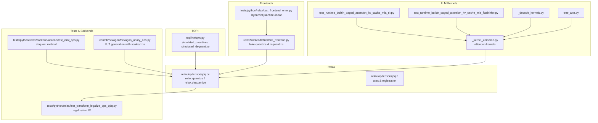
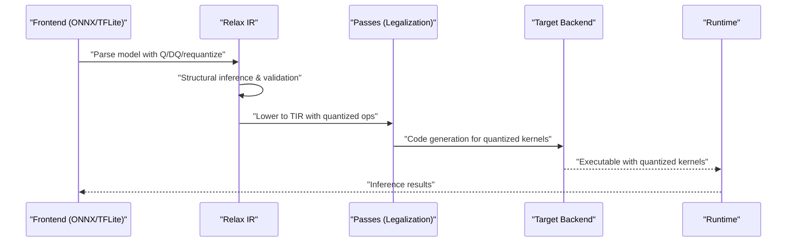
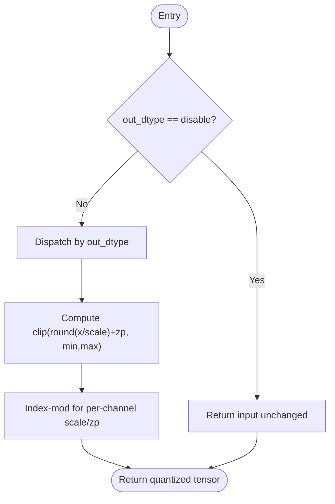
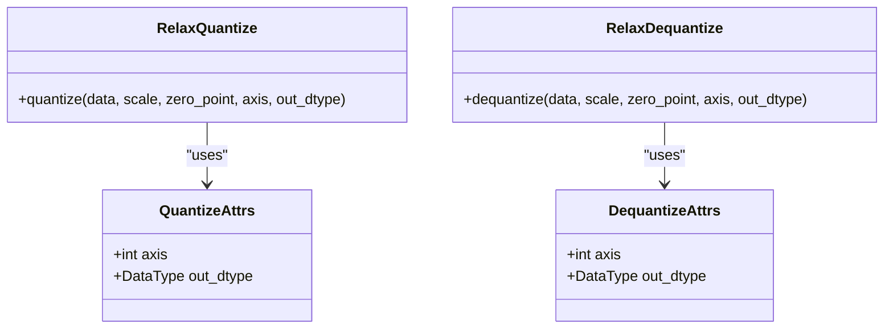
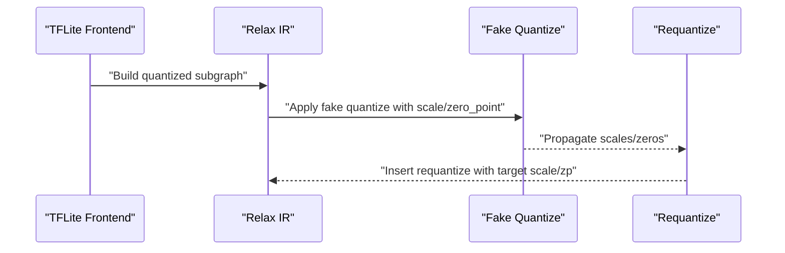
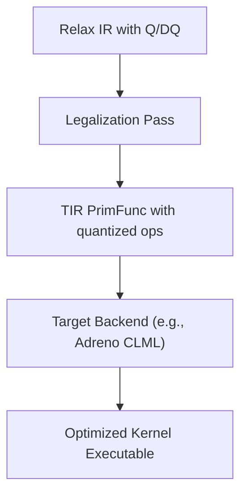
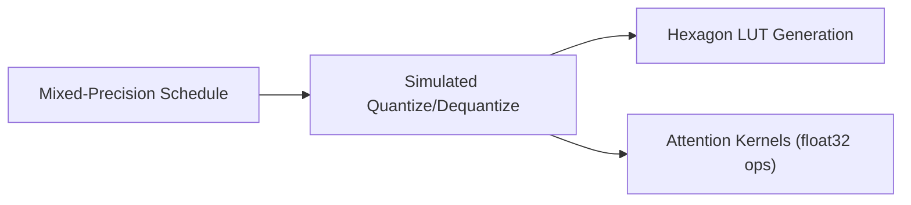
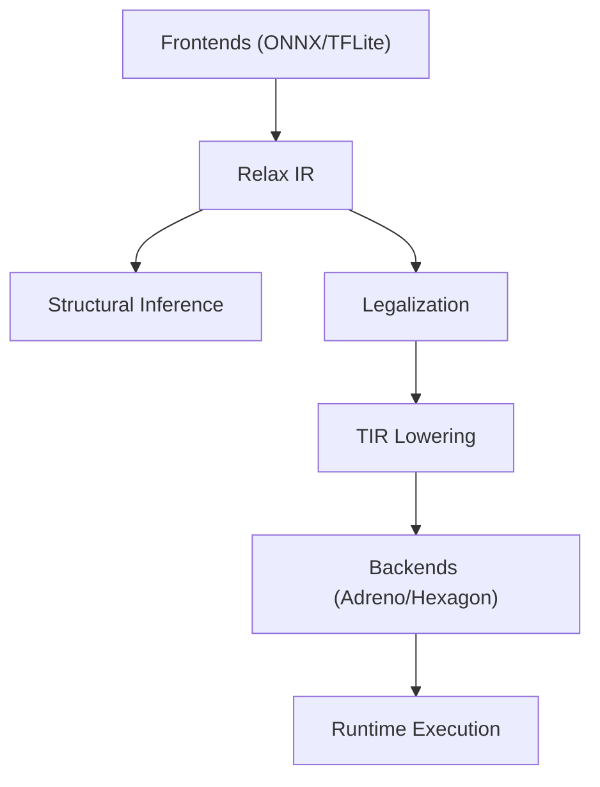

# Quantization and Model Compression

<cite>
**Referenced Files in This Document**
- [qnn.py](file://python/tvm/topi/nn/qnn.py)
- [qdq.cc](file://src/relax/op/tensor/qdq.cc)
- [qdq.h](file://src/relax/op/tensor/qdq.h)
- [tflite_frontend.py](file://python/tvm/relax/frontend/tflite/tflite_frontend.py)
- [test_dynamicquantizelinear_opset11.py](file://tests/python/relax/test_frontend_onnx.py)
- [test_transform_legalize_ops_qdq.py](file://tests/python/relax/test_transform_legalize_ops_qdq.py)
- [hexagon_unary_ops.py](file://python/tvm/contrib/hexagon/hexagon_unary_ops.py)
- [adreno_clml_ops.py](file://tests/python/relax/backend/adreno/test_clml_ops.py)
- [_kernel_common.py](file://python/tvm/relax/frontend/nn/llm/_kernel_common.py)
- [test_runtime_builtin_paged_attention_kv_cache_mla_tir.py](file://tests/python/relax/test_runtime_builtin_paged_attention_kv_cache_mla_tir.py)
- [test_runtime_builtin_paged_attention_kv_cache_mla_flashinfer.py](file://tests/python/relax/test_runtime_builtin_paged_attention_kv_cache_mla_flashinfer.py)
- [_decode_kernels.py](file://python/tvm/relax/frontend/nn/llm/_decode_kernels.py)
- [tree_attn.py](file://python/tvm/relax/frontend/nn/llm/tree_attn.py)
</cite>

## Table of Contents
1. [Introduction](#introduction)
2. [Project Structure](#project-structure)
3. [Core Components](#core-components)
4. [Architecture Overview](#architecture-overview)
5. [Detailed Component Analysis](#detailed-component-analysis)
6. [Dependency Analysis](#dependency-analysis)
7. [Performance Considerations](#performance-considerations)
8. [Troubleshooting Guide](#troubleshooting-guide)
9. [Conclusion](#conclusion)
10. [Appendices](#appendices)

## Introduction
This document explains TVM’s quantization and model compression capabilities with a focus on:
- Quantized operator support for INT8/INT4-like semantics via simulated quantization and Relax Q/DQ operators
- Mixed-precision computation using dynamic dtype selection and per-channel scaling
- Dynamic quantization strategies and ONNX/TFLite frontends
- Quantization-aware training integration points and calibration workflows
- Post-training quantization (PTQ) flows and correctness checks
- Model compression methods (pruning, low-rank approximation, knowledge distillation) and their integration points
- Practical examples for quantizing neural networks, configuring mixed-precision schedules, and optimizing compressed models for inference
- Relax frontend support for quantized operations, arithmetic analysis for quantization correctness, and code generation for quantized kernels
- Performance-accuracy trade-offs, hardware-specific optimizations, and deployment considerations

## Project Structure
Key areas related to quantization and compression:
- TOP-I quantized operators and simulated quantization/dequantization
- Relax Q/DQ operators with structural inference and legalization
- Frontend integrations for dynamic quantization and fake quantization
- Tests validating correctness and code generation for quantized kernels
- Hardware-specific backends enabling optimized quantized kernels

**Diagram sources**
- [qnn.py:1-194](file://python/tvm/topi/nn/qnn.py#L1-L194)
- [qdq.cc:1-249](file://src/relax/op/tensor/qdq.cc#L1-L249)
- [qdq.h](file://src/relax/op/tensor/qdq.h)
- [tflite_frontend.py:547-3807](file://python/tvm/relax/frontend/tflite/tflite_frontend.py#L547-L3807)
- [test_dynamicquantizelinear_opset11.py:5656-5672](file://tests/python/relax/test_frontend_onnx.py#L5656-L5672)
- [test_transform_legalize_ops_qdq.py:37-170](file://tests/python/relax/test_transform_legalize_ops_qdq.py#L37-L170)
- [adreno_clml_ops.py:567-663](file://tests/python/relax/backend/adreno/test_clml_ops.py#L567-L663)
- [hexagon_unary_ops.py:37-77](file://python/tvm/contrib/hexagon/hexagon_unary_ops.py#L37-L77)
- [_kernel_common.py:369-384](file://python/tvm/relax/frontend/nn/llm/_kernel_common.py#L369-L384)
- [test_runtime_builtin_paged_attention_kv_cache_mla_tir.py:315-332](file://tests/python/relax/test_runtime_builtin_paged_attention_kv_cache_mla_tir.py#L315-L332)
- [test_runtime_builtin_paged_attention_kv_cache_mla_flashinfer.py:333-350](file://tests/python/relax/test_runtime_builtin_paged_attention_kv_cache_mla_flashinfer.py#L333-L350)
- [_decode_kernels.py:330-338](file://python/tvm/relax/frontend/nn/llm/_decode_kernels.py#L330-L338)
- [tree_attn.py:759-999](file://python/tvm/relax/frontend/nn/llm/tree_attn.py#L759-L999)

**Section sources**
- [qnn.py:1-194](file://python/tvm/topi/nn/qnn.py#L1-L194)
- [qdq.cc:1-249](file://src/relax/op/tensor/qdq.cc#L1-L249)
- [tflite_frontend.py:547-3807](file://python/tvm/relax/frontend/tflite/tflite_frontend.py#L547-L3807)
- [test_dynamicquantizelinear_opset11.py:5656-5672](file://tests/python/relax/test_frontend_onnx.py#L5656-L5672)
- [test_transform_legalize_ops_qdq.py:37-170](file://tests/python/relax/test_transform_legalize_ops_qdq.py#L37-L170)
- [adreno_clml_ops.py:567-663](file://tests/python/relax/backend/adreno/test_clml_ops.py#L567-L663)
- [hexagon_unary_ops.py:37-77](file://python/tvm/contrib/hexagon/hexagon_unary_ops.py#L37-L77)
- [_kernel_common.py:369-384](file://python/tvm/relax/frontend/nn/llm/_kernel_common.py#L369-L384)
- [test_runtime_builtin_paged_attention_kv_cache_mla_tir.py:315-332](file://tests/python/relax/test_runtime_builtin_paged_attention_kv_cache_mla_tir.py#L315-L332)
- [test_runtime_builtin_paged_attention_kv_cache_mla_flashinfer.py:333-350](file://tests/python/relax/test_runtime_builtin_paged_attention_kv_cache_mla_flashinfer.py#L333-L350)
- [_decode_kernels.py:330-338](file://python/tvm/relax/frontend/nn/llm/_decode_kernels.py#L330-L338)
- [tree_attn.py:759-999](file://python/tvm/relax/frontend/nn/llm/tree_attn.py#L759-L999)

## Core Components
- Simulated quantization and dequantization in TOP-I enable dynamic dtype selection and per-channel scaling without changing runtime dtypes. These operators are useful for mixed-precision scheduling and correctness analysis.
- Relax Q/DQ operators define typed quantization with structural inference, parameter validation, and axis-aware scaling. They support float8 and wider integer types and integrate with lowering and codegen.
- Frontend integrations provide dynamic quantization and fake quantization flows, including requantization and scale/zero-point propagation.
- Tests demonstrate correctness of quantized kernels and ONNX-style dynamic quantization.
- Hardware backends (e.g., Adreno CLML) expose specialized dequantized GEMM kernels for quantized inputs.

**Section sources**
- [qnn.py:37-194](file://python/tvm/topi/nn/qnn.py#L37-L194)
- [qdq.cc:41-245](file://src/relax/op/tensor/qdq.cc#L41-L245)
- [tflite_frontend.py:547-3807](file://python/tvm/relax/frontend/tflite/tflite_frontend.py#L547-L3807)
- [test_dynamicquantizelinear_opset11.py:5656-5672](file://tests/python/relax/test_frontend_onnx.py#L5656-L5672)
- [adreno_clml_ops.py:567-663](file://tests/python/relax/backend/adreno/test_clml_ops.py#L567-L663)

## Architecture Overview
End-to-end quantization pipeline:
- Frontend parsing produces quantized subgraphs with explicit Q/DQ and requantize nodes
- Structural inference validates shapes, dtypes, and axis alignment
- Legalization lowers Q/DQ to TIR primitives with per-channel scales and zero points
- Target backends generate optimized kernels (e.g., dequantized GEMM)
- Runtime executes with minimal overhead using scales/zeros propagated as buffers

**Diagram sources**
- [qdq.cc:54-140](file://src/relax/op/tensor/qdq.cc#L54-L140)
- [qdq.cc:157-236](file://src/relax/op/tensor/qdq.cc#L157-L236)
- [test_transform_legalize_ops_qdq.py:37-170](file://tests/python/relax/test_transform_legalize_ops_qdq.py#L37-L170)
- [adreno_clml_ops.py:567-663](file://tests/python/relax/backend/adreno/test_clml_ops.py#L567-L663)

## Detailed Component Analysis

### Simulated Quantization and Dequantization (TOP-I)
- Provides elementwise simulated quantization/dequantization with dynamic dtype selection and per-channel scales/zero points.
- Supports INT8/UINT8/INT32-like semantics without changing runtime dtype, enabling mixed-precision scheduling and analysis.
- Uses indexmod to align channel-wise parameters with input tensors along a specified axis.

**Diagram sources**
- [qnn.py:37-124](file://python/tvm/topi/nn/qnn.py#L37-L124)

**Section sources**
- [qnn.py:37-194](file://python/tvm/topi/nn/qnn.py#L37-L194)

### Relax Quantize/Dequantize Operators
- Define Relax ops with attributes for axis, output dtype, and parameter validation.
- Structural inference enforces supported dtypes, shape compatibility, and axis bounds.
- Legalization lowers to TIR primitives implementing rounding, clipping, and per-channel scaling.

**Diagram sources**
- [qdq.cc:41-47](file://src/relax/op/tensor/qdq.cc#L41-L47)
- [qdq.cc:144-150](file://src/relax/op/tensor/qdq.cc#L144-L150)
- [qdq.h](file://src/relax/op/tensor/qdq.h)

**Section sources**
- [qdq.cc:41-245](file://src/relax/op/tensor/qdq.cc#L41-L245)

### Frontend Integrations: Dynamic Quantization and Fake Quantization
- TFLite frontend supports fake quantization and requantization with scale/zero-point propagation and per-channel handling.
- ONNX DynamicQuantizeLinear is validated against ORT parity in tests.

**Diagram sources**
- [tflite_frontend.py:547-578](file://python/tvm/relax/frontend/tflite/tflite_frontend.py#L547-L578)
- [tflite_frontend.py:2187-2207](file://python/tvm/relax/frontend/tflite/tflite_frontend.py#L2187-L2207)
- [test_dynamicquantizelinear_opset11.py:5656-5672](file://tests/python/relax/test_frontend_onnx.py#L5656-L5672)

**Section sources**
- [tflite_frontend.py:547-3807](file://python/tvm/relax/frontend/tflite/tflite_frontend.py#L547-L3807)
- [test_dynamicquantizelinear_opset11.py:5656-5672](file://tests/python/relax/test_frontend_onnx.py#L5656-L5672)

### Legalization and Code Generation for Quantized Kernels
- Tests show lowered TIR implementing quantization with per-channel scales and zero points.
- Adreno CLML tests demonstrate dequantized vectorized matmul kernels for quantized inputs.

**Diagram sources**
- [test_transform_legalize_ops_qdq.py:37-170](file://tests/python/relax/test_transform_legalize_ops_qdq.py#L37-L170)
- [adreno_clml_ops.py:567-663](file://tests/python/relax/backend/adreno/test_clml_ops.py#L567-L663)

**Section sources**
- [test_transform_legalize_ops_qdq.py:37-170](file://tests/python/relax/test_transform_legalize_ops_qdq.py#L37-L170)
- [adreno_clml_ops.py:567-663](file://tests/python/relax/backend/adreno/test_clml_ops.py#L567-L663)

### Mixed-Precision Computation and Hardware-Specific Optimizations
- Simulated quantization enables dynamic dtype selection and per-channel scaling for mixed-precision scheduling.
- Hexagon unary ops demonstrate lookup-table generation using input/output scales and zero points.
- Attention kernels integrate floating-point computations derived from quantized activations and weights.

**Diagram sources**
- [qnn.py:37-194](file://python/tvm/topi/nn/qnn.py#L37-L194)
- [hexagon_unary_ops.py:37-77](file://python/tvm/contrib/hexagon/hexagon_unary_ops.py#L37-L77)
- [_kernel_common.py:369-384](file://python/tvm/relax/frontend/nn/llm/_kernel_common.py#L369-L384)
- [_decode_kernels.py:330-338](file://python/tvm/relax/frontend/nn/llm/_decode_kernels.py#L330-L338)
- [tree_attn.py:759-999](file://python/tvm/relax/frontend/nn/llm/tree_attn.py#L759-L999)

**Section sources**
- [qnn.py:37-194](file://python/tvm/topi/nn/qnn.py#L37-L194)
- [hexagon_unary_ops.py:37-77](file://python/tvm/contrib/hexagon/hexagon_unary_ops.py#L37-L77)
- [_kernel_common.py:369-384](file://python/tvm/relax/frontend/nn/llm/_kernel_common.py#L369-L384)
- [_decode_kernels.py:330-338](file://python/tvm/relax/frontend/nn/llm/_decode_kernels.py#L330-L338)
- [tree_attn.py:759-999](file://python/tvm/relax/frontend/nn/llm/tree_attn.py#L759-L999)

## Dependency Analysis
- Relax Q/DQ depends on structural inference and passes to lower to TIR.
- Frontends depend on Relax IR to construct quantized subgraphs.
- Hardware backends depend on quantized kernel lowering to produce optimized executables.

**Diagram sources**
- [qdq.cc:54-140](file://src/relax/op/tensor/qdq.cc#L54-L140)
- [qdq.cc:157-236](file://src/relax/op/tensor/qdq.cc#L157-L236)
- [test_transform_legalize_ops_qdq.py:37-170](file://tests/python/relax/test_transform_legalize_ops_qdq.py#L37-L170)
- [adreno_clml_ops.py:567-663](file://tests/python/relax/backend/adreno/test_clml_ops.py#L567-L663)

**Section sources**
- [qdq.cc:54-236](file://src/relax/op/tensor/qdq.cc#L54-L236)
- [test_transform_legalize_ops_qdq.py:37-170](file://tests/python/relax/test_transform_legalize_ops_qdq.py#L37-L170)
- [adreno_clml_ops.py:567-663](file://tests/python/relax/backend/adreno/test_clml_ops.py#L567-L663)

## Performance Considerations
- Mixed-precision scheduling via simulated quantization reduces memory bandwidth and improves throughput when appropriate dtypes are selected.
- Per-channel quantization improves accuracy compared to per-tensor quantization at the cost of increased storage for scales/zeros.
- Hardware-specific kernels (e.g., dequantized GEMM) significantly reduce compute overhead for quantized matrices.
- Attention kernels operate in float32 after dequantization to maintain numerical stability during accumulation.

[No sources needed since this section provides general guidance]

## Troubleshooting Guide
- Shape and dtype mismatches: Structural inference reports errors when axis or parameter sizes are invalid.
- Unsupported dtypes: Relax Q/DQ enforces supported input/output dtypes and parameter dtypes.
- Calibration and scale propagation: Ensure scales/zeros are computed and propagated consistently across Q/DQ/requantize nodes.

**Section sources**
- [qdq.cc:54-140](file://src/relax/op/tensor/qdq.cc#L54-L140)
- [qdq.cc:157-236](file://src/relax/op/tensor/qdq.cc#L157-L236)
- [tflite_frontend.py:547-3807](file://python/tvm/relax/frontend/tflite/tflite_frontend.py#L547-L3807)

## Conclusion
TVM integrates quantization across frontends, Relax IR, structural inference, and hardware backends. Simulated quantization and Relax Q/DQ operators enable flexible mixed-precision scheduling and accurate PTQ workflows. Frontend integrations cover dynamic quantization and fake quantization, while tests validate correctness and code generation. Hardware backends deliver optimized kernels for quantized operations, and attention kernels maintain numerical stability. Deployment benefits from per-channel scaling, dtype-aware lowering, and hardware-specific optimizations.

[No sources needed since this section summarizes without analyzing specific files]

## Appendices

### Practical Examples Index
- Quantizing neural networks with Relax Q/DQ and per-channel scales
- Configuring mixed-precision schedules using simulated quantization
- Optimizing compressed models with hardware-specific kernels
- Calibrating scales/zeros and validating with ONNX DynamicQuantizeLinear

[No sources needed since this section indexes examples conceptually]