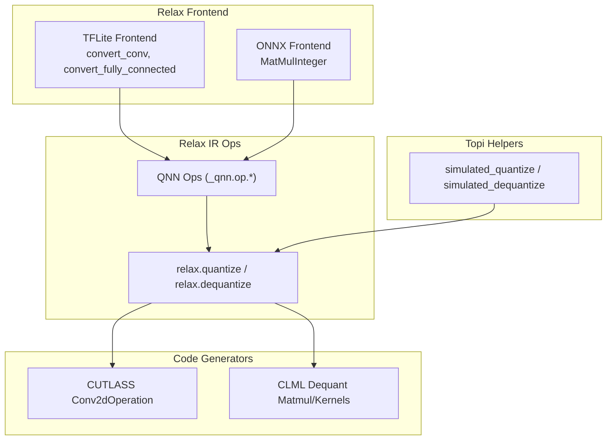
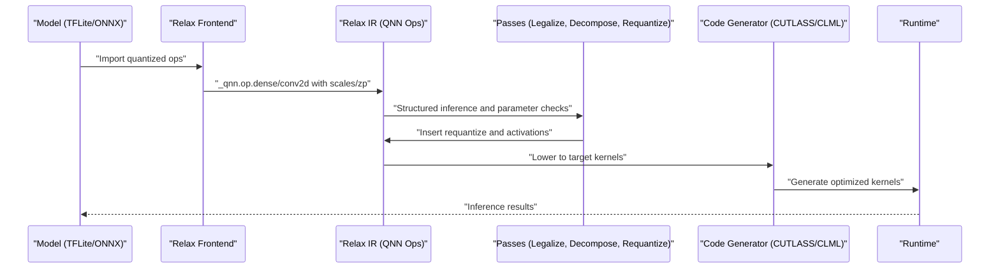
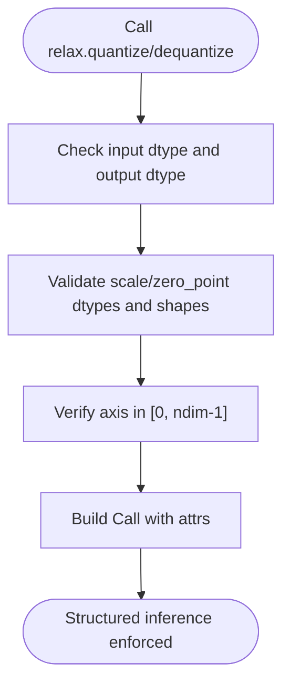
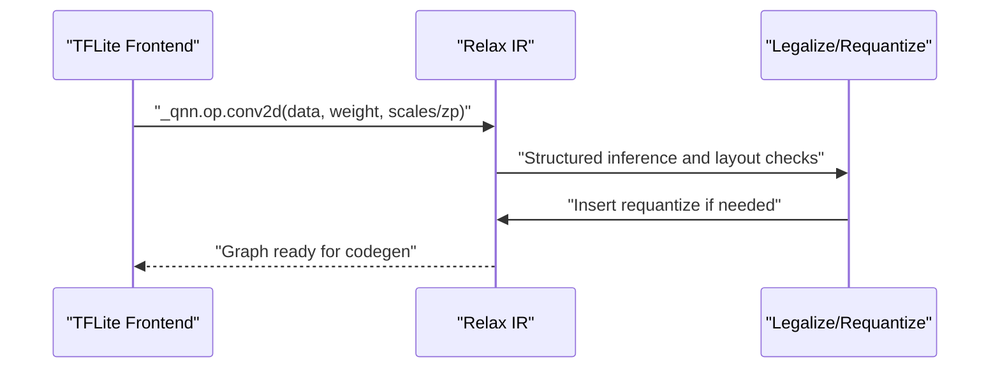
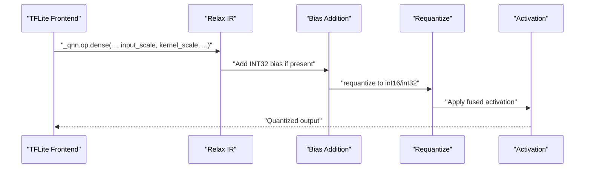
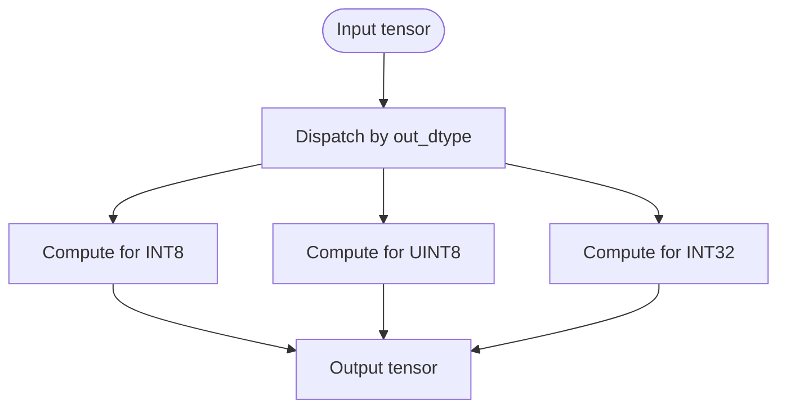
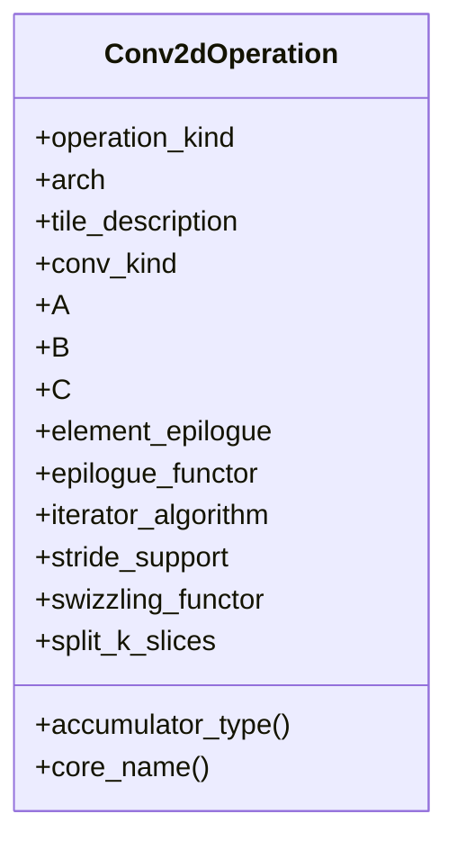
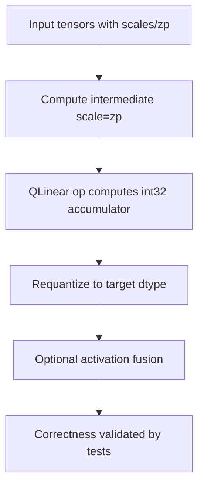
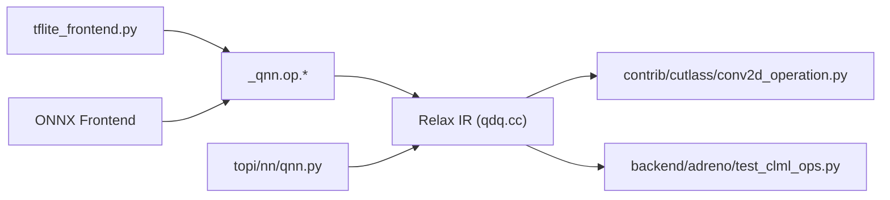

# Quantized Operators and Kernels

<cite>
**Referenced Files in This Document**
- [convolution.cc](file://src/relax/op/nn/convolution.cc)
- [qdq.cc](file://src/relax/op/tensor/qdq.cc)
- [qnn.py](file://python/tvm/topi/nn/qnn.py)
- [tflite_frontend.py](file://python/tvm/relax/frontend/tflite/tflite_frontend.py)
- [conv2d_operation.py](file://python/tvm/contrib/cutlass/conv2d_operation.py)
- [test_clml_ops.py](file://tests/python/relax/backend/adreno/test_clml_ops.py)
- [mod_utils.py](file://tests/python/relax/backend/adreno/mod_utils.py)
- [test_dataflow_rewriter.py](file://tests/python/relax/test_dataflow_rewriter.py)
- [test_frontend_onnx.py](file://tests/python/relax/test_frontend_onnx.py)
</cite>

## Table of Contents
1. [Introduction](#introduction)
2. [Project Structure](#project-structure)
3. [Core Components](#core-components)
4. [Architecture Overview](#architecture-overview)
5. [Detailed Component Analysis](#detailed-component-analysis)
6. [Dependency Analysis](#dependency-analysis)
7. [Performance Considerations](#performance-considerations)
8. [Troubleshooting Guide](#troubleshooting-guide)
9. [Conclusion](#conclusion)
10. [Appendices](#appendices)

## Introduction
This document explains TVM’s quantized neural network operations and kernel implementations with a focus on:
- Quantized operators: QLinearConv2D, QLinearMatMul, and quantized activations
- Quantization data types: INT8, INT4, UINT8, and how they are handled
- Quantization parameters: scale and zero_point propagation through operator graphs
- Practical guidance for implementing custom quantized operators, configuring quantization parameters, and optimizing kernels for different hardware targets
- Relax frontend quantized operation support, arithmetic analysis for correctness, and code generation for quantized compute kernels

## Project Structure
The quantization stack spans Relax frontend IR, operator definitions, Topi quantized helpers, and hardware-specific code generators:
- Relax operator definitions for quantize/dequantize and structured inference
- Frontend converters (TFLite/ONNX) that emit QNN ops and requantize nodes
- Topi simulated quantize/dequantize for dynamic dtype selection and per-channel scales
- CUTLASS and CLML code generation for INT8/UINT8 kernels and dequantization pipelines
- Tests validating correctness and performance across targets

**Diagram sources**
- [tflite_frontend.py:1824-1958](file://python/tvm/relax/frontend/tflite/tflite_frontend.py#L1824-L1958)
- [tflite_frontend.py:2004-2158](file://python/tvm/relax/frontend/tflite/tflite_frontend.py#L2004-L2158)
- [qdq.cc:41-245](file://src/relax/op/tensor/qdq.cc#L41-L245)
- [qnn.py:38-194](file://python/tvm/topi/nn/qnn.py#L38-L194)
- [conv2d_operation.py:24-61](file://python/tvm/contrib/cutlass/conv2d_operation.py#L24-L61)
- [test_clml_ops.py:567-663](file://tests/python/relax/backend/adreno/test_clml_ops.py#L567-L663)

**Section sources**
- [convolution.cc:206-412](file://src/relax/op/nn/convolution.cc#L206-L412)
- [qdq.cc:41-245](file://src/relax/op/tensor/qdq.cc#L41-L245)
- [qnn.py:38-194](file://python/tvm/topi/nn/qnn.py#L38-L194)
- [tflite_frontend.py:1824-1958](file://python/tvm/relax/frontend/tflite/tflite_frontend.py#L1824-L1958)
- [tflite_frontend.py:2004-2158](file://python/tvm/relax/frontend/tflite/tflite_frontend.py#L2004-L2158)
- [conv2d_operation.py:24-61](file://python/tvm/contrib/cutlass/conv2d_operation.py#L24-L61)
- [test_clml_ops.py:567-663](file://tests/python/relax/backend/adreno/test_clml_ops.py#L567-L663)

## Core Components
- Relax quantize/dequantize operators define structured inference and parameter checks for scale/zero_point shapes and dtypes. They accept per-tensor or per-channel parameters along an axis.
- QLinearConv2D and QLinearMatMul are emitted by frontends when tensors carry quantization parameters; downstream passes insert requantize and activation fusion.
- Topi simulated quantize/dequantize enables dynamic dtype selection and per-channel scales without compile-time dtype binding.
- CUTLASS and CLML backends generate optimized kernels for INT8/UINT8 and dequantization pipelines.

Key implementation anchors:
- Relax quantize/dequantize: [quantize:41-47](file://src/relax/op/tensor/qdq.cc#L41-L47), [dequantize:144-150](file://src/relax/op/tensor/qdq.cc#L144-L150)
- Struct info and parameter validation: [InferStructInfoQuantize:54-131](file://src/relax/op/tensor/qdq.cc#L54-L131), [InferStructInfoDequantize:157-236](file://src/relax/op/tensor/qdq.cc#L157-L236)
- TFLite QLinearMatMul emission: [convert_fully_connected:1824-1958](file://python/tvm/relax/frontend/tflite/tflite_frontend.py#L1824-L1958)
- TFLite QLinearConv2D emission: [convert_conv:2004-2158](file://python/tvm/relax/frontend/tflite/tflite_frontend.py#L2004-L2158)
- Simulated quantize/dequantize: [simulated_quantize:38-124](file://python/tvm/topi/nn/qnn.py#L38-L124), [simulated_dequantize:128-194](file://python/tvm/topi/nn/qnn.py#L128-L194)
- CUTLASS Conv2dOperation: [Conv2dOperation:24-61](file://python/tvm/contrib/cutlass/conv2d_operation.py#L24-L61)
- CLML dequant matmul tests: [test_dequant_matmul:567-663](file://tests/python/relax/backend/adreno/test_clml_ops.py#L567-L663), [test_dequant_vec_matmul:622-663](file://tests/python/relax/backend/adreno/test_clml_ops.py#L622-L663)

**Section sources**
- [qdq.cc:41-245](file://src/relax/op/tensor/qdq.cc#L41-L245)
- [qnn.py:38-194](file://python/tvm/topi/nn/qnn.py#L38-L194)
- [tflite_frontend.py:1824-1958](file://python/tvm/relax/frontend/tflite/tflite_frontend.py#L1824-L1958)
- [tflite_frontend.py:2004-2158](file://python/tvm/relax/frontend/tflite/tflite_frontend.py#L2004-L2158)
- [conv2d_operation.py:24-61](file://python/tvm/contrib/cutlass/conv2d_operation.py#L24-L61)
- [test_clml_ops.py:567-663](file://tests/python/relax/backend/adreno/test_clml_ops.py#L567-L663)

## Architecture Overview
The end-to-end flow from model conversion to quantized execution:
- Frontends detect quantized tensors and emit QNN ops (dense/conv2d) with input/kernel scales and zero_points
- Intermediate passes may insert requantize to align accumulator precision and output dtype
- Relax IR enforces structured inference and parameter compatibility
- Backends generate specialized kernels (CUTLASS, CLML) for INT8/UINT8 and dequant pipelines
- Runtime executes with minimal overhead and optimal memory access patterns

**Diagram sources**
- [tflite_frontend.py:1824-1958](file://python/tvm/relax/frontend/tflite/tflite_frontend.py#L1824-L1958)
- [tflite_frontend.py:2004-2158](file://python/tvm/relax/frontend/tflite/tflite_frontend.py#L2004-L2158)
- [qdq.cc:54-131](file://src/relax/op/tensor/qdq.cc#L54-L131)
- [conv2d_operation.py:24-61](file://python/tvm/contrib/cutlass/conv2d_operation.py#L24-L61)
- [test_clml_ops.py:567-663](file://tests/python/relax/backend/adreno/test_clml_ops.py#L567-L663)

## Detailed Component Analysis

### Relax Quantize/Dequantize Operators
- Purpose: Elementwise quantization and dequantization with support for per-tensor and per-channel parameters along an axis
- Parameter validation: Enforces input/output dtypes, axis bounds, and shape compatibility between scale/zero_point and the data channel dimension
- Typical usage: Pre/post-processing in frontends or manual insertion for custom quantized blocks

**Diagram sources**
- [qdq.cc:54-131](file://src/relax/op/tensor/qdq.cc#L54-L131)
- [qdq.cc:157-236](file://src/relax/op/tensor/qdq.cc#L157-L236)

**Section sources**
- [qdq.cc:41-245](file://src/relax/op/tensor/qdq.cc#L41-L245)

### QLinearConv2D
- Emission: Frontends emit _qnn.op.conv2d when input and kernel carry quantization parameters
- Parameters: input_scale, kernel_scale, input_zero_point, kernel_zero_point, out_dtype, layout, strides, padding, dilation, groups
- Output accumulation: Typically int32 accumulator with optional requantize to int16/int32 depending on target dtype

**Diagram sources**
- [tflite_frontend.py:2004-2158](file://python/tvm/relax/frontend/tflite/tflite_frontend.py#L2004-L2158)
- [convolution.cc:206-412](file://src/relax/op/nn/convolution.cc#L206-L412)

**Section sources**
- [tflite_frontend.py:2004-2158](file://python/tvm/relax/frontend/tflite/tflite_frontend.py#L2004-L2158)
- [convolution.cc:206-412](file://src/relax/op/nn/convolution.cc#L206-L412)

### QLinearMatMul (Dense)
- Emission: Frontends emit _qnn.op.dense with input/kernel scales and zero_points; bias addition follows if present
- Accumulator: int32 accumulator; optional requantize to int16 or int32 based on output dtype
- Fused activation: After requantize, activation functions can be fused into the graph

**Diagram sources**
- [tflite_frontend.py:1824-1958](file://python/tvm/relax/frontend/tflite/tflite_frontend.py#L1824-L1958)

**Section sources**
- [tflite_frontend.py:1824-1958](file://python/tvm/relax/frontend/tflite/tflite_frontend.py#L1824-L1958)

### Simulated Quantize/Dequantize (Topi)
- Dynamic dtype selection: Choose among INT8/UINT8/INT32 without compile-time dtype binding
- Per-channel support: Uses axis-based indexing to handle per-channel scales and zero_points
- Use cases: Prototyping quantization behavior, mixed-precision experiments, and dynamic quantization scenarios

**Diagram sources**
- [qnn.py:38-124](file://python/tvm/topi/nn/qnn.py#L38-L124)
- [qnn.py:128-194](file://python/tvm/topi/nn/qnn.py#L128-L194)

**Section sources**
- [qnn.py:38-194](file://python/tvm/topi/nn/qnn.py#L38-L194)

### Hardware-Specific Kernels and Dequant Pipelines
- CUTLASS Conv2dOperation: Describes Conv2d kernel configurations including accumulator type, tile description, and epilogue functor
- CLML Dequant Matmul: Tests demonstrate dequantization followed by matmul with INT4-like packed weights and float16 scales

**Diagram sources**
- [conv2d_operation.py:24-61](file://python/tvm/contrib/cutlass/conv2d_operation.py#L24-L61)

**Section sources**
- [conv2d_operation.py:24-61](file://python/tvm/contrib/cutlass/conv2d_operation.py#L24-L61)
- [test_clml_ops.py:567-663](file://tests/python/relax/backend/adreno/test_clml_ops.py#L567-L663)
- [mod_utils.py:786-807](file://tests/python/relax/backend/adreno/mod_utils.py#L786-L807)

### Arithmetic Analysis and Correctness
- Relax quantize/dequantize enforces dtype and shape compatibility for scale/zero_point parameters
- Frontend conversions compute intermediate scales/zeros for requantize after QLinearMatMul/QLinearConv2D
- ONNX MatMulInteger tests validate integer arithmetic behavior with zero points

**Diagram sources**
- [tflite_frontend.py:1918-1947](file://python/tvm/relax/frontend/tflite/tflite_frontend.py#L1918-L1947)
- [tflite_frontend.py:2181-2207](file://python/tvm/relax/frontend/tflite/tflite_frontend.py#L2181-L2207)
- [test_frontend_onnx.py:5222-5357](file://tests/python/relax/test_frontend_onnx.py#L5222-L5357)

**Section sources**
- [qdq.cc:54-131](file://src/relax/op/tensor/qdq.cc#L54-L131)
- [tflite_frontend.py:1918-1947](file://python/tvm/relax/frontend/tflite/tflite_frontend.py#L1918-L1947)
- [tflite_frontend.py:2181-2207](file://python/tvm/relax/frontend/tflite/tflite_frontend.py#L2181-L2207)
- [test_frontend_onnx.py:5222-5357](file://tests/python/relax/test_frontend_onnx.py#L5222-L5357)

## Dependency Analysis
- Frontend to IR: TFLite/ONNX frontends depend on _qnn.op.* and Relax quantize/dequantize
- IR to Backend: Relax IR lowers to CUTLASS/CLML via code generators
- Topi to IR: Simulated quantize/dequantize can be used alongside Relax ops for experimentation

**Diagram sources**
- [tflite_frontend.py:1824-1958](file://python/tvm/relax/frontend/tflite/tflite_frontend.py#L1824-L1958)
- [tflite_frontend.py:2004-2158](file://python/tvm/relax/frontend/tflite/tflite_frontend.py#L2004-L2158)
- [qdq.cc:41-245](file://src/relax/op/tensor/qdq.cc#L41-L245)
- [qnn.py:38-194](file://python/tvm/topi/nn/qnn.py#L38-L194)
- [conv2d_operation.py:24-61](file://python/tvm/contrib/cutlass/conv2d_operation.py#L24-L61)
- [test_clml_ops.py:567-663](file://tests/python/relax/backend/adreno/test_clml_ops.py#L567-L663)

**Section sources**
- [tflite_frontend.py:1824-1958](file://python/tvm/relax/frontend/tflite/tflite_frontend.py#L1824-L1958)
- [tflite_frontend.py:2004-2158](file://python/tvm/relax/frontend/tflite/tflite_frontend.py#L2004-L2158)
- [qdq.cc:41-245](file://src/relax/op/tensor/qdq.cc#L41-L245)
- [qnn.py:38-194](file://python/tvm/topi/nn/qnn.py#L38-L194)
- [conv2d_operation.py:24-61](file://python/tvm/contrib/cutlass/conv2d_operation.py#L24-L61)
- [test_clml_ops.py:567-663](file://tests/python/relax/backend/adreno/test_clml_ops.py#L567-L663)

## Performance Considerations
- Data types and packing:
  - INT8/UINT8 reduce bandwidth and improve throughput on many accelerators
  - INT4 packing (e.g., 4-bit weights) reduces storage and increases arithmetic intensity; tests show byte offsets and bit-width handling for packed layouts
- Dequantization pipelines:
  - Dequantize + matmul on GPU/accelerators can be efficient when scales are per-channel and packed appropriately
- Accumulator precision:
  - int32 accumulator prevents early overflow in stacked quantized layers
- Layout and memory:
  - Proper layout inference and kernel tiling improve cache locality and vectorization
- Target-specific optimizations:
  - CUTLASS Conv2dOperation exposes tile descriptions and epilogue functors for tuning
  - CLML dequant matmul tests illustrate optimized shapes and dtypes for mobile GPUs

Practical tips:
- Prefer per-tensor quantization for simplicity; switch to per-channel for higher accuracy
- Use simulated quantize/dequantize during development to experiment with dtypes and scales
- Insert requantize strategically to balance accumulator precision and output dtype
- Validate with backend-specific tests to ensure correctness and performance

**Section sources**
- [test_dataflow_rewriter.py:477-507](file://tests/python/relax/test_dataflow_rewriter.py#L477-L507)
- [test_clml_ops.py:567-663](file://tests/python/relax/backend/adreno/test_clml_ops.py#L567-L663)
- [conv2d_operation.py:24-61](file://python/tvm/contrib/cutlass/conv2d_operation.py#L24-L61)

## Troubleshooting Guide
Common issues and resolutions:
- Shape mismatches for scale/zero_point:
  - Ensure scale/zero_point sizes match the quantization axis dimension; Relax quantize/dequantize enforces this
- Unsupported dtypes:
  - Verify input/output dtypes and parameter dtypes meet operator constraints
- Incorrect axis:
  - Axis must be within [0, ndim-1]; negative axis is supported and normalized internally
- Requantize scale computation:
  - For QLinearMatMul/QLinearConv2D, intermediate scale is the product of input and kernel scales; confirm frontend logic and tests
- Backend-specific failures:
  - Validate shapes and dtypes against backend tests (e.g., CLML dequant matmul)

Checklist:
- Confirm quantization parameters are present and consistent across related tensors
- Validate structured inference passes and parameter checks
- Inspect requantize placement and axis alignment
- Run backend-specific tests to catch target-specific issues

**Section sources**
- [qdq.cc:54-131](file://src/relax/op/tensor/qdq.cc#L54-L131)
- [qdq.cc:157-236](file://src/relax/op/tensor/qdq.cc#L157-L236)
- [tflite_frontend.py:1918-1947](file://python/tvm/relax/frontend/tflite/tflite_frontend.py#L1918-L1947)
- [tflite_frontend.py:2181-2207](file://python/tvm/relax/frontend/tflite/tflite_frontend.py#L2181-L2207)
- [test_clml_ops.py:567-663](file://tests/python/relax/backend/adreno/test_clml_ops.py#L567-L663)

## Conclusion
TVM’s quantized operator stack integrates frontend-aware QNN ops, structured inference for parameter correctness, and hardware-specific code generators. By leveraging Relax quantize/dequantize, QLinearMatMul/QLinearConv2D, simulated quantization helpers, and CUTLASS/CLML backends, developers can implement accurate, portable, and high-performance quantized models. Proper configuration of scales and zero_points, careful requantize placement, and targeted optimizations enable strong numerical fidelity and performance across diverse hardware.

## Appendices

### Practical Examples Index
- Implementing QLinearMatMul with Relax:
  - Emit _qnn.op.dense with input_scale, kernel_scale, input_zero_point, kernel_zero_point
  - Insert requantize and activation fusion as needed
  - Reference: [convert_fully_connected:1824-1958](file://python/tvm/relax/frontend/tflite/tflite_frontend.py#L1824-L1958)
- Implementing QLinearConv2D with Relax:
  - Emit _qnn.op.conv2d with scales/zp and layout parameters
  - Reference: [convert_conv:2004-2158](file://python/tvm/relax/frontend/tflite/tflite_frontend.py#L2004-L2158)
- Using simulated quantize/dequantize:
  - Select dtype dynamically and handle per-channel scales/zero_points
  - Reference: [simulated_quantize:38-124](file://python/tvm/topi/nn/qnn.py#L38-L124), [simulated_dequantize:128-194](file://python/tvm/topi/nn/qnn.py#L128-L194)
- Optimizing kernels for INT8/UINT8:
  - Configure CUTLASS Conv2dOperation and tune tile descriptions
  - Reference: [Conv2dOperation:24-61](file://python/tvm/contrib/cutlass/conv2d_operation.py#L24-L61)
- Dequantization pipeline on CLML:
  - Validate shapes and dtypes for dequant + matmul
  - Reference: [test_dequant_matmul:567-663](file://tests/python/relax/backend/adreno/test_clml_ops.py#L567-L663), [test_dequant_vec_matmul:622-663](file://tests/python/relax/backend/adreno/test_clml_ops.py#L622-L663)