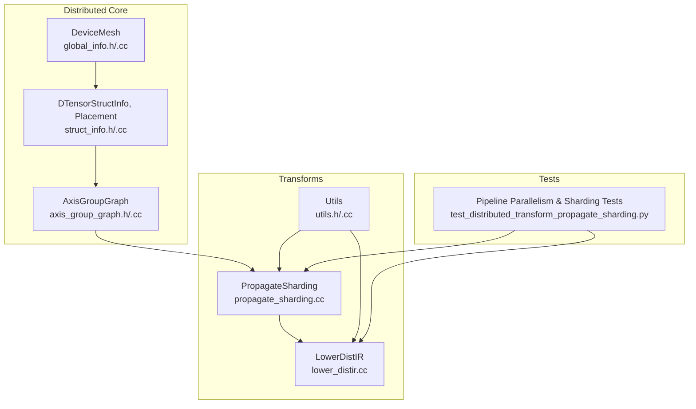
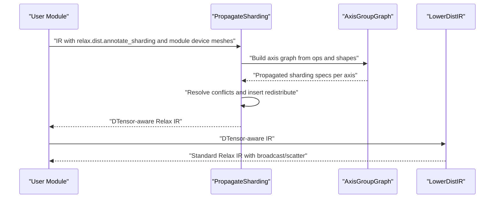
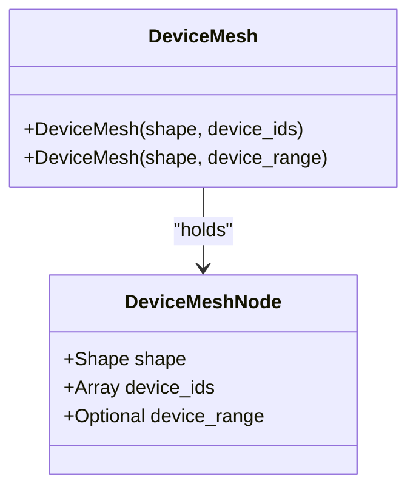
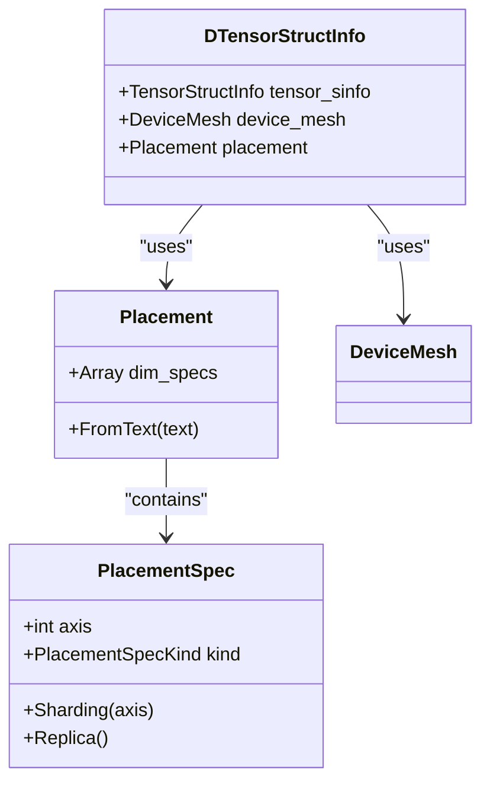
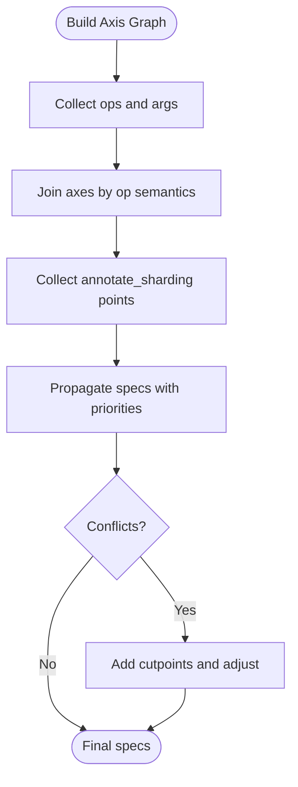
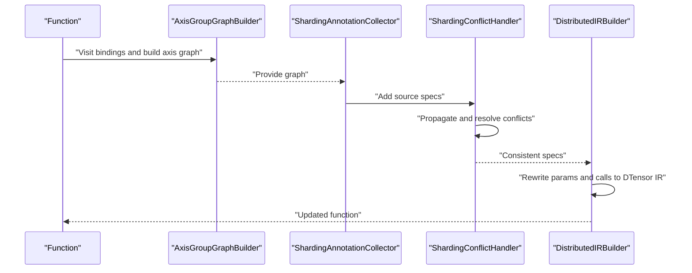
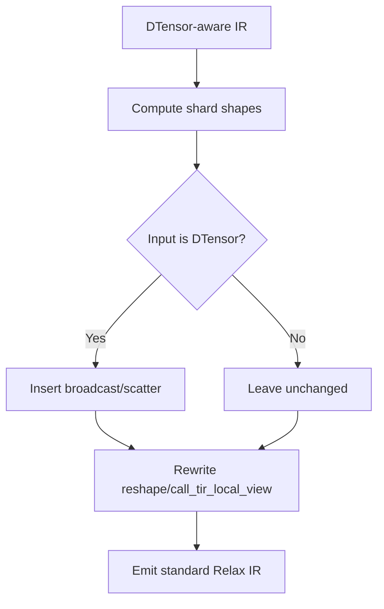
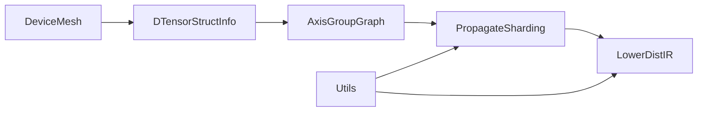

# Distributed Training

<cite>
**Referenced Files in This Document**
- [global_info.h](file://include/tvm/relax/distributed/global_info.h)
- [global_info.cc](file://src/relax/distributed/global_info.cc)
- [struct_info.h](file://include/tvm/relax/distributed/struct_info.h)
- [struct_info.cc](file://src/relax/distributed/struct_info.cc)
- [axis_group_graph.h](file://include/tvm/relax/distributed/axis_group_graph.h)
- [axis_group_graph.cc](file://src/relax/distributed/axis_group_graph.cc)
- [transform.h](file://include/tvm/relax/distributed/transform.h)
- [propagate_sharding.cc](file://src/relax/distributed/transform/propagate_sharding.cc)
- [lower_distir.cc](file://src/relax/distributed/transform/lower_distir.cc)
- [utils.h](file://src/relax/distributed/transform/utils.h)
- [utils.cc](file://src/relax/distributed/transform/utils.cc)
- [test_distributed_transform_propagate_sharding.py](file://tests/python/relax/distributed/test_distributed_transform_propagate_sharding.py)
</cite>

## Table of Contents
1. [Introduction](#introduction)
2. [Project Structure](#project-structure)
3. [Core Components](#core-components)
4. [Architecture Overview](#architecture-overview)
5. [Detailed Component Analysis](#detailed-component-analysis)
6. [Dependency Analysis](#dependency-analysis)
7. [Performance Considerations](#performance-considerations)
8. [Troubleshooting Guide](#troubleshooting-guide)
9. [Conclusion](#conclusion)
10. [Appendices](#appendices)

## Introduction
This document explains Relax’s distributed training capabilities, focusing on data parallelism, model parallelism, pipeline parallelism, and hybrid strategies. It covers the distributed transformation system, global information management, structured information handling for distributed execution, integration with Relax transformations, communication patterns, and load balancing strategies. Practical configuration examples, custom strategy implementation, debugging tips, and performance optimization guidelines are included, along with the relationship to Relax backend dispatching, resource management, and fault tolerance mechanisms.

## Project Structure
The distributed training stack in Relax is organized around:
- Global information: device meshes and topology
- Structured tensor information: DTensor and placement specifications
- Axis-group graph: axis-level sharding propagation and consistency
- Transform passes: sharding propagation, lowering DistIR, and redistribution legalization
- Tests: end-to-end examples of pipeline parallelism and sharding propagation

**Diagram sources**
- [global_info.h:37-56](file://include/tvm/relax/distributed/global_info.h#L37-L56)
- [struct_info.h:116-159](file://include/tvm/relax/distributed/struct_info.h#L116-L159)
- [axis_group_graph.h:273-456](file://include/tvm/relax/distributed/axis_group_graph.h#L273-L456)
- [propagate_sharding.cc:416-613](file://src/relax/distributed/transform/propagate_sharding.cc#L416-L613)
- [lower_distir.cc:44-261](file://src/relax/distributed/transform/lower_distir.cc#L44-L261)
- [utils.h:36-61](file://src/relax/distributed/transform/utils.h#L36-L61)
- [test_distributed_transform_propagate_sharding.py:303-373](file://tests/python/relax/distributed/test_distributed_transform_propagate_sharding.py#L303-L373)

**Section sources**
- [global_info.h:37-56](file://include/tvm/relax/distributed/global_info.h#L37-L56)
- [struct_info.h:116-159](file://include/tvm/relax/distributed/struct_info.h#L116-L159)
- [axis_group_graph.h:273-456](file://include/tvm/relax/distributed/axis_group_graph.h#L273-L456)
- [propagate_sharding.cc:416-613](file://src/relax/distributed/transform/propagate_sharding.cc#L416-L613)
- [lower_distir.cc:44-261](file://src/relax/distributed/transform/lower_distir.cc#L44-L261)
- [utils.h:36-61](file://src/relax/distributed/transform/utils.h#L36-L61)
- [test_distributed_transform_propagate_sharding.py:303-373](file://tests/python/relax/distributed/test_distributed_transform_propagate_sharding.py#L303-L373)

## Core Components
- DeviceMesh: describes n-D device topology and maps logical shapes to physical device IDs or ranges.
- DTensorStructInfo and Placement: describe per-axis sharding and replication across device mesh dimensions.
- AxisGroupGraph: encodes axis-wise relationships and propagates sharding specs to maintain consistency.
- Transform passes:
  - PropagateSharding: builds axis graphs, collects sharding annotations, resolves conflicts, and rewrites to DTensor-aware IR.
  - LowerDistIR: lowers DistIR (DTensor-aware) to Relax IR by adjusting shapes and inserting broadcast/scatter ops.
  - LegalizeRedistribute and LowerGlobalViewToLocalView: complement the lowering pipeline for communication ops and local-view conversion.
- Utilities: helpers to detect DistIR vs Relax compatibility and annotate-sharding presence.

**Section sources**
- [global_info.h:37-56](file://include/tvm/relax/distributed/global_info.h#L37-L56)
- [struct_info.h:34-159](file://include/tvm/relax/distributed/struct_info.h#L34-L159)
- [axis_group_graph.h:273-456](file://include/tvm/relax/distributed/axis_group_graph.h#L273-L456)
- [transform.h:39-72](file://include/tvm/relax/distributed/transform.h#L39-L72)
- [utils.h:36-61](file://src/relax/distributed/transform/utils.h#L36-L61)

## Architecture Overview
The distributed training pipeline integrates user-annotated sharding with automatic propagation and lowering:
- Users annotate sharding via Relax ops and module-global device meshes.
- The axis-group graph captures axis-wise relationships across operators.
- PropagateSharding computes consistent sharding across axes, inserts redistribute where needed, and emits DTensor-aware IR.
- LowerDistIR converts DTensor-aware IR into standard Relax IR with proper shape adjustments and communication ops.

**Diagram sources**
- [propagate_sharding.cc:416-613](file://src/relax/distributed/transform/propagate_sharding.cc#L416-L613)
- [axis_group_graph.cc:79-393](file://src/relax/distributed/axis_group_graph.cc#L79-L393)
- [lower_distir.cc:44-261](file://src/relax/distributed/transform/lower_distir.cc#L44-L261)

## Detailed Component Analysis

### DeviceMesh and Global Information
- DeviceMesh encapsulates:
  - Logical shape of the mesh
  - Device IDs or a device range
  - Validation that device count equals the product of shape dimensions
- Reflection registration enables construction from Python/FFI.

**Diagram sources**
- [global_info.h:37-67](file://include/tvm/relax/distributed/global_info.h#L37-L67)
- [global_info.cc:29-60](file://src/relax/distributed/global_info.cc#L29-L60)

**Section sources**
- [global_info.h:37-67](file://include/tvm/relax/distributed/global_info.h#L37-L67)
- [global_info.cc:29-60](file://src/relax/distributed/global_info.cc#L29-L60)

### DTensor and Placement Specifications
- PlacementSpec encodes per-axis distribution:
  - Replica: replicate across a mesh dimension
  - Sharding: partition along a tensor axis mapped to a mesh dimension
- Placement composes per-axis specs; DTensorStructInfo ties a tensor’s shape to a device mesh and placement.
- Textual placement parsing supports concise specification.

**Diagram sources**
- [struct_info.h:34-159](file://include/tvm/relax/distributed/struct_info.h#L34-L159)
- [struct_info.cc:37-145](file://src/relax/distributed/struct_info.cc#L37-L145)

**Section sources**
- [struct_info.h:34-159](file://include/tvm/relax/distributed/struct_info.h#L34-L159)
- [struct_info.cc:37-145](file://src/relax/distributed/struct_info.cc#L37-L145)

### AxisGroupGraph: Sharding Propagation and Consistency
- Builds axis graphs from Relax ops:
  - Unary/binary ops, reductions, matmul, reshape, permute dims, and call_tir
  - Connects axes across producer-consumer and sibling relationships
- Propagates sharding specs with priorities and resolves conflicts
- Supports cutpoints to halt propagation when incompatible specs arise

**Diagram sources**
- [axis_group_graph.h:273-456](file://include/tvm/relax/distributed/axis_group_graph.h#L273-L456)
- [axis_group_graph.cc:79-393](file://src/relax/distributed/axis_group_graph.cc#L79-L393)

**Section sources**
- [axis_group_graph.h:273-456](file://include/tvm/relax/distributed/axis_group_graph.h#L273-L456)
- [axis_group_graph.cc:79-393](file://src/relax/distributed/axis_group_graph.cc#L79-L393)

### PropagateSharding Pass
- Steps:
  1) Build axis graph from function bindings and ops
  2) Collect annotate_sharding annotations as source points
  3) Resolve conflicts and compute propagation priorities
  4) Rewrite inputs to DTensorStructInfo and remove annotate_sharding
  5) Insert redistribute when inferred and propagated specs differ
- Handles call_tir with TIR-side axis graph extraction and updates struct info accordingly

**Diagram sources**
- [propagate_sharding.cc:416-613](file://src/relax/distributed/transform/propagate_sharding.cc#L416-L613)
- [axis_group_graph.cc:79-393](file://src/relax/distributed/axis_group_graph.cc#L79-L393)

**Section sources**
- [propagate_sharding.cc:416-613](file://src/relax/distributed/transform/propagate_sharding.cc#L416-L613)

### LowerDistIR Pass
- Converts DTensor-aware IR to standard Relax IR:
  - Adjusts tensor shapes according to sharding
  - Inserts broadcast/scatter at boundaries for 1D device meshes
  - Rewrites special cases like reshape and call_tir_local_view
- Validates compatibility between DistIR and Relax IR

**Diagram sources**
- [lower_distir.cc:44-261](file://src/relax/distributed/transform/lower_distir.cc#L44-L261)

**Section sources**
- [lower_distir.cc:44-261](file://src/relax/distributed/transform/lower_distir.cc#L44-L261)

### Transform Utilities
- Compatibility checks:
  - SinfoCompatibleWithDistIR/SinfoCompatibleWithRelax
  - IsDistIRFunc/IsShardingAnnotatedFunc
- MatchPrimFunc helper for resolving call_tir to TIR functions

**Section sources**
- [utils.h:36-61](file://src/relax/distributed/transform/utils.h#L36-L61)
- [utils.cc:25-82](file://src/relax/distributed/transform/utils.cc#L25-L82)

## Dependency Analysis
- DeviceMesh and Placement define the distributed typing layer used by DTensorStructInfo.
- AxisGroupGraph consumes Relax ops and struct info to propagate sharding.
- PropagateSharding depends on AxisGroupGraph and transforms call_tir via TIR axis graphs.
- LowerDistIR depends on DTensorStructInfo and placement to adjust shapes and insert communication ops.
- Utilities provide shared predicates and helpers across passes.

**Diagram sources**
- [global_info.h:37-67](file://include/tvm/relax/distributed/global_info.h#L37-L67)
- [struct_info.h:116-159](file://include/tvm/relax/distributed/struct_info.h#L116-L159)
- [axis_group_graph.h:273-456](file://include/tvm/relax/distributed/axis_group_graph.h#L273-L456)
- [propagate_sharding.cc:416-613](file://src/relax/distributed/transform/propagate_sharding.cc#L416-L613)
- [lower_distir.cc:44-261](file://src/relax/distributed/transform/lower_distir.cc#L44-L261)
- [utils.h:36-61](file://src/relax/distributed/transform/utils.h#L36-L61)

**Section sources**
- [global_info.h:37-67](file://include/tvm/relax/distributed/global_info.h#L37-L67)
- [struct_info.h:116-159](file://include/tvm/relax/distributed/struct_info.h#L116-L159)
- [axis_group_graph.h:273-456](file://include/tvm/relax/distributed/axis_group_graph.h#L273-L456)
- [propagate_sharding.cc:416-613](file://src/relax/distributed/transform/propagate_sharding.cc#L416-L613)
- [lower_distir.cc:44-261](file://src/relax/distributed/transform/lower_distir.cc#L44-L261)
- [utils.h:36-61](file://src/relax/distributed/transform/utils.h#L36-L61)

## Performance Considerations
- Minimize inter-device communication by aligning sharding with compute-intensive ops (e.g., matmul) and reducing unnecessary redistribute.
- Prefer contiguous sharding axes that match data layouts to reduce gather/scatter overhead.
- Use pipeline parallelism across device meshes to hide communication latency by overlapping computation and communication.
- Keep module-global device meshes aligned with hardware topology to avoid irregular communication patterns.
- Leverage reshape and permute to maintain alignment with sharded axes and avoid extra resharding.

## Troubleshooting Guide
Common issues and resolutions:
- Sharding conflict detected: ensure a device-mesh axis is not sharded twice per tensor and that device meshes match across the tensor’s axes.
- Constant tensors sharded: constants must remain replicated; move constants to parameters or mark as replica.
- Mismatched output struct info: PropagateSharding inserts redistribute when inferred and propagated specs differ; verify annotate_sharding coverage.
- call_tir shape mismatch: LowerDistIR adjusts shapes for sharded outputs; confirm placement and device mesh dimensions are consistent.

**Section sources**
- [propagate_sharding.cc:249-339](file://src/relax/distributed/transform/propagate_sharding.cc#L249-L339)
- [lower_distir.cc:213-249](file://src/relax/distributed/transform/lower_distir.cc#L213-L249)

## Conclusion
Relax’s distributed training stack provides a robust framework for data, model, pipeline, and hybrid parallelism. By combining device mesh modeling, DTensor typing, axis-level propagation, and lowering passes, it enables efficient multi-device execution with minimal user intervention. Proper configuration of device meshes, precise annotate_sharding, and awareness of communication patterns are key to achieving strong scaling and performance.

## Appendices

### Practical Examples and Configuration
- Pipeline parallelism with device meshes and annotate_sharding:
  - Define module-global device meshes and annotate intermediate activations across meshes with specific placements.
  - Use PropagateSharding to propagate and validate sharding across layers.
  - Reference: [test_distributed_transform_propagate_sharding.py:303-373](file://tests/python/relax/distributed/test_distributed_transform_propagate_sharding.py#L303-L373)

- Data parallelism:
  - Mark entire tensors as replica across a mesh dimension to distribute computation across workers.
  - Use reshape and permute to align data layout with sharding axes.

- Model parallelism:
  - Shard specific tensor axes (e.g., feature dimensions) across mesh dimensions to split parameter and activation sizes.

- Hybrid parallelism:
  - Combine pipeline stages across device meshes with intra-stage data/model parallelism by annotating different axes per stage.

**Section sources**
- [test_distributed_transform_propagate_sharding.py:303-373](file://tests/python/relax/distributed/test_distributed_transform_propagate_sharding.py#L303-L373)

### Integration with Relax Backend Dispatching and Resource Management
- DeviceMesh and Placement inform backend dispatching by specifying where tensors reside locally.
- LowerDistIR inserts appropriate communication ops (broadcast/scatter) and adjusts shapes for local execution.
- Fault tolerance:
  - Communication ops are modeled as backend primitives; failures can be mitigated by re-execution or checkpoint-restart strategies at the application level.
  - Ensure consistent device mesh topology and placement to simplify recovery.

**Section sources**
- [lower_distir.cc:132-154](file://src/relax/distributed/transform/lower_distir.cc#L132-L154)