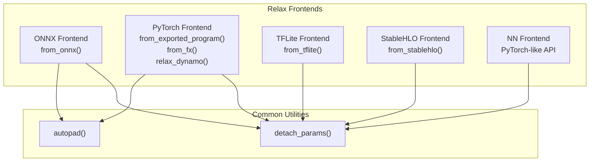
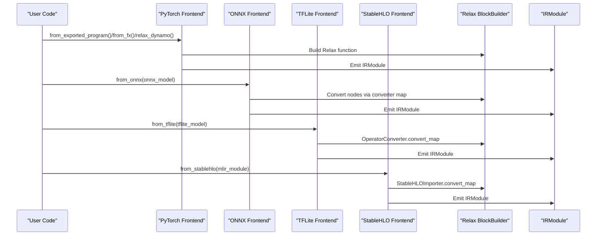
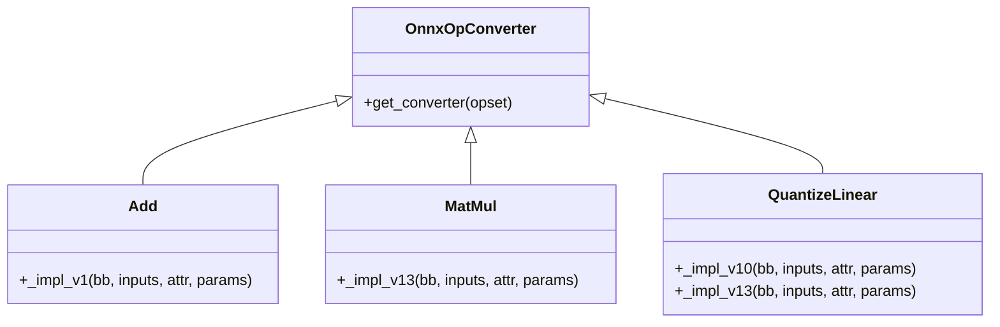
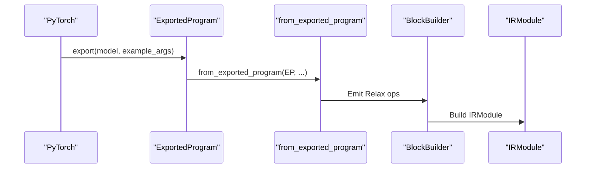
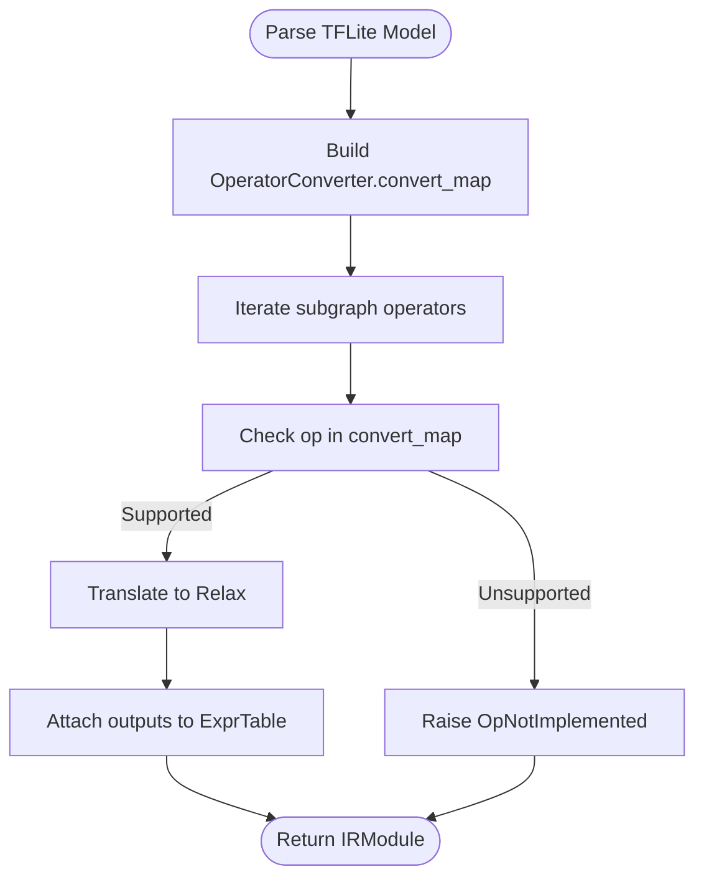
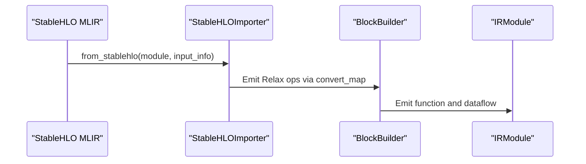
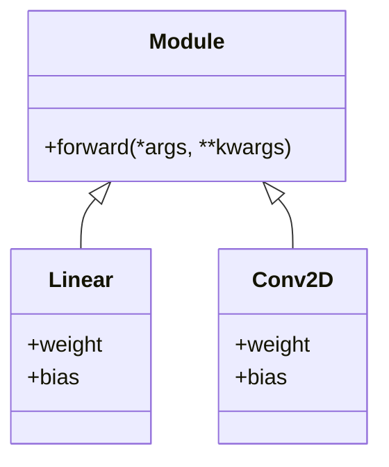
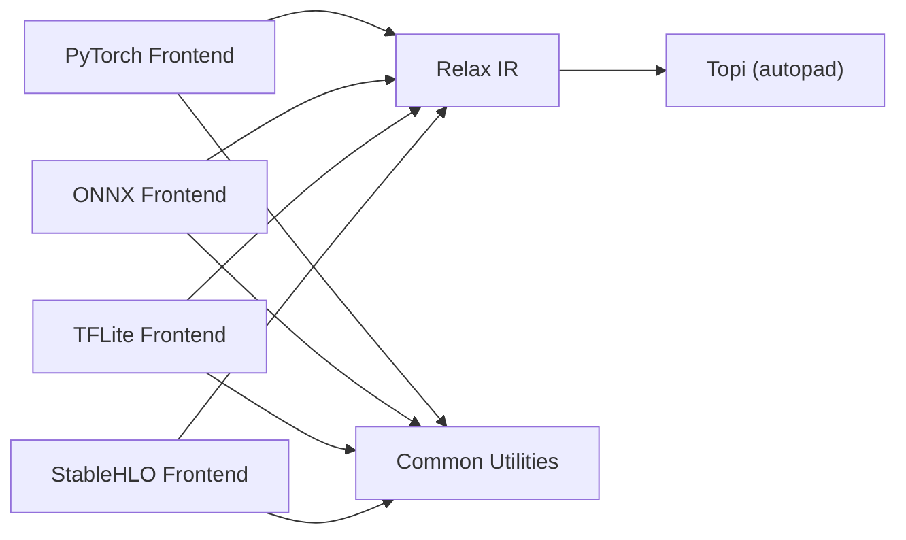

# Frontend Adapters

<cite>
**Referenced Files in This Document**
- [frontend/__init__.py](file://python/tvm/relax/frontend/__init__.py)
- [onnx_frontend.py](file://python/tvm/relax/frontend/onnx/onnx_frontend.py)
- [tflite_frontend.py](file://python/tvm/relax/frontend/tflite/tflite_frontend.py)
- [stablehlo_translator.py](file://python/tvm/relax/frontend/stablehlo/stablehlo_translator.py)
- [dynamo.py](file://python/tvm/relax/frontend/torch/dynamo.py)
- [common.py](file://python/tvm/relax/frontend/common.py)
- [import_model.py](file://docs/how_to/tutorials/import_model.py)
- [test_frontend_from_exported_program.py](file://tests/python/relax/test_frontend_from_exported_program.py)
- [test_frontend_from_fx.py](file://tests/python/relax/test_frontend_from_fx.py)
- [test_frontend_dynamo.py](file://tests/python/relax/test_frontend_dynamo.py)
</cite>

## Table of Contents
1. [Introduction](#introduction)
2. [Project Structure](#project-structure)
3. [Core Components](#core-components)
4. [Architecture Overview](#architecture-overview)
5. [Detailed Component Analysis](#detailed-component-analysis)
6. [Dependency Analysis](#dependency-analysis)
7. [Performance Considerations](#performance-considerations)
8. [Troubleshooting Guide](#troubleshooting-guide)
9. [Conclusion](#conclusion)
10. [Appendices](#appendices)

## Introduction
This document explains the Relax frontend adapters that enable importing models from external frameworks into TVM’s Relax IR. It covers:
- ONNX frontend for converting ONNX models
- PyTorch frontend with FX graph translation and Dynamo support
- TensorFlow Lite frontend for mobile deployment
- StableHLO frontend for JAX models
- NN frontend for building neural network models in a PyTorch-like API

It details the translation process, supported operators, limitations, conversion strategies, practical examples, custom operator mapping, debugging techniques, and performance considerations for successful framework interoperability.

## Project Structure
Relax frontends live under the Relax frontend namespace. Each frontend provides an entry function to import a model from its respective framework into a Relax IRModule. Shared utilities for parameter handling and autopadding are provided in the common frontend module.

**Diagram sources**
- [frontend/__init__.py:18-22](file://python/tvm/relax/frontend/__init__.py#L18-L22)
- [common.py:26-128](file://python/tvm/relax/frontend/common.py#L26-L128)

**Section sources**
- [frontend/__init__.py:18-22](file://python/tvm/relax/frontend/__init__.py#L18-L22)
- [common.py:26-128](file://python/tvm/relax/frontend/common.py#L26-L128)

## Core Components
- ONNX Frontend: Converts ONNX graphs into Relax via a registry of operator converters. Supports dynamic shapes and integrates with Relax’s quantization ops.
- PyTorch Frontend: Provides three import paths:
  - from_exported_program: Recommended, works with torch.export
  - from_fx: Works with torch.fx.GraphModule and requires explicit input_info
  - relax_dynamo: torch.compile backend that compiles and executes via TVM
- TFLite Frontend: Imports flatbuffer TFLite models into Relax, with a configurable operator converter class and checks for unsupported ops.
- StableHLO Frontend: Converts StableHLO MLIR to Relax, mapping StableHLO ops to Relax equivalents.
- NN Frontend: A PyTorch-like API to construct IRModules programmatically, including common layers and operators.

Key shared utilities:
- detach_params: Detach function parameters from IRModule attributes into a separate dictionary for flexible deployment.
- autopad: Compute padding for convolution-like ops with dynamic shapes.

**Section sources**
- [onnx_frontend.py:18-37](file://python/tvm/relax/frontend/onnx/onnx_frontend.py#L18-L37)
- [dynamo.py:38-143](file://python/tvm/relax/frontend/torch/dynamo.py#L38-L143)
- [tflite_frontend.py:25-39](file://python/tvm/relax/frontend/tflite/tflite_frontend.py#L25-L39)
- [stablehlo_translator.py:19-446](file://python/tvm/relax/frontend/stablehlo/stablehlo_translator.py#L19-L446)
- [common.py:26-128](file://python/tvm/relax/frontend/common.py#L26-L128)

## Architecture Overview
The frontends share a common pattern:
- Accept a framework-specific model representation
- Build a Relax BlockBuilder context
- Traverse the source graph and emit Relax expressions
- Optionally attach parameters as inputs or embed as constants
- Return an IRModule with a main function

**Diagram sources**
- [dynamo.py:52-143](file://python/tvm/relax/frontend/torch/dynamo.py#L52-L143)
- [onnx_frontend.py:18-37](file://python/tvm/relax/frontend/onnx/onnx_frontend.py#L18-L37)
- [tflite_frontend.py:118-240](file://python/tvm/relax/frontend/tflite/tflite_frontend.py#L118-L240)
- [stablehlo_translator.py:326-415](file://python/tvm/relax/frontend/stablehlo/stablehlo_translator.py#L326-L415)

## Detailed Component Analysis

### ONNX Frontend
- Translation process:
  - Parses ONNX ModelProto and extracts inputs/outputs and shapes
  - Builds an ExprTable to track node-to-expression mappings
  - Uses OnnxOpConverter subclasses to map ONNX ops to Relax equivalents
  - Supports opset-versioned converters and dynamic shapes via SizeVar
- Supported operators:
  - Arithmetic: Add, Sub, Mul, Div, Pow, Mod
  - Logical comparisons: Equal, Less, Greater, LessOrEqual, GreaterOrEqual
  - Bitwise: BitwiseAnd, BitwiseOr, BitwiseXor, BitwiseNot, BitShift
  - Activations: Sigmoid, Softmax, LogSoftmax, Hardmax
  - Linear algebra: MatMul, MatMulInteger16
  - Transpose and shape manipulation: Transpose, Unsqueeze, Squeeze
  - Quantization: QuantizeLinear, DequantizeLinear, DynamicQuantizeLinear
- Limitations:
  - Dynamic shapes are preserved; not all kernels support dynamic shapes
  - Unsupported opsets or operators raise errors
- Conversion strategies:
  - Use keep_params_in_input to separate weights
  - Override dtype_dict and shape_dict for dynamic inputs
  - Use opset parameter to force a specific opset version if needed

**Diagram sources**
- [onnx_frontend.py:284-313](file://python/tvm/relax/frontend/onnx/onnx_frontend.py#L284-L313)
- [onnx_frontend.py:472-525](file://python/tvm/relax/frontend/onnx/onnx_frontend.py#L472-L525)
- [onnx_frontend.py:382-388](file://python/tvm/relax/frontend/onnx/onnx_frontend.py#L382-L388)
- [onnx_frontend.py:314-338](file://python/tvm/relax/frontend/onnx/onnx_frontend.py#L314-L338)

Practical example (from tutorial):
- Export a PyTorch model to ONNX and import into TVM
- Verify outputs by compiling with a minimal pipeline and comparing against PyTorch

**Section sources**
- [onnx_frontend.py:18-37](file://python/tvm/relax/frontend/onnx/onnx_frontend.py#L18-L37)
- [onnx_frontend.py:284-313](file://python/tvm/relax/frontend/onnx/onnx_frontend.py#L284-L313)
- [import_model.py:211-280](file://docs/how_to/tutorials/import_model.py#L211-L280)

### PyTorch Frontend (FX Graph and Dynamo)
- Translation process:
  - from_exported_program: Recommended entry point using torch.export
  - from_fx: Works with torch.fx.GraphModule; requires input_info
  - relax_dynamo: torch.compile backend that translates FX graphs to Relax and executes via TVM
- Supported operators:
  - Broad coverage via ExportedProgramImporter and FX translator
  - Many ATen ops mapped to Relax equivalents
- Limitations:
  - Unsupported ATen ops require custom_convert_map
  - Some Python control flow patterns may need from_fx with explicit input_info
- Conversion strategies:
  - Use run_ep_decomposition to decompose high-level ops into primitives
  - Use unwrap_unit_return_tuple to simplify signatures
  - Use keep_params_as_input to manage weights separately

**Diagram sources**
- [import_model.py:42-116](file://docs/how_to/tutorials/import_model.py#L42-L116)
- [dynamo.py:52-143](file://python/tvm/relax/frontend/torch/dynamo.py#L52-L143)

Practical example (from tutorial):
- Use from_exported_program with detach_params and verify numerically against PyTorch

**Section sources**
- [import_model.py:42-183](file://docs/how_to/tutorials/import_model.py#L42-L183)
- [test_frontend_from_exported_program.py:37-94](file://tests/python/relax/test_frontend_from_exported_program.py#L37-L94)
- [dynamo.py:38-143](file://python/tvm/relax/frontend/torch/dynamo.py#L38-L143)

### TFLite Frontend
- Translation process:
  - Parses flatbuffer TFLite Model
  - Uses OperatorConverter.convert_map to translate ops
  - Checks for unsupported and dynamic-range quantization ops
- Supported operators:
  - Elementwise: Abs, Add, Sub, Mul, Div, Pow, FloorMod, Logical ops
  - Activations: Relu, Relu6, Tanh, Sigmoid, LeakyRelu, Gelu, HardSwish
  - Pooling: MaxPool2d, AveragePool2d, L2Pool2d
  - Convolutions: Conv2d, DepthwiseConv2d
  - Reductions: Sum, Mean, Max, Min, Prod
  - Reshape/transpose: Reshape, Transpose, Squeeze, ExpandDims, Pack, Unpack
  - Interpolation: ResizeBilinear, ResizeNearestNeighbor
  - Others: Concatenation, FullyConnected, Softmax, Cast, Shape, etc.
- Limitations:
  - Custom operators are not supported unless explicitly allowed
  - Dynamic range quantization optimized ops are flagged as unsupported
- Conversion strategies:
  - Provide shape_dict/dtype_dict if not inferred
  - Extend via op_converter class by subclassing OperatorConverter and overriding convert_map

**Diagram sources**
- [tflite_frontend.py:118-240](file://python/tvm/relax/frontend/tflite/tflite_frontend.py#L118-L240)
- [tflite_frontend.py:242-283](file://python/tvm/relax/frontend/tflite/tflite_frontend.py#L242-L283)

Practical example (from tutorial):
- Convert a TF function to TFLite and import into TVM; show IRModule and optional custom converter extension

**Section sources**
- [tflite_frontend.py:25-39](file://python/tvm/relax/frontend/tflite/tflite_frontend.py#L25-L39)
- [tflite_frontend.py:118-240](file://python/tvm/relax/frontend/tflite/tflite_frontend.py#L118-L240)
- [import_model.py:281-378](file://docs/how_to/tutorials/import_model.py#L281-L378)

### StableHLO Frontend
- Translation process:
  - Parses StableHLO MLIR module
  - Maps StableHLO ops to Relax ops via StableHLOImporter.convert_map
  - Emits a Relax function with dataflow blocks
- Supported operators:
  - Arithmetic: add, subtract, multiply, divide
  - Reductions: reduce, reduce_window
  - Convolutions: convolution
  - Shapes: reshape, dot_general (matmul)
  - Math: sin, cos, sinh, cosh, rsqrt, sqrt, exp, round
- Limitations:
  - Impure ops are not supported
  - Only a subset of StableHLO features are mapped
- Conversion strategies:
  - Provide input_info to infer shapes and dtypes
  - Use from_stablehlo with MLIR module or serialized string

**Diagram sources**
- [stablehlo_translator.py:355-415](file://python/tvm/relax/frontend/stablehlo/stablehlo_translator.py#L355-L415)
- [stablehlo_translator.py:326-354](file://python/tvm/relax/frontend/stablehlo/stablehlo_translator.py#L326-L354)

**Section sources**
- [stablehlo_translator.py:19-446](file://python/tvm/relax/frontend/stablehlo/stablehlo_translator.py#L19-L446)

### NN Frontend (Building Neural Networks Programmatically)
- Purpose:
  - Provide a PyTorch-like API to define modules and layers directly in Relax IR
- Key components:
  - Modules: Conv1D/Conv2D/Conv3D, ConvTranspose1D, Embedding, GroupNorm, LayerNorm, Linear, ReLU, RMSNorm, SiLU, etc.
  - Operators: elementwise ops, reductions, shape manipulations
  - Utilities: Parameter, Tensor, ModuleList, ModuleDict, Mutator, SubroutineMixin
- Typical usage:
  - Define a Module subclass with forward
  - Use ExternModule/ObjectModule/SourceModule for external code
  - Export via exporter.add_extern for integration

**Diagram sources**
- [nn/__init__.py:25-44](file://python/tvm/relax/frontend/nn/__init__.py#L25-L44)

**Section sources**
- [nn/__init__.py:18-44](file://python/tvm/relax/frontend/nn/__init__.py#L18-L44)

## Dependency Analysis
Frontend adapters depend on:
- Relax IR and BlockBuilder for constructing functions and dataflow blocks
- Topi for autopadding and shape inference
- Framework-specific libraries (ONNX, TFLite, StableHLO, PyTorch) for parsing and graph traversal
- Common utilities for parameter handling and padding

**Diagram sources**
- [common.py:58-128](file://python/tvm/relax/frontend/common.py#L58-L128)
- [onnx_frontend.py:52-58](file://python/tvm/relax/frontend/onnx/onnx_frontend.py#L52-L58)
- [tflite_frontend.py:34-35](file://python/tvm/relax/frontend/tflite/tflite_frontend.py#L34-L35)
- [stablehlo_translator.py:24-26](file://python/tvm/relax/frontend/stablehlo/stablehlo_translator.py#L24-L26)

**Section sources**
- [common.py:58-128](file://python/tvm/relax/frontend/common.py#L58-L128)
- [onnx_frontend.py:52-58](file://python/tvm/relax/frontend/onnx/onnx_frontend.py#L52-L58)
- [tflite_frontend.py:34-35](file://python/tvm/relax/frontend/tflite/tflite_frontend.py#L34-L35)
- [stablehlo_translator.py:24-26](file://python/tvm/relax/frontend/stablehlo/stablehlo_translator.py#L24-L26)

## Performance Considerations
- Prefer from_exported_program for PyTorch models to leverage decomposition and improve operator coverage
- Use unwrap_unit_return_tuple to simplify function signatures and reduce overhead
- Keep params as inputs (keep_params_as_input) for weight reuse and quantization flexibility
- Apply minimal optimization pipeline ("zero") during verification; use full pipelines for deployment
- For TFLite, avoid dynamic range quantization optimized ops if unsupported
- For ONNX, specify concrete shapes via shape_dict to enable static shape optimizations

[No sources needed since this section provides general guidance]

## Troubleshooting Guide
Common issues and resolutions:
- Unsupported operators:
  - PyTorch: Provide custom_convert_map with a converter function keyed by ATen operator name
  - TFLite: Extend OperatorConverter.convert_map via a custom op_converter class
  - ONNX: Add entries to the converter registry or adjust opset
- Dynamic shapes:
  - ONNX preserves dynamic shapes; ensure downstream passes handle SizeVar
  - TFLite: Unsupported dynamic-range quantization ops are flagged
- Parameter management:
  - Use detach_params to separate function parameters from IRModule attributes for easier deployment
- Verification:
  - Compile with a minimal pipeline and compare outputs against the original framework

**Section sources**
- [import_model.py:118-183](file://docs/how_to/tutorials/import_model.py#L118-L183)
- [tflite_frontend.py:242-283](file://python/tvm/relax/frontend/tflite/tflite_frontend.py#L242-L283)
- [common.py:26-56](file://python/tvm/relax/frontend/common.py#L26-L56)

## Conclusion
Relax frontend adapters provide robust pathways to import models from major ML frameworks into TVM’s intermediate representation. By leveraging the recommended import methods, understanding operator coverage and limitations, and applying the provided debugging and optimization strategies, users can achieve reliable and efficient model interoperability across PyTorch, ONNX, TensorFlow Lite, and JAX/StableHLO.

[No sources needed since this section summarizes without analyzing specific files]

## Appendices

### Practical Examples Index
- PyTorch import with verification and custom operator mapping
  - [import_model.py:42-183](file://docs/how_to/tutorials/import_model.py#L42-L183)
- ONNX import and verification
  - [import_model.py:211-280](file://docs/how_to/tutorials/import_model.py#L211-L280)
- TFLite import and custom operator extension
  - [import_model.py:281-378](file://docs/how_to/tutorials/import_model.py#L281-L378)
- Dynamo backend usage and subgraph capture
  - [dynamo.py:145-194](file://python/tvm/relax/frontend/torch/dynamo.py#L145-L194)
  - [test_frontend_dynamo.py:182-288](file://tests/python/relax/test_frontend_dynamo.py#L182-L288)

### Operator Coverage References
- PyTorch: ExportedProgramImporter converter map
  - [test_frontend_from_exported_program.py:96-125](file://tests/python/relax/test_frontend_from_exported_program.py#L96-L125)
  - [test_frontend_from_fx.py:48-138](file://tests/python/relax/test_frontend_from_fx.py#L48-L138)
- ONNX: OnnxOpConverter registry
  - [onnx_frontend.py:472-525](file://python/tvm/relax/frontend/onnx/onnx_frontend.py#L472-L525)
- TFLite: OperatorConverter.convert_map
  - [tflite_frontend.py:118-240](file://python/tvm/relax/frontend/tflite/tflite_frontend.py#L118-L240)