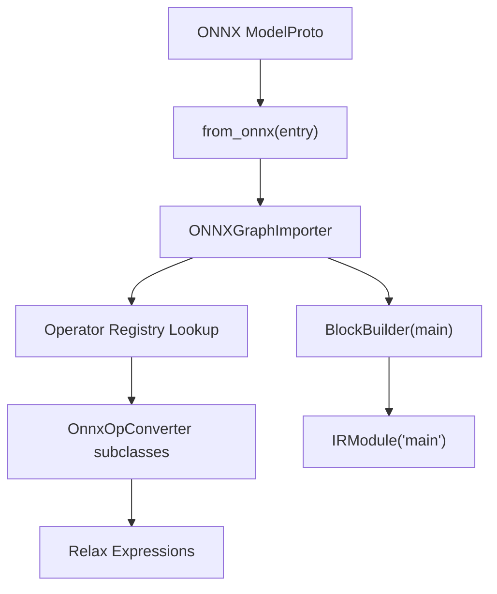
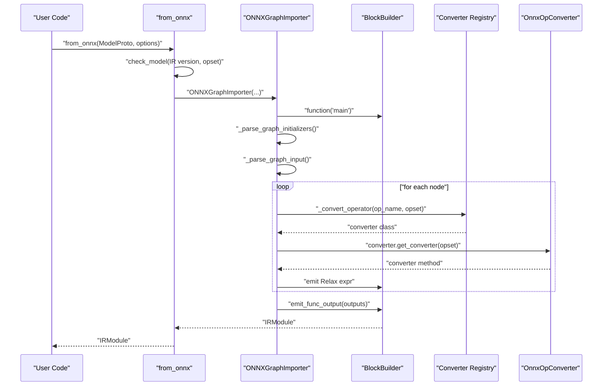
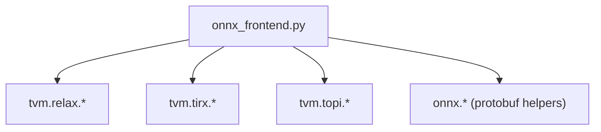

# ONNX Frontend

<cite>
**Referenced Files in This Document**
- [onnx_frontend.py](file://python/tvm/relax/frontend/onnx/onnx_frontend.py)
- [__init__.py](file://python/tvm/relax/frontend/onnx/__init__.py)
- [test_frontend_onnx.py](file://tests/python/relax/test_frontend_onnx.py)
- [import_model.py](file://docs/how_to/tutorials/import_model.py)
</cite>

## Table of Contents
1. [Introduction](#introduction)
2. [Project Structure](#project-structure)
3. [Core Components](#core-components)
4. [Architecture Overview](#architecture-overview)
5. [Detailed Component Analysis](#detailed-component-analysis)
6. [Dependency Analysis](#dependency-analysis)
7. [Performance Considerations](#performance-considerations)
8. [Troubleshooting Guide](#troubleshooting-guide)
9. [Conclusion](#conclusion)
10. [Appendices](#appendices)

## Introduction
This document explains the ONNX frontend adapter that imports ONNX models into Relax IR. It covers the end-to-end pipeline: parsing ONNX graphs, translating nodes to Relax expressions, handling operator attributes and shapes, and preparing the resulting IR for compilation. It also documents supported ONNX operator coverage, configuration options, debugging techniques, and best practices for robust and efficient model conversion.

## Project Structure
The ONNX frontend lives under the Relax frontend package and exposes a single entry point for model import. The core implementation resides in a dedicated module, with tests validating operator coverage and numerical fidelity against ONNX Runtime.

**Diagram sources**
- [onnx_frontend.py:5338-5425](file://python/tvm/relax/frontend/onnx/onnx_frontend.py#L5338-L5425)
- [onnx_frontend.py:4928-4986](file://python/tvm/relax/frontend/onnx/onnx_frontend.py#L4928-L4986)

**Section sources**
- [__init__.py:22](file://python/tvm/relax/frontend/onnx/__init__.py#L22)
- [onnx_frontend.py:5338-5425](file://python/tvm/relax/frontend/onnx/onnx_frontend.py#L5338-L5425)

## Core Components
- Entry point: from_onnx accepts a ModelProto and optional configuration, validates the model, resolves opset, and constructs an IRModule.
- Graph importer: ONNXGraphImporter parses initializers, inputs, and nodes; maintains a node registry; converts operators via a registry; handles special cases (If, ShapeExpr compatibility).
- Operator registry: _get_convert_map maps ONNX operator names to OnnxOpConverter subclasses; converters implement version-specific logic via get_converter(opset).
- Converter base: OnnxOpConverter provides a common interface and version resolution; many operators inherit from specialized bases (BinaryBase, MultiInputBase).
- Utility helpers: shape parsing, type conversion, constant folding, and shape inference helpers enable dynamic/static shape handling.

Key responsibilities:
- Parse ONNX graph and metadata (initializers, inputs, outputs, attributes).
- Resolve opset and dispatch to the appropriate converter.
- Emit Relax expressions using BlockBuilder and StructInfo.
- Sanitize input names and manage parameter placement (as inputs vs constants).

**Section sources**
- [onnx_frontend.py:4928-4986](file://python/tvm/relax/frontend/onnx/onnx_frontend.py#L4928-L4986)
- [onnx_frontend.py:5226-5259](file://python/tvm/relax/frontend/onnx/onnx_frontend.py#L5226-L5259)
- [onnx_frontend.py:284-313](file://python/tvm/relax/frontend/onnx/onnx_frontend.py#L284-L313)

## Architecture Overview
The importer follows a deterministic pipeline:
1. Validate and normalize model metadata (IR version, opset).
2. Initialize BlockBuilder and construct the Relax function "main".
3. Parse initializers (weights) and inputs; optionally sanitize names.
4. Traverse nodes in graph order:
   - For If nodes, recursively convert subgraphs.
   - For regular nodes, resolve converter by op_name and opset, then emit Relax expressions.
   - Enforce shape-compatible ops for ShapeExpr inputs.
5. Collect outputs and finalize the function with attributes (num_input, params).

**Diagram sources**
- [onnx_frontend.py:5338-5425](file://python/tvm/relax/frontend/onnx/onnx_frontend.py#L5338-L5425)
- [onnx_frontend.py:4928-4986](file://python/tvm/relax/frontend/onnx/onnx_frontend.py#L4928-L4986)
- [onnx_frontend.py:5226-5259](file://python/tvm/relax/frontend/onnx/onnx_frontend.py#L5226-L5259)

## Detailed Component Analysis

### ONNXGraphImporter
Responsibilities:
- Construct Relax function "main" with a dataflow block when possible.
- Parse initializers into parameters (variables or constants).
- Parse inputs, sanitize names, and infer shapes/dtypes.
- Detect unsupported operators and raise informative errors.
- Convert nodes to Relax expressions, handling special cases (If, ShapeExpr compatibility).
- Finalize function with attributes (num_input, params) and return IRModule.

Key behaviors:
- Parameter placement controlled by keep_params_in_input.
- Shape inference uses ValueInfoProto and dynamic SizeVar generation.
- Attribute parsing supports multiple ONNX attribute types.

**Section sources**
- [onnx_frontend.py:4928-4986](file://python/tvm/relax/frontend/onnx/onnx_frontend.py#L4928-L4986)
- [onnx_frontend.py:4988-5069](file://python/tvm/relax/frontend/onnx/onnx_frontend.py#L4988-L5069)
- [onnx_frontend.py:5070-5187](file://python/tvm/relax/frontend/onnx/onnx_frontend.py#L5070-L5187)

### Operator Registry and Version Resolution
- _get_convert_map returns a mapping from ONNX op names to converter classes.
- OnnxOpConverter.get_converter(opset) selects the highest implemented version ≤ opset.
- Many operators reuse shared base classes (e.g., BinaryBase, MultiInputBase) to reduce duplication.

Examples of covered operators (non-exhaustive):
- Arithmetic: Add, Sub, Mul, Div, Pow, Mod, FloorMod, Neg, Abs, Sqrt, Rsqrt, Exp, Log, Round, IsInf, IsNaN.
- Logical: Less, LessOrEqual, Greater, GreaterOrEqual, Equal, And, Or, Xor, Not.
- Bitwise: BitwiseAnd, BitwiseOr, BitwiseXor, BitwiseNot, BitShift.
- Activations: Relu, Sigmoid, Softmax, LogSoftmax, Hardmax, Elu, Selu, Mish, PRelu, LeakyRelu, Gelu, FastGelu, BiasGelu, Shrink.
- Linear algebra: MatMul, MatMulInteger16, Gemm.
- Convolutions: Conv, ConvTranspose.
- Transformations: Transpose, Reshape, Squeeze, Unsqueeze, Concat, Split, Gather, GatherElements, GatherND, ScatterElements, ScatterND, Where, Clip, Shape, Size, EyeLike, Trilu, CumSum, Pad, Tile, Expand, ConstantOfShape.
- Shape manipulation: Slice, Dynamic/Symbolic shape handling for reshape/unsqueeze/squeeze/slice.

Notes:
- Unsupported operators trigger OpNotImplemented errors.
- Some operators require constant inputs for certain branches (e.g., MatMulInteger16 dtype checks).

**Section sources**
- [onnx_frontend.py:284-313](file://python/tvm/relax/frontend/onnx/onnx_frontend.py#L284-L313)
- [onnx_frontend.py:4715-4750](file://python/tvm/relax/frontend/onnx/onnx_frontend.py#L4715-L4750)
- [onnx_frontend.py:1421-1490](file://python/tvm/relax/frontend/onnx/onnx_frontend.py#L1421-L1490)
- [onnx_frontend.py:1623-1641](file://python/tvm/relax/frontend/onnx/onnx_frontend.py#L1623-L1641)
- [onnx_frontend.py:1968-2004](file://python/tvm/relax/frontend/onnx/onnx_frontend.py#L1968-L2004)
- [onnx_frontend.py:2178-2320](file://python/tvm/relax/frontend/onnx/onnx_frontend.py#L2178-L2320)

### Attribute Handling and Shape Inference
- Attributes parsed from AttributeProto into a dict; graphs and nested subgraphs are supported.
- Shape inference:
  - ValueInfoProto shapes converted to Relax ShapeExpr or SizeVar when dynamic.
  - Expression parsing supports arithmetic in shape names (addition, subtraction, multiplication, division).
- Special handling for ShapeExpr inputs:
  - Certain ops accept ShapeExpr directly (e.g., Concat, Reshape, Gather, Slice, Shape, Expand, Where, Cast, Squeeze).
  - Non-compatible ops raise errors when encountering ShapeExpr inputs.

**Section sources**
- [onnx_frontend.py:5200-5224](file://python/tvm/relax/frontend/onnx/onnx_frontend.py#L5200-L5224)
- [onnx_frontend.py:140-189](file://python/tvm/relax/frontend/onnx/onnx_frontend.py#L140-L189)
- [onnx_frontend.py:5123-5154](file://python/tvm/relax/frontend/onnx/onnx_frontend.py#L5123-L5154)

### Practical Import Examples and Workflows
- Basic import from disk:
  - Load ONNX model, call from_onnx, detach params if desired, compile and run with VirtualMachine.
- Configuration options:
  - shape_dict: override input shapes for dynamic models.
  - dtype_dict: set input dtypes globally or per input.
  - opset: override detected opset (useful for testing or malformed metadata).
  - keep_params_in_input: keep weights as function parameters or embed as constants.
  - sanitize_input_names: sanitize input names to valid Relax identifiers.

Validation workflow:
- Compare TVM outputs with ONNX Runtime using the test harness, applying DecomposeOpsForInference and LegalizeOps before execution.

**Section sources**
- [import_model.py:236-278](file://docs/how_to/tutorials/import_model.py#L236-L278)
- [test_frontend_onnx.py:84-198](file://tests/python/relax/test_frontend_onnx.py#L84-L198)
- [test_frontend_onnx.py:200-233](file://tests/python/relax/test_frontend_onnx.py#L200-L233)

### Unsupported Operators and Fallback Mechanisms
- Unsupported operators: The importer enumerates operators in the graph and raises OpNotImplemented if any are missing from the registry.
- Fallback strategies:
  - Use alternative operator sequences or Relax primitives to approximate behavior.
  - Preprocess the model to decompose unsupported subgraphs.
  - Provide custom converter bindings if extending the registry.

**Section sources**
- [onnx_frontend.py:5070-5087](file://python/tvm/relax/frontend/onnx/onnx_frontend.py#L5070-L5087)

## Dependency Analysis
High-level dependencies:
- ONNX frontend depends on:
  - TVM Relax IR (IRModule, BlockBuilder, StructInfo).
  - TVM TIRX generic ops for PrimExpr and SizeVar.
  - Topi ops for padding and other low-level kernels.
  - ONNX protobuf helpers for type conversion and arrays.

**Diagram sources**
- [onnx_frontend.py:49-56](file://python/tvm/relax/frontend/onnx/onnx_frontend.py#L49-L56)

**Section sources**
- [onnx_frontend.py:49-56](file://python/tvm/relax/frontend/onnx/onnx_frontend.py#L49-L56)

## Performance Considerations
- Dynamic vs static shapes:
  - Dynamic shapes are preserved; downstream passes (DecomposeOpsForInference, LegalizeOps) attempt to specialize to static shapes.
  - Unknown dimensions can degrade performance; provide concrete shapes via shape_dict when possible.
- Parameter placement:
  - keep_params_in_input=True increases flexibility but can increase function parameter count; embedding as constants reduces overhead.
- Operator decomposition:
  - Applying DecomposeOpsForInference and LegalizeOps improves kernel coverage and performance.
- Large models:
  - Prefer static shapes and avoid excessive dynamic branches.
  - Use target-specific tuning and pass contexts for optimal compilation.

[No sources needed since this section provides general guidance]

## Troubleshooting Guide
Common issues and remedies:
- Unsupported operator:
  - Symptom: OpNotImplemented error listing unsupported op names.
  - Action: Implement a custom converter or preprocess the model to decompose the operator.
- Shape-related errors:
  - Symptom: Errors indicating incompatible ShapeExpr inputs or missing static ranks.
  - Action: Ensure required axes/ranks are statically known; avoid unsupported dynamic branches for shape-sensitive ops.
- Attribute parsing errors:
  - Symptom: Cannot parse attribute exceptions.
  - Action: Verify ONNX model validity; consider re-exporting with compatible attributes.
- Opset mismatch:
  - Symptom: Unexpected behavior or errors when overriding opset.
  - Action: Use the detected opset unless you have a specific reason; be aware of semantic differences across versions.
- ONNX Runtime mismatch:
  - Use the test harness to compare outputs against ONNX Runtime with DecomposeOpsForInference and LegalizeOps applied.

**Section sources**
- [onnx_frontend.py:5070-5087](file://python/tvm/relax/frontend/onnx/onnx_frontend.py#L5070-L5087)
- [test_frontend_onnx.py:84-198](file://tests/python/relax/test_frontend_onnx.py#L84-L198)

## Conclusion
The ONNX frontend provides a robust pathway to import ONNX models into Relax IR. It supports a wide range of operators, handles dynamic shapes gracefully, and integrates cleanly with TVM’s compilation pipeline. By leveraging the provided configuration options, validation harness, and best practices, users can reliably convert and optimize ONNX models for deployment.

[No sources needed since this section summarizes without analyzing specific files]

## Appendices

### Supported ONNX Versions and Compatibility
- IR version requirement: The importer enforces a minimum IR version for compatibility.
- Opset handling: The importer detects the opset from the model and allows overrides; version mismatches may lead to unexpected semantics.

**Section sources**
- [onnx_frontend.py:5373-5421](file://python/tvm/relax/frontend/onnx/onnx_frontend.py#L5373-L5421)

### Operator Coverage Highlights
- Arithmetic/logical/bitwise: Covered via BinaryBase and BitwiseBase families.
- Activations: Extensive coverage including Gelu variants and fast approximations.
- Linear algebra: MatMul, MatMulInteger16, Gemm.
- Convolutions: Conv and ConvTranspose with auto_pad handling.
- Shape ops: Comprehensive support for reshape, squeeze, unsqueeze, slice, gather, split, pad, tile, expand, constant-of-shape, and more.

**Section sources**
- [onnx_frontend.py:4715-4750](file://python/tvm/relax/frontend/onnx/onnx_frontend.py#L4715-L4750)
- [onnx_frontend.py:1421-1490](file://python/tvm/relax/frontend/onnx/onnx_frontend.py#L1421-L1490)
- [onnx_frontend.py:1623-1641](file://python/tvm/relax/frontend/onnx/onnx_frontend.py#L1623-L1641)
- [onnx_frontend.py:1968-2004](file://python/tvm/relax/frontend/onnx/onnx_frontend.py#L1968-L2004)
- [onnx_frontend.py:2178-2320](file://python/tvm/relax/frontend/onnx/onnx_frontend.py#L2178-L2320)

### Example Validation Pipeline
- Load ONNX model.
- Call from_onnx with desired options.
- Apply DecomposeOpsForInference and LegalizeOps.
- Detach parameters if needed.
- Compile with target and run via VirtualMachine.
- Compare outputs with ONNX Runtime.

**Section sources**
- [test_frontend_onnx.py:84-198](file://tests/python/relax/test_frontend_onnx.py#L84-L198)
- [test_frontend_onnx.py:200-233](file://tests/python/relax/test_frontend_onnx.py#L200-L233)