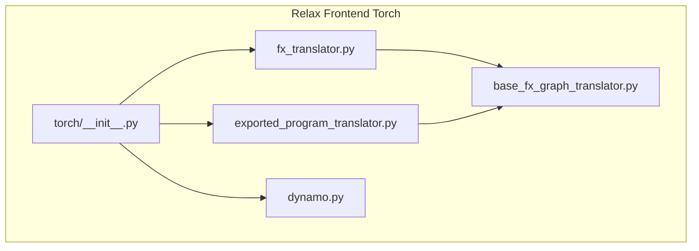
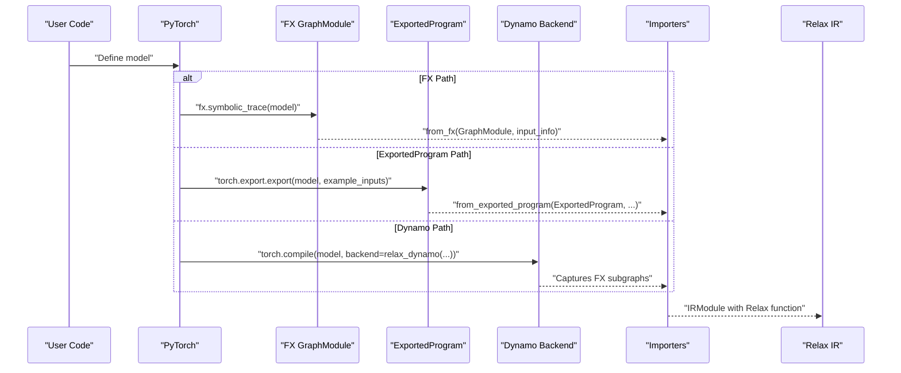
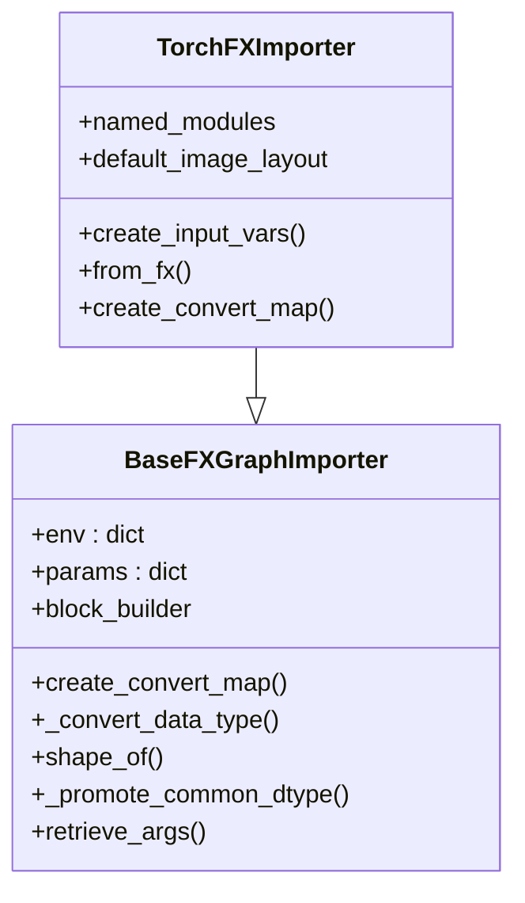
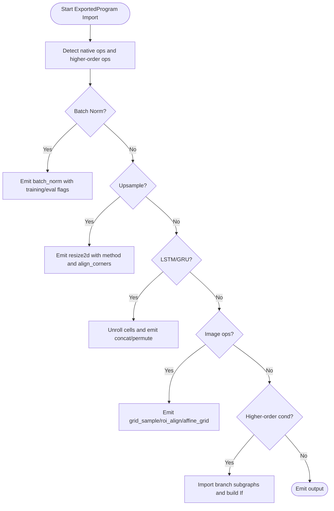
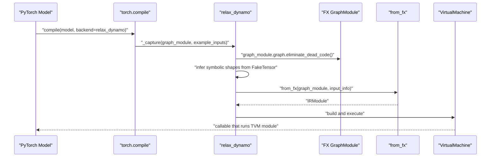
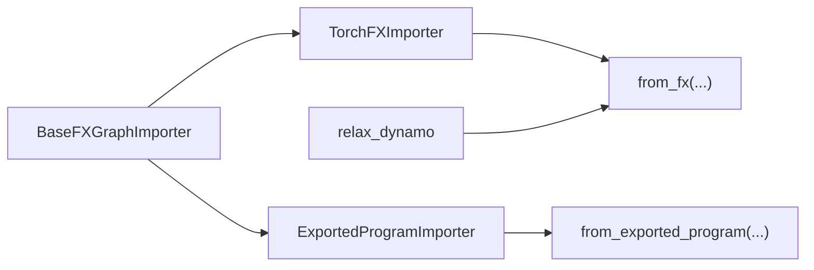

# PyTorch Frontend

<cite>
**Referenced Files in This Document**
- [__init__.py](file://python/tvm/relax/frontend/torch/__init__.py)
- [base_fx_graph_translator.py](file://python/tvm/relax/frontend/torch/base_fx_graph_translator.py)
- [fx_translator.py](file://python/tvm/relax/frontend/torch/fx_translator.py)
- [exported_program_translator.py](file://python/tvm/relax/frontend/torch/exported_program_translator.py)
- [dynamo.py](file://python/tvm/relax/frontend/torch/dynamo.py)
- [import_model.py](file://docs/how_to/tutorials/import_model.py)
- [test_frontend_dynamo.py](file://tests/python/relax/test_frontend_dynamo.py)
- [test_frontend_from_exported_program.py](file://tests/python/relax/test_frontend_from_exported_program.py)
</cite>

## Table of Contents
1. [Introduction](#introduction)
2. [Project Structure](#project-structure)
3. [Core Components](#core-components)
4. [Architecture Overview](#architecture-overview)
5. [Detailed Component Analysis](#detailed-component-analysis)
6. [Dependency Analysis](#dependency-analysis)
7. [Performance Considerations](#performance-considerations)
8. [Troubleshooting Guide](#troubleshooting-guide)
9. [Conclusion](#conclusion)
10. [Appendices](#appendices)

## Introduction
This document explains the PyTorch frontend adapter for importing PyTorch models into TVM’s Relax IR. It covers three primary import pathways:
- FX graph translation from PyTorch FX GraphModule
- ExportedProgram translation from torch.export
- Dynamo integration for dynamic graph tracing

It details how PyTorch tensors and operations are mapped to Relax IR constructs, including operator coverage, shape inference, parameter handling, and dynamic shape support. Practical examples demonstrate basic imports, handling unsupported operators, and managing dynamic shapes. The document also provides configuration options, debugging techniques, optimization strategies, and performance best practices for successful PyTorch model interoperability.

## Project Structure
The PyTorch frontend resides under the Relax frontend package and exposes a unified interface for importing PyTorch models. The key modules are:
- torch/__init__.py: Public API exports for import functions
- base_fx_graph_translator.py: Shared base importer logic and utilities
- fx_translator.py: FX GraphModule importer
- exported_program_translator.py: ExportedProgram importer
- dynamo.py: Dynamo backend and subgraph capture helpers

**Diagram sources**
- [__init__.py:18-25](file://python/tvm/relax/frontend/torch/__init__.py#L18-L25)
- [base_fx_graph_translator.py:32-47](file://python/tvm/relax/frontend/torch/base_fx_graph_translator.py#L32-L47)
- [fx_translator.py:31-47](file://python/tvm/relax/frontend/torch/fx_translator.py#L31-L47)
- [exported_program_translator.py:37-47](file://python/tvm/relax/frontend/torch/exported_program_translator.py#L37-L47)
- [dynamo.py:23-29](file://python/tvm/relax/frontend/torch/dynamo.py#L23-L29)

**Section sources**
- [__init__.py:18-25](file://python/tvm/relax/frontend/torch/__init__.py#L18-L25)

## Core Components
- BaseFXGraphImporter: Provides shared utilities, dtype conversion, shape inference helpers, common ops, and the base convert_map registry. It manages the environment mapping from FX nodes to Relax expressions and parameters.
- TorchFXImporter: Extends the base importer with PyTorch-specific module and function conversions, including activations, normalization, convolution variants, pooling, attention, and tensor manipulations.
- ExportedProgramImporter: Specializes for torch.export’s ExportedProgram, handling native batch norm variants, functional norms, upsampling modes, LSTM/GRU unrolling, higher-order ops (cond), and image ops like grid_sample and roi_align.
- Dynamo backend: Bridges torch.compile with TVM by capturing FX subgraphs, inferring symbolic shapes, building Relax modules, and executing via VirtualMachine.

Key capabilities:
- Operator mapping: Comprehensive coverage of PyTorch ATen ops and module types to Relax equivalents
- Shape inference: Uses symbolic variables for dynamic shapes and simplifies common slice patterns
- Parameter handling: Supports keeping parameters as inputs or embedding them as constants
- Dynamic shapes: Leverages FX symbolic shapes and SizeVar propagation
- Debugging hooks: Custom convert maps for unsupported ops and assertion-based checks

**Section sources**
- [base_fx_graph_translator.py:32-47](file://python/tvm/relax/frontend/torch/base_fx_graph_translator.py#L32-L47)
- [fx_translator.py:31-47](file://python/tvm/relax/frontend/torch/fx_translator.py#L31-L47)
- [exported_program_translator.py:37-47](file://python/tvm/relax/frontend/torch/exported_program_translator.py#L37-L47)
- [dynamo.py:38-142](file://python/tvm/relax/frontend/torch/dynamo.py#L38-L142)

## Architecture Overview
The frontend translates PyTorch models through three pathways, converging on Relax IR:

**Diagram sources**
- [fx_translator.py:1059-1166](file://python/tvm/relax/frontend/torch/fx_translator.py#L1059-L1166)
- [exported_program_translator.py:1474-1599](file://python/tvm/relax/frontend/torch/exported_program_translator.py#L1474-L1599)
- [dynamo.py:52-142](file://python/tvm/relax/frontend/torch/dynamo.py#L52-L142)

## Detailed Component Analysis

### FX Graph Translator (TorchFXImporter)
Responsibilities:
- Convert FX GraphModule to Relax IR
- Map PyTorch module types and function/operator calls to Relax ops
- Manage inputs, parameters, and output handling
- Support dynamic shapes via symbolic sizes

Highlights:
- Input creation and parameter embedding/keeping
- Module-to-op mapping for activations, normalization, convolutions, pooling, attention, and tensor manipulations
- Utility functions for dtype promotion, shape retrieval, and common op patterns

**Diagram sources**
- [base_fx_graph_translator.py:32-47](file://python/tvm/relax/frontend/torch/base_fx_graph_translator.py#L32-L47)
- [fx_translator.py:31-47](file://python/tvm/relax/frontend/torch/fx_translator.py#L31-L47)

**Section sources**
- [fx_translator.py:1059-1166](file://python/tvm/relax/frontend/torch/fx_translator.py#L1059-L1166)
- [fx_translator.py:1169-1282](file://python/tvm/relax/frontend/torch/fx_translator.py#L1169-L1282)

### ExportedProgram Translator (ExportedProgramImporter)
Responsibilities:
- Translate torch.export.ExportProgram to Relax IR
- Handle native batch norm variants, functional norms, upsampling, LSTM/GRU unrolling, higher-order ops (cond), and image ops

Highlights:
- Sparse tensor handling (fallback to dense)
- Native batch norm training vs eval handling
- Upsampling with multiple modes and alignment options
- LSTM/GRU cell unrolling with directional support
- Grid sampling, ROI align, affine grid generation
- Branch subgraph import with fresh symbolic vars

**Diagram sources**
- [exported_program_translator.py:1288-1471](file://python/tvm/relax/frontend/torch/exported_program_translator.py#L1288-L1471)

**Section sources**
- [exported_program_translator.py:1474-1599](file://python/tvm/relax/frontend/torch/exported_program_translator.py#L1474-L1599)
- [exported_program_translator.py:1302-1342](file://python/tvm/relax/frontend/torch/exported_program_translator.py#L1302-L1342)

### Dynamo Integration (relax_dynamo and subgraph capture)
Responsibilities:
- Provide a Dynamo backend that converts FX subgraphs to Relax
- Capture subgraphs during torch.compile and produce an IRModule
- Infer symbolic shapes from FakeTensor metadata
- Build and execute via VirtualMachine

**Diagram sources**
- [dynamo.py:52-142](file://python/tvm/relax/frontend/torch/dynamo.py#L52-L142)
- [dynamo.py:145-194](file://python/tvm/relax/frontend/torch/dynamo.py#L145-L194)

**Section sources**
- [dynamo.py:38-142](file://python/tvm/relax/frontend/torch/dynamo.py#L38-L142)
- [dynamo.py:145-194](file://python/tvm/relax/frontend/torch/dynamo.py#L145-L194)

### Translation Process: PyTorch Tensors and Operations to Relax IR
- Tensors: Dtype conversion, CPU detachment, and DLPack fallback to TVM tensors
- Shapes: Symbolic shape variables propagate through FX metadata; special-cased identity slices to aid simplification
- Parameters: Embedded as constants or kept as function inputs depending on flags
- Operators: Module types (e.g., nn.Conv2d) and function/operator names (e.g., aten.relu) mapped to Relax ops

Examples of mappings:
- Activations: relu, sigmoid, tanh, leaky_relu, gelu, hard* variants
- Normalization: batch_norm, layer_norm, group_norm, instance_norm
- Convolutions: conv1d/2d/3d and transposed variants
- Pooling: adaptive_avg_pool, avg_pool, max_pool
- Attention: scaled_dot_product_attention
- Manipulation: reshape, permute, split, stack, gather, scatter, one_hot, masked_scatter

**Section sources**
- [base_fx_graph_translator.py:62-102](file://python/tvm/relax/frontend/torch/base_fx_graph_translator.py#L62-L102)
- [base_fx_graph_translator.py:169-186](file://python/tvm/relax/frontend/torch/base_fx_graph_translator.py#L169-L186)
- [fx_translator.py:789-1057](file://python/tvm/relax/frontend/torch/fx_translator.py#L789-L1057)
- [exported_program_translator.py:1474-1599](file://python/tvm/relax/frontend/torch/exported_program_translator.py#L1474-L1599)

## Dependency Analysis
The importer architecture exhibits clear separation of concerns:
- Base importer provides shared utilities and convert_map
- FX importer specializes for module/function/operator names
- ExportedProgram importer adds ExportProgram-specific logic
- Dynamo backend depends on FX importer and integrates with torch.compile

**Diagram sources**
- [base_fx_graph_translator.py:32-47](file://python/tvm/relax/frontend/torch/base_fx_graph_translator.py#L32-L47)
- [fx_translator.py:31-47](file://python/tvm/relax/frontend/torch/fx_translator.py#L31-L47)
- [exported_program_translator.py:37-47](file://python/tvm/relax/frontend/torch/exported_program_translator.py#L37-L47)
- [dynamo.py:28-29](file://python/tvm/relax/frontend/torch/dynamo.py#L28-L29)

**Section sources**
- [__init__.py:22-24](file://python/tvm/relax/frontend/torch/__init__.py#L22-L24)

## Performance Considerations
- Keep parameters as inputs: Useful for model reuse and weight updates but increases function arity; consider detaching parameters afterward to reduce overhead.
- Pipeline selection: Choose appropriate Relax optimization pipeline for deployment target.
- Target selection: CPU vs GPU target affects runtime dispatch; ensure correct device mapping.
- Shape simplification: Identity slice patterns are optimized to avoid unnecessary symbolic expressions.
- Sparse tensors: Converted to dense; consider avoiding sparse-heavy models or preprocessing to dense.

[No sources needed since this section provides general guidance]

## Troubleshooting Guide
Common issues and remedies:
- Unsupported operator: Use a custom convert map to register a handler for the missing op name.
- Dtype mismatches: Ensure dtype conversion is consistent; the importer promotes dtypes according to PyTorch rules.
- Dynamic shapes: Verify symbolic sizes are propagated; identity slices are simplified to avoid complex PrimExpr forms.
- Higher-order ops: cond is supported; ensure operands and branches are properly handled.
- Sparse tensors: Automatic conversion to dense; confirm downstream ops support dense tensors.

Practical references:
- Custom operator registration via custom_convert_map
- Example of handling unsupported operators with a custom converter
- Unit tests demonstrating custom op handling and subgraph capture

**Section sources**
- [base_fx_graph_translator.py:51-61](file://python/tvm/relax/frontend/torch/base_fx_graph_translator.py#L51-L61)
- [exported_program_translator.py:1474-1599](file://python/tvm/relax/frontend/torch/exported_program_translator.py#L1474-L1599)
- [test_frontend_from_exported_program.py:6684-6715](file://tests/python/relax/test_frontend_from_exported_program.py#L6684-L6715)
- [test_frontend_dynamo.py:295-309](file://tests/python/relax/test_frontend_dynamo.py#L295-L309)

## Conclusion
The PyTorch frontend adapter provides robust, multi-path import from PyTorch to Relax IR. By leveraging FX graphs, ExportedProgram, and Dynamo integration, it supports a wide range of operators, dynamic shapes, and advanced features like higher-order control flow. With configurable parameter handling, custom operator support, and strong debugging hooks, it enables reliable model interoperability across diverse deployment targets.

[No sources needed since this section summarizes without analyzing specific files]

## Appendices

### Practical Examples

- Basic import using torch.export and from_exported_program
  - Steps: export model, import to Relax, detach parameters
  - Reference: [import_model.py:80-95](file://docs/how_to/tutorials/import_model.py#L80-L95)

- Handling unsupported operators with custom_convert_map
  - Register a handler for a missing op name and return a Relax Var
  - Reference: [import_model.py:118-144](file://docs/how_to/tutorials/import_model.py#L118-L144)

- Dynamo backend usage for dynamic tracing
  - Use relax_dynamo as backend for torch.compile
  - Reference: [dynamo.py:38-142](file://python/tvm/relax/frontend/torch/dynamo.py#L38-L142)

- Subgraph capture with dynamo_capture_subgraphs
  - Capture FX subgraphs into an IRModule
  - Reference: [dynamo.py:145-194](file://python/tvm/relax/frontend/torch/dynamo.py#L145-L194)

### Frontend Configuration Options
- keep_params_as_input: Whether to keep model parameters as function inputs
- unwrap_unit_return_tuple: Unwrap single-element return tuples
- no_bind_return_tuple: Do not bind return tuple to a variable
- custom_convert_map: Map of op names to custom converter functions
- default_image_layout: Default layout for image operations (e.g., "NCHW")

References:
- [fx_translator.py:1059-1166](file://python/tvm/relax/frontend/torch/fx_translator.py#L1059-L1166)
- [exported_program_translator.py:1474-1599](file://python/tvm/relax/frontend/torch/exported_program_translator.py#L1474-L1599)