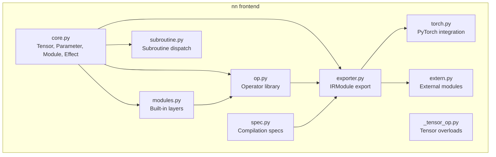
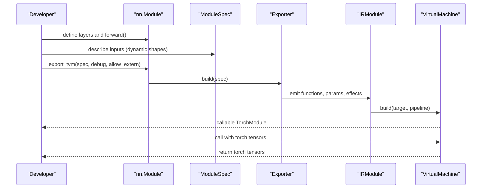
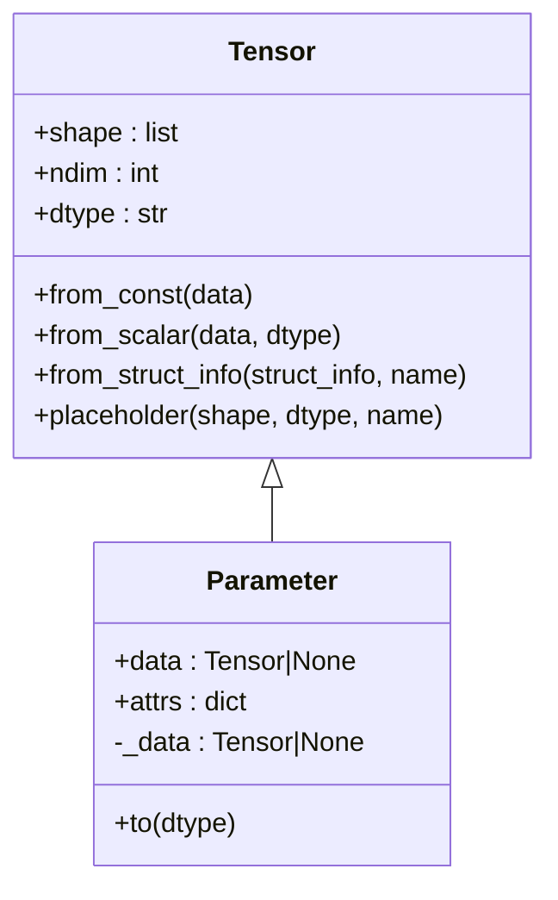
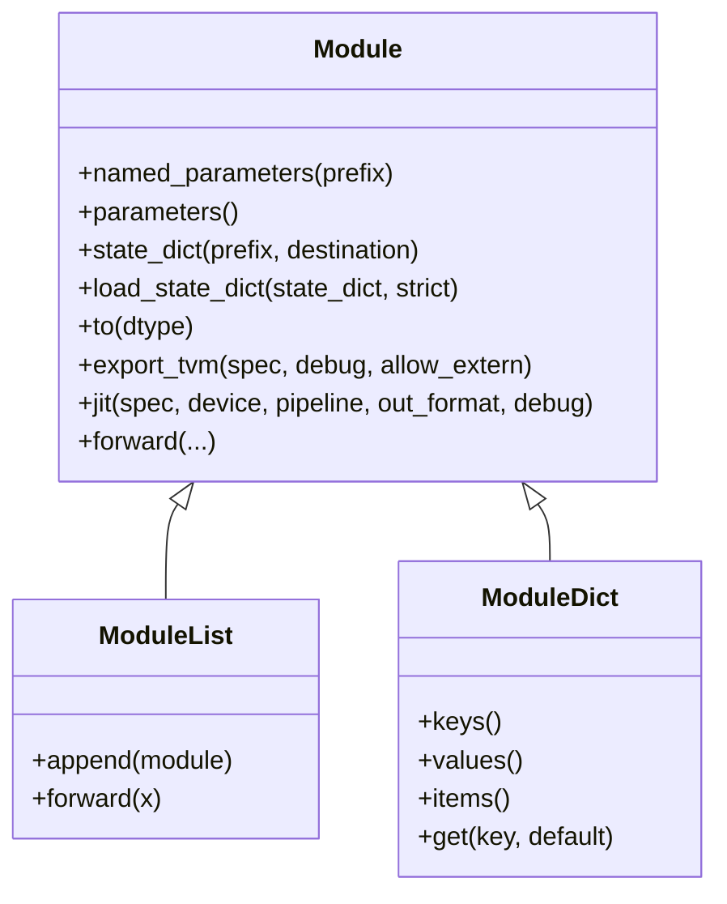
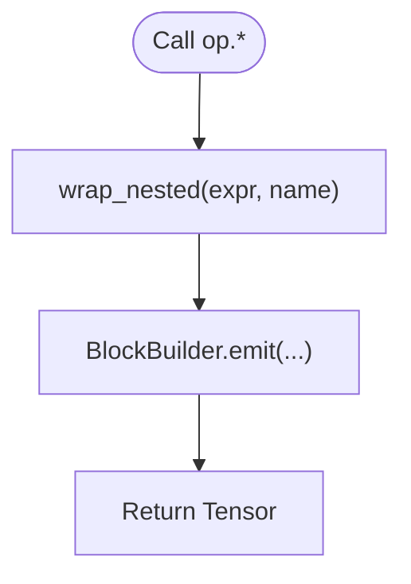
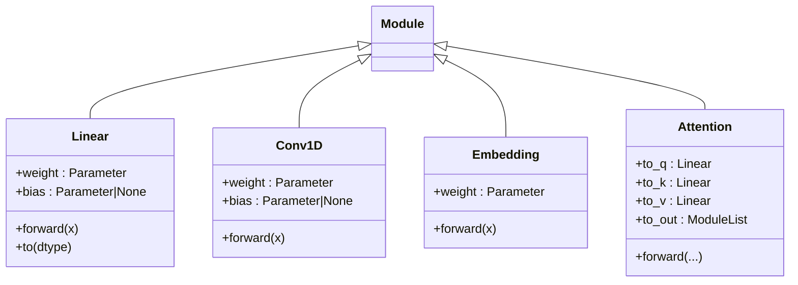
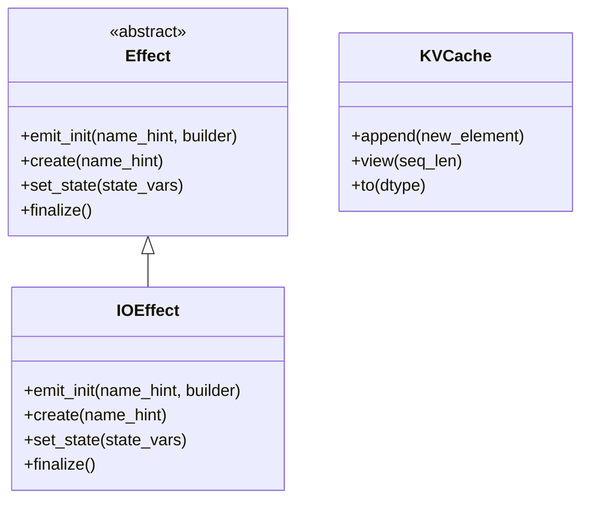
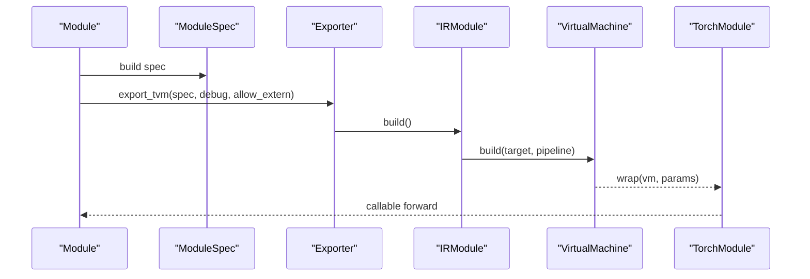
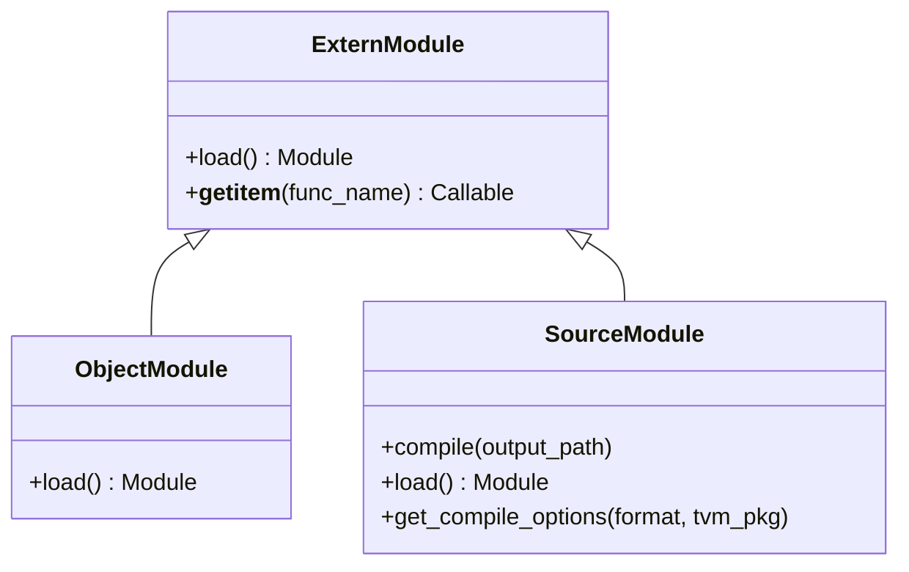
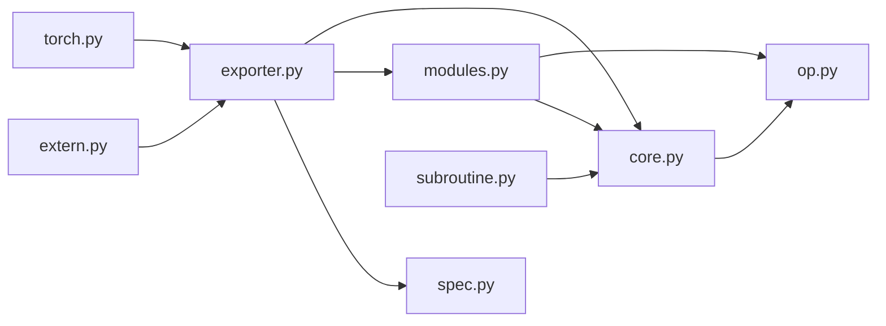

# Relax NN Frontend

<cite>
**Referenced Files in This Document**
- [__init__.py](file://python/tvm/relax/frontend/nn/__init__.py)
- [core.py](file://python/tvm/relax/frontend/nn/core.py)
- [modules.py](file://python/tvm/relax/frontend/nn/modules.py)
- [op.py](file://python/tvm/relax/frontend/nn/op.py)
- [_tensor_op.py](file://python/tvm/relax/frontend/nn/_tensor_op.py)
- [spec.py](file://python/tvm/relax/frontend/nn/spec.py)
- [exporter.py](file://python/tvm/relax/frontend/nn/exporter.py)
- [torch.py](file://python/tvm/relax/frontend/nn/torch.py)
- [subroutine.py](file://python/tvm/relax/frontend/nn/subroutine.py)
- [extern.py](file://python/tvm/relax/frontend/nn/extern.py)
</cite>

## Table of Contents
1. [Introduction](#introduction)
2. [Project Structure](#project-structure)
3. [Core Components](#core-components)
4. [Architecture Overview](#architecture-overview)
5. [Detailed Component Analysis](#detailed-component-analysis)
6. [Dependency Analysis](#dependency-analysis)
7. [Performance Considerations](#performance-considerations)
8. [Troubleshooting Guide](#troubleshooting-guide)
9. [Conclusion](#conclusion)
10. [Appendices](#appendices)

## Introduction
This document explains the Relax NN frontend, a high-level neural network construction interface built on top of TVM’s Relax IR. It provides:
- A PyTorch-like module system for organizing model components
- A rich operator library for common neural network operations
- A translation path from high-level constructs to Relax IR
- Parameter management and JIT compilation with PyTorch compatibility
- Practical examples, configuration options, debugging techniques, and performance guidance

## Project Structure
The Relax NN frontend lives under python/tvm/relax/frontend/nn and is organized into cohesive modules:
- nn/__init__.py: Public API surface exposing core classes, modules, ops, and helpers
- core.py: Fundamental types (Tensor, Parameter, Module, Effect) and utilities
- modules.py: Built-in neural network modules (Linear, ConvNd, Norm layers, KVCache, etc.)
- op.py: Operator library wrapping Relax ops with convenience APIs
- _tensor_op.py: Operator overloading for Tensor
- spec.py: Compilation specifications for dynamic shapes and method signatures
- exporter.py: Translates nn.Module to IRModule and manages effects and externs
- torch.py: PyTorch integration for input/output and JIT execution
- subroutine.py: Subroutine generation and caching for modular computation graphs
- extern.py: External module integration for custom kernels

**Diagram sources**
- [core.py:90-188](file://python/tvm/relax/frontend/nn/core.py#L90-L188)
- [modules.py:97-161](file://python/tvm/relax/frontend/nn/modules.py#L97-L161)
- [op.py:40-108](file://python/tvm/relax/frontend/nn/op.py#L40-L108)
- [_tensor_op.py:41-105](file://python/tvm/relax/frontend/nn/_tensor_op.py#L41-L105)
- [spec.py:194-258](file://python/tvm/relax/frontend/nn/spec.py#L194-L258)
- [exporter.py:46-144](file://python/tvm/relax/frontend/nn/exporter.py#L46-L144)
- [torch.py:33-87](file://python/tvm/relax/frontend/nn/torch.py#L33-L87)
- [subroutine.py:67-184](file://python/tvm/relax/frontend/nn/subroutine.py#L67-L184)
- [extern.py:36-79](file://python/tvm/relax/frontend/nn/extern.py#L36-L79)

**Section sources**
- [__init__.py:20-44](file://python/tvm/relax/frontend/nn/__init__.py#L20-L44)
- [core.py:90-188](file://python/tvm/relax/frontend/nn/core.py#L90-L188)
- [modules.py:97-161](file://python/tvm/relax/frontend/nn/modules.py#L97-L161)
- [op.py:40-108](file://python/tvm/relax/frontend/nn/op.py#L40-L108)
- [_tensor_op.py:41-105](file://python/tvm/relax/frontend/nn/_tensor_op.py#L41-L105)
- [spec.py:194-258](file://python/tvm/relax/frontend/nn/spec.py#L194-L258)
- [exporter.py:46-144](file://python/tvm/relax/frontend/nn/exporter.py#L46-L144)
- [torch.py:33-87](file://python/tvm/relax/frontend/nn/torch.py#L33-L87)
- [subroutine.py:67-184](file://python/tvm/relax/frontend/nn/subroutine.py#L67-L184)
- [extern.py:36-79](file://python/tvm/relax/frontend/nn/extern.py#L36-L79)

## Core Components
- Tensor: Symbolic tensor wrapper over Relax expressions with eager shape/dtype inference
- Parameter: Specialized Tensor for trainable weights; supports binding/unbinding and dtype conversion
- Module: Base class for neural network components; supports nested composition, parameter iteration, state_dict, and JIT export
- Effect: Side-effect carriers (e.g., IO, KVCache); integrated into exported functions
- IOEffect: Debugging effect enabling print-like operations in compiled graphs
- KVCache: Managed effect for attention KV caches with append/view semantics
- SubroutineMixin: Generates reusable subroutines for modular computation graphs

Key capabilities:
- Parameter management via state_dict/load_state_dict
- Dynamic shape support via symbolic shapes and ModuleSpec
- Export to IRModule with optional effects and external modules
- JIT compilation to TVM VirtualMachine with PyTorch tensor I/O

**Section sources**
- [core.py:90-188](file://python/tvm/relax/frontend/nn/core.py#L90-L188)
- [core.py:235-310](file://python/tvm/relax/frontend/nn/core.py#L235-L310)
- [core.py:354-576](file://python/tvm/relax/frontend/nn/core.py#L354-L576)
- [core.py:328-353](file://python/tvm/relax/frontend/nn/core.py#L328-L353)
- [core.py:312-327](file://python/tvm/relax/frontend/nn/core.py#L312-L327)
- [subroutine.py:67-184](file://python/tvm/relax/frontend/nn/subroutine.py#L67-L184)

## Architecture Overview
High-level flow from Python module to compiled Relax VM:
1. Define nn.Module subclasses with Parameter attributes and forward logic
2. Build ModuleSpec describing method signatures and dynamic shapes
3. Export to IRModule via Exporter; emit effects and parameters
4. Attach external modules if needed
5. Compile with Relax pipeline to VM Executable
6. Wrap with TorchModule for PyTorch-compatible I/O

**Diagram sources**
- [core.py:460-503](file://python/tvm/relax/frontend/nn/core.py#L460-L503)
- [exporter.py:87-144](file://python/tvm/relax/frontend/nn/exporter.py#L87-L144)
- [torch.py:33-87](file://python/tvm/relax/frontend/nn/torch.py#L33-L87)

## Detailed Component Analysis

### Tensor and Parameter
- Tensor encapsulates a Relax expression with TensorStructInfo, exposes shape/dtype, and supports operator overloading via _TensorOp
- Parameter extends Tensor with binding semantics and dtype conversion guardrails

**Diagram sources**
- [core.py:90-188](file://python/tvm/relax/frontend/nn/core.py#L90-L188)
- [core.py:235-310](file://python/tvm/relax/frontend/nn/core.py#L235-L310)
- [_tensor_op.py:41-105](file://python/tvm/relax/frontend/nn/_tensor_op.py#L41-L105)

**Section sources**
- [core.py:90-188](file://python/tvm/relax/frontend/nn/core.py#L90-L188)
- [core.py:235-310](file://python/tvm/relax/frontend/nn/core.py#L235-L310)
- [_tensor_op.py:29-39](file://python/tvm/relax/frontend/nn/_tensor_op.py#L29-L39)

### Module System
- Module provides parameter iteration, state_dict, load_state_dict, dtype conversion, export_tvm, and jit
- ModuleList and ModuleDict compose modules in list/dict containers
- SubroutineMixin auto-generates subroutines for modular graphs

**Diagram sources**
- [core.py:354-576](file://python/tvm/relax/frontend/nn/core.py#L354-L576)
- [subroutine.py:67-184](file://python/tvm/relax/frontend/nn/subroutine.py#L67-L184)

**Section sources**
- [core.py:354-576](file://python/tvm/relax/frontend/nn/core.py#L354-L576)
- [subroutine.py:67-184](file://python/tvm/relax/frontend/nn/subroutine.py#L67-L184)

### Operator Library
- op.py exposes convenience wrappers around Relax ops (add, sub, mul, matmul, conv1d/2d/3d, transpose conv, norms, reductions, etc.)
- Operators return nn.Tensor and integrate with BlockBuilder emission via wrap_nested

**Diagram sources**
- [op.py:40-108](file://python/tvm/relax/frontend/nn/op.py#L40-L108)
- [core.py:661-691](file://python/tvm/relax/frontend/nn/core.py#L661-L691)

**Section sources**
- [op.py:40-108](file://python/tvm/relax/frontend/nn/op.py#L40-L108)
- [op.py:318-351](file://python/tvm/relax/frontend/nn/op.py#L318-L351)
- [op.py:353-502](file://python/tvm/relax/frontend/nn/op.py#L353-L502)
- [core.py:661-691](file://python/tvm/relax/frontend/nn/core.py#L661-L691)

### Built-in Modules
- Linear, Conv1D/2D/3D, ConvTranspose1D, LayerNorm, RMSNorm, GroupNorm, Embedding, Attention, Timesteps, TimestepEmbedding
- Each module initializes Parameter attributes and implements forward using op.* functions

**Diagram sources**
- [modules.py:97-173](file://python/tvm/relax/frontend/nn/modules.py#L97-L173)
- [modules.py:175-260](file://python/tvm/relax/frontend/nn/modules.py#L175-L260)
- [modules.py:916-965](file://python/tvm/relax/frontend/nn/modules.py#L916-L965)
- [modules.py:1088-1200](file://python/tvm/relax/frontend/nn/modules.py#L1088-L1200)

**Section sources**
- [modules.py:97-173](file://python/tvm/relax/frontend/nn/modules.py#L97-L173)
- [modules.py:175-260](file://python/tvm/relax/frontend/nn/modules.py#L175-L260)
- [modules.py:916-965](file://python/tvm/relax/frontend/nn/modules.py#L916-L965)
- [modules.py:1088-1200](file://python/tvm/relax/frontend/nn/modules.py#L1088-L1200)

### Effects and KVCache
- IOEffect enables debug prints inside compiled graphs
- KVCache manages attention key/value cache with append/view semantics

**Diagram sources**
- [core.py:328-353](file://python/tvm/relax/frontend/nn/core.py#L328-L353)
- [modules.py:30-56](file://python/tvm/relax/frontend/nn/modules.py#L30-L56)
- [modules.py:751-914](file://python/tvm/relax/frontend/nn/modules.py#L751-L914)

**Section sources**
- [core.py:328-353](file://python/tvm/relax/frontend/nn/core.py#L328-L353)
- [modules.py:30-56](file://python/tvm/relax/frontend/nn/modules.py#L30-L56)
- [modules.py:751-914](file://python/tvm/relax/frontend/nn/modules.py#L751-L914)

### Export Pipeline and JIT
- Exporter translates a ModuleSpec into IRModule, emitting parameters and effects
- JIT compiles IRModule to VM Executable and wraps with TorchModule for PyTorch tensors

**Diagram sources**
- [core.py:460-503](file://python/tvm/relax/frontend/nn/core.py#L460-L503)
- [exporter.py:87-144](file://python/tvm/relax/frontend/nn/exporter.py#L87-L144)
- [torch.py:33-87](file://python/tvm/relax/frontend/nn/torch.py#L33-L87)

**Section sources**
- [exporter.py:46-144](file://python/tvm/relax/frontend/nn/exporter.py#L46-L144)
- [core.py:505-576](file://python/tvm/relax/frontend/nn/core.py#L505-L576)
- [torch.py:33-87](file://python/tvm/relax/frontend/nn/torch.py#L33-L87)

### External Modules
- ExternModule integrates custom kernels via object files or source compilation
- SourceModule compiles C++/CUDA sources and attaches symbols with shape/dtype inference

**Diagram sources**
- [extern.py:36-79](file://python/tvm/relax/frontend/nn/extern.py#L36-L79)
- [extern.py:81-101](file://python/tvm/relax/frontend/nn/extern.py#L81-L101)
- [extern.py:103-167](file://python/tvm/relax/frontend/nn/extern.py#L103-L167)

**Section sources**
- [extern.py:36-79](file://python/tvm/relax/frontend/nn/extern.py#L36-L79)
- [extern.py:103-167](file://python/tvm/relax/frontend/nn/extern.py#L103-L167)

## Dependency Analysis
- core.py depends on Relax IR and BlockBuilder to construct expressions and manage struct info
- modules.py composes Parameter and op.* to implement layers
- op.py wraps Relax ops and relies on BlockBuilder emission
- exporter.py orchestrates export, effects, and extern modules
- torch.py bridges PyTorch tensors to/from TVM runtime tensors
- subroutine.py integrates with BlockBuilder to generate and cache subroutines

**Diagram sources**
- [core.py:46-55](file://python/tvm/relax/frontend/nn/core.py#L46-L55)
- [op.py:32-35](file://python/tvm/relax/frontend/nn/op.py#L32-L35)
- [modules.py:23-27](file://python/tvm/relax/frontend/nn/modules.py#L23-L27)
- [exporter.py:27-32](file://python/tvm/relax/frontend/nn/exporter.py#L27-L32)
- [torch.py:25-31](file://python/tvm/relax/frontend/nn/torch.py#L25-L31)
- [extern.py:27-33](file://python/tvm/relax/frontend/nn/extern.py#L27-L33)
- [subroutine.py:27-29](file://python/tvm/relax/frontend/nn/subroutine.py#L27-L29)

**Section sources**
- [core.py:46-55](file://python/tvm/relax/frontend/nn/core.py#L46-L55)
- [op.py:32-35](file://python/tvm/relax/frontend/nn/op.py#L32-L35)
- [modules.py:23-27](file://python/tvm/relax/frontend/nn/modules.py#L23-L27)
- [exporter.py:27-32](file://python/tvm/relax/frontend/nn/exporter.py#L27-L32)
- [torch.py:25-31](file://python/tvm/relax/frontend/nn/torch.py#L25-L31)
- [extern.py:27-33](file://python/tvm/relax/frontend/nn/extern.py#L27-L33)
- [subroutine.py:27-29](file://python/tvm/relax/frontend/nn/subroutine.py#L27-L29)

## Performance Considerations
- Mixed precision: Linear supports out_dtype to accumulate in higher precision while keeping weights lightweight
- Subroutine caching: SubroutineMixin avoids redundant emission for equivalent signatures
- Layout and shape: Prefer NHWC/NCHW layouts aligned with backend; leverage symbolic shapes to reduce recompilations
- External kernels: Use SourceModule to integrate tuned kernels; ensure DPS calling convention and accurate shape/dtype inference
- JIT pipeline: Choose appropriate pipeline (“default_build”) and target for device-specific optimizations

[No sources needed since this section provides general guidance]

## Troubleshooting Guide
Common issues and remedies:
- Parameter not set: When JIT-ing, ensure all Parameter.data is bound; otherwise, an error is raised
- Dtype mismatch: Converting Parameter with bound data is discouraged; unbind or adjust dtype before binding
- Duplicate extern symbols: add_extern requires unique symbol names across modules
- Argument count/type mismatch: TorchModule validates method signatures; ensure torch tensors and ints match MethodSpec

**Section sources**
- [core.py:744-757](file://python/tvm/relax/frontend/nn/core.py#L744-L757)
- [core.py:298-310](file://python/tvm/relax/frontend/nn/core.py#L298-L310)
- [exporter.py:75-86](file://python/tvm/relax/frontend/nn/exporter.py#L75-L86)
- [torch.py:67-87](file://python/tvm/relax/frontend/nn/torch.py#L67-L87)

## Conclusion
The Relax NN frontend offers a robust, PyTorch-like interface to define neural networks, manage parameters, and export to optimized Relax IR. With built-in modules, operator library, effects, and external module integration, it supports both rapid prototyping and production-grade deployment. Proper use of ModuleSpec, JIT compilation, and subroutine caching yields efficient, portable models.

[No sources needed since this section summarizes without analyzing specific files]

## Appendices

### Practical Examples and Patterns
- Building a feed-forward network: Compose Linear and activation modules; export_tvm with ModuleSpec describing dynamic batch and sequence dimensions
- Custom layer: Subclass Module, initialize Parameter attributes, implement forward using op.*; optionally enable define_subroutine for subroutine generation
- PyTorch compatibility: Use jit(..., out_format="torch") to accept and return torch tensors seamlessly
- External kernels: Use SourceModule to compile and attach custom kernels; provide symbols with shape/dtype inference

[No sources needed since this section provides general guidance]

### Frontend Configuration Options
- Default dtype: get_default_dtype/set_default_dtype control Parameter default dtype
- ModuleSpec modes: param_mode and effect_mode control parameter packing and effect handling
- JIT pipeline: pipeline argument selects the Relax compilation pipeline
- TorchModule: out_format controls output wrapper

**Section sources**
- [core.py:67-88](file://python/tvm/relax/frontend/nn/core.py#L67-L88)
- [spec.py:96-113](file://python/tvm/relax/frontend/nn/spec.py#L96-L113)
- [core.py:505-576](file://python/tvm/relax/frontend/nn/core.py#L505-L576)
- [torch.py:33-87](file://python/tvm/relax/frontend/nn/torch.py#L33-L87)