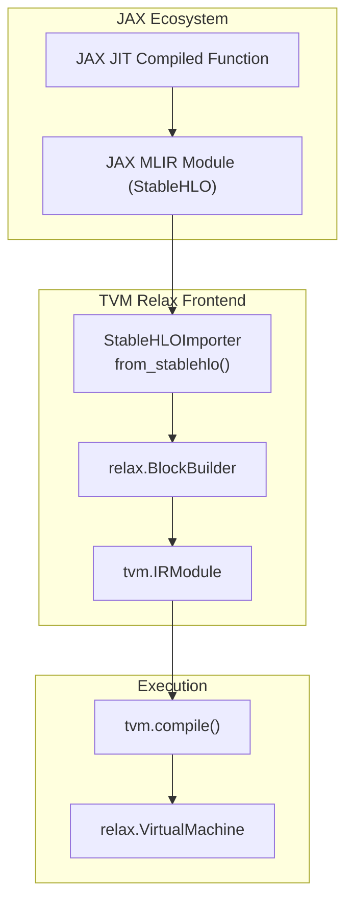
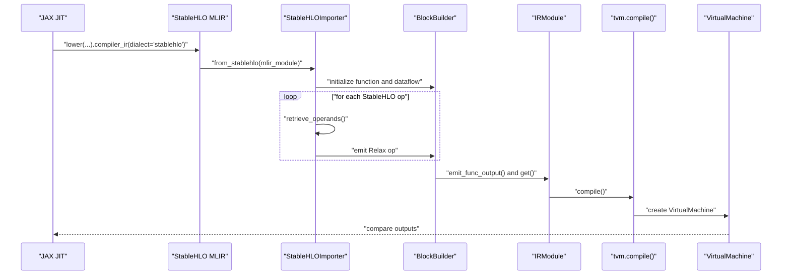
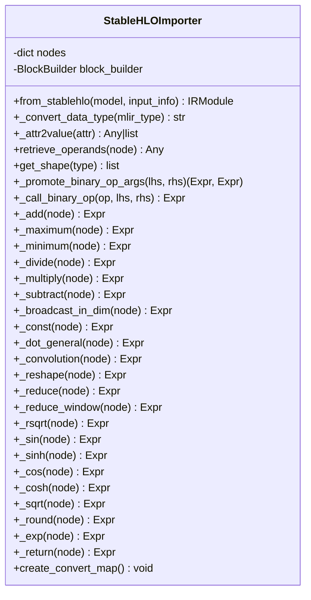
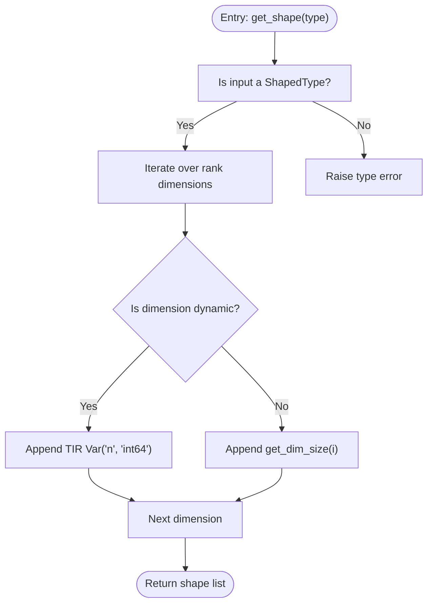
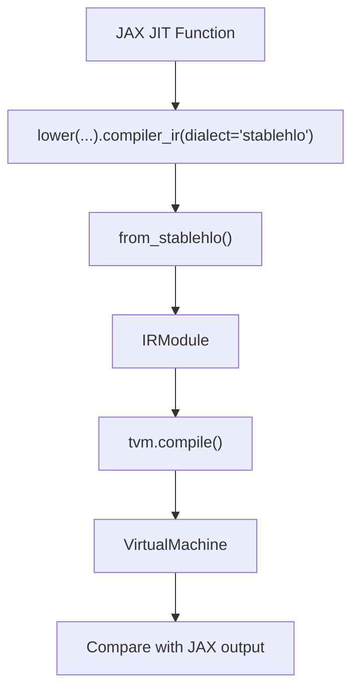
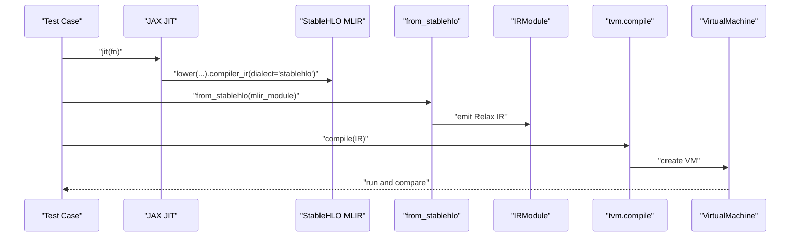
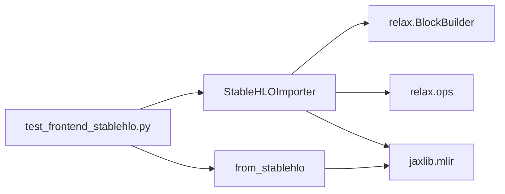

# StableHLO Frontend

<cite>
**Referenced Files in This Document**
- [stablehlo_translator.py](file://python/tvm/relax/frontend/stablehlo/stablehlo_translator.py)
- [__init__.py](file://python/tvm/relax/frontend/stablehlo/__init__.py)
- [test_frontend_stablehlo.py](file://tests/python/relax/test_frontend_stablehlo.py)
- [block_builder.py](file://python/tvm/relax/block_builder.py)
- [common.py](file://python/tvm/relax/frontend/common.py)
</cite>

## Table of Contents
1. [Introduction](#introduction)
2. [Project Structure](#project-structure)
3. [Core Components](#core-components)
4. [Architecture Overview](#architecture-overview)
5. [Detailed Component Analysis](#detailed-component-analysis)
6. [Dependency Analysis](#dependency-analysis)
7. [Performance Considerations](#performance-considerations)
8. [Troubleshooting Guide](#troubleshooting-guide)
9. [Conclusion](#conclusion)
10. [Appendices](#appendices)

## Introduction
This document describes the StableHLO frontend adapter that enables importing JAX models into the TVM Relax IR via the StableHLO dialect. It explains the StableHLO parsing pipeline, operator mapping from StableHLO to Relax, JAX ecosystem integration, shape inference for dynamic operations, parameter management, and practical guidance for handling JIT compilation artifacts and unsupported operations. It also covers configuration options, debugging techniques for translation failures, optimization strategies, and best practices for successful JAX model interoperability in the TVM ecosystem.

## Project Structure
The StableHLO frontend resides under the Relax frontend package and integrates with TVM’s IR and Relax infrastructure:
- StableHLO importer and conversion entry point
- Test suite validating correctness against JAX JIT outputs
- Relax BlockBuilder for constructing Relax functions and dataflow blocks
- Frontend utilities for parameter detachment and common helpers

**Diagram sources**
- [stablehlo_translator.py:355-415](file://python/tvm/relax/frontend/stablehlo/stablehlo_translator.py#L355-L415)
- [block_builder.py:595-651](file://python/tvm/relax/block_builder.py#L595-L651)

**Section sources**
- [__init__.py:22](file://python/tvm/relax/frontend/stablehlo/__init__.py#L22)
- [stablehlo_translator.py:355-415](file://python/tvm/relax/frontend/stablehlo/stablehlo_translator.py#L355-L415)

## Core Components
- StableHLOImporter: Parses a StableHLO MLIR module and constructs a Relax IRModule using a BlockBuilder. It maintains a node map for operands and emits Relax ops via the BlockBuilder.
- from_stablehlo: Public entry point that accepts either an MLIR module or a textual StableHLO string and delegates to StableHLOImporter.
- Relax BlockBuilder: Manages function and dataflow block construction, emitting outputs and normalizing expressions.
- Frontend utilities: Detach parameters from functions for separate management and export.

Key responsibilities:
- Parse StableHLO function signature and arguments
- Map StableHLO ops to Relax equivalents
- Emit Relax IR with proper struct info and dynamic shapes
- Support JIT lowering to StableHLO and end-to-end correctness checks

**Section sources**
- [stablehlo_translator.py:28-415](file://python/tvm/relax/frontend/stablehlo/stablehlo_translator.py#L28-L415)
- [block_builder.py:595-651](file://python/tvm/relax/block_builder.py#L595-L651)
- [common.py:26-55](file://python/tvm/relax/frontend/common.py#L26-L55)

## Architecture Overview
The StableHLO frontend follows a straightforward pipeline:
1. Obtain a StableHLO MLIR module from JAX (via lowering a JIT-compiled function).
2. Parse the module and construct Relax inputs from argument types.
3. Traverse StableHLO operations, resolve operands, and map each op to a Relax equivalent.
4. Emit Relax expressions into a dataflow block and finalize the function output.
5. Compile the resulting IRModule and run via the Relax VirtualMachine.

**Diagram sources**
- [test_frontend_stablehlo.py:84-138](file://tests/python/relax/test_frontend_stablehlo.py#L84-L138)
- [stablehlo_translator.py:355-415](file://python/tvm/relax/frontend/stablehlo/stablehlo_translator.py#L355-L415)
- [block_builder.py:595-651](file://python/tvm/relax/block_builder.py#L595-L651)

## Detailed Component Analysis

### StableHLOImporter
The importer encapsulates:
- Operand retrieval and node mapping
- Data type conversion from MLIR types to TVM dtypes
- Shape extraction supporting dynamic dimensions
- Binary op promotion and emission
- Operation-specific mapping to Relax operators

**Diagram sources**
- [stablehlo_translator.py:28-415](file://python/tvm/relax/frontend/stablehlo/stablehlo_translator.py#L28-L415)

Key behaviors:
- Data type mapping covers float16/32/64, int8/16/32/64, uint variants, and bool.
- Dynamic shapes are represented using TIR variables for unknown dimensions.
- Binary ops are promoted to expressions with compatible struct info before emission.
- Supported StableHLO ops include arithmetic, trigonometric, rounding, rsqrt, sqrt, reshape, dot_general, convolution, reduce, reduce_window, and return.

**Section sources**
- [stablehlo_translator.py:42-76](file://python/tvm/relax/frontend/stablehlo/stablehlo_translator.py#L42-L76)
- [stablehlo_translator.py:122-138](file://python/tvm/relax/frontend/stablehlo/stablehlo_translator.py#L122-L138)
- [stablehlo_translator.py:141-151](file://python/tvm/relax/frontend/stablehlo/stablehlo_translator.py#L141-L151)
- [stablehlo_translator.py:326-353](file://python/tvm/relax/frontend/stablehlo/stablehlo_translator.py#L326-L353)

### from_stablehlo
Public entry point:
- Accepts an MLIR module or textual StableHLO string.
- Parses textual form into an MLIR module when needed.
- Delegates conversion to StableHLOImporter and returns an IRModule.

Usage pattern:
- Lower a JAX JIT function to StableHLO and pass the MLIR module to this function.

**Section sources**
- [stablehlo_translator.py:418-446](file://python/tvm/relax/frontend/stablehlo/stablehlo_translator.py#L418-L446)

### Relax BlockBuilder Integration
The importer uses BlockBuilder to:
- Define the function with input parameters inferred from StableHLO types.
- Enter a dataflow block and emit intermediate bindings.
- Emit the final function output and normalize the SeqExpr.

Important behaviors:
- Ensures emit_func_output is called exactly once per function.
- Normalizes expressions and manages scopes for variable availability.

**Section sources**
- [block_builder.py:595-651](file://python/tvm/relax/block_builder.py#L595-L651)

### Operator Mapping Matrix
Below is a concise mapping of StableHLO operations to Relax equivalents implemented by the importer. Unsupported ops will cause assertion errors during traversal.

- stablehlo.add → relax.op.add
- stablehlo.multiply → relax.op.multiply
- stablehlo.divide → relax.op.divide
- stablehlo.subtract → relax.op.subtract
- stablehlo.maximum → relax.op.maximum
- stablehlo.minimum → relax.op.minimum
- stablehlo.rsqrt → relax.op.rsqrt
- stablehlo.sqrt → relax.op.sqrt
- stablehlo.sine → relax.op.sin
- chlo.sinh → relax.op.sinh
- stablehlo.cosine → relax.op.cos
- stablehlo.cosh → relax.op.cosh
- stablehlo.exponential → relax.op.exp
- stablehlo.round_nearest_afz → relax.op.round
- stablehlo.reshape → relax.op.reshape
- stablehlo.broadcast_in_dim → relax.op.broadcast_to
- stablehlo.dot_general → relax.op.matmul
- stablehlo.convolution → relax.op.nn.conv2d
- stablehlo.reduce → relax.op.sum
- stablehlo.reduce_window → relax.op.nn.max_pool2d
- stablehlo.return / func.return → emit output

Notes:
- Convolution uses NHWC data layout and HWIO kernel layout.
- Reduce window maps to max_pool2d with explicit window and stride handling.
- Constants are emitted as Relax constants with inferred dtypes.

**Section sources**
- [stablehlo_translator.py:157-187](file://python/tvm/relax/frontend/stablehlo/stablehlo_translator.py#L157-L187)
- [stablehlo_translator.py:189-197](file://python/tvm/relax/frontend/stablehlo/stablehlo_translator.py#L189-L197)
- [stablehlo_translator.py:199-202](file://python/tvm/relax/frontend/stablehlo/stablehlo_translator.py#L199-L202)
- [stablehlo_translator.py:204-236](file://python/tvm/relax/frontend/stablehlo/stablehlo_translator.py#L204-L236)
- [stablehlo_translator.py:238-244](file://python/tvm/relax/frontend/stablehlo/stablehlo_translator.py#L238-L244)
- [stablehlo_translator.py:246-252](file://python/tvm/relax/frontend/stablehlo/stablehlo_translator.py#L246-L252)
- [stablehlo_translator.py:254-288](file://python/tvm/relax/frontend/stablehlo/stablehlo_translator.py#L254-L288)
- [stablehlo_translator.py:289-324](file://python/tvm/relax/frontend/stablehlo/stablehlo_translator.py#L289-L324)
- [stablehlo_translator.py:326-353](file://python/tvm/relax/frontend/stablehlo/stablehlo_translator.py#L326-L353)

### Shape Inference for Dynamic Operations
Dynamic shapes are supported:
- Dynamic dimensions are represented as TIR variables.
- The importer extracts shapes from ShapedType and replaces dynamic dims with fresh TIR vars.
- Binary op args are promoted to expressions with compatible struct info prior to emission.

**Diagram sources**
- [stablehlo_translator.py:122-138](file://python/tvm/relax/frontend/stablehlo/stablehlo_translator.py#L122-L138)

**Section sources**
- [stablehlo_translator.py:122-138](file://python/tvm/relax/frontend/stablehlo/stablehlo_translator.py#L122-L138)
- [stablehlo_translator.py:141-151](file://python/tvm/relax/frontend/stablehlo/stablehlo_translator.py#L141-L151)

### Parameter Management
Detaching parameters allows separating function attributes from weights for efficient execution and export:
- detach_params extracts “params” from function attributes into a dictionary keyed by function name.
- Useful when exporting or optimizing models with preallocated weights.

**Section sources**
- [common.py:26-55](file://python/tvm/relax/frontend/common.py#L26-L55)

## Architecture Overview
The StableHLO frontend integrates tightly with Relax and TVM runtime:
- JAX lowers a JIT-compiled function to StableHLO MLIR.
- The importer converts StableHLO to Relax IRModule.
- TVM compiles the module and runs via VirtualMachine.
- Tests validate numerical correctness against JAX outputs.

**Diagram sources**
- [test_frontend_stablehlo.py:84-138](file://tests/python/relax/test_frontend_stablehlo.py#L84-L138)
- [stablehlo_translator.py:418-446](file://python/tvm/relax/frontend/stablehlo/stablehlo_translator.py#L418-L446)

## Detailed Component Analysis

### End-to-End Import and Execution Flow
This sequence illustrates converting a JAX JIT model to Relax and validating outputs.

**Diagram sources**
- [test_frontend_stablehlo.py:84-138](file://tests/python/relax/test_frontend_stablehlo.py#L84-L138)
- [stablehlo_translator.py:418-446](file://python/tvm/relax/frontend/stablehlo/stablehlo_translator.py#L418-L446)

**Section sources**
- [test_frontend_stablehlo.py:84-138](file://tests/python/relax/test_frontend_stablehlo.py#L84-L138)

### Practical Examples

- Basic arithmetic and unary ops
  - Example functions include rsqrt, sqrt, sin, cos, cosh, exp, round, and binary combinations.
  - Validation compares Relax outputs with JAX JIT outputs.

- Constant folding
  - Adding a scalar constant in JAX is converted to a Relax constant and used in arithmetic.

- Matrix multiplication via dot_general
  - The importer maps StableHLO dot_general to Relax matmul.

- Convolution
  - Uses Relax conv2d with NHWC and HWIO layouts; weights and biases are passed as inputs.

- Dynamic shapes
  - Inputs with ? dimensions produce Relax tensors with symbolic shape variables.

- Reduce and reduce_window
  - Sum reductions and max pooling windows are mapped to Relax sum and max_pool2d respectively.

**Section sources**
- [test_frontend_stablehlo.py:169-197](file://tests/python/relax/test_frontend_stablehlo.py#L169-L197)
- [test_frontend_stablehlo.py:200-251](file://tests/python/relax/test_frontend_stablehlo.py#L200-L251)
- [test_frontend_stablehlo.py:254-261](file://tests/python/relax/test_frontend_stablehlo.py#L254-L261)
- [test_frontend_stablehlo.py:316-324](file://tests/python/relax/test_frontend_stablehlo.py#L316-L324)
- [test_frontend_stablehlo.py:331-361](file://tests/python/relax/test_frontend_stablehlo.py#L331-L361)

### Handling JIT Compilation Artifacts
- JAX JIT lowering produces StableHLO MLIR modules.
- The importer expects a single-function MLIR module; multi-function modules are not handled in the current implementation.
- Unsupported StableHLO operations trigger assertions during traversal.

Best practices:
- Ensure the JAX function lowers cleanly to StableHLO.
- Limit to supported StableHLO ops covered by the importer.
- For unsupported ops, consider preprocessing in JAX or contributing a mapping.

**Section sources**
- [stablehlo_translator.py:388-411](file://python/tvm/relax/frontend/stablehlo/stablehlo_translator.py#L388-L411)

### Managing Unsupported StableHLO Operations
- The importer raises an assertion if an operation name is not present in the convert_map.
- To handle unsupported ops:
  - Extend the convert_map with a handler method.
  - Map to the closest Relax operator or composite.
  - Add tests to validate correctness.

**Section sources**
- [stablehlo_translator.py:407-410](file://python/tvm/relax/frontend/stablehlo/stablehlo_translator.py#L407-L410)
- [stablehlo_translator.py:326-353](file://python/tvm/relax/frontend/stablehlo/stablehlo_translator.py#L326-L353)

## Dependency Analysis
- Internal dependencies:
  - StableHLOImporter depends on Relax BlockBuilder and Relax ops.
  - from_stablehlo depends on JAX MLIR for parsing textual StableHLO.
- External dependencies:
  - JAX MLIR for StableHLO dialect support.
  - NumPy for attribute conversion and test data generation.

**Diagram sources**
- [stablehlo_translator.py:326-353](file://python/tvm/relax/frontend/stablehlo/stablehlo_translator.py#L326-L353)
- [stablehlo_translator.py:418-446](file://python/tvm/relax/frontend/stablehlo/stablehlo_translator.py#L418-L446)

**Section sources**
- [stablehlo_translator.py:326-353](file://python/tvm/relax/frontend/stablehlo/stablehlo_translator.py#L326-L353)
- [stablehlo_translator.py:418-446](file://python/tvm/relax/frontend/stablehlo/stablehlo_translator.py#L418-L446)

## Performance Considerations
- Prefer StableHLO lowering over raw XLA HLO to leverage standardized dialects.
- Keep models within supported StableHLO ops to avoid fallbacks or rewrites.
- Use dynamic shapes judiciously; overly complex symbolic shapes can increase compilation overhead.
- Detach parameters to enable separate weight management and potential caching.
- Choose appropriate targets for compilation (e.g., CPU/GPU) and tune runtime settings.

[No sources needed since this section provides general guidance]

## Troubleshooting Guide
Common issues and resolutions:
- Unsupported operation during import
  - Symptom: Assertion failure indicating unsupported operation name.
  - Resolution: Add a handler to convert_map or preprocess the JAX function to avoid unsupported ops.

- Shape mismatch or unexpected dynamic dims
  - Symptom: Runtime errors or incorrect outputs with symbolic shapes.
  - Resolution: Verify input_info shapes and ensure dynamic dims are intended; simplify shapes if necessary.

- JIT lowering failures
  - Symptom: JAX lowering does not produce StableHLO.
  - Resolution: Simplify the JAX function or decompose unsupported primitives; ensure JAX version compatibility.

- Parameter handling
  - Symptom: Weights not recognized as parameters.
  - Resolution: Use detach_params to extract function parameters into a separate dictionary.

Debugging tips:
- Print or log the emitted Relax IR to inspect struct info and shapes.
- Compare intermediate Relax expressions with expected semantics.
- Validate numerical outputs against JAX JIT with tight tolerances.

**Section sources**
- [stablehlo_translator.py:407-410](file://python/tvm/relax/frontend/stablehlo/stablehlo_translator.py#L407-L410)
- [common.py:26-55](file://python/tvm/relax/frontend/common.py#L26-L55)
- [test_frontend_stablehlo.py:84-138](file://tests/python/relax/test_frontend_stablehlo.py#L84-L138)

## Conclusion
The StableHLO frontend adapter provides a robust pathway to import JAX models into TVM Relax via StableHLO. By mapping StableHLO operations to Relax equivalents, supporting dynamic shapes, and integrating with BlockBuilder and VirtualMachine, it enables accurate and efficient model execution. Extending the convert_map and adhering to supported StableHLO ops ensures successful interoperability with the JAX ecosystem.

[No sources needed since this section summarizes without analyzing specific files]

## Appendices

### Configuration Options
- from_stablehlo accepts:
  - stablehlo_module: MLIR module or textual StableHLO string.
  - input_info: Optional list of (shape, dtype) tuples for inputs (used for struct info and shape normalization).

Behavior:
- If a string is provided, it is parsed into an MLIR module using JAX MLIR.
- The importer infers input struct info from MLIR types and emits a Relax function named “main”.

**Section sources**
- [stablehlo_translator.py:418-446](file://python/tvm/relax/frontend/stablehlo/stablehlo_translator.py#L418-L446)

### Best Practices for JAX Model Interoperability
- Decompose complex JAX functions into simpler StableHLO-compatible forms.
- Use explicit dtypes and shapes to minimize ambiguity.
- Validate outputs against JAX JIT with representative inputs.
- Leverage detach_params for weight separation and export.
- Keep Relax IR minimal by avoiding redundant ops and unnecessary conversions.

[No sources needed since this section provides general guidance]