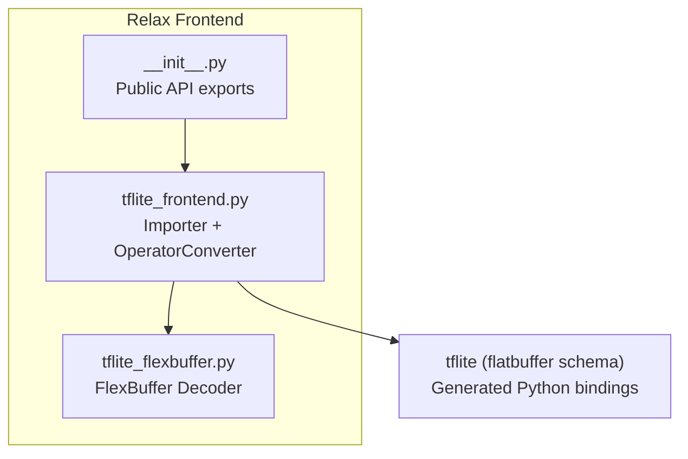
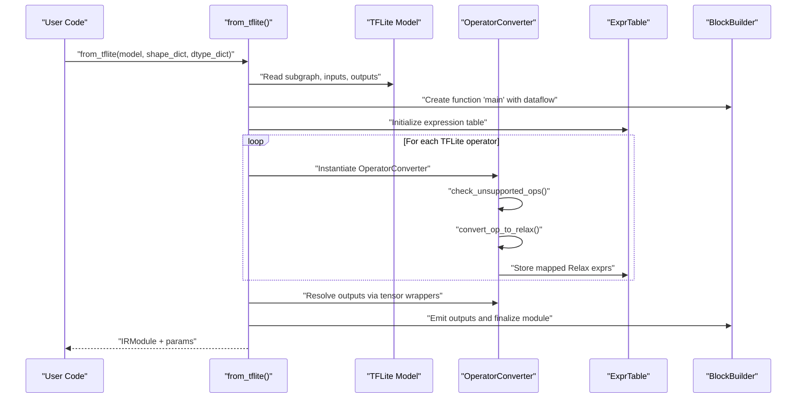
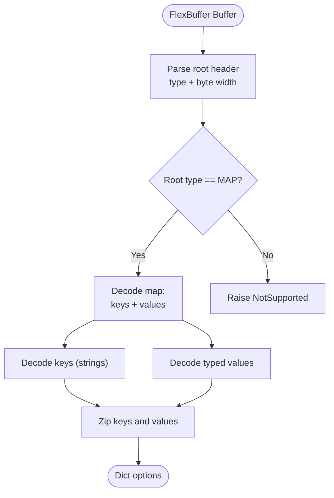
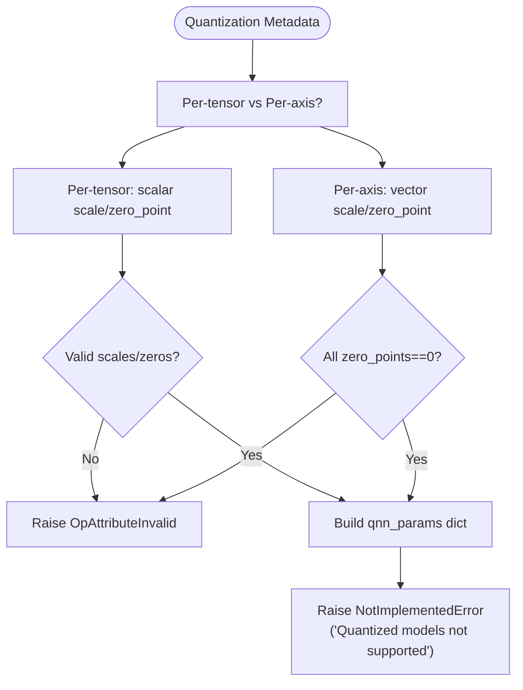
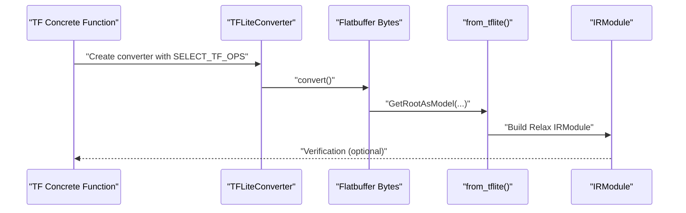
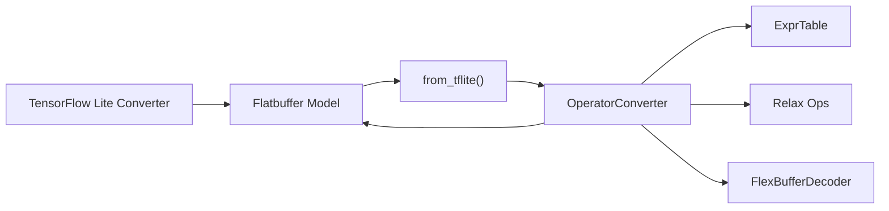

# TensorFlow Lite Frontend

<cite>
**Referenced Files in This Document**
- [tflite_frontend.py](file://python/tvm/relax/frontend/tflite/tflite_frontend.py)
- [tflite_flexbuffer.py](file://python/tvm/relax/frontend/tflite/tflite_flexbuffer.py)
- [__init__.py](file://python/tvm/relax/frontend/tflite/__init__.py)
- [import_model.py](file://docs/how_to/tutorials/import_model.py)
- [test_frontend_tflite.py](file://tests/python/relax/test_frontend_tflite.py)
- [frontend.rst](file://docs/reference/api/python/relax/frontend.rst)
- [ubuntu_install_tflite.sh](file://docker/install/ubuntu_install_tflite.sh)
</cite>

## Table of Contents
1. [Introduction](#introduction)
2. [Project Structure](#project-structure)
3. [Core Components](#core-components)
4. [Architecture Overview](#architecture-overview)
5. [Detailed Component Analysis](#detailed-component-analysis)
6. [Dependency Analysis](#dependency-analysis)
7. [Performance Considerations](#performance-considerations)
8. [Troubleshooting Guide](#troubleshooting-guide)
9. [Conclusion](#conclusion)
10. [Appendices](#appendices)

## Introduction
This document explains the TensorFlow Lite (TFLite) frontend adapter for importing TFLite models into TVM’s Relax IR for edge deployment. It covers the model parsing pipeline, operator mapping from TFLite to Relax, FlexBuffer handling for custom operator options, quantization support status, and model optimization during import. Practical examples demonstrate importing TFLite models, handling quantized operations, and managing unsupported operators. It also provides configuration options, debugging techniques for import failures, and best practices for mobile and edge optimization.

## Project Structure
The TFLite frontend resides under the Relax frontend namespace and consists of:
- A main importer that parses TFLite flatbuffer models and constructs Relax IR.
- An operator converter that maps TFLite builtin and custom operators to Relax equivalents.
- A FlexBuffer decoder for reading custom operator options.
- Public API exposure via the frontend package.

**Diagram sources**
- [tflite_frontend.py:1-25](file://python/tvm/relax/frontend/tflite/tflite_frontend.py#L1-L25)
- [tflite_flexbuffer.py:1-25](file://python/tvm/relax/frontend/tflite/tflite_flexbuffer.py#L1-L25)
- [__init__.py:17-21](file://python/tvm/relax/frontend/tflite/__init__.py#L17-L21)

**Section sources**
- [frontend.rst:50-55](file://docs/reference/api/python/relax/frontend.rst#L50-L55)
- [__init__.py:17-21](file://python/tvm/relax/frontend/tflite/__init__.py#L17-L21)

## Core Components
- Importer entry point: Converts a TFLite model into a Relax IRModule and parameter dictionary.
- OperatorConverter: Maps TFLite builtin and custom operators to Relax ops, handles tensor metadata, and manages quantization placeholders.
- FlexBufferDecoder: Parses FlexBuffer-encoded custom operator options for supported keys.
- Expression table: Tracks Relax expressions by tensor names and maintains constants/parameters.

Key responsibilities:
- Parse TFLite subgraph inputs/outputs and tensors.
- Validate operator support and raise informative errors for unsupported ops.
- Construct Relax expressions and dataflow blocks.
- Attach function attributes (number of inputs, parameter tensors).

**Section sources**
- [tflite_frontend.py:4118-4277](file://python/tvm/relax/frontend/tflite/tflite_frontend.py#L4118-L4277)
- [tflite_frontend.py:99-241](file://python/tvm/relax/frontend/tflite/tflite_frontend.py#L99-L241)
- [tflite_flexbuffer.py:68-159](file://python/tvm/relax/frontend/tflite/tflite_flexbuffer.py#L68-L159)

## Architecture Overview
End-to-end flow from TFLite model to Relax IR:

**Diagram sources**
- [tflite_frontend.py:4118-4277](file://python/tvm/relax/frontend/tflite/tflite_frontend.py#L4118-L4277)
- [tflite_frontend.py:322-348](file://python/tvm/relax/frontend/tflite/tflite_frontend.py#L322-L348)

## Detailed Component Analysis

### Import Pipeline and Operator Mapping
- Input type inference: Reads model inputs to derive shapes and dtypes.
- Single-subgraph assumption: Enforces a single main subgraph.
- BlockBuilder usage: Builds Relax function with dataflow blocks and emits outputs.
- Unsupported operator detection: Scans operator codes and raises OpNotImplemented with actionable messages.
- Operator dispatch: Uses a mapping from TFLite operator names to Relax conversion functions.

Supported operators include arithmetic, convolution variants, pooling, normalization, activation, reshaping, resizing, and more. The converter includes dedicated handlers for each operator category.

**Section sources**
- [tflite_frontend.py:4096-4115](file://python/tvm/relax/frontend/tflite/tflite_frontend.py#L4096-L4115)
- [tflite_frontend.py:4225-4277](file://python/tvm/relax/frontend/tflite/tflite_frontend.py#L4225-L4277)
- [tflite_frontend.py:118-240](file://python/tvm/relax/frontend/tflite/tflite_frontend.py#L118-L240)

### FlexBuffer Handling for Custom Operators
- Purpose: Decode FlexBuffer-encoded custom operator options to extract key-value pairs.
- Supported subset: Flat map decoding with selected primitive types and vectors.
- Integration: Used when parsing custom operator options to access tunable parameters.

**Diagram sources**
- [tflite_flexbuffer.py:146-159](file://python/tvm/relax/frontend/tflite/tflite_flexbuffer.py#L146-L159)
- [tflite_flexbuffer.py:130-144](file://python/tvm/relax/frontend/tflite/tflite_flexbuffer.py#L130-L144)

**Section sources**
- [tflite_flexbuffer.py:68-159](file://python/tvm/relax/frontend/tflite/tflite_flexbuffer.py#L68-L159)

### Quantization Support and Placeholders
- Detection: Parses tensor quantization metadata (scale, zero point) for per-tensor and per-axis cases.
- Validation: Enforces constraints (e.g., per-axis zero points must be zero).
- Current status: Quantized TFLite models are not yet supported in the Relax frontend; conversion raises a NotImplementedError to prevent silent miscompilation.
- Helpers: Provides quantize/dequantize/requantize helpers for future integration.

**Diagram sources**
- [tflite_frontend.py:420-478](file://python/tvm/relax/frontend/tflite/tflite_frontend.py#L420-L478)
- [tflite_frontend.py:547-578](file://python/tvm/relax/frontend/tflite/tflite_frontend.py#L547-L578)

**Section sources**
- [tflite_frontend.py:420-478](file://python/tvm/relax/frontend/tflite/tflite_frontend.py#L420-L478)
- [tflite_frontend.py:547-578](file://python/tvm/relax/frontend/tflite/tflite_frontend.py#L547-L578)

### Operator Conversion Patterns
- Unary and binary elementwise: Mapped to Relax ops with optional activation fusion handling.
- Convolution family: Handles Conv2D and DepthwiseConv2D with stride, padding, dilation, and depth multiplier.
- Pooling: Average, max, L2 pooling with configurable options.
- Resizing: Bilinear and nearest neighbor with alignment and rounding modes.
- Normalization: L2 normalization and local response normalization.
- Reductions and comparisons: Sum, mean, argmax/argmin, logical ops, and elementwise comparisons.
- Shape and layout: Reshape, squeeze, transpose, split, pack/unpack, tile, gather, and strided slice.

Unsupported operators are detected early and reported with precise operator names.

**Section sources**
- [tflite_frontend.py:118-240](file://python/tvm/relax/frontend/tflite/tflite_frontend.py#L118-L240)
- [tflite_frontend.py:242-283](file://python/tvm/relax/frontend/tflite/tflite_frontend.py#L242-L283)

### Practical Import Examples
- From a concrete TensorFlow function: Use TFLiteConverter with supported ops, then parse the resulting buffer into a Relax module.
- From a .tflite file: Load raw bytes and parse depending on tflite package version compatibility.
- End-to-end verification: Tests demonstrate converting TF functions to TFLite and importing into Relax, then validating numerical outputs against TensorFlow.

**Diagram sources**
- [import_model.py:320-352](file://docs/how_to/tutorials/import_model.py#L320-L352)
- [test_frontend_tflite.py:38-52](file://tests/python/relax/test_frontend_tflite.py#L38-L52)

**Section sources**
- [import_model.py:320-352](file://docs/how_to/tutorials/import_model.py#L320-L352)
- [test_frontend_tflite.py:38-52](file://tests/python/relax/test_frontend_tflite.py#L38-L52)

## Dependency Analysis
- Internal dependencies:
  - OperatorConverter depends on Relax ops and BlockBuilder to construct expressions.
  - FlexBufferDecoder is used by operator converters to parse custom options.
- External dependencies:
  - TFLite flatbuffer schema bindings (generated Python) for model parsing.
  - TensorFlow Lite converter for producing compatible models.

**Diagram sources**
- [tflite_frontend.py:4118-4277](file://python/tvm/relax/frontend/tflite/tflite_frontend.py#L4118-L4277)
- [tflite_flexbuffer.py:68-159](file://python/tvm/relax/frontend/tflite/tflite_flexbuffer.py#L68-L159)

**Section sources**
- [tflite_frontend.py:322-348](file://python/tvm/relax/frontend/tflite/tflite_frontend.py#L322-L348)
- [tflite_frontend.py:349-398](file://python/tvm/relax/frontend/tflite/tflite_frontend.py#L349-L398)

## Performance Considerations
- Quantization: While quantized models are not supported in the Relax frontend, removing quantization during export (e.g., using float outputs) can improve compatibility and reduce post-quantization overhead.
- Operator coverage: Prefer models composed of supported operators to avoid fallbacks and extra passes.
- Shape/dtype hints: Providing shape_dict and dtype_dict can enable earlier shape inference and reduce dynamic checks.
- Single subgraph: The importer expects a single main subgraph; multi-subgraph models require upstream simplification.
- Resize interpolation: Bilinear and nearest neighbor resizing options influence accuracy and compute trade-offs; choose appropriate alignment and rounding modes.

[No sources needed since this section provides general guidance]

## Troubleshooting Guide
Common issues and resolutions:
- Unsupported operators: The importer detects unsupported operators and raises OpNotImplemented with a list of offending operator names. Replace unsupported ops with supported alternatives or use SELECT_TF_OPS where applicable.
- Dynamic range quantization: Detected operators that rely on dynamic range quantization; disable dynamic range quantization or switch to full integer quantization.
- Custom operators: Custom operators are rejected unless explicitly allowed; the importer raises NotImplementedError. Either remove custom ops or integrate a custom handler.
- TFLite version mismatch: Ensure the flatbuffer schema version matches the installed tflite package; the installation script demonstrates generating Python bindings from the schema.
- Quantized models: Conversion raises NotImplementedError for quantized models; remove quantization or wait for future support.

Debugging tips:
- Enable verbose logs and inspect the generated Relax IR to locate problematic nodes.
- Verify operator coverage by checking the convert_map and unsupported operator detection logic.
- Validate model inputs/outputs and shapes using the provided shape_dict/dtype_dict.

**Section sources**
- [tflite_frontend.py:242-283](file://python/tvm/relax/frontend/tflite/tflite_frontend.py#L242-L283)
- [tflite_frontend.py:387-398](file://python/tvm/relax/frontend/tflite/tflite_frontend.py#L387-L398)
- [tflite_frontend.py:474-476](file://python/tvm/relax/frontend/tflite/tflite_frontend.py#L474-L476)
- [ubuntu_install_tflite.sh:24-64](file://docker/install/ubuntu_install_tflite.sh#L24-L64)

## Conclusion
The TFLite frontend provides a robust pathway to import TFLite models into TVM’s Relax IR for edge deployment. It supports a wide range of operators, integrates FlexBuffer decoding for custom options, and enforces strict validation for unsupported or quantized configurations. By following best practices—such as ensuring operator coverage, avoiding dynamic range quantization, and supplying accurate shape/dtype hints—you can achieve reliable and efficient model conversion for constrained environments.

[No sources needed since this section summarizes without analyzing specific files]

## Appendices

### Supported TFLite Model Versions and Schema
- The importer reads TFLite flatbuffer models and relies on generated Python bindings from the schema.
- The installation script demonstrates generating bindings from the TFLite schema and installing compatible tflite packages.

**Section sources**
- [tflite_frontend.py:4209-4217](file://python/tvm/relax/frontend/tflite/tflite_frontend.py#L4209-L4217)
- [ubuntu_install_tflite.sh:54-95](file://docker/install/ubuntu_install_tflite.sh#L54-L95)

### Frontend Configuration Options
- from_tflite(model, shape_dict=None, dtype_dict=None, op_converter=OperatorConverter): Allows passing explicit input shapes and dtypes and swapping the operator converter class for customization.

**Section sources**
- [tflite_frontend.py:4118-4123](file://python/tvm/relax/frontend/tflite/tflite_frontend.py#L4118-L4123)

### Practical Import Recipes
- Converting a TF concrete function to TFLite and importing into Relax.
- Loading a .tflite file and parsing into Relax IR.
- Verifying numerical correctness by comparing outputs against TensorFlow.

**Section sources**
- [import_model.py:320-352](file://docs/how_to/tutorials/import_model.py#L320-L352)
- [test_frontend_tflite.py:38-52](file://tests/python/relax/test_frontend_tflite.py#L38-L52)