# Graph Transformations

<cite>
**Referenced Files in This Document**
- [transform.h](file://include/tvm/relax/transform.h)
- [legalize_ops.cc](file://src/relax/transform/legalize_ops.cc)
- [fuse_ops.cc](file://src/relax/transform/fuse_ops.cc)
- [convert_layout.cc](file://src/relax/transform/convert_layout.cc)
- [dead_code_elimination.cc](file://src/relax/transform/dead_code_elimination.cc)
- [canonicalize_bindings.cc](file://src/relax/transform/canonicalize_bindings.cc)
- [fold_constant.cc](file://src/relax/transform/fold_constant.cc)
- [eliminate_common_subexpr.cc](file://src/relax/transform/eliminate_common_subexpr.cc)
- [normalize.cc](file://src/relax/transform/normalize.cc)
- [to_mixed_precision.cc](file://src/relax/transform/to_mixed_precision.cc)
- [utils.h](file://src/relax/transform/utils.h)
</cite>

## Table of Contents
1. [Introduction](#introduction)
2. [Project Structure](#project-structure)
3. [Core Components](#core-components)
4. [Architecture Overview](#architecture-overview)
5. [Detailed Component Analysis](#detailed-component-analysis)
6. [Dependency Analysis](#dependency-analysis)
7. [Performance Considerations](#performance-considerations)
8. [Troubleshooting Guide](#troubleshooting-guide)
9. [Conclusion](#conclusion)
10. [Appendices](#appendices)

## Introduction
This document explains Relax’s graph transformation system that optimizes and refactors Relax programs. It covers the transformation pipeline, operator standardization via legalizer passes, layout optimization transforms, redundant operation elimination, parameter transformation strategies, and specialized optimizations such as transpose-fused matmul patterns. It also details transformation architecture, pass ordering considerations, dependency management, practical application examples, creating custom passes, debugging transformation effects, and the relationship between transformations and backend code generation.

## Project Structure
Relax transformations are implemented as pass factories declared in the public header and backed by pass-specific source files. The header defines pass APIs and pass composition utilities. The source files implement the passes using expression mutators and builders.

```mermaid
graph TB
A["include/tvm/relax/transform.h"] --> B["src/relax/transform/legalize_ops.cc"]
A --> C["src/relax/transform/fuse_ops.cc"]
A --> D["src/relax/transform/convert_layout.cc"]
A --> E["src/relax/transform/dead_code_elimination.cc"]
A --> F["src/relax/transform/canonicalize_bindings.cc"]
A --> G["src/relax/transform/fold_constant.cc"]
A --> H["src/relax/transform/eliminate_common_subexpr.cc"]
A --> I["src/relax/transform/normalize.cc"]
A --> J["src/relax/transform/to_mixed_precision.cc"]
K["src/relax/transform/utils.h"] -.-> B
K -.-> C
K -.-> D
K -.-> E
K -.-> F
K -.-> G
K -.-> H
K -.-> I
K -.-> J
```

**Diagram sources**
- [transform.h:34-687](file://include/tvm/relax/transform.h#L34-L687)
- [legalize_ops.cc:1-438](file://src/relax/transform/legalize_ops.cc#L1-L438)
- [fuse_ops.cc:1-1478](file://src/relax/transform/fuse_ops.cc#L1-L1478)
- [convert_layout.cc:1-374](file://src/relax/transform/convert_layout.cc#L1-L374)
- [dead_code_elimination.cc:1-153](file://src/relax/transform/dead_code_elimination.cc#L1-L153)
- [canonicalize_bindings.cc:1-605](file://src/relax/transform/canonicalize_bindings.cc#L1-L605)
- [fold_constant.cc:1-438](file://src/relax/transform/fold_constant.cc#L1-L438)
- [eliminate_common_subexpr.cc:1-236](file://src/relax/transform/eliminate_common_subexpr.cc#L1-L236)
- [normalize.cc:1-306](file://src/relax/transform/normalize.cc#L1-L306)
- [to_mixed_precision.cc:1-632](file://src/relax/transform/to_mixed_precision.cc#L1-L632)
- [utils.h:1-485](file://src/relax/transform/utils.h#L1-L485)

**Section sources**
- [transform.h:34-687](file://include/tvm/relax/transform.h#L34-L687)

## Core Components
- Pass infrastructure: Pass, PassInfo, PassContext, and pass creation helpers (function/dataflow/block passes).
- Operator standardization: LegalizeOps transforms high-level Relax ops into call_tir with TIR PrimFuncs, with purity handling and target propagation.
- Operator fusion: FuseOps groups bindings into composite functions guided by operator pattern analysis and post-dom analysis; FuseTIR lowers composites to TIR PrimFuncs.
- Layout optimization: ConvertLayout infers and inserts layout conversions (including transpose-like permutations) and index-map based transforms.
- Redundancy elimination: DeadCodeElimination removes unused functions and bindings; EliminateCommonSubexpr removes repeated subexpressions; FoldConstant evaluates constant expressions; CanonicalizeBindings simplifies bindings and match-casts.
- Mixed precision: ToMixedPrecision decides per-op casting policies and manages dtype decisions across the graph.
- Normalization: Normalize transforms Relax IR to A-normal form and fills struct_info.

**Section sources**
- [transform.h:34-687](file://include/tvm/relax/transform.h#L34-L687)
- [legalize_ops.cc:411-437](file://src/relax/transform/legalize_ops.cc#L411-L437)
- [fuse_ops.cc:51-54](file://src/relax/transform/fuse_ops.cc#L51-L54)
- [convert_layout.cc:80-374](file://src/relax/transform/convert_layout.cc#L80-L374)
- [dead_code_elimination.cc:47-134](file://src/relax/transform/dead_code_elimination.cc#L47-L134)
- [canonicalize_bindings.cc:561-569](file://src/relax/transform/canonicalize_bindings.cc#L561-L569)
- [fold_constant.cc:34-418](file://src/relax/transform/fold_constant.cc#L34-L418)
- [eliminate_common_subexpr.cc:91-216](file://src/relax/transform/eliminate_common_subexpr.cc#L91-L216)
- [normalize.cc:37-176](file://src/relax/transform/normalize.cc#L37-L176)
- [to_mixed_precision.cc:116-632](file://src/relax/transform/to_mixed_precision.cc#L116-L632)

## Architecture Overview
The Relax transformation system is a layered pipeline:
- Preprocessing: Normalize, CanonicalizeBindings
- Operator standardization: LegalizeOps
- Layout optimization: ConvertLayout
- Fusion: FuseOps, FuseTIR
- Precision optimization: ToMixedPrecision
- Dead code and redundancy elimination: DeadCodeElimination, EliminateCommonSubexpr, FoldConstant
- Finalization: Normalize, AttachGlobalSymbol, RunCodegen

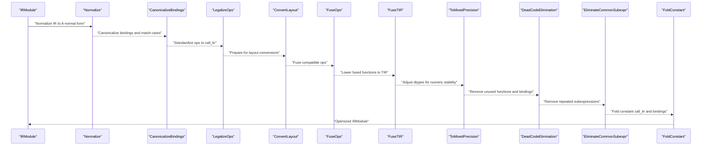

**Diagram sources**
- [normalize.cc:276-281](file://src/relax/transform/normalize.cc#L276-L281)
- [canonicalize_bindings.cc:587-594](file://src/relax/transform/canonicalize_bindings.cc#L587-L594)
- [legalize_ops.cc:413-427](file://src/relax/transform/legalize_ops.cc#L413-L427)
- [convert_layout.cc:357-364](file://src/relax/transform/convert_layout.cc#L357-L364)
- [fuse_ops.cc:511-554](file://src/relax/transform/fuse_ops.cc#L511-L554)
- [to_mixed_precision.cc:615-621](file://src/relax/transform/to_mixed_precision.cc#L615-L621)
- [dead_code_elimination.cc:138-143](file://src/relax/transform/dead_code_elimination.cc#L138-L143)
- [eliminate_common_subexpr.cc:220-225](file://src/relax/transform/eliminate_common_subexpr.cc#L220-L225)
- [fold_constant.cc:422-427](file://src/relax/transform/fold_constant.cc#L422-L427)

## Detailed Component Analysis

### LegalizeOps: Operator Standardization
LegalizeOps transforms high-level Relax operators into call_tir with TIR PrimFuncs. It supports:
- Custom legalization maps
- Skipping specific ops
- Shape and dtype requirements
- Purity wrapping for dataflow compatibility
- Target propagation for vdevice-aware kernels
- Recursive legalization and cleanup

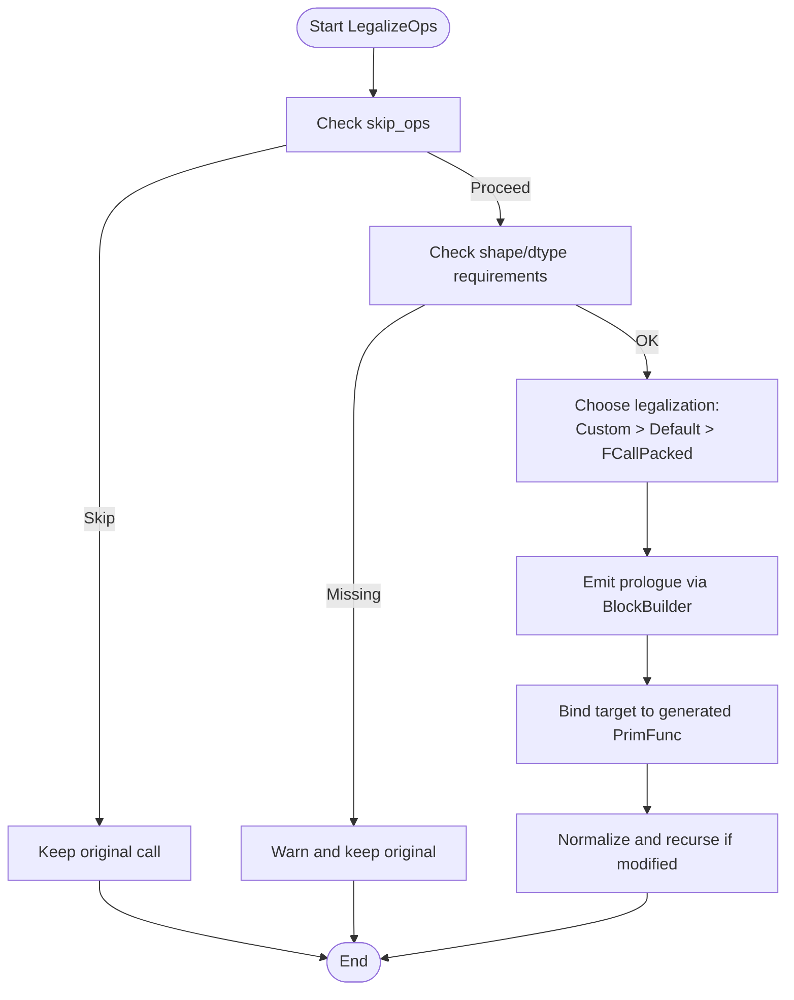

**Diagram sources**
- [legalize_ops.cc:234-392](file://src/relax/transform/legalize_ops.cc#L234-L392)
- [legalize_ops.cc:413-427](file://src/relax/transform/legalize_ops.cc#L413-L427)

**Section sources**
- [legalize_ops.cc:411-437](file://src/relax/transform/legalize_ops.cc#L411-L437)
- [legalize_ops.cc:234-392](file://src/relax/transform/legalize_ops.cc#L234-L392)

### FuseOps: Operator Fusion and FuseTIR
FuseOps partitions the dataflow graph using operator patterns and post-dominator analysis, grouping compatible bindings into composite functions. FuseTIR lowers these composites to TIR PrimFuncs.

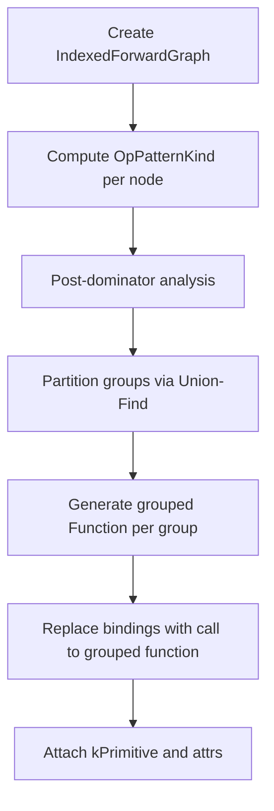

**Diagram sources**
- [fuse_ops.cc:102-137](file://src/relax/transform/fuse_ops.cc#L102-L137)
- [fuse_ops.cc:191-229](file://src/relax/transform/fuse_ops.cc#L191-L229)
- [fuse_ops.cc:511-554](file://src/relax/transform/fuse_ops.cc#L511-L554)

**Section sources**
- [fuse_ops.cc:51-54](file://src/relax/transform/fuse_ops.cc#L51-L54)
- [fuse_ops.cc:102-137](file://src/relax/transform/fuse_ops.cc#L102-L137)
- [fuse_ops.cc:191-229](file://src/relax/transform/fuse_ops.cc#L191-L229)
- [fuse_ops.cc:511-554](file://src/relax/transform/fuse_ops.cc#L511-L554)

### ConvertLayout: Layout Optimization
ConvertLayout infers desired layouts per operator and rewrites inputs/outputs to match. It supports:
- Per-operator desired layouts
- Dynamic layout callbacks
- Transpose-like permutations
- Index-map based layout transforms
- StructInfo updates for MatchCast

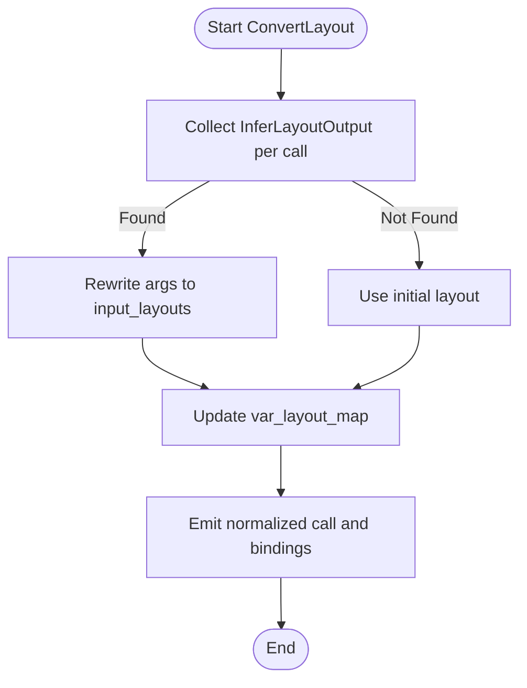

**Diagram sources**
- [convert_layout.cc:202-272](file://src/relax/transform/convert_layout.cc#L202-L272)
- [convert_layout.cc:348-353](file://src/relax/transform/convert_layout.cc#L348-L353)

**Section sources**
- [convert_layout.cc:80-374](file://src/relax/transform/convert_layout.cc#L80-L374)

### DeadCodeElimination: Unused Code Removal
Removes unused functions and bindings by:
- Computing reachability from entry functions
- Removing unused functions
- Removing unused bindings in each function
- Repeating to capture cascading removals

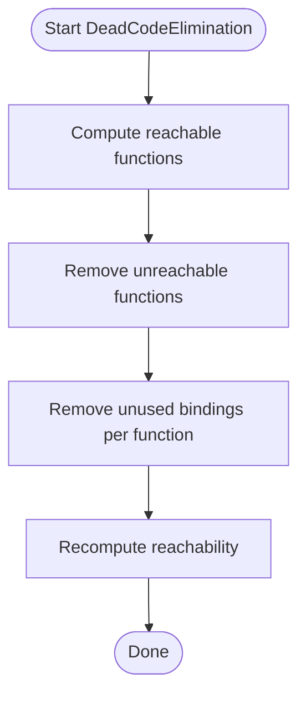

**Diagram sources**
- [dead_code_elimination.cc:47-134](file://src/relax/transform/dead_code_elimination.cc#L47-L134)

**Section sources**
- [dead_code_elimination.cc:47-134](file://src/relax/transform/dead_code_elimination.cc#L47-L134)

### CanonicalizeBindings: Binding Simplification
Simplifies bindings and match-casts:
- Canonicalize TIR symbolic variables across branches
- Remove trivial bindings and inline constants
- Optimize dataflow vs non-dataflow var usage

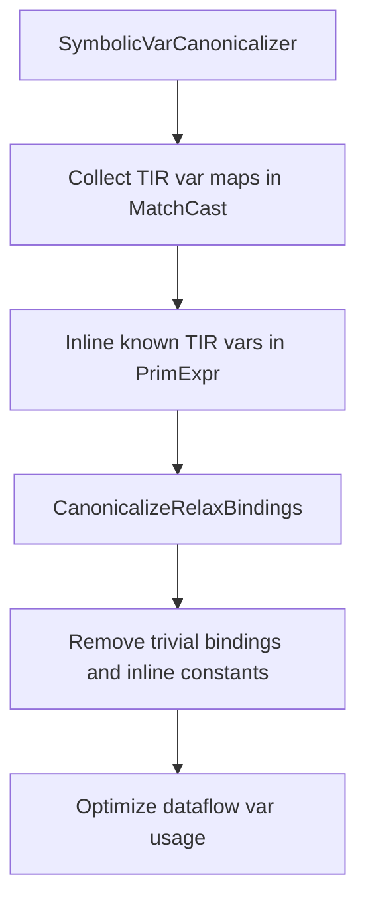

**Diagram sources**
- [canonicalize_bindings.cc:38-144](file://src/relax/transform/canonicalize_bindings.cc#L38-L144)
- [canonicalize_bindings.cc:416-558](file://src/relax/transform/canonicalize_bindings.cc#L416-L558)

**Section sources**
- [canonicalize_bindings.cc:561-569](file://src/relax/transform/canonicalize_bindings.cc#L561-L569)

### FoldConstant: Constant Folding
Folds constant call_tir and bindings:
- Matches constant arrays and shapes
- Builds CPU-targeted PrimFuncs and evaluates
- Handles single-tensor and tuple outputs
- Skips large outputs unless pure creation ops

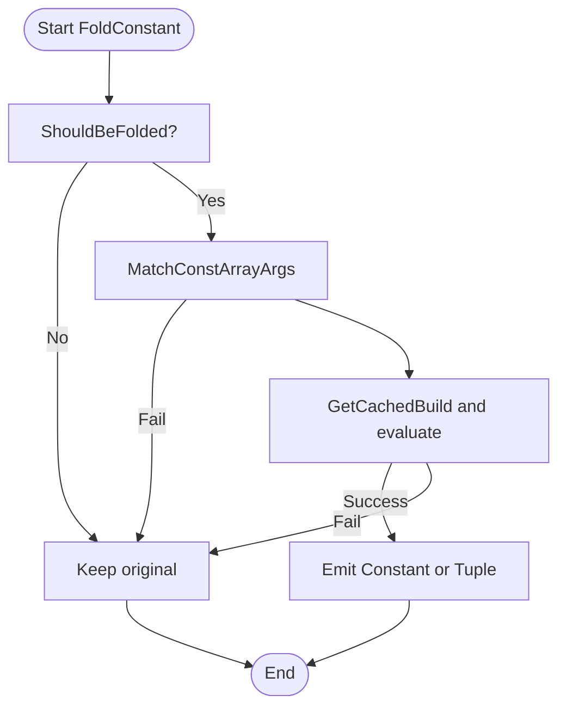

**Diagram sources**
- [fold_constant.cc:153-192](file://src/relax/transform/fold_constant.cc#L153-L192)
- [fold_constant.cc:269-293](file://src/relax/transform/fold_constant.cc#L269-L293)
- [fold_constant.cc:301-403](file://src/relax/transform/fold_constant.cc#L301-L403)

**Section sources**
- [fold_constant.cc:34-418](file://src/relax/transform/fold_constant.cc#L34-L418)

### EliminateCommonSubexpr: CSE
Removes repeated subexpressions:
- Tracks bound values with match-cast specifics
- Avoids impure and allocator calls
- Replaces later bindings with trivial bindings

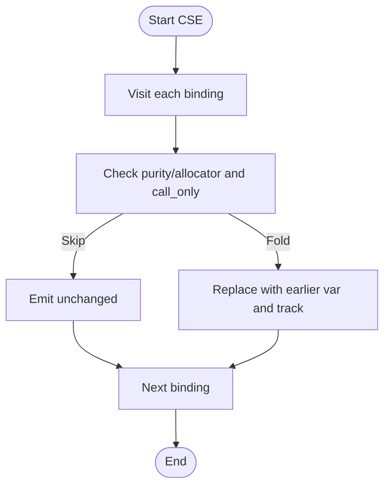

**Diagram sources**
- [eliminate_common_subexpr.cc:91-216](file://src/relax/transform/eliminate_common_subexpr.cc#L91-L216)

**Section sources**
- [eliminate_common_subexpr.cc:91-216](file://src/relax/transform/eliminate_common_subexpr.cc#L91-L216)

### ToMixedPrecision: Precision Optimization
Automatically casts inputs to lower precision when safe:
- Backward pass detects tensors only used in “always” ops
- Forward pass rewrites ops with dtype decisions
- Supports kAlways/kFollow/kNever policies

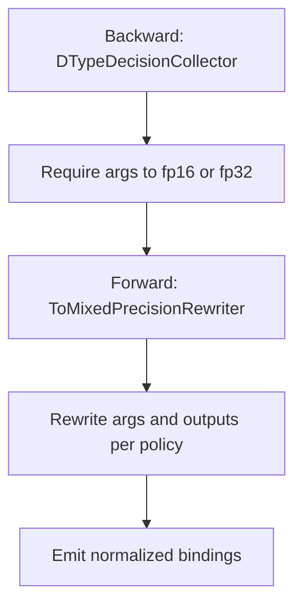

**Diagram sources**
- [to_mixed_precision.cc:116-270](file://src/relax/transform/to_mixed_precision.cc#L116-L270)
- [to_mixed_precision.cc:272-611](file://src/relax/transform/to_mixed_precision.cc#L272-L611)

**Section sources**
- [to_mixed_precision.cc:116-632](file://src/relax/transform/to_mixed_precision.cc#L116-L632)

### Normalize: IR Normalization
Ensures A-normal form and fills struct_info:
- Normalizes nested expressions and blocks
- Updates struct_info for vars and match-casts

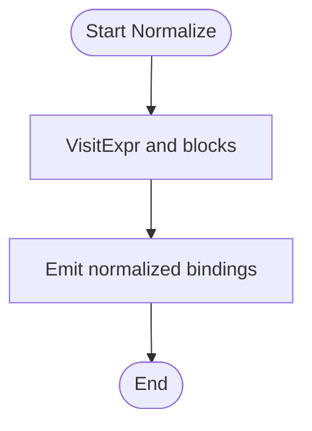

**Diagram sources**
- [normalize.cc:37-176](file://src/relax/transform/normalize.cc#L37-L176)

**Section sources**
- [normalize.cc:276-281](file://src/relax/transform/normalize.cc#L276-L281)

## Dependency Analysis
- Pass creation and registration: Pass factories in the header create module/function/dataflow passes with required dependencies.
- Pass ordering dependencies:
  - Normalize and CanonicalizeBindings should precede LegalizeOps to ensure well-formedness and simplify bindings.
  - LegalizeOps must precede ConvertLayout to operate on standardized ops.
  - FuseOps/FuseTIR depend on annotated op patterns and post-dominator analysis.
  - ToMixedPrecision relies on operator dtype policies and may depend on LegalizeOps for consistent lowering.
  - DeadCodeElimination, EliminateCommonSubexpr, and FoldConstant are typically applied after fusion and layout optimization.
- Utilities: Shared utilities (e.g., SymbolicVarRenewMutator, VarReplacer) are used across passes.

**Diagram sources**
- [normalize.cc:276-281](file://src/relax/transform/normalize.cc#L276-L281)
- [canonicalize_bindings.cc:587-594](file://src/relax/transform/canonicalize_bindings.cc#L587-L594)
- [legalize_ops.cc:413-427](file://src/relax/transform/legalize_ops.cc#L413-L427)
- [convert_layout.cc:357-364](file://src/relax/transform/convert_layout.cc#L357-L364)
- [fuse_ops.cc:511-554](file://src/relax/transform/fuse_ops.cc#L511-L554)
- [to_mixed_precision.cc:615-621](file://src/relax/transform/to_mixed_precision.cc#L615-L621)
- [dead_code_elimination.cc:138-143](file://src/relax/transform/dead_code_elimination.cc#L138-L143)
- [eliminate_common_subexpr.cc:220-225](file://src/relax/transform/eliminate_common_subexpr.cc#L220-L225)
- [fold_constant.cc:422-427](file://src/relax/transform/fold_constant.cc#L422-L427)

**Section sources**
- [transform.h:34-687](file://include/tvm/relax/transform.h#L34-L687)
- [utils.h:127-146](file://src/relax/transform/utils.h#L127-L146)

## Performance Considerations
- Fusion granularity: Larger groups improve kernel launch efficiency but may increase register pressure; tune via pass-level controls.
- Layout conversions: Prefer in-place or view-based transforms to avoid copies; leverage ConvertLayout to align memory access patterns.
- Constant folding: Avoid materializing very large constants; the pass already guards against excessive inlining.
- Mixed precision: Use kAlways for compute-heavy ops (e.g., GEMM/Conv) to exploit TensorCore; reserve kNever for numerically sensitive ops (e.g., Softmax).
- Dead code elimination: Apply after fusion to remove fused dead code; re-run to catch cascaded removals.
- Canonicalization: Reduces redundant bindings and improves downstream analyses.

[No sources needed since this section provides general guidance]

## Troubleshooting Guide
- Debugging transformations:
  - Use pass composition and run subsets to localize issues.
  - Inspect IRModule before/after each pass to trace mutations.
  - Enable warnings in LegalizeOps to detect missing legalizations.
  - Verify struct_info after normalization and layout conversions.
- Common pitfalls:
  - Skipping ops in LegalizeOps may leave unsupported ops unresolved.
  - Incorrect desired layouts can cause mismatches; validate with ConvertLayout.
  - Improper fusion boundaries can break purity or correctness; review post-dominator analysis.
  - Mixed precision may introduce numerical instability; adjust policies and verify outputs.

**Section sources**
- [legalize_ops.cc:336-347](file://src/relax/transform/legalize_ops.cc#L336-L347)
- [normalize.cc:37-176](file://src/relax/transform/normalize.cc#L37-L176)
- [convert_layout.cc:202-272](file://src/relax/transform/convert_layout.cc#L202-L272)

## Conclusion
Relax’s transformation system provides a robust, composable pipeline for optimizing graph programs. By combining operator standardization, layout optimization, fusion, precision tuning, and redundancy elimination, it prepares models for efficient backend code generation. Proper pass ordering and careful use of utilities ensure correctness and performance.

[No sources needed since this section summarizes without analyzing specific files]

## Appendices

### Practical Examples
- Applying LegalizeOps with custom maps and skipping certain ops:
  - Use the pass factory to create a module pass and configure optional parameters.
  - Reference: [legalize_ops.cc:413-427](file://src/relax/transform/legalize_ops.cc#L413-L427)
- Creating a custom layout conversion pass:
  - Implement a dataflow-block pass using the provided pass factory and layout callback interface.
  - Reference: [convert_layout.cc:357-364](file://src/relax/transform/convert_layout.cc#L357-364)
- Building a pass pipeline:
  - Compose passes using the sequential pass factory and specify required dependencies.
  - Reference: [transform.h:57-74](file://include/tvm/relax/transform.h#L57-L74)

**Section sources**
- [legalize_ops.cc:413-427](file://src/relax/transform/legalize_ops.cc#L413-L427)
- [convert_layout.cc:357-364](file://src/relax/transform/convert_layout.cc#L357-364)
- [transform.h:57-74](file://include/tvm/relax/transform.h#L57-L74)