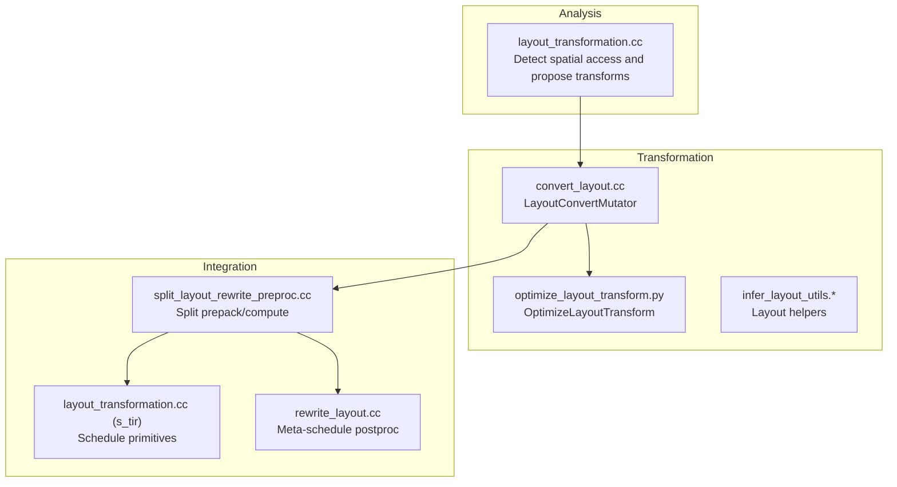
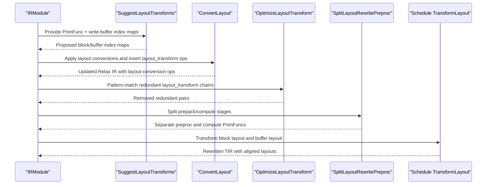
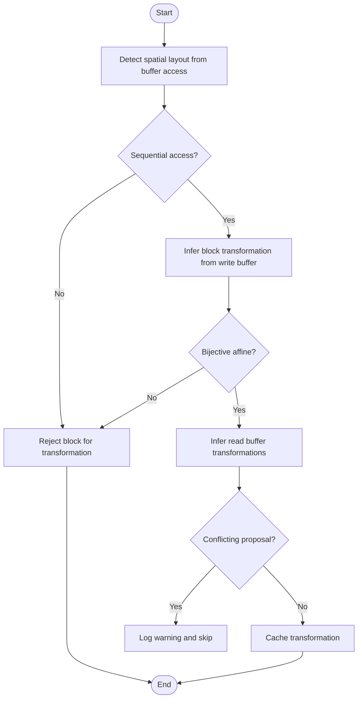
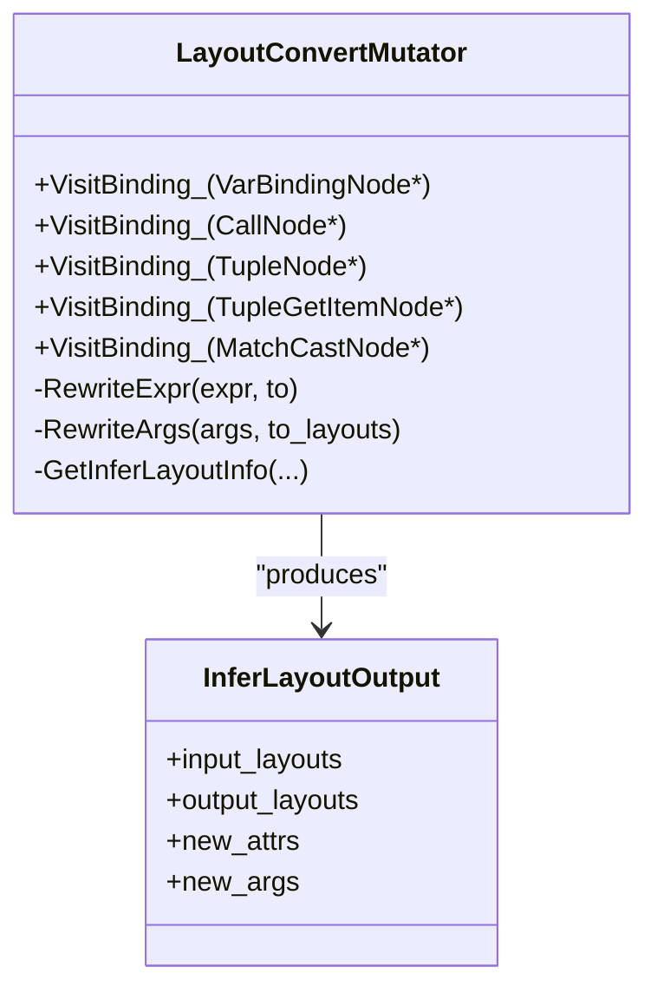
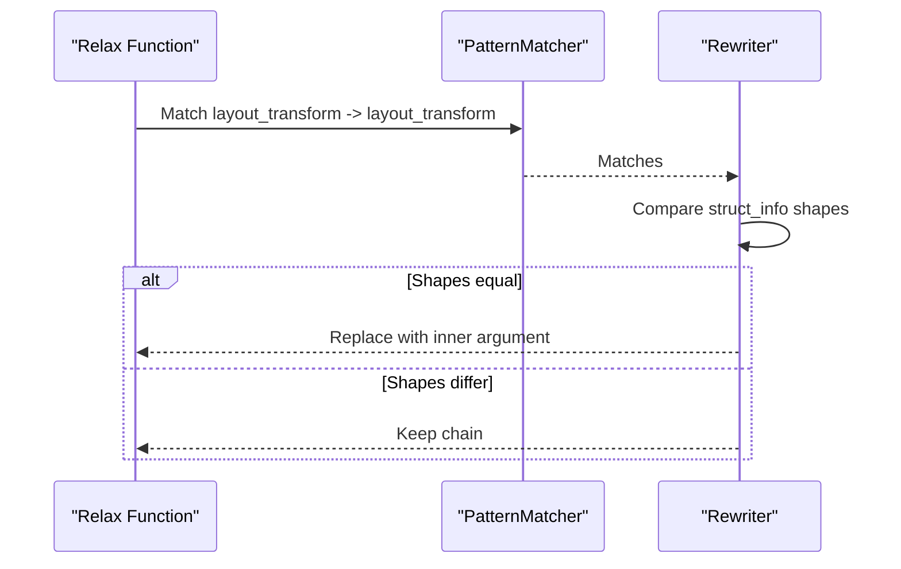
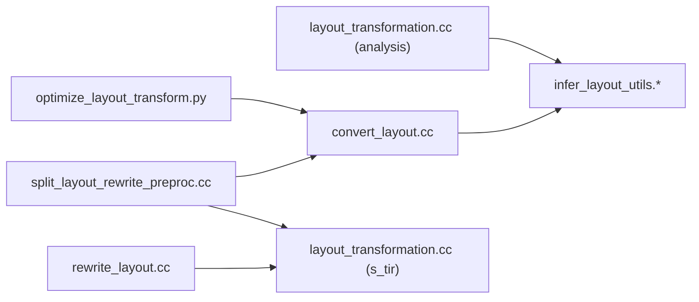

# Layout Optimization

<cite>
**Referenced Files in This Document**
- [layout_transformation.cc](file://src/relax/analysis/layout_transformation.cc)
- [optimize_layout_transform.py](file://python/tvm/relax/transform/optimize_layout_transform.py)
- [convert_layout.cc](file://src/relax/transform/convert_layout.cc)
- [infer_layout_utils.h](file://src/relax/transform/infer_layout_utils.h)
- [infer_layout_utils.cc](file://src/relax/transform/infer_layout_utils.cc)
- [split_layout_rewrite_preproc.cc](file://src/relax/transform/split_layout_rewrite_preproc.cc)
- [test_analysis_suggest_layout_transforms.py](file://tests/python/relax/test_analysis_suggest_layout_transforms.py)
- [test_optimize_layout_transform.py](file://tests/python/relax/test_optimize_layout_transform.py)
- [layout_transformation.cc](file://src/s_tir/schedule/primitive/layout_transformation.cc)
- [rewrite_layout.cc](file://src/s_tir/meta_schedule/postproc/rewrite_layout.cc)
</cite>

## Table of Contents
1. [Introduction](#introduction)
2. [Project Structure](#project-structure)
3. [Core Components](#core-components)
4. [Architecture Overview](#architecture-overview)
5. [Detailed Component Analysis](#detailed-component-analysis)
6. [Dependency Analysis](#dependency-analysis)
7. [Performance Considerations](#performance-considerations)
8. [Troubleshooting Guide](#troubleshooting-guide)
9. [Conclusion](#conclusion)
10. [Appendices](#appendices)

## Introduction
This document explains Relax’s layout optimization system that improves memory access patterns and computational efficiency through strategic tensor layout transformations. It covers:
- Layout detection algorithms that infer beneficial transformations from buffer access patterns
- Transform propagation mechanisms that align blocks and buffers consistently
- Layout-aware optimization strategies that reduce data movement overhead
- Practical scenarios, performance impact measurement, and integration with hardware-specific memory hierarchies
- The layout transformation pipeline, conflict resolution, semantic equivalence preservation, debugging, profiling, and best practices

## Project Structure
The layout optimization system spans three layers:
- Analysis: Detects beneficial layout transformations from buffer access patterns and block semantics
- Transformation: Applies layout conversions and removes redundant layout operators
- Scheduling/Postprocessing: Integrates with TIR scheduling and meta-schedule post-processing to rewrite layouts and split prepack/compute stages



**Diagram sources**
- [layout_transformation.cc:611-618](file://src/relax/analysis/layout_transformation.cc#L611-L618)
- [convert_layout.cc:80-374](file://src/relax/transform/convert_layout.cc#L80-L374)
- [optimize_layout_transform.py:29-88](file://python/tvm/relax/transform/optimize_layout_transform.py#L29-L88)
- [infer_layout_utils.h:58-135](file://src/relax/transform/infer_layout_utils.h#L58-L135)
- [split_layout_rewrite_preproc.cc:241-358](file://src/relax/transform/split_layout_rewrite_preproc.cc#L241-L358)
- [layout_transformation.cc:78-105](file://src/s_tir/schedule/primitive/layout_transformation.cc#L78-L105)
- [rewrite_layout.cc:223-245](file://src/s_tir/meta_schedule/postproc/rewrite_layout.cc#L223-L245)

**Section sources**
- [layout_transformation.cc:611-618](file://src/relax/analysis/layout_transformation.cc#L611-L618)
- [convert_layout.cc:80-374](file://src/relax/transform/convert_layout.cc#L80-L374)
- [optimize_layout_transform.py:29-88](file://python/tvm/relax/transform/optimize_layout_transform.py#L29-L88)
- [infer_layout_utils.h:58-135](file://src/relax/transform/infer_layout_utils.h#L58-L135)
- [split_layout_rewrite_preproc.cc:241-358](file://src/relax/transform/split_layout_rewrite_preproc.cc#L241-L358)
- [layout_transformation.cc:78-105](file://src/s_tir/schedule/primitive/layout_transformation.cc#L78-L105)
- [rewrite_layout.cc:223-245](file://src/s_tir/meta_schedule/postproc/rewrite_layout.cc#L223-L245)

## Core Components
- Layout suggestion engine: Infers spatial layout from buffer access, validates sequential access, and proposes block and buffer transformations that preserve sequentiality and bijectivity
- Layout conversion mutator: Rewrites operators to desired layouts, inserts layout-transform ops for non-permute axis swaps, and updates struct info shapes
- Redundant layout transform elimination: Pattern-matches chained layout_transform ops and removes redundant pairs
- Prepack/compute splitting: Splits TIR into pre-processing (weight packing) and compute stages for efficient reuse
- Scheduling primitives and meta-schedule post-processing: Apply and propagate layout transformations at the TIR level and integrate with meta-scheduling

Key capabilities:
- Bijective affine index map detection and validation
- Spatial layout inference and sequential access checks
- Conflict resolution via transformation cache and warnings
- Preservation of semantic equivalence during rewrites
- Integration with hardware-specific memory hierarchies via packed layouts and axis-separators

**Section sources**
- [layout_transformation.cc:42-54](file://src/relax/analysis/layout_transformation.cc#L42-L54)
- [layout_transformation.cc:115-133](file://src/relax/analysis/layout_transformation.cc#L115-L133)
- [layout_transformation.cc:156-168](file://src/relax/analysis/layout_transformation.cc#L156-L168)
- [layout_transformation.cc:171-184](file://src/relax/analysis/layout_transformation.cc#L171-L184)
- [layout_transformation.cc:216-305](file://src/relax/analysis/layout_transformation.cc#L216-L305)
- [layout_transformation.cc:319-534](file://src/relax/analysis/layout_transformation.cc#L319-L534)
- [convert_layout.cc:80-374](file://src/relax/transform/convert_layout.cc#L80-L374)
- [optimize_layout_transform.py:29-88](file://python/tvm/relax/transform/optimize_layout_transform.py#L29-L88)
- [split_layout_rewrite_preproc.cc:37-238](file://src/relax/transform/split_layout_rewrite_preproc.cc#L37-L238)
- [layout_transformation.cc:78-105](file://src/s_tir/schedule/primitive/layout_transformation.cc#L78-L105)
- [rewrite_layout.cc:223-245](file://src/s_tir/meta_schedule/postproc/rewrite_layout.cc#L223-L245)

## Architecture Overview
The layout optimization pipeline proceeds in stages:
1. Analysis: Analyze buffer access patterns and propose block-level and buffer-level transformations
2. Conversion: Apply layout conversions and insert layout-transform ops where needed
3. Optimization: Remove redundant layout_transform chains
4. Integration: Split prepack/compute and integrate with scheduling/meta-scheduling



**Diagram sources**
- [layout_transformation.cc:611-618](file://src/relax/analysis/layout_transformation.cc#L611-L618)
- [convert_layout.cc:348-374](file://src/relax/transform/convert_layout.cc#L348-L374)
- [optimize_layout_transform.py:48-87](file://python/tvm/relax/transform/optimize_layout_transform.py#L48-L87)
- [split_layout_rewrite_preproc.cc:241-358](file://src/relax/transform/split_layout_rewrite_preproc.cc#L241-L358)
- [layout_transformation.cc:78-105](file://src/s_tir/schedule/primitive/layout_transformation.cc#L78-L105)

## Detailed Component Analysis

### Layout Detection and Proposal Engine
The analysis engine:
- Detects spatial iterators from buffer access indices using affine iteration maps
- Validates sequential spatial access order within the block domain
- Proposes block-level and buffer-level transformations that preserve sequential access
- Ensures bijective affine transformations over block domains
- Resolves conflicts by caching and warning on inconsistent proposals



**Diagram sources**
- [layout_transformation.cc:115-133](file://src/relax/analysis/layout_transformation.cc#L115-L133)
- [layout_transformation.cc:156-168](file://src/relax/analysis/layout_transformation.cc#L156-L168)
- [layout_transformation.cc:376-391](file://src/relax/analysis/layout_transformation.cc#L376-L391)
- [layout_transformation.cc:403-411](file://src/relax/analysis/layout_transformation.cc#L403-L411)

**Section sources**
- [layout_transformation.cc:42-54](file://src/relax/analysis/layout_transformation.cc#L42-L54)
- [layout_transformation.cc:115-133](file://src/relax/analysis/layout_transformation.cc#L115-L133)
- [layout_transformation.cc:156-168](file://src/relax/analysis/layout_transformation.cc#L156-L168)
- [layout_transformation.cc:171-184](file://src/relax/analysis/layout_transformation.cc#L171-L184)
- [layout_transformation.cc:216-305](file://src/relax/analysis/layout_transformation.cc#L216-L305)
- [layout_transformation.cc:319-534](file://src/relax/analysis/layout_transformation.cc#L319-L534)

### Layout Conversion Mutator
The converter:
- Uses operator-specific inference callbacks to decide desired input/output layouts
- Rewrites arguments to match inferred layouts, inserting permute_dims or layout_transform ops
- Updates struct info shapes for matched casts
- Supports axis separators for mixed layouts



**Diagram sources**
- [convert_layout.cc:80-374](file://src/relax/transform/convert_layout.cc#L80-L374)
- [infer_layout_utils.h:104-135](file://src/relax/transform/infer_layout_utils.h#L104-L135)

**Section sources**
- [convert_layout.cc:80-374](file://src/relax/transform/convert_layout.cc#L80-L374)
- [infer_layout_utils.h:58-135](file://src/relax/transform/infer_layout_utils.h#L58-L135)
- [infer_layout_utils.cc:31-102](file://src/relax/transform/infer_layout_utils.cc#L31-L102)

### Redundant Layout Transform Elimination
The optimizer:
- Pattern-matches chains of layout_transform ops
- Removes redundant pairs when shapes match
- Skips primitive functions and respects operator_name attributes (e.g., remove_pad)



**Diagram sources**
- [optimize_layout_transform.py:29-88](file://python/tvm/relax/transform/optimize_layout_transform.py#L29-L88)

**Section sources**
- [optimize_layout_transform.py:29-88](file://python/tvm/relax/transform/optimize_layout_transform.py#L29-L88)

### Prepack/Compute Splitting and Meta-Schedule Integration
The splitter:
- Identifies layout rewrite preproc blocks annotated for prepacking
- Splits the original PrimFunc into a prepack stage and a compute stage
- Updates call_tir to first call prepack, then compute with transformed buffers

Meta-schedule post-processing:
- Propagates layout transformations across cache-read chains
- Inserts layout-rewrite blocks before consuming cache reads

```mermaid
sequenceDiagram
participant M as "IRModule"
participant S as "SplitLayoutRewritePreproc"
participant P as "Preproc PrimFunc"
participant C as "Compute PrimFunc"
M->>S : Transform IRModule
S-->>M : Add P, C, update call_tir args
Note over M,P,C : Prepack stage handles weight packing<br/>Compute stage uses packed layouts
```

**Diagram sources**
- [split_layout_rewrite_preproc.cc:241-358](file://src/relax/transform/split_layout_rewrite_preproc.cc#L241-L358)
- [rewrite_layout.cc:223-245](file://src/s_tir/meta_schedule/postproc/rewrite_layout.cc#L223-L245)

**Section sources**
- [split_layout_rewrite_preproc.cc:37-238](file://src/relax/transform/split_layout_rewrite_preproc.cc#L37-L238)
- [split_layout_rewrite_preproc.cc:241-358](file://src/relax/transform/split_layout_rewrite_preproc.cc#L241-L358)
- [rewrite_layout.cc:223-245](file://src/s_tir/meta_schedule/postproc/rewrite_layout.cc#L223-L245)

### Practical Examples and Validation
- Test-driven validation demonstrates:
  - Nested blocks: No suggestions are produced
  - Non-bijective transforms: No suggestions are produced
  - Non-affine access: No suggestions are produced
  - Mixed layouts with axis separators: Correctly inferred and applied
  - Convolution/pooling/transpose/strided slice/broadcast patterns: Layouts transformed to target layouts
  - Redundant layout_transform chains: Eliminated preserving semantics

These tests serve as practical examples for:
- Verifying layout detection correctness
- Measuring performance impact by comparing pre/post IR
- Ensuring semantic equivalence across transformations

**Section sources**
- [test_analysis_suggest_layout_transforms.py:45-130](file://tests/python/relax/test_analysis_suggest_layout_transforms.py#L45-L130)
- [test_analysis_suggest_layout_transforms.py:223-296](file://tests/python/relax/test_analysis_suggest_layout_transforms.py#L223-L296)
- [test_analysis_suggest_layout_transforms.py:298-441](file://tests/python/relax/test_analysis_suggest_layout_transforms.py#L298-L441)
- [test_analysis_suggest_layout_transforms.py:443-778](file://tests/python/relax/test_analysis_suggest_layout_transforms.py#L443-L778)
- [test_optimize_layout_transform.py:32-143](file://tests/python/relax/test_optimize_layout_transform.py#L32-L143)
- [test_optimize_layout_transform.py:146-268](file://tests/python/relax/test_optimize_layout_transform.py#L146-L268)
- [test_optimize_layout_transform.py:271-410](file://tests/python/relax/test_optimize_layout_transform.py#L271-L410)

## Dependency Analysis
Key dependencies and relationships:
- Analysis relies on affine iteration map detection and spatial layout inference
- Conversion depends on operator-specific inference callbacks and layout utilities
- Optimization depends on pattern matching and structural equality checks
- Splitting depends on TIR annotations and buffer index mapping
- Scheduling integrates with TIR layout transformation primitives



**Diagram sources**
- [layout_transformation.cc:611-618](file://src/relax/analysis/layout_transformation.cc#L611-L618)
- [convert_layout.cc:80-374](file://src/relax/transform/convert_layout.cc#L80-L374)
- [optimize_layout_transform.py:29-88](file://python/tvm/relax/transform/optimize_layout_transform.py#L29-L88)
- [split_layout_rewrite_preproc.cc:241-358](file://src/relax/transform/split_layout_rewrite_preproc.cc#L241-L358)
- [layout_transformation.cc:78-105](file://src/s_tir/schedule/primitive/layout_transformation.cc#L78-L105)
- [rewrite_layout.cc:223-245](file://src/s_tir/meta_schedule/postproc/rewrite_layout.cc#L223-L245)

**Section sources**
- [layout_transformation.cc:611-618](file://src/relax/analysis/layout_transformation.cc#L611-L618)
- [convert_layout.cc:80-374](file://src/relax/transform/convert_layout.cc#L80-L374)
- [optimize_layout_transform.py:29-88](file://python/tvm/relax/transform/optimize_layout_transform.py#L29-L88)
- [split_layout_rewrite_preproc.cc:241-358](file://src/relax/transform/split_layout_rewrite_preproc.cc#L241-L358)
- [layout_transformation.cc:78-105](file://src/s_tir/schedule/primitive/layout_transformation.cc#L78-L105)
- [rewrite_layout.cc:223-245](file://src/s_tir/meta_schedule/postproc/rewrite_layout.cc#L223-L245)

## Performance Considerations
- Memory bandwidth utilization:
  - Sequential spatial access reduces cache misses and improves locality
  - Packed layouts (e.g., NCHW16c) exploit vector units and reduce bandwidth pressure
- Data movement reduction:
  - Removing redundant layout_transform chains avoids unnecessary copies
  - Prepack/compute splitting amortizes packing costs across repeated compute calls
- Hardware-specific integration:
  - Axis separators enable mixed layouts for partial transformations
  - Meta-schedule post-processing propagates transformations across cache-read chains
- Profiling and measurement:
  - Use pass pipelines with FuseTIR and DeadCodeElimination to observe net IR changes
  - Validate structural equality between before/after modules to confirm correctness

[No sources needed since this section provides general guidance]

## Troubleshooting Guide
Common issues and resolutions:
- Nested blocks: Not supported by layout inference; no suggestions are produced
- Non-bijective transformations: Rejected to preserve correctness
- Non-affine buffer access: Rejected to maintain analysis guarantees
- Conflicting proposals: Logged as warnings; earlier proposal takes precedence
- Dynamic shapes: Prepack/compute splitting requires static shapes
- Primitive functions: Skipped by the optimizer to avoid unintended changes

Debugging tips:
- Enable warnings to inspect rejected transformations and conflicts
- Use test cases to validate expected IR before/after transformations
- Verify structural equality assertions to ensure semantic equivalence

**Section sources**
- [layout_transformation.cc:470-473](file://src/relax/analysis/layout_transformation.cc#L470-L473)
- [layout_transformation.cc:385-391](file://src/relax/analysis/layout_transformation.cc#L385-L391)
- [layout_transformation.cc:445-449](file://src/relax/analysis/layout_transformation.cc#L445-L449)
- [layout_transformation.cc:403-411](file://src/relax/analysis/layout_transformation.cc#L403-L411)
- [split_layout_rewrite_preproc.cc:307-310](file://src/relax/transform/split_layout_rewrite_preproc.cc#L307-L310)
- [optimize_layout_transform.py:69-70](file://python/tvm/relax/transform/optimize_layout_transform.py#L69-L70)

## Conclusion
Relax’s layout optimization system combines robust layout detection, safe transformation propagation, and integration with scheduling/meta-scheduling to improve memory access patterns and computational efficiency. By preserving semantic equivalence, resolving conflicts, and leveraging hardware-specific layouts, it enables significant performance gains across diverse workloads.

[No sources needed since this section summarizes without analyzing specific files]

## Appendices

### Best Practices
- Prefer bijective affine transformations to maintain correctness and locality
- Use axis separators for incremental layout changes in mixed scenarios
- Apply redundant layout removal after conversion to minimize overhead
- Split prepack/compute for repeated kernels to amortize packing costs
- Validate transformations with structural equality assertions and targeted tests

[No sources needed since this section provides general guidance]