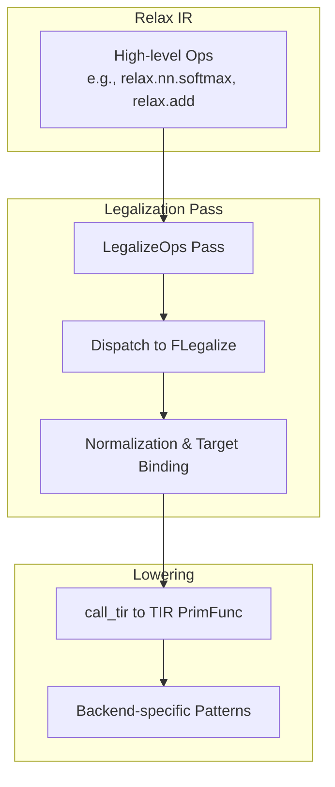
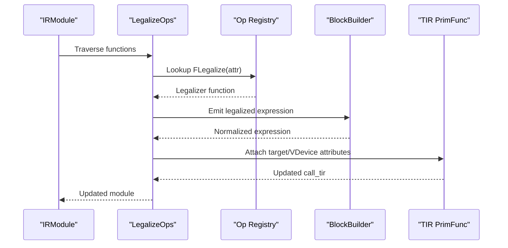
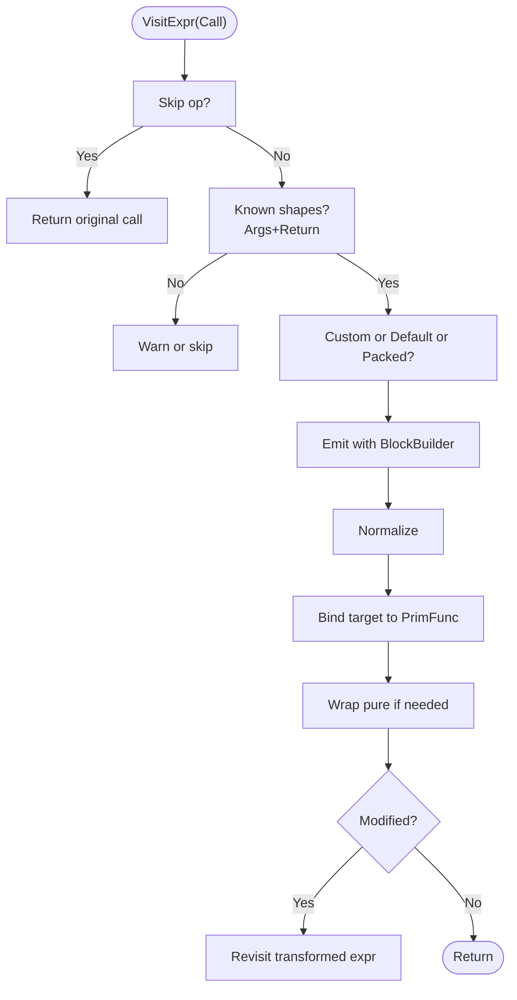
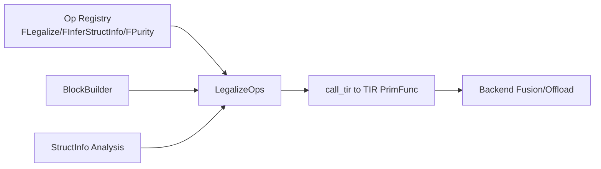

# Legalization Passes

<cite>
**Referenced Files in This Document**
- [legalize_ops.cc](file://src/relax/transform/legalize_ops.cc)
- [transform.h](file://include/tvm/relax/transform.h)
- [op_attr_types.h](file://include/tvm/relax/op_attr_types.h)
- [backend.h](file://include/tvm/relax/backend.h)
- [nn.cc](file://src/relax/op/nn/nn.cc)
- [binary.cc](file://src/relax/op/tensor/binary.cc)
- [create.cc](file://src/relax/op/tensor/create.cc)
- [pattern_registry.cc](file://src/relax/backend/pattern_registry.cc)
- [test_transform_legalize_ops.py](file://tests/python/relax/test_transform_legalize_ops.py)
</cite>

## Table of Contents
1. [Introduction](#introduction)
2. [Project Structure](#project-structure)
3. [Core Components](#core-components)
4. [Architecture Overview](#architecture-overview)
5. [Detailed Component Analysis](#detailed-component-analysis)
6. [Dependency Analysis](#dependency-analysis)
7. [Performance Considerations](#performance-considerations)
8. [Troubleshooting Guide](#troubleshooting-guide)
9. [Conclusion](#conclusion)
10. [Appendices](#appendices)

## Introduction
This document explains Relax’s legalization pass system that standardizes high-level operators into backend-compatible implementations. It covers the legalizer architecture, operator normalization patterns, backend-specific adaptations, and the relationship between legalizers and lowering phases. Practical guidance is included for implementing custom legalizers, handling operator variants, and integrating with target-specific code generators. Numerical precision and performance implications are discussed alongside best practices.

## Project Structure
Legalization is implemented as a pass that traverses Relax IR, dispatches to operator-specific legalizers, and lowers calls to call_tir with TIR PrimFuncs. Operators are declared with attributes that define structural inference, purity, and the legalizer function. Backend-specific fusion patterns and runtime lowering are coordinated via dedicated passes.

**Diagram sources**
- [legalize_ops.cc:234-392](file://src/relax/transform/legalize_ops.cc#L234-L392)
- [transform.h:254-256](file://include/tvm/relax/transform.h#L254-L256)

**Section sources**
- [legalize_ops.cc:234-392](file://src/relax/transform/legalize_ops.cc#L234-L392)
- [transform.h:254-256](file://include/tvm/relax/transform.h#L254-L256)

## Core Components
- LegalizeOps pass: Traverses IRModule, dispatches to operator legalizers, and ensures purity and target compatibility.
- Operator attributes: Operators expose FInferStructInfo, FPurity, and FLegalize attributes.
- Backend fusion registry: Provides pattern-based composition for backend offloading.
- Runtime backend passes: Lowering to VM builtins and shape lowering.

Key responsibilities:
- Dispatch logic selects custom legalizer, default legalizer, or packed function replacement.
- Shape and purity checks gate whether an operator can be legalized.
- Target-aware binding ensures generated PrimFuncs align with virtual device annotations.
- Normalization and recursive legalization ensure transformed expressions are well-formed.

**Section sources**
- [legalize_ops.cc:63-409](file://src/relax/transform/legalize_ops.cc#L63-L409)
- [op_attr_types.h:111-125](file://include/tvm/relax/op_attr_types.h#L111-L125)
- [backend.h:33-46](file://include/tvm/relax/backend.h#L33-L46)

## Architecture Overview
The legalizer pipeline transforms high-level operators into backend-callable TIR PrimFuncs. It integrates with layout inference, mixed precision, and backend fusion.

**Diagram sources**
- [legalize_ops.cc:234-392](file://src/relax/transform/legalize_ops.cc#L234-L392)
- [op_attr_types.h:111-125](file://include/tvm/relax/op_attr_types.h#L111-L125)

## Detailed Component Analysis

### LegalizeOps Pass Internals
- Dispatch logic:
  - Custom legalizer map overrides default.
  - Default legalizer from Op::GetAttrMap<FLegalize>.
  - Fallback to FCallPacked for explicit packed functions.
  - Warning emitted when no legalizer is found and shapes are known.
- Shape and purity gating:
  - Requires argument shapes for most ops; exceptions for data-dependent ops.
  - Ensures output shape is known unless data-dependent.
  - Wraps pure results when original op was pure but legalized wasn’t.
- Target binding:
  - Infers target from StructInfo vdevice.
  - Updates call_tir to reference a target-annotated PrimFunc.
- Recursive legalization:
  - Re-applies pass to newly emitted expressions to handle nested legalizations.

**Diagram sources**
- [legalize_ops.cc:234-392](file://src/relax/transform/legalize_ops.cc#L234-L392)

**Section sources**
- [legalize_ops.cc:47-61](file://src/relax/transform/legalize_ops.cc#L47-L61)
- [legalize_ops.cc:109-147](file://src/relax/transform/legalize_ops.cc#L109-L147)
- [legalize_ops.cc:149-232](file://src/relax/transform/legalize_ops.cc#L149-L232)
- [legalize_ops.cc:234-392](file://src/relax/transform/legalize_ops.cc#L234-L392)

### Operator Attributes and Registration
- FLegalize: Function type that transforms a Call into a backend-callable expression.
- FInferStructInfo: Computes output StructInfo for shape/type inference.
- FPurity: Boolean indicating if an operator is pure.
- FCallPacked: String name of an external packed function to replace the operator.

Registration examples:
- Neural operators (softmax, layer_norm, etc.) register FInferStructInfo and FPurity.
- Binary arithmetic operators register broadcasting shape inference and layout decisions.
- Creation operators (full, ones, zeros, eye, arange) register initialization semantics and dtype propagation.

**Section sources**
- [op_attr_types.h:111-125](file://include/tvm/relax/op_attr_types.h#L111-L125)
- [nn.cc:170-230](file://src/relax/op/nn/nn.cc#L170-L230)
- [nn.cc:442-523](file://src/relax/op/nn/nn.cc#L442-L523)
- [binary.cc:196-235](file://src/relax/op/tensor/binary.cc#L196-L235)
- [create.cc:93-100](file://src/relax/op/tensor/create.cc#L93-L100)
- [create.cc:174-246](file://src/relax/op/tensor/create.cc#L174-L246)
- [create.cc:316-332](file://src/relax/op/tensor/create.cc#L316-L332)

### Backend Fusion Patterns
- Pattern registry stores FusionPattern objects with name, pattern, annotations, and optional checks/attrs getters.
- Backend passes can merge composite functions and annotate them for offload.

**Section sources**
- [pattern_registry.cc:29-79](file://src/relax/backend/pattern_registry.cc#L29-L79)

### Practical Examples and Recipes

- Implement a custom legalizer:
  - Define a BlockBuilder-based function that emits backend calls (e.g., call_tir to PrimFunc).
  - Register the function as the operator’s FLegalize attribute.
  - Optionally register FInferStructInfo and FPurity.
  - Reference: [test_transform_legalize_ops.py:314-335](file://tests/python/relax/test_transform_legalize_ops.py#L314-L335)

- Handle operator variants:
  - Use attributes like axis, dtype, or layout to select backend implementations.
  - Example: softmax and layer_norm register FRelaxInferLayout to adapt to layout changes.

- Integrate with target-specific code generators:
  - Ensure generated PrimFuncs carry the correct Target attribute.
  - LegalizeMutator binds target based on vdevice annotations.

- Recursive legalizations:
  - Legalization may emit new operators that require further legalization.
  - The pass re-visits transformed expressions until no further changes occur.

**Section sources**
- [test_transform_legalize_ops.py:314-335](file://tests/python/relax/test_transform_legalize_ops.py#L314-L335)
- [legalize_ops.cc:360-392](file://src/relax/transform/legalize_ops.cc#L360-L392)
- [nn.cc:201-222](file://src/relax/op/nn/nn.cc#L201-L222)
- [nn.cc:555-580](file://src/relax/op/nn/nn.cc#L555-L580)

## Dependency Analysis
- LegalizeOps depends on:
  - Op registry for FLegalize and other attributes.
  - BlockBuilder for emitting and normalizing expressions.
  - StructInfo analysis for shape and purity checks.
  - Target/VDevice propagation for backend specialization.
- Backend passes depend on:
  - LegalizeOps outputs (call_tir).
  - Pattern registry for fusion composition.

**Diagram sources**
- [legalize_ops.cc:234-392](file://src/relax/transform/legalize_ops.cc#L234-L392)
- [op_attr_types.h:111-125](file://include/tvm/relax/op_attr_types.h#L111-L125)

**Section sources**
- [legalize_ops.cc:234-392](file://src/relax/transform/legalize_ops.cc#L234-L392)
- [transform.h:535-546](file://include/tvm/relax/transform.h#L535-L546)

## Performance Considerations
- Shape requirement: Legalization often requires known argument shapes; otherwise it may skip or warn. This avoids expensive runtime shape computations in generated kernels.
- Purity wrapping: Ensures correctness in purity-sensitive contexts (e.g., DataflowBlocks) without altering semantics.
- Target binding: Generates target-annotated PrimFuncs to avoid redundant kernel duplication and improve code reuse.
- Recursive legalization: Prevents redundant work by normalizing and re-applying only when modified.
- Backend fusion: Composes multiple operators into backend-specialized primitives, reducing overhead.

[No sources needed since this section provides general guidance]

## Troubleshooting Guide
Common issues and resolutions:
- No legalizer found:
  - Symptom: Warning logged for missing FLegalize.
  - Resolution: Register a custom FLegalize or ensure operator is supported.
- Missing known shapes:
  - Symptom: Skips operators whose shapes are unknown.
  - Resolution: Provide concrete shapes or use dynamic TIR PrimFuncs where supported.
- Purity mismatch:
  - Symptom: Unexpected purity errors.
  - Resolution: LegalizeMutator wraps pure calls when needed; ensure original op purity is correctly annotated.
- Target mismatch:
  - Symptom: Generated PrimFunc lacks target annotation.
  - Resolution: LegalizeMutator binds target based on vdevice; ensure StructInfo carries target.

**Section sources**
- [legalize_ops.cc:335-347](file://src/relax/transform/legalize_ops.cc#L335-L347)
- [legalize_ops.cc:254-318](file://src/relax/transform/legalize_ops.cc#L254-L318)
- [legalize_ops.cc:149-232](file://src/relax/transform/legalize_ops.cc#L149-L232)

## Conclusion
Relax’s legalizer system provides a robust, extensible framework for transforming high-level operators into backend-callable implementations. Through operator attributes, a centralized dispatch mechanism, and backend-aware adaptations, it enables portable and efficient code generation across diverse targets. Proper registration of FLegalize, FInferStructInfo, and FPurity, combined with careful handling of shapes and purity, ensures numerically sound and performant transformations.

[No sources needed since this section summarizes without analyzing specific files]

## Appendices

### Relationship Between Legalizers and Lowering Phases
- LegalizeOps lowers operators to call_tir with TIR PrimFuncs.
- Subsequent passes (e.g., VMShapeLower, LowerRuntimeBuiltin) handle runtime specifics.
- Backend fusion composes call_tir sequences into backend-specialized functions.

**Section sources**
- [backend.h:33-46](file://include/tvm/relax/backend.h#L33-L46)
- [transform.h:254-256](file://include/tvm/relax/transform.h#L254-L256)
- [transform.h:535-546](file://include/tvm/relax/transform.h#L535-L546)