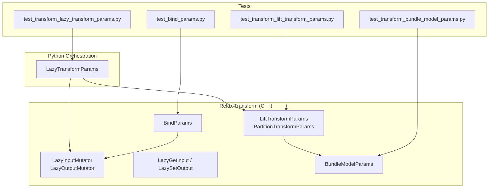
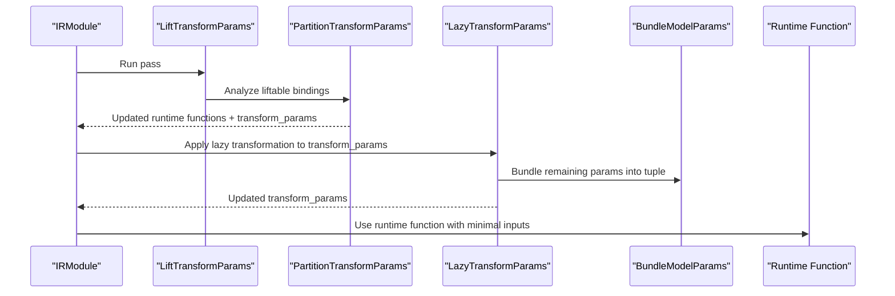
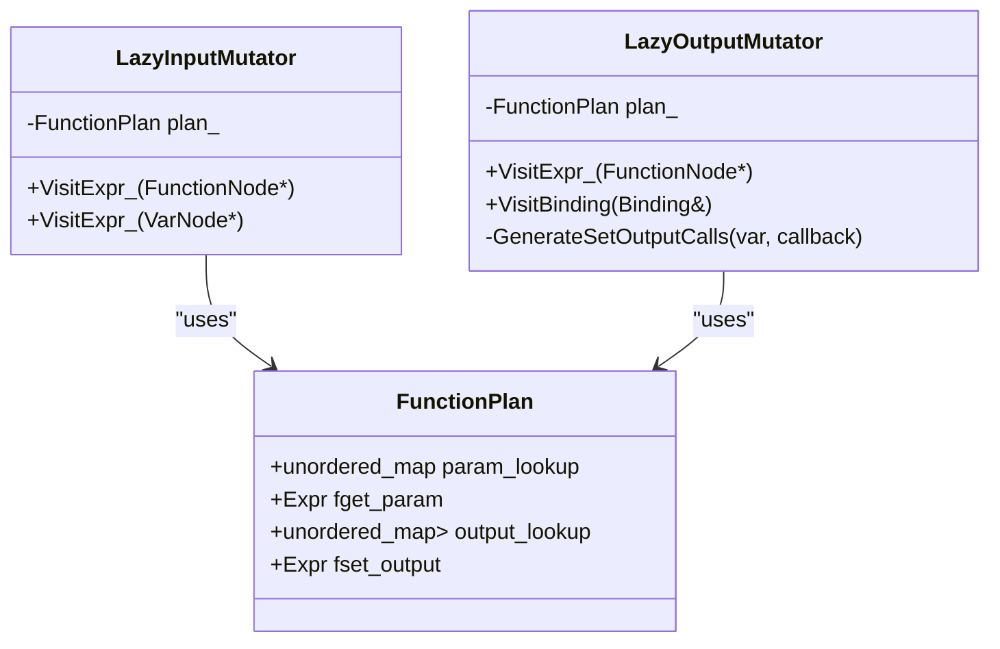
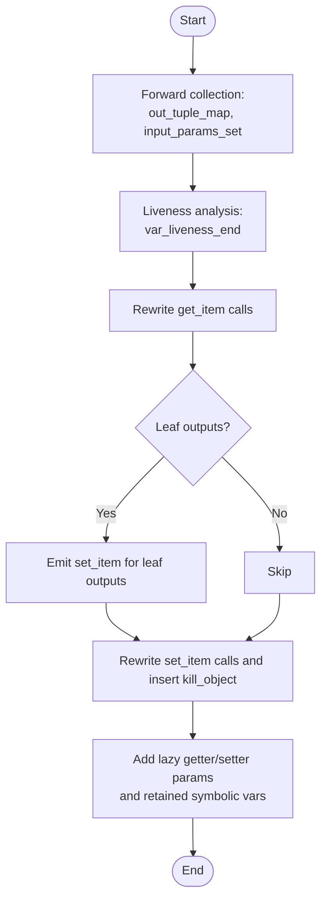
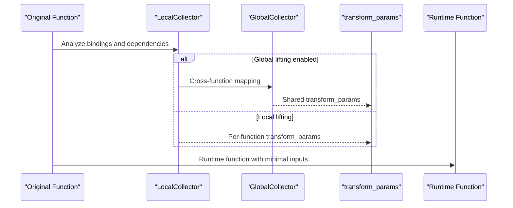
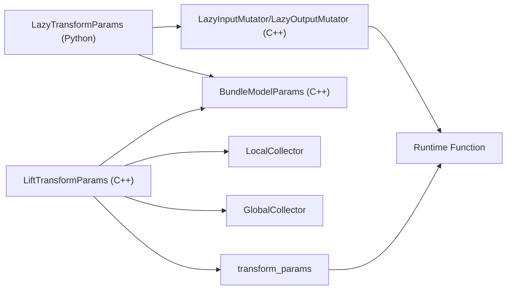

# Parameter Transformation

<cite>
**Referenced Files in This Document**
- [lazy_transform_params.cc](file://src/relax/transform/lazy_transform_params.cc)
- [lazy_transform_params.py](file://python/tvm/relax/transform/lazy_transform_params.py)
- [lift_transform_params.cc](file://src/relax/transform/lift_transform_params.cc)
- [bundle_model_params.cc](file://src/relax/transform/bundle_model_params.cc)
- [bind_params.cc](file://src/relax/transform/bind_params.cc)
- [test_transform_lazy_transform_params.py](file://tests/python/relax/test_transform_lazy_transform_params.py)
- [test_transform_lift_transform_params.py](file://tests/python/relax/test_transform_lift_transform_params.py)
- [test_bind_params.py](file://tests/python/relax/test_bind_params.py)
- [test_transform_bundle_model_params.py](file://tests/python/relax/test_transform_bundle_model_params.py)
</cite>

## Table of Contents
1. [Introduction](#introduction)
2. [Project Structure](#project-structure)
3. [Core Components](#core-components)
4. [Architecture Overview](#architecture-overview)
5. [Detailed Component Analysis](#detailed-component-analysis)
6. [Dependency Analysis](#dependency-analysis)
7. [Performance Considerations](#performance-considerations)
8. [Troubleshooting Guide](#troubleshooting-guide)
9. [Conclusion](#conclusion)

## Introduction
This document explains Relax’s parameter transformation system that optimizes parameter handling and memory management in compiled models. It focuses on:
- Lazy parameter transformation strategies that load parameters on demand and free them after last use
- Initialization patterns for transforming model parameters into optimized forms
- Memory-efficient parameter loading via bundling and consumption
- Compilation-time partitioning of parameter transforms into separate runtime and compile-time functions
- Practical examples, memory usage optimization, and integration with model loading workflows
- Runtime memory management, performance implications, and best practices for large-scale models
- Debugging techniques and strategies for dynamic shapes

## Project Structure
The parameter transformation system spans C++ and Python components within the Relax transform infrastructure:
- C++ passes implement low-level rewriting and memory-constrained transformations
- Python passes provide higher-level orchestration and user-facing APIs
- Tests validate correctness and performance characteristics

**Diagram sources**
- [lazy_transform_params.cc:53-122](file://src/relax/transform/lazy_transform_params.cc#L53-L122)
- [lazy_transform_params.cc:124-229](file://src/relax/transform/lazy_transform_params.cc#L124-L229)
- [lazy_transform_params.py:343-399](file://python/tvm/relax/transform/lazy_transform_params.py#L343-L399)
- [lift_transform_params.cc:756-821](file://src/relax/transform/lift_transform_params.cc#L756-L821)
- [bundle_model_params.cc:37-88](file://src/relax/transform/bundle_model_params.cc#L37-L88)
- [bind_params.cc:162-167](file://src/relax/transform/bind_params.cc#L162-L167)
- [test_transform_lazy_transform_params.py:671-701](file://tests/python/relax/test_transform_lazy_transform_params.py#L671-L701)
- [test_transform_lift_transform_params.py](file://tests/python/relax/test_transform_lift_transform_params.py)
- [test_bind_params.py](file://tests/python/relax/test_bind_params.py)
- [test_transform_bundle_model_params.py](file://tests/python/relax/test_transform_bundle_model_params.py)

**Section sources**
- [lazy_transform_params.cc:1-289](file://src/relax/transform/lazy_transform_params.cc#L1-L289)
- [lazy_transform_params.py:1-400](file://python/tvm/relax/transform/lazy_transform_params.py#L1-L400)
- [lift_transform_params.cc:1-881](file://src/relax/transform/lift_transform_params.cc#L1-L881)
- [bundle_model_params.cc:1-127](file://src/relax/transform/bundle_model_params.cc#L1-L127)
- [bind_params.cc:1-224](file://src/relax/transform/bind_params.cc#L1-L224)

## Core Components
- Lazy parameter transformation (C++): Rewrites parameter access and output emission to defer loading and immediately free parameters after last use. Implements two mutators:
  - LazyInputMutator: replaces direct parameter reads with calls to a lazy getter and inserts MatchCast to preserve type safety
  - LazyOutputMutator: rewrites outputs to emit via a lazy setter and inserts memory-free calls at liveness boundaries
- LazyTransformParams (Python): Orchestrates forward and liveness analysis, constructs lazy getters/setters, and adds retained symbolic variables as parameters
- LiftTransformParams (C++): Partitions each function into a runtime function and a compile-time transform_params function, optionally globally sharing computations
- BundleModelParams (C++): Bundles remaining parameter variables into a single tuple parameter and remaps accesses
- BindParams (C++): Binds named or variable parameters to constants and normalizes symbolic variables

**Section sources**
- [lazy_transform_params.cc:53-122](file://src/relax/transform/lazy_transform_params.cc#L53-L122)
- [lazy_transform_params.cc:124-229](file://src/relax/transform/lazy_transform_params.cc#L124-L229)
- [lazy_transform_params.py:26-229](file://python/tvm/relax/transform/lazy_transform_params.py#L26-L229)
- [lift_transform_params.cc:47-131](file://src/relax/transform/lift_transform_params.cc#L47-L131)
- [bundle_model_params.cc:37-88](file://src/relax/transform/bundle_model_params.cc#L37-L88)
- [bind_params.cc:85-154](file://src/relax/transform/bind_params.cc#L85-L154)

## Architecture Overview
The system separates parameter computation into two phases:
- Compile-time transform_params: performs heavy preprocessing and produces a tuple of transformed parameters
- Runtime function: consumes only the minimal necessary parameters and any propagated symbolic variables

**Diagram sources**
- [lift_transform_params.cc:756-821](file://src/relax/transform/lift_transform_params.cc#L756-L821)
- [lift_transform_params.cc:824-871](file://src/relax/transform/lift_transform_params.cc#L824-L871)
- [lazy_transform_params.py:343-399](file://python/tvm/relax/transform/lazy_transform_params.py#L343-L399)
- [bundle_model_params.cc:90-93](file://src/relax/transform/bundle_model_params.cc#L90-L93)

## Detailed Component Analysis

### Lazy Parameter Transformation (C++)
Implements on-demand parameter loading and immediate freeing after last use:
- LazyInputMutator
  - Adds a lazy getter parameter to the function signature
  - Rewrites parameter reads to call the getter with an index and a name hint
  - Inserts MatchCast to preserve structural information
- LazyOutputMutator
  - Adds a lazy setter parameter
  - Emits setter calls for outputs at binding sites
  - Inserts memory-free calls at liveness-killing points for inputs and outputs

**Diagram sources**
- [lazy_transform_params.cc:53-122](file://src/relax/transform/lazy_transform_params.cc#L53-L122)
- [lazy_transform_params.cc:124-229](file://src/relax/transform/lazy_transform_params.cc#L124-L229)

**Section sources**
- [lazy_transform_params.cc:53-122](file://src/relax/transform/lazy_transform_params.cc#L53-L122)
- [lazy_transform_params.cc:124-229](file://src/relax/transform/lazy_transform_params.cc#L124-L229)

### LazyTransformParams (Python)
High-level orchestrator:
- Performs forward collection to map outputs to indices and identify input-bound variables
- Performs backward liveness analysis to locate memory-free insertion points
- Rewrites get_item and set_item calls and injects extra parameters
- Retains symbolic variables as parameters to preserve dynamic shapes

**Diagram sources**
- [lazy_transform_params.py:140-229](file://python/tvm/relax/transform/lazy_transform_params.py#L140-L229)
- [lazy_transform_params.py:231-342](file://python/tvm/relax/transform/lazy_transform_params.py#L231-L342)

**Section sources**
- [lazy_transform_params.py:140-229](file://python/tvm/relax/transform/lazy_transform_params.py#L140-L229)
- [lazy_transform_params.py:231-342](file://python/tvm/relax/transform/lazy_transform_params.py#L231-L342)

### LiftTransformParams (C++)
Partitions each function into:
- A compile-time transform_params that computes and bundles parameters
- A runtime function that receives only necessary inputs and propagated symbolic variables

Key steps:
- Collect liftable bindings and categorize variables by dependency
- Build per-function or global transform_params with proper symbolic variable propagation
- Compose and expose transform_params for external invocation

**Diagram sources**
- [lift_transform_params.cc:433-507](file://src/relax/transform/lift_transform_params.cc#L433-L507)
- [lift_transform_params.cc:564-647](file://src/relax/transform/lift_transform_params.cc#L564-L647)
- [lift_transform_params.cc:756-821](file://src/relax/transform/lift_transform_params.cc#L756-L821)

**Section sources**
- [lift_transform_params.cc:433-507](file://src/relax/transform/lift_transform_params.cc#L433-L507)
- [lift_transform_params.cc:564-647](file://src/relax/transform/lift_transform_params.cc#L564-L647)
- [lift_transform_params.cc:756-821](file://src/relax/transform/lift_transform_params.cc#L756-L821)

### BundleModelParams (C++)
Bundles remaining parameter variables into a single tuple parameter and remaps accesses to TupleGetItem, reducing parameter count and simplifying runtime signatures.

**Section sources**
- [bundle_model_params.cc:37-88](file://src/relax/transform/bundle_model_params.cc#L37-L88)

### BindParams (C++)
Binds named or variable parameters to constants, normalizes symbolic variables, and ensures dtype/shape compatibility.

**Section sources**
- [bind_params.cc:85-154](file://src/relax/transform/bind_params.cc#L85-L154)

## Dependency Analysis
- LazyTransformParams depends on:
  - Forward and liveness analysis to determine when to free parameters
  - LazyInputMutator/LazyOutputMutator for rewriting
  - BundleModelParams to reduce parameter count
- LiftTransformParams depends on:
  - Local and optional global binding collectors
  - Symbolic variable propagation across functions
  - Composition of transform_params with existing functions

**Diagram sources**
- [lazy_transform_params.py:343-399](file://python/tvm/relax/transform/lazy_transform_params.py#L343-L399)
- [lazy_transform_params.cc:53-122](file://src/relax/transform/lazy_transform_params.cc#L53-L122)
- [lift_transform_params.cc:433-507](file://src/relax/transform/lift_transform_params.cc#L433-L507)
- [bundle_model_params.cc:37-88](file://src/relax/transform/bundle_model_params.cc#L37-L88)

**Section sources**
- [lazy_transform_params.py:343-399](file://python/tvm/relax/transform/lazy_transform_params.py#L343-L399)
- [lazy_transform_params.cc:53-122](file://src/relax/transform/lazy_transform_params.cc#L53-L122)
- [lift_transform_params.cc:433-507](file://src/relax/transform/lift_transform_params.cc#L433-L507)
- [bundle_model_params.cc:37-88](file://src/relax/transform/bundle_model_params.cc#L37-L88)

## Performance Considerations
- Lazy loading reduces peak memory by avoiding simultaneous materialization of all parameters
- Immediate freeing after last use minimizes long-term residency of intermediate tensors
- Global lifting reduces duplication of expensive parameter computations across functions
- Bundling parameters decreases call overhead and improves cache locality
- Symbolic variable retention ensures correctness for dynamic shapes without recomputation

[No sources needed since this section provides general guidance]

## Troubleshooting Guide
Common issues and remedies:
- Duplicate outputs in lazy transformation: ensure outputs are deduplicated and validated in tests
- Incorrect parameter counts or indices: verify num_input attributes and parameter mapping
- Dynamic shapes not preserved: confirm symbolic variables are retained as parameters
- Memory leaks or premature frees: review liveness analysis and kill_object insertion points

Validation references:
- Duplicate outputs test scenario
- Lazy transformation end-to-end VM invocation
- LiftTransformParams and BundleModelParams correctness checks

**Section sources**
- [test_transform_lazy_transform_params.py:682-701](file://tests/python/relax/test_transform_lazy_transform_params.py#L682-L701)
- [test_transform_lazy_transform_params.py:671-680](file://tests/python/relax/test_transform_lazy_transform_params.py#L671-L680)
- [test_transform_lift_transform_params.py](file://tests/python/relax/test_transform_lift_transform_params.py)
- [test_transform_bundle_model_params.py](file://tests/python/relax/test_transform_bundle_model_params.py)

## Conclusion
Relax’s parameter transformation system combines lazy evaluation, compile-time partitioning, and memory-aware rewriting to achieve significant memory and performance gains. By deferring parameter loading, immediately freeing them after last use, and sharing expensive computations across functions, it enables efficient deployment of large models. Proper use of symbolic variables, bundling, and binding ensures correctness and flexibility for dynamic shapes.