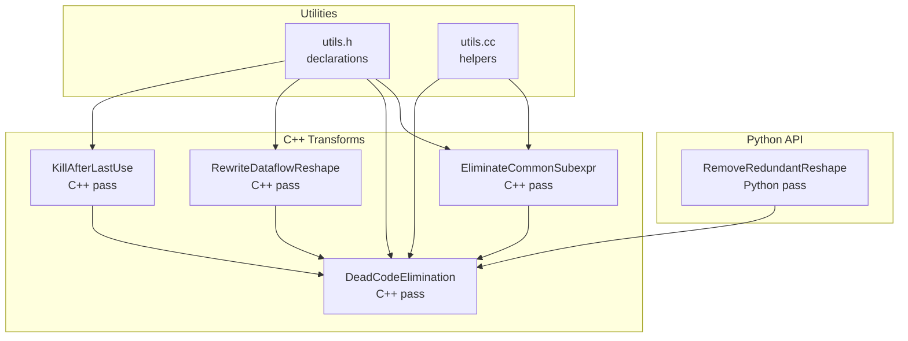
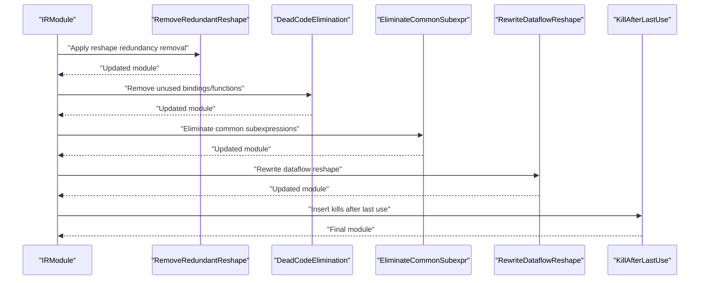
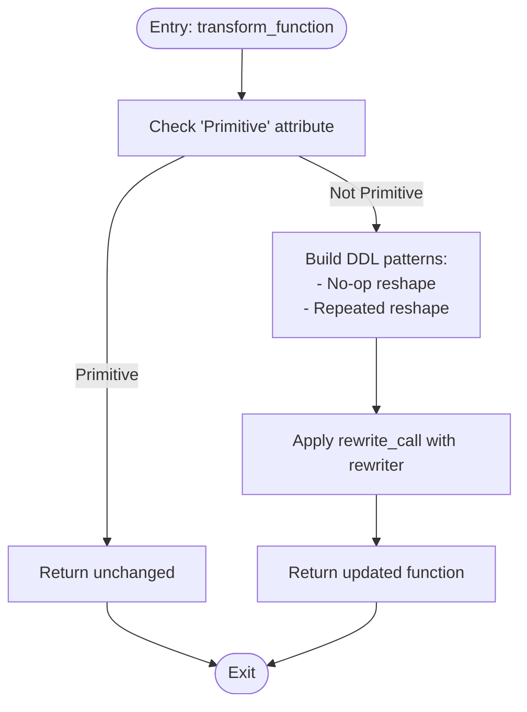
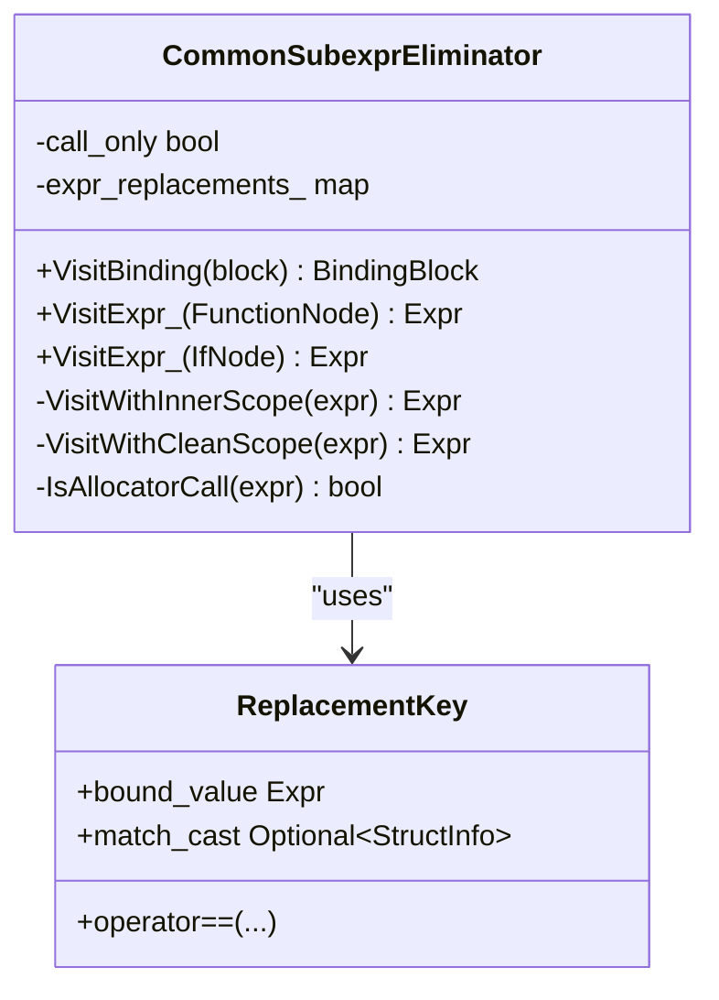
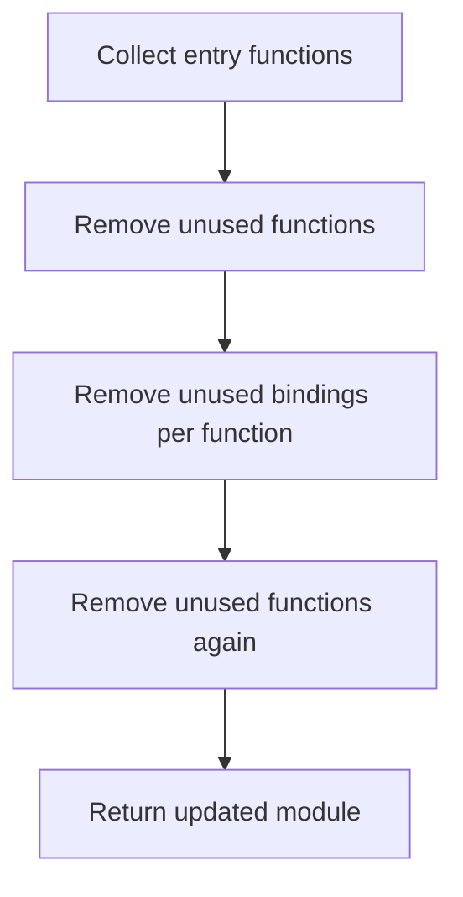
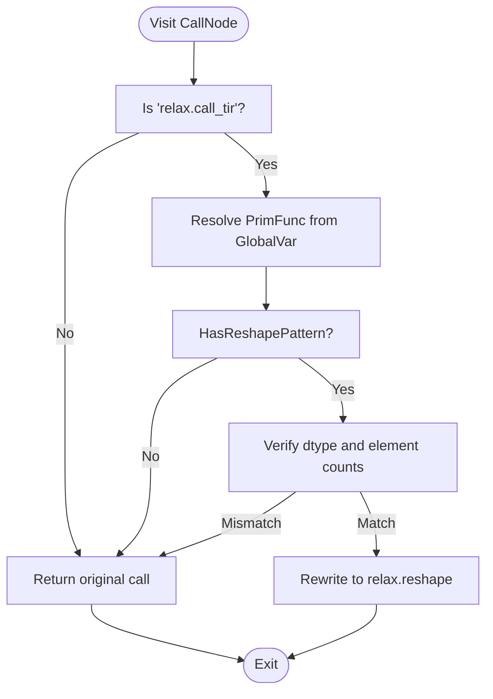
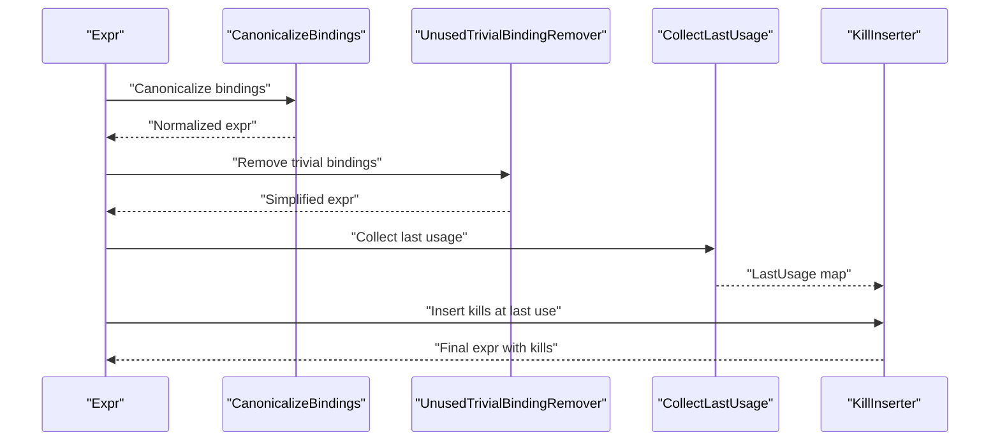
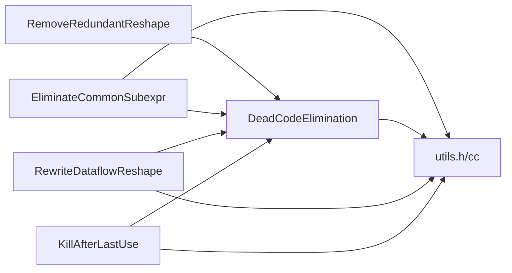

# Redundancy Elimination

<cite>
**Referenced Files in This Document**
- [remove_redundant_reshape.py](file://python/tvm/relax/transform/remove_redundant_reshape.py)
- [test_remove_redundant_reshape.py](file://tests/python/relax/test_remove_redundant_reshape.py)
- [eliminate_common_subexpr.cc](file://src/relax/transform/eliminate_common_subexpr.cc)
- [dead_code_elimination.cc](file://src/relax/transform/dead_code_elimination.cc)
- [rewrite_dataflow_reshape.cc](file://src/relax/transform/rewrite_dataflow_reshape.cc)
- [kill_after_last_use.cc](file://src/relax/transform/kill_after_last_use.cc)
- [utils.h](file://src/relax/transform/utils.h)
- [utils.cc](file://src/relax/transform/utils.cc)
- [test_analysis_contains_impure_call.py](file://tests/python/relax/test_analysis_contains_impure_call.py)
- [test_vm_codegen_only.py](file://tests/python/relax/test_vm_codegen_only.py)
</cite>

## Table of Contents
1. [Introduction](#introduction)
2. [Project Structure](#project-structure)
3. [Core Components](#core-components)
4. [Architecture Overview](#architecture-overview)
5. [Detailed Component Analysis](#detailed-component-analysis)
6. [Dependency Analysis](#dependency-analysis)
7. [Performance Considerations](#performance-considerations)
8. [Troubleshooting Guide](#troubleshooting-guide)
9. [Conclusion](#conclusion)
10. [Appendices](#appendices)

## Introduction
This document explains Relax’s redundancy elimination system that detects and removes unnecessary operations in computational graphs without changing program semantics. It focuses on:
- Detection of redundant reshape operations
- Duplicate computation elimination
- Efficient tensor transformation cleanup
- Safety checks for operation removal
- Preservation of side effects and memory lifecycle
- Practical examples, integration with graph analysis passes, and measurement of optimization effectiveness

The system leverages pattern matching, structural equality, and last-use analysis to safely prune redundant nodes and improve performance.

## Project Structure
The redundancy elimination functionality spans Python transformation APIs and C++ passes:
- Python-level pass definition for removing redundant reshape operations
- C++ passes for common subexpression elimination, dead code elimination, dataflow reshape rewriting, and kill-after-last-use insertion
- Utilities supporting canonicalization, composition, and analysis helpers
- Tests validating behavior and ensuring structural equality after transformations

**Diagram sources**
- [remove_redundant_reshape.py:29-83](file://python/tvm/relax/transform/remove_redundant_reshape.py#L29-L83)
- [eliminate_common_subexpr.cc:213-236](file://src/relax/transform/eliminate_common_subexpr.cc#L213-L236)
- [dead_code_elimination.cc:94-153](file://src/relax/transform/dead_code_elimination.cc#L94-L153)
- [rewrite_dataflow_reshape.cc:156-178](file://src/relax/transform/rewrite_dataflow_reshape.cc#L156-L178)
- [kill_after_last_use.cc:253-278](file://src/relax/transform/kill_after_last_use.cc#L253-L278)
- [utils.h:424-482](file://src/relax/transform/utils.h#L424-L482)
- [utils.cc:46-96](file://src/relax/transform/utils.cc#L46-L96)

**Section sources**
- [remove_redundant_reshape.py:1-83](file://python/tvm/relax/transform/remove_redundant_reshape.py#L1-L83)
- [eliminate_common_subexpr.cc:1-236](file://src/relax/transform/eliminate_common_subexpr.cc#L1-L236)
- [dead_code_elimination.cc:1-153](file://src/relax/transform/dead_code_elimination.cc#L1-L153)
- [rewrite_dataflow_reshape.cc:1-178](file://src/relax/transform/rewrite_dataflow_reshape.cc#L1-L178)
- [kill_after_last_use.cc:1-278](file://src/relax/transform/kill_after_last_use.cc#L1-L278)
- [utils.h:1-485](file://src/relax/transform/utils.h#L1-L485)
- [utils.cc:1-96](file://src/relax/transform/utils.cc#L1-L96)

## Core Components
- RemoveRedundantReshape (Python): Detects and removes no-op and repeated reshape operations by pattern matching and shape equality checks.
- EliminateCommonSubexpr (C++): Removes duplicate subexpressions within a function using structural equality and optional purity checks.
- DeadCodeElimination (C++): Removes unused bindings and functions, reducing graph size and enabling further optimizations.
- RewriteDataflowReshape (C++): Rewrites reshape PrimFunc calls back to high-level reshape operations when safe.
- KillAfterLastUse (C++): Inserts memory kill operations right after last use to free storage and tensors promptly.
- Utilities (C++): Provides helper functions for composition, canonicalization, and analysis.

**Section sources**
- [remove_redundant_reshape.py:29-83](file://python/tvm/relax/transform/remove_redundant_reshape.py#L29-L83)
- [eliminate_common_subexpr.cc:89-216](file://src/relax/transform/eliminate_common_subexpr.cc#L89-L216)
- [dead_code_elimination.cc:94-153](file://src/relax/transform/dead_code_elimination.cc#L94-L153)
- [rewrite_dataflow_reshape.cc:52-178](file://src/relax/transform/rewrite_dataflow_reshape.cc#L52-L178)
- [kill_after_last_use.cc:40-278](file://src/relax/transform/kill_after_last_use.cc#L40-L278)
- [utils.h:424-482](file://src/relax/transform/utils.h#L424-L482)

## Architecture Overview
The redundancy elimination pipeline integrates multiple passes to progressively simplify the graph:
- Pattern-based pass (RemoveRedundantReshape) prunes reshape chains and no-op reshapes
- Structural deduplication (EliminateCommonSubexpr) removes repeated computations
- Dead-code removal (DeadCodeElimination) clears unused bindings and functions
- Dataflow reshape normalization (RewriteDataflowReshape) ensures reshape semantics are expressed via high-level ops
- Memory lifecycle enforcement (KillAfterLastUse) inserts kills at last-use points

**Diagram sources**
- [remove_redundant_reshape.py:44-83](file://python/tvm/relax/transform/remove_redundant_reshape.py#L44-L83)
- [dead_code_elimination.cc:94-153](file://src/relax/transform/dead_code_elimination.cc#L94-L153)
- [eliminate_common_subexpr.cc:213-236](file://src/relax/transform/eliminate_common_subexpr.cc#L213-L236)
- [rewrite_dataflow_reshape.cc:156-178](file://src/relax/transform/rewrite_dataflow_reshape.cc#L156-L178)
- [kill_after_last_use.cc:253-278](file://src/relax/transform/kill_after_last_use.cc#L253-L278)

## Detailed Component Analysis

### RemoveRedundantReshape (Python)
Purpose:
- Detect redundant reshape chains and no-op reshapes where input and output shapes are equal.

Detection algorithm:
- Uses DDL pattern matching to recognize:
  - Single reshape with identical input and output shape (no-op)
  - Chains of reshape operations where later reshapes can be collapsed to the final shape
- Applies structural equality on shapes to confirm equivalence.

Safety and correctness:
- Skips primitive functions
- Returns early if patterns do not match
- Rewrites to either the outermost reshape or the original input when a no-op is detected

**Diagram sources**
- [remove_redundant_reshape.py:35-83](file://python/tvm/relax/transform/remove_redundant_reshape.py#L35-L83)

**Section sources**
- [remove_redundant_reshape.py:29-83](file://python/tvm/relax/transform/remove_redundant_reshape.py#L29-L83)
- [test_remove_redundant_reshape.py:30-118](file://tests/python/relax/test_remove_redundant_reshape.py#L30-L118)

### EliminateCommonSubexpr (C++)
Purpose:
- Remove duplicate subexpressions within a function to avoid recomputation.

Detection algorithm:
- Computes a ReplacementKey combining the bound value and optional match-cast struct info
- Uses structural equality and hashing to identify duplicates
- Tracks variable remapping to substitute later bindings with earlier equivalents

Safety and correctness:
- Skips expressions containing impure calls
- Avoids allocator calls
- Maintains scoping to prevent cross-scope substitutions
- Supports a call-only mode to limit deduplication to call nodes

**Diagram sources**
- [eliminate_common_subexpr.cc:89-216](file://src/relax/transform/eliminate_common_subexpr.cc#L89-L216)

**Section sources**
- [eliminate_common_subexpr.cc:89-216](file://src/relax/transform/eliminate_common_subexpr.cc#L89-L216)

### DeadCodeElimination (C++)
Purpose:
- Remove unused bindings and functions to shrink the graph and enable further optimizations.

Algorithm:
- Builds a call map from entry functions and external linkage
- Removes unreachable functions
- Iteratively removes unused bindings per function and rechecks reachability

**Diagram sources**
- [dead_code_elimination.cc:94-153](file://src/relax/transform/dead_code_elimination.cc#L94-L153)

**Section sources**
- [dead_code_elimination.cc:47-134](file://src/relax/transform/dead_code_elimination.cc#L47-L134)

### RewriteDataflowReshape (C++)
Purpose:
- Normalize reshape operations inside dataflow blocks to high-level reshape calls when the underlying PrimFunc is a pure reshape.

Algorithm:
- Identifies reshape PrimFunc calls
- Verifies dtype compatibility and element count equality
- Rewrites to a high-level reshape call with the destination shape

**Diagram sources**
- [rewrite_dataflow_reshape.cc:78-178](file://src/relax/transform/rewrite_dataflow_reshape.cc#L78-L178)

**Section sources**
- [rewrite_dataflow_reshape.cc:52-178](file://src/relax/transform/rewrite_dataflow_reshape.cc#L52-L178)

### KillAfterLastUse (C++)
Purpose:
- Insert memory kill operations immediately after the last use of tensors/storage/objects to reduce peak memory footprint.

Algorithm:
- Collects last usage points for each variable
- Inserts appropriate kill calls (tensor, storage, or object) at those points
- Removes trivial bindings and canonicalizes expressions beforehand

**Diagram sources**
- [kill_after_last_use.cc:253-278](file://src/relax/transform/kill_after_last_use.cc#L253-L278)

**Section sources**
- [kill_after_last_use.cc:40-278](file://src/relax/transform/kill_after_last_use.cc#L40-L278)

## Dependency Analysis
- Pattern-based pass (RemoveRedundantReshape) depends on DDL pattern matching and structural equality
- Structural deduplication (EliminateCommonSubexpr) depends on structural hash/equality and purity checks
- DeadCodeElimination depends on call graph analysis and function reachability
- RewriteDataflowReshape depends on PrimFunc analysis and shape arithmetic
- KillAfterLastUse depends on last-use analysis and memory operation semantics
- Utilities provide shared helpers for composition, canonicalization, and analysis

**Diagram sources**
- [remove_redundant_reshape.py:29-83](file://python/tvm/relax/transform/remove_redundant_reshape.py#L29-L83)
- [eliminate_common_subexpr.cc:213-236](file://src/relax/transform/eliminate_common_subexpr.cc#L213-L236)
- [dead_code_elimination.cc:94-153](file://src/relax/transform/dead_code_elimination.cc#L94-L153)
- [rewrite_dataflow_reshape.cc:156-178](file://src/relax/transform/rewrite_dataflow_reshape.cc#L156-L178)
- [kill_after_last_use.cc:253-278](file://src/relax/transform/kill_after_last_use.cc#L253-L278)
- [utils.h:424-482](file://src/relax/transform/utils.h#L424-L482)
- [utils.cc:46-96](file://src/relax/transform/utils.cc#L46-L96)

**Section sources**
- [utils.h:424-482](file://src/relax/transform/utils.h#L424-L482)
- [utils.cc:46-96](file://src/relax/transform/utils.cc#L46-L96)

## Performance Considerations
- Removing redundant reshapes reduces memory movement and kernel launches, especially in chains of reshape operations
- Common subexpression elimination prevents repeated computation of expensive operations
- Dead code elimination reduces memory footprint and improves cache locality
- Inserting kills after last use minimizes peak memory usage and enables earlier reuse of storage
- Combining passes in the recommended order maximizes benefits and avoids reintroducing redundancy

[No sources needed since this section provides general guidance]

## Troubleshooting Guide
Common issues and remedies:
- Impure operations: Some expressions cannot be deduplicated. Verify purity using analysis helpers and ensure impure branches are excluded from deduplication.
- Shape equality: Ensure shapes are structurally equal and element counts match when rewriting reshapes.
- Primitive functions: Certain functions are skipped by the reshape pass; confirm attributes and skip conditions.
- Memory kills: Confirm kills are inserted after last use and not duplicated; verify VM object lifetimes.

Diagnostic aids:
- Use tests that assert structural equality to validate transformations
- Inspect pass ordering and interplay between passes
- Validate memory lifecycle with VM-related tests

**Section sources**
- [test_analysis_contains_impure_call.py:69-106](file://tests/python/relax/test_analysis_contains_impure_call.py#L69-L106)
- [test_vm_codegen_only.py:388-415](file://tests/python/relax/test_vm_codegen_only.py#L388-L415)
- [test_remove_redundant_reshape.py:30-118](file://tests/python/relax/test_remove_redundant_reshape.py#L30-L118)

## Conclusion
Relax’s redundancy elimination system combines pattern-based rewriting, structural deduplication, dead code removal, and precise memory lifecycle management to produce efficient and semantically equivalent computational graphs. By integrating these passes in the recommended order and applying safety checks, developers can achieve significant performance improvements while preserving correctness and side effects.

[No sources needed since this section summarizes without analyzing specific files]

## Appendices

### Practical Examples and Patterns
- Redundant reshape chains: Multiple sequential reshapes collapsing to a single reshape
- No-op reshapes: Reshaping to the same shape as the input
- Duplicate computations: Identical subexpressions computed more than once
- Inefficient tensor transformations: Calls to PrimFunc reshape where a high-level reshape suffices

Validation:
- Use tests that compare pre- and post-transformation modules via structural equality

**Section sources**
- [test_remove_redundant_reshape.py:36-118](file://tests/python/relax/test_remove_redundant_reshape.py#L36-L118)

### Integration with Graph Analysis Passes
- Use DeadCodeElimination to remove unused nodes before applying other passes
- Apply EliminateCommonSubexpr to consolidate repeated computations
- Use RewriteDataflowReshape to normalize reshape semantics
- Insert KillAfterLastUse to enforce memory lifecycle

**Section sources**
- [dead_code_elimination.cc:94-153](file://src/relax/transform/dead_code_elimination.cc#L94-L153)
- [eliminate_common_subexpr.cc:213-236](file://src/relax/transform/eliminate_common_subexpr.cc#L213-L236)
- [rewrite_dataflow_reshape.cc:156-178](file://src/relax/transform/rewrite_dataflow_reshape.cc#L156-L178)
- [kill_after_last_use.cc:253-278](file://src/relax/transform/kill_after_last_use.cc#L253-L278)

### Measuring Optimization Effectiveness
- Count nodes before and after passes to quantify reductions
- Compare memory usage metrics and kernel launch counts
- Validate functional correctness using structural equality assertions

[No sources needed since this section provides general guidance]