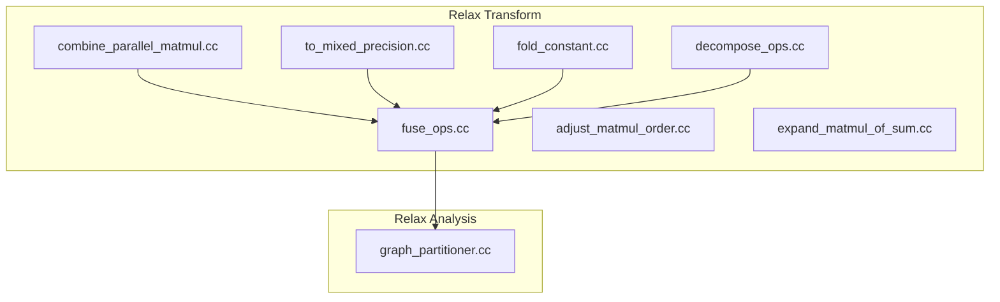
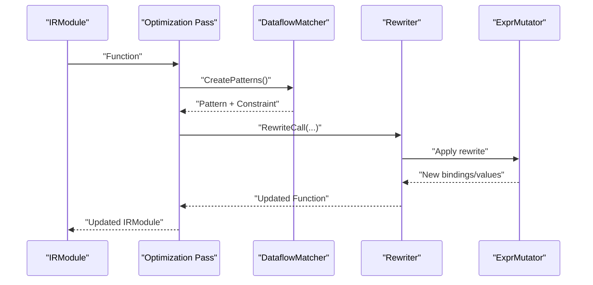
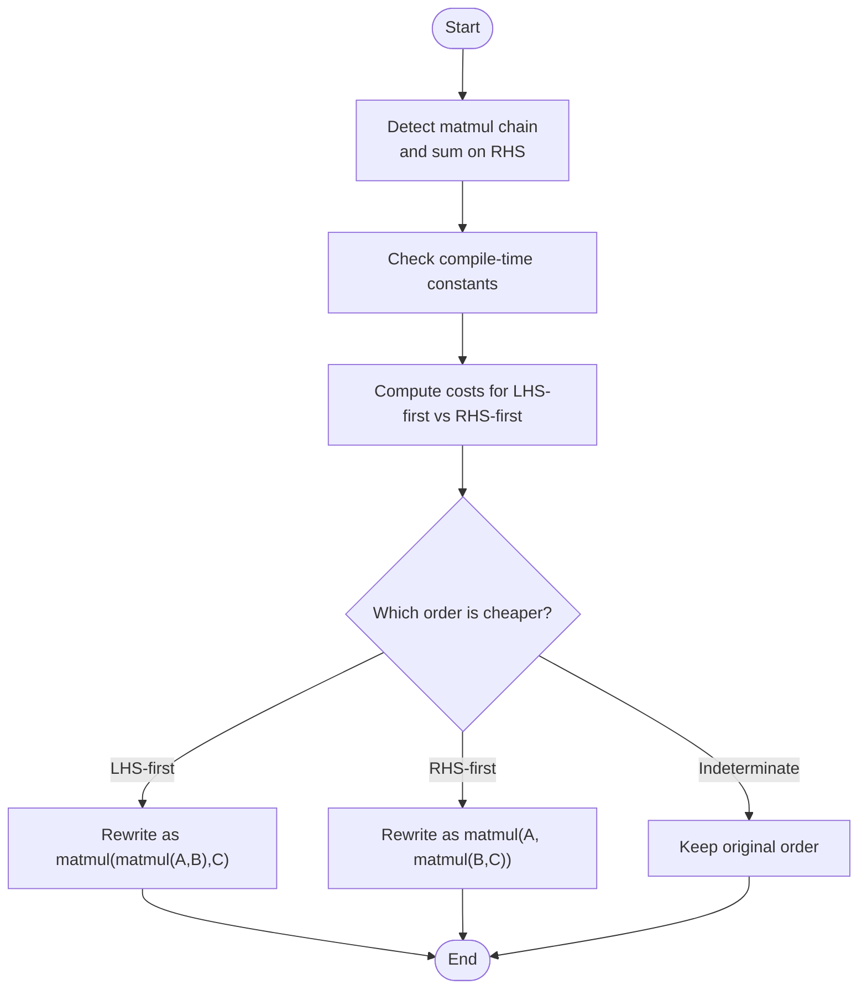
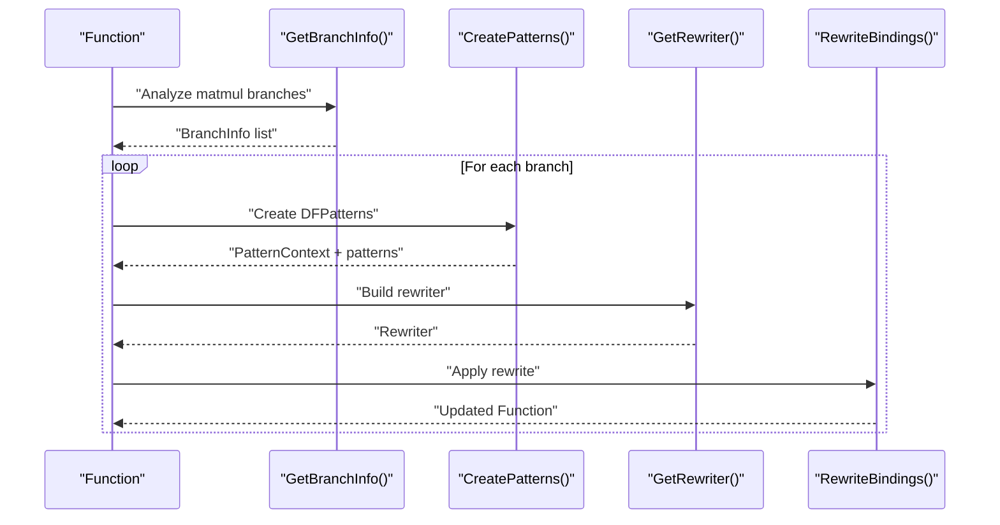
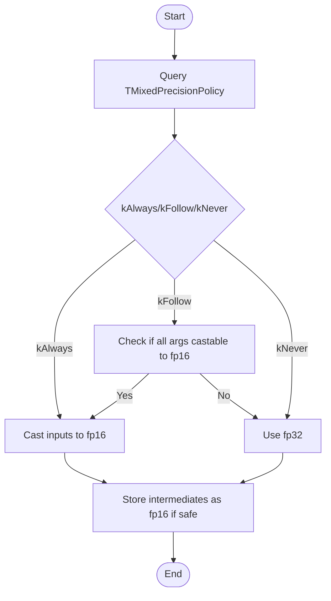
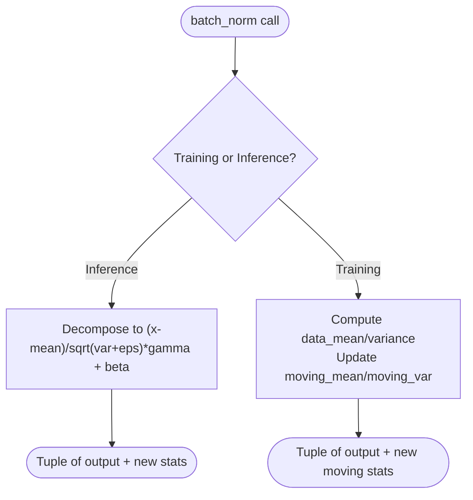
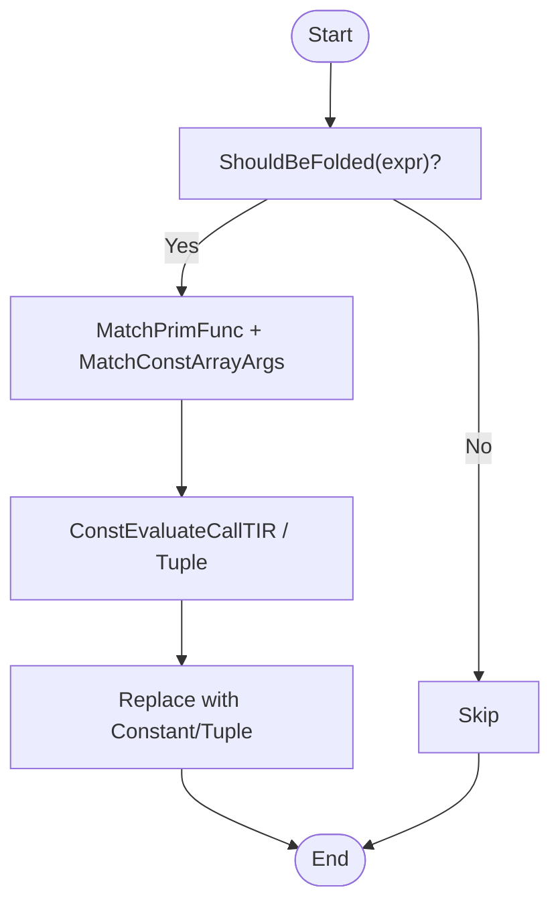
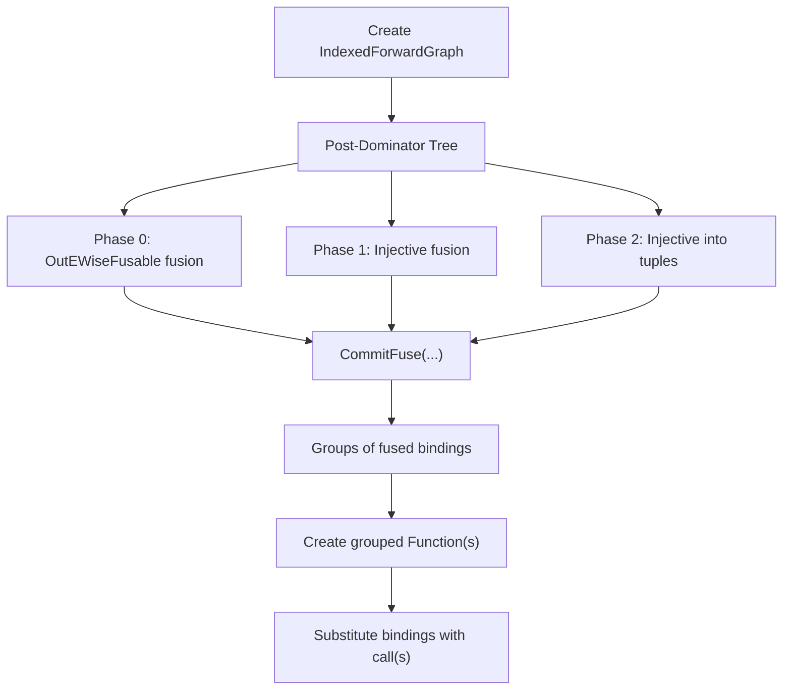
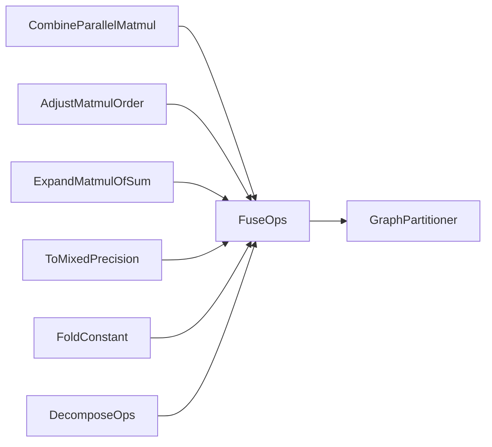

# Specialized Optimizations

<cite>
**Referenced Files in This Document**
- [fuse_ops.cc](file://src/relax/transform/fuse_ops.cc)
- [graph_partitioner.cc](file://src/relax/analysis/graph_partitioner.cc)
- [combine_parallel_matmul.cc](file://src/relax/transform/combine_parallel_matmul.cc)
- [adjust_matmul_order.cc](file://src/relax/transform/adjust_matmul_order.cc)
- [expand_matmul_of_sum.cc](file://src/relax/transform/expand_matmul_of_sum.cc)
- [fold_constant.cc](file://src/relax/transform/fold_constant.cc)
- [to_mixed_precision.cc](file://src/relax/transform/to_mixed_precision.cc)
- [decompose_ops.cc](file://src/relax/transform/decompose_ops.cc)
</cite>

## Table of Contents
1. [Introduction](#introduction)
2. [Project Structure](#project-structure)
3. [Core Components](#core-components)
4. [Architecture Overview](#architecture-overview)
5. [Detailed Component Analysis](#detailed-component-analysis)
6. [Dependency Analysis](#dependency-analysis)
7. [Performance Considerations](#performance-considerations)
8. [Troubleshooting Guide](#troubleshooting-guide)
9. [Conclusion](#conclusion)
10. [Appendices](#appendices)

## Introduction
This document explains Relax’s specialized optimization passes that target specific computational patterns and performance bottlenecks. It focuses on:
- Transpose-fused matmul optimizations
- Fast math transformations
- Batch normalization folding
- Parallel matmul combination
- Mixed precision conversion
- Constant folding and algebraic rewrites

It covers pattern recognition, optimization heuristics, safety checks, trade-offs between numerical precision and performance, and integration into the Relax transformation pipeline. Practical examples, effectiveness measurements, and debugging/profiling guidance are included.

## Project Structure
Relax optimization passes live primarily under the Relax transformation and analysis modules. The passes leverage:
- Dataflow pattern matching and rewriting
- Graph partitioning and operator fusion
- Structural analysis and arithmetic reasoning
- Mixed precision policies and dtype inference

**Diagram sources**
- [fuse_ops.cc:100-140](file://src/relax/transform/fuse_ops.cc#L100-L140)
- [graph_partitioner.cc:101-112](file://src/relax/analysis/graph_partitioner.cc#L101-L112)
- [combine_parallel_matmul.cc:255-377](file://src/relax/transform/combine_parallel_matmul.cc#L255-L377)
- [adjust_matmul_order.cc:42-222](file://src/relax/transform/adjust_matmul_order.cc#L42-L222)
- [expand_matmul_of_sum.cc:43-95](file://src/relax/transform/expand_matmul_of_sum.cc#L43-L95)
- [fold_constant.cc:34-418](file://src/relax/transform/fold_constant.cc#L34-L418)
- [to_mixed_precision.cc:116-611](file://src/relax/transform/to_mixed_precision.cc#L116-L611)
- [decompose_ops.cc:193-210](file://src/relax/transform/decompose_ops.cc#L193-L210)

**Section sources**
- [fuse_ops.cc:100-140](file://src/relax/transform/fuse_ops.cc#L100-L140)
- [graph_partitioner.cc:101-112](file://src/relax/analysis/graph_partitioner.cc#L101-L112)

## Core Components
- Operator fusion and grouping: Builds a forward graph, computes post-dominators, and partitions nodes into fusion groups respecting op patterns and argument limits.
- Parallel matmul combination: Detects multiple matmul branches sharing the same LHS and fuses RHS weights and optional biases/activations.
- Matmul reordering and expansion: Chooses optimal matmul ordering and expands matmul-of-sum into separate matmuls to enable fusion.
- Mixed precision conversion: Infers per-op casting policies, performs backward dtype propagation, and rewrites expressions to reduce bandwidth/energy.
- Constant folding: Evaluates constant-shaped call_tir and composite ops at compile-time when beneficial.
- Batch normalization decomposition: Converts batch_norm into equivalent sequences of reductions and elementwise ops for inference or training.

**Section sources**
- [fuse_ops.cc:100-140](file://src/relax/transform/fuse_ops.cc#L100-L140)
- [graph_partitioner.cc:101-112](file://src/relax/analysis/graph_partitioner.cc#L101-L112)
- [combine_parallel_matmul.cc:255-377](file://src/relax/transform/combine_parallel_matmul.cc#L255-L377)
- [adjust_matmul_order.cc:42-222](file://src/relax/transform/adjust_matmul_order.cc#L42-L222)
- [expand_matmul_of_sum.cc:43-95](file://src/relax/transform/expand_matmul_of_sum.cc#L43-L95)
- [to_mixed_precision.cc:116-611](file://src/relax/transform/to_mixed_precision.cc#L116-L611)
- [fold_constant.cc:34-418](file://src/relax/transform/fold_constant.cc#L34-L418)
- [decompose_ops.cc:193-210](file://src/relax/transform/decompose_ops.cc#L193-L210)

## Architecture Overview
The passes integrate with the Relax IR via:
- Pattern-based rewriting using dataflow patterns
- Structural analysis and arithmetic reasoning
- Fusion via graph partitioning and post-dominator analysis
- Dtype inference and mixed precision rewriting

**Diagram sources**
- [fuse_ops.cc:42-80](file://src/relax/transform/fuse_ops.cc#L42-L80)
- [adjust_matmul_order.cc:42-222](file://src/relax/transform/adjust_matmul_order.cc#L42-L222)
- [expand_matmul_of_sum.cc:43-95](file://src/relax/transform/expand_matmul_of_sum.cc#L43-L95)
- [combine_parallel_matmul.cc:118-253](file://src/relax/transform/combine_parallel_matmul.cc#L118-L253)

## Detailed Component Analysis

### Transpose-Fused Matmul Optimizations
These passes recognize matmul chains and restructure them to improve memory access and enable fusion:
- AdjustMatmulOrder: Chooses left-to-right vs right-to-left matmul order based on shapes and compile-time analysis, preferring the cheaper path or keeping compile-time constants grouped.
- ExpandMatmulOfSum: Expands matmul-of-sum into separate matmuls to exploit fusion opportunities downstream.

**Diagram sources**
- [adjust_matmul_order.cc:167-218](file://src/relax/transform/adjust_matmul_order.cc#L167-L218)

**Section sources**
- [adjust_matmul_order.cc:42-222](file://src/relax/transform/adjust_matmul_order.cc#L42-L222)
- [expand_matmul_of_sum.cc:43-95](file://src/relax/transform/expand_matmul_of_sum.cc#L43-L95)

### Parallel Matmul Combination
This pass detects multiple matmul branches sharing the same LHS and fuses them by concatenating RHS weights along the output channel dimension, optionally concatenating bias and applying activation uniformly.

**Diagram sources**
- [combine_parallel_matmul.cc:255-377](file://src/relax/transform/combine_parallel_matmul.cc#L255-L377)
- [combine_parallel_matmul.cc:118-253](file://src/relax/transform/combine_parallel_matmul.cc#L118-L253)

**Section sources**
- [combine_parallel_matmul.cc:255-377](file://src/relax/transform/combine_parallel_matmul.cc#L255-L377)

### Mixed Precision Conversion
This pass performs backward dtype propagation to determine whether intermediates can safely be stored in lower precision, then rewrites the function to cast inputs appropriately and store outputs at the desired precision.

**Diagram sources**
- [to_mixed_precision.cc:116-270](file://src/relax/transform/to_mixed_precision.cc#L116-L270)
- [to_mixed_precision.cc:272-611](file://src/relax/transform/to_mixed_precision.cc#L272-L611)

**Section sources**
- [to_mixed_precision.cc:116-270](file://src/relax/transform/to_mixed_precision.cc#L116-L270)
- [to_mixed_precision.cc:272-611](file://src/relax/transform/to_mixed_precision.cc#L272-L611)

### Batch Normalization Folding
Two complementary passes handle BN:
- DecomposeOpsForInference: Converts batch_norm into a sequence of reductions and elementwise ops for inference.
- DecomposeOpsForTraining: Mutates batch_norm to compute data_mean/variance and updates moving statistics.

**Diagram sources**
- [decompose_ops.cc:52-112](file://src/relax/transform/decompose_ops.cc#L52-L112)
- [decompose_ops.cc:114-139](file://src/relax/transform/decompose_ops.cc#L114-L139)
- [decompose_ops.cc:193-210](file://src/relax/transform/decompose_ops.cc#L193-L210)

**Section sources**
- [decompose_ops.cc:52-112](file://src/relax/transform/decompose_ops.cc#L52-L112)
- [decompose_ops.cc:114-139](file://src/relax/transform/decompose_ops.cc#L114-L139)
- [decompose_ops.cc:193-210](file://src/relax/transform/decompose_ops.cc#L193-L210)

### Constant Folding and Algebraic Rewrites
- FoldConstant: Evaluates call_tir with constant inputs and shapes, folds composite ops when beneficial, and avoids materializing overly large constants.
- ExpandMatmulOfSum: Distributes matmul across sums to enable fusion and reuse of intermediate results.

**Diagram sources**
- [fold_constant.cc:153-192](file://src/relax/transform/fold_constant.cc#L153-L192)
- [fold_constant.cc:269-293](file://src/relax/transform/fold_constant.cc#L269-L293)
- [expand_matmul_of_sum.cc:61-92](file://src/relax/transform/expand_matmul_of_sum.cc#L61-L92)

**Section sources**
- [fold_constant.cc:153-192](file://src/relax/transform/fold_constant.cc#L153-L192)
- [fold_constant.cc:269-293](file://src/relax/transform/fold_constant.cc#L269-L293)
- [expand_matmul_of_sum.cc:61-92](file://src/relax/transform/expand_matmul_of_sum.cc#L61-L92)

### Operator Fusion and Pattern Recognition
Fusion builds a forward graph from bindings, assigns op patterns, computes post-dominators, and partitions nodes into groups. The fusion algorithm respects:
- Op pattern compatibility (elemwise, broadcast, injective, tuple, reduction, OutEWiseFusable)
- Argument count limits and maximum fused depth
- Deferred fusing for tuple fields and compile-time constants

**Diagram sources**
- [fuse_ops.cc:100-140](file://src/relax/transform/fuse_ops.cc#L100-L140)
- [graph_partitioner.cc:101-112](file://src/relax/analysis/graph_partitioner.cc#L101-L112)
- [graph_partitioner.cc:324-441](file://src/relax/analysis/graph_partitioner.cc#L324-L441)

**Section sources**
- [fuse_ops.cc:100-140](file://src/relax/transform/fuse_ops.cc#L100-L140)
- [graph_partitioner.cc:101-112](file://src/relax/analysis/graph_partitioner.cc#L101-L112)
- [graph_partitioner.cc:324-441](file://src/relax/analysis/graph_partitioner.cc#L324-L441)

## Dependency Analysis
- FuseOps depends on GraphPartitioner for post-dominator analysis and fusion decisions.
- CombineParallelMatmul relies on DFPatterns and arithmetic analysis to group compatible branches.
- AdjustMatmulOrder and ExpandMatmulOfSum use structural shape analysis and compile-time detection.
- ToMixedPrecision uses op-registered policies and dtype inference utilities.
- FoldConstant integrates with TIR PrimFunc evaluation and composite op legalization.
- DecomposeOps leverages training/inference modes and structured rewriting.

**Diagram sources**
- [fuse_ops.cc:100-140](file://src/relax/transform/fuse_ops.cc#L100-L140)
- [graph_partitioner.cc:101-112](file://src/relax/analysis/graph_partitioner.cc#L101-L112)
- [combine_parallel_matmul.cc:255-377](file://src/relax/transform/combine_parallel_matmul.cc#L255-L377)
- [adjust_matmul_order.cc:42-222](file://src/relax/transform/adjust_matmul_order.cc#L42-L222)
- [expand_matmul_of_sum.cc:43-95](file://src/relax/transform/expand_matmul_of_sum.cc#L43-L95)
- [to_mixed_precision.cc:116-270](file://src/relax/transform/to_mixed_precision.cc#L116-L270)
- [fold_constant.cc:34-418](file://src/relax/transform/fold_constant.cc#L34-L418)
- [decompose_ops.cc:193-210](file://src/relax/transform/decompose_ops.cc#L193-L210)

**Section sources**
- [fuse_ops.cc:100-140](file://src/relax/transform/fuse_ops.cc#L100-L140)
- [graph_partitioner.cc:101-112](file://src/relax/analysis/graph_partitioner.cc#L101-L112)
- [combine_parallel_matmul.cc:255-377](file://src/relax/transform/combine_parallel_matmul.cc#L255-L377)
- [adjust_matmul_order.cc:42-222](file://src/relax/transform/adjust_matmul_order.cc#L42-L222)
- [expand_matmul_of_sum.cc:43-95](file://src/relax/transform/expand_matmul_of_sum.cc#L43-L95)
- [to_mixed_precision.cc:116-270](file://src/relax/transform/to_mixed_precision.cc#L116-L270)
- [fold_constant.cc:34-418](file://src/relax/transform/fold_constant.cc#L34-L418)
- [decompose_ops.cc:193-210](file://src/relax/transform/decompose_ops.cc#L193-L210)

## Performance Considerations
- Numerical precision vs throughput: Mixed precision reduces memory bandwidth and can increase throughput, but may degrade accuracy. Use kAlways for ops that benefit from TensorCore-like accumulation while preserving output precision.
- Memory access locality: Reordering matmuls and expanding sums enables better fusion and reduces redundant loads.
- Constant folding thresholds: Avoid materializing very large constants; the pass skips folding for creation ops with large outputs unless inputs are also present.
- Fusion depth and argument limits: Respect max_fuse_depth and max_function_args to prevent excessive function sizes and stack pressure.

[No sources needed since this section provides general guidance]

## Troubleshooting Guide
- Mixed precision instability: Ops with kNever policy (e.g., softmax) must remain at higher precision. Verify that inputs are cast back to the original dtype when required.
- Incorrect fusion boundaries: Ensure post-dominator analysis is valid and that incompatible op patterns are not merged (e.g., tuple roots and OutEWiseFusable anchors).
- BN decomposition mismatches: Confirm training vs inference mode selection and that axis alignment is handled via expand_dims.
- Compile-time assumptions: If shapes or symbolic bounds are missing, rewrites may be conservative; add shape inference or pass bounds to enable tighter decisions.

**Section sources**
- [to_mixed_precision.cc:488-507](file://src/relax/transform/to_mixed_precision.cc#L488-L507)
- [graph_partitioner.cc:356-366](file://src/relax/analysis/graph_partitioner.cc#L356-L366)
- [decompose_ops.cc:52-77](file://src/relax/transform/decompose_ops.cc#L52-L77)

## Conclusion
Relax’s specialized optimizations target key performance bottlenecks by recognizing structured patterns and applying precise transformations. Together, they improve memory efficiency, enable aggressive fusion, and balance numerical precision with throughput. Proper integration with the transformation pipeline and careful safety checks ensure reliable and effective optimizations across diverse workloads.

[No sources needed since this section summarizes without analyzing specific files]

## Appendices

### Practical Examples and Effectiveness
- Parallel matmul fusion: Combining multiple matmul branches with shared LHS reduces kernel launches and improves cache locality.
- Matmul reordering: Choosing the cheaper order based on shapes can reduce total FLOPs by up to a factor proportional to the smaller dimension.
- Mixed precision: Converting GEMM and convolution inputs to fp16 while preserving output precision yields significant bandwidth savings on supported hardware.
- Constant folding: Folding small, repeated computations reduces program size and eliminates runtime overhead.

[No sources needed since this section provides general guidance]

### Debugging and Profiling Strategies
- Enable pass-level logs to inspect fusion groups and rewrite decisions.
- Use structural shape analysis to validate assumptions about tensor ranks and axes.
- Profile kernels to confirm fusion-induced improvements and monitor regressions caused by excessive function sizes.
- Validate numerical stability by temporarily disabling mixed precision and comparing outputs.

[No sources needed since this section provides general guidance]

### Adapting Optimizations to Hardware and Workloads
- Tune max_fuse_depth and max_function_args to match target device capabilities.
- Extend op policies for mixed precision by registering TMixedPrecisionPolicy and FInferMixedPrecision for new ops.
- Incorporate hardware-specific bounds and constraints into arithmetic reasoning for matmul reordering.

[No sources needed since this section provides general guidance]