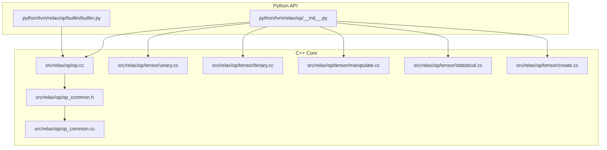
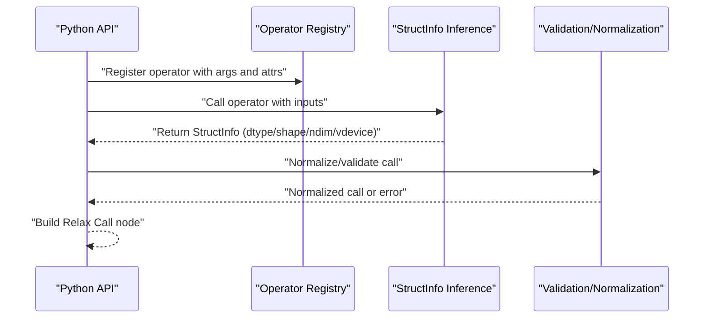
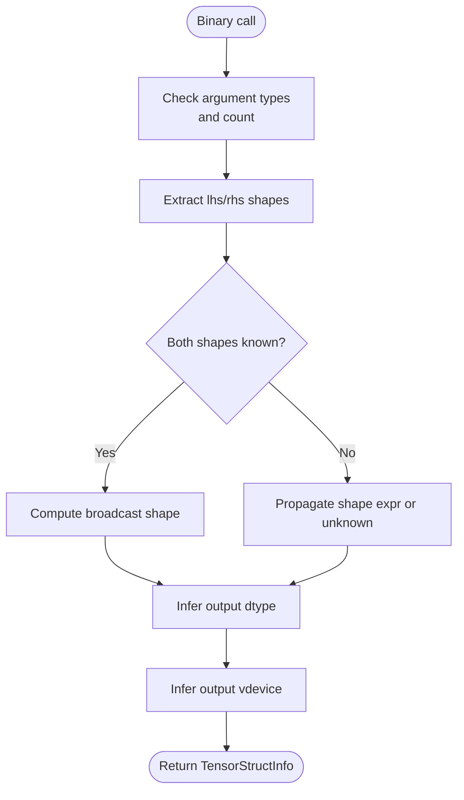
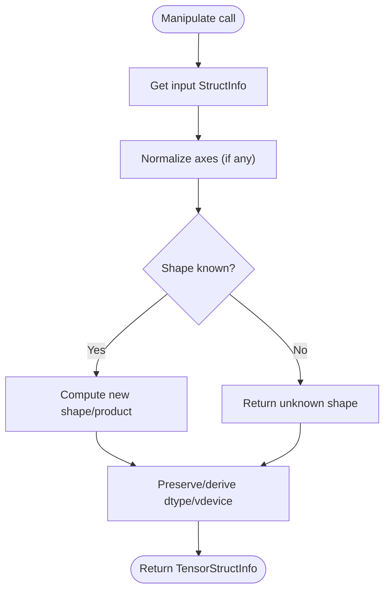
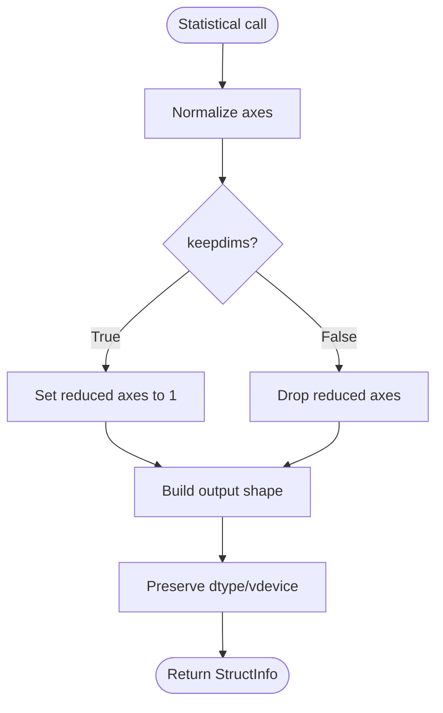
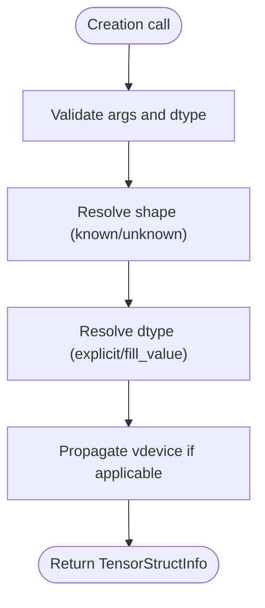
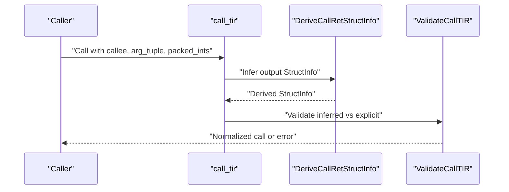
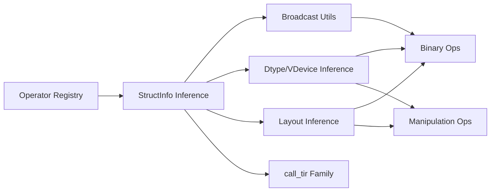

# Built-in Operations

<cite>
**Referenced Files in This Document**
- [op.cc](file://src/relax/op/op.cc)
- [op_common.h](file://src/relax/op/op_common.h)
- [op_common.cc](file://src/relax/op/op_common.cc)
- [builtin.py](file://python/tvm/relax/op/builtin/builtin.py)
- [__init__.py](file://python/tvm/relax/op/__init__.py)
- [unary.cc](file://src/relax/op/tensor/unary.cc)
- [binary.cc](file://src/relax/op/tensor/binary.cc)
- [manipulate.cc](file://src/relax/op/tensor/manipulate.cc)
- [statistical.cc](file://src/relax/op/tensor/statistical.cc)
- [create.cc](file://src/relax/op/tensor/create.cc)
</cite>

## Table of Contents
1. [Introduction](#introduction)
2. [Project Structure](#project-structure)
3. [Core Components](#core-components)
4. [Architecture Overview](#architecture-overview)
5. [Detailed Component Analysis](#detailed-component-analysis)
6. [Dependency Analysis](#dependency-analysis)
7. [Performance Considerations](#performance-considerations)
8. [Troubleshooting Guide](#troubleshooting-guide)
9. [Conclusion](#conclusion)

## Introduction
This document describes Relax’s built-in operations across core tensor operations, shape manipulations, type conversions, and fundamental computational primitives. It explains operator signatures, parameter validation, broadcasting behavior, return types, and integration with Relax’s type system and memory layout requirements. Practical usage patterns, operator chaining, numerical precision, overflow handling, and edge-case behaviors are covered to help both newcomers and advanced users leverage these operations effectively.

## Project Structure
Relax built-in operations are implemented in C++ and exposed to Python via FFI. The C++ layer registers operators, defines structural inference rules, and validates arguments. The Python layer exposes convenient constructors and integrates with Relax IR.

**Diagram sources**
- [__init__.py:24-167](file://python/tvm/relax/op/__init__.py#L24-L167)
- [builtin.py:18-84](file://python/tvm/relax/op/builtin/builtin.py#L18-L84)
- [op.cc:115-131](file://src/relax/op/op.cc#L115-L131)
- [op_common.h:158-186](file://src/relax/op/op_common.h#L158-L186)
- [op_common.cc:27-36](file://src/relax/op/op_common.cc#L27-L36)
- [unary.cc:41-68](file://src/relax/op/tensor/unary.cc#L41-L68)
- [binary.cc:196-234](file://src/relax/op/tensor/binary.cc#L196-L234)
- [manipulate.cc:61-140](file://src/relax/op/tensor/manipulate.cc#L61-L140)
- [statistical.cc:245-322](file://src/relax/op/tensor/statistical.cc#L245-L322)
- [create.cc:45-100](file://src/relax/op/tensor/create.cc#L45-L100)

**Section sources**
- [__init__.py:24-167](file://python/tvm/relax/op/__init__.py#L24-L167)
- [builtin.py:18-84](file://python/tvm/relax/op/builtin/builtin.py#L18-L84)
- [op.cc:115-131](file://src/relax/op/op.cc#L115-L131)
- [op_common.h:158-186](file://src/relax/op/op_common.h#L158-L186)
- [op_common.cc:27-36](file://src/relax/op/op_common.cc#L27-L36)

## Core Components
- Operator registration and inference: Centralized in the C++ operator registry and inference utilities. Operators declare argument types, structural inference functions, and purity attributes.
- Structural inference utilities: Common helpers infer dtypes, shapes, layouts, and virtual devices for unary/binary operations and shape manipulations.
- Python bindings: The Python API re-exports operators and provides convenience constructors for built-ins like allocation and lifting controls.

Key responsibilities:
- Argument validation and error reporting
- Broadcasting shape inference for binary ops
- Dtype propagation and mixed-precision policy
- Layout inference for elementwise and reduction-like ops
- Virtual device propagation for multi-device scenarios

**Section sources**
- [op.cc:115-131](file://src/relax/op/op.cc#L115-L131)
- [op_common.h:190-225](file://src/relax/op/op_common.h#L190-L225)
- [op_common.cc:109-147](file://src/relax/op/op_common.cc#L109-L147)

## Architecture Overview
The operator architecture consists of:
- Operator registry: Declares operator names, argument types, and attributes (e.g., FInferStructInfo, FPurity).
- Structural inference: Computes output dtype, shape, ndim, and vdevice from input StructInfo.
- Normalization/validation: Ensures call forms and argument compatibility (e.g., call_tir variants).
- Python exposure: Provides Python-callable constructors and integrates with Relax IR.

**Diagram sources**
- [op.cc:115-131](file://src/relax/op/op.cc#L115-L131)
- [op_common.h:190-225](file://src/relax/op/op_common.h#L190-L225)
- [op_common.cc:109-147](file://src/relax/op/op_common.cc#L109-L147)

## Detailed Component Analysis

### Mathematical Functions (Unary)
- Supported: absolute, trigonometric, hyperbolic, exponential/logarithmic, rounding, clipping, bitwise not, logical not, square, sqrt, rsqrt, sigmoid, erf, and more.
- Dtype behavior: Many functions require floating or bfloat dtypes; others accept integer/boolean types. StructInfo inference enforces dtype constraints for unary ops.
- Broadcasting: Unary ops preserve input shape and dtype semantics; broadcasting is not applicable.
- Layout: Elementwise unary ops typically follow input layout.

Common usage patterns:
- Chain elementwise ops for activation stacks.
- Clip outputs to stabilize training.

Edge cases:
- Non-float inputs to float-only ops produce structured errors during inference.
- Unknown shapes/dtypes defer shape inference to runtime.

**Section sources**
- [unary.cc:41-68](file://src/relax/op/tensor/unary.cc#L41-L68)
- [op_common.h:200-225](file://src/relax/op/op_common.h#L200-L225)

### Binary Arithmetic and Comparison
- Arithmetic: add, subtract, multiply, divide, floor_divide, power, mod, floor_mod, log_add_exp.
- Comparison: equal, not_equal, less, greater, less_equal, greater_equal.
- Logical/bitwise: logical_and, logical_or, logical_xor, bitwise_and, bitwise_or, bitwise_xor, left_shift, right_shift.
- Broadcasting: Shapes are broadcast per standard rules; mismatches trigger errors unless both shapes are provably equal or one dimension is 1.
- Dtype propagation: Binary ops require consistent dtypes unless one is boolean; otherwise, errors are reported.
- Layout: Binary elementwise ops infer layout from both inputs.

**Diagram sources**
- [binary.cc:32-143](file://src/relax/op/tensor/binary.cc#L32-L143)
- [op_common.cc:109-147](file://src/relax/op/op_common.cc#L109-L147)
- [op_common.h:304-337](file://src/relax/op/op_common.h#L304-L337)

**Section sources**
- [binary.cc:196-234](file://src/relax/op/tensor/binary.cc#L196-L234)
- [op_common.cc:109-147](file://src/relax/op/op_common.cc#L109-L147)
- [op_common.h:304-337](file://src/relax/op/op_common.h#L304-L337)

### Shape Manipulations
- Reshape/flatten: Flatten collapses all dimensions into a single dimension; reshape computes product consistency when possible.
- ExpandDims/Squeeze: Insert/remove unit dimensions; axes are normalized to non-negative indices.
- PermuteDims: Reorder axes; identity permutations are detected.
- LayoutTransform: Apply index maps to change layout; validates pad_value dtype and dimension compatibility.
- Concat: Concatenate tuples of tensors along an axis; enforces dtype/ndim uniformity and shape compatibility.
- IndexTensor: Advanced indexing via tuple of integer index tensors; broadcasts index shapes and derives output ndim.

**Diagram sources**
- [manipulate.cc:518-553](file://src/relax/op/tensor/manipulate.cc#L518-L553)
- [manipulate.cc:405-507](file://src/relax/op/tensor/manipulate.cc#L405-L507)
- [manipulate.cc:704-776](file://src/relax/op/tensor/manipulate.cc#L704-L776)
- [manipulate.cc:142-207](file://src/relax/op/tensor/manipulate.cc#L142-L207)

**Section sources**
- [manipulate.cc:61-140](file://src/relax/op/tensor/manipulate.cc#L61-L140)
- [manipulate.cc:405-507](file://src/relax/op/tensor/manipulate.cc#L405-L507)
- [manipulate.cc:518-553](file://src/relax/op/tensor/manipulate.cc#L518-L553)
- [manipulate.cc:704-776](file://src/relax/op/tensor/manipulate.cc#L704-L776)
- [manipulate.cc:142-207](file://src/relax/op/tensor/manipulate.cc#L142-L207)

### Statistical and Reduction-like Operations
- Sum, mean, min, max, prod, std, variance, median, cumsum, cumprod.
- Axis handling: Supports axis=None (flattened), axis=int, or axis=list; keepdims controls output ndim.
- Median extension: Returns a tuple of (values, indices) when reducing along a single axis.
- Layout: Reductions infer layout considering reduced axes and keepdims behavior.

**Diagram sources**
- [statistical.cc:40-92](file://src/relax/op/tensor/statistical.cc#L40-L92)
- [statistical.cc:155-181](file://src/relax/op/tensor/statistical.cc#L155-L181)
- [statistical.cc:183-243](file://src/relax/op/tensor/statistical.cc#L183-L243)

**Section sources**
- [statistical.cc:245-322](file://src/relax/op/tensor/statistical.cc#L245-L322)
- [statistical.cc:40-92](file://src/relax/op/tensor/statistical.cc#L40-L92)
- [statistical.cc:155-181](file://src/relax/op/tensor/statistical.cc#L155-L181)
- [statistical.cc:183-243](file://src/relax/op/tensor/statistical.cc#L183-L243)

### Creation and Type Conversion
- Creation: full, full_like, ones, ones_like, zeros, zeros_like, eye, eye_like, arange, hamming_window, tril/triu.
- Type conversion: astype (via datatype module).
- Validation: Shape and dtype constraints enforced; PrimValue arguments validated; window sizes and offsets checked.

**Diagram sources**
- [create.cc:45-100](file://src/relax/op/tensor/create.cc#L45-L100)
- [create.cc:174-246](file://src/relax/op/tensor/create.cc#L174-L246)
- [create.cc:248-332](file://src/relax/op/tensor/create.cc#L248-L332)
- [create.cc:334-387](file://src/relax/op/tensor/create.cc#L334-L387)
- [create.cc:389-441](file://src/relax/op/tensor/create.cc#L389-L441)

**Section sources**
- [create.cc:45-100](file://src/relax/op/tensor/create.cc#L45-L100)
- [create.cc:174-246](file://src/relax/op/tensor/create.cc#L174-L246)
- [create.cc:248-332](file://src/relax/op/tensor/create.cc#L248-L332)
- [create.cc:334-387](file://src/relax/op/tensor/create.cc#L334-L387)
- [create.cc:389-441](file://src/relax/op/tensor/create.cc#L389-L441)

### Utility and Low-level Ops
- call_tir, call_tir_with_grad, call_tir_inplace: StructInfo inference validates callee signatures, output shapes, and in-place constraints; normalization ensures inline tuple form and proper argument wrapping.
- call_pure_packed, call_inplace_packed: Opaque function calls with structural inference and purity marking.
- shape_of, tensor_to_shape, shape_to_tensor, size: Shape inspection and conversion utilities.
- alloc_tensor (builtin): Allocates a tensor with specified shape, dtype, device index, and storage scope.

**Diagram sources**
- [op.cc:576-614](file://src/relax/op/op.cc#L576-L614)
- [op.cc:434-447](file://src/relax/op/op.cc#L434-L447)
- [op.cc:539-574](file://src/relax/op/op.cc#L539-L574)

**Section sources**
- [op.cc:576-614](file://src/relax/op/op.cc#L576-L614)
- [op.cc:434-447](file://src/relax/op/op.cc#L434-L447)
- [op.cc:539-574](file://src/relax/op/op.cc#L539-L574)
- [builtin.py:23-65](file://python/tvm/relax/op/builtin/builtin.py#L23-L65)

## Dependency Analysis
- Operator registration depends on StructInfo inference utilities and common helpers.
- Binary ops rely on broadcasting utilities and dtype/vdevice inference.
- Shape manipulation ops depend on axis normalization and layout utilities.
- call_tir family depends on function signature derivation and validation.

**Diagram sources**
- [op_common.h:398-401](file://src/relax/op/op_common.h#L398-L401)
- [op_common.h:304-337](file://src/relax/op/op_common.h#L304-L337)
- [op_common.h:538-550](file://src/relax/op/op_common.h#L538-L550)
- [op.cc:576-614](file://src/relax/op/op.cc#L576-L614)

**Section sources**
- [op_common.h:398-401](file://src/relax/op/op_common.h#L398-L401)
- [op_common.h:304-337](file://src/relax/op/op_common.h#L304-L337)
- [op_common.h:538-550](file://src/relax/op/op_common.h#L538-L550)
- [op.cc:576-614](file://src/relax/op/op.cc#L576-L614)

## Performance Considerations
- Broadcasting: Prefer explicit shapes to avoid symbolic fallbacks that cannot be proven equal.
- Layout: Elementwise and reduction-like ops infer layouts; aligning layouts reduces data movement.
- Mixed precision: Operators expose TMixedPrecisionPolicy; choose policies that minimize unnecessary casting.
- call_tir: Using explicit out_sinfo avoids expensive runtime shape derivation when shapes are known.
- Chaining: Compose ops thoughtfully; repeated layout transforms and shape manipulations can increase overhead.

[No sources needed since this section provides general guidance]

## Troubleshooting Guide
Common issues and resolutions:
- Argument count/type errors: Operators validate argument counts and types; ensure correct number and types (e.g., PrimValue for scalar parameters).
- Broadcasting failures: Ensure shapes are broadcastable or provide known shapes to enable compile-time checks.
- Dtype mismatches: Binary ops require consistent dtypes; promote or cast inputs appropriately.
- call_tir validation: Ensure callee signature matches provided arguments and that out_sinfo is compatible.
- Layout transform errors: Verify input rank matches index map and pad_value dtype matches input dtype.

**Section sources**
- [op_common.cc:38-82](file://src/relax/op/op_common.cc#L38-L82)
- [binary.cc:42-54](file://src/relax/op/tensor/binary.cc#L42-L54)
- [manipulate.cc:724-768](file://src/relax/op/tensor/manipulate.cc#L724-L768)
- [op.cc:539-574](file://src/relax/op/op.cc#L539-L574)

## Conclusion
Relax’s built-in operations provide a comprehensive set of tensor primitives with strong structural inference, robust validation, and clean Python integration. By leveraging broadcasting rules, dtype/vdevice propagation, and layout inference, developers can write efficient and maintainable models. Understanding operator signatures, parameter validation, and edge cases helps avoid common pitfalls and enables effective operator chaining and performance tuning.