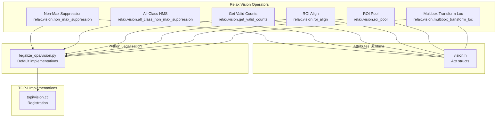
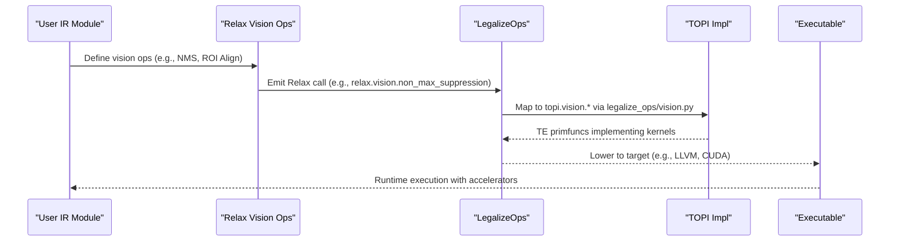
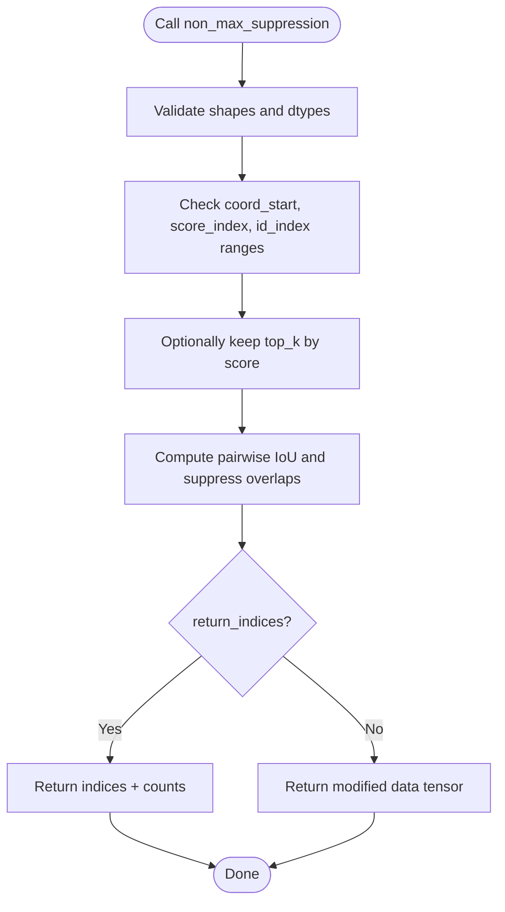
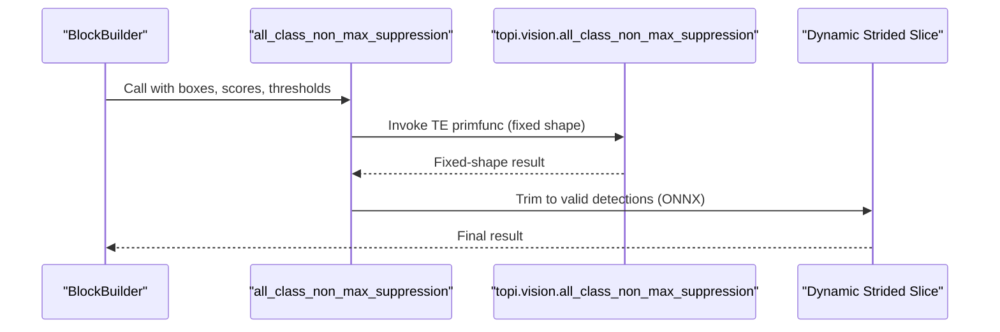
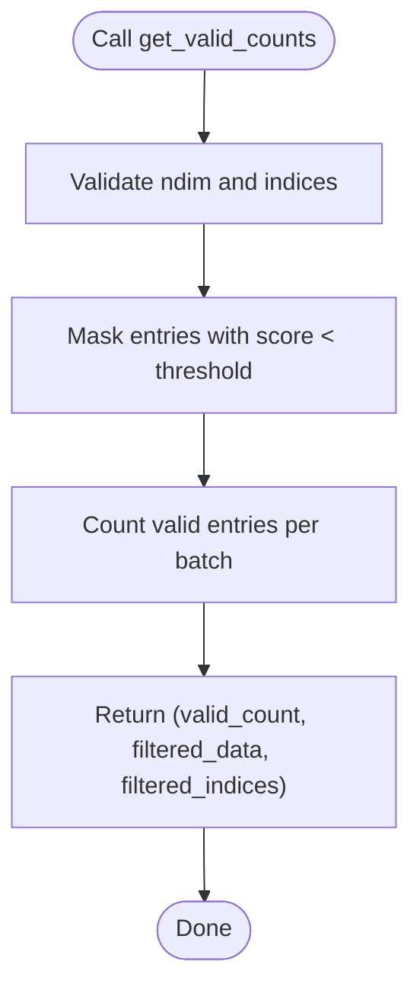
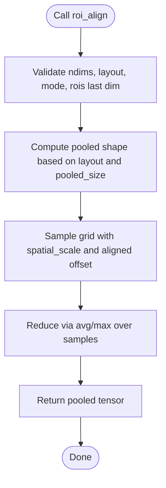
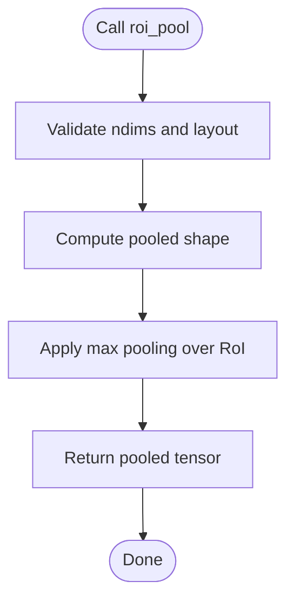
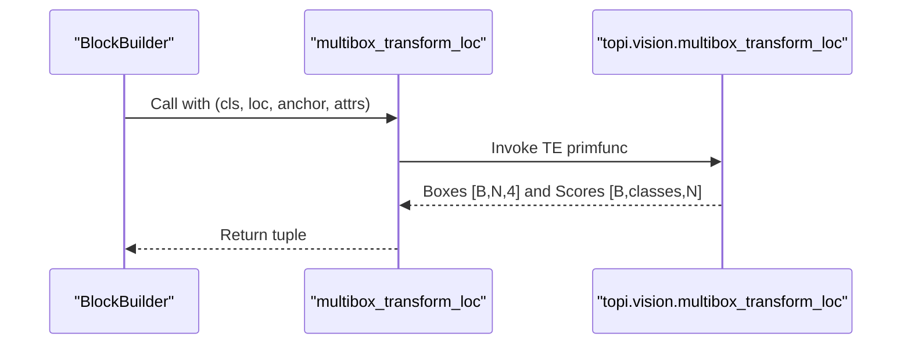
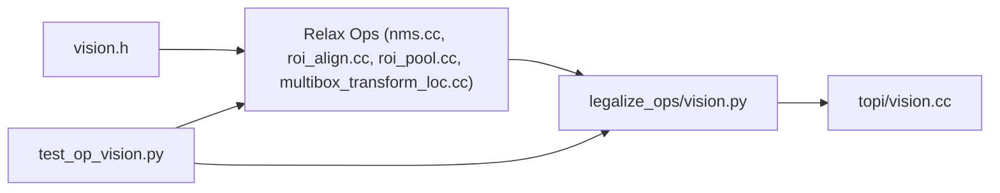

# Computer Vision Operations

<cite>
**Referenced Files in This Document**
- [vision.h](file://include/tvm/relax/attrs/vision.h)
- [nms.cc](file://src/relax/op/vision/nms.cc)
- [multibox_transform_loc.cc](file://src/relax/op/vision/multibox_transform_loc.cc)
- [roi_align.cc](file://src/relax/op/vision/roi_align.cc)
- [roi_pool.cc](file://src/relax/op/vision/roi_pool.cc)
- [vision.py](file://python/tvm/relax/transform/legalize_ops/vision.py)
- [test_op_vision.py](file://tests/python/relax/test_op_vision.py)
- [tflite_frontend.py](file://python/tvm/relax/frontend/tflite/tflite_frontend.py)
- [vision.cc](file://src/topi/vision.cc)
</cite>

## Table of Contents
1. [Introduction](#introduction)
2. [Project Structure](#project-structure)
3. [Core Components](#core-components)
4. [Architecture Overview](#architecture-overview)
5. [Detailed Component Analysis](#detailed-component-analysis)
6. [Dependency Analysis](#dependency-analysis)
7. [Performance Considerations](#performance-considerations)
8. [Troubleshooting Guide](#troubleshooting-guide)
9. [Conclusion](#conclusion)
10. [Appendices](#appendices)

## Introduction
This document describes Relax computer vision operations implemented in the TVM codebase, focusing on Non-Maximum Suppression (NMS), Region of Interest (ROI) pooling and alignment, and MultiBox detection transforms. It explains operator signatures, input tensor requirements, attribute configurations, and coordinate systems. It also covers bounding box transformations, anchor generation, proposal filtering, and detection pipeline integration, with practical examples and performance optimization techniques.

## Project Structure
The vision-related functionality is organized across Relax operator definitions, attribute schemas, Python legalization, and TOP-I implementations:
- Operator definitions and attributes live under Relax and include NMS, ROI pooling/alignment, and Multibox decoding.
- Python legalization maps Relax vision ops to TOP-I implementations.
- Tests validate operator semantics, shape inference, and end-to-end execution.

**Diagram sources**
- [nms.cc:104-353](file://src/relax/op/vision/nms.cc#L104-L353)
- [roi_align.cc:130-138](file://src/relax/op/vision/roi_align.cc#L130-L138)
- [roi_pool.cc:117-125](file://src/relax/op/vision/roi_pool.cc#L117-L125)
- [multibox_transform_loc.cc:190-201](file://src/relax/op/vision/multibox_transform_loc.cc#L190-L201)
- [vision.h:35-174](file://include/tvm/relax/attrs/vision.h#L35-L174)
- [vision.py:26-192](file://python/tvm/relax/transform/legalize_ops/vision.py#L26-L192)
- [vision.cc:34-39](file://src/topi/vision.cc#L34-L39)

**Section sources**
- [nms.cc:104-353](file://src/relax/op/vision/nms.cc#L104-L353)
- [roi_align.cc:130-138](file://src/relax/op/vision/roi_align.cc#L130-L138)
- [roi_pool.cc:117-125](file://src/relax/op/vision/roi_pool.cc#L117-L125)
- [multibox_transform_loc.cc:190-201](file://src/relax/op/vision/multibox_transform_loc.cc#L190-L201)
- [vision.h:35-174](file://include/tvm/relax/attrs/vision.h#L35-L174)
- [vision.py:26-192](file://python/tvm/relax/transform/legalize_ops/vision.py#L26-L192)
- [vision.cc:34-39](file://src/topi/vision.cc#L34-L39)

## Core Components
- Non-Max Suppression (NMS): Filters overlapping boxes based on IoU thresholds and optional class-aware suppression. Supports returning filtered data or indices.
- All-Class Non-Max Suppression: Applies NMS across all classes with configurable output formats.
- Get Valid Counts: Filters low-scoring proposals and produces valid counts and indices.
- ROI Align: Spatially pooling regions with sub-pixel precision and optional aligned mode.
- ROI Pool: Fixed-size pooling over regions-of-interest.
- Multibox Transform Loc: Decodes SSD-style anchors and location encodings into normalized boxes and class scores.

**Section sources**
- [nms.cc:195-353](file://src/relax/op/vision/nms.cc#L195-L353)
- [vision.h:35-174](file://include/tvm/relax/attrs/vision.h#L35-L174)
- [vision.py:26-192](file://python/tvm/relax/transform/legalize_ops/vision.py#L26-L192)
- [test_op_vision.py:277-807](file://tests/python/relax/test_op_vision.py#L277-L807)

## Architecture Overview
The vision operators are defined in Relax, validated via StructInfo inference, and legalized to TOP-I implementations. Legalization ensures portability across targets and enables hardware acceleration.

**Diagram sources**
- [vision.py:26-192](file://python/tvm/relax/transform/legalize_ops/vision.py#L26-L192)
- [nms.cc:195-353](file://src/relax/op/vision/nms.cc#L195-L353)
- [roi_align.cc:130-138](file://src/relax/op/vision/roi_align.cc#L130-L138)
- [roi_pool.cc:117-125](file://src/relax/op/vision/roi_pool.cc#L117-L125)
- [multibox_transform_loc.cc:190-201](file://src/relax/op/vision/multibox_transform_loc.cc#L190-L201)

## Detailed Component Analysis

### Non-Max Suppression (NMS)
- Purpose: Remove redundant detections by suppressing boxes with high IoU.
- Inputs:
  - data: 3-D tensor [batch, num_anchors, elem_length] containing boxes and scores.
  - valid_count: 1-D tensor [batch] with number of valid anchors per batch.
  - indices: 2-D tensor [batch, num_anchors] mapping to original positions.
- Attributes:
  - max_output_size: Upper bound on retained boxes (-1 for no limit).
  - iou_threshold: IoU threshold for overlap suppression.
  - force_suppress: Suppress regardless of class_id when true.
  - top_k: Keep top-k boxes by score before NMS (-1 for no limit).
  - coord_start: Start index of four consecutive coordinates (ymin, xmin, ymax, xmax).
  - score_index: Index of the score field.
  - id_index: Index of class id (-1 to disable class-aware suppression).
  - return_indices: Whether to return indices and counts instead of modified data.
  - invalid_to_bottom: Move valid boxes to the top (ignored when return_indices is true).
- Output:
  - If return_indices is true: tuple of indices tensor [batch, num_anchors] and counts tensor [batch, 1].
  - Else: same-shape data tensor with suppressed entries zeroed or marked invalid depending on downstream semantics.
- Shape and dtype checks are enforced by StructInfo inference.

**Diagram sources**
- [nms.cc:221-343](file://src/relax/op/vision/nms.cc#L221-L343)
- [vision.h:113-150](file://include/tvm/relax/attrs/vision.h#L113-L150)

**Section sources**
- [nms.cc:195-353](file://src/relax/op/vision/nms.cc#L195-L353)
- [vision.h:113-150](file://include/tvm/relax/attrs/vision.h#L113-L150)
- [test_op_vision.py:277-807](file://tests/python/relax/test_op_vision.py#L277-L807)

### All-Class Non-Max Suppression
- Purpose: Apply NMS across all classes with flexible output formats.
- Inputs:
  - boxes: 3-D tensor [batch, num_boxes, 4] in (ymin, xmin, ymax, xmax).
  - scores: 3-D tensor [batch, num_classes, num_boxes] or [batch, num_boxes] depending on layout.
  - max_output_boxes_per_class: Maximum boxes to keep per class.
  - iou_threshold, score_threshold: Thresholds for overlap and score filtering.
  - output_format: "onnx" or "tensorflow".
- Output:
  - ONNX format: concatenated indices and total count.
  - TensorFlow format: selected indices, selected scores, and per-batch counts.
- Legalization trims outputs dynamically for ONNX compatibility.

**Diagram sources**
- [vision.py:26-111](file://python/tvm/relax/transform/legalize_ops/vision.py#L26-L111)
- [nms.cc:43-116](file://src/relax/op/vision/nms.cc#L43-L116)

**Section sources**
- [nms.cc:43-116](file://src/relax/op/vision/nms.cc#L43-L116)
- [vision.h:35-49](file://include/tvm/relax/attrs/vision.h#L35-L49)
- [vision.py:26-111](file://python/tvm/relax/transform/legalize_ops/vision.py#L26-L111)

### Get Valid Counts
- Purpose: Filter proposals below a score threshold and produce a mask of valid entries.
- Inputs:
  - data: 3-D tensor [batch, num_anchors, elem_length].
- Attributes:
  - score_threshold: Lower bound for scores.
  - id_index: Index of class id (-1 to disable).
  - score_index: Index of score field.
- Outputs:
  - valid_count: 1-D tensor [batch] with number of valid anchors.
  - filtered_data: Same shape as input, with invalid entries masked.
  - filtered_indices: 2-D tensor [batch, num_anchors] mapping to original positions.

**Diagram sources**
- [nms.cc:118-193](file://src/relax/op/vision/nms.cc#L118-L193)
- [vision.h:93-111](file://include/tvm/relax/attrs/vision.h#L93-L111)

**Section sources**
- [nms.cc:118-193](file://src/relax/op/vision/nms.cc#L118-L193)
- [vision.h:93-111](file://include/tvm/relax/attrs/vision.h#L93-L111)
- [test_op_vision.py:219-275](file://tests/python/relax/test_op_vision.py#L219-L275)

### ROI Align
- Purpose: Extract fixed-size feature maps from RoIs with sub-pixel sampling and optional aligned mode.
- Inputs:
  - data: 4-D tensor [N, C, H, W] or [N, H, W, C] depending on layout.
  - rois: 2-D tensor [num_roi, 5] with [batch_idx, x1, y1, x2, y2].
- Attributes:
  - pooled_size: Output spatial size (height, width). Single value expands to both.
  - spatial_scale: Scale from original image to feature map.
  - sample_ratio: Number of sampling points (-1 or 0 means adaptive).
  - aligned: Whether to use aligned convention (no 0.5 off).
  - layout: "NCHW" or "NHWC".
  - mode: "avg" or "max".
- Output: 4-D tensor [num_roi, C, pooled_h, pooled_w] or permuted according to layout.

**Diagram sources**
- [roi_align.cc:62-138](file://src/relax/op/vision/roi_align.cc#L62-L138)
- [vision.h:51-74](file://include/tvm/relax/attrs/vision.h#L51-L74)

**Section sources**
- [roi_align.cc:36-138](file://src/relax/op/vision/roi_align.cc#L36-L138)
- [vision.h:51-74](file://include/tvm/relax/attrs/vision.h#L51-L74)
- [test_op_vision.py:52-135](file://tests/python/relax/test_op_vision.py#L52-L135)

### ROI Pool
- Purpose: Fixed-size pooling over RoIs (no sub-pixel sampling).
- Inputs and attributes similar to ROI Align but without sample_ratio and with mode restricted to "max" in inference.
- Output: 4-D tensor [num_roi, C, pooled_h, pooled_w].

**Diagram sources**
- [roi_pool.cc:59-125](file://src/relax/op/vision/roi_pool.cc#L59-L125)
- [vision.h:76-91](file://include/tvm/relax/attrs/vision.h#L76-L91)

**Section sources**
- [roi_pool.cc:36-125](file://src/relax/op/vision/roi_pool.cc#L36-L125)
- [vision.h:76-91](file://include/tvm/relax/attrs/vision.h#L76-L91)
- [test_op_vision.py:128-135](file://tests/python/relax/test_op_vision.py#L128-L135)

### Multibox Transform Loc (SSD/TFLite-style decoding)
- Purpose: Decode class predictions and location encodings into normalized boxes and class scores.
- Inputs:
  - cls_pred: 3-D tensor [B, num_classes, N] (logits pre-softmax).
  - loc_pred: 2-D tensor [B, 4*N] with flattened (x,y,w,h) encodings.
  - anchor: 3-D tensor [1, N, 4] with anchors in ltrb format.
- Attributes:
  - clip: Clip decoded boxes to [0,1].
  - threshold: Zero out scores below this threshold after softmax.
  - variances: Length-4 scaling factors (x,y,w,h).
  - keep_background: Whether to retain background class.
- Output: tuple of boxes tensor [B, N, 4] and scores tensor [B, num_classes, N].

**Diagram sources**
- [multibox_transform_loc.cc:66-201](file://src/relax/op/vision/multibox_transform_loc.cc#L66-L201)
- [vision.h:152-174](file://include/tvm/relax/attrs/vision.h#L152-L174)
- [vision.py:170-192](file://python/tvm/relax/transform/legalize_ops/vision.py#L170-L192)

**Section sources**
- [multibox_transform_loc.cc:37-201](file://src/relax/op/vision/multibox_transform_loc.cc#L37-L201)
- [vision.h:152-174](file://include/tvm/relax/attrs/vision.h#L152-L174)
- [test_op_vision.py:1290-1508](file://tests/python/relax/test_op_vision.py#L1290-L1508)
- [tflite_frontend.py:3355-3394](file://python/tvm/relax/frontend/tflite/tflite_frontend.py#L3355-L3394)

## Dependency Analysis
- Operators depend on attribute schemas defined in vision.h.
- Legalization maps Relax ops to TOP-I primfuncs via legalize_ops/vision.py.
- Tests validate correctness and infer shape/type safety.

**Diagram sources**
- [vision.h:35-174](file://include/tvm/relax/attrs/vision.h#L35-L174)
- [nms.cc:104-353](file://src/relax/op/vision/nms.cc#L104-L353)
- [roi_align.cc:130-138](file://src/relax/op/vision/roi_align.cc#L130-L138)
- [roi_pool.cc:117-125](file://src/relax/op/vision/roi_pool.cc#L117-L125)
- [multibox_transform_loc.cc:190-201](file://src/relax/op/vision/multibox_transform_loc.cc#L190-L201)
- [vision.py:26-192](file://python/tvm/relax/transform/legalize_ops/vision.py#L26-L192)
- [vision.cc:34-39](file://src/topi/vision.cc#L34-L39)
- [test_op_vision.py:52-135](file://tests/python/relax/test_op_vision.py#L52-L135)

**Section sources**
- [vision.h:35-174](file://include/tvm/relax/attrs/vision.h#L35-L174)
- [vision.py:26-192](file://python/tvm/relax/transform/legalize_ops/vision.py#L26-L192)
- [test_op_vision.py:52-135](file://tests/python/relax/test_op_vision.py#L52-L135)

## Performance Considerations
- Batch processing: All operators accept batched inputs and operate element-wise per batch; leverage batch dimension to maximize throughput.
- Coordinate normalization: Ensure boxes are normalized to [0,1] when using Multibox decoding and NMS to avoid out-of-range computations.
- Dynamic trimming (ONNX NMS): Legalization trims outputs to valid detections, reducing memory footprint and improving ONNX compatibility.
- Hardware acceleration: Legalization lowers ops to TE primfuncs compiled for target devices (e.g., LLVM, CUDA). Prefer larger pooled sizes and aligned modes only when necessary to reduce kernel overhead.
- Mixed precision: Some ops declare mixed-precision policies; ensure dtype consistency to avoid unnecessary casts.

[No sources needed since this section provides general guidance]

## Troubleshooting Guide
- Shape mismatches:
  - NMS requires data [B, num_anchors, elem_length], valid_count [B], indices [B, num_anchors]; ensure shapes match and dtypes are int32 for auxiliary tensors.
  - Multibox requires loc_pred [B, 4*N], anchor [1, N, 4], and cls_pred [B, C, N]; N must be consistent across inputs.
- Attribute bounds:
  - NMS: coord_start must allow four consecutive coordinates; score_index and id_index must be within elem_length.
  - ROI Align/Pool: rois last dim must be 5; layout must be "NCHW" or "NHWC"; mode must be "avg" or "max".
- Output format:
  - All-class NMS: "onnx" trims outputs; "tensorflow" preserves legacy layout.
- Execution:
  - Use LegalizeOps to lower vision ops to TE primfuncs; verify module contains "call_tir".

**Section sources**
- [nms.cc:221-343](file://src/relax/op/vision/nms.cc#L221-L343)
- [roi_align.cc:62-138](file://src/relax/op/vision/roi_align.cc#L62-L138)
- [roi_pool.cc:59-125](file://src/relax/op/vision/roi_pool.cc#L59-L125)
- [multibox_transform_loc.cc:66-201](file://src/relax/op/vision/multibox_transform_loc.cc#L66-L201)
- [test_op_vision.py:336-408](file://tests/python/relax/test_op_vision.py#L336-L408)

## Conclusion
The Relax vision suite provides robust, shape-checked operators for modern object detection pipelines. By combining structured attributes, rigorous inference, and TOP-I legalizations, these operators integrate seamlessly with batched detection workflows, support both anchor-based decoding and ROI-aware pooling, and enable efficient execution across diverse hardware targets.

[No sources needed since this section summarizes without analyzing specific files]

## Appendices

### Practical Examples

- Anchor-based detection pipeline (TFLite-style)
  - Convert anchors from yxhw to ltrb, then call Multibox Transform Loc to decode boxes and scores.
  - Optionally apply regular NMS or All-Class NMS depending on framework output expectations.

  **Section sources**
  - [tflite_frontend.py:3355-3394](file://python/tvm/relax/frontend/tflite/tflite_frontend.py#L3355-L3394)
  - [multibox_transform_loc.cc:37-50](file://src/relax/op/vision/multibox_transform_loc.cc#L37-L50)
  - [vision.h:152-174](file://include/tvm/relax/attrs/vision.h#L152-L174)

- Proposal filtering and NMS
  - Use Get Valid Counts to filter low-score proposals, then apply Non-Max Suppression with desired thresholds and top_k.

  **Section sources**
  - [nms.cc:195-353](file://src/relax/op/vision/nms.cc#L195-L353)
  - [vision.h:93-150](file://include/tvm/relax/attrs/vision.h#L93-L150)
  - [test_op_vision.py:509-807](file://tests/python/relax/test_op_vision.py#L509-L807)

- ROI-aware pooling
  - Use ROI Align for fine-grained regions with sub-pixel sampling or ROI Pool for simplicity.

  **Section sources**
  - [roi_align.cc:36-138](file://src/relax/op/vision/roi_align.cc#L36-L138)
  - [roi_pool.cc:36-125](file://src/relax/op/vision/roi_pool.cc#L36-L125)
  - [test_op_vision.py:52-135](file://tests/python/relax/test_op_vision.py#L52-L135)

### Coordinate Systems and Normalization
- Box encoding: ymin, xmin, ymax, xmax.
- Multibox anchors: ltrb (left, top, right, bottom).
- Normalization: Boxes are typically normalized to [0,1]; ensure inputs and variances are consistent with model expectations.

**Section sources**
- [multibox_transform_loc.cc:190-201](file://src/relax/op/vision/multibox_transform_loc.cc#L190-L201)
- [vision.h:152-174](file://include/tvm/relax/attrs/vision.h#L152-L174)