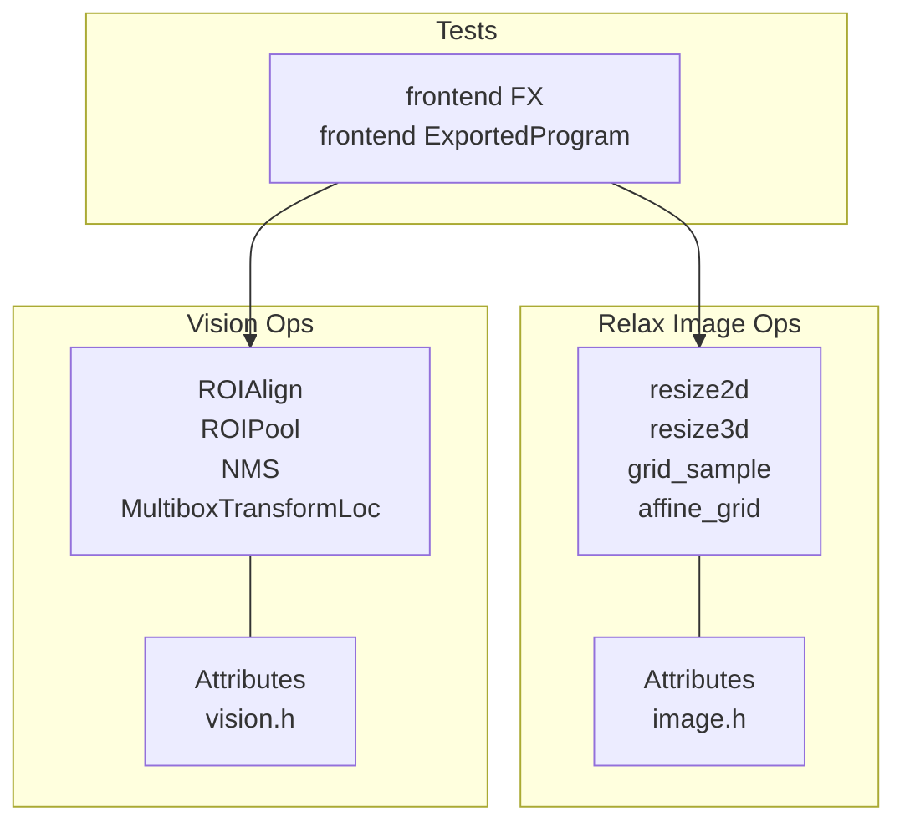
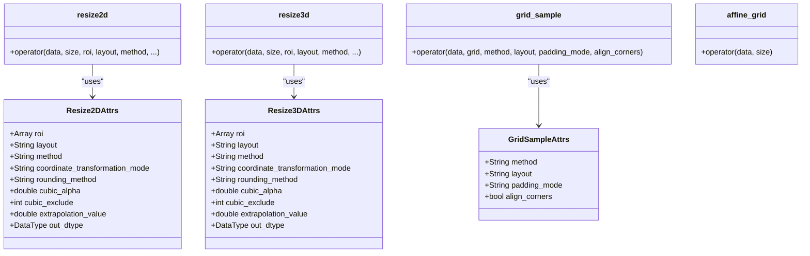
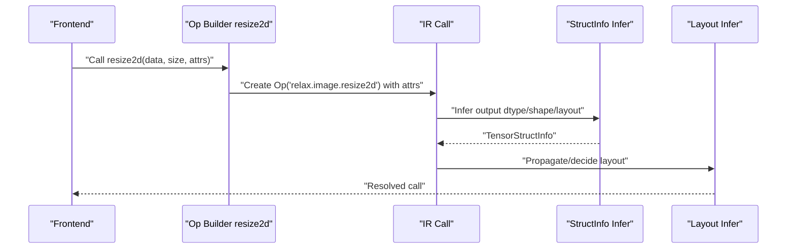
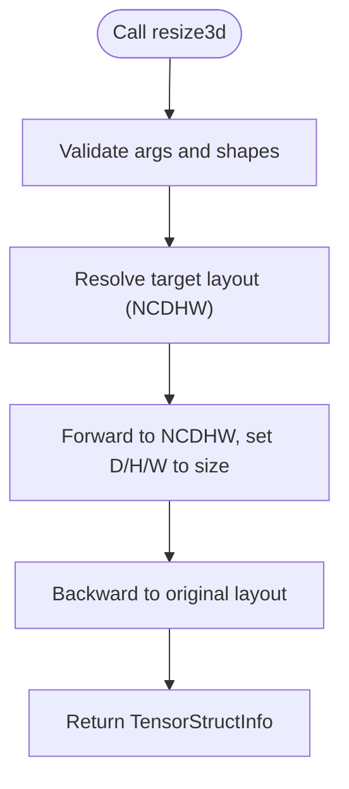
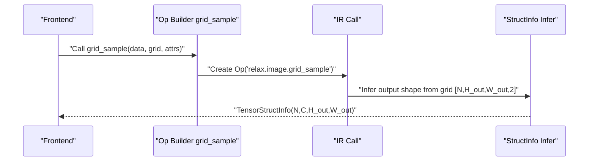
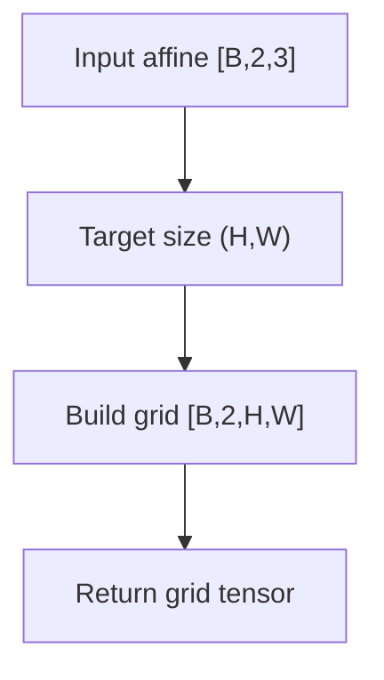
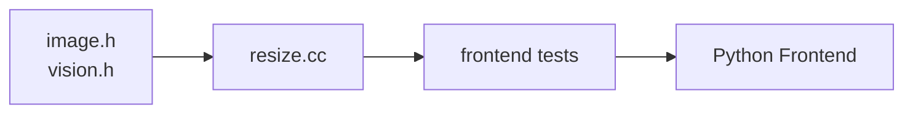

# Image Processing Operations

<cite>
**Referenced Files in This Document**
- [image.h](file://include/tvm/relax/attrs/image.h)
- [resize.h](file://src/relax/op/image/resize.h)
- [resize.cc](file://src/relax/op/image/resize.cc)
- [vision.h](file://include/tvm/relax/attrs/vision.h)
- [test_frontend_from_fx.py](file://tests/python/relax/test_frontend_from_fx.py)
- [test_frontend_from_exported_program.py](file://tests/python/relax/test_frontend_from_exported_program.py)
</cite>

## Table of Contents
1. [Introduction](#introduction)
2. [Project Structure](#project-structure)
3. [Core Components](#core-components)
4. [Architecture Overview](#architecture-overview)
5. [Detailed Component Analysis](#detailed-component-analysis)
6. [Dependency Analysis](#dependency-analysis)
7. [Performance Considerations](#performance-considerations)
8. [Troubleshooting Guide](#troubleshooting-guide)
9. [Conclusion](#conclusion)
10. [Appendices](#appendices)

## Introduction
This document describes Relax’s image processing operations with a focus on color space conversions, geometric transformations, filtering operations, and spatial manipulations. It explains operator signatures, supported image formats, interpolation methods, transformation matrices, pixel coordinate systems, boundary handling, memory layout considerations, and practical usage patterns. It also covers numerical precision, edge cases, and integration with computer vision frameworks.

## Project Structure
Relax image processing is primarily implemented in the Relax operator library and exposed via Python frontends. The relevant components include:
- Operator attributes for image operations (interpolation modes, layouts, boundary handling)
- Operator builders and registration for resize2d, resize3d, grid_sample, and affine_grid
- Vision attributes for detection/post-processing operators (NMS, ROI pooling/align)
- Tests demonstrating operator usage and defaults

**Diagram sources**
- [resize.h:35-52](file://src/relax/op/image/resize.h#L35-L52)
- [image.h:32-150](file://include/tvm/relax/attrs/image.h#L32-L150)
- [vision.h:35-174](file://include/tvm/relax/attrs/vision.h#L35-L174)
- [resize.cc:37-435](file://src/relax/op/image/resize.cc#L37-L435)

**Section sources**
- [resize.h:35-52](file://src/relax/op/image/resize.h#L35-L52)
- [image.h:32-150](file://include/tvm/relax/attrs/image.h#L32-L150)
- [vision.h:35-174](file://include/tvm/relax/attrs/vision.h#L35-L174)
- [resize.cc:37-435](file://src/relax/op/image/resize.cc#L37-L435)

## Core Components
- Resize2D and Resize3D: Scale images with configurable interpolation, coordinate transformation mode, rounding method, and output dtype. Support ROI cropping and layout-aware transforms.
- GridSample: Sample an input tensor using a per-pixel grid; supports nearest/bilinear/bicubic interpolation and padding modes.
- AffineGrid: Generate sampling grids from affine matrices for spatial transformer-like behavior.
- Vision Operators (NMS, ROIAlign, ROIPool, MultiboxTransformLoc): Provide detection/post-processing primitives with configurable layouts and modes.

Supported interpolation methods:
- Nearest neighbor
- Linear (bilinear/trilinear)
- Cubic/Bicubic/Tricubic with configurable spline parameters

Coordinate transformation modes:
- half_pixel
- align_corners
- asymmetric

Boundary handling:
- Padding modes for grid sampling: zeros, border, reflection
- Extrapolation value for resize ROI outside bounds

Memory layout:
- Layout strings define dimension order (e.g., NCHW, NHWC, NCDHW, NDHWC)
- Struct info inference propagates shapes and dtypes according to layout

**Section sources**
- [image.h:32-150](file://include/tvm/relax/attrs/image.h#L32-L150)
- [resize.cc:37-435](file://src/relax/op/image/resize.cc#L37-L435)

## Architecture Overview
The image ops are defined as Relax operators with:
- Attribute structs specifying parameters
- Builder functions returning Call nodes
- Struct info inference and layout inference
- Optional mixed-precision policy and purity annotations

**Diagram sources**
- [image.h:32-150](file://include/tvm/relax/attrs/image.h#L32-L150)
- [resize.h:35-52](file://src/relax/op/image/resize.h#L35-L52)

**Section sources**
- [image.h:32-150](file://include/tvm/relax/attrs/image.h#L32-L150)
- [resize.h:35-52](file://src/relax/op/image/resize.h#L35-L52)
- [resize.cc:37-435](file://src/relax/op/image/resize.cc#L37-L435)

## Detailed Component Analysis

### Resize2D
- Purpose: Resample 2D images to a target size with optional ROI and layout-aware transformation.
- Signature highlights:
  - Inputs: data tensor, size shape (H, W)
  - Attributes: roi, layout, method, coordinate_transformation_mode, rounding_method, cubic_alpha, cubic_exclude, extrapolation_value, out_dtype
- Supported layouts: NCHW, NHWC, and others via layout inference
- Interpolation: nearest_neighbor, linear, cubic
- Coordinate transformation modes:
  - half_pixel: center-pixel mapping optimized for modern frameworks
  - align_corners: corners fixed during resampling
  - asymmetric: simpler mapping without extra offsets
- Boundary handling:
  - ROI cropping for tf_crop_and_resize-like behavior
  - Extrapolation value for out-of-bounds regions
- Struct info and layout inference:
  - Infers output shape by mapping to NCHW, setting spatial dims to requested size, then back to original layout
  - Mixed precision follows input dtype unless overridden

**Diagram sources**
- [resize.cc:37-151](file://src/relax/op/image/resize.cc#L37-L151)
- [resize.cc:63-110](file://src/relax/op/image/resize.cc#L63-L110)
- [resize.cc:112-140](file://src/relax/op/image/resize.cc#L112-L140)

**Section sources**
- [image.h:32-79](file://include/tvm/relax/attrs/image.h#L32-L79)
- [resize.cc:37-151](file://src/relax/op/image/resize.cc#L37-L151)
- [resize.cc:63-110](file://src/relax/op/image/resize.cc#L63-L110)
- [resize.cc:112-140](file://src/relax/op/image/resize.cc#L112-L140)

### Resize3D
- Purpose: Resample volumetric data along three spatial dimensions.
- Signature highlights:
  - Inputs: data tensor, size shape (D, H, W)
  - Attributes: roi, layout, method, coordinate_transformation_mode, rounding_method, cubic_alpha, cubic_exclude, extrapolation_value, out_dtype
- Interpolation: nearest_neighbor, linear, cubic (trilinear/tricubic variants)
- Layout: NCDHW, NDHWC, etc.
- Struct info inference mirrors 2D but operates on 5D shapes.

**Diagram sources**
- [resize.cc:154-263](file://src/relax/op/image/resize.cc#L154-L263)
- [resize.cc:178-226](file://src/relax/op/image/resize.cc#L178-L226)
- [resize.cc:228-253](file://src/relax/op/image/resize.cc#L228-L253)

**Section sources**
- [image.h:81-128](file://include/tvm/relax/attrs/image.h#L81-L128)
- [resize.cc:154-263](file://src/relax/op/image/resize.cc#L154-L263)
- [resize.cc:178-226](file://src/relax/op/image/resize.cc#L178-L226)
- [resize.cc:228-253](file://src/relax/op/image/resize.cc#L228-L253)

### GridSample
- Purpose: Sample an input tensor using a per-pixel grid to perform spatial transformations.
- Signature highlights:
  - Inputs: data tensor, grid tensor
  - Attributes: method (nearest, bilinear, bicubic), layout (NCHW, NHWC), padding_mode (zeros, border, reflection), align_corners
- Output shape: [N, C, H_out, W_out] inferred from grid shape
- Boundary handling:
  - padding_mode controls behavior for out-of-bounds grid coordinates
  - align_corners affects how coordinates map to pixel centers

**Diagram sources**
- [resize.h:47-49](file://src/relax/op/image/resize.h#L47-L49)
- [resize.cc:269-341](file://src/relax/op/image/resize.cc#L269-L341)
- [resize.cc:286-332](file://src/relax/op/image/resize.cc#L286-L332)

**Section sources**
- [image.h:130-150](file://include/tvm/relax/attrs/image.h#L130-L150)
- [resize.cc:269-341](file://src/relax/op/image/resize.cc#L269-L341)
- [resize.cc:286-332](file://src/relax/op/image/resize.cc#L286-L332)

### AffineGrid
- Purpose: Generate sampling grids from affine transformation matrices for spatial transformer-like operations.
- Signature highlights:
  - Inputs: affine matrices [batch, 2, 3], target size (H, W)
  - Output grid shape: [batch, 2, H, W]
- Validation: Ensures input has shape [batch, 2, 3] and size is 2D.

**Diagram sources**
- [resize.cc:345-435](file://src/relax/op/image/resize.cc#L345-L435)
- [resize.cc:355-427](file://src/relax/op/image/resize.cc#L355-L427)

**Section sources**
- [resize.cc:345-435](file://src/relax/op/image/resize.cc#L345-L435)
- [resize.cc:355-427](file://src/relax/op/image/resize.cc#L355-L427)

### Vision Operators (NMS, ROIAlign, ROIPool, MultiboxTransformLoc)
- Non-Maximum Suppression (NMS): Suppress overlapping boxes with configurable thresholds and output format.
- All-Class NMS: Variant with output format selection.
- ROIAlign: Region-of-interest align with configurable pooled size, spatial scale, sampling ratio, alignment flag, layout, and mode (avg/max).
- ROIPool: Region-of-interest pooling with pooled size and spatial scale.
- MultiboxTransformLoc: Decode SSD-style detections with variance scaling, clipping, and class handling.

These operators expose attributes for layout, mode, thresholds, and other parameters.

**Section sources**
- [vision.h:35-174](file://include/tvm/relax/attrs/vision.h#L35-L174)

## Dependency Analysis
- Operators depend on attribute structs for configuration.
- Struct info inference depends on layout utilities and shape analysis.
- Frontend tests demonstrate operator usage and default behaviors.

**Diagram sources**
- [image.h:32-150](file://include/tvm/relax/attrs/image.h#L32-L150)
- [vision.h:35-174](file://include/tvm/relax/attrs/vision.h#L35-L174)
- [resize.cc:37-435](file://src/relax/op/image/resize.cc#L37-L435)
- [test_frontend_from_fx.py:3851-3925](file://tests/python/relax/test_frontend_from_fx.py#L3851-L3925)
- [test_frontend_from_exported_program.py:4350-4377](file://tests/python/relax/test_frontend_from_exported_program.py#L4350-L4377)

**Section sources**
- [image.h:32-150](file://include/tvm/relax/attrs/image.h#L32-L150)
- [vision.h:35-174](file://include/tvm/relax/attrs/vision.h#L35-L174)
- [resize.cc:37-435](file://src/relax/op/image/resize.cc#L37-L435)
- [test_frontend_from_fx.py:3851-3925](file://tests/python/relax/test_frontend_from_fx.py#L3851-L3925)
- [test_frontend_from_exported_program.py:4350-4377](file://tests/python/relax/test_frontend_from_exported_program.py#L4350-L4377)

## Performance Considerations
- Interpolation choice impacts accuracy and speed:
  - nearest_neighbor is fastest
  - linear is a good balance
  - cubic/bicubic/tricubic improves quality at higher cost
- Mixed precision:
  - Operators follow mixed-precision policy; specify out_dtype to control output dtype
- Layout awareness:
  - Using efficient layouts (e.g., NCHW) can improve downstream kernels
- Batch processing:
  - Prefer vectorized shapes and contiguous layouts to reduce overhead
- Boundary handling:
  - Padding modes and extrapolation values influence memory access patterns; choose modes aligned with intended use

[No sources needed since this section provides general guidance]

## Troubleshooting Guide
Common issues and resolutions:
- Wrong number of arguments:
  - Resize2D/3D expect exactly two arguments (data, size); GridSample expects (data, grid); AffineGrid expects (data, size)
- Invalid layout:
  - Ensure layout matches the input tensor’s dimensionality and axes
- ROI out of bounds:
  - Adjust roi or extrapolation_value; verify coordinate transformation mode
- Grid shape mismatch:
  - Grid for NCHW input must have shape [N, H_out, W_out, 2]
- Affine matrix shape:
  - Input must be [batch, 2, 3]; otherwise, struct info inference reports an error

**Section sources**
- [resize.cc:63-88](file://src/relax/op/image/resize.cc#L63-L88)
- [resize.cc:178-203](file://src/relax/op/image/resize.cc#L178-L203)
- [resize.cc:286-305](file://src/relax/op/image/resize.cc#L286-L305)
- [resize.cc:355-383](file://src/relax/op/image/resize.cc#L355-L383)

## Conclusion
Relax provides a comprehensive set of image processing primitives with explicit control over interpolation, coordinate systems, boundary handling, and memory layouts. These operators integrate cleanly with frontends and enable efficient, expressive image processing pipelines suitable for computer vision tasks.

[No sources needed since this section summarizes without analyzing specific files]

## Appendices

### Practical Examples and Workflows
- Resize with defaults:
  - Example demonstrates default NCHW layout and half_pixel coordinate transformation mode.
  - See [test_frontend_from_exported_program.py:4350-4377](file://tests/python/relax/test_frontend_from_exported_program.py#L4350-L4377)
- Resize with NHWC:
  - Example shows resizing with NHWC layout and nearest_neighbor interpolation.
  - See [test_frontend_from_fx.py:3851-3893](file://tests/python/relax/test_frontend_from_fx.py#L3851-L3893)
- Resize with bilinear interpolation and NHWC:
  - Example shows resizing with bilinear interpolation and align_corners=False.
  - See [test_frontend_from_fx.py:3895-3925](file://tests/python/relax/test_frontend_from_fx.py#L3895-L3925)

### Numerical Precision and Edge Cases
- Output dtype:
  - out_dtype can override inferred dtype; otherwise, output dtype matches input
- Spline parameters:
  - cubic_alpha and cubic_exclude control bicubic/tricubic behavior
- Rounding method:
  - rounding_method determines “nearest” selection in nearest_neighbor mode
- Coordinate transformation modes:
  - half_pixel, align_corners, asymmetric affect mapping from output to input coordinates

**Section sources**
- [image.h:32-150](file://include/tvm/relax/attrs/image.h#L32-L150)
- [resize.cc:37-151](file://src/relax/op/image/resize.cc#L37-L151)
- [resize.cc:154-263](file://src/relax/op/image/resize.cc#L154-L263)
- [resize.cc:269-341](file://src/relax/op/image/resize.cc#L269-L341)