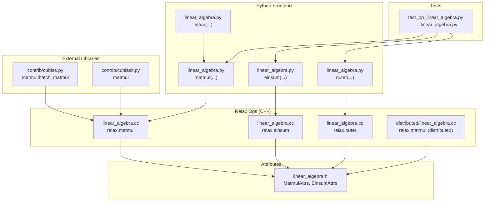
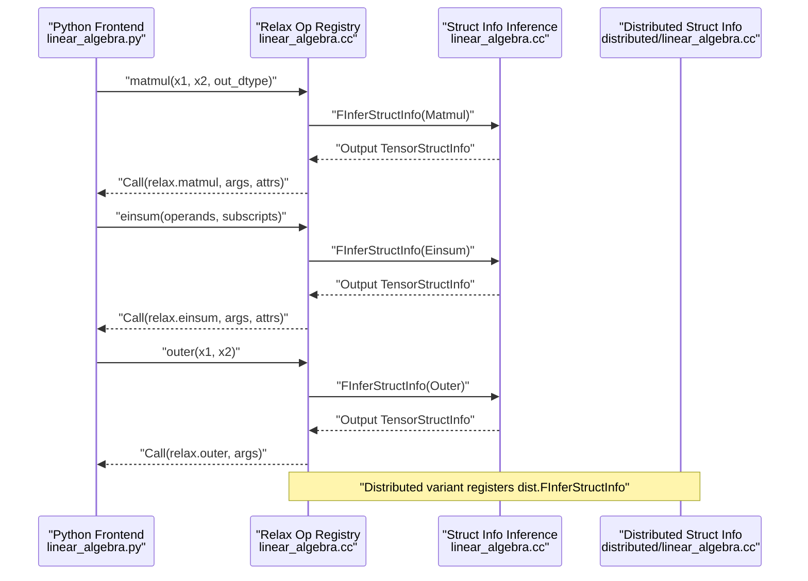
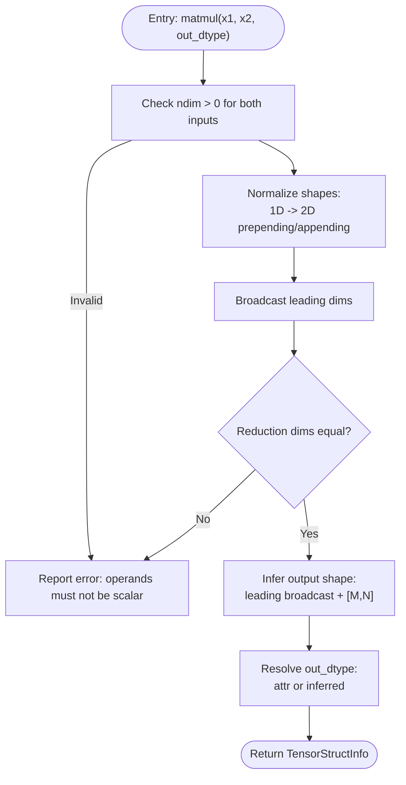
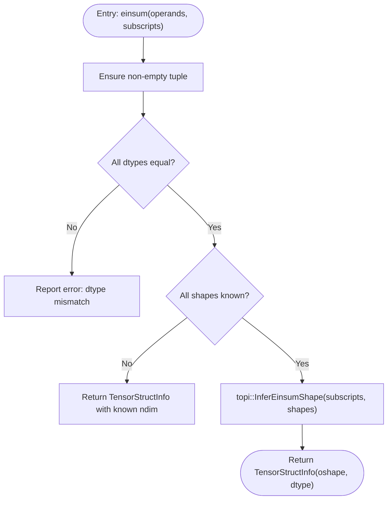
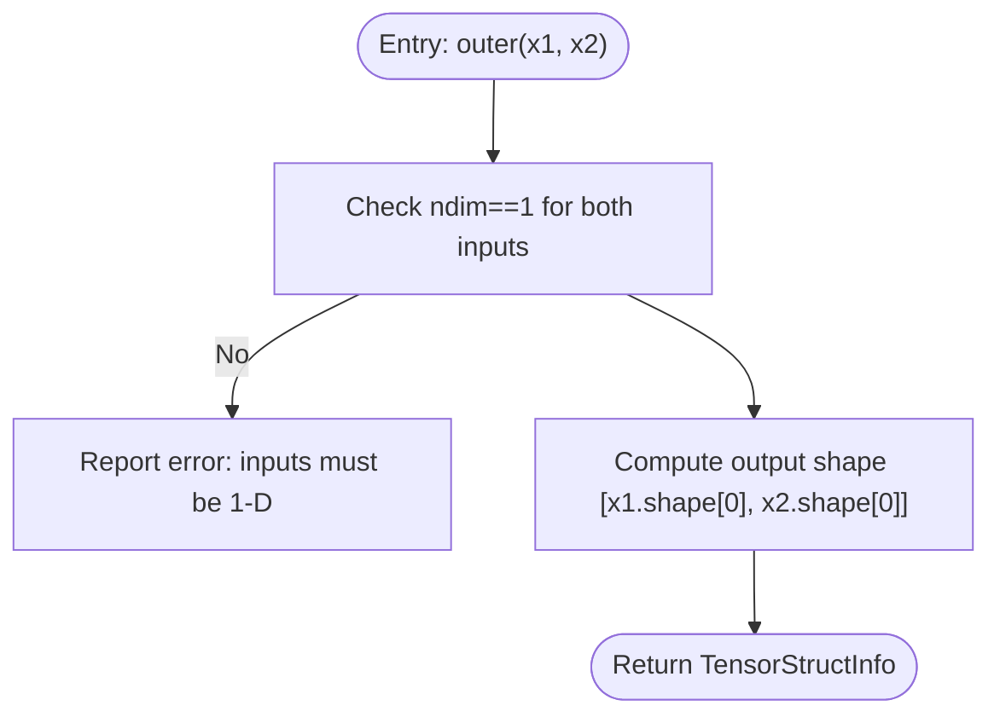
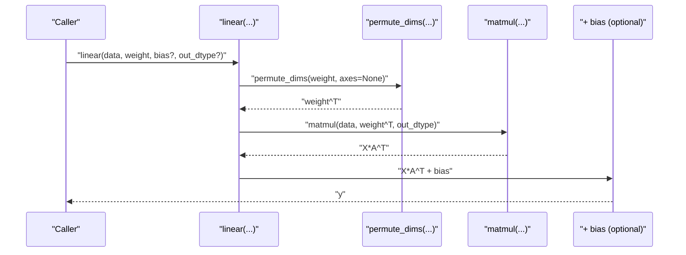
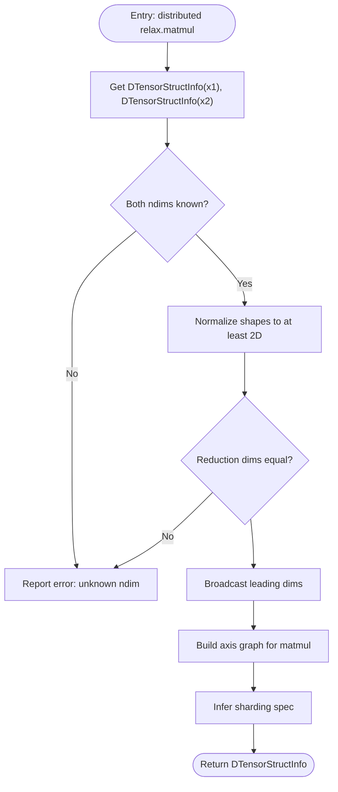
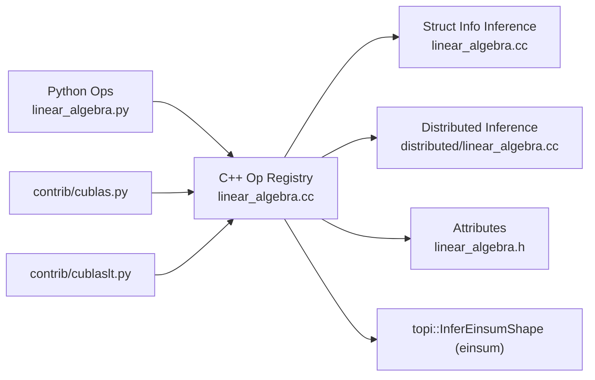

# Linear Algebra Operations

<cite>
**Referenced Files in This Document**
- [linear_algebra.h](file://include/tvm/relax/attrs/linear_algebra.h)
- [linear_algebra.py](file://python/tvm/relax/op/linear_algebra.py)
- [linear_algebra.cc](file://src/relax/op/tensor/linear_algebra.cc)
- [linear_algebra.h](file://src/relax/op/tensor/linear_algebra.h)
- [linear_algebra.cc](file://src/relax/op/distributed/linear_algebra.cc)
- [linear_algebra.h](file://src/relax/op/distributed/linear_algebra.h)
- [cublas.py](file://python/tvm/contrib/cublas.py)
- [cublaslt.py](file://python/tvm/contrib/cublaslt.py)
- [test_op_linear_algebra.py](file://tests/python/relax/test_op_linear_algebra.py)
- [test_transform_legalize_ops_index_linear_algebra.py](file://tests/python/relax/test_transform_legalize_ops_index_linear_algebra.py)
- [test_tvmscript_parser_op_linear_algebra.py](file://tests/python/relax/test_tvmscript_parser_op_linear_algebra.py)
</cite>

## Table of Contents
1. [Introduction](#introduction)
2. [Project Structure](#project-structure)
3. [Core Components](#core-components)
4. [Architecture Overview](#architecture-overview)
5. [Detailed Component Analysis](#detailed-component-analysis)
6. [Dependency Analysis](#dependency-analysis)
7. [Performance Considerations](#performance-considerations)
8. [Troubleshooting Guide](#troubleshooting-guide)
9. [Conclusion](#conclusion)
10. [Appendices](#appendices)

## Introduction
This document describes Relax’s linear algebra capabilities centered around BLAS/LAPACK-level primitives exposed via Relax ops. It covers operator signatures, input/output shapes, precision handling, mixed-precision policies, and struct info inference. It also explains batched operations, layout considerations, and how TVM integrates with external libraries such as cuBLAS and cuBLASLt for high-performance kernels. Practical examples demonstrate scientific computing and machine learning workflows, and guidance is provided on numerical stability, condition number awareness, and hardware-specific optimizations.

## Project Structure
Relax linear algebra is implemented as:
- Python frontend ops for matmul, einsum, outer, and a convenience linear operator
- C++ Relax ops that register the operators, define struct info inference, and mixed-precision policies
- Distributed variants that infer sharding specs for tensor-parallel operations
- Tests validating semantics and shape inference
- Optional integration with cuBLAS/cuBLASLt for GPU acceleration

**Diagram sources**
- [linear_algebra.py:28-140](file://python/tvm/relax/op/linear_algebra.py#L28-L140)
- [linear_algebra.cc:44-303](file://src/relax/op/tensor/linear_algebra.cc#L44-L303)
- [linear_algebra.h:32-54](file://include/tvm/relax/attrs/linear_algebra.h#L32-L54)
- [linear_algebra.cc:27-100](file://src/relax/op/distributed/linear_algebra.cc#L27-L100)
- [cublas.py:23-88](file://python/tvm/contrib/cublas.py#L23-L88)
- [cublaslt.py:23-56](file://python/tvm/contrib/cublaslt.py#L23-L56)
- [test_op_linear_algebra.py](file://tests/python/relax/test_op_linear_algebra.py)

**Section sources**
- [linear_algebra.py:1-140](file://python/tvm/relax/op/linear_algebra.py#L1-L140)
- [linear_algebra.cc:1-307](file://src/relax/op/tensor/linear_algebra.cc#L1-L307)
- [linear_algebra.h:1-60](file://include/tvm/relax/attrs/linear_algebra.h#L1-L60)
- [linear_algebra.cc:1-105](file://src/relax/op/distributed/linear_algebra.cc#L1-L105)
- [cublas.py:1-88](file://python/tvm/contrib/cublas.py#L1-L88)
- [cublaslt.py:1-56](file://python/tvm/contrib/cublaslt.py#L1-L56)
- [test_op_linear_algebra.py](file://tests/python/relax/test_op_linear_algebra.py)

## Core Components
- matmul: General matrix multiplication with broadcasting over leading dimensions, supports mixed precision, and infers output dtype and shape.
- einsum: Einstein summation over a tuple of input tensors with subscript specification.
- outer: Outer product of two 1-D vectors producing a 2-D matrix.
- linear: Convenience operator combining transpose, matmul, and optional bias addition.

Key characteristics:
- Operator registration defines struct info inference and mixed-precision policy.
- Shape inference enforces compatibility of reduction dimensions and supports unknown shapes with conservative fallbacks.
- Precision: out_dtype can override inferred precision; otherwise follows arithmetic dtype rules.

**Section sources**
- [linear_algebra.py:28-140](file://python/tvm/relax/op/linear_algebra.py#L28-L140)
- [linear_algebra.cc:44-174](file://src/relax/op/tensor/linear_algebra.cc#L44-L174)
- [linear_algebra.h:34-61](file://src/relax/op/tensor/linear_algebra.h#L34-L61)
- [linear_algebra.h:32-54](file://include/tvm/relax/attrs/linear_algebra.h#L32-L54)

## Architecture Overview
The Relax linear algebra pipeline connects Python ops to C++ operator definitions and struct info inference. Distributed variants extend shape inference to include sharding spec propagation.

**Diagram sources**
- [linear_algebra.py:28-140](file://python/tvm/relax/op/linear_algebra.py#L28-L140)
- [linear_algebra.cc:44-303](file://src/relax/op/tensor/linear_algebra.cc#L44-L303)
- [linear_algebra.cc:27-100](file://src/relax/op/distributed/linear_algebra.cc#L27-L100)

## Detailed Component Analysis

### Matmul
- Purpose: General matrix multiplication with broadcasting across leading dimensions.
- Inputs:
  - x1: Tensor of shape [..., M, K]
  - x2: Tensor of shape [..., K, N]
  - out_dtype: Optional output dtype override.
- Output: Tensor of shape [..., M, N].
- Behavior:
  - Scalars are rejected.
  - Reduction dimension K must match between x1 and x2.
  - Broadcasting over leading dimensions is supported.
  - Mixed precision policy allows downcasting in computation while controlling output dtype.
- Struct info inference:
  - Validates ndims and reduction dimension equality.
  - Infers output shape by broadcasting leading dims and appending M and N.
  - Supports unknown shapes by returning unknown-dimension struct info when shapes are not fully known.

**Diagram sources**
- [linear_algebra.cc:57-161](file://src/relax/op/tensor/linear_algebra.cc#L57-L161)

**Section sources**
- [linear_algebra.py:28-51](file://python/tvm/relax/op/linear_algebra.py#L28-L51)
- [linear_algebra.cc:44-174](file://src/relax/op/tensor/linear_algebra.cc#L44-L174)
- [linear_algebra.h:34-44](file://src/relax/op/tensor/linear_algebra.h#L34-L44)
- [linear_algebra.h:32-42](file://include/tvm/relax/attrs/linear_algebra.h#L32-L42)

### Einsum
- Purpose: Einstein summation over a tuple of tensors.
- Inputs:
  - operands: Tuple of tensors with uniform dtype.
  - subscripts: Subscript string compatible with topi::InferEinsumShape.
- Output: Tensor whose shape is computed by topi::InferEinsumShape.
- Struct info inference:
  - Validates non-empty tuple and uniform dtypes.
  - Uses topi::InferEinsumShape to compute output shape.

**Diagram sources**
- [linear_algebra.cc:191-255](file://src/relax/op/tensor/linear_algebra.cc#L191-L255)

**Section sources**
- [linear_algebra.py:93-112](file://python/tvm/relax/op/linear_algebra.py#L93-L112)
- [linear_algebra.cc:178-262](file://src/relax/op/tensor/linear_algebra.cc#L178-L262)

### Outer Product
- Purpose: Outer product of two 1-D tensors producing a 2-D tensor.
- Inputs:
  - x1: 1-D tensor of shape [M]
  - x2: 1-D tensor of shape [N]
- Output: Tensor of shape [M, N].
- Struct info inference:
  - Enforces 1-D inputs; otherwise reports error.

**Diagram sources**
- [linear_algebra.cc:276-295](file://src/relax/op/tensor/linear_algebra.cc#L276-L295)

**Section sources**
- [linear_algebra.py:115-139](file://python/tvm/relax/op/linear_algebra.py#L115-L139)
- [linear_algebra.cc:266-303](file://src/relax/op/tensor/linear_algebra.cc#L266-L303)

### Linear Transformation (linear)
- Purpose: Implements y = xA^T + b using existing ops.
- Inputs:
  - data: Input tensor
  - weight: Weight tensor (1-D or 2-D)
  - bias: Optional bias tensor
  - out_dtype: Optional output dtype
- Implementation:
  - Permutes weight axes to support both 1-D and 2-D weights.
  - Calls matmul(data, permute_dims(weight, axes=None), out_dtype)
  - Adds bias if provided.

**Diagram sources**
- [linear_algebra.py:54-91](file://python/tvm/relax/op/linear_algebra.py#L54-L91)

**Section sources**
- [linear_algebra.py:54-91](file://python/tvm/relax/op/linear_algebra.py#L54-L91)

### Distributed Matmul (Sharding)
- Purpose: Extend matmul to distributed settings by inferring sharding specs.
- Inputs: DTensorStructInfo for both inputs.
- Output: TensorStructInfo with inferred sharding spec via axis graph construction.
- Behavior:
  - Requires known ndims and shapes.
  - Enforces reduction dimension equality.
  - Propagates sharding according to matmul axis graph.

**Diagram sources**
- [linear_algebra.cc:27-98](file://src/relax/op/distributed/linear_algebra.cc#L27-L98)

**Section sources**
- [linear_algebra.cc:27-100](file://src/relax/op/distributed/linear_algebra.cc#L27-L100)
- [linear_algebra.h:33-33](file://src/relax/op/distributed/linear_algebra.h#L33-L33)

## Dependency Analysis
- Python ops delegate to FFI to C++ op registry entries.
- Struct info inference resides in C++ and is registered per op.
- Distributed variant overrides struct info inference to include sharding.
- External library bindings (cuBLAS/cuBLASLt) provide GPU-accelerated matmul implementations.

**Diagram sources**
- [linear_algebra.py:28-140](file://python/tvm/relax/op/linear_algebra.py#L28-L140)
- [linear_algebra.cc:44-303](file://src/relax/op/tensor/linear_algebra.cc#L44-L303)
- [linear_algebra.cc:27-100](file://src/relax/op/distributed/linear_algebra.cc#L27-L100)
- [linear_algebra.h:32-54](file://include/tvm/relax/attrs/linear_algebra.h#L32-L54)
- [cublas.py:23-88](file://python/tvm/contrib/cublas.py#L23-L88)
- [cublaslt.py:23-56](file://python/tvm/contrib/cublaslt.py#L23-L56)

**Section sources**
- [linear_algebra.py:1-140](file://python/tvm/relax/op/linear_algebra.py#L1-L140)
- [linear_algebra.cc:1-307](file://src/relax/op/tensor/linear_algebra.cc#L1-L307)
- [linear_algebra.cc:1-105](file://src/relax/op/distributed/linear_algebra.cc#L1-L105)
- [cublas.py:1-88](file://python/tvm/contrib/cublas.py#L1-L88)
- [cublaslt.py:1-56](file://python/tvm/contrib/cublaslt.py#L1-L56)

## Performance Considerations
- Mixed precision:
  - Matmul has a mixed-precision policy enabling computation in lower precision while controlling output dtype via out_dtype.
  - Use out_dtype to balance speed and accuracy; for numerically delicate tasks, prefer higher precision outputs.
- Batch operations:
  - Broadcasting over leading dimensions enables efficient batched matmul semantics.
  - Prefer contiguous leading dimensions to reduce overhead.
- Layout and storage:
  - cuBLAS/cuBLASLt bindings expose transa/transb flags; leverage these to avoid explicit transpose pre/post-processing when possible.
  - For cuBLASLt, specify sizes n, m explicitly when known to enable kernel selection heuristics.
- Hardware-specific optimizations:
  - On NVIDIA GPUs, prefer cuBLAS/cuBLASLt-backed ops for large GEMMs.
  - For grouped GEMMs or advanced layouts, consider CUTLASS-based paths integrated elsewhere in the codebase.
- Numerical stability:
  - For iterative refinement or ill-conditioned systems, consider LAPACK-level solvers and pivoting-aware routines (see related components in the broader codebase).
  - Monitor condition numbers and scale matrices appropriately before factorization.

[No sources needed since this section provides general guidance]

## Troubleshooting Guide
Common issues and resolutions:
- Scalar inputs to matmul:
  - Symptom: Error indicating operands must not be scalar.
  - Resolution: Ensure inputs are at least 1-D; reshape if necessary.
- Mismatched reduction dimensions:
  - Symptom: Error stating reduction dimensions must be equal.
  - Resolution: Align inner dimensions of x1 and x2 before matmul.
- Unknown shapes during compilation:
  - Symptom: Struct info inference falls back to unknown-dimension tensors.
  - Resolution: Provide static shapes or ensure symbolic analysis can resolve dimensions.
- Einsum dtype mismatch:
  - Symptom: Error about dtype mismatch among inputs.
  - Resolution: Cast inputs to a common dtype before einsum.
- Distributed sharding:
  - Symptom: Failure to infer output sharding spec.
  - Resolution: Ensure input dtensors have known shapes and ndims; check axis graph construction.

**Section sources**
- [linear_algebra.cc:88-147](file://src/relax/op/tensor/linear_algebra.cc#L88-L147)
- [linear_algebra.cc:191-255](file://src/relax/op/tensor/linear_algebra.cc#L191-L255)
- [linear_algebra.cc:39-97](file://src/relax/op/distributed/linear_algebra.cc#L39-L97)

## Conclusion
Relax’s linear algebra stack provides a robust, composable set of primitives for BLAS-level operations with strong shape inference, mixed precision control, and distributed sharding support. By leveraging top-level Python ops and low-level C++ registrations, it bridges high-level model authoring with high-performance execution backends such as cuBLAS and cuBLASLt. For advanced numerical tasks, pair these ops with condition-number-aware scaling and, where needed, LAPACK-level routines.

[No sources needed since this section summarizes without analyzing specific files]

## Appendices

### API Reference Summary
- matmul(x1, x2, out_dtype=None) -> Expr
  - Dimensions: x1 [..., M, K], x2 [..., K, N] -> output [..., M, N]
  - Precision: out_dtype controls output dtype; mixed-precision policy applies
- einsum(operands, subscripts) -> Expr
  - Dimensions: Determined by subscripts and input shapes
  - Precision: Matches input dtype
- outer(x1, x2) -> Expr
  - Dimensions: x1 [M], x2 [N] -> output [M, N]
  - Precision: Matches input dtype
- linear(data, weight, bias=None, out_dtype=None) -> Expr
  - Computes y = xA^T + b using matmul and optional bias addition

**Section sources**
- [linear_algebra.py:28-140](file://python/tvm/relax/op/linear_algebra.py#L28-L140)
- [linear_algebra.cc:44-303](file://src/relax/op/tensor/linear_algebra.cc#L44-L303)

### Practical Examples Index
- Scientific computing workflows:
  - Batched covariance-like computations via einsum patterns.
  - Iterative solvers requiring triangular solves and preconditioning (see related components).
- Machine learning computations:
  - Dense layers using linear (equivalent to y = xA^T + b).
  - Attention heads using matmul and einsum.
- Numerical linear algebra applications:
  - Condition number estimation and scaling before factorization.
  - Stability-aware accumulation in mixed-precision training.

[No sources needed since this section lists references without analyzing specific files]