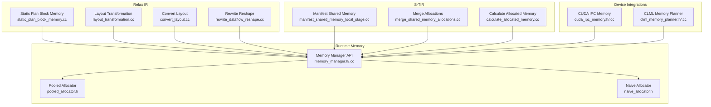
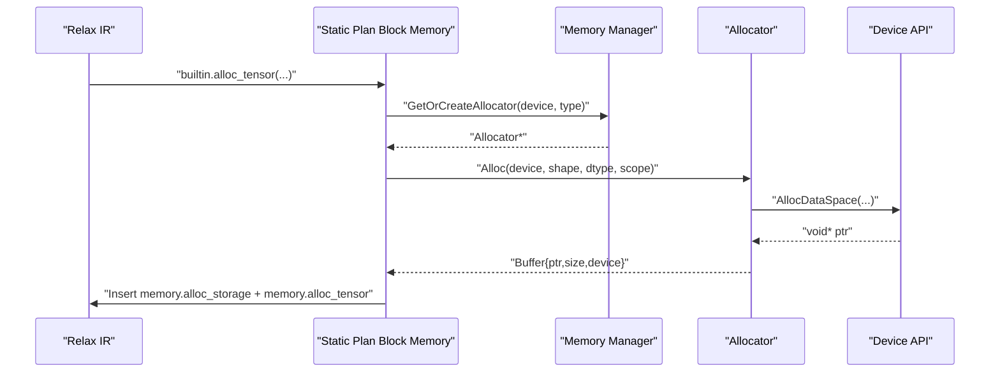
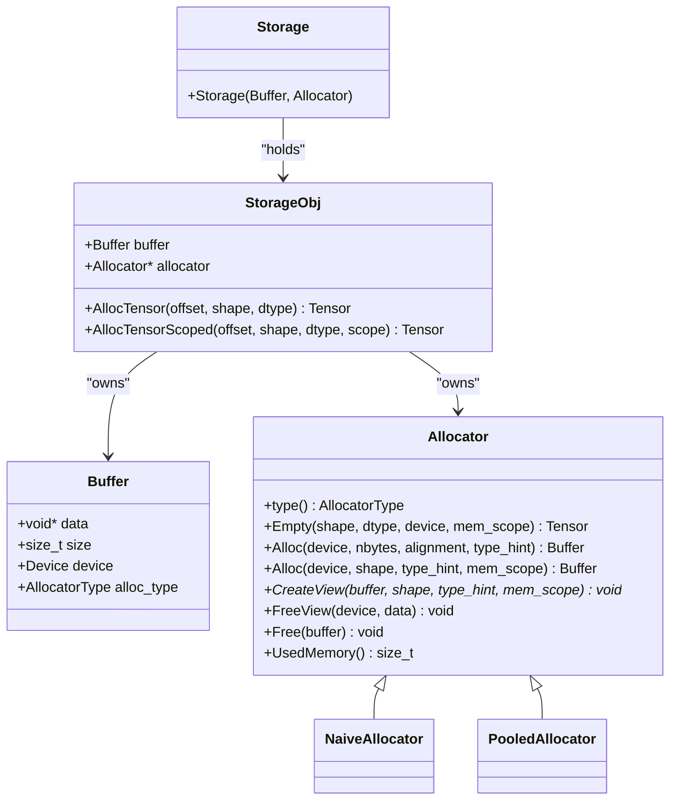
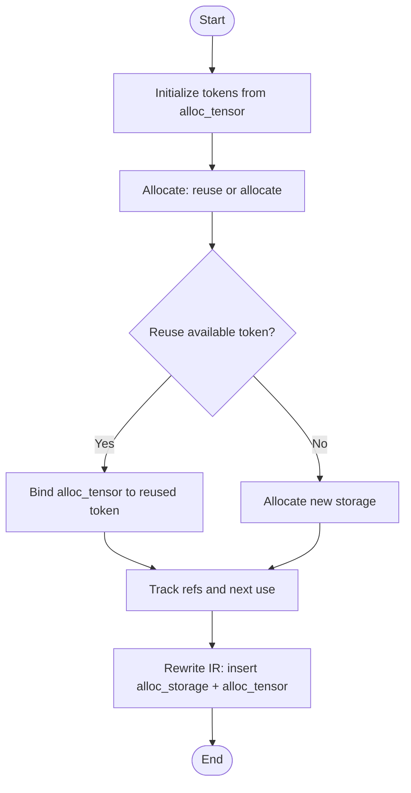
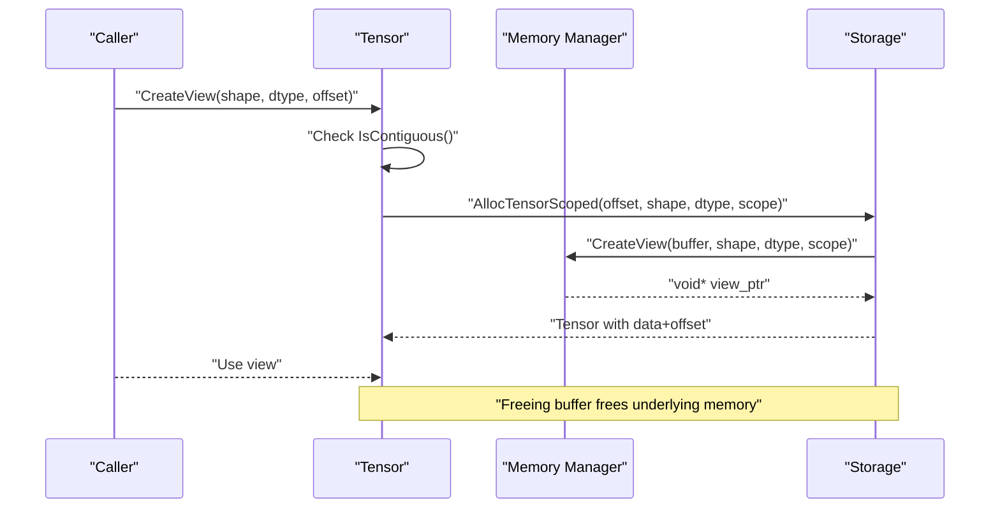
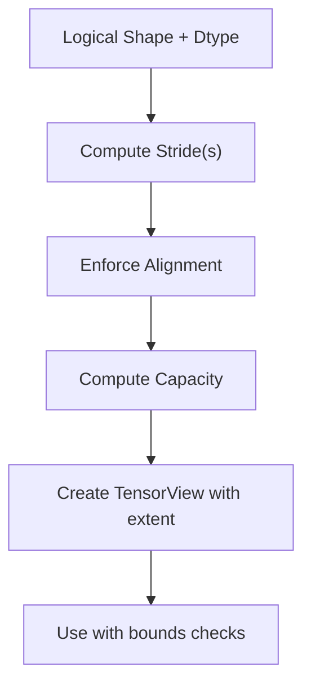
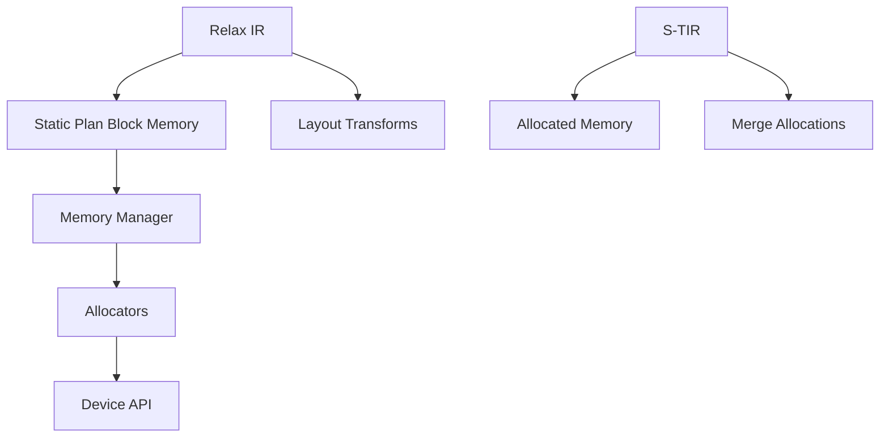

# Memory Operations

<cite>
**Referenced Files in This Document**
- [memory_manager.h](file://include/tvm/runtime/memory/memory_manager.h)
- [memory_manager.cc](file://src/runtime/memory/memory_manager.cc)
- [pooled_allocator.h](file://src/runtime/memory/pooled_allocator.h)
- [naive_allocator.h](file://src/runtime/memory/naive_allocator.h)
- [static_plan_block_memory.cc](file://src/relax/transform/static_plan_block_memory.cc)
- [tensor.cc](file://src/runtime/tensor.cc)
- [layout_transformation.cc](file://src/relax/analysis/layout_transformation.cc)
- [convert_layout.cc](file://src/relax/transform/convert_layout.cc)
- [rewrite_dataflow_reshape.cc](file://src/relax/transform/rewrite_dataflow_reshape.cc)
- [manifest_shared_memory_local_stage.cc](file://src/s_tir/transform/manifest_shared_memory_local_stage.cc)
- [merge_shared_memory_allocations.cc](file://src/s_tir/transform/merge_shared_memory_allocations.cc)
- [calculate_allocated_memory.cc](file://src/s_tir/analysis/calculate_allocated_memory.cc)
- [cuda_ipc_memory.h](file://include/tvm/runtime/disco/cuda_ipc_memory.h)
- [cuda_ipc_memory.cc](file://src/runtime/disco/cuda_ipc/cuda_ipc_memory.cc)
- [clml_memory_planner.h](file://src/runtime/contrib/clml/clml_memory_planner.h)
- [clml_memory_planner.cc](file://src/runtime/contrib/clml/clml_memory_planner.cc)
- [verify_memory.cc](file://src/tirx/analysis/verify_memory.cc)
- [lower_warp_memory.cc](file://src/tirx/transform/lower_warp_memory.cc)
</cite>

## Table of Contents
1. [Introduction](#introduction)
2. [Project Structure](#project-structure)
3. [Core Components](#core-components)
4. [Architecture Overview](#architecture-overview)
5. [Detailed Component Analysis](#detailed-component-analysis)
6. [Dependency Analysis](#dependency-analysis)
7. [Performance Considerations](#performance-considerations)
8. [Troubleshooting Guide](#troubleshooting-guide)
9. [Conclusion](#conclusion)

## Introduction
This document explains Relax’s memory operations across allocation, tensor views, memory layout transformations, and storage management primitives. It covers operator semantics, alignment and stride requirements, view creation rules, memory sharing and ownership, and lifetime management. Practical examples demonstrate efficient usage patterns, tensor reshaping, and memory pool integration. It also addresses memory fragmentation, alignment constraints, and performance implications of different memory layouts.

## Project Structure
Relax memory operations span several subsystems:
- Runtime memory management: allocator interfaces, storage objects, and device memory scopes
- Relax IR transformations: static memory planning, layout conversions, and dataflow reshapes
- S-TIR transformations: shared memory manifesting and merging
- Device-specific integrations: CUDA IPC, CLML memory planner, and verification helpers

**Diagram sources**
- [static_plan_block_memory.cc:1-1071](file://src/relax/transform/static_plan_block_memory.cc#L1-L1071)
- [layout_transformation.cc:1-200](file://src/relax/analysis/layout_transformation.cc#L1-L200)
- [convert_layout.cc:1-200](file://src/relax/transform/convert_layout.cc#L1-L200)
- [rewrite_dataflow_reshape.cc:1-200](file://src/relax/transform/rewrite_dataflow_reshape.cc#L1-L200)
- [memory_manager.h:1-202](file://include/tvm/runtime/memory/memory_manager.h#L1-L202)
- [memory_manager.cc:1-277](file://src/runtime/memory/memory_manager.cc#L1-L277)
- [pooled_allocator.h:1-133](file://src/runtime/memory/pooled_allocator.h#L1-L133)
- [naive_allocator.h:1-94](file://src/runtime/memory/naive_allocator.h#L1-L94)
- [manifest_shared_memory_local_stage.cc:1-200](file://src/s_tir/transform/manifest_shared_memory_local_stage.cc#L1-L200)
- [merge_shared_memory_allocations.cc:1-200](file://src/s_tir/transform/merge_shared_memory_allocations.cc#L1-L200)
- [calculate_allocated_memory.cc:1-200](file://src/s_tir/analysis/calculate_allocated_memory.cc#L1-L200)
- [cuda_ipc_memory.h:1-200](file://include/tvm/runtime/disco/cuda_ipc_memory.h#L1-L200)
- [cuda_ipc_memory.cc:1-200](file://src/runtime/disco/cuda_ipc/cuda_ipc_memory.cc#L1-L200)
- [clml_memory_planner.h:1-200](file://src/runtime/contrib/clml/clml_memory_planner.h#L1-L200)
- [clml_memory_planner.cc:1-200](file://src/runtime/contrib/clml/clml_memory_planner.cc#L1-L200)

**Section sources**
- [memory_manager.h:1-202](file://include/tvm/runtime/memory/memory_manager.h#L1-L202)
- [memory_manager.cc:1-277](file://src/runtime/memory/memory_manager.cc#L1-L277)
- [static_plan_block_memory.cc:1-1071](file://src/relax/transform/static_plan_block_memory.cc#L1-L1071)

## Core Components
- Memory Manager and Allocators
  - Provides abstract interfaces for device memory allocation, scoped allocation, and view creation.
  - Supports naive and pooled allocators with per-device instances and optional device-specific overrides.
- Storage Objects
  - Encapsulate a raw buffer and the allocator that created it; tensors can be allocated from storage with offsets and scopes.
- Relax Static Memory Planning
  - Replaces per-binding alloc_tensor with memory.alloc_storage and memory.alloc_tensor, enabling reuse and reducing fragmentation.
- Layout Transformations
  - Convert between logical shapes and physical layouts, including stride calculations and alignment constraints.
- S-TIR Shared Memory Management
  - Manifests and merges shared memory allocations to reduce pressure on local memory.

**Section sources**
- [memory_manager.h:47-197](file://include/tvm/runtime/memory/memory_manager.h#L47-L197)
- [memory_manager.cc:38-244](file://src/runtime/memory/memory_manager.cc#L38-L244)
- [static_plan_block_memory.cc:101-185](file://src/relax/transform/static_plan_block_memory.cc#L101-L185)
- [layout_transformation.cc:1-200](file://src/relax/analysis/layout_transformation.cc#L1-L200)
- [manifest_shared_memory_local_stage.cc:1-200](file://src/s_tir/transform/manifest_shared_memory_local_stage.cc#L1-L200)

## Architecture Overview
The memory system integrates Relax IR transformations with runtime memory management and device-specific capabilities.

**Diagram sources**
- [static_plan_block_memory.cc:1011-1025](file://src/relax/transform/static_plan_block_memory.cc#L1011-L1025)
- [memory_manager.cc:175-205](file://src/runtime/memory/memory_manager.cc#L175-L205)
- [memory_manager.h:58-127](file://include/tvm/runtime/memory/memory_manager.h#L58-L127)

## Detailed Component Analysis

### Memory Manager and Storage Primitives
- Buffer and Storage
  - Buffer holds device pointer, size, device, and allocator type.
  - Storage encapsulates a Buffer and the owning Allocator; it frees the buffer in destructor.
- Allocator
  - Abstract interface for Alloc/Free, view creation, and memory usage reporting.
  - Device-specific allocator lookup via global registry; fallback to naive or pooled allocators.
- Alignment and Data Type Validation
  - Alignment computed from dtype lanes and bits; minimum alignment enforced.
  - Data type validation ensures lane width and bit-width compatibility.

**Diagram sources**
- [memory_manager.h:47-197](file://include/tvm/runtime/memory/memory_manager.h#L47-L197)
- [memory_manager.cc:38-125](file://src/runtime/memory/memory_manager.cc#L38-L125)
- [naive_allocator.h:36-87](file://src/runtime/memory/naive_allocator.h#L36-L87)
- [pooled_allocator.h:39-126](file://src/runtime/memory/pooled_allocator.h#L39-L126)

**Section sources**
- [memory_manager.h:47-197](file://include/tvm/runtime/memory/memory_manager.h#L47-L197)
- [memory_manager.cc:45-125](file://src/runtime/memory/memory_manager.cc#L45-L125)
- [naive_allocator.h:40-75](file://src/runtime/memory/naive_allocator.h#L40-L75)
- [pooled_allocator.h:48-92](file://src/runtime/memory/pooled_allocator.h#L48-L92)

### Static Memory Planning for Relax
- Purpose
  - Replace per-binding alloc_tensor with memory.alloc_storage and memory.alloc_tensor to enable reuse and reduce fragmentation.
- Phases
  - Initialization: create StorageToken for each alloc_tensor meeting reuse criteria; track reference counts.
  - Allocation planning: reuse compatible tokens or allocate new ones; maintain pools keyed by storage scope and dtype.
  - IR rewrite: insert storage allocations and replace alloc_tensor with scoped alloc_tensor at use sites.
- Dynamic Shapes
  - Uses TIR variable upper bounds to estimate sizes for dynamic-shape outputs.

**Diagram sources**
- [static_plan_block_memory.cc:518-875](file://src/relax/transform/static_plan_block_memory.cc#L518-L875)
- [static_plan_block_memory.cc:883-1009](file://src/relax/transform/static_plan_block_memory.cc#L883-L1009)

**Section sources**
- [static_plan_block_memory.cc:26-875](file://src/relax/transform/static_plan_block_memory.cc#L26-L875)
- [static_plan_block_memory.cc:883-1009](file://src/relax/transform/static_plan_block_memory.cc#L883-L1009)

### Tensor Views and Ownership Semantics
- Creating a view
  - Requires the tensor to be compact (contiguous strides).
  - Validates relative byte offset and view size against backing buffer.
- Ownership and Lifetime
  - Views share the underlying buffer; freeing the buffer invalidates views.
  - Scoped allocations via storage allow per-scope view lifetimes.

**Diagram sources**
- [tensor.cc:138-172](file://src/runtime/tensor.cc#L138-L172)
- [memory_manager.cc:63-92](file://src/runtime/memory/memory_manager.cc#L63-L92)

**Section sources**
- [tensor.cc:138-172](file://src/runtime/tensor.cc#L138-L172)
- [memory_manager.cc:63-92](file://src/runtime/memory/memory_manager.cc#L63-L92)

### Layout Transformations and Stride Semantics
- Logical vs Physical
  - Logical shape and dtype map to physical layout with strides and capacity.
- Alignment and Capacity
  - Row/column major layouts require alignment and capacity calculations consistent with hardware vector widths.
- View Bounds Checking
  - Views carry extent and guard accesses with containment checks.

**Diagram sources**
- [layout_transformation.cc:1-200](file://src/relax/analysis/layout_transformation.cc#L1-L200)
- [tensor.cc:138-172](file://src/runtime/tensor.cc#L138-L172)

**Section sources**
- [layout_transformation.cc:1-200](file://src/relax/analysis/layout_transformation.cc#L1-L200)
- [tensor.cc:138-172](file://src/runtime/tensor.cc#L138-L172)

### S-TIR Shared Memory Management
- Manifest shared memory
  - Inserts explicit shared memory allocations for local-stage producers.
- Merge allocations
  - Merges compatible allocations to reduce total footprint.
- Memory calculation
  - Computes allocated memory to guide planning decisions.

**Diagram sources**
- [manifest_shared_memory_local_stage.cc:1-200](file://src/s_tir/transform/manifest_shared_memory_local_stage.cc#L1-L200)
- [merge_shared_memory_allocations.cc:1-200](file://src/s_tir/transform/merge_shared_memory_allocations.cc#L1-L200)
- [calculate_allocated_memory.cc:1-200](file://src/s_tir/analysis/calculate_allocated_memory.cc#L1-L200)

**Section sources**
- [manifest_shared_memory_local_stage.cc:1-200](file://src/s_tir/transform/manifest_shared_memory_local_stage.cc#L1-L200)
- [merge_shared_memory_allocations.cc:1-200](file://src/s_tir/transform/merge_shared_memory_allocations.cc#L1-L200)
- [calculate_allocated_memory.cc:1-200](file://src/s_tir/analysis/calculate_allocated_memory.cc#L1-L200)

### Device-Specific Integrations
- CUDA IPC Memory
  - Enables inter-process sharing of GPU memory regions.
- CLML Memory Planner
  - Specialized memory planning for OpenCL/CPU heterogeneous devices.

**Section sources**
- [cuda_ipc_memory.h:1-200](file://include/tvm/runtime/disco/cuda_ipc_memory.h#L1-L200)
- [cuda_ipc_memory.cc:1-200](file://src/runtime/disco/cuda_ipc/cuda_ipc_memory.cc#L1-L200)
- [clml_memory_planner.h:1-200](file://src/runtime/contrib/clml/clml_memory_planner.h#L1-L200)
- [clml_memory_planner.cc:1-200](file://src/runtime/contrib/clml/clml_memory_planner.cc#L1-L200)

## Dependency Analysis
- Coupling
  - Relax static planner depends on Memory Manager for device allocation and storage scoping.
  - Layout transformations depend on struct info and dtype/shape analysis.
  - S-TIR passes depend on memory calculation and device-specific targets.
- Cohesion
  - Allocators encapsulate device-specific logic; Memory Manager centralizes device-instance management.
- External Dependencies
  - Device API provides AllocDataSpace/FreeDataSpace; global registry enables device-specific allocator selection.

**Diagram sources**
- [static_plan_block_memory.cc:1011-1025](file://src/relax/transform/static_plan_block_memory.cc#L1011-L1025)
- [memory_manager.cc:147-173](file://src/runtime/memory/memory_manager.cc#L147-L173)
- [pooled_allocator.h:99-106](file://src/runtime/memory/pooled_allocator.h#L99-L106)
- [naive_allocator.h:40-46](file://src/runtime/memory/naive_allocator.h#L40-L46)
- [layout_transformation.cc:1-200](file://src/relax/analysis/layout_transformation.cc#L1-L200)
- [calculate_allocated_memory.cc:1-200](file://src/s_tir/analysis/calculate_allocated_memory.cc#L1-L200)
- [merge_shared_memory_allocations.cc:1-200](file://src/s_tir/transform/merge_shared_memory_allocations.cc#L1-L200)

**Section sources**
- [static_plan_block_memory.cc:1011-1025](file://src/relax/transform/static_plan_block_memory.cc#L1011-L1025)
- [memory_manager.cc:147-173](file://src/runtime/memory/memory_manager.cc#L147-L173)
- [pooled_allocator.h:99-106](file://src/runtime/memory/pooled_allocator.h#L99-L106)
- [naive_allocator.h:40-46](file://src/runtime/memory/naive_allocator.h#L40-L46)

## Performance Considerations
- Alignment
  - Data type alignment is derived from dtype lanes and bits; misalignment can cause performance penalties or failures on certain devices.
- Fragmentation
  - Pooled allocator reduces fragmentation by reusing pages; naive allocator incurs more overhead due to frequent allocations.
- Layout Efficiency
  - Contiguous layouts and aligned strides improve vectorization and reduce access overhead.
- Static Planning
  - Reuse of storage across bindings reduces peak memory usage and improves locality.

[No sources needed since this section provides general guidance]

## Troubleshooting Guide
- View Creation Failures
  - Ensure tensor is contiguous before creating a view; verify offset plus view size fits within backing buffer.
- Scope Compatibility
  - Some allocators only support “global” or empty scopes; device-specific handlers may enforce additional constraints.
- Device Allocator Not Found
  - If a device-specific allocator is unavailable, fallback allocators are used; verify global registry entries for device kinds.
- Dynamic Shape Planning
  - For dynamic outputs, ensure TIR variable upper bounds are annotated so the planner can estimate sizes.

**Section sources**
- [tensor.cc:138-172](file://src/runtime/tensor.cc#L138-L172)
- [memory_manager.cc:246-261](file://src/runtime/memory/memory_manager.cc#L246-L261)
- [static_plan_block_memory.cc:410-459](file://src/relax/transform/static_plan_block_memory.cc#L410-L459)

## Conclusion
Relax’s memory system combines IR-level planning with robust runtime memory management and device-aware allocators. Static memory planning maximizes reuse and reduces fragmentation, while layout transformations and view semantics provide safe, efficient access patterns. Proper alignment, scope awareness, and careful lifetime management are essential for optimal performance and correctness.