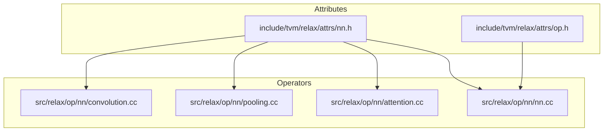
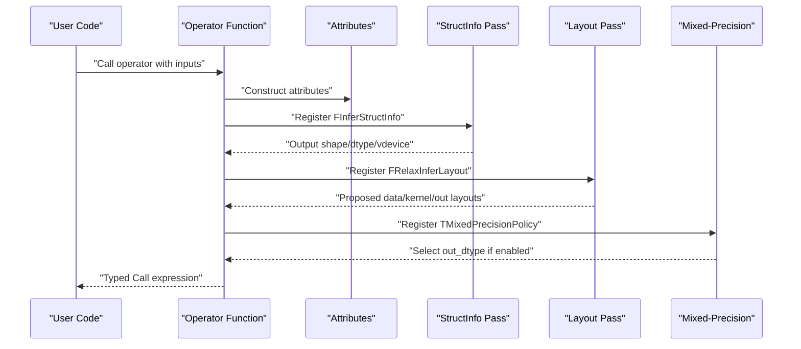
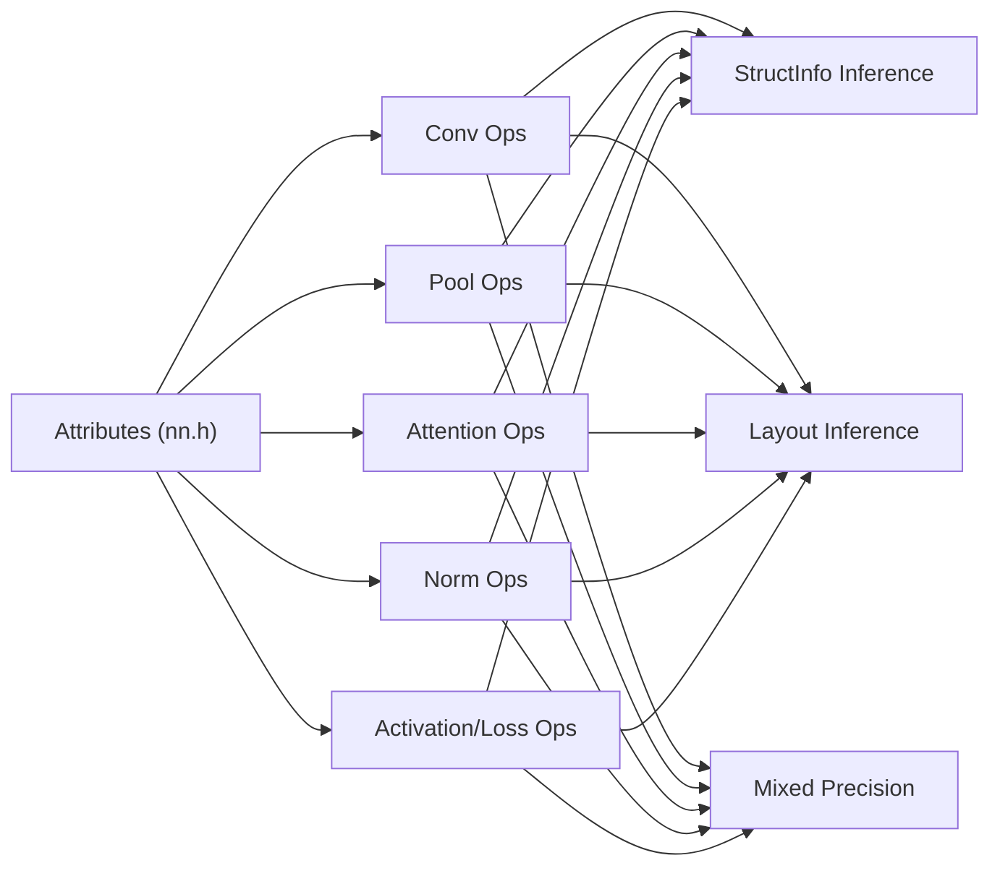

# Neural Network Operations

<cite>
**Referenced Files in This Document**
- [convolution.cc](file://src/relax/op/nn/convolution.cc)
- [convolution.h](file://src/relax/op/nn/convolution.h)
- [pooling.cc](file://src/relax/op/nn/pooling.cc)
- [pooling.h](file://src/relax/op/nn/pooling.h)
- [attention.cc](file://src/relax/op/nn/attention.cc)
- [attention.h](file://src/relax/op/nn/attention.h)
- [nn.cc](file://src/relax/op/nn/nn.cc)
- [nn.h](file://include/tvm/relax/attrs/nn.h)
- [op.h](file://include/tvm/relax/attrs/op.h)
</cite>

## Table of Contents
1. [Introduction](#introduction)
2. [Project Structure](#project-structure)
3. [Core Components](#core-components)
4. [Architecture Overview](#architecture-overview)
5. [Detailed Component Analysis](#detailed-component-analysis)
6. [Dependency Analysis](#dependency-analysis)
7. [Performance Considerations](#performance-considerations)
8. [Troubleshooting Guide](#troubleshooting-guide)
9. [Conclusion](#conclusion)

## Introduction
This document describes Relax’s neural network operations across convolution, pooling, normalization, activation functions, attention mechanisms, and related primitives. It covers operator signatures, input/output tensor shapes, attribute configurations, parameter constraints, forward behavior, and mixed-precision policies. Practical examples, operator fusion opportunities, and performance tuning strategies are included, along with numerical stability and precision considerations.

## Project Structure
Relax neural network primitives are implemented as typed operators with structured attributes and inference passes:
- Operators are defined in dedicated source files under src/relax/op/nn/.
- Attributes for operators are declared in include/tvm/relax/attrs/nn.h.
- Additional Relax operator attributes live in include/tvm/relax/attrs/op.h.
- Each operator exposes:
  - A Python-callable function interface
  - StructInfo inference for static shape/dtype/vdevice propagation
  - Layout inference for data/kernel layouts
  - Mixed-precision policy registration

**Diagram sources**
- [nn.h:24-787](file://include/tvm/relax/attrs/nn.h#L24-L787)
- [op.h:24-125](file://include/tvm/relax/attrs/op.h#L24-L125)
- [convolution.cc:1-1253](file://src/relax/op/nn/convolution.cc#L1-L1253)
- [pooling.cc:1-789](file://src/relax/op/nn/pooling.cc#L1-L789)
- [attention.cc:1-193](file://src/relax/op/nn/attention.cc#L1-L193)
- [nn.cc:1-1247](file://src/relax/op/nn/nn.cc#L1-L1247)

**Section sources**
- [nn.h:24-787](file://include/tvm/relax/attrs/nn.h#L24-L787)
- [op.h:24-125](file://include/tvm/relax/attrs/op.h#L24-L125)
- [convolution.cc:1-1253](file://src/relax/op/nn/convolution.cc#L1-L1253)
- [pooling.cc:1-789](file://src/relax/op/nn/pooling.cc#L1-L789)
- [attention.cc:1-193](file://src/relax/op/nn/attention.cc#L1-L193)
- [nn.cc:1-1247](file://src/relax/op/nn/nn.cc#L1-L1247)

## Core Components
- Convolution family: conv1d, conv2d, conv3d and transposed variants with stride, padding, dilation, groups, layout, and optional output dtype.
- Pooling family: max_pool and avg_pool for 1D/2D/3D with ceil_mode, dilation, padding, and layout.
- Normalization: batch_norm, layer_norm, group_norm, instance_norm, rms_norm with axes, epsilon, center/scale flags.
- Activations and losses: relu, gelu, silu, leakyrelu, softplus, prelu, softmax/log_softmax, dropout, cross_entropy_with_logits, nll_loss, pad, pixel_shuffle.
- Attention: multi-head attention with optional bias, scale, causal mask, and sliding window.

Each operator registers:
- StructInfo inference to compute output shapes/dtypes/vdevices
- Layout inference for data/kernel layouts
- Mixed-precision policy (always/follow/none)
- Optional fused variants (e.g., attention with bias)

**Section sources**
- [convolution.cc:43-594](file://src/relax/op/nn/convolution.cc#L43-L594)
- [pooling.cc:39-789](file://src/relax/op/nn/pooling.cc#L39-L789)
- [nn.cc:46-1247](file://src/relax/op/nn/nn.cc#L46-L1247)
- [attention.cc:29-193](file://src/relax/op/nn/attention.cc#L29-L193)

## Architecture Overview
Relax operators are typed expressions with attributes and inference passes. The typical flow:
- User constructs a call with inputs and attributes
- StructInfo inference computes output shape/dtype/vdevice
- Layout inference decides data/kernel layouts
- Mixed-precision policy selects output dtype when enabled

**Diagram sources**
- [convolution.cc:195-204](file://src/relax/op/nn/convolution.cc#L195-L204)
- [pooling.cc:144-151](file://src/relax/op/nn/pooling.cc#L144-L151)
- [nn.cc:170-230](file://src/relax/op/nn/nn.cc#L170-L230)
- [attention.cc:151-160](file://src/relax/op/nn/attention.cc#L151-L160)

## Detailed Component Analysis

### Convolution Family
- Operators: conv1d, conv2d, conv3d, conv1d_transpose, conv2d_transpose, conv3d_transpose
- Attributes: strides, padding, dilation, groups, data_layout, kernel_layout, out_layout, out_dtype
- Constraints:
  - groups > 0
  - Channel compatibility enforced between input and weights
  - Output channels must be divisible by groups (non-transposed)
  - Transposed conv output padding < stride
- Shape inference:
  - Computes output spatial dimensions from input, kernel, padding, dilation, stride
  - Supports symbolic shapes via analyzer simplifications
- Layout inference:
  - Propagates/transforms layouts consistently across inputs and outputs
- Mixed precision:
  - Always promotes to higher precision for accumulation

Common shapes and constraints
- 1D: data NCW/OIW; kernel OIW/IOW; out NCW
- 2D: data NCHW/OIHW; kernel OIHW; out NCHW
- 3D: data NCDHW/OIDHW; kernel OIDHW; out NCDHW

Practical example: 2D convolution with mixed precision
- Inputs: data (N,C,H,W), weight (Cin,Cout,Hk,Wk) with groups=Cin
- Attributes: strides=[s,s], padding=[p,p,p,p], dilation=[d,d], groups=Cin
- Output: (N, Cout, Hout, Wout) computed from formula

Forward behavior
- Applies grouped convolution with optional dilation and padding
- Supports explicit out_dtype for mixed precision

Memory optimization
- Prefer NHWC/NCHW layouts aligned with target backend
- Use grouped convolutions to reduce memory footprint when possible

**Section sources**
- [convolution.h:38-114](file://src/relax/op/nn/convolution.h#L38-L114)
- [convolution.cc:43-594](file://src/relax/op/nn/convolution.cc#L43-L594)
- [nn.h:32-168](file://include/tvm/relax/attrs/nn.h#L32-L168)

### Pooling Family
- Operators: max_pool1d/2d/3d, avg_pool1d/2d/3d, adaptive_avg_pool1d/2d/3d
- Attributes: pool_size, strides, padding, dilation, ceil_mode, count_include_pad, layout, out_layout
- Shape inference:
  - Computes output size with floor/ceil handling and dilation
  - Adaptive pooling sets output size from provided dimensions
- Layout inference:
  - Preserves/transforms layouts consistently

Typical usage
- Max pooling for detection heads
- Average pooling for downsampling before classification

**Section sources**
- [pooling.h:35-48](file://src/relax/op/nn/pooling.h#L35-L48)
- [pooling.cc:39-789](file://src/relax/op/nn/pooling.cc#L39-L789)
- [nn.h:322-522](file://include/tvm/relax/attrs/nn.h#L322-L522)

### Normalization Layers
- BatchNorm: axis, epsilon, center, scale, momentum, training
- LayerNorm: axes, epsilon, center, scale
- GroupNorm: num_groups, channel_axis, axes, epsilon, center, scale
- InstanceNorm: channel_axis, axes, epsilon, center, scale
- RMSNorm: axes, epsilon

Constraints and checks
- Dtype must be float/bfloat for normalization ops
- Gamma/Beta sizes must match normalization axes
- GroupNorm requires channel size divisible by num_groups

Layout inference
- Axes remapped according to layout transformations

Mixed precision
- Follow policy for normalization parameters

**Section sources**
- [nn.cc:371-808](file://src/relax/op/nn/nn.cc#L371-L808)
- [nn.h:576-694](file://include/tvm/relax/attrs/nn.h#L576-L694)

### Activation Functions and Utilities
- ReLU, GELU, SiLU, SELU, LeakyReLU, Softplus, PReLU, Softmax/LogSoftmax
- Pad, PixelShuffle
- Dropout (returns tuple of data and auxiliary info)

Shape and dtype rules
- Many ops require float/bfloat inputs
- PReLU requires float dtype and axis normalization

Layout inference
- Unary ops preserve layout; PReLU remaps axis

**Section sources**
- [nn.cc:46-297](file://src/relax/op/nn/nn.cc#L46-L297)
- [nn.h:524-781](file://include/tvm/relax/attrs/nn.h#L524-L781)

### Attention Mechanisms
- Multi-head attention with optional bias, scale, causal mask, window size
- Variants: attention, attention with bias, variable-length attention

Input constraints
- Queries/Keys/Values must be 4D: [batch, seq, heads, head_dim]
- Head dimensions must match; number of heads for Q must divide K/V heads
- Bias must be broadcastable or same shape as attention logits

Output
- Same dtype as inputs; shape [batch, q_seq, heads, v_head_dim]

Mixed precision
- Always policy for attention

**Section sources**
- [attention.h:35-38](file://src/relax/op/nn/attention.h#L35-L38)
- [attention.cc:29-193](file://src/relax/op/nn/attention.cc#L29-L193)
- [nn.h:726-744](file://include/tvm/relax/attrs/nn.h#L726-L744)

### Loss Functions
- Cross-entropy with logits: predictions and labels must have same shape and ndim
- NLL loss: supports weights, reduction modes ("none","mean","sum"), ignore_index

Shape inference specifics
- NLL loss derives K from input shapes and enforces consistency across predictions, targets, and weights

**Section sources**
- [nn.cc:899-1193](file://src/relax/op/nn/nn.cc#L899-L1193)
- [nn.h:696-724](file://include/tvm/relax/attrs/nn.h#L696-L724)

## Dependency Analysis
- Operators depend on attributes defined in nn.h
- StructInfo and layout inference are registered per operator
- Mixed-precision policies are attached to operators

**Diagram sources**
- [nn.h:24-787](file://include/tvm/relax/attrs/nn.h#L24-L787)
- [convolution.cc:195-204](file://src/relax/op/nn/convolution.cc#L195-L204)
- [pooling.cc:144-151](file://src/relax/op/nn/pooling.cc#L144-L151)
- [attention.cc:151-160](file://src/relax/op/nn/attention.cc#L151-L160)
- [nn.cc:170-230](file://src/relax/op/nn/nn.cc#L170-L230)

**Section sources**
- [nn.h:24-787](file://include/tvm/relax/attrs/nn.h#L24-L787)
- [convolution.cc:195-204](file://src/relax/op/nn/convolution.cc#L195-L204)
- [pooling.cc:144-151](file://src/relax/op/nn/pooling.cc#L144-L151)
- [attention.cc:151-160](file://src/relax/op/nn/attention.cc#L151-L160)
- [nn.cc:170-230](file://src/relax/op/nn/nn.cc#L170-L230)

## Performance Considerations
- Operator fusion
  - Convolution + activation can be fused to reduce memory traffic
  - Attention with bias can fuse additive bias into attention logits
  - Pooling + normalization can be fused depending on backend support
- Layout selection
  - Choose NHWC/NCHW aligned with target backend to maximize throughput
  - Use layout inference to propagate preferred layouts
- Mixed precision
  - Enable mixed precision for conv/attention to reduce memory bandwidth and improve throughput
  - Ensure numerical stability by selecting appropriate out_dtype and scaling
- Padding and pooling
  - Prefer symmetric padding to simplify shape computations
  - Use adaptive pooling to avoid dynamic kernels when possible
- Attention
  - Use sliding window attention to limit quadratic complexity
  - Consider causal masks only when needed to avoid unnecessary masking overhead

[No sources needed since this section provides general guidance]

## Troubleshooting Guide
Common issues and resolutions
- Shape mismatches
  - Convolution: ensure input channels equal weight input channels × groups; output channels divisible by groups
  - Attention: verify Q/K/V shapes and head dimensions align; bias broadcastability
  - Normalization: axes must match data shape; channel size divisible by num_groups for group norm
- Dtype errors
  - Normalization and softmax require float/bfloat; PReLU requires float
- Layout errors
  - Ensure layout transforms are provable with current shapes; otherwise fall back to default layouts
- Mixed precision
  - Verify out_dtype compatibility and that downstream ops support the chosen precision

Diagnostic helpers
- StructInfo inference reports fatal diagnostics for illegal shapes/dtypes
- Analyzer simplifications assist in proving shape equalities

**Section sources**
- [convolution.cc:107-126](file://src/relax/op/nn/convolution.cc#L107-L126)
- [attention.cc:93-140](file://src/relax/op/nn/attention.cc#L93-L140)
- [nn.cc:372-440](file://src/relax/op/nn/nn.cc#L372-L440)

## Conclusion
Relax’s neural network primitives provide strong static shape inference, layout propagation, and mixed-precision support. By leveraging operator attributes, structured inference, and targeted fusions, developers can construct efficient and numerically stable models. Adhering to layout and dtype constraints, and using adaptive pooling and attention variants judiciously, yields robust performance across diverse hardware backends.