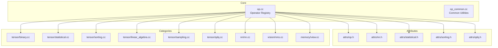
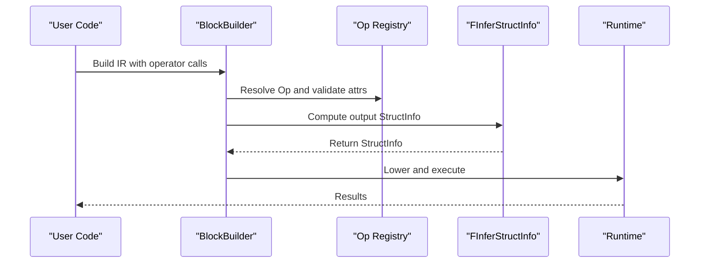
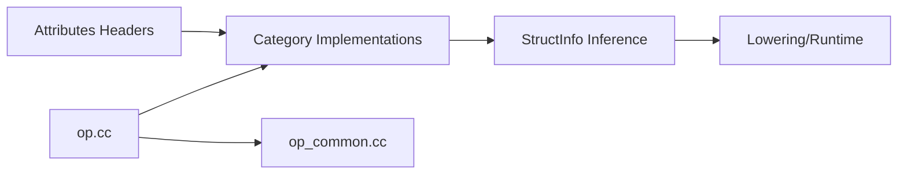
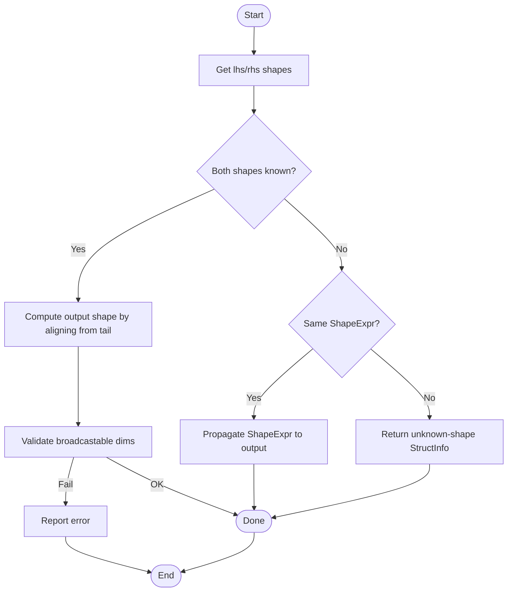

# Operator Library

<cite>
**Referenced Files in This Document**
- [op.cc](file://src/relax/op/op.cc)
- [op_common.cc](file://src/relax/op/op_common.cc)
- [op.h](file://include/tvm/relax/attrs/op.h)
- [nn.h](file://include/tvm/relax/attrs/nn.h)
- [statistical.h](file://include/tvm/relax/attrs/statistical.h)
- [sorting.h](file://include/tvm/relax/attrs/sorting.h)
- [qdq.h](file://include/tvm/relax/attrs/qdq.h)
- [binary.cc](file://src/relax/op/tensor/binary.cc)
- [nn.cc](file://src/relax/op/nn/nn.cc)
- [statistical.cc](file://src/relax/op/tensor/statistical.cc)
- [sorting.cc](file://src/relax/op/tensor/sorting.cc)
- [qdq.cc](file://src/relax/op/tensor/qdq.cc)
- [sampling.cc](file://src/relax/op/tensor/sampling.cc)
- [linear_algebra.cc](file://src/relax/op/tensor/linear_algebra.cc)
- [nms.cc](file://src/relax/op/vision/nms.cc)
- [view.cc](file://src/relax/op/memory/view.cc)
</cite>

## Table of Contents
1. [Introduction](#introduction)
2. [Project Structure](#project-structure)
3. [Core Components](#core-components)
4. [Architecture Overview](#architecture-overview)
5. [Detailed Component Analysis](#detailed-component-analysis)
6. [Dependency Analysis](#dependency-analysis)
7. [Performance Considerations](#performance-considerations)
8. [Troubleshooting Guide](#troubleshooting-guide)
9. [Conclusion](#conclusion)
10. [Appendices](#appendices)

## Introduction
This document describes Relax’s operator library comprehensively. It covers built-in operations, neural network primitives, computer vision operations, image processing, memory operations, statistical computations, sorting algorithms, search operations, sampling techniques, linear algebra routines, and quantization/dequantization ops. It explains operator signatures, input/output types, attributes, and usage patterns; documents the operator categorization system, broadcasting rules, and type inference; and provides practical examples, performance tips, and guidance for extending the library with custom operators and leveraging backend-specific implementations.

## Project Structure
Relax operators are organized by category under the Relax operator tree:
- Core operator registry and common utilities: [op.cc](file://src/relax/op/op.cc), [op_common.cc](file://src/relax/op/op_common.cc)
- Attributes for operators: [op.h](file://include/tvm/relax/attrs/op.h), [nn.h](file://include/tvm/relax/attrs/nn.h), [statistical.h](file://include/tvm/relax/attrs/statistical.h), [sorting.h](file://include/tvm/relax/attrs/sorting.h), [qdq.h](file://include/tvm/relax/attrs/qdq.h)
- Category-specific implementations:
  - Tensor arithmetic and reductions: [binary.cc](file://src/relax/op/tensor/binary.cc), [statistical.cc](file://src/relax/op/tensor/statistical.cc), [sorting.cc](file://src/relax/op/tensor/sorting.cc), [linear_algebra.cc](file://src/relax/op/tensor/linear_algebra.cc), [sampling.cc](file://src/relax/op/tensor/sampling.cc), [qdq.cc](file://src/relax/op/tensor/qdq.cc)
  - Neural networks: [nn.cc](file://src/relax/op/nn/nn.cc)
  - Vision: [nms.cc](file://src/relax/op/vision/nms.cc)
  - Memory: [view.cc](file://src/relax/op/memory/view.cc)

**Diagram sources**
- [op.cc:1-800](file://src/relax/op/op.cc#L1-L800)
- [op_common.cc:1-212](file://src/relax/op/op_common.cc#L1-L212)
- [op.h:1-125](file://include/tvm/relax/attrs/op.h#L1-L125)
- [nn.h:1-787](file://include/tvm/relax/attrs/nn.h#L1-L787)
- [statistical.h:1-76](file://include/tvm/relax/attrs/statistical.h#L1-L76)
- [sorting.h:1-110](file://include/tvm/relax/attrs/sorting.h#L1-L110)
- [qdq.h:1-53](file://include/tvm/relax/attrs/qdq.h#L1-L53)
- [binary.cc:1-200](file://src/relax/op/tensor/binary.cc#L1-L200)
- [statistical.cc:1-200](file://src/relax/op/tensor/statistical.cc#L1-L200)
- [sorting.cc:1-171](file://src/relax/op/tensor/sorting.cc#L1-L171)
- [linear_algebra.cc:1-200](file://src/relax/op/tensor/linear_algebra.cc#L1-L200)
- [sampling.cc:1-149](file://src/relax/op/tensor/sampling.cc#L1-L149)
- [qdq.cc:1-200](file://src/relax/op/tensor/qdq.cc#L1-L200)
- [nn.cc:1-200](file://src/relax/op/nn/nn.cc#L1-L200)
- [nms.cc:1-200](file://src/relax/op/vision/nms.cc#L1-L200)
- [view.cc:1-200](file://src/relax/op/memory/view.cc#L1-L200)

**Section sources**
- [op.cc:1-800](file://src/relax/op/op.cc#L1-L800)
- [op_common.cc:1-212](file://src/relax/op/op_common.cc#L1-L212)

## Core Components
- Operator registry and inference:
  - Central registration of operators and their metadata (number of inputs, arguments, attributes, inference functions).
  - StructInfo inference helpers for purity, normalization, validation, and layout inference.
- Broadcasting and shape inference:
  - Binary broadcasting shape inference and axis normalization utilities.
- Call TIR family:
  - call_tir, call_tir_with_grad, call_tir_inplace with explicit output StructInfo and validation.
- Attribute reflection:
  - Strongly-typed attributes for operators (e.g., quantize/dequantize, pooling, sorting, statistical).

Examples of core mechanisms:
- StructInfo inference for call_tir variants and call_pure_packed/call_inplace_packed.
- Broadcasting rules for binary arithmetic and comparisons.
- Axis normalization for reductions and layouts.

**Section sources**
- [op.cc:115-620](file://src/relax/op/op.cc#L115-L620)
- [op_common.cc:109-178](file://src/relax/op/op_common.cc#L109-L178)

## Architecture Overview
Relax operators are defined as:
- Operations registered in the global Op registry with metadata and attributes.
- Calls to operators are typed expressions carrying StructInfo for shapes, dtypes, and device placement.
- Inference passes compute output StructInfo from inputs and attributes.

**Diagram sources**
- [op.cc:434-586](file://src/relax/op/op.cc#L434-L586)
- [op_common.cc:27-82](file://src/relax/op/op_common.cc#L27-L82)

## Detailed Component Analysis

### Operator Categories and Signatures

#### Built-in Operators and Call TIR Family
- call_pure_packed
  - Purpose: Call an opaque function with pure semantics.
  - Inputs: First argument is the function; remaining are arguments.
  - StructInfo: Derived from function signature or custom derivation.
- call_inplace_packed
  - Purpose: Call an opaque function with in-place outputs indicated by indices.
  - Inputs: Function plus arguments; attributes include inplace_indices.
  - Validation: Ensures indices are unique, in-range, and output StructInfo matches in-place inputs.
- call_tir
  - Purpose: Call a TIR PrimFunc with explicit output StructInfo.
  - Inputs: PrimFunc GlobalVar, tuple of inputs, optional packed ints.
  - StructInfo: Explicit out_sinfo; validation ensures compatibility with PrimFunc signature.
- call_tir_with_grad
  - Purpose: Call TIR with gradient function name and kwargs.
  - Attributes: te_grad_name, te_grad_kwargs.
- call_tir_inplace
  - Purpose: Call TIR with in-place outputs; validates shapes and dtypes match in-place inputs.

Usage patterns:
- Chain call_tir with explicit out_sinfo to define shapes/dtypes for downstream operators.
- Use call_pure_packed for pure wrappers around backend kernels.
- Use call_inplace_packed/call_tir_inplace to reduce allocations and improve performance when aliasing is safe.

**Section sources**
- [op.cc:87-136](file://src/relax/op/op.cc#L87-L136)
- [op.cc:138-257](file://src/relax/op/op.cc#L138-L257)
- [op.cc:259-620](file://src/relax/op/op.cc#L259-L620)

#### Neural Network Primitives
- Unary activations: relu, gelu, silu, selu, leakyrelu, softplus, prelu.
- Normalizations: batch_norm, layer_norm, group_norm, instance_norm, rms_norm.
- Convolutions: conv1d, conv2d, conv3d, conv1d_transpose, conv2d_transpose, conv3d_transpose.
- Pooling: max_pool1d/avg_pool1d, max_pool2d/avg_pool2d, max_pool3d/avg_pool3d, adaptive pooling variants.
- Softmax, dropout, padding, pixel_shuffle.

Attributes:
- Convolution: strides, padding, dilation, groups, data/kernel/out layouts, out_dtype.
- Pooling: pool_size, strides, padding, dilation, ceil_mode, count_include_pad, layout, out_layout.
- Normalizations: axis, epsilon, center, scale, momentum, training; group norms include num_groups and channel_axis.
- Activations: axis for PReLU, axis for softmax, rate for dropout.

Usage patterns:
- Choose data_layout/kernel_layout consistent with model expectations.
- Use out_dtype for mixed precision training/inference.
- Normalize axes consistently; negative axes are normalized to positive equivalents.

**Section sources**
- [nn.cc:46-200](file://src/relax/op/nn/nn.cc#L46-L200)
- [nn.h:32-787](file://include/tvm/relax/attrs/nn.h#L32-L787)

#### Computer Vision Operations
- Non-Max Suppression (NMS):
  - all_class_non_max_suppression: Returns indices, scores, and counts depending on output_format.
  - get_valid_counts: Filters anchors by score thresholds and returns valid counts and filtered data.
  - non_max_suppression: Selects boxes with configurable thresholds and indices.

Usage patterns:
- Preprocess detections with get_valid_counts, then apply NMS to obtain final boxes.
- Use output_format to match ONNX-style outputs when needed.

**Section sources**
- [nms.cc:43-200](file://src/relax/op/vision/nms.cc#L43-L200)

#### Image Processing
- Resize: Resizing images with interpolation modes and coordinate transformation.
- Pixel shuffling: Spatial-to-channel upsampling.

Note: Specific implementations are located under image/; consult the image resize implementation for resizing details.

**Section sources**
- [nn.cc:1-200](file://src/relax/op/nn/nn.cc#L1-L200)
- [nn.h:769-781](file://include/tvm/relax/attrs/nn.h#L769-L781)

#### Memory Operations
- view: Reinterpret memory with a new shape, dtype, and optional relative byte offset.
  - Behavior: Preserves underlying buffer; shape/dtype changes are validated against element counts and alignment.
  - Use cases: Efficient reshaping and reinterpretation without copies.

**Section sources**
- [view.cc:32-200](file://src/relax/op/memory/view.cc#L32-L200)

#### Statistical Computations
- Reductions: mean, sum, prod, max, min, any, all with axis, keepdims.
- Scan operations: cumsum, cumprod with axis, dtype, exclusive flag.

Rules:
- Axis normalization handles negative indices and duplicates.
- keepdims controls whether reduced axes remain as size 1.
- Output shape derived from input shape and axis selection.

**Section sources**
- [statistical.cc:40-200](file://src/relax/op/tensor/statistical.cc#L40-L200)
- [statistical.h:32-76](file://include/tvm/relax/attrs/statistical.h#L32-L76)

#### Sorting Algorithms
- sort: Sort along an axis, ascending or descending.
- argsort: Return indices that sort the input along an axis.
- topk: Return k largest/smallest elements along an axis, with configurable return type (both/values/indices).

Rules:
- Axis defaults to the last axis when unspecified.
- Output shapes reflect selected k along the chosen axis.

**Section sources**
- [sorting.cc:40-171](file://src/relax/op/tensor/sorting.cc#L40-L171)
- [sorting.h:33-110](file://include/tvm/relax/attrs/sorting.h#L33-L110)

#### Search Operations
- argmax/argmin: Index of the extremum along an axis.
- Implementation follows similar patterns to argsort with axis normalization.

Note: These are commonly used alongside reductions; see statistical reductions for axis handling.

**Section sources**
- [statistical.cc:183-322](file://src/relax/op/tensor/statistical.cc#L183-L322)

#### Sampling Techniques
- multinomial_from_uniform: Draw samples from multinomial distribution using uniform noise and sample indices.
  - Requires 2D inputs: probabilities, uniform samples, and indices.
  - Validates shapes and batch sizes.

**Section sources**
- [sampling.cc:37-149](file://src/relax/op/tensor/sampling.cc#L37-L149)

#### Linear Algebra Routines
- matmul: General matrix/vector/tensor multiplication with broadcasting-like leading dimensions.
  - Validates reduction dimension equality and supports scalar operands by implicit broadcasting.
  - Supports mixed precision via out_dtype.
- einsum: General Einstein summation over tuples of tensors.

Rules:
- Leading dimensions broadcast according to broadcasting rules.
- Reduction dimension equality enforced for matmul.

**Section sources**
- [linear_algebra.cc:42-200](file://src/relax/op/tensor/linear_algebra.cc#L42-L200)

#### Quantization/Dequantization Ops
- quantize: Quantize float inputs to integer or float8 types with per-axis scale and zero_point.
- dequantize: Dequantize integer/float8 inputs to float with per-axis scale and zero_point.
  - Enforces supported dtypes and validates parameter sizes along the quantization axis.

**Section sources**
- [qdq.cc:39-200](file://src/relax/op/tensor/qdq.cc#L39-L200)
- [qdq.h:32-53](file://include/tvm/relax/attrs/qdq.h#L32-L53)

### Broadcasting Rules and Type Inference
- Binary broadcasting:
  - Shapes aligned from the trailing dimensions.
  - Dimensions of size 1 are broadcast; unequal constant sizes must be proven equal.
  - Output dtype determined by arithmetic dtype promotion.
- Axis normalization:
  - Negative axes mapped to positive equivalents; duplicates are rejected.
- Layout inference:
  - Binary elementwise layout follows the most general layout compatible with both inputs.
- Reductions and scans:
  - keepdims preserves reduced axes; output dtype may be overridden by attrs.

**Section sources**
- [binary.cc:109-178](file://src/relax/op/tensor/binary.cc#L109-L178)
- [op_common.cc:149-178](file://src/relax/op/op_common.cc#L149-L178)
- [statistical.cc:94-153](file://src/relax/op/tensor/statistical.cc#L94-L153)

### Operator Registration and Attributes
- Registration:
  - Operators are registered with set_num_inputs, add_argument, set_attrs_type, and inference/validation hooks.
- Attributes:
  - Strongly typed attributes enable compile-time validation and runtime introspection.
  - Reflection enables Python bindings and serialization.

**Section sources**
- [op.cc:115-620](file://src/relax/op/op.cc#L115-L620)
- [nn.h:32-787](file://include/tvm/relax/attrs/nn.h#L32-L787)
- [statistical.h:32-76](file://include/tvm/relax/attrs/statistical.h#L32-L76)
- [sorting.h:33-110](file://include/tvm/relax/attrs/sorting.h#L33-L110)
- [qdq.h:32-53](file://include/tvm/relax/attrs/qdq.h#L32-L53)
- [op.h:33-125](file://include/tvm/relax/attrs/op.h#L33-L125)

### Practical Examples and Patterns
- Chaining reductions and binary ops:
  - Normalize axis for reductions, then broadcast with binary ops.
- Mixed precision:
  - Use out_dtype in matmul and quantize/dequantize to control precision.
- In-place mutation:
  - Prefer call_tir_inplace/call_inplace_packed when shapes/dtypes match to avoid extra allocations.
- Layout-aware ops:
  - Use layout inference to align data layouts for performance-sensitive kernels.

[No sources needed since this section aggregates usage patterns without quoting specific code]

### Custom Operator Development
- Steps:
  - Define attributes struct and register reflection.
  - Implement operator factory and Call construction.
  - Implement FInferStructInfo and, if applicable, FNormalize/FValidate.
  - Optionally implement layout inference and mixed-precision policy.
- Integration:
  - Expose Python bindings via GlobalDef registrations.
  - For TIR-backed ops, use call_tir with explicit out_sinfo.

**Section sources**
- [op.cc:115-620](file://src/relax/op/op.cc#L115-L620)
- [op.h:33-125](file://include/tvm/relax/attrs/op.h#L33-L125)

### Operator Fusion Opportunities
- call_tir_inplace/call_inplace_packed: Fuse kernels that write to preallocated buffers.
- call_pure_packed: Wrap fused sequences of pure ops.
- Layout alignment: Align layouts to minimize transpose overhead before reductions/matmul.

**Section sources**
- [op.cc:138-257](file://src/relax/op/op.cc#L138-L257)
- [binary.cc:145-194](file://src/relax/op/tensor/binary.cc#L145-L194)

### Backend-Specific Implementations
- call_tir routes to TIR PrimFuncs; backend dispatch occurs during lowering.
- call_tir_with_grad integrates with TE gradient functions via attributes.
- call_tir_inplace/call_inplace_packed rely on backend to honor in-place semantics.

**Section sources**
- [op.cc:259-620](file://src/relax/op/op.cc#L259-L620)

## Dependency Analysis
- Core dependencies:
  - op.cc depends on op_common.cc for shared utilities.
  - Category implementations depend on op.cc for registration and inference.
  - Attributes headers are consumed by category implementations and Python bindings.
- Cross-category dependencies:
  - Some categories reuse common utilities (broadcasting, axis normalization).
  - Layout inference is shared among elementwise and reduction ops.

**Diagram sources**
- [op.cc:1-800](file://src/relax/op/op.cc#L1-L800)
- [op_common.cc:1-212](file://src/relax/op/op_common.cc#L1-L212)
- [nn.h:1-787](file://include/tvm/relax/attrs/nn.h#L1-L787)
- [statistical.h:1-76](file://include/tvm/relax/attrs/statistical.h#L1-L76)
- [sorting.h:1-110](file://include/tvm/relax/attrs/sorting.h#L1-L110)
- [qdq.h:1-53](file://include/tvm/relax/attrs/qdq.h#L1-L53)

**Section sources**
- [op.cc:1-800](file://src/relax/op/op.cc#L1-L800)
- [op_common.cc:1-212](file://src/relax/op/op_common.cc#L1-L212)

## Performance Considerations
- Prefer in-place operations when safe to reduce memory traffic.
- Align layouts to minimize transposes before reductions and matmul.
- Use mixed precision (out_dtype) judiciously to balance accuracy and throughput.
- Avoid unnecessary shape copies; leverage view for reinterpreting buffers.
- Keep reduction axes contiguous and aligned with preferred layouts.

[No sources needed since this section provides general guidance]

## Troubleshooting Guide
- Shape mismatches:
  - Binary broadcasting requires equal or broadcastable dimensions; constants must be provably equal.
- Axis errors:
  - Axes must be within bounds and non-redundant; negative axes are normalized.
- call_tir validation:
  - out_sinfo must match PrimFunc signature; in-place indices must match input shapes/dtypes.
- Quantize/dequantize:
  - Parameter sizes must match the quantization axis; supported dtypes enforced.

**Section sources**
- [binary.cc:109-178](file://src/relax/op/tensor/binary.cc#L109-L178)
- [op_common.cc:149-178](file://src/relax/op/op_common.cc#L149-L178)
- [op.cc:539-574](file://src/relax/op/op.cc#L539-L574)
- [qdq.cc:54-131](file://src/relax/op/tensor/qdq.cc#L54-L131)

## Conclusion
Relax’s operator library provides a comprehensive, strongly-typed, and extensible foundation for building efficient AI models. Its operator categorization, robust broadcasting rules, and precise StructInfo inference enable accurate static analysis and high-performance runtime execution. By following the documented patterns—choosing appropriate layouts, using in-place operations, and leveraging mixed precision—you can compose powerful operator chains while maintaining correctness and performance.

## Appendices

### Broadcasting Flowchart

**Diagram sources**
- [binary.cc:109-147](file://src/relax/op/tensor/binary.cc#L109-L147)