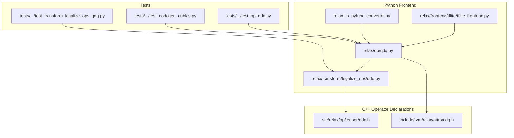
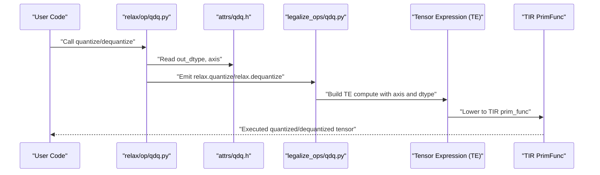
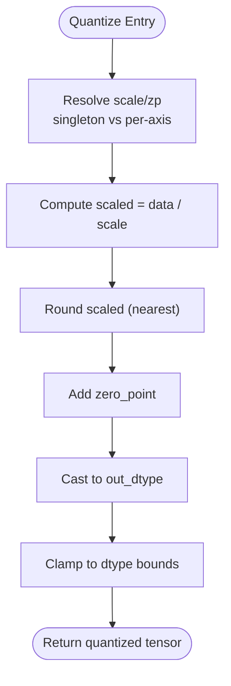
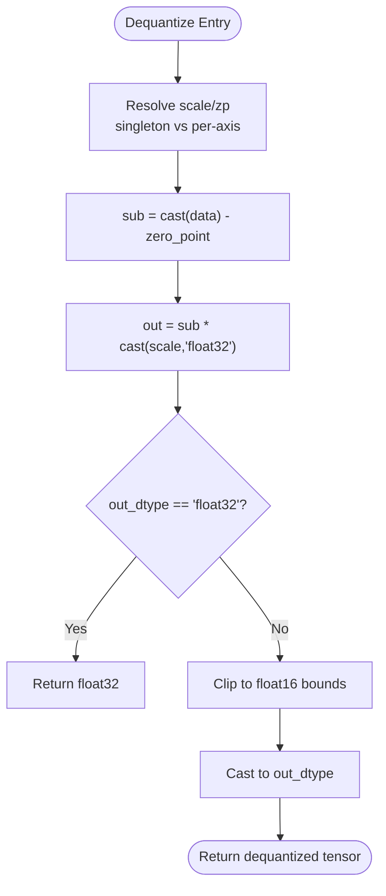
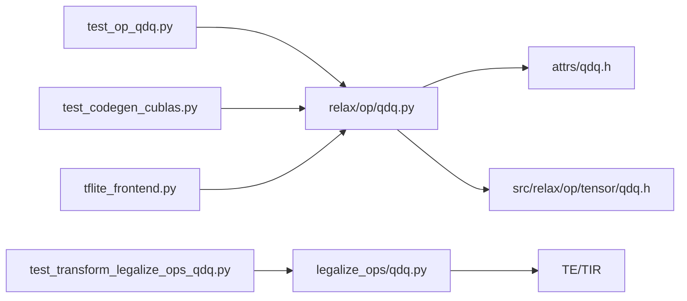

# Quantization and Dequantization Operations

<cite>
**Referenced Files in This Document**
- [python/tvm/relax/op/qdq.py](file://python/tvm/relax/op/qdq.py)
- [python/tvm/relax/transform/legalize_ops/qdq.py](file://python/tvm/relax/transform/legalize_ops/qdq.py)
- [src/relax/op/tensor/qdq.h](file://src/relax/op/tensor/qdq.h)
- [include/tvm/relax/attrs/qdq.h](file://include/tvm/relax/attrs/qdq.h)
- [tests/python/relax/test_op_qdq.py](file://tests/python/relax/test_op_qdq.py)
- [tests/python/relax/test_transform_legalize_ops_qdq.py](file://tests/python/relax/test_transform_legalize_ops_qdq.py)
- [python/tvm/relax/frontend/tflite/tflite_frontend.py](file://python/tvm/relax/frontend/tflite/tflite_frontend.py)
- [python/tvm/relax/relax_to_pyfunc_converter.py](file://python/tvm/relax/relax_to_pyfunc_converter.py)
- [tests/python/relax/test_codegen_cublas.py](file://tests/python/relax/test_codegen_cublas.py)
</cite>

## Table of Contents
1. [Introduction](#introduction)
2. [Project Structure](#project-structure)
3. [Core Components](#core-components)
4. [Architecture Overview](#architecture-overview)
5. [Detailed Component Analysis](#detailed-component-analysis)
6. [Dependency Analysis](#dependency-analysis)
7. [Performance Considerations](#performance-considerations)
8. [Troubleshooting Guide](#troubleshooting-guide)
9. [Conclusion](#conclusion)
10. [Appendices](#appendices)

## Introduction
This document explains Relax’s quantization and dequantization operations, focusing on tensor quantization, scale/zero-point encoding, symmetric/asymmetric quantization schemes, and mixed-precision computation. It covers operator signatures, quantization parameters, bit-width specifications, rounding modes, and how quantization integrates with training and deployment. Practical examples demonstrate model compression workflows, deployment optimization, and hardware-specific quantization formats. Numerical accuracy, dynamic range management, and performance implications are addressed throughout.

## Project Structure
The quantization stack in Relax spans Python front-end APIs, C++ operator declarations, TIR-based legalization, and end-to-end tests. The key locations are:
- Python operator definitions and documentation
- Legalization pass that lowers quantize/dequantize into TIR/TE primitives
- Attribute definitions for operator metadata
- Tests validating correctness and lowering behavior
- Frontend integrations for importing quantized models
- Approximate mapping to PyTorch-style quantization for compatibility

**Diagram sources**
- [python/tvm/relax/op/qdq.py:1-89](file://python/tvm/relax/op/qdq.py#L1-L89)
- [python/tvm/relax/transform/legalize_ops/qdq.py:1-161](file://python/tvm/relax/transform/legalize_ops/qdq.py#L1-L161)
- [src/relax/op/tensor/qdq.h:1-62](file://src/relax/op/tensor/qdq.h#L1-L62)
- [include/tvm/relax/attrs/qdq.h:1-53](file://include/tvm/relax/attrs/qdq.h#L1-L53)
- [tests/python/relax/test_op_qdq.py:1-68](file://tests/python/relax/test_op_qdq.py#L1-L68)
- [tests/python/relax/test_transform_legalize_ops_qdq.py:343-573](file://tests/python/relax/test_transform_legalize_ops_qdq.py#L343-L573)
- [tests/python/relax/test_codegen_cublas.py:101-135](file://tests/python/relax/test_codegen_cublas.py#L101-L135)
- [python/tvm/relax/frontend/tflite/tflite_frontend.py:547-578](file://python/tvm/relax/frontend/tflite/tflite_frontend.py#L547-L578)
- [python/tvm/relax/relax_to_pyfunc_converter.py:335-337](file://python/tvm/relax/relax_to_pyfunc_converter.py#L335-L337)

**Section sources**
- [python/tvm/relax/op/qdq.py:1-89](file://python/tvm/relax/op/qdq.py#L1-L89)
- [python/tvm/relax/transform/legalize_ops/qdq.py:1-161](file://python/tvm/relax/transform/legalize_ops/qdq.py#L1-L161)
- [src/relax/op/tensor/qdq.h:1-62](file://src/relax/op/tensor/qdq.h#L1-L62)
- [include/tvm/relax/attrs/qdq.h:1-53](file://include/tvm/relax/attrs/qdq.h#L1-L53)
- [tests/python/relax/test_op_qdq.py:1-68](file://tests/python/relax/test_op_qdq.py#L1-L68)
- [tests/python/relax/test_transform_legalize_ops_qdq.py:343-573](file://tests/python/relax/test_transform_legalize_ops_qdq.py#L343-L573)
- [tests/python/relax/test_codegen_cublas.py:101-135](file://tests/python/relax/test_codegen_cublas.py#L101-L135)
- [python/tvm/relax/frontend/tflite/tflite_frontend.py:547-578](file://python/tvm/relax/frontend/tflite/tflite_frontend.py#L547-L578)
- [python/tvm/relax/relax_to_pyfunc_converter.py:335-337](file://python/tvm/relax/relax_to_pyfunc_converter.py#L335-L337)

## Core Components
- Quantize operator: Converts float inputs to integer quantized tensors using per-tensor or per-channel scales and zero points, with configurable output dtype and channel axis.
- Dequantize operator: Converts quantized tensors back to float, with optional output dtype casting and clipping for low-precision targets.
- Attributes: Define operator metadata such as output dtype and channel axis for channel-wise quantization.
- Legalization pass: Lowers quantize/dequantize into TE compute stages and TIR buffers, handling singleton vs per-axis parameters and rounding behavior.
- Frontend integration: Imports quantized tensors and applies Relax quantize/dequantize ops consistently with model-level qnn parameters.
- Tests: Validate operator semantics, structural inference, lowering correctness, and end-to-end patterns like matmul followed by dequantize.

Key operator signatures and parameters:
- quantize(data: Expr, scale: Expr, zero_point: Expr, axis: int = -1, out_dtype: str = "int8")
- dequantize(data: Expr, scale: Expr, zero_point: Expr, axis: int = -1, out_dtype: str = "float32")

Rounding mode: Uses rounding to nearest (standard IEEE rounding) during quantization; dequantization uses floating-point arithmetic with optional clipping for low-precision outputs.

Bit-width specifications: The output dtype determines the quantized type (e.g., int8, uint8). Bit-width is implicitly defined by the chosen dtype.

Symmetric/asymmetric schemes: Zero point enables asymmetric quantization; setting zero point to zero yields symmetric quantization.

Mixed-precision computation: Dequantize supports float32 output by default and can cast/clamp to float16 for hardware-friendly mixed-precision pipelines.

**Section sources**
- [python/tvm/relax/op/qdq.py:23-88](file://python/tvm/relax/op/qdq.py#L23-L88)
- [include/tvm/relax/attrs/qdq.h:32-47](file://include/tvm/relax/attrs/qdq.h#L32-L47)
- [python/tvm/relax/transform/legalize_ops/qdq.py:51-160](file://python/tvm/relax/transform/legalize_ops/qdq.py#L51-L160)
- [tests/python/relax/test_op_qdq.py:24-68](file://tests/python/relax/test_op_qdq.py#L24-L68)

## Architecture Overview
The quantization pipeline in Relax follows a layered design:
- Python API exposes quantize and dequantize with documented parameters.
- Attributes define operator metadata (dtype and axis).
- Legalization lowers operators to TE/TIR, handling axis selection, singleton broadcasting, and rounding.
- Tests verify structural inference and lowering behavior.
- Frontends integrate quantized tensors from external frameworks.

**Diagram sources**
- [python/tvm/relax/op/qdq.py:23-88](file://python/tvm/relax/op/qdq.py#L23-L88)
- [include/tvm/relax/attrs/qdq.h:32-47](file://include/tvm/relax/attrs/qdq.h#L32-L47)
- [python/tvm/relax/transform/legalize_ops/qdq.py:51-160](file://python/tvm/relax/transform/legalize_ops/qdq.py#L51-L160)

## Detailed Component Analysis

### Quantize Operator
- Purpose: Map continuous float values to discrete integer bins using scale and zero point, with optional per-tensor or per-channel parameters.
- Formula: Quantized = clamp(round(input / scale) + zero_point, min, max), where dtype is determined by out_dtype.
- Axis semantics: axis selects the channel dimension for per-channel scale/zero_point arrays; defaults to the last axis.
- Rounding: Standard rounding to nearest; integer dtypes imply rounding prior to casting.
- Broadcasting: Singleton shapes are supported for scale/zero_point; otherwise indexing by axis is used.

**Diagram sources**
- [python/tvm/relax/transform/legalize_ops/qdq.py:60-95](file://python/tvm/relax/transform/legalize_ops/qdq.py#L60-L95)

**Section sources**
- [python/tvm/relax/op/qdq.py:23-53](file://python/tvm/relax/op/qdq.py#L23-L53)
- [python/tvm/relax/transform/legalize_ops/qdq.py:51-96](file://python/tvm/relax/transform/legalize_ops/qdq.py#L51-L96)
- [tests/python/relax/test_op_qdq.py:24-51](file://tests/python/relax/test_op_qdq.py#L24-L51)

### Dequantize Operator
- Purpose: Convert quantized integer tensors back to float, optionally casting/clipping to low-precision floats.
- Formula: Float = scale * (data - zero_point); compute performed in float32; optional clipping to float16 bounds when out_dtype is float16.
- Axis semantics: Same as quantize; per-channel scale/zero_point supported.
- Dtype handling: If input dtype is non-floating, intermediate arithmetic uses int32; float inputs use float32.

**Diagram sources**
- [python/tvm/relax/transform/legalize_ops/qdq.py:100-160](file://python/tvm/relax/transform/legalize_ops/qdq.py#L100-L160)

**Section sources**
- [python/tvm/relax/op/qdq.py:56-88](file://python/tvm/relax/op/qdq.py#L56-L88)
- [python/tvm/relax/transform/legalize_ops/qdq.py:98-160](file://python/tvm/relax/transform/legalize_ops/qdq.py#L98-L160)
- [tests/python/relax/test_transform_legalize_ops_qdq.py:343-373](file://tests/python/relax/test_transform_legalize_ops_qdq.py#L343-L373)
- [tests/python/relax/test_transform_legalize_ops_qdq.py:536-569](file://tests/python/relax/test_transform_legalize_ops_qdq.py#L536-L569)

### Attribute Definitions
- QuantizeAttrs: Encapsulates out_dtype and axis for quantize/dequantize.
- Default axis is -1 (last axis), enabling channel-wise quantization along the selected dimension.

**Section sources**
- [include/tvm/relax/attrs/qdq.h:32-47](file://include/tvm/relax/attrs/qdq.h#L32-L47)
- [src/relax/op/tensor/qdq.h:32-56](file://src/relax/op/tensor/qdq.h#L32-L56)

### Legalization and Lowering
- The pass emits TE.compute kernels that:
  - Select scale/zp by axis or broadcast singleton parameters
  - Apply rounding and clipping for quantization
  - Perform subtraction and multiplication for dequantization
  - Optionally clip and cast for low-precision outputs
- The lowering ensures TIR buffers and prim_func generation for execution.

**Section sources**
- [python/tvm/relax/transform/legalize_ops/qdq.py:29-49](file://python/tvm/relax/transform/legalize_ops/qdq.py#L29-L49)
- [python/tvm/relax/transform/legalize_ops/qdq.py:51-160](file://python/tvm/relax/transform/legalize_ops/qdq.py#L51-L160)

### Frontend Integration (TFLite)
- The TFLite frontend reads qnn parameters (scale and zero_point) and wraps expressions with Relax quantize/dequantize ops.
- It also demonstrates requantize patterns for weight/data scale composition in conv/matmul contexts.

**Section sources**
- [python/tvm/relax/frontend/tflite/tflite_frontend.py:547-578](file://python/tvm/relax/frontend/tflite/tflite_frontend.py#L547-L578)
- [python/tvm/relax/frontend/tflite/tflite_frontend.py:2187-2207](file://python/tvm/relax/frontend/tflite/tflite_frontend.py#L2187-L2207)

### Operator Signatures and Structural Inference
- Tests confirm operator identity and structural inference for quantize/dequantize with various shapes and dtypes, including symbolic shapes.

**Section sources**
- [tests/python/relax/test_op_qdq.py:24-68](file://tests/python/relax/test_op_qdq.py#L24-L68)

### End-to-End Examples
- Matmul followed by dequantize: Demonstrates mixed-precision pipeline where matmul produces int32 accumulators, then dequantize maps to float16 or float32.
- Dequantize lowering to TIR prim_func: Validates buffer reads/writes and arithmetic sequences.

**Section sources**
- [tests/python/relax/test_codegen_cublas.py:101-135](file://tests/python/relax/test_codegen_cublas.py#L101-L135)
- [tests/python/relax/test_transform_legalize_ops_qdq.py:343-373](file://tests/python/relax/test_transform_legalize_ops_qdq.py#L343-L373)
- [tests/python/relax/test_transform_legalize_ops_qdq.py:536-569](file://tests/python/relax/test_transform_legalize_ops_qdq.py#L536-L569)

## Dependency Analysis
- Python API depends on FFI bindings to C++ operator declarations.
- Legalization pass depends on TE/TIR utilities and attribute resolution.
- Tests depend on IR scripting and structural equality checks.
- Frontends depend on operator APIs to maintain consistency with external quantization parameters.

**Diagram sources**
- [python/tvm/relax/op/qdq.py:23-88](file://python/tvm/relax/op/qdq.py#L23-L88)
- [include/tvm/relax/attrs/qdq.h:32-47](file://include/tvm/relax/attrs/qdq.h#L32-L47)
- [src/relax/op/tensor/qdq.h:32-56](file://src/relax/op/tensor/qdq.h#L32-L56)
- [python/tvm/relax/transform/legalize_ops/qdq.py:51-160](file://python/tvm/relax/transform/legalize_ops/qdq.py#L51-L160)
- [tests/python/relax/test_op_qdq.py:24-68](file://tests/python/relax/test_op_qdq.py#L24-L68)
- [tests/python/relax/test_transform_legalize_ops_qdq.py:343-573](file://tests/python/relax/test_transform_legalize_ops_qdq.py#L343-L573)
- [tests/python/relax/test_codegen_cublas.py:101-135](file://tests/python/relax/test_codegen_cublas.py#L101-L135)
- [python/tvm/relax/frontend/tflite/tflite_frontend.py:547-578](file://python/tvm/relax/frontend/tflite/tflite_frontend.py#L547-L578)

**Section sources**
- [python/tvm/relax/op/qdq.py:23-88](file://python/tvm/relax/op/qdq.py#L23-L88)
- [python/tvm/relax/transform/legalize_ops/qdq.py:51-160](file://python/tvm/relax/transform/legalize_ops/qdq.py#L51-L160)
- [tests/python/relax/test_op_qdq.py:24-68](file://tests/python/relax/test_op_qdq.py#L24-L68)
- [tests/python/relax/test_transform_legalize_ops_qdq.py:343-573](file://tests/python/relax/test_transform_legalize_ops_qdq.py#L343-L573)
- [tests/python/relax/test_codegen_cublas.py:101-135](file://tests/python/relax/test_codegen_cublas.py#L101-L135)
- [python/tvm/relax/frontend/tflite/tflite_frontend.py:547-578](file://python/tvm/relax/frontend/tflite/tflite_frontend.py#L547-L578)

## Performance Considerations
- Quantization reduces memory bandwidth and storage requirements by packing activations/weights into narrower integer types.
- Dequantization introduces arithmetic overhead; batching and vectorization can mitigate costs.
- Mixed-precision dequantization (float16) reduces memory footprint further but requires careful clipping to avoid overflow.
- Channel-wise quantization adds indexing overhead; per-tensor quantization simplifies memory access patterns.
- Legalization generates efficient TE/TIR kernels; ensure axis alignment and contiguous layouts for optimal performance.

[No sources needed since this section provides general guidance]

## Troubleshooting Guide
Common issues and resolutions:
- Shape mismatches for per-channel scale/zero_point: Ensure axis matches the intended channel dimension; singleton shapes are broadcast automatically.
- Incorrect dtype casting: Verify out_dtype for quantize and out_dtype for dequantize; dequantize may require float32 intermediate arithmetic.
- Overflow/underflow in low-precision outputs: Use clipping to float16 bounds when out_dtype is float16.
- Structural inference failures: Confirm tensor shapes and dtypes match expectations; tests show correct behavior for static and symbolic shapes.

**Section sources**
- [tests/python/relax/test_op_qdq.py:33-68](file://tests/python/relax/test_op_qdq.py#L33-L68)
- [tests/python/relax/test_transform_legalize_ops_qdq.py:343-373](file://tests/python/relax/test_transform_legalize_ops_qdq.py#L343-L373)
- [tests/python/relax/test_transform_legalize_ops_qdq.py:536-569](file://tests/python/relax/test_transform_legalize_ops_qdq.py#L536-L569)

## Conclusion
Relax’s quantize and dequantize operators provide a flexible, attribute-driven interface for symmetric and asymmetric quantization with per-tensor and per-channel modes. The legalization pass lowers these operators into efficient TE/TIR computations, supporting mixed-precision pipelines and hardware-friendly formats. Integration with frontends ensures consistent handling of external quantization parameters. By combining these capabilities, practitioners can achieve significant model compression and deployment optimization while managing numerical accuracy and performance trade-offs.

[No sources needed since this section summarizes without analyzing specific files]

## Appendices

### Practical Workflows and Examples
- Post-training quantization: Import quantized tensors via frontends and wrap with Relax quantize/dequantize ops; validate structural inference and lowering.
- Mixed-precision inference: Use dequantize with float16 out_dtype to reduce memory bandwidth; ensure clipping and rounding are handled by the lowering pass.
- Calibration: Use representative datasets to compute per-channel scales and zero points; pass these parameters to quantize/dequantize ops.

[No sources needed since this section provides general guidance]