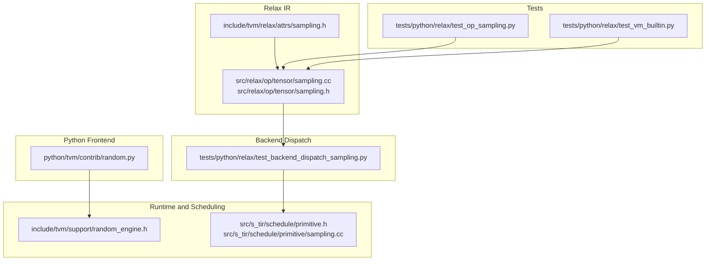
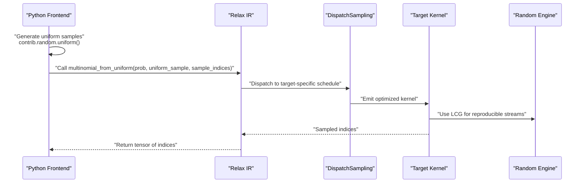
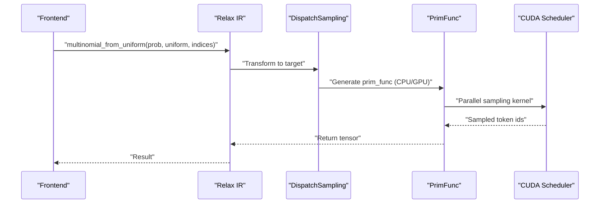
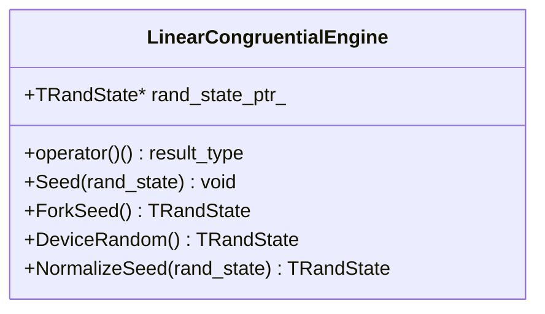
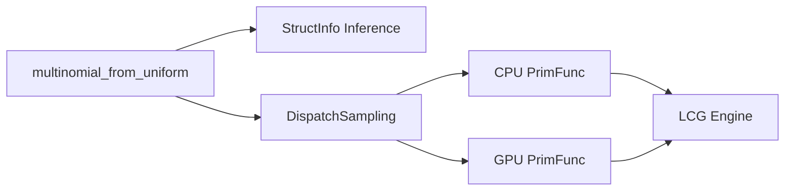

# Sampling Operations

<cite>
**Referenced Files in This Document**
- [sampling.h](file://include/tvm/relax/attrs/sampling.h)
- [sampling.cc](file://src/relax/op/tensor/sampling.cc)
- [sampling.h](file://src/relax/op/tensor/sampling.h)
- [random_engine.h](file://include/tvm/support/random_engine.h)
- [random.py](file://python/tvm/contrib/random.py)
- [test_backend_dispatch_sampling.py](file://tests/python/relax/test_backend_dispatch_sampling.py)
- [test_op_sampling.py](file://tests/python/relax/test_op_sampling.py)
- [primitive.h](file://src/s_tir/schedule/primitive.h)
- [sampling.cc](file://src/s_tir/schedule/primitive/sampling.cc)
- [test_vm_builtin.py](file://tests/python/relax/test_vm_builtin.py)
</cite>

## Table of Contents
1. [Introduction](#introduction)
2. [Project Structure](#project-structure)
3. [Core Components](#core-components)
4. [Architecture Overview](#architecture-overview)
5. [Detailed Component Analysis](#detailed-component-analysis)
6. [Dependency Analysis](#dependency-analysis)
7. [Performance Considerations](#performance-considerations)
8. [Troubleshooting Guide](#troubleshooting-guide)
9. [Conclusion](#conclusion)
10. [Appendices](#appendices)

## Introduction
This document explains Relax’s sampling operations with a focus on random sampling, probability distributions, Monte Carlo-style workflows, and stochastic computation primitives. It covers operator signatures, random seed management, distribution parameters, reproducibility, and backend dispatch. Practical examples demonstrate probabilistic modeling, reinforcement learning, and uncertainty quantification. Guidance is also provided on random number generation quality, parallel sampling, and performance optimization for stochastic workloads.

## Project Structure
Relax sampling spans several layers:
- Python frontend operators and helpers for random generation
- Relax operator definitions and structural inference
- Backend dispatch to target-specific kernels
- Low-level random engines and scheduling primitives
- Tests validating operator semantics and GPU dispatch

**Diagram sources**
- [sampling.cc:37-51](file://src/relax/op/tensor/sampling.cc#L37-L51)
- [sampling.h:34-52](file://src/relax/op/tensor/sampling.h#L34-L52)
- [sampling.h:32-44](file://include/tvm/relax/attrs/sampling.h#L32-L44)
- [random_engine.h:44-131](file://include/tvm/support/random_engine.h#L44-L131)
- [random.py:25-117](file://python/tvm/contrib/random.py#L25-L117)
- [test_backend_dispatch_sampling.py:30-80](file://tests/python/relax/test_backend_dispatch_sampling.py#L30-L80)
- [test_op_sampling.py:28-69](file://tests/python/relax/test_op_sampling.py#L28-L69)
- [test_vm_builtin.py:29-40](file://tests/python/relax/test_vm_builtin.py#L29-L40)
- [primitive.h:31-58](file://src/s_tir/schedule/primitive.h#L31-L58)
- [sampling.cc:436-469](file://src/s_tir/schedule/primitive/sampling.cc#L436-L469)

**Section sources**
- [sampling.cc:37-51](file://src/relax/op/tensor/sampling.cc#L37-L51)
- [sampling.h:34-52](file://src/relax/op/tensor/sampling.h#L34-L52)
- [sampling.h:32-44](file://include/tvm/relax/attrs/sampling.h#L32-L44)
- [random_engine.h:44-131](file://include/tvm/support/random_engine.h#L44-L131)
- [random.py:25-117](file://python/tvm/contrib/random.py#L25-L117)
- [test_backend_dispatch_sampling.py:30-80](file://tests/python/relax/test_backend_dispatch_sampling.py#L30-L80)
- [test_op_sampling.py:28-69](file://tests/python/relax/test_op_sampling.py#L28-L69)
- [test_vm_builtin.py:29-40](file://tests/python/relax/test_vm_builtin.py#L29-L40)
- [primitive.h:31-58](file://src/s_tir/schedule/primitive.h#L31-L58)
- [sampling.cc:436-469](file://src/s_tir/schedule/primitive/sampling.cc#L436-L469)

## Core Components
- Multinomial-from-uniform operator
  - Purpose: Convert uniform random variates into categorical samples from row-wise distributions.
  - Inputs:
    - prob: 2-D tensor of shape (batch, vocab_size) with non-negative values that sum to 1 per row.
    - uniform_sample: 2-D tensor of shape (n, 1) with values in [0, 1).
    - sample_indices: 2-D tensor of shape (n, 1) selecting which row of prob to sample from.
  - Output: Indices sampled from the distributions, with dtype configurable via operator attributes.
  - Operator registration and structural inference enforce shape and dtype constraints.

- Random number generation primitives
  - Linear congruential engine for deterministic seeding and reproducible streams.
  - Seeding normalization, forked seeds, and device-based initialization.
  - Sampling primitives for scheduling and primitive instructions.

- Python random helpers
  - Extern wrappers for uniform, normal, and discrete uniform random generation.
  - Integration with TIR extern calls for device-side RNG.

**Section sources**
- [sampling.cc:37-51](file://src/relax/op/tensor/sampling.cc#L37-L51)
- [sampling.cc:53-136](file://src/relax/op/tensor/sampling.cc#L53-L136)
- [sampling.h:34-52](file://src/relax/op/tensor/sampling.h#L34-L52)
- [sampling.h:32-44](file://include/tvm/relax/attrs/sampling.h#L32-L44)
- [random_engine.h:44-131](file://include/tvm/support/random_engine.h#L44-L131)
- [random.py:25-117](file://python/tvm/contrib/random.py#L25-L117)

## Architecture Overview
The sampling pipeline connects Python random generation, Relax IR operators, backend dispatch, and target-specific kernels.

**Diagram sources**
- [random.py:53-84](file://python/tvm/contrib/random.py#L53-L84)
- [sampling.cc:37-51](file://src/relax/op/tensor/sampling.cc#L37-L51)
- [test_backend_dispatch_sampling.py:44-80](file://tests/python/relax/test_backend_dispatch_sampling.py#L44-L80)
- [random_engine.h:44-131](file://include/tvm/support/random_engine.h#L44-L131)

## Detailed Component Analysis

### Multinomial-from-Uniform Operator
- Signature and semantics
  - Inputs: prob (batch, vocab), uniform_sample (n, 1), sample_indices (n, 1)
  - Output: indices with configurable dtype
  - Structural inference enforces:
    - prob and uniform_sample must be 2-D with float dtype
    - sample_indices must be 2-D with int dtype
    - Second dimension of uniform_sample and sample_indices must be 1
    - First dimension of uniform_sample and sample_indices must match output batch size
- Backend dispatch
  - CPU path: cumulative-sum followed by index lookup kernel
  - GPU path: vectorized, tiled cumulative comparison with shared/local buffers and thread-level aggregation

**Diagram sources**
- [test_backend_dispatch_sampling.py:67-74](file://tests/python/relax/test_backend_dispatch_sampling.py#L67-L74)
- [test_backend_dispatch_sampling.py:83-198](file://tests/python/relax/test_backend_dispatch_sampling.py#L83-L198)

**Section sources**
- [sampling.cc:37-51](file://src/relax/op/tensor/sampling.cc#L37-L51)
- [sampling.cc:53-136](file://src/relax/op/tensor/sampling.cc#L53-L136)
- [sampling.h:34-52](file://src/relax/op/tensor/sampling.h#L34-L52)
- [test_backend_dispatch_sampling.py:30-80](file://tests/python/relax/test_backend_dispatch_sampling.py#L30-L80)
- [test_backend_dispatch_sampling.py:83-198](file://tests/python/relax/test_backend_dispatch_sampling.py#L83-L198)

### Random Number Generation and Reproducibility
- Linear congruential engine
  - Provides a platform-independent generator compatible with standard distributions
  - Normalizes seeds, supports device-based initialization, and allows forked seeds for parallel streams
- Seeding and fork APIs
  - Seed accepts a normalized state pointer
  - ForkSeed derives new seeds deterministically from current state
- Usage in scheduling
  - Sampling primitives accept a random state pointer and operate purely

**Diagram sources**
- [random_engine.h:44-131](file://include/tvm/support/random_engine.h#L44-L131)

**Section sources**
- [random_engine.h:44-131](file://include/tvm/support/random_engine.h#L44-L131)
- [primitive.h:31-58](file://src/s_tir/schedule/primitive.h#L31-L58)
- [sampling.cc:436-469](file://src/s_tir/schedule/primitive/sampling.cc#L436-L469)

### Python Random Helpers
- Uniform, normal, and discrete uniform generators exposed via extern calls
- Integrates with TIR packed calls for device-side generation
- Useful for Monte Carlo simulations and stochastic preprocessing

**Section sources**
- [random.py:25-117](file://python/tvm/contrib/random.py#L25-L117)

### VM Builtin Integration
- The virtual machine exposes a builtin for multinomial sampling
- Enables direct invocation from compiled Relax functions

**Section sources**
- [test_vm_builtin.py:29-40](file://tests/python/relax/test_vm_builtin.py#L29-L40)

## Dependency Analysis
- Operator-to-backend mapping
  - Relax operator delegates to DispatchSampling for target-specific lowering
  - CPU and GPU schedules differ in memory access and threading model
- Structural inference
  - Enforces tensor shapes and dtypes for safety and correctness
- Runtime dependencies
  - RNG engine is used by scheduling primitives and kernels

**Diagram sources**
- [sampling.cc:53-136](file://src/relax/op/tensor/sampling.cc#L53-L136)
- [test_backend_dispatch_sampling.py:44-80](file://tests/python/relax/test_backend_dispatch_sampling.py#L44-L80)
- [random_engine.h:44-131](file://include/tvm/support/random_engine.h#L44-L131)

**Section sources**
- [sampling.cc:53-136](file://src/relax/op/tensor/sampling.cc#L53-L136)
- [test_backend_dispatch_sampling.py:44-80](file://tests/python/relax/test_backend_dispatch_sampling.py#L44-L80)
- [random_engine.h:44-131](file://include/tvm/support/random_engine.h#L44-L131)

## Performance Considerations
- Parallel sampling
  - GPU kernel uses tiled access and shared memory to reduce divergence and improve throughput
  - Thread-level aggregation and vectorized reads accelerate cumulative comparisons
- Memory access patterns
  - Row-wise access and coalesced reads improve bandwidth utilization
- Determinism vs. parallelism
  - Forked seeds enable independent streams across threads or tasks
- Monte Carlo optimization
  - Precompute cumulative distributions and reuse buffers when sampling many times from the same distribution

[No sources needed since this section provides general guidance]

## Troubleshooting Guide
- Shape and dtype mismatches
  - Ensure prob and uniform_sample are 2-D with float dtype; sample_indices is 2-D with int dtype
  - Verify second dimension is 1 and first dimensions match expected batch sizes
- Structural inference failures
  - Check tensor ranks and shapes against operator constraints
- Backend dispatch differences
  - CPU and GPU schedules may differ; confirm target selection and schedule rules
- Reproducibility issues
  - Initialize RNG with a fixed seed and avoid negative seeds
  - Use ForkSeed to derive child streams for parallel tasks

**Section sources**
- [sampling.cc:53-136](file://src/relax/op/tensor/sampling.cc#L53-L136)
- [test_op_sampling.py:28-69](file://tests/python/relax/test_op_sampling.py#L28-L69)
- [random_engine.h:85-98](file://include/tvm/support/random_engine.h#L85-L98)

## Conclusion
Relax’s sampling stack integrates structured IR operators, backend dispatch, and robust random generation primitives. The multinomial-from-uniform operator provides a flexible foundation for probabilistic modeling and reinforcement learning, while the RNG engine ensures reproducibility. Target-specific kernels enable efficient parallel sampling, and structural inference guards correctness. Together, these components support Monte Carlo workflows, uncertainty quantification, and scalable stochastic computation.

[No sources needed since this section summarizes without analyzing specific files]

## Appendices

### Practical Examples Index
- Probabilistic modeling
  - Use multinomial sampling to draw tokens from a language model’s output distribution
- Reinforcement learning
  - Sample actions from policy distributions in environments with discrete action spaces
- Uncertainty quantification
  - Monte Carlo dropout or ensemble sampling via repeated draws from stochastic layers

[No sources needed since this section provides general guidance]