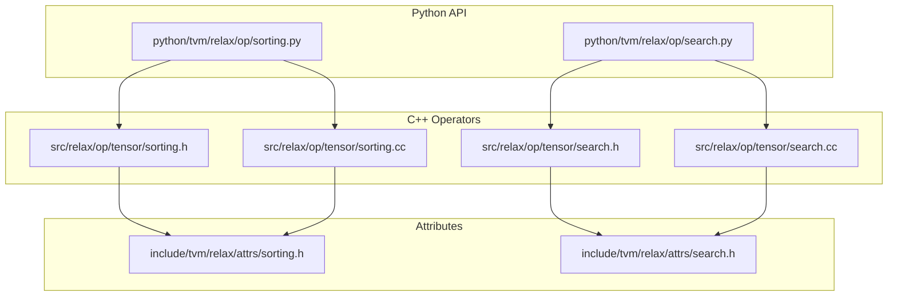
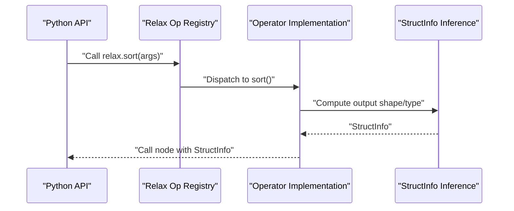
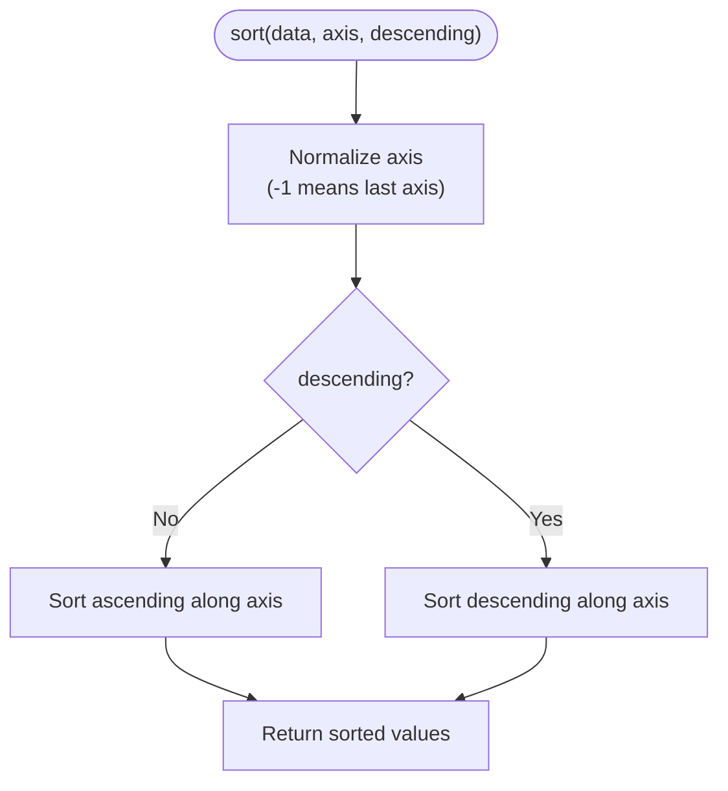
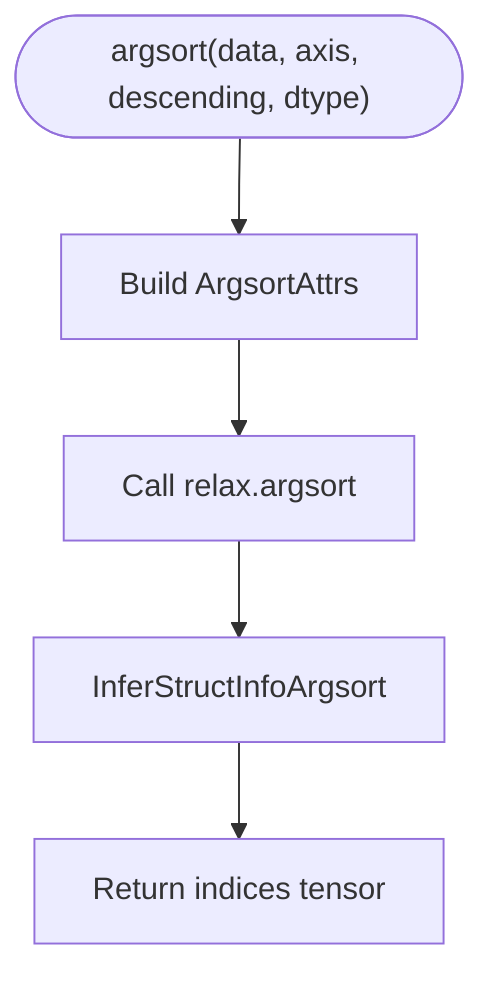
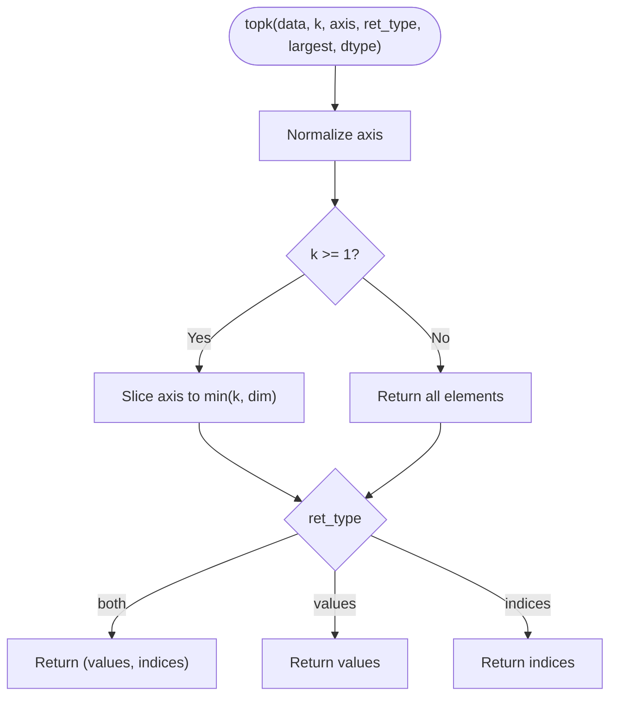
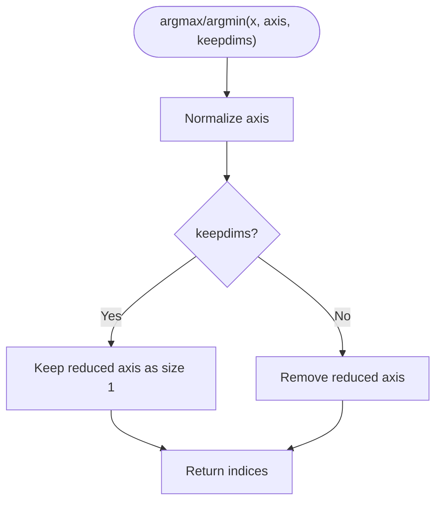
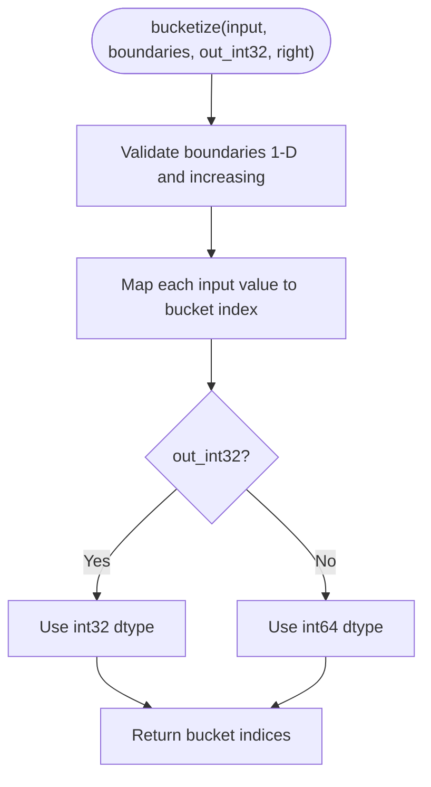
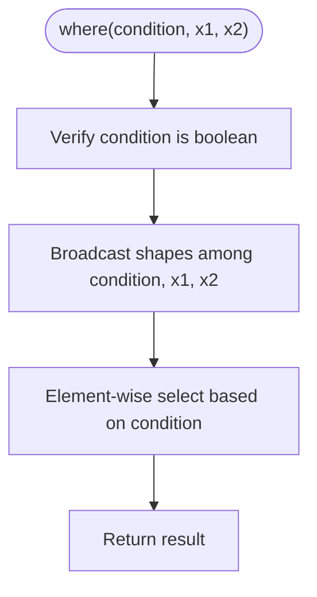
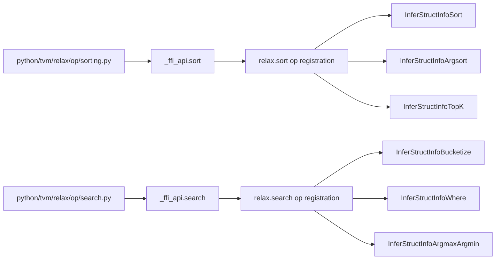

# Sorting and Search Operations

<cite>
**Referenced Files in This Document**
- [sorting.h](file://include/tvm/relax/attrs/sorting.h)
- [search.h](file://include/tvm/relax/attrs/search.h)
- [sorting.h](file://src/relax/op/tensor/sorting.h)
- [sorting.cc](file://src/relax/op/tensor/sorting.cc)
- [search.h](file://src/relax/op/tensor/search.h)
- [search.cc](file://src/relax/op/tensor/search.cc)
- [sorting.py](file://python/tvm/relax/op/sorting.py)
- [search.py](file://python/tvm/relax/op/search.py)
- [test_op_sort.py](file://tests/python/relax/test_op_sort.py)
- [test_op_search.py](file://tests/python/relax/test_op_search.py)
- [test_tvmscript_parser_op_sort.py](file://tests/python/relax/test_tvmscript_parser_op_sort.py)
- [test_tvmscript_parser_op_search.py](file://tests/python/relax/test_tvmscript_parser_op_search.py)
</cite>

## Table of Contents
1. [Introduction](#introduction)
2. [Project Structure](#project-structure)
3. [Core Components](#core-components)
4. [Architecture Overview](#architecture-overview)
5. [Detailed Component Analysis](#detailed-component-analysis)
6. [Dependency Analysis](#dependency-analysis)
7. [Performance Considerations](#performance-considerations)
8. [Troubleshooting Guide](#troubleshooting-guide)
9. [Conclusion](#conclusion)
10. [Appendices](#appendices)

## Introduction
This document explains Relax’s sorting and search operations: sort, argsort, top-k, argmax/argmin, bucketize, and where. It covers operator signatures, axis semantics, ordering (ascending/descending), return types, and structural inference behavior. It also clarifies comparison criteria, stability guarantees, and performance characteristics as implemented in the codebase. Practical examples demonstrate data preprocessing, ranking computations, and efficient search implementations.

## Project Structure
Relax sorting and search operators are defined in C++ and exposed via Python bindings. The core definition and attributes live in header files, while operator registration and structural inference are implemented in C++. Python wrappers provide ergonomic APIs.

**Diagram sources**
- [sorting.h:27-68](file://src/relax/op/tensor/sorting.h#L27-L68)
- [sorting.cc:34-66](file://src/relax/op/tensor/sorting.cc#L34-L66)
- [search.h:27-56](file://src/relax/op/tensor/search.h#L27-L56)
- [search.cc:35-88](file://src/relax/op/tensor/search.cc#L35-L88)
- [sorting.h:34-104](file://include/tvm/relax/attrs/sorting.h#L34-L104)
- [search.h:33-65](file://include/tvm/relax/attrs/search.h#L33-L65)

**Section sources**
- [sorting.h:27-68](file://src/relax/op/tensor/sorting.h#L27-L68)
- [sorting.cc:34-66](file://src/relax/op/tensor/sorting.cc#L34-L66)
- [search.h:27-56](file://src/relax/op/tensor/search.h#L27-L56)
- [search.cc:35-88](file://src/relax/op/tensor/search.cc#L35-L88)
- [sorting.h:34-104](file://include/tvm/relax/attrs/sorting.h#L34-L104)
- [search.h:33-65](file://include/tvm/relax/attrs/search.h#L33-L65)

## Core Components
- Sort: Returns values sorted along a specified axis (ascending or descending).
- Argsort: Returns indices that would sort the input along a specified axis.
- Top-K: Returns the k largest/smallest elements along an axis, optionally returning values, indices, or both.
- Argmax/Argmin: Returns indices of the maximum/minimum elements along an axis, with optional reduction to keep dims.
- Bucketize: Assigns each input value to a bucket based on strictly increasing boundaries, with configurable output dtype and boundary behavior.
- Where: Element-wise selection based on a boolean condition.

Key behavioral notes:
- Axis normalization supports negative indices.
- Structural inference preserves shapes and dtypes according to attributes and input shapes.
- Indices are integer-valued; default index dtype is inferred from attributes or falls back to a default.

**Section sources**
- [sorting.h:44-66](file://src/relax/op/tensor/sorting.h#L44-L66)
- [sorting.cc:42-113](file://src/relax/op/tensor/sorting.cc#L42-L113)
- [search.h:42-54](file://src/relax/op/tensor/search.h#L42-L54)
- [search.cc:42-94](file://src/relax/op/tensor/search.cc#L42-L94)
- [sorting.h:34-104](file://include/tvm/relax/attrs/sorting.h#L34-L104)
- [search.h:33-65](file://include/tvm/relax/attrs/search.h#L33-L65)

## Architecture Overview
The operators are registered as Relax ops with FInferStructInfo implementations. Python wrappers delegate to the underlying C++ API.

**Diagram sources**
- [sorting.cc:60-66](file://src/relax/op/tensor/sorting.cc#L60-L66)
- [sorting.cc:84-92](file://src/relax/op/tensor/sorting.cc#L84-L92)
- [search.cc:80-88](file://src/relax/op/tensor/search.cc#L80-L88)
- [search.cc:191-248](file://src/relax/op/tensor/search.cc#L191-L248)

## Detailed Component Analysis

### Sort Operator
- Purpose: Sort values along a given axis.
- Signature: sort(x: Expr, axis: int = -1, descending: bool = False) -> Expr
- Behavior:
  - Axis defaults to the last axis if not specified.
  - Values are sorted in ascending order by default; descending toggles order.
  - Output shape matches input shape.
- Structural inference: Preserves input tensor struct info.

**Diagram sources**
- [sorting.cc:56-58](file://src/relax/op/tensor/sorting.cc#L56-L58)
- [sorting.cc:60-66](file://src/relax/op/tensor/sorting.cc#L60-L66)

**Section sources**
- [sorting.h:44-44](file://src/relax/op/tensor/sorting.h#L44-L44)
- [sorting.cc:42-49](file://src/relax/op/tensor/sorting.cc#L42-L49)
- [sorting.cc:56-58](file://src/relax/op/tensor/sorting.cc#L56-L58)
- [sorting.py:23-45](file://python/tvm/relax/op/sorting.py#L23-L45)

### Argsort Operator
- Purpose: Return indices that sort the input along a given axis.
- Signature: argsort(data: Expr, axis: int = -1, descending: bool = False, dtype: str = "int32") -> Expr
- Behavior:
  - Returns integer indices with the same shape as the input.
  - Index dtype can be specified; otherwise inferred from attributes or defaults.
- Structural inference: Produces integer indices with input shape and inferred dtype.

**Diagram sources**
- [sorting.cc:69-77](file://src/relax/op/tensor/sorting.cc#L69-L77)
- [sorting.cc:84-92](file://src/relax/op/tensor/sorting.cc#L84-L92)

**Section sources**
- [sorting.h:54-54](file://src/relax/op/tensor/sorting.h#L54-L54)
- [sorting.cc:69-92](file://src/relax/op/tensor/sorting.cc#L69-L92)
- [sorting.py:48-71](file://python/tvm/relax/op/sorting.py#L48-L71)

### Top-K Operator
- Purpose: Extract the k largest or smallest elements along an axis.
- Signature: topk(data: Expr, k: int, axis: int = -1, ret_type: str = "both", largest: bool = True, dtype: str = "int32") -> Expr | List[Expr]
- Behavior:
  - ret_type supports "both", "values", "indices".
  - If k < 1, returns all elements along the axis.
  - Output shape replaces the selected axis with min(k, dim) when the dimension is known.
- Structural inference: Builds tuple or single struct info depending on ret_type.

**Diagram sources**
- [sorting.cc:120-160](file://src/relax/op/tensor/sorting.cc#L120-L160)

**Section sources**
- [sorting.h:66-66](file://src/relax/op/tensor/sorting.h#L66-L66)
- [sorting.cc:103-167](file://src/relax/op/tensor/sorting.cc#L103-L167)
- [sorting.py:74-117](file://python/tvm/relax/op/sorting.py#L74-L117)

### Argmax and Argmin
- Purpose: Compute indices of max/min elements along an axis.
- Signatures:
  - argmax(x: Expr, axis: Optional[int] = None, keepdims: bool = False) -> Expr
  - argmin(x: Expr, axis: Optional[int] = None, keepdims: bool = False) -> Expr
- Behavior:
  - axis=None reduces all elements; negative axis normalization supported.
  - keepdims retains the reduced axis with size 1 when true.
  - Output dtype is integer (default 64-bit).

**Diagram sources**
- [search.cc:191-248](file://src/relax/op/tensor/search.cc#L191-L248)

**Section sources**
- [search.h:51-54](file://src/relax/op/tensor/search.h#L51-L54)
- [search.cc:250-268](file://src/relax/op/tensor/search.cc#L250-L268)
- [search.py:54-103](file://python/tvm/relax/op/search.py#L54-L103)

### Bucketize
- Purpose: Assign each input value to a bucket based on strictly increasing boundaries.
- Signature: bucketize(input_tensor: Expr, boundaries: Expr, out_int32: bool = False, right: bool = False) -> Expr
- Behavior:
  - boundaries must be 1-D and strictly increasing; undefined behavior otherwise.
  - Output shape matches input_tensor.
  - out_int32 selects int32; otherwise int64.
  - right controls boundary inclusion behavior similar to torch.bucketize.

**Diagram sources**
- [search.cc:55-78](file://src/relax/op/tensor/search.cc#L55-L78)
- [search.cc:80-88](file://src/relax/op/tensor/search.cc#L80-L88)

**Section sources**
- [search.h:42-42](file://src/relax/op/tensor/search.h#L42-L42)
- [search.cc:42-88](file://src/relax/op/tensor/search.cc#L42-L88)
- [search.py:106-128](file://python/tvm/relax/op/search.py#L106-L128)

### Where
- Purpose: Element-wise selection based on a boolean condition.
- Signature: where(condition: Expr, x1: Expr, x2: Expr) -> Expr
- Behavior:
  - condition must be boolean and broadcast-compatible with x1 and x2.
  - Returns a broadcasted shape with element-wise selection.

**Diagram sources**
- [search.cc:101-179](file://src/relax/op/tensor/search.cc#L101-L179)
- [search.cc:181-187](file://src/relax/op/tensor/search.cc#L181-L187)

**Section sources**
- [search.h:48-48](file://src/relax/op/tensor/search.h#L48-L48)
- [search.cc:91-187](file://src/relax/op/tensor/search.cc#L91-L187)
- [search.py:24-51](file://python/tvm/relax/op/search.py#L24-L51)

## Dependency Analysis
- Python bindings delegate to the C++ FFI API.
- Operators register attributes and structural inference functions.
- Tests validate operator semantics and structural inference.

**Diagram sources**
- [sorting.cc:60-66](file://src/relax/op/tensor/sorting.cc#L60-L66)
- [sorting.cc:94-99](file://src/relax/op/tensor/sorting.cc#L94-L99)
- [sorting.cc:162-167](file://src/relax/op/tensor/sorting.cc#L162-L167)
- [search.cc:80-88](file://src/relax/op/tensor/search.cc#L80-L88)
- [search.cc:181-187](file://src/relax/op/tensor/search.cc#L181-L187)
- [search.cc:191-248](file://src/relax/op/tensor/search.cc#L191-L248)

**Section sources**
- [sorting.py:23-45](file://python/tvm/relax/op/sorting.py#L23-L45)
- [search.py:24-51](file://python/tvm/relax/op/search.py#L24-L51)
- [sorting.cc:60-167](file://src/relax/op/tensor/sorting.cc#L60-L167)
- [search.cc:80-248](file://src/relax/op/tensor/search.cc#L80-L248)

## Performance Considerations
- Complexity:
  - sort, argsort, and top-k operate along a single axis and generally scale with O(n log n) per slice for comparison-based sorts, where n is the size of the sorted dimension.
  - top-k with largest=True effectively computes a selection of the k largest elements; when k is small compared to n, this can be significantly cheaper than full sort.
- Memory and data movement:
  - argsort allocates index arrays equal to the input size; consider dtype choices to reduce memory footprint.
  - top-k with ret_type="indices" returns indices only, avoiding value copies when combined with advanced indexing.
- Numerical precision:
  - Comparison relies on the underlying tensor dtype’s ordering. Floating-point comparisons are exact for finite values; special cases like NaN ordering depend on the backend’s implementation.
- Stability:
  - The codebase does not declare explicit stability guarantees for sort or argsort. For applications requiring stable sorting, ensure downstream consumers handle ties consistently or use frameworks that provide stable sorts.
- Backend dispatch:
  - Actual kernel implementations are backend-specific; performance varies by device and library backends.

[No sources needed since this section provides general guidance]

## Troubleshooting Guide
Common issues and resolutions:
- Invalid axis:
  - Ensure axis is within [-ndim, ndim - 1]; negative indices are normalized internally.
- Argmax/Argmin keepdims:
  - When keepdims is True, the reduced axis remains with size 1; confirm broadcasting expectations.
- Top-k ret_type:
  - Verify ret_type is one of "both", "values", "indices"; invalid values raise an internal error during inference.
- Bucketize boundaries:
  - Boundaries must be strictly increasing; otherwise behavior is undefined.
- Where condition dtype:
  - Condition must be boolean; otherwise a structural inference error is reported.

**Section sources**
- [sorting.cc:151-159](file://src/relax/op/tensor/sorting.cc#L151-L159)
- [search.cc:60-64](file://src/relax/op/tensor/search.cc#L60-L64)
- [search.cc:122-127](file://src/relax/op/tensor/search.cc#L122-L127)

## Conclusion
Relax provides a comprehensive set of sorting and search primitives suitable for ranking, retrieval, and data preprocessing tasks. Operators support flexible axis semantics, configurable ordering, and robust structural inference. For performance-sensitive scenarios, prefer top-k over full sort when k is small, and carefully choose index dtypes to balance memory and precision.

[No sources needed since this section summarizes without analyzing specific files]

## Appendices

### Practical Examples and Usage Patterns
- Data preprocessing:
  - Normalize values by sorting along a feature axis, then compute ranks via argsort.
  - Use bucketize to discretize continuous features into bins aligned with learned boundaries.
- Ranking computations:
  - Compute argmax/argmin to locate extreme values; combine with advanced indexing to extract top-k results.
  - Use top-k with ret_type="indices" to obtain ranked positions efficiently.
- Efficient search:
  - Use where to mask or fuse branches based on boolean conditions; ensure broadcast compatibility.

[No sources needed since this section provides general guidance]

### API Reference Summary
- sort(x, axis=-1, descending=False)
- argsort(data, axis=-1, descending=False, dtype="int32")
- topk(data, k, axis=-1, ret_type="both", largest=True, dtype="int32")
- argmax(x, axis=None, keepdims=False)
- argmin(x, axis=None, keepdims=False)
- bucketize(input_tensor, boundaries, out_int32=False, right=False)
- where(condition, x1, x2)

**Section sources**
- [sorting.py:23-117](file://python/tvm/relax/op/sorting.py#L23-L117)
- [search.py:24-128](file://python/tvm/relax/op/search.py#L24-L128)

### Test References
- Sorting tests: [test_op_sort.py](file://tests/python/relax/test_op_sort.py)
- Search tests: [test_op_search.py](file://tests/python/relax/test_op_search.py)
- TVMScript parser tests for sorting and search: [test_tvmscript_parser_op_sort.py](file://tests/python/relax/test_tvmscript_parser_op_sort.py), [test_tvmscript_parser_op_search.py](file://tests/python/relax/test_tvmscript_parser_op_search.py)

**Section sources**
- [test_op_sort.py](file://tests/python/relax/test_op_sort.py)
- [test_op_search.py](file://tests/python/relax/test_op_search.py)
- [test_tvmscript_parser_op_sort.py](file://tests/python/relax/test_tvmscript_parser_op_sort.py)
- [test_tvmscript_parser_op_search.py](file://tests/python/relax/test_tvmscript_parser_op_search.py)