# Specialized Operations

<cite>
**Referenced Files in This Document**
- [op.cc](file://src/relax/op/op.cc)
- [op.h](file://include/tvm/relax/attrs/op.h)
- [binary.cc](file://src/relax/op/tensor/binary.cc)
- [create.cc](file://src/relax/op/tensor/create.cc)
- [manipulate.cc](file://src/relax/op/tensor/manipulate.cc)
- [index.cc](file://src/relax/op/tensor/index.cc)
- [datatype.cc](file://src/relax/op/tensor/datatype.cc)
- [unary.cc](file://src/relax/op/tensor/unary.cc)
- [backend.h](file://include/tvm/relax/backend.h)
- [vm.cc](file://src/runtime/vm/vm.cc)
- [relax_to_pyfunc_converter.py](file://python/tvm/relax/relax_to_pyfunc_converter.py)
- [test_frontend_from_fx.py](file://tests/python/relax/test_frontend_from_fx.py)
- [test_frontend_from_exported_program.py](file://tests/python/relax/test_frontend_from_exported_program.py)
</cite>

## Table of Contents
1. [Introduction](#introduction)
2. [Project Structure](#project-structure)
3. [Core Components](#core-components)
4. [Architecture Overview](#architecture-overview)
5. [Detailed Component Analysis](#detailed-component-analysis)
6. [Dependency Analysis](#dependency-analysis)
7. [Performance Considerations](#performance-considerations)
8. [Troubleshooting Guide](#troubleshooting-guide)
9. [Conclusion](#conclusion)
10. [Appendices](#appendices)

## Introduction
This document explains Relax’s specialized operations across multiple domains: binary/ternary arithmetic and logical operations, tensor creation utilities, shape manipulation primitives, indexing operations, data type conversions, boolean checks, gradient computation, collective communication, distributed computing, and virtual machine operations. It covers operator signatures, broadcasting rules, indexing semantics, execution contexts, use cases, performance considerations, and integration patterns. Practical examples are provided via references to tests and converters that demonstrate advanced tensor manipulation, custom operator development, and distributed workflows.

## Project Structure
Relax’s specialized operations are implemented as typed operators registered in the Relax IR, with structured inference and validation logic. The core lives under:
- src/relax/op/tensor: operator families (binary, create, manipulate, index, datatype, unary)
- src/relax/op/op.cc: foundational operators like call_tir, call_tir_with_grad, call_tir_inplace, call_pure_packed, call_inplace_packed
- include/tvm/relax/attrs/op.h: attributes for call_tir variants and device hints
- include/tvm/relax/backend.h: backend lowering passes for runtime integration
- src/runtime/vm/vm.cc: virtual machine execution and bytecode interpretation
- python/tvm/relax/relax_to_pyfunc_converter.py: mapping Relax ops to PyTorch equivalents for interoperability
- tests/python/relax: extensive tests validating operator semantics and broadcasting

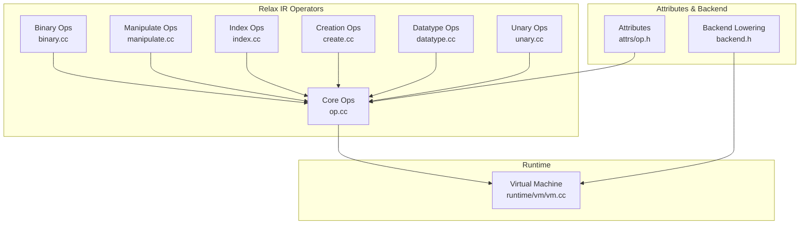

**Diagram sources**
- [binary.cc:196-238](file://src/relax/op/tensor/binary.cc#L196-L238)
- [manipulate.cc:61-140](file://src/relax/op/tensor/manipulate.cc#L61-L140)
- [index.cc:45-136](file://src/relax/op/tensor/index.cc#L45-L136)
- [create.cc:45-101](file://src/relax/op/tensor/create.cc#L45-L101)
- [datatype.cc:39-70](file://src/relax/op/tensor/datatype.cc#L39-L70)
- [unary.cc:39-103](file://src/relax/op/tensor/unary.cc#L39-L103)
- [op.cc:259-620](file://src/relax/op/op/op.cc#L259-L620)
- [op.h:33-69](file://include/tvm/relax/attrs/op.h#L33-L69)
- [backend.h:34-45](file://include/tvm/relax/backend.h#L34-L45)
- [vm.cc:187-455](file://src/runtime/vm/vm.cc#L187-L455)

**Section sources**
- [binary.cc:196-238](file://src/relax/op/tensor/binary.cc#L196-L238)
- [manipulate.cc:61-140](file://src/relax/op/tensor/manipulate.cc#L61-L140)
- [index.cc:45-136](file://src/relax/op/tensor/index.cc#L45-L136)
- [create.cc:45-101](file://src/relax/op/tensor/create.cc#L45-L101)
- [datatype.cc:39-70](file://src/relax/op/tensor/datatype.cc#L39-L70)
- [unary.cc:39-103](file://src/relax/op/tensor/unary.cc#L39-L103)
- [op.cc:259-620](file://src/relax/op/op/op.cc#L259-L620)
- [op.h:33-69](file://include/tvm/relax/attrs/op.h#L33-L69)
- [backend.h:34-45](file://include/tvm/relax/backend.h#L34-L45)
- [vm.cc:187-455](file://src/runtime/vm/vm.cc#L187-L455)

## Core Components
- Binary broadcast operators: arithmetic, comparison, logical/bitwise, minimum/maximum. Broadcasting follows standard rules with dtype promotion and shape inference.
- Tensor creation: full/full_like, ones/ones_like, zeros/zeros_like, eye/eye_like, arange, Hamming window, tril/triu.
- Shape manipulation: broadcast_to, concat, expand_dims, flatten, index_tensor, layout_transform, permute_dims, reshape-like transforms.
- Indexing: take, strided_slice, dynamic_strided_slice.
- Data type conversion: astype, wrap_param.
- Boolean checks: isfinite, isinf, isnan.
- Gradient computation: call_tir_with_grad.
- Collective communication and distributed: call_tir variants and distributed lowering.
- Virtual machine: bytecode execution, closure handling, device conversion, and backend lowering.

**Section sources**
- [binary.cc:134-143](file://src/relax/op/tensor/binary.cc#L134-L143)
- [create.cc:45-101](file://src/relax/op/tensor/create.cc#L45-L101)
- [manipulate.cc:61-140](file://src/relax/op/tensor/manipulate.cc#L61-L140)
- [index.cc:45-136](file://src/relax/op/tensor/index.cc#L45-L136)
- [datatype.cc:39-70](file://src/relax/op/tensor/datatype.cc#L39-L70)
- [unary.cc:39-103](file://src/relax/op/tensor/unary.cc#L39-L103)
- [op.cc:621-672](file://src/relax/op/op/op.cc#L621-L672)
- [op.h:33-69](file://include/tvm/relax/attrs/op.h#L33-L69)
- [backend.h:34-45](file://include/tvm/relax/backend.h#L34-L45)
- [vm.cc:187-455](file://src/runtime/vm/vm.cc#L187-L455)

## Architecture Overview
Relax operators are registered with structured inference and validation. Core operators like call_tir, call_tir_with_grad, and call_tir_inplace bridge Relax expressions to TIR PrimFuncs and enable gradient computation and in-place mutation. Backend lowering maps these to VM builtins and shape handling. The VM executes bytecode with device-aware argument conversion and closure management.

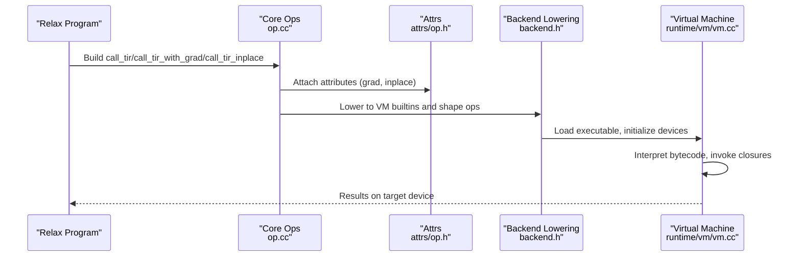

**Diagram sources**
- [op.cc:259-620](file://src/relax/op/op/op.cc#L259-L620)
- [op.h:33-69](file://include/tvm/relax/attrs/op.h#L33-L69)
- [backend.h:34-45](file://include/tvm/relax/backend.h#L34-L45)
- [vm.cc:187-455](file://src/runtime/vm/vm.cc#L187-L455)

**Section sources**
- [op.cc:259-620](file://src/relax/op/op/op.cc#L259-L620)
- [op.h:33-69](file://include/tvm/relax/attrs/op.h#L33-L69)
- [backend.h:34-45](file://include/tvm/relax/backend.h#L34-L45)
- [vm.cc:187-455](file://src/runtime/vm/vm.cc#L187-L455)

## Detailed Component Analysis

### Binary Broadcast Operations
- Purpose: Element-wise arithmetic, comparison, logical/bitwise, min/max across tensors with broadcasting.
- Broadcasting rules:
  - Axes align from the right; dimensions of size 1 can be broadcast.
  - Unknown shapes or mismatched non-broadcastable dims cause validation errors.
  - Dtype promotion follows arithmetic precedence; comparisons yield bool.
- StructInfo inference:
  - Computes output dtype, ndim as max of inputs, and shape via broadcast.
  - Propagates VDevice when present.
- Use cases: Neural network layers, loss computation, masking, and tensor composition.

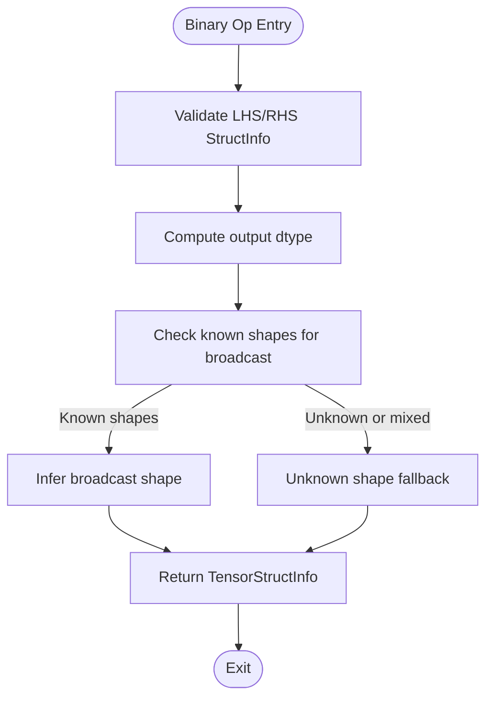

**Diagram sources**
- [binary.cc:32-132](file://src/relax/op/tensor/binary.cc#L32-L132)

**Section sources**
- [binary.cc:32-132](file://src/relax/op/tensor/binary.cc#L32-L132)
- [binary.cc:196-238](file://src/relax/op/tensor/binary.cc#L196-L238)

### Tensor Creation Utilities
- full/full_like: Create tensors filled with a scalar value; dtype can be overridden.
- ones/ones_like, zeros/zeros_like: Fill with 1 or 0; dtype required for creation, optional for like variants.
- eye/eye_like: Identity-like matrices; supports diagonal offset k.
- arange: Range with start/stop/step; computes output length based on inputs.
- Hamming window: Creates window tensor with float dtype constraints.
- tril/triu: Extract lower/upper triangular parts with offset k.
- StructInfo inference validates inputs and propagates dtype and shape.

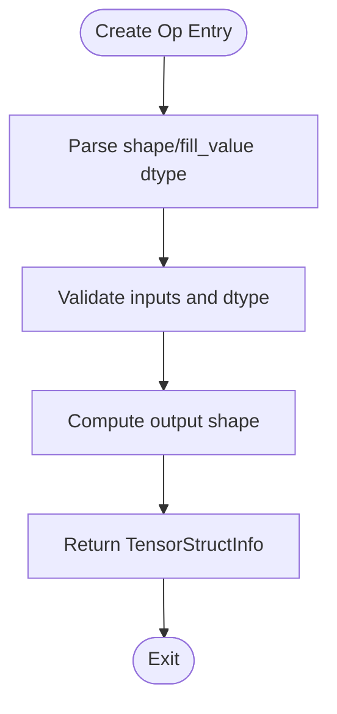

**Diagram sources**
- [create.cc:45-101](file://src/relax/op/tensor/create.cc#L45-L101)
- [create.cc:144-172](file://src/relax/op/tensor/create.cc#L144-L172)
- [create.cc:248-333](file://src/relax/op/tensor/create.cc#L248-L333)
- [create.cc:334-387](file://src/relax/op/tensor/create.cc#L334-L387)
- [create.cc:389-441](file://src/relax/op/tensor/create.cc#L389-L441)
- [create.cc:443-490](file://src/relax/op/tensor/create.cc#L443-L490)

**Section sources**
- [create.cc:45-101](file://src/relax/op/tensor/create.cc#L45-L101)
- [create.cc:144-172](file://src/relax/op/tensor/create.cc#L144-L172)
- [create.cc:248-333](file://src/relax/op/tensor/create.cc#L248-L333)
- [create.cc:334-387](file://src/relax/op/tensor/create.cc#L334-L387)
- [create.cc:389-441](file://src/relax/op/tensor/create.cc#L389-L441)
- [create.cc:443-490](file://src/relax/op/tensor/create.cc#L443-L490)

### Shape Manipulation Primitives
- broadcast_to: Target shape must be broadcast-compatible; validates against known shapes.
- concat: Validates dtype, ndim uniformity, and concatenation axis; computes output shape by summing concatenated dimension.
- expand_dims: Inserts new axes of length 1; preserves dtype and shape where known.
- flatten: Produces a 1-D tensor with total element count equal to input product.
- index_tensor: Multi-axis indexing; validates integer dtypes and checks broadcastability of index shapes.
- layout_transform: Applies IndexMap to shape; validates pad_value dtype and dimension compatibility.
- permute_dims: Permutes axes; identity permutation is detected.

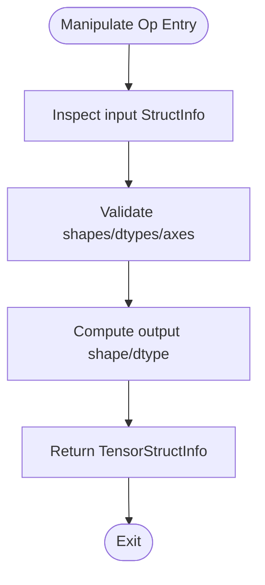

**Diagram sources**
- [manipulate.cc:72-140](file://src/relax/op/tensor/manipulate.cc#L72-L140)
- [manipulate.cc:142-328](file://src/relax/op/tensor/manipulate.cc#L142-L328)
- [manipulate.cc:405-507](file://src/relax/op/tensor/manipulate.cc#L405-L507)
- [manipulate.cc:518-553](file://src/relax/op/tensor/manipulate.cc#L518-L553)
- [manipulate.cc:555-695](file://src/relax/op/tensor/manipulate.cc#L555-L695)
- [manipulate.cc:704-776](file://src/relax/op/tensor/manipulate.cc#L704-L776)
- [manipulate.cc:778-800](file://src/relax/op/tensor/manipulate.cc#L778-L800)

**Section sources**
- [manipulate.cc:72-140](file://src/relax/op/tensor/manipulate.cc#L72-L140)
- [manipulate.cc:142-328](file://src/relax/op/tensor/manipulate.cc#L142-L328)
- [manipulate.cc:405-507](file://src/relax/op/tensor/manipulate.cc#L405-L507)
- [manipulate.cc:518-553](file://src/relax/op/tensor/manipulate.cc#L518-L553)
- [manipulate.cc:555-695](file://src/relax/op/tensor/manipulate.cc#L555-L695)
- [manipulate.cc:704-776](file://src/relax/op/tensor/manipulate.cc#L704-L776)
- [manipulate.cc:778-800](file://src/relax/op/tensor/manipulate.cc#L778-L800)

### Indexing Operations
- take: Supports axis selection and mode; validates integer indices; output shape combines indices and data shapes.
- strided_slice: Static slicing with axes/begin/end/stride tuples; computes output lengths via topi helper; supports inbound assumption.
- dynamic_strided_slice: Dynamic begin/end/stride tensors; enforces 1-D, int64, and axis-length constraints; output shape unknown.

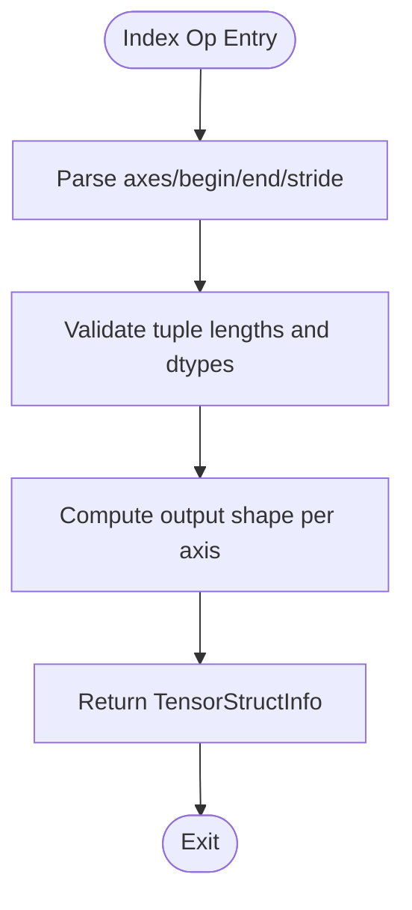

**Diagram sources**
- [index.cc:45-136](file://src/relax/op/tensor/index.cc#L45-L136)
- [index.cc:137-179](file://src/relax/op/tensor/index.cc#L137-L179)
- [index.cc:275-437](file://src/relax/op/tensor/index.cc#L275-L437)
- [index.cc:485-582](file://src/relax/op/tensor/index.cc#L485-L582)

**Section sources**
- [index.cc:45-136](file://src/relax/op/tensor/index.cc#L45-L136)
- [index.cc:137-179](file://src/relax/op/tensor/index.cc#L137-L179)
- [index.cc:275-437](file://src/relax/op/tensor/index.cc#L275-L437)
- [index.cc:485-582](file://src/relax/op/tensor/index.cc#L485-L582)

### Data Type Conversions
- astype: Casts tensor dtype while preserving shape and VDevice.
- wrap_param: Wraps parameters with a specified dtype for compilation.

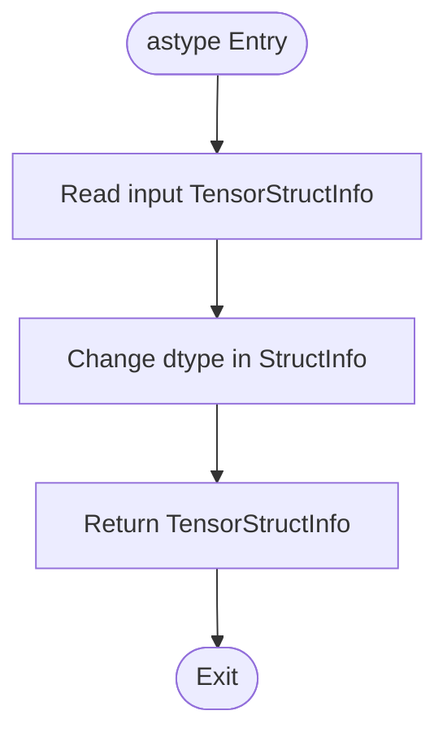

**Diagram sources**
- [datatype.cc:39-70](file://src/relax/op/tensor/datatype.cc#L39-L70)
- [datatype.cc:71-100](file://src/relax/op/tensor/datatype.cc#L71-L100)

**Section sources**
- [datatype.cc:39-70](file://src/relax/op/tensor/datatype.cc#L39-L70)
- [datatype.cc:71-100](file://src/relax/op/tensor/datatype.cc#L71-L100)

### Boolean Operations and Checks
- Unary boolean checks: isfinite, isinf, isnan.
- Logical/bitwise ops: logical_and/or/xor/not; bitwise_and/or/xor/lshift/rshift.

**Section sources**
- [unary.cc:95-103](file://src/relax/op/tensor/unary.cc#L95-L103)
- [binary.cc:222-234](file://src/relax/op/tensor/binary.cc#L222-L234)

### Gradient Computation
- call_tir_with_grad: Associates a TE gradient function name and kwargs with a call_tir, enabling automatic differentiation during lowering.

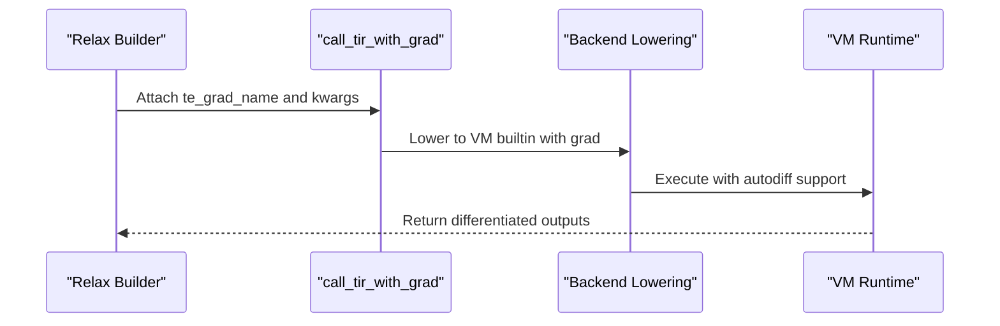

**Diagram sources**
- [op.cc:621-672](file://src/relax/op/op/op.cc#L621-L672)
- [op.h:33-49](file://include/tvm/relax/attrs/op.h#L33-L49)
- [backend.h:34-45](file://include/tvm/relax/backend.h#L34-L45)

**Section sources**
- [op.cc:621-672](file://src/relax/op/op/op.cc#L621-L672)
- [op.h:33-49](file://include/tvm/relax/attrs/op.h#L33-L49)
- [backend.h:34-45](file://include/tvm/relax/backend.h#L34-L45)

### Collective Communication and Distributed Computing
- call_tir variants and distributed lowering transform DTensor and DistIR into executable forms. StructInfo inference validates compatibility and shape derivation.

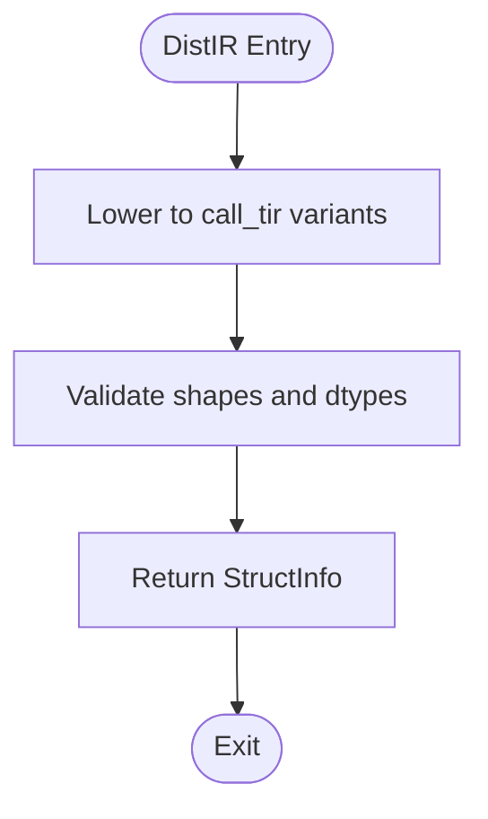

**Diagram sources**
- [op.cc:344-355](file://src/relax/op/op/op.cc#L344-L355)
- [op.cc:434-447](file://src/relax/op/op/op.cc#L434-L447)

**Section sources**
- [op.cc:344-355](file://src/relax/op/op/op.cc#L344-L355)
- [op.cc:434-447](file://src/relax/op/op/op.cc#L434-L447)

### Virtual Machine Operations
- Load executable, initialize devices and allocators, convert arguments to target device, invoke closures, interpret bytecode, manage frames and registers.
- Supports packed function calls, VMTIR functions, and instrumentation hooks.

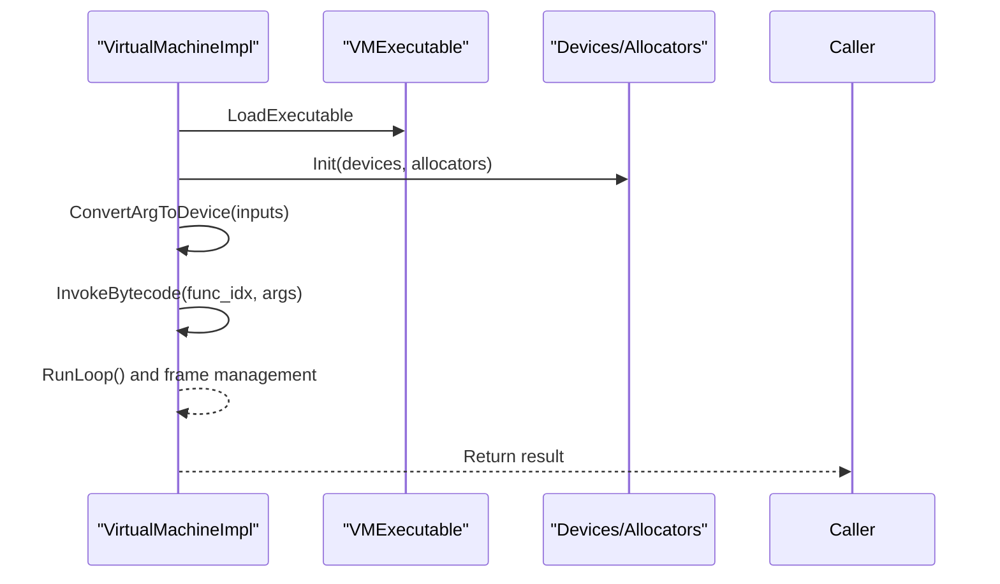

**Diagram sources**
- [vm.cc:457-485](file://src/runtime/vm/vm.cc#L457-L485)
- [vm.cc:503-525](file://src/runtime/vm/vm.cc#L503-L525)
- [vm.cc:657-695](file://src/runtime/vm/vm.cc#L657-L695)
- [vm.cc:724-800](file://src/runtime/vm/vm.cc#L724-L800)

**Section sources**
- [vm.cc:187-455](file://src/runtime/vm/vm.cc#L187-L455)
- [vm.cc:457-485](file://src/runtime/vm/vm.cc#L457-L485)
- [vm.cc:503-525](file://src/runtime/vm/vm.cc#L503-L525)
- [vm.cc:657-695](file://src/runtime/vm/vm.cc#L657-L695)
- [vm.cc:724-800](file://src/runtime/vm/vm.cc#L724-L800)

## Dependency Analysis
- Core operators depend on StructInfo inference and validation utilities.
- call_tir variants rely on attributes for gradients and in-place mutations.
- Backend lowering integrates with VM shape handling and runtime builtins.
- VM depends on device allocation and argument conversion utilities.

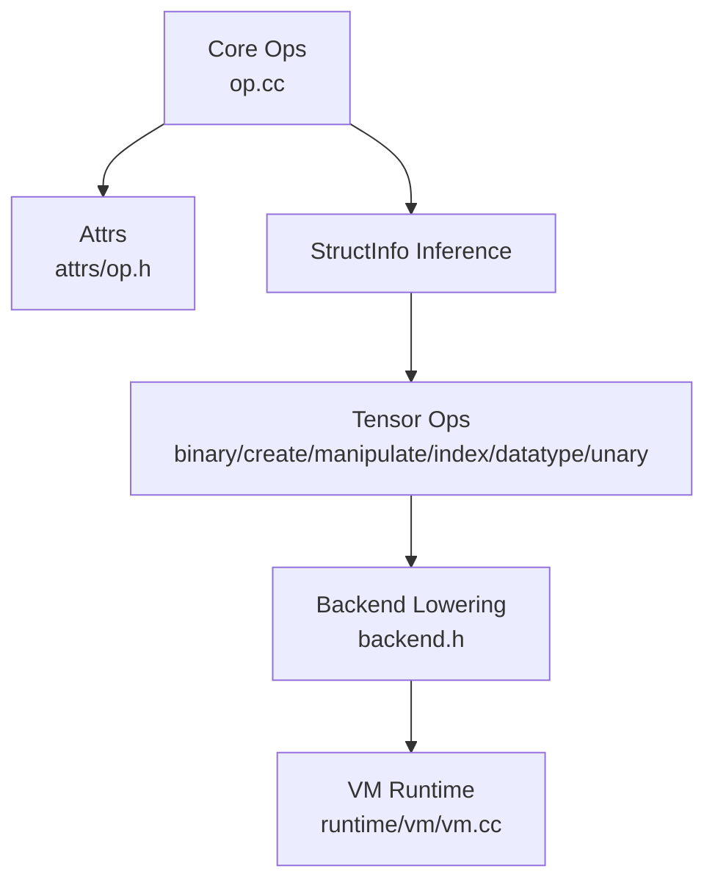

**Diagram sources**
- [op.cc:259-620](file://src/relax/op/op/op.cc#L259-L620)
- [op.h:33-69](file://include/tvm/relax/attrs/op.h#L33-L69)
- [backend.h:34-45](file://include/tvm/relax/backend.h#L34-L45)
- [vm.cc:187-455](file://src/runtime/vm/vm.cc#L187-L455)

**Section sources**
- [op.cc:259-620](file://src/relax/op/op/op.cc#L259-L620)
- [op.h:33-69](file://include/tvm/relax/attrs/op.h#L33-L69)
- [backend.h:34-45](file://include/tvm/relax/backend.h#L34-L45)
- [vm.cc:187-455](file://src/runtime/vm/vm.cc#L187-L455)

## Performance Considerations
- Broadcasting: Prefer pre-shaping to minimize runtime checks; unknown shapes defer to conservative inference.
- In-place mutations: call_tir_inplace requires exact dtype and shape matches; misuse can cause aliasing and correctness issues.
- Layout transformations: Using IndexMap avoids copies when compatible; ensure pad_value dtype matches input.
- VM device conversion: Argument conversion ensures correctness but adds overhead; batch inputs and reuse closures to reduce conversions.
- Backend lowering: LowerRuntimeBuiltin and VMShapeLower reduce overhead by mapping ops to efficient VM builtins.

[No sources needed since this section provides general guidance]

## Troubleshooting Guide
- Broadcasting mismatches: Validate shapes and ensure trailing dimensions align from the right.
- call_tir validation: Ensure explicit output StructInfo is compatible with the callee’s signature and that shape arguments are provided when needed.
- call_tir_inplace: Verify that in-place indices refer to inputs with identical dtype and shape; otherwise, validation fails.
- Indexing errors: Confirm indices are integer dtypes and broadcastable; for strided_slice, ensure tuple lengths match and axes are valid.
- VM invocation: Ensure function arity matches and inputs are convertible to target device; use saved closures for repeated invocations.

**Section sources**
- [op.cc:539-574](file://src/relax/op/op/op.cc#L539-L574)
- [manipulate.cc:72-140](file://src/relax/op/tensor/manipulate.cc#L72-L140)
- [index.cc:275-437](file://src/relax/op/tensor/index.cc#L275-L437)
- [vm.cc:503-525](file://src/runtime/vm/vm.cc#L503-L525)

## Conclusion
Relax’s specialized operations provide a comprehensive toolkit for tensor manipulation, numerical computation, and runtime execution. By leveraging structured inference, validation, and backend lowering, these operators integrate seamlessly with the VM and distributed systems. Understanding broadcasting, indexing semantics, and execution contexts enables robust and efficient model development and deployment.

[No sources needed since this section summarizes without analyzing specific files]

## Appendices

### Practical Examples and Integration Patterns
- Frontend interop: Map Relax ops to PyTorch equivalents for conversion and testing.
- Broadcasting and dtype promotion: Validate with frontend tests mirroring PyTorch semantics.
- Advanced tensor manipulation: Use concat, expand_dims, flatten, and layout_transform for model preprocessing and postprocessing.
- Custom operator development: Register new ops with StructInfo inference and validation; leverage call_tir for TIR-backed kernels.
- Distributed workflows: Combine call_tir variants with distributed lowering to target multi-device setups.

**Section sources**
- [relax_to_pyfunc_converter.py:261-316](file://python/tvm/relax/relax_to_pyfunc_converter.py#L261-L316)
- [test_frontend_from_fx.py:2237-2269](file://tests/python/relax/test_frontend_from_fx.py#L2237-L2269)
- [test_frontend_from_exported_program.py:128-146](file://tests/python/relax/test_frontend_from_exported_program.py#L128-L146)
- [test_frontend_from_exported_program.py:1432-1447](file://tests/python/relax/test_frontend_from_exported_program.py#L1432-L1447)
- [test_frontend_from_exported_program.py:1450-1461](file://tests/python/relax/test_frontend_from_exported_program.py#L1450-L1461)