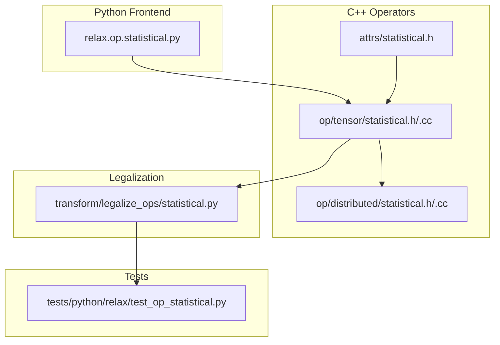
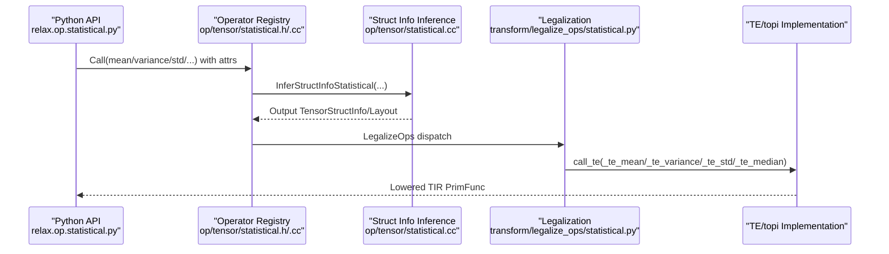
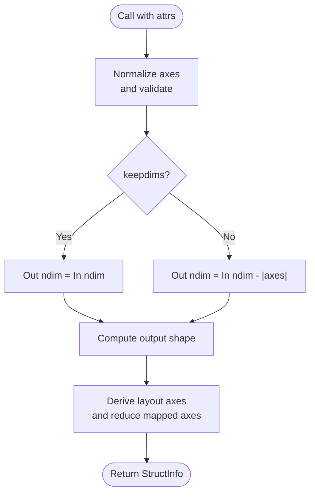
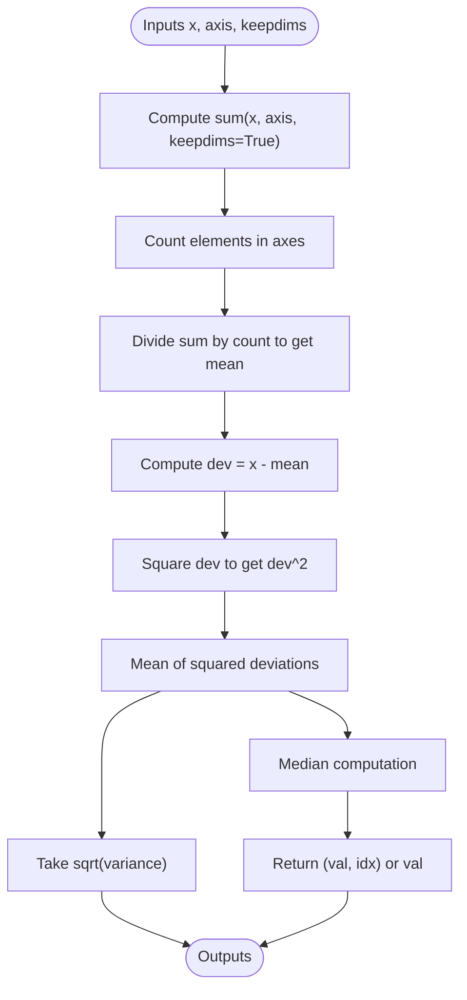
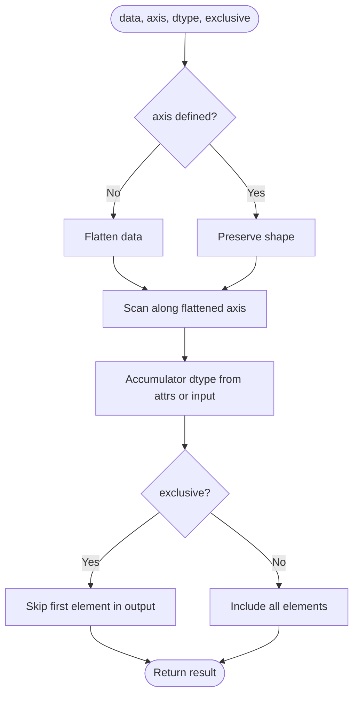
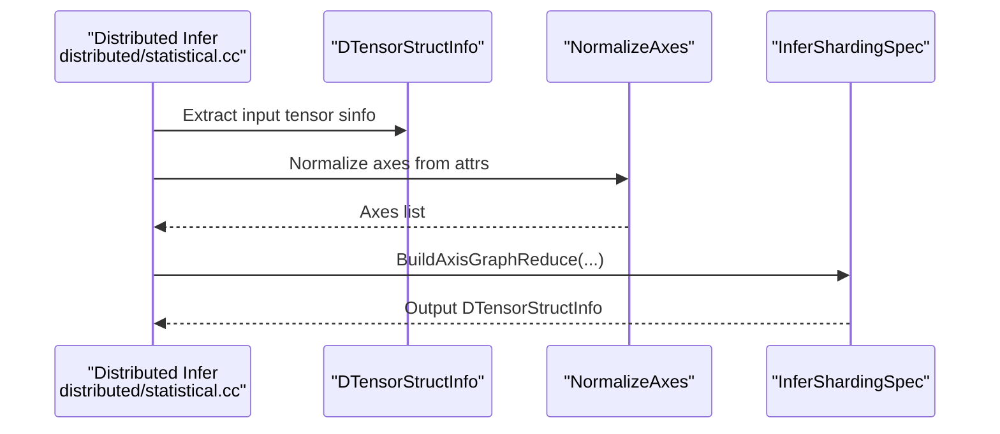
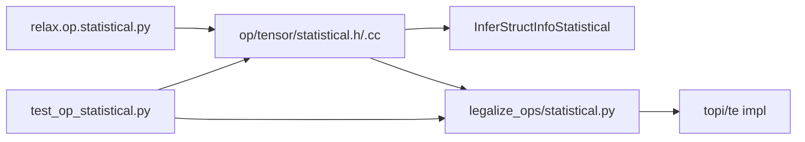

# Statistical Operations

<cite>
**Referenced Files in This Document**
- [statistical.h](file://include/tvm/relax/attrs/statistical.h)
- [statistical.h](file://src/relax/op/tensor/statistical.h)
- [statistical.cc](file://src/relax/op/tensor/statistical.cc)
- [statistical.h](file://src/relax/op/distributed/statistical.h)
- [statistical.cc](file://src/relax/op/distributed/statistical.cc)
- [statistical.py](file://python/tvm/relax/op/statistical.py)
- [statistical.py](file://python/tvm/relax/transform/legalize_ops/statistical.py)
- [test_op_statistical.py](file://tests/python/relax/test_op_statistical.py)
</cite>

## Table of Contents
1. [Introduction](#introduction)
2. [Project Structure](#project-structure)
3. [Core Components](#core-components)
4. [Architecture Overview](#architecture-overview)
5. [Detailed Component Analysis](#detailed-component-analysis)
6. [Dependency Analysis](#dependency-analysis)
7. [Performance Considerations](#performance-considerations)
8. [Troubleshooting Guide](#troubleshooting-guide)
9. [Conclusion](#conclusion)

## Introduction
This document describes Relax’s statistical operations, focusing on mean, variance, standard deviation, percentile-like reductions (median), and related descriptive statistics. It explains operator signatures, reduction axes, keepdim behavior, layout inference, and struct info inference. It also covers floating-point precision handling, memory-efficient computation strategies, and integration with machine learning pipelines via Relax transformations and lowering to TIR/TE.

## Project Structure
Relax statistical operators are defined in the Relax frontend and lowered to TIR/TE during legalization. The core pieces are:
- Attribute definitions for reduction semantics
- Operator declarations and registration
- Struct info inference for static shape/layout reasoning
- Python frontends exposing convenient APIs
- Legalization mapping to TE/topi routines
- Distributed inference for sharded DTensor inputs

**Diagram sources**
- [statistical.py](file://python/tvm/relax/op/statistical.py)
- [statistical.h](file://include/tvm/relax/attrs/statistical.h)
- [statistical.h](file://src/relax/op/tensor/statistical.h)
- [statistical.cc](file://src/relax/op/tensor/statistical.cc)
- [statistical.h](file://src/relax/op/distributed/statistical.h)
- [statistical.cc](file://src/relax/op/distributed/statistical.cc)
- [statistical.py](file://python/tvm/relax/transform/legalize_ops/statistical.py)
- [test_op_statistical.py](file://tests/python/relax/test_op_statistical.py)

**Section sources**
- [statistical.h](file://include/tvm/relax/attrs/statistical.h)
- [statistical.h](file://src/relax/op/tensor/statistical.h)
- [statistical.cc](file://src/relax/op/tensor/statistical.cc)
- [statistical.h](file://src/relax/op/distributed/statistical.h)
- [statistical.cc](file://src/relax/op/distributed/statistical.cc)
- [statistical.py](file://python/tvm/relax/op/statistical.py)
- [statistical.py](file://python/tvm/relax/transform/legalize_ops/statistical.py)
- [test_op_statistical.py](file://tests/python/relax/test_op_statistical.py)

## Core Components
- Reduction attributes: axis and keepdims are shared across most operators.
- Unary reduction ops: max, min, sum, prod, mean, variance, std, median.
- Scan-style ops: cumsum, cumprod (cumulative inclusive scans).
- Struct info inference: computes output shapes and layouts for static analysis.
- Legalization: maps Relax ops to TE/topi implementations.

Key operator signatures (Python frontends):
- max(x, axis=None, keepdims=False)
- mean(x, axis=None, keepdims=False)
- min(x, axis=None, keepdims=False)
- prod(x, axis=None, keepdims=False)
- std(x, axis=None, keepdims=False)
- sum(x, axis=None, keepdims=False)
- variance(x, axis=None, keepdims=False)
- median(x, axis=None, keepdims=False)
- cumsum(data, axis=None, dtype=None, exclusive=False)
- cumprod(data, axis=None, dtype=None, exclusive=False)

Behavior highlights:
- axis accepts int or list of ints; negative indexing is supported.
- keepdims preserves reduced axes as size 1 for broadcasting.
- std is implemented as sqrt(variance).
- median returns a tuple (value, indices) when reducing along a single axis; otherwise returns value only.

**Section sources**
- [statistical.py](file://python/tvm/relax/op/statistical.py)
- [statistical.h](file://src/relax/op/tensor/statistical.h)
- [statistical.cc](file://src/relax/op/tensor/statistical.cc)

## Architecture Overview
The pipeline from Python API to execution:
1. Python API constructs a Call node with attrs (axis, keepdims).
2. Struct info inference computes output shape/layout.
3. Legalization maps to TE/topi functions.
4. Lowering to TIR/TE executes on target hardware.

**Diagram sources**
- [statistical.py](file://python/tvm/relax/op/statistical.py)
- [statistical.h](file://src/relax/op/tensor/statistical.h)
- [statistical.cc](file://src/relax/op/tensor/statistical.cc)
- [statistical.py](file://python/tvm/relax/transform/legalize_ops/statistical.py)

## Detailed Component Analysis

### Reduction Attributes and Layout Inference
- Attributes: axis (optional array of integers), keepdims (boolean).
- Layout inference for reductions normalizes axes and maps layout axes accordingly; reduced axes become free axes in the output layout when keepdims is false.

**Diagram sources**
- [statistical.cc](file://src/relax/op/tensor/statistical.cc)

**Section sources**
- [statistical.h](file://include/tvm/relax/attrs/statistical.h)
- [statistical.cc](file://src/relax/op/tensor/statistical.cc)

### Mean, Variance, Standard Deviation, and Median
- mean: sum divided by number of elements in reduction axes.
- variance: mean((x - mean)^2) with keepdims for broadcasting.
- std: sqrt(variance).
- median: returns (value, indices) when reducing along a single axis; otherwise value only.

**Diagram sources**
- [statistical.py](file://python/tvm/relax/transform/legalize_ops/statistical.py)

**Section sources**
- [statistical.py](file://python/tvm/relax/transform/legalize_ops/statistical.py)
- [statistical.h](file://src/relax/op/tensor/statistical.h)
- [statistical.cc](file://src/relax/op/tensor/statistical.cc)

### Cumulative Operations (CumSum, CumProd)
- cumsum/cumprod compute inclusive cumulative operations along an axis.
- axis=None flattens the tensor; dtype can override accumulator type; exclusive excludes the first element from accumulation.

**Diagram sources**
- [statistical.cc](file://src/relax/op/tensor/statistical.cc)
- [statistical.py](file://python/tvm/relax/op/statistical.py)

**Section sources**
- [statistical.cc](file://src/relax/op/tensor/statistical.cc)
- [statistical.py](file://python/tvm/relax/op/statistical.py)

### Distributed Statistical Inference
- Distributed inference requires known ndim and shape for DTensor inputs.
- Normalizes axes and derives sharding specs for reduction axes.

**Diagram sources**
- [statistical.cc](file://src/relax/op/distributed/statistical.cc)

**Section sources**
- [statistical.h](file://src/relax/op/distributed/statistical.h)
- [statistical.cc](file://src/relax/op/distributed/statistical.cc)

## Dependency Analysis
- Python API depends on operator registry and FFI bindings.
- Operators depend on attrs and struct info inference.
- Legalization depends on TE/topi functions.
- Tests validate struct info inference and lowering correctness.

**Diagram sources**
- [statistical.py](file://python/tvm/relax/op/statistical.py)
- [statistical.h](file://src/relax/op/tensor/statistical.h)
- [statistical.cc](file://src/relax/op/tensor/statistical.cc)
- [statistical.py](file://python/tvm/relax/transform/legalize_ops/statistical.py)
- [test_op_statistical.py](file://tests/python/relax/test_op_statistical.py)

**Section sources**
- [statistical.py](file://python/tvm/relax/op/statistical.py)
- [statistical.h](file://src/relax/op/tensor/statistical.h)
- [statistical.cc](file://src/relax/op/tensor/statistical.cc)
- [statistical.py](file://python/tvm/relax/transform/legalize_ops/statistical.py)
- [test_op_statistical.py](file://tests/python/relax/test_op_statistical.py)

## Performance Considerations
- Memory efficiency:
  - Variance computation uses mean-subtracted deviations to improve numerical stability and locality.
  - keepdims ensures broadcasting-friendly shapes, avoiding extra reshape overhead.
- Floating-point precision:
  - Using mean subtraction before squaring reduces catastrophic cancellation compared to the two-pass formula.
  - Prefer float32/float64 for accumulating sums and means; specify dtype for cumsum/cumprod when necessary.
- Layout inference:
  - Proper layout decisions minimize data movement; reduced axes are handled by layout normalization.
- Batch processing:
  - Use axis to reduce over batch dimensions; keepdims to maintain shapes for broadcasting in downstream layers.
- Integration with ML pipelines:
  - Legalization maps to TE/topi, enabling downstream passes and target-specific kernels.

[No sources needed since this section provides general guidance]

## Troubleshooting Guide
Common issues and checks:
- Axis out-of-range or repeated axes:
  - Struct info inference validates axes; invalid configurations raise errors.
- Wrong input types:
  - Non-tensor inputs cause inference failures.
- Distributed operators require known ndim and shape.
- For median with multiple axes, behavior differs from NumPy; current implementation supports single-axis or global reduction.

Validation references:
- Struct info inference tests for shapes, dtypes, and axis normalization.
- Distributed inference tests enforce known ndim/shape constraints.
- Median inference tests confirm tuple vs scalar outputs.

**Section sources**
- [test_op_statistical.py](file://tests/python/relax/test_op_statistical.py)
- [statistical.cc](file://src/relax/op/tensor/statistical.cc)
- [statistical.cc](file://src/relax/op/distributed/statistical.cc)

## Conclusion
Relax’s statistical operations provide a consistent interface for reductions and scans with robust struct info inference and layout handling. Legalization to TE/topi enables efficient execution across targets. Use axis and keepdims to control output shapes, leverage mean/variance formulations for numerical stability, and integrate with ML pipelines via Relax transformations.