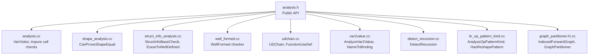
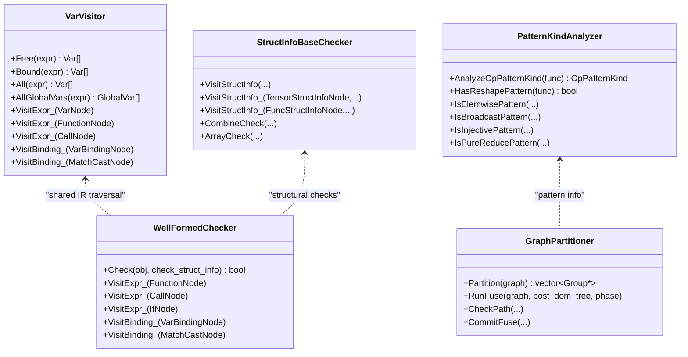
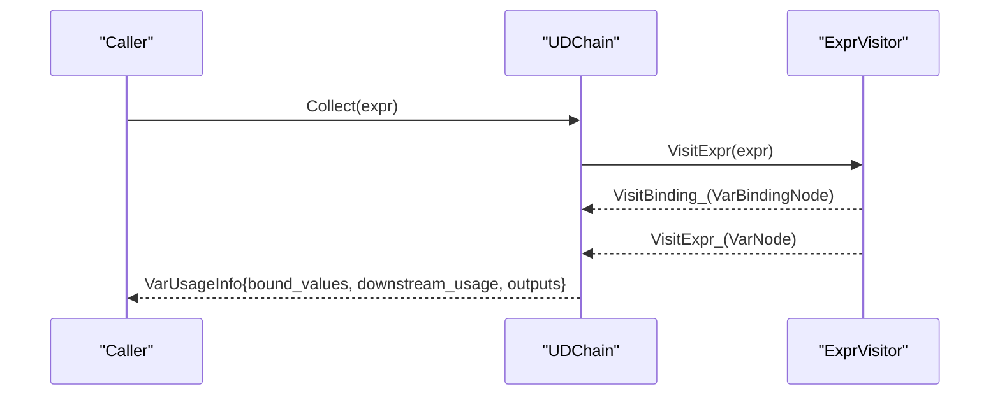
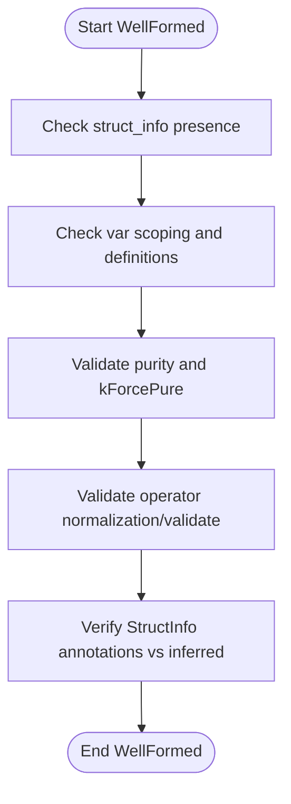
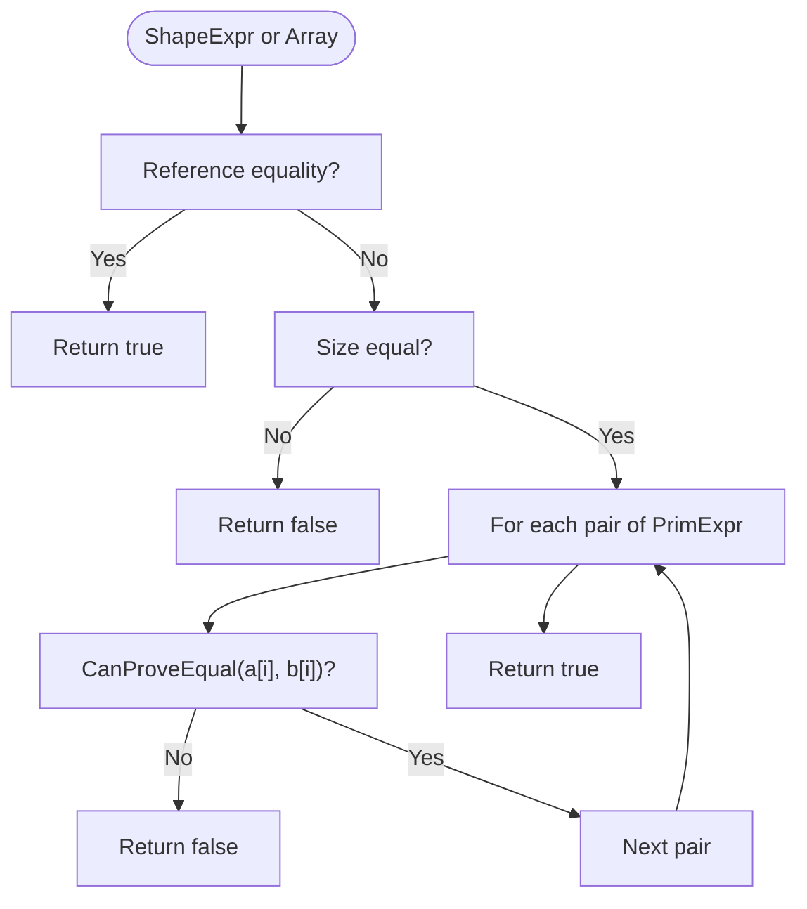
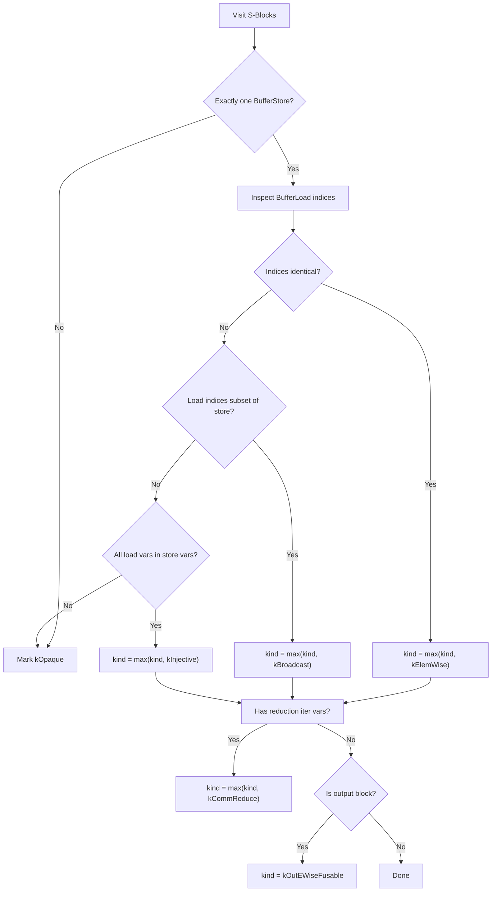
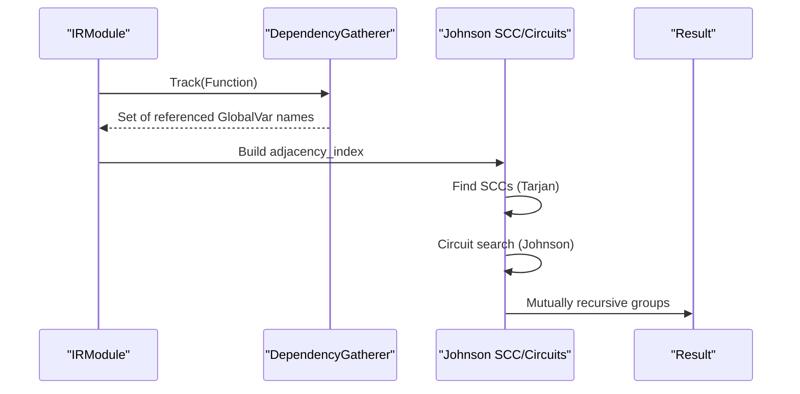
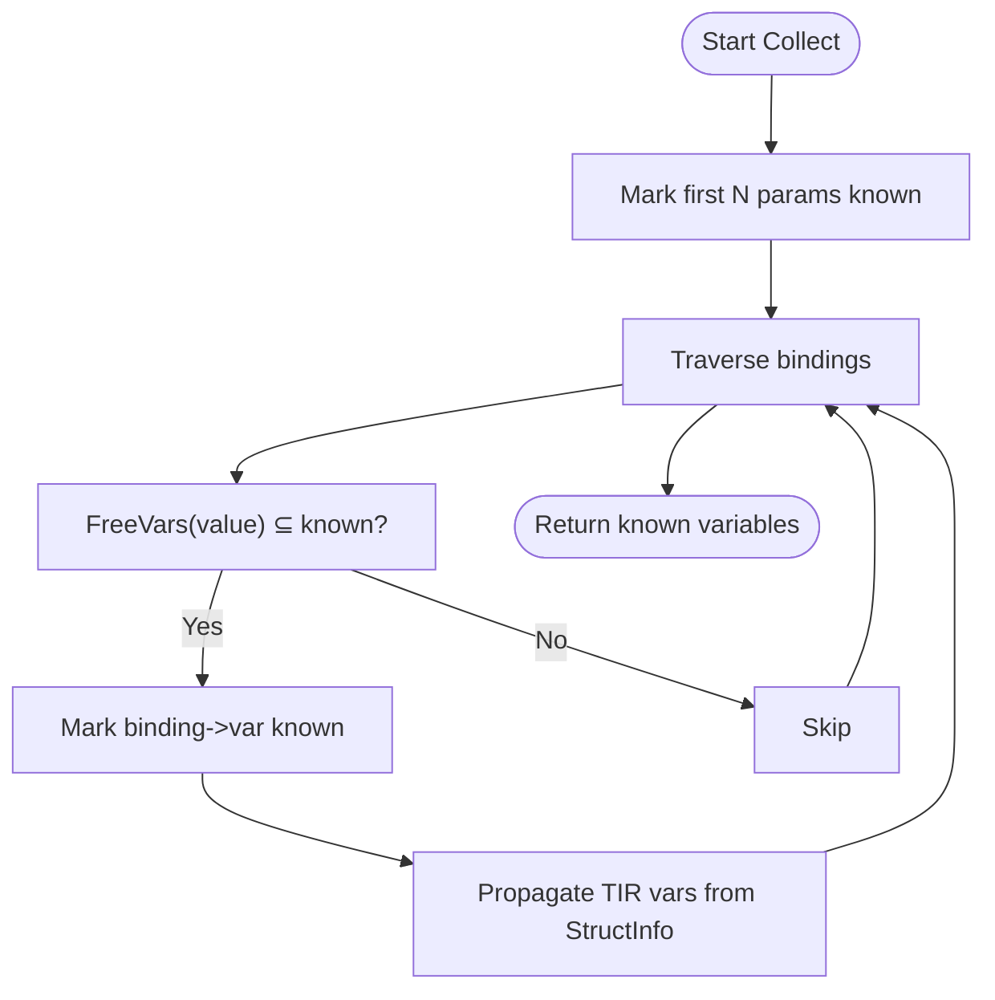
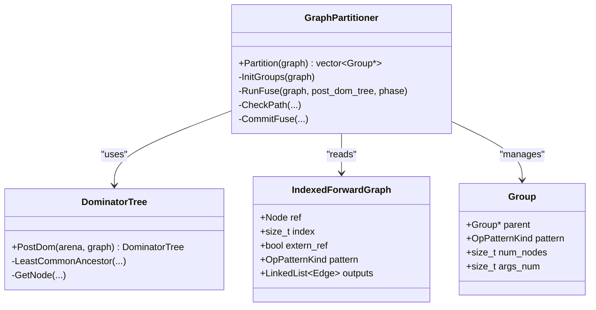
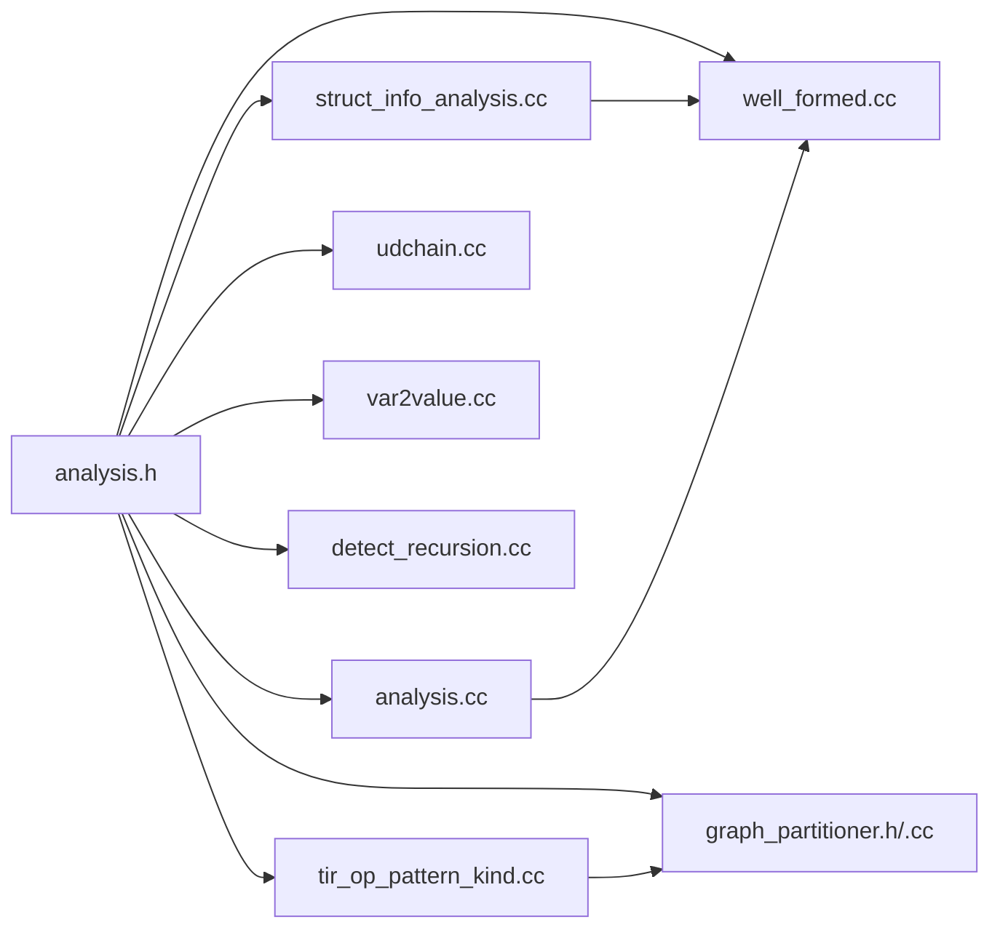

# Program Analysis

<cite>
**Referenced Files in This Document**
- [analysis.h](file://include/tvm/relax/analysis.h)
- [analysis.cc](file://src/relax/analysis/analysis.cc)
- [shape_analysis.cc](file://src/relax/analysis/shape_analysis.cc)
- [struct_info_analysis.cc](file://src/relax/analysis/struct_info_analysis.cc)
- [well_formed.cc](file://src/relax/analysis/well_formed.cc)
- [computable_at_compile_time.cc](file://src/relax/analysis/computable_at_compile_time.cc)
- [udchain.cc](file://src/relax/analysis/udchain.cc)
- [var2value.cc](file://src/relax/analysis/var2value.cc)
- [detect_recursion.cc](file://src/relax/analysis/detect_recursion.cc)
- [tir_op_pattern_kind.cc](file://src/relax/analysis/tir_op_pattern_kind.cc)
- [graph_partitioner.h](file://src/relax/analysis/graph_partitioner.h)
- [graph_partitioner.cc](file://src/relax/analysis/graph_partitioner.cc)
</cite>

## Table of Contents
1. [Introduction](#introduction)
2. [Project Structure](#project-structure)
3. [Core Components](#core-components)
4. [Architecture Overview](#architecture-overview)
5. [Detailed Component Analysis](#detailed-component-analysis)
6. [Dependency Analysis](#dependency-analysis)
7. [Performance Considerations](#performance-considerations)
8. [Troubleshooting Guide](#troubleshooting-guide)
9. [Conclusion](#conclusion)
10. [Appendices](#appendices)

## Introduction
This document explains the Relax program analysis capabilities in the TVM codebase, focusing on memory usage estimation, structural equality checking, dependency analysis, and program verification tools. It documents the analysis framework built around visitor patterns and utility functions for program inspection, and shows how these analyses integrate with transformation passes and optimization strategies. Practical examples illustrate debugging, performance profiling, and correctness verification. Guidance is included for scaling analysis to large Relax programs and developing custom analyses.

## Project Structure
The Relax analysis subsystem resides under src/relax/analysis and exposes APIs via include/tvm/relax/analysis.h. Key modules include:
- Variable and binding analysis (free/bound/all variables, use-def chains, var-to-value mapping)
- Structural equality and well-formedness checks
- Shape equality proofs and symbolic variable handling
- Operator pattern classification and reshape detection
- Recursion detection across global functions
- Compile-time computability analysis
- Graph-based operator fusion partitioning

**Diagram sources**
- [analysis.h](file://include/tvm/relax/analysis.h)
- [analysis.cc](file://src/relax/analysis/analysis.cc)
- [shape_analysis.cc](file://src/relax/analysis/shape_analysis.cc)
- [struct_info_analysis.cc](file://src/relax/analysis/struct_info_analysis.cc)
- [well_formed.cc](file://src/relax/analysis/well_formed.cc)
- [udchain.cc](file://src/relax/analysis/udchain.cc)
- [var2value.cc](file://src/relax/analysis/var2value.cc)
- [detect_recursion.cc](file://src/relax/analysis/detect_recursion.cc)
- [tir_op_pattern_kind.cc](file://src/relax/analysis/tir_op_pattern_kind.cc)
- [graph_partitioner.h](file://src/relax/analysis/graph_partitioner.h)
- [graph_partitioner.cc](file://src/relax/analysis/graph_partitioner.cc)

**Section sources**
- [analysis.h](file://include/tvm/relax/analysis.h)
- [analysis.cc](file://src/relax/analysis/analysis.cc)

## Core Components
- Variable and binding analysis
  - FreeVars, BoundVars, AllVars, AllGlobalVars
  - AnalyzeVar2Value, NameToBinding
  - FunctionUseDef, DataflowBlockUseDef, CollectVarUsage, GetUsedVars
- Structural equality and well-formedness
  - StructInfoBaseCheck, IsBaseOf, StructInfoLCA, StructInfoBaseCheckPrecondition
  - EraseToWellDefined, GetStaticType, StructInfoFromType
  - WellFormed
- Shape and symbolic variable utilities
  - CanProveShapeEqual
  - TIRVarsInStructInfo, DefinableTIRVarsInStructInfo, FreeSymbolicVars, DefinedSymbolicVars
  - CollectNonNegativeExpressions
- Impurity and purity checks
  - ContainsImpureCall, FindImpureCall
- Operator patterns and reshape detection
  - AnalyzeOpPatternKind, HasReshapePattern
- Recursion detection
  - DetectRecursion
- Compile-time computability
  - ComputableAtCompileTime
- Graph partitioning for fusion
  - IndexedForwardGraph, DominatorTree, GraphPartitioner

**Section sources**
- [analysis.h](file://include/tvm/relax/analysis.h)
- [analysis.cc](file://src/relax/analysis/analysis.cc)
- [struct_info_analysis.cc](file://src/relax/analysis/struct_info_analysis.cc)
- [well_formed.cc](file://src/relax/analysis/well_formed.cc)
- [udchain.cc](file://src/relax/analysis/udchain.cc)
- [var2value.cc](file://src/relax/analysis/var2value.cc)
- [detect_recursion.cc](file://src/relax/analysis/detect_recursion.cc)
- [tir_op_pattern_kind.cc](file://src/relax/analysis/tir_op_pattern_kind.cc)
- [computable_at_compile_time.cc](file://src/relax/analysis/computable_at_compile_time.cc)
- [graph_partitioner.h](file://src/relax/analysis/graph_partitioner.h)
- [graph_partitioner.cc](file://src/relax/analysis/graph_partitioner.cc)

## Architecture Overview
The analysis framework is visitor-centric:
- ExprVisitor-based visitors traverse Relax IR to collect variable usage, detect recursion, and enforce well-formedness.
- StructInfoFunctor-based visitors implement structural equality and type derivations.
- TIR expression visitors analyze buffer access patterns for operator fusion and reshape detection.
- GraphPartitioner builds an IndexedForwardGraph and computes a post-dominator tree to guide fusion.

**Diagram sources**
- [analysis.cc](file://src/relax/analysis/analysis.cc)
- [struct_info_analysis.cc](file://src/relax/analysis/struct_info_analysis.cc)
- [well_formed.cc](file://src/relax/analysis/well_formed.cc)
- [tir_op_pattern_kind.cc](file://src/relax/analysis/tir_op_pattern_kind.cc)
- [graph_partitioner.h](file://src/relax/analysis/graph_partitioner.h)
- [graph_partitioner.cc](file://src/relax/analysis/graph_partitioner.cc)

## Detailed Component Analysis

### Variable and Binding Analysis
- VarVisitor implements collection of free, bound, and global variables, and marks bounded scopes during traversal.
- UDChain computes use-def maps, tracks forward declarations, and extracts outputs.
- Var2Val and NameToBinding map variable definitions to values and group bindings by name.

**Diagram sources**
- [udchain.cc](file://src/relax/analysis/udchain.cc)

**Section sources**
- [analysis.cc](file://src/relax/analysis/analysis.cc)
- [udchain.cc](file://src/relax/analysis/udchain.cc)
- [var2value.cc](file://src/relax/analysis/var2value.cc)

### Structural Equality and Well-Formedness
- StructInfoBaseCheck determines whether a base StructInfo subsumes a derived StructInfo with fine-grained failure modes.
- EraseToWellDefined removes dependencies on undefined symbolic variables, enabling safe propagation across scopes.
- WellFormed enforces IR invariants: variable scoping, struct_info presence, purity constraints, and operator normalization/validation.

**Diagram sources**
- [well_formed.cc](file://src/relax/analysis/well_formed.cc)

**Section sources**
- [struct_info_analysis.cc](file://src/relax/analysis/struct_info_analysis.cc)
- [well_formed.cc](file://src/relax/analysis/well_formed.cc)

### Shape Equality and Symbolic Variables
- CanProveShapeEqual compares symbolic shapes using integer analysis to decide equality with best-effort guarantees.
- Utilities extract TIR variables from StructInfo and derive non-negativity constraints for shape validity.

**Diagram sources**
- [shape_analysis.cc](file://src/relax/analysis/shape_analysis.cc)

**Section sources**
- [shape_analysis.cc](file://src/relax/analysis/shape_analysis.cc)
- [analysis.h](file://include/tvm/relax/analysis.h)

### Operator Patterns and Reshape Detection
- AnalyzeOpPatternKind classifies blocks into elemwise, broadcast, injective, reduce, and out-ewise fusable patterns, guiding fusion.
- HasReshapePattern detects contiguous reshapes by flattening indices and verifying index equality under iteration maps.

**Diagram sources**
- [tir_op_pattern_kind.cc](file://src/relax/analysis/tir_op_pattern_kind.cc)

**Section sources**
- [tir_op_pattern_kind.cc](file://src/relax/analysis/tir_op_pattern_kind.cc)

### Recursion Detection
- DetectRecursion constructs a dependency graph over global functions, converts to indexed adjacency, and applies Johnson’s circuit-finding to coalesce mutually recursive groups.

**Diagram sources**
- [detect_recursion.cc](file://src/relax/analysis/detect_recursion.cc)

**Section sources**
- [detect_recursion.cc](file://src/relax/analysis/detect_recursion.cc)

### Compile-Time Computability
- ComputableAtCompileTime identifies variables whose values can be computed at compile-time given known inputs and symbolic variables.

**Diagram sources**
- [computable_at_compile_time.cc](file://src/relax/analysis/computable_at_compile_time.cc)

**Section sources**
- [computable_at_compile_time.cc](file://src/relax/analysis/computable_at_compile_time.cc)

### Graph Partitioning for Fusion
- IndexedForwardGraph encodes a forward dataflow fragment with node patterns and edges.
- DominatorTree computes post-dominance relations to guide fusion.
- GraphPartitioner merges groups respecting pattern hierarchies and argument limits.

**Diagram sources**
- [graph_partitioner.h](file://src/relax/analysis/graph_partitioner.h)
- [graph_partitioner.cc](file://src/relax/analysis/graph_partitioner.cc)

**Section sources**
- [graph_partitioner.h](file://src/relax/analysis/graph_partitioner.h)
- [graph_partitioner.cc](file://src/relax/analysis/graph_partitioner.cc)

## Dependency Analysis
- Public API surface: include/tvm/relax/analysis.h declares all analysis functions and enumerations.
- Visitor-based modules depend on Relax IR and TIR expression functors.
- Graph partitioner depends on arena utilities and pattern kinds.

**Diagram sources**
- [analysis.h](file://include/tvm/relax/analysis.h)
- [analysis.cc](file://src/relax/analysis/analysis.cc)
- [struct_info_analysis.cc](file://src/relax/analysis/struct_info_analysis.cc)
- [well_formed.cc](file://src/relax/analysis/well_formed.cc)
- [udchain.cc](file://src/relax/analysis/udchain.cc)
- [var2value.cc](file://src/relax/analysis/var2value.cc)
- [detect_recursion.cc](file://src/relax/analysis/detect_recursion.cc)
- [tir_op_pattern_kind.cc](file://src/relax/analysis/tir_op_pattern_kind.cc)
- [graph_partitioner.h](file://src/relax/analysis/graph_partitioner.h)
- [graph_partitioner.cc](file://src/relax/analysis/graph_partitioner.cc)

**Section sources**
- [analysis.h](file://include/tvm/relax/analysis.h)

## Performance Considerations
- Traversal complexity
  - Variable and binding analysis: O(|IR|) with efficient insertion sets and ordered traversals.
  - Well-formedness: O(|IR|) with scope tracking and operator-specific normalization/validation checks.
  - Structural equality: O(|StructInfo|) per comparison with analyzer-based simplifications.
  - Recursion detection: O(V + E) for dependency graph plus Johnson’s algorithm overhead; acceptable for typical module sizes.
  - Operator pattern analysis: O(|S-blocks| + |loads|) per function; early exits on opaque classification.
  - Graph partitioning: O(|nodes| + |edges|) with union-find and path checks; configurable limits prevent excessive fusion.
- Scalability limits
  - Large modules with many global functions and deeply nested expressions may increase recursion detection and fusion computation time.
  - Shape equality relies on integer analysis; complex symbolic expressions can slow down proof attempts.
- Best practices
  - Normalize IR before structural checks to minimize redundant work.
  - Use targeted analysis passes (e.g., shape equality only when needed).
  - Limit fusion depth and argument counts to maintain executable size and runtime performance.
  - Prefer incremental analysis updates when transforming IR to avoid recomputation.

[No sources needed since this section provides general guidance]

## Troubleshooting Guide
- Well-formedness warnings
  - Missing struct_info, invalid variable scoping, purity violations, or operator normalization errors are logged as warnings. Review the reported expressions and fix annotations or normalization.
- Impure call detection
  - ContainsImpureCall and FindImpureCall help locate side-effecting operations. Ensure purity annotations align with semantics or adjust purity attributes accordingly.
- Structural equality failures
  - StructInfoBaseCheck returns fine-grained failure modes. Use StructInfoBaseCheckPrecondition to derive necessary conditions for equality.
- Recursion issues
  - DetectRecursion reports mutually recursive groups. Break cycles or refactor to reduce interdependencies.
- Operator fusion pitfalls
  - If fusion yields oversized functions, lower max_fuse_depth or max_function_args in GraphPartitioner configuration.

**Section sources**
- [well_formed.cc](file://src/relax/analysis/well_formed.cc)
- [analysis.cc](file://src/relax/analysis/analysis.cc)
- [struct_info_analysis.cc](file://src/relax/analysis/struct_info_analysis.cc)
- [detect_recursion.cc](file://src/relax/analysis/detect_recursion.cc)
- [graph_partitioner.h](file://src/relax/analysis/graph_partitioner.h)
- [graph_partitioner.cc](file://src/relax/analysis/graph_partitioner.cc)

## Conclusion
The Relax analysis toolkit provides a robust, visitor-driven framework for correctness, performance, and optimization. It supports structural equality, well-formedness, variable and binding analysis, recursion detection, operator pattern classification, and graph-based fusion. Together, these capabilities enable effective debugging, profiling, and verification of Relax programs, and integrate naturally with transformation passes to drive analysis-aware optimizations.

[No sources needed since this section summarizes without analyzing specific files]

## Appendices

### Practical Examples
- Debugging variable scoping
  - Use FreeVars and BoundVars to inspect variable lifetimes in a function body.
  - Use AnalyzeVar2Value to map definitions to their values and NameToBinding to group bindings by variable name.
- Correctness verification
  - Run WellFormed to validate IR invariants and StructInfoBaseCheck to confirm structural compatibility.
  - Use ContainsImpureCall to ensure purity constraints are met.
- Performance profiling
  - Compute operator patterns with AnalyzeOpPatternKind and detect reshapes with HasReshapePattern to guide layout and memory access optimizations.
- Optimization strategies
  - Use DetectRecursion to inform scheduling and kernel splitting.
  - Apply GraphPartitioner to fuse compatible operators while respecting depth and argument limits.
  - Identify compile-time computable variables with ComputableAtCompileTime to hoist constants.

[No sources needed since this section provides general guidance]