# Relax Frontend Extensions

<cite>
**Referenced Files in This Document**
- [python/tvm/relax/__init__.py](file://python/tvm/relax/__init__.py)
- [python/tvm/relax/frontend/__init__.py](file://python/tvm/relax/frontend/__init__.py)
- [python/tvm/relax/frontend/onnx/onnx_frontend.py](file://python/tvm/relax/frontend/onnx/onnx_frontend.py)
- [python/tvm/relax/frontend/torch/__init__.py](file://python/tvm/relax/frontend/torch/__init__.py)
- [python/tvm/relax/frontend/tflite/tflite_frontend.py](file://python/tvm/relax/frontend/tflite/tflite_frontend.py)
- [python/tvm/relax/frontend/common.py](file://python/tvm/relax/frontend/common.py)
- [python/tvm/relax/op/__init__.py](file://python/tvm/relax/op/__init__.py)
- [python/tvm/relax/op/base.py](file://python/tvm/relax/op/base.py)
- [python/tvm/relax/transform/__init__.py](file://python/tvm/relax/transform/__init__.py)
- [python/tvm/relax/analysis/__init__.py](file://python/tvm/relax/analysis/__init__.py)
- [python/tvm/relax/backend/__init__.py](file://python/tvm/relax/backend/__init__.py)
- [python/tvm/relax/pipeline.py](file://python/tvm/relax/pipeline.py)
- [src/relax/ir/expr.cc](file://src/relax/ir/expr.cc)
- [src/relax/ir/block_builder.cc](file://src/relax/ir/block_builder.cc)
- [src/relax/transform/legalize_ops.cc](file://src/relax/transform/legalize_ops.cc)
- [src/relax/transform/fuse_ops.cc](file://src/relax/transform/fuse_ops.cc)
- [src/relax/analysis/well_formed.cc](file://src/relax/analysis/well_formed.cc)
- [src/relax/analysis/shape_analysis.cc](file://src/relax/analysis/shape_analysis.cc)
- [src/relax/analysis/graph_partitioner.cc](file://src/relax/analysis/graph_partitioner.cc)
- [src/relax/backend/pattern_registry.cc](file://src/relax/backend/pattern_registry.cc)
- [src/relax/backend/task_extraction.cc](file://src/relax/backend/task_extraction.cc)
- [src/relax/distributed/transform/lower_distir.cc](file://src/relax/distributed/transform/lower_distir.cc)
- [src/relax/distributed/transform/propagate_sharding.cc](file://src/relax/distributed/transform/propagate_sharding.cc)
- [src/relax/training/utils.cc](file://src/relax/training/utils.cc)
- [src/relax/training/optimizer.py](file://src/relax/training/optimizer.py)
- [src/relax/training/trainer.py](file://src/relax/training/trainer.py)
- [src/relax/testing/transform.cc](file://src/relax/testing/transform.cc)
</cite>

## Table of Contents
1. [Introduction](#introduction)
2. [Project Structure](#project-structure)
3. [Core Components](#core-components)
4. [Architecture Overview](#architecture-overview)
5. [Detailed Component Analysis](#detailed-component-analysis)
6. [Dependency Analysis](#dependency-analysis)
7. [Performance Considerations](#performance-considerations)
8. [Troubleshooting Guide](#troubleshooting-guide)
9. [Conclusion](#conclusion)
10. [Appendices](#appendices)

## Introduction
This document explains TVM's Relax frontend capabilities for advanced model development. It covers:
- Graph-level IR and operations
- Frontend adapters for ONNX, PyTorch, and TensorFlow Lite
- Custom operator development and gradient registration
- Transformation system for graph optimization
- Analysis tools for program verification
- Testing utilities and pipelines
- Distributed training, quantization workflows, and deployment pipelines
- Extension mechanisms for new frontends, transformations, and analysis passes
- Debugging techniques and best practices

## Project Structure
Relax is organized into core namespaces:
- IR and type system: expressions, blocks, and structural information
- Operators: built-in and categorized operator sets
- Frontends: ONNX, PyTorch, TensorFlow Lite, and common helpers
- Transformations: graph-level optimizations and lowering passes
- Analysis: well-formedness, shape inference, partitioning, and memory estimation
- Backend: target-specific dispatch and code generation
- Training: utilities and optimizer integration
- Pipelines: pre-defined compilation sequences

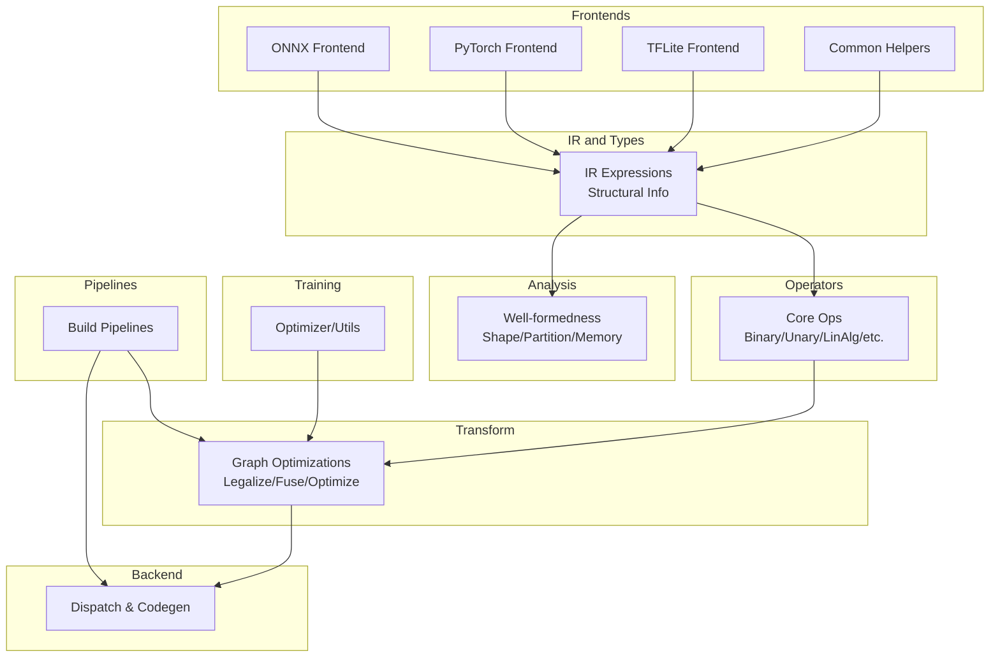

**Diagram sources**
- [python/tvm/relax/__init__.py:24-123](file://python/tvm/relax/__init__.py#L24-L123)
- [python/tvm/relax/frontend/onnx/onnx_frontend.py:18-37](file://python/tvm/relax/frontend/onnx/onnx_frontend.py#L18-L37)
- [python/tvm/relax/frontend/torch/__init__.py:18-25](file://python/tvm/relax/frontend/torch/__init__.py#L18-L25)
- [python/tvm/relax/frontend/tflite/tflite_frontend.py:25-40](file://python/tvm/relax/frontend/tflite/tflite_frontend.py#L25-L40)
- [python/tvm/relax/op/__init__.py:24-179](file://python/tvm/relax/op/__init__.py#L24-L179)
- [python/tvm/relax/transform/__init__.py:20-103](file://python/tvm/relax/transform/__init__.py#L20-L103)
- [python/tvm/relax/analysis/__init__.py:20-50](file://python/tvm/relax/analysis/__init__.py#L20-L50)
- [python/tvm/relax/backend/__init__.py:18-24](file://python/tvm/relax/backend/__init__.py#L18-L24)
- [python/tvm/relax/pipeline.py:17-348](file://python/tvm/relax/pipeline.py#L17-L348)

**Section sources**
- [python/tvm/relax/__init__.py:19-123](file://python/tvm/relax/__init__.py#L19-L123)
- [python/tvm/relax/frontend/__init__.py:18-22](file://python/tvm/relax/frontend/__init__.py#L18-L22)
- [python/tvm/relax/op/__init__.py:18-179](file://python/tvm/relax/op/__init__.py#L18-L179)
- [python/tvm/relax/transform/__init__.py:18-103](file://python/tvm/relax/transform/__init__.py#L18-L103)
- [python/tvm/relax/analysis/__init__.py:18-50](file://python/tvm/relax/analysis/__init__.py#L18-L50)
- [python/tvm/relax/backend/__init__.py:18-24](file://python/tvm/relax/backend/__init__.py#L18-L24)
- [python/tvm/relax/pipeline.py:17-348](file://python/tvm/relax/pipeline.py#L17-L348)

## Core Components
- IR and structural typing: expressions, blocks, binding, and structural information for tensors and functions
- Operators: comprehensive operator set including arithmetic, logical, neural network primitives, linear algebra, and control-flow intrinsics
- Frontends: ONNX, PyTorch, and TensorFlow Lite importers with operator registries and converter classes
- Transformations: legalizations, fusion, layout optimization, constant folding, and lowering to TIR
- Analysis: well-formedness checks, shape inference, graph partitioning, and memory usage estimation
- Backend: pattern dispatch, task extraction, and target-specific lowering
- Training: optimizer integration and utilities for training loops
- Pipelines: pre-defined compilation sequences for zero-, default, and tuning pipelines

**Section sources**
- [python/tvm/relax/__init__.py:24-123](file://python/tvm/relax/__init__.py#L24-L123)
- [python/tvm/relax/op/__init__.py:24-179](file://python/tvm/relax/op/__init__.py#L24-L179)
- [python/tvm/relax/frontend/onnx/onnx_frontend.py:284-375](file://python/tvm/relax/frontend/onnx/onnx_frontend.py#L284-L375)
- [python/tvm/relax/transform/__init__.py:20-103](file://python/tvm/relax/transform/__init__.py#L20-L103)
- [python/tvm/relax/analysis/__init__.py:20-50](file://python/tvm/relax/analysis/__init__.py#L20-L50)
- [python/tvm/relax/backend/__init__.py:18-24](file://python/tvm/relax/backend/__init__.py#L18-L24)
- [python/tvm/relax/pipeline.py:33-348](file://python/tvm/relax/pipeline.py#L33-L348)

## Architecture Overview
The Relax ecosystem composes frontends into an IR, applies transformations, and lowers to target-specific backends. The pipeline orchestrates passes for legalization, fusion, layout optimization, and code generation.

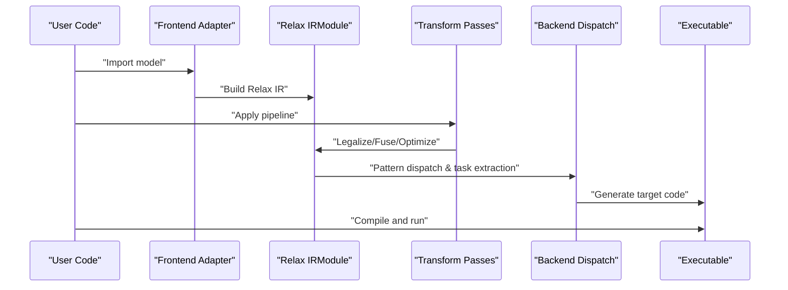

**Diagram sources**
- [python/tvm/relax/frontend/onnx/onnx_frontend.py:18-37](file://python/tvm/relax/frontend/onnx/onnx_frontend.py#L18-L37)
- [python/tvm/relax/pipeline.py:80-107](file://python/tvm/relax/pipeline.py#L80-L107)
- [src/relax/backend/pattern_registry.cc:1-200](file://src/relax/backend/pattern_registry.cc#L1-L200)
- [src/relax/backend/task_extraction.cc:1-200](file://src/relax/backend/task_extraction.cc#L1-L200)

## Detailed Component Analysis

### Graph-Level IR and Operations
- Expressions and blocks: dataflow blocks, binding, sequencing, and structural typing for tensors and functions
- Operators: arithmetic/logical/unary/binary, linear algebra, manipulation, statistics, search, and specialized ops
- Intrinsics: call_tir, call_tir_with_grad, call_pure_packed, call_dps_packed, and printing/assertion ops

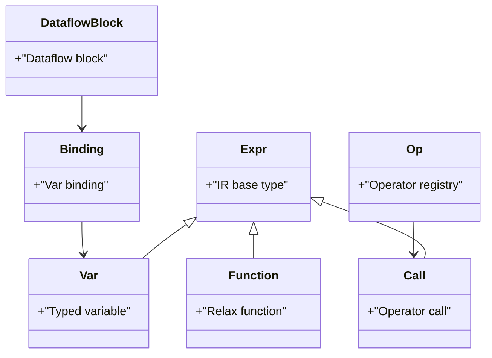

**Diagram sources**
- [src/relax/ir/expr.cc:1-200](file://src/relax/ir/expr.cc#L1-L200)
- [src/relax/ir/block_builder.cc:1-200](file://src/relax/ir/block_builder.cc#L1-L200)
- [python/tvm/relax/op/__init__.py:24-179](file://python/tvm/relax/op/__init__.py#L24-L179)

**Section sources**
- [src/relax/ir/expr.cc:1-200](file://src/relax/ir/expr.cc#L1-L200)
- [src/relax/ir/block_builder.cc:1-200](file://src/relax/ir/block_builder.cc#L1-L200)
- [python/tvm/relax/op/__init__.py:24-179](file://python/tvm/relax/op/__init__.py#L24-L179)

### Frontend Adapters

#### ONNX Frontend
- Converts ONNX graphs to Relax via operator converters and registries
- Handles dynamic shapes, opset selection, and quantization ops
- Provides helper utilities for shape parsing and autopadding

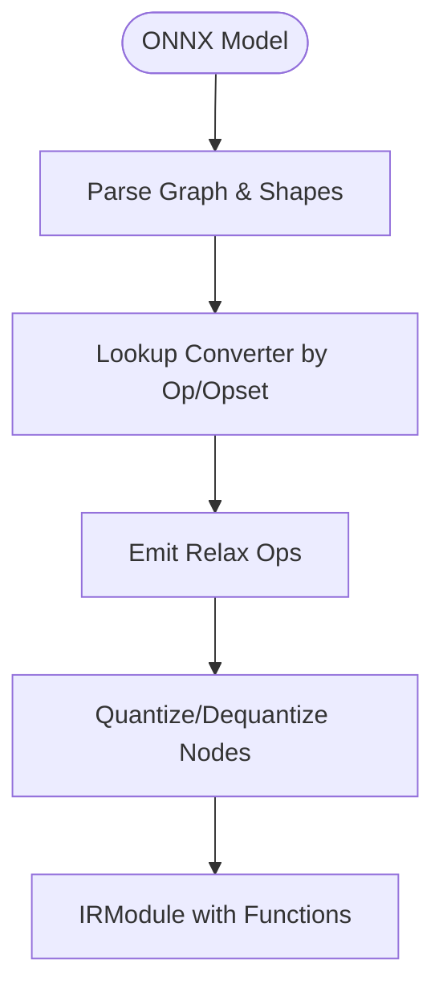

**Diagram sources**
- [python/tvm/relax/frontend/onnx/onnx_frontend.py:284-375](file://python/tvm/relax/frontend/onnx/onnx_frontend.py#L284-L375)
- [python/tvm/relax/frontend/onnx/onnx_frontend.py:191-227](file://python/tvm/relax/frontend/onnx/onnx_frontend.py#L191-L227)

**Section sources**
- [python/tvm/relax/frontend/onnx/onnx_frontend.py:18-37](file://python/tvm/relax/frontend/onnx/onnx_frontend.py#L18-L37)
- [python/tvm/relax/frontend/onnx/onnx_frontend.py:284-375](file://python/tvm/relax/frontend/onnx/onnx_frontend.py#L284-L375)
- [python/tvm/relax/frontend/onnx/onnx_frontend.py:191-227](file://python/tvm/relax/frontend/onnx/onnx_frontend.py#L191-L227)

#### PyTorch Frontend
- Imports via ExportedProgram and FX graph translators
- Supports Dynamo capture and subgraph extraction

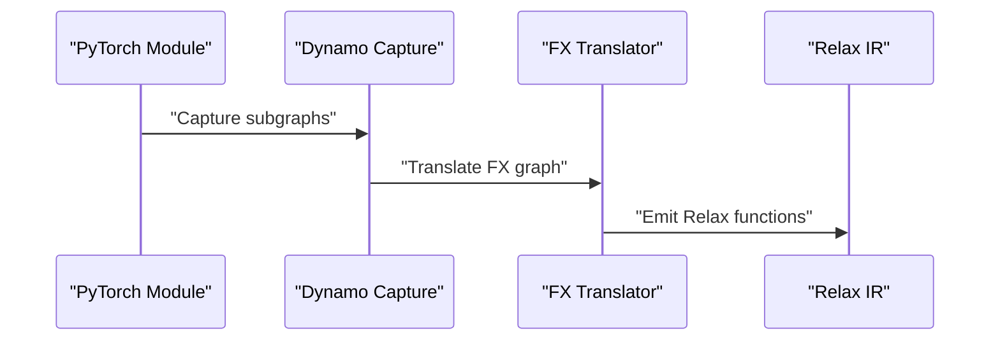

**Diagram sources**
- [python/tvm/relax/frontend/torch/__init__.py:18-25](file://python/tvm/relax/frontend/torch/__init__.py#L18-L25)

**Section sources**
- [python/tvm/relax/frontend/torch/__init__.py:18-25](file://python/tvm/relax/frontend/torch/__init__.py#L18-L25)

#### TensorFlow Lite Frontend
- Converts FlatBuffer graphs to Relax with operator mapping
- Handles quantization parameters and fused activations

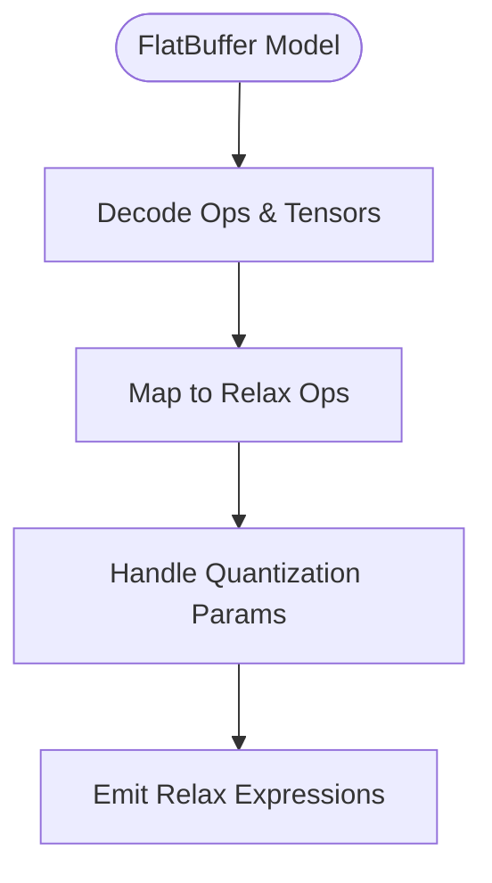

**Diagram sources**
- [python/tvm/relax/frontend/tflite/tflite_frontend.py:118-240](file://python/tvm/relax/frontend/tflite/tflite_frontend.py#L118-L240)
- [python/tvm/relax/frontend/tflite/tflite_frontend.py:420-520](file://python/tvm/relax/frontend/tflite/tflite_frontend.py#L420-L520)

**Section sources**
- [python/tvm/relax/frontend/tflite/tflite_frontend.py:25-40](file://python/tvm/relax/frontend/tflite/tflite_frontend.py#L25-L40)
- [python/tvm/relax/frontend/tflite/tflite_frontend.py:118-240](file://python/tvm/relax/frontend/tflite/tflite_frontend.py#L118-L240)
- [python/tvm/relax/frontend/tflite/tflite_frontend.py:420-520](file://python/tvm/relax/frontend/tflite/tflite_frontend.py#L420-L520)

### Custom Operator Development
- Define operators using call_tir, call_tir_with_grad, and call_pure_packed
- Register gradients via register_gradient for autodiff
- Use BlockBuilder to construct dataflow graphs and emit TE/TIR calls

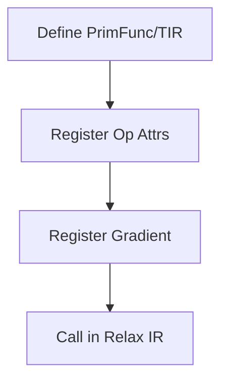

**Diagram sources**
- [python/tvm/relax/op/base.py:94-191](file://python/tvm/relax/op/base.py#L94-L191)
- [python/tvm/relax/op/base.py:36-56](file://python/tvm/relax/op/base.py#L36-L56)

**Section sources**
- [python/tvm/relax/op/base.py:94-191](file://python/tvm/relax/op/base.py#L94-L191)
- [python/tvm/relax/op/base.py:36-56](file://python/tvm/relax/op/base.py#L36-L56)

### Transformation System
- Legalization: map high-level ops to target-specific implementations
- Fusion: combine adjacent ops for performance
- Layout optimization: convert layouts and insert transformations
- Constant folding and dead-code elimination
- CallTIR rewrite and CUDA graph rewriting

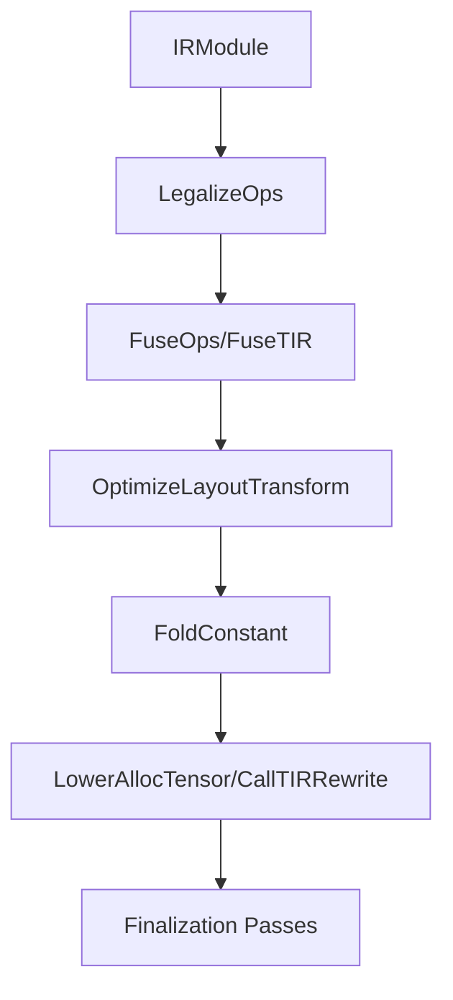

**Diagram sources**
- [src/relax/transform/legalize_ops.cc:1-200](file://src/relax/transform/legalize_ops.cc#L1-L200)
- [src/relax/transform/fuse_ops.cc:1-200](file://src/relax/transform/fuse_ops.cc#L1-L200)
- [python/tvm/relax/transform/__init__.py:20-103](file://python/tvm/relax/transform/__init__.py#L20-L103)

**Section sources**
- [src/relax/transform/legalize_ops.cc:1-200](file://src/relax/transform/legalize_ops.cc#L1-L200)
- [src/relax/transform/fuse_ops.cc:1-200](file://src/relax/transform/fuse_ops.cc#L1-L200)
- [python/tvm/relax/transform/__init__.py:20-103](file://python/tvm/relax/transform/__init__.py#L20-L103)

### Analysis Tools
- Well-formedness and structural checks
- Shape inference and layout suggestion
- Graph partitioning for distributed execution
- Memory usage estimation

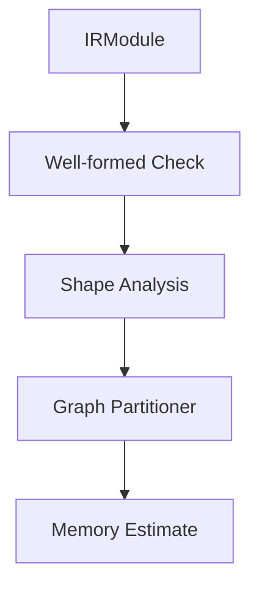

**Diagram sources**
- [src/relax/analysis/well_formed.cc:1-200](file://src/relax/analysis/well_formed.cc#L1-L200)
- [src/relax/analysis/shape_analysis.cc:1-200](file://src/relax/analysis/shape_analysis.cc#L1-L200)
- [src/relax/analysis/graph_partitioner.cc:1-200](file://src/relax/analysis/graph_partitioner.cc#L1-L200)

**Section sources**
- [src/relax/analysis/well_formed.cc:1-200](file://src/relax/analysis/well_formed.cc#L1-L200)
- [src/relax/analysis/shape_analysis.cc:1-200](file://src/relax/analysis/shape_analysis.cc#L1-L200)
- [src/relax/analysis/graph_partitioner.cc:1-200](file://src/relax/analysis/graph_partitioner.cc#L1-L200)

### Distributed Training and Quantization
- Distributed lowering and sharding propagation
- Quantization/dequantization operators and utilities
- Training utilities and optimizer integration

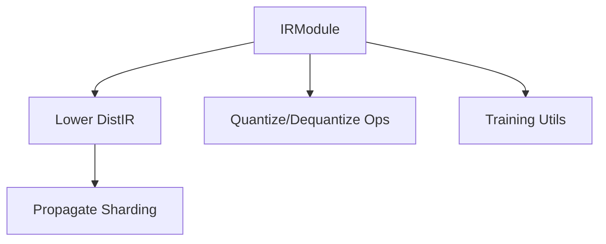

**Diagram sources**
- [src/relax/distributed/transform/lower_distir.cc:1-200](file://src/relax/distributed/transform/lower_distir.cc#L1-L200)
- [src/relax/distributed/transform/propagate_sharding.cc:1-200](file://src/relax/distributed/transform/propagate_sharding.cc#L1-L200)
- [python/tvm/relax/op/qdq.py:1-200](file://python/tvm/relax/op/qdq.py#L1-L200)
- [src/relax/training/utils.cc:1-200](file://src/relax/training/utils.cc#L1-L200)

**Section sources**
- [src/relax/distributed/transform/lower_distir.cc:1-200](file://src/relax/distributed/transform/lower_distir.cc#L1-L200)
- [src/relax/distributed/transform/propagate_sharding.cc:1-200](file://src/relax/distributed/transform/propagate_sharding.cc#L1-L200)
- [python/tvm/relax/op/qdq.py:1-200](file://python/tvm/relax/op/qdq.py#L1-L200)
- [src/relax/training/utils.cc:1-200](file://src/relax/training/utils.cc#L1-L200)

### Deployment Pipelines
- Zero pipeline: minimal optimization for quick builds
- Default build pipeline: comprehensive optimization and lowering
- Static shape tuning pipeline: integrates MetaSchedule tuning and application

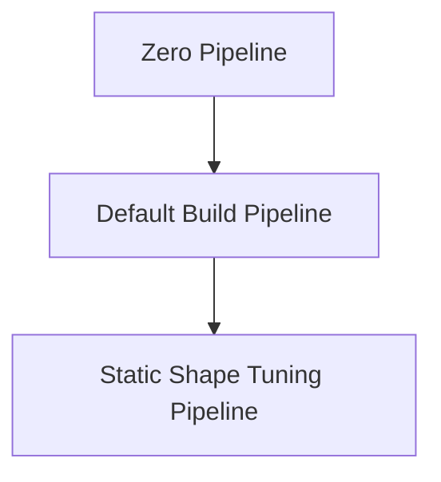

**Diagram sources**
- [python/tvm/relax/pipeline.py:33-107](file://python/tvm/relax/pipeline.py#L33-L107)
- [python/tvm/relax/pipeline.py:110-209](file://python/tvm/relax/pipeline.py#L110-L209)

**Section sources**
- [python/tvm/relax/pipeline.py:33-107](file://python/tvm/relax/pipeline.py#L33-L107)
- [python/tvm/relax/pipeline.py:110-209](file://python/tvm/relax/pipeline.py#L110-L209)

## Dependency Analysis
Relax components exhibit layered dependencies:
- Frontends depend on IR and common helpers
- Operators depend on IR and structural info
- Transformations depend on IR and analysis
- Backend dispatch depends on pattern registry and task extraction
- Pipelines orchestrate transformations and backend passes

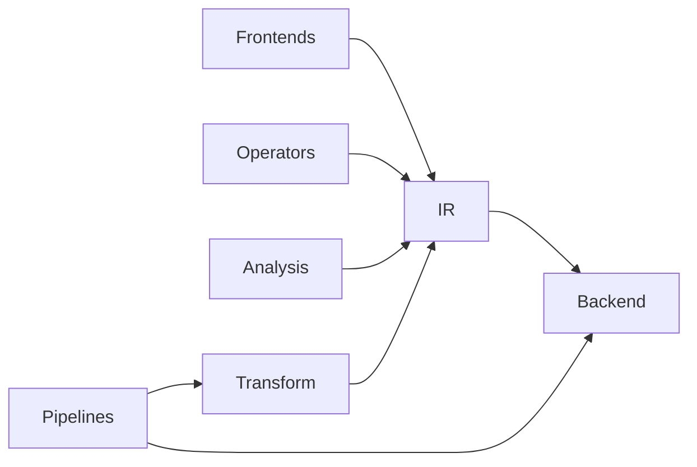

**Diagram sources**
- [python/tvm/relax/frontend/onnx/onnx_frontend.py:18-37](file://python/tvm/relax/frontend/onnx/onnx_frontend.py#L18-L37)
- [python/tvm/relax/op/__init__.py:24-179](file://python/tvm/relax/op/__init__.py#L24-L179)
- [python/tvm/relax/transform/__init__.py:20-103](file://python/tvm/relax/transform/__init__.py#L20-L103)
- [python/tvm/relax/backend/__init__.py:18-24](file://python/tvm/relax/backend/__init__.py#L18-L24)
- [python/tvm/relax/pipeline.py:80-107](file://python/tvm/relax/pipeline.py#L80-L107)

**Section sources**
- [python/tvm/relax/frontend/onnx/onnx_frontend.py:18-37](file://python/tvm/relax/frontend/onnx/onnx_frontend.py#L18-L37)
- [python/tvm/relax/op/__init__.py:24-179](file://python/tvm/relax/op/__init__.py#L24-L179)
- [python/tvm/relax/transform/__init__.py:20-103](file://python/tvm/relax/transform/__init__.py#L20-L103)
- [python/tvm/relax/backend/__init__.py:18-24](file://python/tvm/relax/backend/__init__.py#L18-L24)
- [python/tvm/relax/pipeline.py:80-107](file://python/tvm/relax/pipeline.py#L80-L107)

## Performance Considerations
- Prefer static shapes when possible to enable aggressive optimizations
- Use layout optimization and fused operations to reduce memory bandwidth
- Apply constant folding and dead-code elimination early in the pipeline
- Leverage MetaSchedule tuning for target-specific schedules
- Utilize quantization-aware passes for deployment scenarios

[No sources needed since this section provides general guidance]

## Troubleshooting Guide
- Use well-formed checks and shape analysis to catch IR inconsistencies
- Employ autopadding utilities to handle dynamic shapes in convolutional layers
- Detach parameters from IRModule for cleaner parameter handling
- Inspect backend dispatch and pattern registry to debug target-specific issues
- Use print/assert ops for runtime diagnostics

**Section sources**
- [src/relax/analysis/well_formed.cc:1-200](file://src/relax/analysis/well_formed.cc#L1-L200)
- [src/relax/analysis/shape_analysis.cc:1-200](file://src/relax/analysis/shape_analysis.cc#L1-L200)
- [python/tvm/relax/frontend/common.py:26-55](file://python/tvm/relax/frontend/common.py#L26-L55)
- [src/relax/backend/pattern_registry.cc:1-200](file://src/relax/backend/pattern_registry.cc#L1-L200)
- [python/tvm/relax/op/base.py:498-617](file://python/tvm/relax/op/base.py#L498-L617)

## Conclusion
Relax provides a robust, extensible framework for advanced model development. Its frontend adapters enable importing from popular frameworks, while the transformation and analysis systems deliver strong optimization and verification capabilities. The backend and pipeline infrastructure streamline deployment across diverse targets, and the training utilities integrate seamlessly with modern ML workflows.

[No sources needed since this section summarizes without analyzing specific files]

## Appendices

### Practical Examples Index
- Importing ONNX models: see operator registry and converter classes
- Developing custom operators: see call_tir and gradient registration
- Graph optimization: see transformation passes and pipelines
- Frontend adapter extension: see operator mapping and converter patterns
- Analysis and verification: see well-formedness and shape analysis
- Distributed and quantization: see distributed lowering and Q/DQ ops
- Testing utilities: see Relax testing modules

[No sources needed since this section indexes without analyzing specific files]