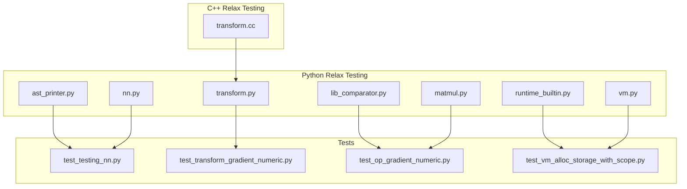
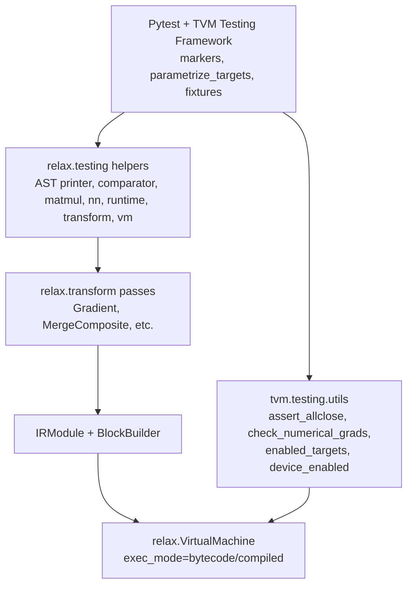
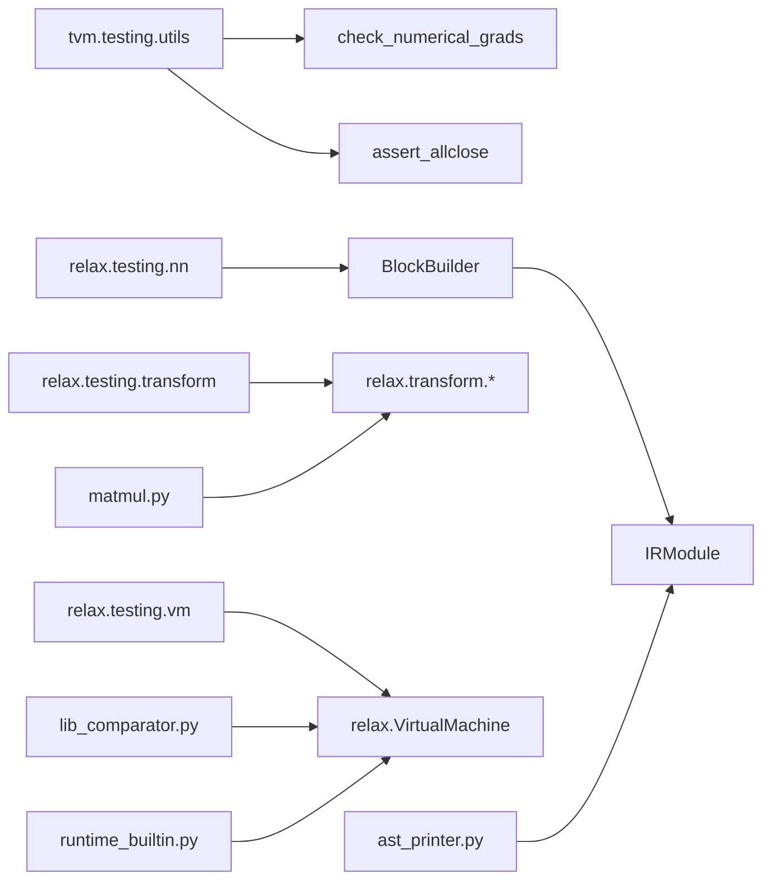

# Testing Utilities

<cite>
**Referenced Files in This Document**
- [__init__.py](file://python/tvm/testing/__init__.py)
- [utils.py](file://python/tvm/testing/utils.py)
- [ast_printer.py](file://python/tvm/relax/testing/ast_printer.py)
- [lib_comparator.py](file://python/tvm/relax/testing/lib_comparator.py)
- [matmul.py](file://python/tvm/relax/testing/matmul.py)
- [nn.py](file://python/tvm/relax/testing/nn.py)
- [runtime_builtin.py](file://python/tvm/relax/testing/runtime_builtin.py)
- [transform.py](file://python/tvm/relax/testing/transform.py)
- [vm.py](file://python/tvm/relax/testing/vm.py)
- [transform.cc](file://src/relax/testing/transform.cc)
- [test_testing_nn.py](file://tests/python/relax/test_testing_nn.py)
- [test_transform_gradient_numeric.py](file://tests/python/relax/test_transform_gradient_numeric.py)
- [test_op_gradient_numeric.py](file://tests/python/relax/test_op_gradient_numeric.py)
- [test_vm_alloc_storage_with_scope.py](file://tests/python/relax/test_vm_alloc_storage_with_scope.py)
- [relax_vm.rst](file://docs/arch/relax_vm.rst)
</cite>

## Table of Contents
1. [Introduction](#introduction)
2. [Project Structure](#project-structure)
3. [Core Components](#core-components)
4. [Architecture Overview](#architecture-overview)
5. [Detailed Component Analysis](#detailed-component-analysis)
6. [Dependency Analysis](#dependency-analysis)
7. [Performance Considerations](#performance-considerations)
8. [Troubleshooting Guide](#troubleshooting-guide)
9. [Conclusion](#conclusion)
10. [Appendices](#appendices)

## Introduction
This document describes the Relax testing utilities that facilitate development, debugging, and validation of Relax programs. It covers:
- AST printer for program visualization
- Library comparator for numerical accuracy validation
- Matrix multiplication test utilities
- Neural network testing helpers
- Runtime built-in testing
- Transformation testing
- VM testing utilities
It also explains the testing framework architecture, assertion mechanisms, and debugging tools for Relax programs, and provides practical examples and best practices for testing Relax extensions, performance regression testing, and continuous integration workflows.

## Project Structure
Relax testing utilities live primarily under:
- python/tvm/relax/testing: Python-side testing helpers for Relax
- src/relax/testing: C++-side testing helpers for Relax passes
- tests/python/relax: Example tests exercising these utilities

**Diagram sources**
- [ast_printer.py](file://python/tvm/relax/testing/ast_printer.py)
- [lib_comparator.py](file://python/tvm/relax/testing/lib_comparator.py)
- [matmul.py](file://python/tvm/relax/testing/matmul.py)
- [nn.py](file://python/tvm/relax/testing/nn.py)
- [runtime_builtin.py](file://python/tvm/relax/testing/runtime_builtin.py)
- [transform.py](file://python/tvm/relax/testing/transform.py)
- [vm.py](file://python/tvm/relax/testing/vm.py)
- [transform.cc](file://src/relax/testing/transform.cc)
- [test_testing_nn.py](file://tests/python/relax/test_testing_nn.py)
- [test_transform_gradient_numeric.py](file://tests/python/relax/test_transform_gradient_numeric.py)
- [test_op_gradient_numeric.py](file://tests/python/relax/test_op_gradient_numeric.py)
- [test_vm_alloc_storage_with_scope.py](file://tests/python/relax/test_vm_alloc_storage_with_scope.py)

**Section sources**
- [__init__.py](file://python/tvm/testing/__init__.py)
- [utils.py](file://python/tvm/testing/utils.py)

## Core Components
- Relax testing helpers (Python): AST printer, library comparator, matrix multiplication utilities, neural network helpers, runtime built-ins, transformation utilities, VM utilities
- C++ transformation testing pass: a minimal pass used for testing pass infrastructure
- Example tests: demonstrate usage of helpers for structural equality, gradient numeric validation, VM allocation, and NN module emission

Key capabilities:
- Structural equality assertions for Relax IR modules
- Numerical gradient checks via finite differences
- VM execution and storage allocation verification
- NN module definition and subroutine emission
- Pass registration and invocation for transformation testing

**Section sources**
- [ast_printer.py](file://python/tvm/relax/testing/ast_printer.py)
- [lib_comparator.py](file://python/tvm/relax/testing/lib_comparator.py)
- [matmul.py](file://python/tvm/relax/testing/matmul.py)
- [nn.py](file://python/tvm/relax/testing/nn.py)
- [runtime_builtin.py](file://python/tvm/relax/testing/runtime_builtin.py)
- [transform.py](file://python/tvm/relax/testing/transform.py)
- [vm.py](file://python/tvm/relax/testing/vm.py)
- [transform.cc](file://src/relax/testing/transform.cc)
- [test_testing_nn.py](file://tests/python/relax/test_testing_nn.py)
- [test_transform_gradient_numeric.py](file://tests/python/relax/test_transform_gradient_numeric.py)
- [test_op_gradient_numeric.py](file://tests/python/relax/test_op_gradient_numeric.py)
- [test_vm_alloc_storage_with_scope.py](file://tests/python/relax/test_vm_alloc_storage_with_scope.py)

## Architecture Overview
The Relax testing utilities integrate with TVM’s pytest-based testing framework and leverage TVM’s compilation and VM runtime for validation.

**Diagram sources**
- [utils.py](file://python/tvm/testing/utils.py)
- [nn.py](file://python/tvm/relax/testing/nn.py)
- [lib_comparator.py](file://python/tvm/relax/testing/lib_comparator.py)
- [matmul.py](file://python/tvm/relax/testing/matmul.py)
- [runtime_builtin.py](file://python/tvm/relax/testing/runtime_builtin.py)
- [transform.py](file://python/tvm/relax/testing/transform.py)
- [vm.py](file://python/tvm/relax/testing/vm.py)
- [relax_vm.rst](file://docs/arch/relax_vm.rst)

## Detailed Component Analysis

### AST Printer for Program Visualization
Purpose:
- Print Relax IR modules and expressions in a human-readable form for debugging and inspection.

Typical usage:
- Print an IRModule or Relax expression to stdout for comparison or diffing
- Useful in tests to visualize intermediate or final IR after transformations

Integration:
- Called from tests to aid debugging and documentation of IR changes

**Section sources**
- [ast_printer.py](file://python/tvm/relax/testing/ast_printer.py)

### Library Comparator for Numerical Accuracy Validation
Purpose:
- Compare Relax-generated libraries/executables against expected numerical behavior, often used alongside gradient checks.

Typical usage:
- Build a Relax module, compile to a library, and compare outputs against reference computations
- Validate numerical stability and correctness across targets

Integration:
- Works with TVM’s compilation pipeline and VirtualMachine for evaluation

**Section sources**
- [lib_comparator.py](file://python/tvm/relax/testing/lib_comparator.py)

### Matrix Multiplication Test Utilities
Purpose:
- Provide helpers and patterns for testing Relax matrix multiplication operations and related transformations.

Typical usage:
- Construct IRModules with matmul ops
- Apply Relax transforms (e.g., Gradient)
- Verify numerical gradients and structural changes

Integration:
- Used in conjunction with gradient numeric tests and VM execution

**Section sources**
- [matmul.py](file://python/tvm/relax/testing/matmul.py)
- [test_transform_gradient_numeric.py](file://tests/python/relax/test_transform_gradient_numeric.py)
- [test_op_gradient_numeric.py](file://tests/python/relax/test_op_gradient_numeric.py)

### Neural Network Testing Helpers
Purpose:
- Simplify construction and validation of neural network modules and subroutines in Relax.

Typical usage:
- Define nn.Module subclasses
- Emit operations and parameters
- Use BlockBuilder to construct IRModules
- Assert structural equality with expected modules

Integration:
- Demonstrated in tests that validate emission and subroutine definition

**Section sources**
- [nn.py](file://python/tvm/relax/testing/nn.py)
- [test_testing_nn.py](file://tests/python/relax/test_testing_nn.py)

### Runtime Built-in Testing
Purpose:
- Validate Relax runtime built-ins (e.g., vm.alloc_storage, vm.alloc_tensor) and their semantics.

Typical usage:
- Allocate storage and tensors in VM mode
- Invoke prim_func operators bound to Relax ops
- Verify outputs and memory scopes

Integration:
- Tests exercise VM allocation APIs and prim_func interop

**Section sources**
- [runtime_builtin.py](file://python/tvm/relax/testing/runtime_builtin.py)
- [test_vm_alloc_storage_with_scope.py](file://tests/python/relax/test_vm_alloc_storage_with_scope.py)
- [relax_vm.rst](file://docs/arch/relax_vm.rst)

### Transformation Testing Utilities
Purpose:
- Provide minimal pass scaffolding and helpers for testing Relax transformations.

Typical usage:
- Register and invoke passes (e.g., a no-op mutator) to validate pass infrastructure
- Compose with other Relax transforms in tests

Integration:
- C++ pass registered via FFI static init for testing pass invocation

**Section sources**
- [transform.py](file://python/tvm/relax/testing/transform.py)
- [transform.cc](file://src/relax/testing/transform.cc)

### VM Testing Utilities
Purpose:
- Exercise Relax VirtualMachine execution modes and storage allocation.

Typical usage:
- Compile IRModule to executable
- Run with VirtualMachine in bytecode or compiled mode
- Validate outputs and allocations

Integration:
- Tests demonstrate VM allocation and prim_func operator usage

**Section sources**
- [vm.py](file://python/tvm/relax/testing/vm.py)
- [test_vm_alloc_storage_with_scope.py](file://tests/python/relax/test_vm_alloc_storage_with_scope.py)
- [relax_vm.rst](file://docs/arch/relax_vm.rst)

### Testing Framework Architecture and Assertion Mechanisms
Framework highlights:
- Pytest markers and decorators for device/target selection
- Parametrized targets via tvm.testing.parametrize_targets
- Assertions for numerical closeness and structural equality
- Gradient checks using finite differences

Key functions and concepts:
- assert_allclose: NumPy-style numerical comparison with shape and value checks
- check_numerical_grads: Finite-difference gradient validation with adaptive precision
- enabled_targets/device_enabled: Target availability and selection
- parametrize_targets: Controlled execution across targets

Practical examples:
- Gradient numeric tests validate adjoint outputs against finite-difference approximations
- NN module tests assert structural equality between generated and expected IRModules

**Section sources**
- [utils.py](file://python/tvm/testing/utils.py)
- [test_transform_gradient_numeric.py](file://tests/python/relax/test_transform_gradient_numeric.py)
- [test_op_gradient_numeric.py](file://tests/python/relax/test_op_gradient_numeric.py)
- [test_testing_nn.py](file://tests/python/relax/test_testing_nn.py)

### Debugging Tools for Relax Programs
Recommended approaches:
- Use AST printer to visualize IR before and after transformations
- Compare IRModules using structural equality assertions
- Validate numerical gradients with finite differences
- Inspect VM bytecode vs compiled execution modes for performance and correctness
- Leverage TVM’s compilation and runtime diagnostics

**Section sources**
- [ast_printer.py](file://python/tvm/relax/testing/ast_printer.py)
- [utils.py](file://python/tvm/testing/utils.py)
- [relax_vm.rst](file://docs/arch/relax_vm.rst)

## Dependency Analysis
High-level dependencies among Relax testing components:

**Diagram sources**
- [utils.py](file://python/tvm/testing/utils.py)
- [nn.py](file://python/tvm/relax/testing/nn.py)
- [transform.py](file://python/tvm/relax/testing/transform.py)
- [vm.py](file://python/tvm/relax/testing/vm.py)
- [lib_comparator.py](file://python/tvm/relax/testing/lib_comparator.py)
- [matmul.py](file://python/tvm/relax/testing/matmul.py)
- [runtime_builtin.py](file://python/tvm/relax/testing/runtime_builtin.py)
- [ast_printer.py](file://python/tvm/relax/testing/ast_printer.py)

**Section sources**
- [utils.py](file://python/tvm/testing/utils.py)
- [nn.py](file://python/tvm/relax/testing/nn.py)
- [transform.py](file://python/tvm/relax/testing/transform.py)
- [vm.py](file://python/tvm/relax/testing/vm.py)
- [lib_comparator.py](file://python/tvm/relax/testing/lib_comparator.py)
- [matmul.py](file://python/tvm/relax/testing/matmul.py)
- [runtime_builtin.py](file://python/tvm/relax/testing/runtime_builtin.py)
- [ast_printer.py](file://python/tvm/relax/testing/ast_printer.py)

## Performance Considerations
- Prefer compiled execution mode for VM-heavy tests to reduce interpreter overhead
- Use parametrize_targets to limit test scope to relevant targets
- Minimize large random tensor generation in favor of smaller, targeted shapes for faster iteration
- Cache compiled executables when appropriate to speed up repeated runs

[No sources needed since this section provides general guidance]

## Troubleshooting Guide
Common issues and remedies:
- Target not runnable: Use enabled_targets/device_enabled to filter supported targets
- Gradient mismatch: Increase rtol/atol or adjust delta in check_numerical_grads; verify function continuity and smoothness
- VM allocation failures: Confirm storage scope and device index; ensure prim_func signatures match
- Structural equality failures: Use AST printer to diff IRModules and align shapes/dtypes

**Section sources**
- [utils.py](file://python/tvm/testing/utils.py)
- [test_vm_alloc_storage_with_scope.py](file://tests/python/relax/test_vm_alloc_storage_with_scope.py)
- [test_transform_gradient_numeric.py](file://tests/python/relax/test_transform_gradient_numeric.py)

## Conclusion
Relax testing utilities provide a cohesive toolkit for validating correctness, numerical accuracy, and performance of Relax programs. By combining IR visualization, structural equality assertions, numerical gradient checks, VM execution, and transformation scaffolding, developers can build robust tests for Relax extensions and integrations.

[No sources needed since this section summarizes without analyzing specific files]

## Appendices

### Practical Examples Index
- Writing tests for Relax transformations: see transformation gradient numeric tests
- Validating numerical correctness: see op and transform gradient numeric tests
- Debugging compilation issues: use AST printer and structural equality assertions
- Testing VM allocation and runtime built-ins: see VM allocation tests

**Section sources**
- [test_transform_gradient_numeric.py](file://tests/python/relax/test_transform_gradient_numeric.py)
- [test_op_gradient_numeric.py](file://tests/python/relax/test_op_gradient_numeric.py)
- [test_vm_alloc_storage_with_scope.py](file://tests/python/relax/test_vm_alloc_storage_with_scope.py)
- [test_testing_nn.py](file://tests/python/relax/test_testing_nn.py)