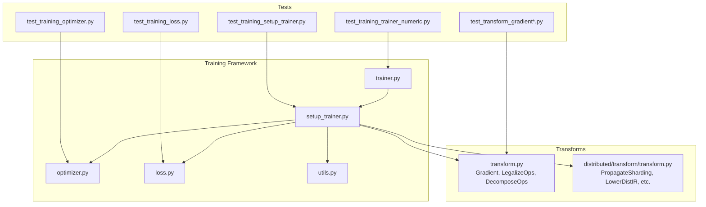
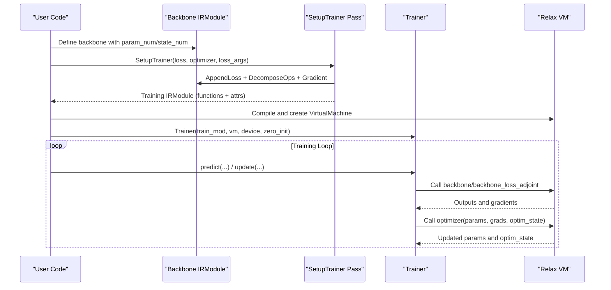
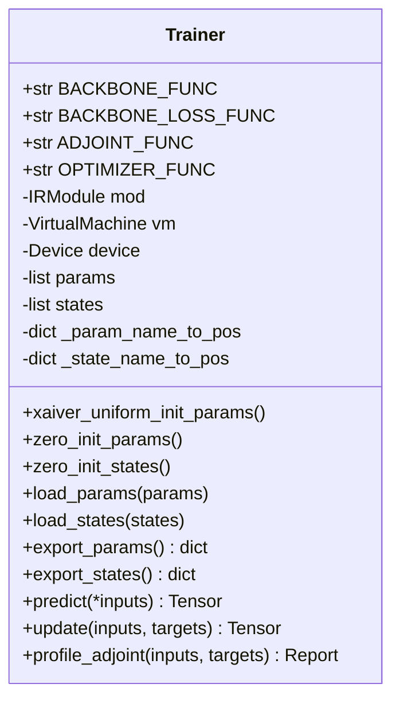
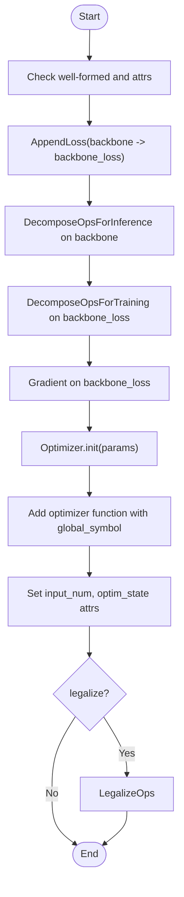
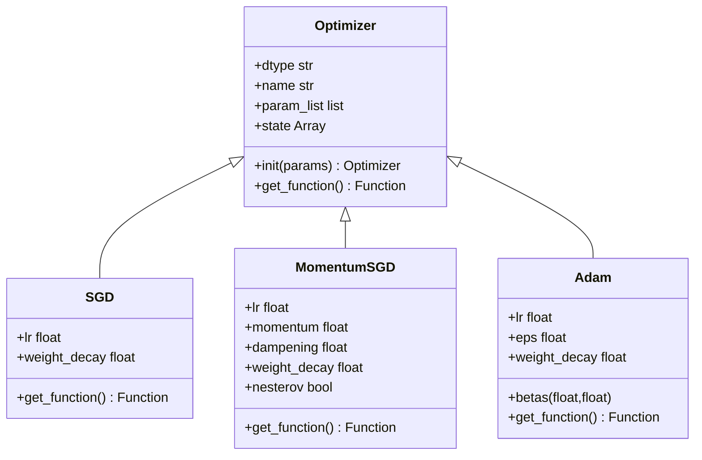
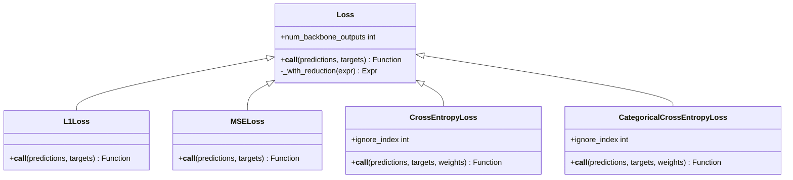
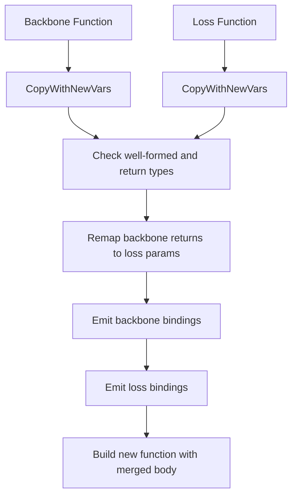
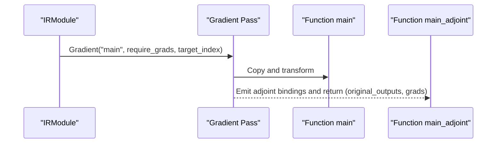
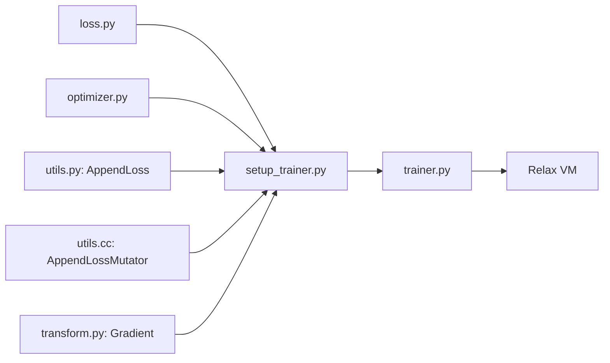

# Training Extensions

<cite>
**Referenced Files in This Document**
- [__init__.py](file://python/tvm/relax/training/__init__.py)
- [trainer.py](file://python/tvm/relax/training/trainer.py)
- [setup_trainer.py](file://python/tvm/relax/training/setup_trainer.py)
- [optimizer.py](file://python/tvm/relax/training/optimizer.py)
- [loss.py](file://python/tvm/relax/training/loss.py)
- [utils.py](file://python/tvm/relax/training/utils.py)
- [utils.h](file://src/relax/training/utils.h)
- [utils.cc](file://src/relax/training/utils.cc)
- [transform.py](file://python/tvm/relax/transform/transform.py)
- [transform.py](file://python/tvm/relax/distributed/transform/transform.py)
- [test_training_loss.py](file://tests/python/relax/test_training_loss.py)
- [test_training_optimizer.py](file://tests/python/relax/test_training_optimizer.py)
- [test_training_setup_trainer.py](file://tests/python/relax/test_training_setup_trainer.py)
- [test_training_trainer_numeric.py](file://tests/python/relax/test_training_trainer_numeric.py)
- [test_transform_gradient.py](file://tests/python/relax/test_transform_gradient.py)
- [test_transform_gradient_numeric.py](file://tests/python/relax/test_transform_gradient_numeric.py)
</cite>

## Table of Contents
1. [Introduction](#introduction)
2. [Project Structure](#project-structure)
3. [Core Components](#core-components)
4. [Architecture Overview](#architecture-overview)
5. [Detailed Component Analysis](#detailed-component-analysis)
6. [Dependency Analysis](#dependency-analysis)
7. [Performance Considerations](#performance-considerations)
8. [Troubleshooting Guide](#troubleshooting-guide)
9. [Conclusion](#conclusion)
10. [Appendices](#appendices)

## Introduction
This document explains Relax’s training extensions that enable end-to-end machine learning training workflows. It covers the trainer framework, optimizer implementations, loss function definitions, and training setup utilities. It also documents the integration between Relax IR and training loops, automatic differentiation support, and distributed training capabilities. Practical examples show how to configure training, define custom optimizers, implement loss functions, and manage training checkpoints. Finally, it describes the relationship with Relax transformations for training optimization, memory management during training, and performance considerations, including distributed training patterns and gradient computation strategies.

## Project Structure
The training extensions live under the Relax Python package and integrate with Relax transformations and distributed passes. The core modules are:
- Training framework: Trainer, SetupTrainer pass, optimizer abstractions, loss functions, and utilities
- Transformation infrastructure: Automatic differentiation, decomposition passes, and distributed lowering
- Tests: Unit and numeric validation for training components

**Diagram sources**
- [trainer.py:1-396](file://python/tvm/relax/training/trainer.py#L1-L396)
- [setup_trainer.py:1-213](file://python/tvm/relax/training/setup_trainer.py#L1-L213)
- [optimizer.py:1-716](file://python/tvm/relax/training/optimizer.py#L1-L716)
- [loss.py:1-383](file://python/tvm/relax/training/loss.py#L1-L383)
- [utils.py:1-207](file://python/tvm/relax/training/utils.py#L1-L207)
- [transform.py:55-200](file://python/tvm/relax/transform/transform.py#L55-L200)
- [transform.py:25-69](file://python/tvm/relax/distributed/transform/transform.py#L25-L69)
- [test_training_loss.py:39-105](file://tests/python/relax/test_training_loss.py#L39-L105)
- [test_training_optimizer.py:1-39](file://tests/python/relax/test_training_optimizer.py#L1-L39)
- [test_training_setup_trainer.py:1-233](file://tests/python/relax/test_training_setup_trainer.py#L1-L233)
- [test_training_trainer_numeric.py:1-126](file://tests/python/relax/test_training_trainer_numeric.py#L1-L126)
- [test_transform_gradient.py:105-206](file://tests/python/relax/test_transform_gradient.py#L105-L206)
- [test_transform_gradient_numeric.py:104-184](file://tests/python/relax/test_transform_gradient_numeric.py#L104-L184)

**Section sources**
- [__init__.py:18-28](file://python/tvm/relax/training/__init__.py#L18-L28)
- [trainer.py:28-116](file://python/tvm/relax/training/trainer.py#L28-L116)
- [setup_trainer.py:34-110](file://python/tvm/relax/training/setup_trainer.py#L34-L110)
- [optimizer.py:34-100](file://python/tvm/relax/training/optimizer.py#L34-L100)
- [loss.py:43-99](file://python/tvm/relax/training/loss.py#L43-L99)
- [utils.py:32-160](file://python/tvm/relax/training/utils.py#L32-L160)
- [transform.py:55-200](file://python/tvm/relax/transform/transform.py#L55-L200)
- [transform.py:25-69](file://python/tvm/relax/distributed/transform/transform.py#L25-L69)

## Core Components
- Trainer: Unified wrapper around a compiled training module. Manages parameters, states, optimizer states, and exposes predict/update/profile APIs.
- SetupTrainer: Pass that transforms a backbone module into a training-ready module by appending loss, decomposing ops, computing gradients, and injecting an optimizer function.
- Optimizer: Abstraction for optimizers with state initialization and function generation. Includes SGD, MomentumSGD, and Adam.
- Loss: Library of loss functions (L1, MSE, CrossEntropy, CategoricalCrossEntropy) with reduction modes and AppendLoss utility.
- Utilities: AppendLoss pass (C++ implementation), TE gradient registration hook, and training module attribute conventions.

Key training module attributes produced by SetupTrainer:
- input_num, param_num, state_num
- optim_state (initial optimizer state)
- Functions: backbone, backbone_loss, backbone_loss_adjoint, optimizer

**Section sources**
- [trainer.py:28-396](file://python/tvm/relax/training/trainer.py#L28-L396)
- [setup_trainer.py:34-213](file://python/tvm/relax/training/setup_trainer.py#L34-L213)
- [optimizer.py:34-716](file://python/tvm/relax/training/optimizer.py#L34-L716)
- [loss.py:43-383](file://python/tvm/relax/training/loss.py#L43-L383)
- [utils.py:32-207](file://python/tvm/relax/training/utils.py#L32-L207)

## Architecture Overview
The training workflow integrates Relax IR transformations and VM execution:
- Build a backbone IRModule with param_num and state_num attributes
- Apply SetupTrainer to produce a training module with loss, adjoint, and optimizer
- Legalize and compile the module; run via Relax VirtualMachine
- Use Trainer to orchestrate predict/update cycles and manage states

**Diagram sources**
- [setup_trainer.py:172-213](file://python/tvm/relax/training/setup_trainer.py#L172-L213)
- [trainer.py:258-396](file://python/tvm/relax/training/trainer.py#L258-L396)
- [transform.py:55-200](file://python/tvm/relax/transform/transform.py#L55-L200)

## Detailed Component Analysis

### Trainer
The Trainer class encapsulates training execution:
- Maintains parameter and state tensors and maps names to positions
- Supports initialization strategies (zero/Xavier uniform), loading/exporting parameters/states
- Provides predict, update, and profiling APIs
- Uses the compiled IRModule’s backbone_loss_adjoint to compute gradients and optimizer to update parameters

**Diagram sources**
- [trainer.py:28-396](file://python/tvm/relax/training/trainer.py#L28-L396)

**Section sources**
- [trainer.py:28-116](file://python/tvm/relax/training/trainer.py#L28-L116)
- [trainer.py:121-153](file://python/tvm/relax/training/trainer.py#L121-L153)
- [trainer.py:154-221](file://python/tvm/relax/training/trainer.py#L154-L221)
- [trainer.py:222-241](file://python/tvm/relax/training/trainer.py#L222-L241)
- [trainer.py:258-396](file://python/tvm/relax/training/trainer.py#L258-L396)

### SetupTrainer Pass
SetupTrainer validates the backbone module and produces a training module:
- Validates well-formedness, presence of backbone function, and param/state counts
- Appends loss via AppendLoss
- Decomposes ops for inference and training separately
- Computes gradients using Gradient pass
- Injects optimizer function with global symbol and initial state
- Optionally legalizes the module

**Diagram sources**
- [setup_trainer.py:128-213](file://python/tvm/relax/training/setup_trainer.py#L128-L213)

**Section sources**
- [setup_trainer.py:128-171](file://python/tvm/relax/training/setup_trainer.py#L128-L171)
- [setup_trainer.py:172-213](file://python/tvm/relax/training/setup_trainer.py#L172-L213)

### Optimizer Implementations
The Optimizer base class defines the interface and state handling. Concrete implementations:
- SGD: supports learning rate and weight decay; tracks step count
- MomentumSGD: supports momentum, damping, Nesterov, and weight decay; tracks per-parameter velocities
- Adam: supports betas, epsilon, and weight decay; tracks step, beta products, first/second moments

Each optimizer:
- Validates parameter dtypes and uniqueness
- Initializes state tensors
- Generates a Relax Function via BlockBuilder that updates parameters and states

**Diagram sources**
- [optimizer.py:34-100](file://python/tvm/relax/training/optimizer.py#L34-L100)
- [optimizer.py:241-350](file://python/tvm/relax/training/optimizer.py#L241-L350)
- [optimizer.py:352-510](file://python/tvm/relax/training/optimizer.py#L352-L510)
- [optimizer.py:512-716](file://python/tvm/relax/training/optimizer.py#L512-L716)

**Section sources**
- [optimizer.py:113-177](file://python/tvm/relax/training/optimizer.py#L113-L177)
- [optimizer.py:241-350](file://python/tvm/relax/training/optimizer.py#L241-L350)
- [optimizer.py:352-510](file://python/tvm/relax/training/optimizer.py#L352-L510)
- [optimizer.py:512-716](file://python/tvm/relax/training/optimizer.py#L512-L716)

### Loss Functions
The Loss base class defines reduction semantics and the number of backbone outputs. Built-in losses:
- L1Loss: absolute difference with reduction
- MSELoss: squared difference with reduction
- CrossEntropyLoss: log_softmax + nll_loss with optional ignore_index and weights
- CategoricalCrossEntropyLoss: converts one-hot targets to labels, log_softmax, and optionally nll_loss or direct product

Loss functions return Relax Functions with a global symbol and accept predictions/targets (and optional weights).

**Diagram sources**
- [loss.py:43-121](file://python/tvm/relax/training/loss.py#L43-L121)
- [loss.py:123-170](file://python/tvm/relax/training/loss.py#L123-L170)
- [loss.py:172-220](file://python/tvm/relax/training/loss.py#L172-L220)
- [loss.py:222-291](file://python/tvm/relax/training/loss.py#L222-L291)
- [loss.py:293-383](file://python/tvm/relax/training/loss.py#L293-L383)

**Section sources**
- [loss.py:43-121](file://python/tvm/relax/training/loss.py#L43-L121)
- [loss.py:123-220](file://python/tvm/relax/training/loss.py#L123-L220)
- [loss.py:222-383](file://python/tvm/relax/training/loss.py#L222-L383)

### AppendLoss Utility and Implementation
AppendLoss composes a backbone function with a loss function into a single dataflowblock:
- Restricts backbone to one dataflowblock and returns either a Var or a tuple
- Restricts loss to return a scalar
- Remaps backbone outputs to loss inputs and merges bodies
- Exposed in Python via utils.AppendLoss and implemented in C++ with AppendLossMutator

**Diagram sources**
- [utils.py:32-160](file://python/tvm/relax/training/utils.py#L32-L160)
- [utils.h:34-54](file://src/relax/training/utils.h#L34-L54)
- [utils.cc:40-207](file://src/relax/training/utils.cc#L40-L207)

**Section sources**
- [utils.py:32-160](file://python/tvm/relax/training/utils.py#L32-L160)
- [utils.h:34-54](file://src/relax/training/utils.h#L34-L54)
- [utils.cc:40-207](file://src/relax/training/utils.cc#L40-L207)

### Automatic Differentiation Integration
Automatic differentiation is integrated via the Gradient transform:
- Produces a function named <original>_adjoint
- Supports checkpointing and computes gradients with respect to specified parameters
- Used by SetupTrainer to generate backbone_loss_adjoint

**Diagram sources**
- [transform.py:55-200](file://python/tvm/relax/transform/transform.py#L55-L200)
- [setup_trainer.py:192-192](file://python/tvm/relax/training/setup_trainer.py#L192-L192)

**Section sources**
- [transform.py:55-200](file://python/tvm/relax/transform/transform.py#L55-L200)
- [setup_trainer.py:192-192](file://python/tvm/relax/training/setup_trainer.py#L192-L192)

### Distributed Training Capabilities
Distributed passes operate on DistIR and lower it to Relax/TIR:
- PropagateSharding: propagate sharding annotations
- LowerGlobalViewToLocalView: lower global view to local view
- LegalizeRedistribute: legalize redistribute to collective ops
- LowerDistIR: lower DistIR constructs to Relax/TIR

These passes complement training by enabling sharded execution and communication primitives.

**Section sources**
- [transform.py:25-69](file://python/tvm/relax/distributed/transform/transform.py#L25-L69)

## Dependency Analysis
The training framework composes several modules:
- Trainer depends on compiled IRModule and VM
- SetupTrainer depends on Loss, Optimizer, AppendLoss, DecomposeOps, Gradient, and LegalizeOps
- Optimizer and Loss generate Relax Functions consumed by SetupTrainer
- AppendLoss is implemented in C++ and exposed to Python

**Diagram sources**
- [setup_trainer.py:29-31](file://python/tvm/relax/training/setup_trainer.py#L29-L31)
- [utils.py:32-160](file://python/tvm/relax/training/utils.py#L32-L160)
- [utils.cc:209-232](file://src/relax/training/utils.cc#L209-L232)
- [transform.py:55-200](file://python/tvm/relax/transform/transform.py#L55-L200)
- [trainer.py:28-116](file://python/tvm/relax/training/trainer.py#L28-L116)

**Section sources**
- [setup_trainer.py:29-31](file://python/tvm/relax/training/setup_trainer.py#L29-L31)
- [utils.py:32-160](file://python/tvm/relax/training/utils.py#L32-L160)
- [utils.cc:209-232](file://src/relax/training/utils.cc#L209-L232)
- [transform.py:55-200](file://python/tvm/relax/transform/transform.py#L55-L200)
- [trainer.py:28-116](file://python/tvm/relax/training/trainer.py#L28-L116)

## Performance Considerations
- Legalization and decomposition: SetupTrainer optionally legalizes the module to lower Relax ops to TIR functions, improving execution performance on target hardware.
- Memory management: DecomposeOpsForTraining and DecomposeOpsForInference adjust operator behavior for training vs inference, potentially affecting memory footprint.
- Gradient checkpointing: The Gradient pass supports checkpointing to reduce peak memory usage during backpropagation.
- Initialization strategies: Xavier uniform initialization can improve convergence for deep networks.
- Profiling: Trainer.profile_adjoint leverages VM profiling to analyze performance.

[No sources needed since this section provides general guidance]

## Troubleshooting Guide
Common issues and resolutions:
- Invalid backbone module: Ensure the module is well-formed, contains a backbone function, and has param_num and state_num attributes.
- Missing or mismatched parameters/states: Verify the number of parameters and states matches the module attributes and function signatures.
- Dtype mismatches: Optimizers require floating-point tensor dtypes; ensure all parameters share the same dtype.
- Static shapes requirement: Some initialization routines require static shapes.
- Training module attributes: Confirm input_num, param_num, state_num, and optim_state are present after SetupTrainer.

**Section sources**
- [setup_trainer.py:128-171](file://python/tvm/relax/training/setup_trainer.py#L128-L171)
- [optimizer.py:138-170](file://python/tvm/relax/training/optimizer.py#L138-L170)
- [trainer.py:140-153](file://python/tvm/relax/training/trainer.py#L140-L153)

## Conclusion
Relax’s training extensions provide a cohesive framework for end-to-end ML training:
- SetupTrainer composes a backbone with loss, gradients, and an optimizer into a single training module
- Trainer offers a simple API to run training loops, manage parameters and states, and profile execution
- Optimizers and loss functions are expressed as Relax Functions, enabling seamless compilation and execution
- Automatic differentiation and distributed passes integrate naturally with the training pipeline
Adhering to the documented patterns yields efficient, portable training workflows across diverse hardware backends.

[No sources needed since this section summarizes without analyzing specific files]

## Appendices

### Practical Examples

- Setting up training configuration
  - Define a backbone IRModule with param_num and state_num attributes
  - Instantiate SetupTrainer with a Loss and an Optimizer and call it on the backbone
  - Legalize and compile the resulting module; create a Relax VirtualMachine
  - Wrap with Trainer and initialize parameters/states

  **Section sources**
  - [setup_trainer.py:172-213](file://python/tvm/relax/training/setup_trainer.py#L172-L213)
  - [test_training_setup_trainer.py:31-98](file://tests/python/relax/test_training_setup_trainer.py#L31-L98)

- Defining custom optimizers
  - Subclass Optimizer and implement init and get_function
  - Use BlockBuilder to emit parameter updates and state transitions
  - Register the optimizer function with a global symbol

  **Section sources**
  - [optimizer.py:34-100](file://python/tvm/relax/training/optimizer.py#L34-L100)
  - [optimizer.py:178-227](file://python/tvm/relax/training/optimizer.py#L178-L227)

- Implementing loss functions
  - Subclass Loss and implement __call__ to return a Relax Function
  - Use reduction modes (mean, sum, none) and compose with nn ops as needed

  **Section sources**
  - [loss.py:43-121](file://python/tvm/relax/training/loss.py#L43-L121)
  - [loss.py:123-220](file://python/tvm/relax/training/loss.py#L123-L220)

- Managing training checkpoints
  - Use Trainer.load_params/load_states and export_params/export_states for persistence
  - Initialize with zero_init_param_state to enforce static shapes

  **Section sources**
  - [trainer.py:154-241](file://python/tvm/relax/training/trainer.py#L154-L241)
  - [trainer.py:113-116](file://python/tvm/relax/training/trainer.py#L113-L116)

- Distributed training patterns
  - Apply distributed passes (PropagateSharding, LowerGlobalViewToLocalView, LegalizeRedistribute, LowerDistIR) to prepare modules for sharded execution

  **Section sources**
  - [transform.py:25-69](file://python/tvm/relax/distributed/transform/transform.py#L25-L69)

- Gradient computation strategies
  - Use Gradient to generate adjoint functions; leverage checkpointing to reduce memory
  - Combine with DecomposeOpsForTraining for training-specific operator behavior

  **Section sources**
  - [transform.py:55-200](file://python/tvm/relax/transform/transform.py#L55-L200)
  - [setup_trainer.py:183-192](file://python/tvm/relax/training/setup_trainer.py#L183-L192)

- Best practices
  - Keep parameter dtypes consistent
  - Prefer LegalizeOps to ensure target-specific lowering
  - Profile with Trainer.profile_adjoint to identify bottlenecks

  **Section sources**
  - [optimizer.py:138-170](file://python/tvm/relax/training/optimizer.py#L138-L170)
  - [trainer.py:351-396](file://python/tvm/relax/training/trainer.py#L351-L396)