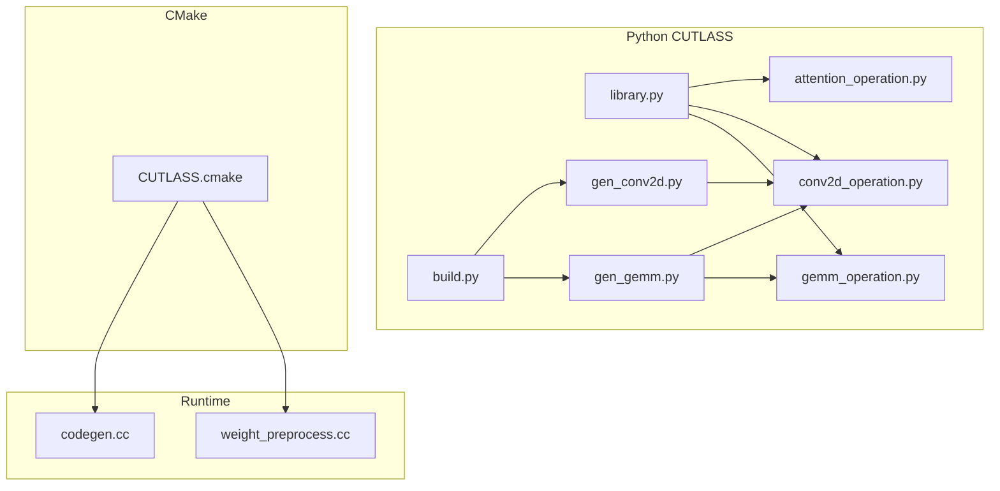
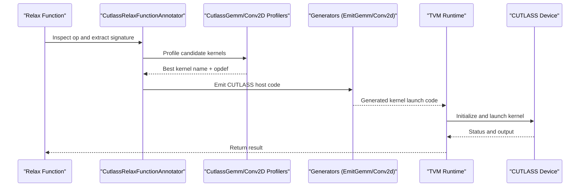
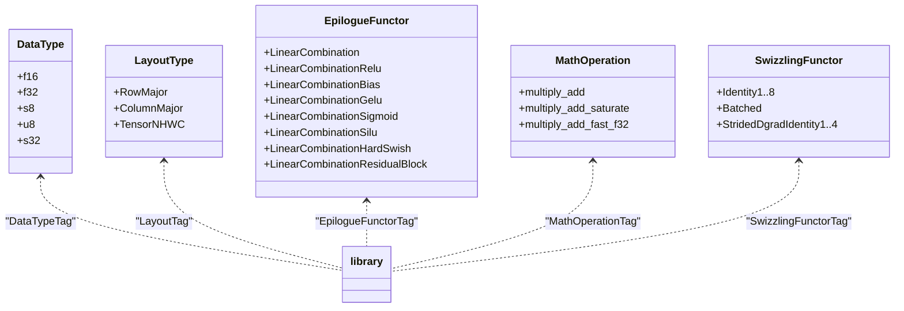
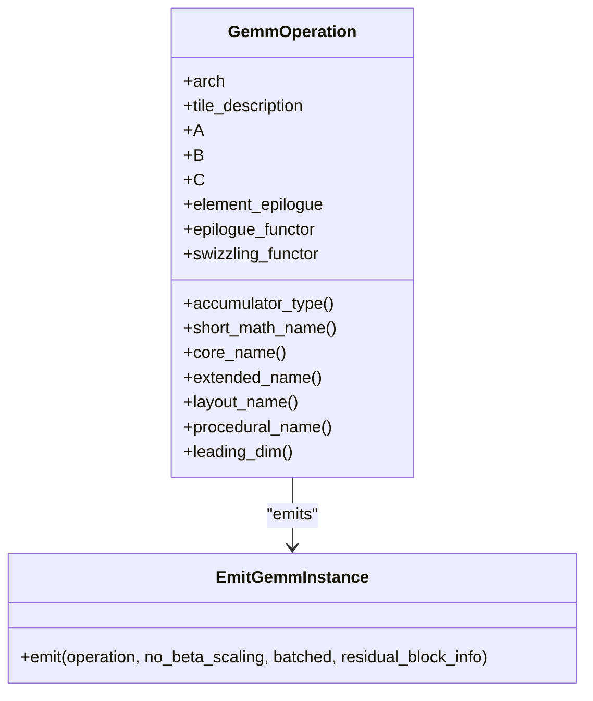
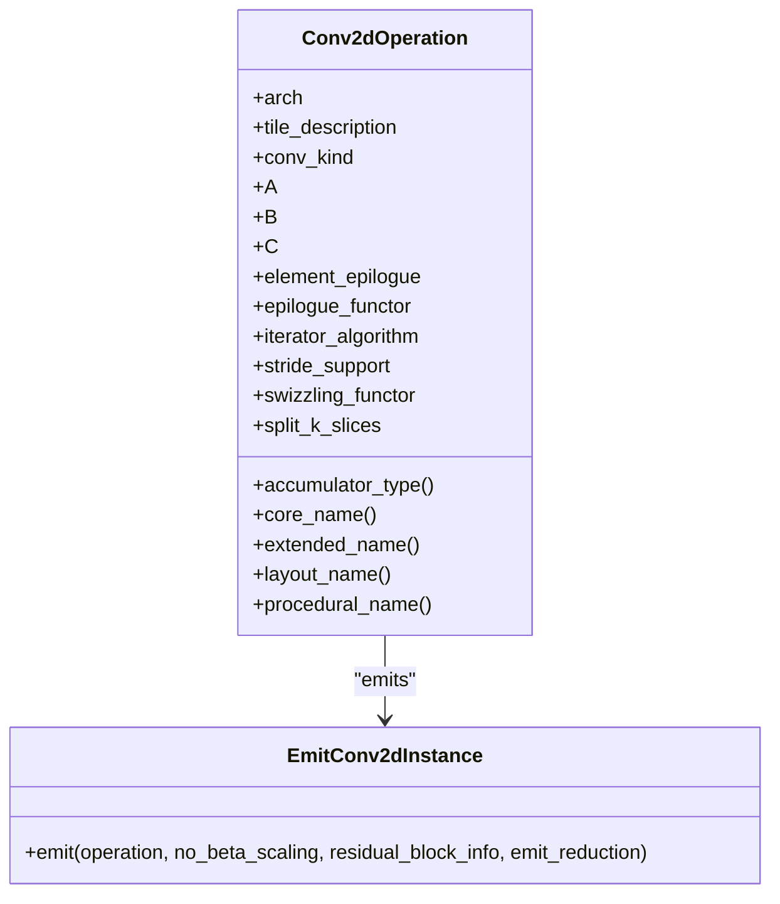
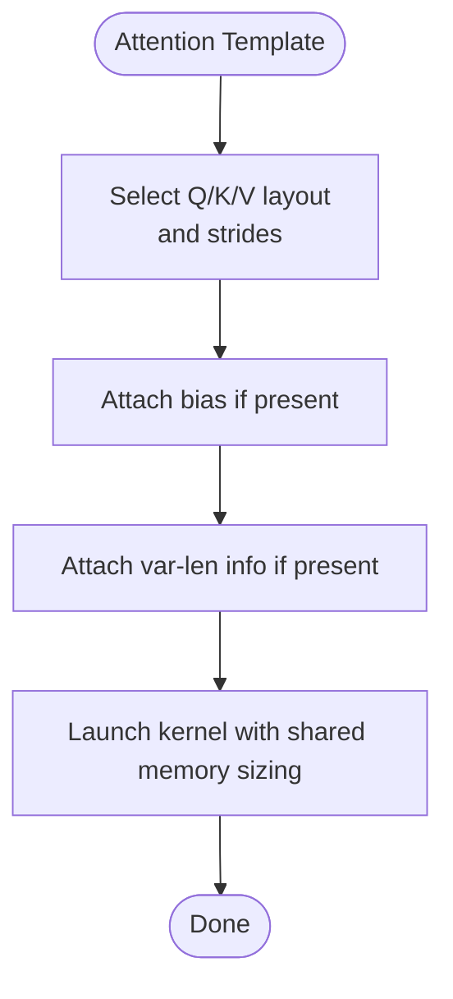
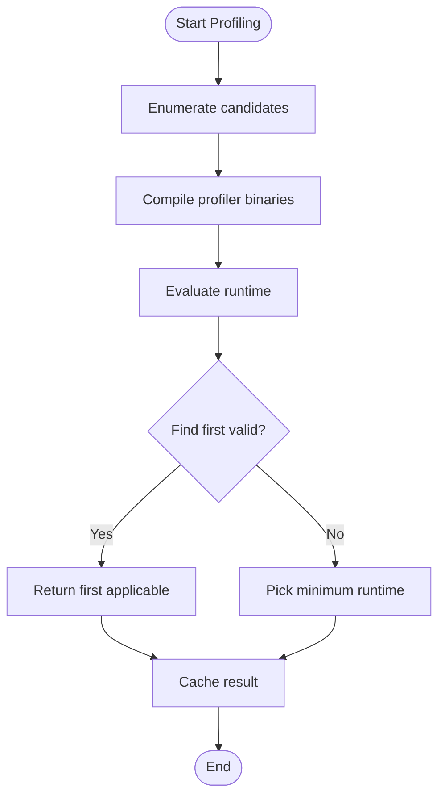
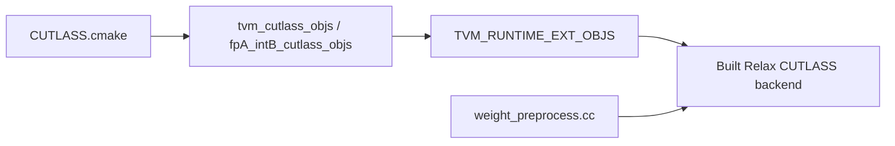
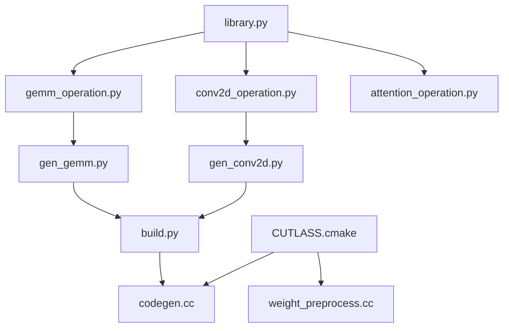

# CUTLASS Integration

<cite>
**Referenced Files in This Document**
- [CUTLASS.cmake](file://cmake/modules/contrib/CUTLASS.cmake)
- [__init__.py](file://python/tvm/contrib/cutlass/__init__.py)
- [library.py](file://python/tvm/contrib/cutlass/library.py)
- [gemm_operation.py](file://python/tvm/contrib/cutlass/gemm_operation.py)
- [conv2d_operation.py](file://python/tvm/contrib/cutlass/conv2d_operation.py)
- [attention_operation.py](file://python/tvm/contrib/cutlass/attention_operation.py)
- [gen_gemm.py](file://python/tvm/contrib/cutlass/gen_gemm.py)
- [gen_conv2d.py](file://python/tvm/contrib/cutlass/gen_conv2d.py)
- [build.py](file://python/tvm/contrib/cutlass/build.py)
- [codegen.cc](file://src/relax/backend/contrib/cutlass/codegen.cc)
- [weight_preprocess.cc](file://src/runtime/contrib/cutlass/weight_preprocess.cc)
- [test_transform_allocate_workspace.py](file://tests/python/relax/test_transform_allocate_workspace.py)
</cite>

## Table of Contents
1. [Introduction](#introduction)
2. [Project Structure](#project-structure)
3. [Core Components](#core-components)
4. [Architecture Overview](#architecture-overview)
5. [Detailed Component Analysis](#detailed-component-analysis)
6. [Dependency Analysis](#dependency-analysis)
7. [Performance Considerations](#performance-considerations)
8. [Troubleshooting Guide](#troubleshooting-guide)
9. [Conclusion](#conclusion)
10. [Appendices](#appendices)

## Introduction
This document explains how TVM integrates NVIDIA’s CUTLASS library to accelerate GEMM operations, convolution, and attention. It covers the CUTLASS operation wrappers, kernel generation and profiling, library initialization via CMake, and runtime integration. Practical guidance is included for configuration, performance benchmarking, and deployment across GPU architectures.

## Project Structure
TVM’s CUTLASS integration spans Python-side generators and profilers, CMake build integration, and runtime contributions:
- Python CUTLASS modules define data types, layouts, epilogue functors, and operation wrappers for GEMM, Conv2D, and attention.
- Generators emit CUTLASS host code and configure kernel templates.
- CMake builds CUTLASS runtime extensions and links third-party submodules.
- Runtime code implements pre-processing and packed functions for specialized kernels.

**Diagram sources**
- [CUTLASS.cmake:18-87](file://cmake/modules/contrib/CUTLASS.cmake#L18-L87)
- [library.py:28-302](file://python/tvm/contrib/cutlass/library.py#L28-L302)
- [gemm_operation.py:24-479](file://python/tvm/contrib/cutlass/gemm_operation.py#L24-L479)
- [conv2d_operation.py:24-553](file://python/tvm/contrib/cutlass/conv2d_operation.py#L24-L553)
- [attention_operation.py:24-328](file://python/tvm/contrib/cutlass/attention_operation.py#L24-L328)
- [gen_gemm.py:37-353](file://python/tvm/contrib/cutlass/gen_gemm.py#L37-L353)
- [gen_conv2d.py:41-393](file://python/tvm/contrib/cutlass/gen_conv2d.py#L41-L393)
- [build.py:43-908](file://python/tvm/contrib/cutlass/build.py#L43-L908)
- [codegen.cc](file://src/relax/backend/contrib/cutlass/codegen.cc)
- [weight_preprocess.cc:38-61](file://src/runtime/contrib/cutlass/weight_preprocess.cc#L38-L61)

**Section sources**
- [CUTLASS.cmake:18-87](file://cmake/modules/contrib/CUTLASS.cmake#L18-L87)
- [__init__.py:18-21](file://python/tvm/contrib/cutlass/__init__.py#L18-L21)

## Core Components
- Data types, layouts, and epilogue functors: central enums and tag mappings for CUTLASS templates.
- GEMM operation wrapper: constructs CUTLASS GEMM instances with configurable epilogue and swizzling.
- Conv2D operation wrapper: emits implicit GEMM-based Conv2D kernels with split-K support and residual blocks.
- Attention operation wrapper: generates fused multi-head attention host code and Flash Attention bindings.
- Kernel generators and profilers: enumerate candidate kernels, compile lightweight profilers, and select optimal configurations.
- Build and runtime integration: CMake toggles CUTLASS, compiles runtime objects, and exposes packed functions.

**Section sources**
- [library.py:32-302](file://python/tvm/contrib/cutlass/library.py#L32-L302)
- [gemm_operation.py:24-479](file://python/tvm/contrib/cutlass/gemm_operation.py#L24-L479)
- [conv2d_operation.py:24-553](file://python/tvm/contrib/cutlass/conv2d_operation.py#L24-L553)
- [attention_operation.py:24-328](file://python/tvm/contrib/cutlass/attention_operation.py#L24-L328)
- [gen_gemm.py:37-353](file://python/tvm/contrib/cutlass/gen_gemm.py#L37-L353)
- [gen_conv2d.py:41-393](file://python/tvm/contrib/cutlass/gen_conv2d.py#L41-L393)
- [build.py:43-908](file://python/tvm/contrib/cutlass/build.py#L43-L908)

## Architecture Overview
The integration follows a pipeline:
- Relax module partitions operations into CUTLASS-offloaded regions.
- The annotator extracts shapes/dtypes and queries profilers to select the best kernel.
- Generators emit CUTLASS host code and instantiate device kernels.
- CMake compiles CUTLASS runtime extensions and third-party components.
- Runtime executes kernels and handles pre-processing for specialized quantized matmuls.

**Diagram sources**
- [build.py:442-800](file://python/tvm/contrib/cutlass/build.py#L442-L800)
- [gen_gemm.py:194-353](file://python/tvm/contrib/cutlass/gen_gemm.py#L194-L353)
- [gen_conv2d.py:184-393](file://python/tvm/contrib/cutlass/gen_conv2d.py#L184-L393)
- [gemm_operation.py:149-275](file://python/tvm/contrib/cutlass/gemm_operation.py#L149-L275)
- [conv2d_operation.py:138-346](file://python/tvm/contrib/cutlass/conv2d_operation.py#L138-L346)

## Detailed Component Analysis

### Data Types, Layouts, and Epilogues
- Enumerations define supported data types, layouts (RowMajor, ColumnMajor, TensorNHWC), opcode classes, and epilogue functors.
- Tag mappings translate enums to CUTLASS C++ types.
- Utilities provide substitution helpers for template instantiation.

**Diagram sources**
- [library.py:32-302](file://python/tvm/contrib/cutlass/library.py#L32-L302)

**Section sources**
- [library.py:32-302](file://python/tvm/contrib/cutlass/library.py#L32-L302)

### GEMM Operation Wrapper
- Constructs operation descriptors with tile shapes, alignments, and swizzling.
- Emits CUTLASS GEMM device kernel definitions and Arguments initialization.
- Supports residual blocks, bias, and split-K via epilogue customization.

**Diagram sources**
- [gemm_operation.py:24-275](file://python/tvm/contrib/cutlass/gemm_operation.py#L24-L275)

**Section sources**
- [gemm_operation.py:24-479](file://python/tvm/contrib/cutlass/gemm_operation.py#L24-L479)

### Conv2D Operation Wrapper
- Describes Conv2D kernels with iterator algorithm, stride support, and split-K.
- Emits implicit GEMM-based Conv2D kernels and optional split-K reduction.
- Handles residual blocks and bias-like broadcasts.

**Diagram sources**
- [conv2d_operation.py:24-346](file://python/tvm/contrib/cutlass/conv2d_operation.py#L24-L346)

**Section sources**
- [conv2d_operation.py:24-553](file://python/tvm/contrib/cutlass/conv2d_operation.py#L24-L553)

### Attention Operation Wrapper
- Generates fused multi-head attention host code with configurable heads, sequence lengths, and masking.
- Provides Flash Attention forward passes for contiguous and stacked QKV inputs.
- Supports variable-length sequences and windowed attention.

**Diagram sources**
- [attention_operation.py:24-328](file://python/tvm/contrib/cutlass/attention_operation.py#L24-L328)

**Section sources**
- [attention_operation.py:24-328](file://python/tvm/contrib/cutlass/attention_operation.py#L24-L328)

### Kernel Generation and Profiling
- GEMM and Conv2D profilers enumerate candidate kernels, compile lightweight evaluators, and select the fastest configuration.
- Default kernels are cached and reused for dynamic shapes.
- Support for split-K, residual blocks, and bias scaling is integrated into templates.

**Diagram sources**
- [gen_gemm.py:194-353](file://python/tvm/contrib/cutlass/gen_gemm.py#L194-L353)
- [gen_conv2d.py:184-393](file://python/tvm/contrib/cutlass/gen_conv2d.py#L184-L393)

**Section sources**
- [gen_gemm.py:194-353](file://python/tvm/contrib/cutlass/gen_gemm.py#L194-L353)
- [gen_conv2d.py:184-393](file://python/tvm/contrib/cutlass/gen_conv2d.py#L184-L393)

### Build and Runtime Integration
- CMake enables CUTLASS when both CUDA and CUTLASS flags are set, adds runtime objects, and includes third-party submodules.
- Runtime code registers packed functions for weight preprocessing and integrates CUTLASS kernels into the TVM runtime.

**Diagram sources**
- [CUTLASS.cmake:18-87](file://cmake/modules/contrib/CUTLASS.cmake#L18-L87)
- [weight_preprocess.cc:38-61](file://src/runtime/contrib/cutlass/weight_preprocess.cc#L38-L61)

**Section sources**
- [CUTLASS.cmake:18-87](file://cmake/modules/contrib/CUTLASS.cmake#L18-L87)
- [weight_preprocess.cc:38-61](file://src/runtime/contrib/cutlass/weight_preprocess.cc#L38-L61)

## Dependency Analysis
- Python CUTLASS modules depend on shared enums and tag mappings in library.py.
- Generators depend on operation wrappers and profiler emitters.
- Build orchestrates profilers and updates Relax functions with attributes containing kernel names and generated code.
- CMake depends on CUTLASS submodule locations and NVCC flags.

**Diagram sources**
- [library.py:28-302](file://python/tvm/contrib/cutlass/library.py#L28-L302)
- [gemm_operation.py:24-479](file://python/tvm/contrib/cutlass/gemm_operation.py#L24-L479)
- [conv2d_operation.py:24-553](file://python/tvm/contrib/cutlass/conv2d_operation.py#L24-L553)
- [attention_operation.py:24-328](file://python/tvm/contrib/cutlass/attention_operation.py#L24-L328)
- [gen_gemm.py:37-353](file://python/tvm/contrib/cutlass/gen_gemm.py#L37-L353)
- [gen_conv2d.py:41-393](file://python/tvm/contrib/cutlass/gen_conv2d.py#L41-L393)
- [build.py:442-800](file://python/tvm/contrib/cutlass/build.py#L442-L800)
- [CUTLASS.cmake:18-87](file://cmake/modules/contrib/CUTLASS.cmake#L18-L87)
- [codegen.cc](file://src/relax/backend/contrib/cutlass/codegen.cc)
- [weight_preprocess.cc:38-61](file://src/runtime/contrib/cutlass/weight_preprocess.cc#L38-L61)

**Section sources**
- [build.py:442-800](file://python/tvm/contrib/cutlass/build.py#L442-L800)
- [CUTLASS.cmake:18-87](file://cmake/modules/contrib/CUTLASS.cmake#L18-L87)

## Performance Considerations
- Automatic kernel selection: profilers evaluate candidate kernels and choose the fastest configuration per workload.
- Alignment constraints: kernels are constrained by data type and dimension alignment; profilers filter candidates accordingly.
- Split-K: parallel reduction for wgrad; increases workspace but improves throughput for large K.
- Fast math: optional flag toggles fast math modes during compilation.
- Workspace sizing: attention kernels dynamically allocate accumulator buffers when needed.

[No sources needed since this section provides general guidance]

## Troubleshooting Guide
Common issues and resolutions:
- Shape compatibility for batched matmul: certain batch stride combinations are unsupported; TVM validates shapes and raises errors for incompatible cases.
- CUTLASS availability: ensure the CUTLASS custom codegen is enabled and visible to Relax.
- Compilation flags: verify CUDA version and NVCC flags; CMake sets gencode and include paths for CUTLASS headers.
- Attention workspace: when using fused attention with accumulation buffers, ensure sufficient workspace or allow dynamic allocation.

**Section sources**
- [build.py:43-908](file://python/tvm/contrib/cutlass/build.py#L43-L908)
- [build.py:407-440](file://python/tvm/contrib/cutlass/build.py#L407-L440)
- [attention_operation.py:105-159](file://python/tvm/contrib/cutlass/attention_operation.py#L105-L159)

## Conclusion
TVM’s CUTLASS integration provides a robust framework for offloading high-performance GEMM, convolution, and attention operations. Through automated kernel selection, flexible epilogue functors, and runtime pre-processing, it achieves significant performance improvements across modern NVIDIA GPUs. Proper configuration of data types, layouts, and split-K settings yields optimal results for diverse workloads.

[No sources needed since this section summarizes without analyzing specific files]

## Appendices

### Supported Data Types and Layouts
- Data types: float16, float32, int8, uint8, int32.
- Layouts: RowMajor, ColumnMajor, TensorNHWC.
- Epilogue functors: linear combination, ReLU, GELU, SiLU, hardswish, sigmoid, residual block variants.

**Section sources**
- [library.py:32-302](file://python/tvm/contrib/cutlass/library.py#L32-L302)

### Hardware Compatibility and Compute Capability
- CUTLASS kernels are generated for specific SM targets; profilers and defaults are indexed by compute capability.
- CMake conditionally compiles architecture-specific runtime objects (e.g., FP8 kernels for SM 90a/100a).

**Section sources**
- [gen_gemm.py:176-191](file://python/tvm/contrib/cutlass/gen_gemm.py#L176-L191)
- [CUTLASS.cmake:59-70](file://cmake/modules/contrib/CUTLASS.cmake#L59-L70)

### Practical Configuration Examples
- Configure CUTLASS offload in Relax modules and annotate functions with kernel attributes for GEMM, Conv2D, and attention.
- Use the annotator to extract shapes and dtypes, then query profilers to select kernels.
- For attention, specify heads, sequence lengths, and mask types; optionally use Flash Attention forward passes.

**Section sources**
- [build.py:442-800](file://python/tvm/contrib/cutlass/build.py#L442-L800)
- [attention_operation.py:24-328](file://python/tvm/contrib/cutlass/attention_operation.py#L24-L328)

### Benchmarking Performance Gains
- Compare TVM with CUTLASS offload against baseline implementations by measuring end-to-end latency and throughput.
- Use the profiler cache to avoid repeated compilation overhead during experiments.
- Vary split-K factors and alignments to observe trade-offs between workspace and performance.

**Section sources**
- [gen_gemm.py:201-206](file://python/tvm/contrib/cutlass/gen_gemm.py#L201-L206)
- [gen_conv2d.py:192-196](file://python/tvm/contrib/cutlass/gen_conv2d.py#L192-L196)

### Deployment Considerations
- Enable CUTLASS via CMake flags and ensure third-party submodules are initialized.
- Pre-process weights for quantized kernels using registered packed functions.
- Validate attention workspace sizes and adjust for production memory constraints.

**Section sources**
- [CUTLASS.cmake:18-87](file://cmake/modules/contrib/CUTLASS.cmake#L18-L87)
- [weight_preprocess.cc:38-61](file://src/runtime/contrib/cutlass/weight_preprocess.cc#L38-L61)

### Attention Composite Functions in Tests
- TVM composites for attention include workspace size hints and fused operations for multi-head attention.

**Section sources**
- [test_transform_allocate_workspace.py:40-137](file://tests/python/relax/test_transform_allocate_workspace.py#L40-L137)